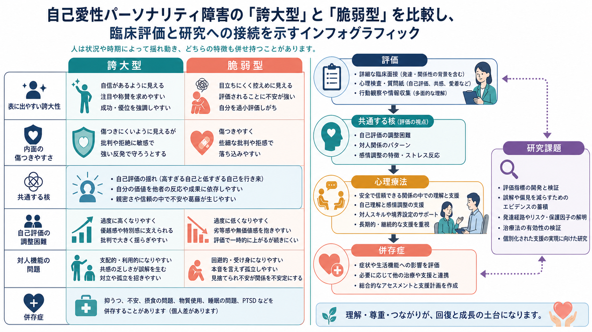
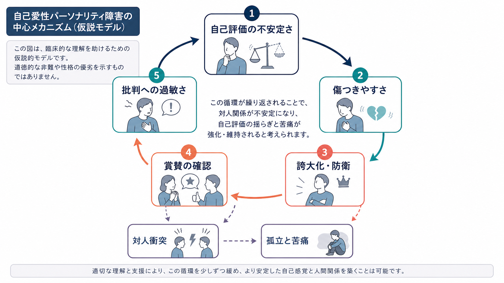

# 自己愛性パーソナリティ障害とは何か

## 要点

- 自己愛性パーソナリティ障害は、誇大性、過度な賞賛欲求、共感性の乏しさを中核とする持続的な対人・自己機能の障害として記述される[1]。
- ただし臨床像は「自信過剰な人」という単純な像に収まらない。誇大的で目立つ表現の背後に、自己評価の不安定さ、恥、傷つきやすさ、抑うつ、不安が併存することがある[2][3]。
- 診断名は人格を非難するラベルではなく、本人と周囲に生じている苦痛、対人機能、生活機能、併存症を評価し、支援計画を立てるための臨床的な入口である。
- 本記事は教育・研究目的の整理であり、個別の診断や治療指示ではない。診断や治療方針は専門家による総合評価が必要である。

## この記事で答える問い

- 自己愛性パーソナリティ障害は、日常語の「ナルシスト」と何が違うのか。
- 誇大性、賞賛欲求、共感性の乏しさは、どのように対人関係や生活機能の問題につながるのか。
- 「誇大型」と「脆弱型」という見方は、診断名そのものとどう違うのか。
- 臨床では何を評価し、どのような支援上の注意があるのか。

## まず結論

自己愛性パーソナリティ障害は、単に「自分が好きすぎる状態」ではない。DSM-5-TRでは、成人早期までに始まり複数の文脈にまたがる、誇大性、賞賛への強い欲求、共感性の乏しさを含む持続的パターンとして定義される[1]。臨床的に重要なのは、その特徴が本人の苦痛、親密な関係や職業機能の障害、怒りや恥の扱いにくさ、抑うつ・不安・物質使用などの併存問題と結びついているかである[2][4]。

したがって、評価の焦点は「性格が悪いか」ではなく、自己評価がどれほど不安定か、批判や拒絶にどのように反応するか、他者の視点をどの程度扱えるか、関係の中で何が繰り返されているか、生活上の損失がどこに出ているかに置かれる。

## 背景

「自己愛」は発達や社会生活の中で誰にでも一定程度みられる心理機能である。自尊心、承認欲求、自分の能力への信頼は、それ自体が病的なものではない。問題になるのは、自己評価を保つために過度な優越感、特別扱いの要求、他者の利用、批判への強い反応が固定化し、対人関係や生活機能に持続的な支障をきたす場合である[1][2]。

パーソナリティ障害の分類は変化している。DSM-5-TRでは自己愛性パーソナリティ障害がカテゴリー診断として残っている一方、DSM-5の代替モデルやICD-11では、自己機能と対人機能の障害、重症度、特性領域を組み合わせて理解する方向が強い[1][5][6]。この視点では、自己愛性の問題は「自己評価の安定性」「共感」「親密性」「反社会性や脱抑制などの特性」といった次元で把握される。

関連する分類の考え方は、[[DSMとICDは何が違うのか]]とも接続する。

## 基本概念

### DSM-5-TRにおける中核

DSM-5-TRの自己愛性パーソナリティ障害は、誇大性、賞賛欲求、共感性の乏しさを中核に、自己重要感の誇張、成功・権力・美・理想愛への空想、自分は特別であるという信念、過剰な賞賛要求、権利意識、対人利用、嫉妬、尊大な態度などの特徴から構成される[1]。診断では、これらが一時的な気分や状況反応ではなく、複数の場面で持続し、臨床的な苦痛や機能障害と結びつくかを見る。

### 誇大型と脆弱型

臨床研究では、自己愛性の表現には少なくとも二つの顔があるとされる。ひとつは、目立つ誇大性、権利意識、賞賛要求、傲慢さが前景に出る「誇大型」である。もうひとつは、恥、評価への過敏さ、回避、抑うつ、不安、自己価値の低さが前景に出る「脆弱型」である[2][3]。

ただし、これは公式診断名を二つに分けるという意味ではない。同じ人の中で、状況や関係性によって誇大性と傷つきやすさが揺れ動くことがある。臨床的には、目に見える尊大さだけでなく、内面の恥や傷つきやすさを評価に含めることが重要である[3]。

### 他のパーソナリティ障害との鑑別

自己愛性パーソナリティ障害は、同じクラスターBに含まれる[[境界性パーソナリティ障害とは何か]]、[[反社会性パーソナリティ障害とは何か]]、[[演技性パーソナリティ障害とは何か]]と重なって見えることがある。たとえば、情動の激しさは境界性、他者利用や規範軽視は反社会性、注目を求める振る舞いは演技性と重なる。鑑別では、自己評価の調整、共感、親密性、罪悪感や恥の扱い、持続的な対人パターンを総合的に見る[2]。

また、[[依存性パーソナリティ障害とは何か]]や[[強迫性パーソナリティ障害とは何か]]のように、承認欲求や完全主義が別の形で表れる病態との比較も必要になる。

## 仕組み

自己愛性パーソナリティ障害の仕組みは、単一の原因で説明できない。発達歴、気質、対人経験、文化的価値、現在のストレス、併存する精神疾患が相互に関係する。ここでは臨床的な理解に役立つ仮説モデルとして、自己評価の不安定さを中心に整理する。

### 自己評価の不安定さ

中心にあるのは、自己価値を安定して保つ難しさである。自分は特別で優れているという感覚と、自分は不十分で評価されないという感覚が揺れやすい。この揺れが強いと、他者からの賞賛、成功、地位、外的評価が自己評価の支えになりやすい[2][3]。

### 批判と拒絶への過敏さ

批判、拒絶、軽視、失敗は、単なる不快な出来事ではなく、自己価値全体への脅威として体験されることがある。その結果、怒り、軽蔑、相手の価値下げ、撤退、過度な自己弁護が起こりやすい。これは短期的には自己評価を守るが、長期的には信頼関係を損ない、孤立や抑うつを強める可能性がある[2][3]。

### 共感性の問題

共感性の乏しさは、単に「他人の気持ちが分からない」という一枚岩の問題ではない。他者の視点を理解する認知的能力が場面によって保たれていても、自己評価が脅かされる場面では、相手の感情や必要を考慮する余裕が下がることがある。ICD-11の人格障害モデルでも、自己機能と対人機能、とくに他者の視点理解や葛藤管理の障害が重視される[5][6]。

## 図解

上の2枚の図は、本文の要点を二つの角度からまとめている。

| 図 | ねらい | 読み方 |
|---|---|---|
| 図1 | 誇大型・脆弱型、評価、心理療法、併存症、研究課題の全体像 | 「誇大に見える面」と「傷つきやすい面」を固定的なタイプではなく、同じ病態の異なる表現として読む |
| 図2 | 自己評価の不安定さから対人衝突と孤立へ向かう循環 | 道徳的な非難ではなく、支援で介入できる悪循環として読む |

## 臨床・研究との接続

### 評価

臨床評価では、診断基準に当てはまる特徴だけでなく、生活機能、対人関係、職業・学業上の問題、自己評価の揺れ、怒りや恥の調整、希死念慮や自傷リスク、併存症を確認する。大規模疫学研究では、自己愛性パーソナリティ障害は気分障害、不安障害、物質使用障害、他のパーソナリティ障害と併存しやすく、機能障害とも関連することが報告されている[4]。

併存症としては、[[うつ病とは何か]]、[[双極性障害とは何か]]、物質使用障害、[[PTSDとは何か]]、[[複雑性PTSDとは何か]]などを丁寧に見る必要がある。とくに抑うつや希死念慮がある場合、自己愛性の問題だけに焦点を狭めず、安全性評価を優先する。

### 支援

自己愛性パーソナリティ障害に対して、特異的に確立した薬物療法はない。治療の中心は心理療法であり、薬物療法は抑うつ、不安、双極性障害、睡眠問題など併存症状に応じて検討される[7]。心理療法では、治療同盟を保ちながら、自己評価の揺れ、対人場面での反応、恥や怒りの扱い、他者の視点を取り入れる力を扱う[2][3]。

支援上の難しさは、本人が問題を「自分の内側の困難」としてよりも、「周囲が自分を正当に扱わない問題」として体験しやすい点にある。したがって、単に批判や説得を強めると、防衛や離脱を招きやすい。安全で一貫した枠組みの中で、行動の影響を具体的に扱い、本人の苦痛と周囲への影響を同時に見立てることが必要である[2][3]。

### 研究上の焦点

研究上は、カテゴリー診断だけでなく、自己機能・対人機能・特性次元・重症度を組み合わせた評価が重要になっている[5][6]。今後の課題は、誇大型と脆弱型の関係、発達歴や文化的要因、併存症との相互作用、心理療法の効果検証、スティグマを減らす評価方法をより明確にすることである。

## よくある誤解

### 「自己愛性パーソナリティ障害の人は、みな自信満々である」

誤りである。自信満々に見える表現の背後に、恥、自己不全感、評価への過敏さ、抑うつがあることがある[3]。外から見える誇大性だけで判断すると、脆弱型の苦痛を見逃しやすい。

### 「共感性が乏しいなら、治療や支援は無意味である」

これも単純化である。共感性の問題は臨床的な課題だが、対人場面を具体的に振り返り、自己評価の脅威が強まる場面を理解し、行動の選択肢を増やすことは支援目標になりうる[2][7]。

### 「日常語のナルシストと同じである」

日常語の「ナルシスト」は、外見への関心や自己主張の強さを広く指すことがある。しかし臨床診断では、持続性、広範性、苦痛、機能障害、鑑別診断、併存症を含めて評価する[1][6]。強い自己主張や成功志向だけでは診断にならない。

### 「診断名は相手を非難するための言葉である」

診断名は、対人関係の中で相手を断罪するラベルではない。本人の困難、周囲への影響、安全性、支援可能性を整理するための専門的な枠組みである。対人トラブルの場面で安易に診断名を貼ることは、理解よりも対立を強めやすい。

## 関連ノート

- [[DSMとICDは何が違うのか]]
- [[境界性パーソナリティ障害とは何か]]
- [[反社会性パーソナリティ障害とは何か]]
- [[演技性パーソナリティ障害とは何か]]
- [[依存性パーソナリティ障害とは何か]]
- [[強迫性パーソナリティ障害とは何か]]
- [[うつ病とは何か]]
- [[双極性障害とは何か]]
- [[PTSDとは何か]]
- [[複雑性PTSDとは何か]]

## MOC更新候補

- `content/00_MOC/MOC｜精神医学.md`
- `content/00_MOC/MOC｜総論・診断・面接.md`
- `content/00_MOC/MOC｜臨床実践・治療.md`

並列生成ジョブとの衝突を避けるため、本タスクではMOC本体は更新していない。

## 理解チェック

1. 自己愛性パーソナリティ障害の中核とされる三つの特徴は何か。
2. 誇大型と脆弱型を、固定的な二分類として扱いすぎると何を見落としやすいか。
3. 「日常語のナルシスト」と臨床診断の違いは何か。
4. 評価で併存症や安全性を確認する必要があるのはなぜか。

## 未解決問題

- 誇大型と脆弱型が同一人物の中でどのように移行するのかは、まだ十分に明確ではない。
- 自己愛性パーソナリティ障害に特化した心理療法の比較試験は限られており、どの治療要素がどの患者群に有効かの検証が必要である。
- 文化的背景、性別役割、社会的地位、SNS環境が自己愛性特徴の表現に与える影響は、今後さらに整理が必要である。
- 診断名がスティグマや対人非難として使われないための教育的表現が重要である。

## 参考文献

[1] American Psychiatric Association. (2022). *Diagnostic and Statistical Manual of Mental Disorders, Fifth Edition, Text Revision (DSM-5-TR).* American Psychiatric Association Publishing. https://doi.org/10.1176/appi.books.9780890425787

[2] Caligor, E., Levy, K. N., & Yeomans, F. E. (2015). Narcissistic personality disorder: Diagnostic and clinical challenges. *American Journal of Psychiatry, 172*(5), 415-422. https://doi.org/10.1176/appi.ajp.2014.14060723

[3] Ronningstam, E. (2011). Narcissistic personality disorder: A clinical perspective. *Journal of Psychiatric Practice, 17*(2), 89-99. https://doi.org/10.1097/01.pra.0000396060.67150.40

[4] Stinson, F. S., Dawson, D. A., Goldstein, R. B., Chou, S. P., Huang, B., Smith, S. M., Ruan, W. J., Pulay, A. J., Saha, T. D., Pickering, R. P., & Grant, B. F. (2008). Prevalence, correlates, disability, and comorbidity of DSM-IV narcissistic personality disorder: Results from the Wave 2 National Epidemiologic Survey on Alcohol and Related Conditions. *Journal of Clinical Psychiatry, 69*(7), 1033-1045. https://doi.org/10.4088/JCP.v69n0701

[5] Clark, L. A., Corona-Espinosa, A., Khoo, S., Kotelnikova, Y., Levin-Aspenson, H. F., Serapio-Garcia, G., & Watson, D. (2021). Preliminary scales for ICD-11 personality disorder: Self and interpersonal dysfunction plus five personality disorder trait domains. *Frontiers in Psychology, 12*, 668724. https://doi.org/10.3389/fpsyg.2021.668724

[6] Bach, B., First, M. B., Skodol, A. E., Christensen, S., & Simonsen, E. (2018). Application of the ICD-11 classification of personality disorders. *BMC Psychiatry, 18*, 351. https://doi.org/10.1186/s12888-018-1908-3

[7] StatPearls Publishing. (2026). Narcissistic Personality Disorder. *NCBI Bookshelf.* https://www.ncbi.nlm.nih.gov/books/NBK556001/
