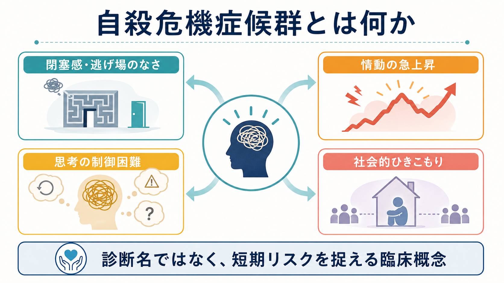
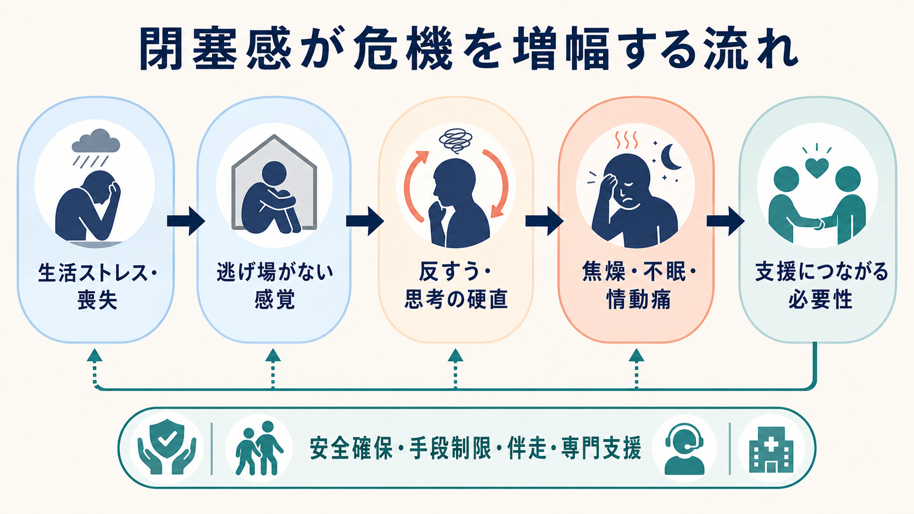
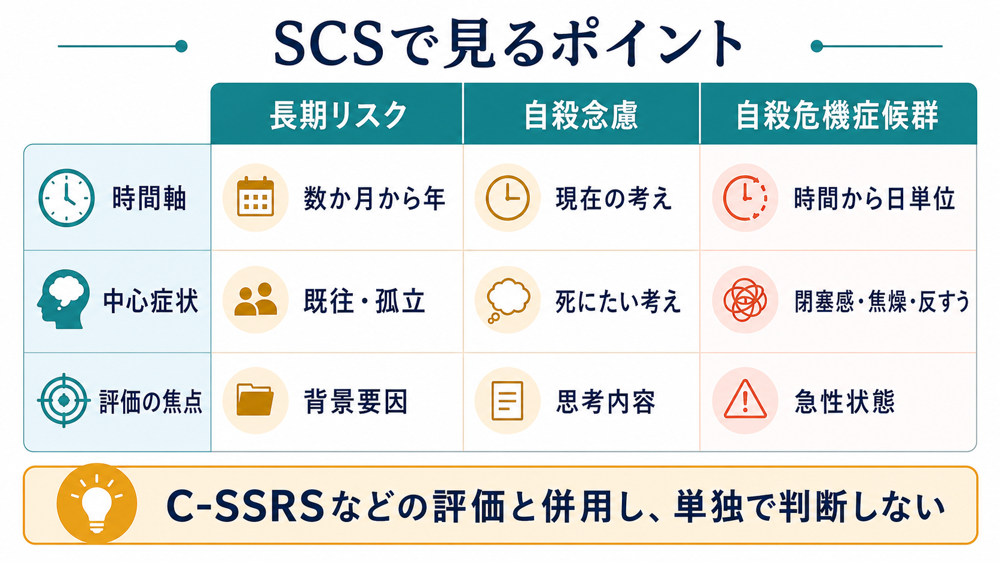

# 自殺危機症候群とは何か

## 要点

- 自殺危機症候群（Suicide Crisis Syndrome: SCS）は、逃げ場のなさ、切迫した閉塞感、焦燥、情動痛、反すう、思考の硬直、過覚醒、社会的ひきこもりなどがまとまって現れる、短期の自殺リスク上昇状態を捉えるための研究・臨床概念である[1][2]。
- 重要なのは、SCSが「死にたいという言葉があるか」だけではなく、「いま耐えがたい状況から逃げる必要があるのに逃げられない」と感じる急性状態に注目する点である[1][3]。
- 研究では、SCSは自殺念慮を超えて短期の自殺関連行動を予測する可能性が示されているが、個人レベルで将来の行動を正確に予言できるわけではない[2][4][5]。
- 臨床では、SCSを単独の診断ラベルとして使うより、[[気分障害における自殺リスクとは何か]]、[[自殺関連行動障害とは何か]]、[[非自殺性自傷とは何か]]、物質使用、睡眠、孤立、保護因子、手段へのアクセスを統合して評価する必要がある[6][7]。
- 本ノートは教育・研究目的の整理であり、個別の診断や治療指示ではない。差し迫った危険がある場合は、地域の救急・危機対応窓口や専門職へ直ちにつなぐ必要がある。

## この記事で答える問い

1. 自殺危機症候群は、従来の「自殺念慮」や「長期リスク要因」と何が違うのか。
2. 閉塞感、反すう、焦燥、不眠、社会的ひきこもりは、どのように短期リスクと結びつくのか。
3. 臨床・研究では、SCSをどのように評価や支援計画へ接続すればよいのか。

## まず結論

自殺危機症候群は、正式診断名として広く確立した疾患単位というより、「自殺リスクが時間から日単位で上がっているかもしれない状態」を見逃さないための枠組みである。中心にあるのは、耐えがたい生活状況や心理的苦痛から逃げたいという切迫感と、それにもかかわらず逃げ道がないという閉塞感である[1]。

この状態では、本人の思考は「ほかの可能性を検討する」方向ではなく、同じ苦痛や失敗や脅威を何度も反すうする方向へ狭まりやすい。そこに焦燥、不眠、情動の急上昇、社会的ひきこもりが重なると、助けを求める力や待つ力が弱まり、危機が急速に深まることがある[1][3][5]。

ただし、SCSは「この人は必ず自殺する」という予測装置ではない。むしろ、予測の限界を前提に、いま何を確認し、何を安全確保へ変換するかを整理するための臨床的レンズである。C-SSRSのような自殺念慮・自殺行動の構造化評価、NICEのような包括的心理社会的評価、WHOの自殺予防方針と組み合わせて使うのが実践的である[6][7][8]。

## 背景

自殺リスク評価では、過去の自殺企図、精神疾患、物質使用、孤立、失業、慢性痛、トラウマ、家族歴などの長期リスク要因が重視されてきた。これらは重要だが、短期の危機を十分に説明しないことがある。たとえば、長期リスクが高い人が常に同じ程度に危険なわけではなく、逆に背景リスクが目立ちにくい人でも、急性の喪失、羞恥、対人葛藤、睡眠崩壊、物質使用などが重なると危機が急に深まることがある[6][7]。

SCS研究は、この「危機が立ち上がる状態」を捉えようとする流れに位置づけられる。提案されているSCS基準では、中核に「Frantic Hopelessness/Entrapment」、つまり耐えがたい状況から今すぐ逃げる必要があるのに、逃げられない・終わらせられない・耐えられないと感じる状態が置かれる[1]。その周囲に、情動障害、認知制御の喪失、過覚醒、社会的ひきこもりが伴う。

この視点は、[[大うつ病性障害とは何か]]や[[うつ病とは何か]]の重症度評価と重なる部分を持つが、うつ病そのものの説明ではない。SCSは診断横断的であり、[[不安症群とは何か]]、[[PTSDとは何か]]、[[境界性パーソナリティ障害とは何か]]、[[アルコール使用障害とは何か]]、睡眠問題、急性ストレス反応などの文脈で現れうる。

## 基本概念

### 中核は「閉塞感」と「切迫感」

SCSの中心は、単なる悲しみや落ち込みではない。本人の主観では、「この状況は耐えられない」「すぐに逃げたい」「しかし逃げ道がない」という感覚が強くなる。この閉塞感は、心理学でいう entrapment、defeat、hopelessness と近いが、SCSでは特に急性の切迫感と結びついている[1][3]。

### 関連症状は四つの束で考える

提案されているSCSでは、閉塞感に加えて以下の関連症状群が重視される[1]。

| 症状群 | 見るポイント | 臨床での意味 |
|---|---|---|
| 情動障害 | 情動痛、急な気分変動、強い不安、急性の快感喪失 | 苦痛が「考える余地」を圧迫する |
| 認知制御の喪失 | 反すう、思考の硬直、否定的思考の洪水 | 選択肢が狭まり、別の見方に移りにくくなる |
| 過覚醒 | 焦燥、不眠、落ち着かなさ、身体的緊張 | 待つ力・相談する力が弱まりやすい |
| 社会的ひきこもり | 連絡を断つ、助けを拒む、孤立する | 保護因子へのアクセスが切れやすい |

### 自殺念慮とは同じではない

自殺念慮は「死にたい」「消えたい」「自分を殺したい」といった思考内容を指す。一方、SCSは思考内容だけでなく、切迫した危機状態の形を問う。したがって、強い自殺念慮がある人ではSCSの有無を確認する必要があるし、明確な言語化が乏しい場合でも、閉塞感、焦燥、不眠、反すう、孤立が急に強まっていれば注意が必要である[1][8]。

## 仕組み

SCSを機械的な因果モデルとして扱うのは危険だが、臨床的には次のような悪循環として理解しやすい。

1. 喪失、対人葛藤、失敗体験、羞恥、経済問題、疾患悪化などで心理的苦痛が急に上がる。
2. その苦痛が「逃げ場のなさ」と結びつき、本人の中で時間的余裕が失われる。
3. 反すうと思考の硬直により、問題解決の選択肢や支援要請の選択肢が見えにくくなる。
4. 焦燥、不眠、情動痛、過覚醒が加わり、衝動性や耐える力の低下が起こる。
5. 社会的ひきこもりや羞恥によって、家族、友人、医療者、支援機関との接点が細くなる。

この流れで重要なのは、危機の出口を「本人の意志の強さ」だけに求めないことである。SCSでは、認知・情動・身体覚醒・社会的接続が同時に狭まるため、通常なら使える対処法が一時的に使えなくなることがある。したがって支援は、説得や励ましだけでなく、安全確保、手段へのアクセス低下、睡眠と焦燥への介入、同伴、連絡先の具体化、フォローアップの短期化を含む必要がある[6][7]。

## 図解

SCSを評価に組み込むときは、「長期リスク」「自殺念慮」「急性危機状態」を分けて見ると混乱しにくい。

| 観点 | 長期リスク | 自殺念慮 | 自殺危機症候群 |
|---|---|---|---|
| 主な時間軸 | 数か月から年 | 現在から過去一定期間 | 時間から日単位 |
| 中心 | 既往、診断、孤立、物質使用、慢性痛など | 死にたい考え、計画、意図 | 閉塞感、焦燥、反すう、過覚醒、ひきこもり |
| 評価の焦点 | 背景脆弱性 | 思考内容と行動歴 | 急性状態と安全確保 |
| 実践上の使い方 | ベースラインの支援強度を決める | C-SSRSなどで構造化して確認する | 直近のフォロー密度と危機対応を決める |

## 臨床・研究との接続

### 評価では「念慮の有無」だけで止めない

C-SSRSは、自殺念慮の重症度、強度、自殺行動、致死性を構造化して評価する代表的尺度であり、研究と臨床で広く使われている[8]。しかし、尺度は面接を置き換えるものではない。SCSの視点を加えるなら、次のような問いを面接に組み込む。

- 「いまの状況から逃げたい感じはどのくらい強いか」
- 「逃げ道がない、終わらせられない、耐えられないという感覚はあるか」
- 「同じ考えが頭から離れない、考えが止まらない感じはあるか」
- 「眠れているか、焦燥や落ち着かなさが急に強くなっていないか」
- 「誰かに連絡する力が残っているか、連絡を避けていないか」

### 安全計画へ変換する

WHOの自殺予防方針では、手段へのアクセス制限、早期同定・評価・管理・フォローアップ、社会情動的スキル、責任あるメディア報道が重視される[6]。個別臨床では、SCSの評価結果を次のような具体的行動へ変換する。

| SCSで見えた危険 | 支援計画への変換 |
|---|---|
| 閉塞感が強い | 問題解決を急がず、まず危機時間を短く区切り、同伴と連絡先を具体化する |
| 反すうが止まらない | 一人で考え続ける時間を減らし、面接、電話、支援者との接点を増やす |
| 焦燥・不眠が強い | 睡眠、物質使用、身体疾患、薬剤影響を確認し、専門的評価につなぐ |
| 社会的ひきこもり | 本人の同意と安全を踏まえ、家族・支援者・医療機関との接続を調整する |
| 手段へのアクセスがある | 具体的な安全確保とアクセス低下を優先する |

NICEは、自傷や自殺リスクに関して、単純なリスク階層やスコアだけで将来の自殺・再自傷・治療提供・退院可否を決めないよう勧告している[7]。これはSCSにも当てはまる。SCSは「高・中・低」のラベルを貼る道具ではなく、本人のニーズ、安全、支援可能性を具体化する道具として使うべきである。

### 研究上の位置づけ

SCSに関する系統的レビューでは、2017年から2022年までの研究が整理され、提案された症候群の一次元構造や短期自殺関連行動に対する予測妥当性を支持する結果が報告されている[2]。また、ネットワーク分析やSCI-2の検証研究では、閉塞感、情動障害、認知制御の喪失、過覚醒、社会的ひきこもりを測定する方向で研究が進んでいる[3][5]。

一方で、研究は米国の高リスク臨床サンプルに偏りやすく、文化差、年齢差、プライマリケアや地域支援での妥当性、既存尺度との使い分け、介入方針をどこまで変えられるかは未解決である[1][2]。したがって、現時点では「有望だが、万能ではない短期リスク概念」と位置づけるのが妥当である。

## よくある誤解

### 誤解1: SCSは正式な精神疾患名として確立している

SCSはDSMなどで広く確立した正式診断名として扱われているわけではない。研究では診断候補・臨床概念として検討されているが、現時点では診断名として断定するより、短期リスクを把握するための枠組みとして使うのが安全である[1][2]。

### 誤解2: 自殺念慮がなければSCSではない

SCSは自殺念慮と強く関係するが、概念の焦点は「閉塞感を中心とする急性危機状態」にある。明確な死にたい気持ちを語らない場合でも、逃げ場のなさ、焦燥、不眠、反すう、孤立が急速に強まっているなら、支援者は危機として扱う必要がある[1][3]。

### 誤解3: SCSがあると必ず自殺行動が起こる

SCSはリスクを高めうる状態であり、決定論ではない。研究は群レベルの予測妥当性を示すが、個人の短期行動を正確に予言することは難しい[2][4]。臨床で重要なのは、予言ではなく、危機を下げる行動へ早くつなぐことである。

### 誤解4: 評価尺度だけで対応を決めればよい

C-SSRSやSCI-2のような尺度は重要だが、本人の文脈、生活状況、手段へのアクセス、支援者、文化的背景、身体疾患、物質使用、睡眠を含む面接を置き換えない[7][8]。

## 関連ノート

既存ノート:

- [[気分障害における自殺リスクとは何か]]
- [[自殺関連行動障害とは何か]]
- [[非自殺性自傷とは何か]]
- [[うつ病とは何か]]
- [[大うつ病性障害とは何か]]
- [[不眠障害とは何か]]
- [[不安症群とは何か]]
- [[PTSDとは何か]]
- [[アルコール使用障害とは何か]]
- [[境界性パーソナリティ障害とは何か]]

MOC更新候補:

- `content/00_MOC/MOC｜精神医学.md`
- `content/00_MOC/MOC｜臨床実践・治療.md`
- `content/00_MOC/MOC｜総論・診断・面接.md`

今後の作成候補:

- 自殺念慮とは何か
- 自殺リスク評価では何を聞くべきか
- 安全計画とは何か
- クライシスプランとは何か
- 心理的閉塞感とは何か
- 反すうと思考の硬直はどう危機を強めるのか

## 理解チェック

1. SCSの中心にある「閉塞感」は、単なる抑うつ気分とどう違うか。
2. 自殺念慮が明確でない場合でも、SCSの観点から確認すべき急性サインは何か。
3. 長期リスク要因、自殺念慮、SCSを分けて評価する利点は何か。
4. SCSの評価結果を、安全確保やフォローアップ計画へどう変換できるか。
5. なぜSCSを「予測装置」ではなく「危機対応の枠組み」として扱う必要があるか。

## 未解決問題

- SCSの基準が、文化、年齢、医療制度、地域支援の違いを越えてどこまで妥当か。
- SCI-2などの尺度が、臨床現場で支援計画やアウトカム改善にどこまで寄与するか。
- SCSとacute suicidal affective disturbance、自殺関連行動障害、NSSI、うつ病、不安症、PTSD、物質使用との境界をどう整理するか。
- 危機状態の評価を、過剰な監視やスティグマではなく、本人の安全と尊厳を守る支援へどう変換するか。

## 参考文献

[1] Galynker, I., Cohen, L. J., Prekas, A. S., Bloch-Elkouby, S., King, M., & Apter Levy, Y. (2025). Suicide Crisis Syndrome: examining supporting evidence and barriers to diagnostic validity. *Frontiers in Psychiatry*, 16, 1627463. https://doi.org/10.3389/fpsyt.2025.1627463

[2] Melzer, L., Forkmann, T., & Teismann, T. (2024). Suicide Crisis Syndrome: A systematic review. *Suicide and Life-Threatening Behavior*, 54(3), 556-574. https://doi.org/10.1111/sltb.13065

[3] Bloch-Elkouby, S., Gorman, B., Schuck, A., Barzilay, S., Calati, R., Cohen, L. J., Begum, F., & Galynker, I. (2020). The suicide crisis syndrome: A network analysis. *Journal of Counseling Psychology*, 67(5), 595-607. https://doi.org/10.1037/cou0000423

[4] Bafna, A., Rogers, M. L., & Galynker, I. (2022). Predictive validity and symptom configuration of proposed diagnostic criteria for the Suicide Crisis Syndrome: A replication study. *Journal of Psychiatric Research*, 156, 228-235. https://doi.org/10.1016/j.jpsychires.2022.10.027

[5] Bloch-Elkouby, S., Barzilay, S., Gorman, B., Lawrence, O. C., Rogers, M. L., Richards, J., et al. (2021). The revised suicide crisis inventory (SCI-2): Validation and assessment of prospective suicidal outcomes at one month follow-up. *Journal of Affective Disorders*, 295, 1280-1291. https://doi.org/10.1016/j.jad.2021.08.048

[6] World Health Organization. (2021). *LIVE LIFE: An implementation guide for suicide prevention in countries*. https://www.who.int/publications/i/item/9789240026629

[7] National Institute for Health and Care Excellence. (2022). *Self-harm: assessment, management and preventing recurrence* (NICE guideline NG225). https://www.nice.org.uk/guidance/ng225

[8] Posner, K., Brown, G. K., Stanley, B., Brent, D. A., Yershova, K. V., Oquendo, M. A., Currier, G. W., Melvin, G. A., Greenhill, L., Shen, S., & Mann, J. J. (2011). The Columbia-Suicide Severity Rating Scale: Initial validity and internal consistency findings from three multisite studies with adolescents and adults. *American Journal of Psychiatry*, 168(12), 1266-1277. https://doi.org/10.1176/appi.ajp.2011.10111704
