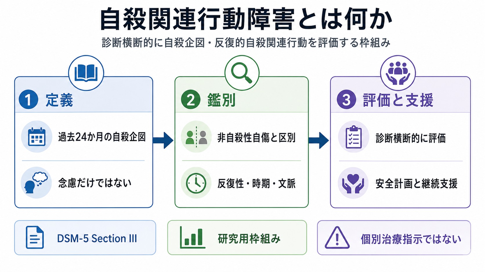
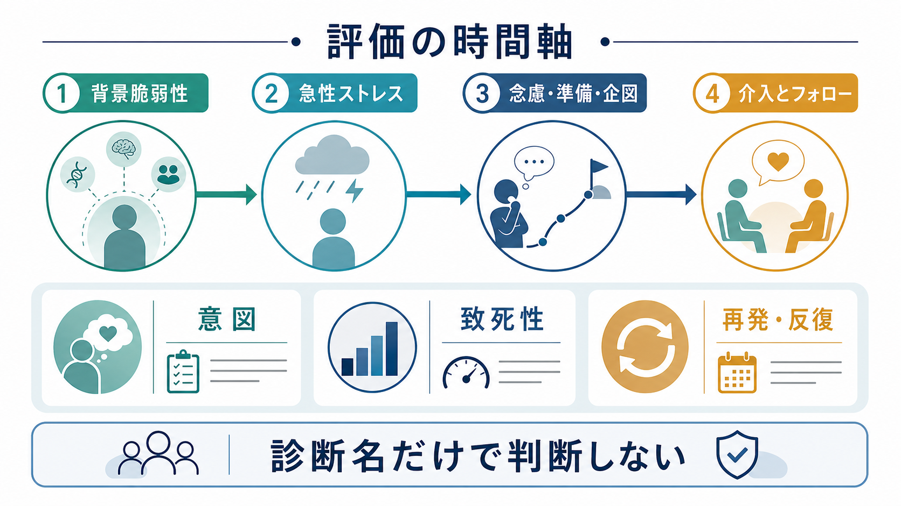

# 自殺関連行動障害とは何か

## 要点

- 自殺関連行動障害（Suicidal Behavior Disorder: SBD）は、DSM-5 で「今後の研究のための条件」として提案された、自殺企図を診断横断的に記録・研究するための枠組みである[2][3]。
- 中核は「過去24か月以内の自殺企図」であり、[[希死念慮とは何か]]や準備行動だけでは該当しない。自殺意図を伴わない[[自傷と自殺企図はどう違うのか|非自殺性自傷]]とも区別される[2][3]。
- DSM-5-TR では独立した精神疾患としては採用されず、「臨床的関与の対象となりうる他の状態」として、自殺行動の現在・既往を記録する方向へ移された[3]。
- この枠組みの利点は、[[うつ病とは何か]]、[[双極性障害とは何か]]、[[境界性パーソナリティ障害とは何か]]、[[PTSDとは何か]]、[[物質使用障害とは何か]]などをまたいで、自殺企図の時期、反復性、意図、致死性、支援ニーズを明示できる点にある[3][6]。
- ただし、SBD というラベルだけで現在の自殺リスクを予測できるわけではない。安全評価、保護因子、支援関係、アクセス可能な手段、急性ストレス、併存症を含む包括的評価が必要である[1][5][8]。

## この記事で答える問い

1. 自殺関連行動障害とは、どのような診断・研究上の枠組みか。
2. 自殺念慮、準備行動、自殺企図、非自殺性自傷はどう区別されるか。
3. なぜ既存の精神疾患名だけではなく、診断横断的に自殺関連行動を評価する必要があるか。
4. 臨床と研究では、この枠組みをどこまで使い、どこから慎重に扱うべきか。

## まず結論

自殺関連行動障害は、「自殺したい気持ちがある人に新しい診断名を付ける」ための単純なラベルではない。むしろ、自殺企図という行動を、うつ病やパーソナリティ障害などの主診断に埋もれさせず、時期・意図・反復性・文脈・危険度・支援ニーズとして記録するための診断横断的な言語である[2][6]。

一方で、DSM-5-TR では SBD は独立した精神疾患としては維持されなかった。理由は、過去の自殺企図という単一の行動だけでは現在の危険度を十分に示さないこと、背景原因が多様であること、診断ラベルがスティグマを増やす懸念があることだった[3]。したがって、実践上は「SBD か否か」だけで判断せず、[[自殺リスク評価では何を聞くべきか]]、[[クライシスプランとは何か]]、[[精神科診療における保護因子とは何か]]と接続して扱う必要がある。

## 背景

WHO は、自殺を世界的な公衆衛生課題として位置づけ、毎年72万人以上が自殺で亡くなり、1件の自殺の背後には多数の自殺企図があると整理している。過去の自殺企図は、一般人口における重要なリスク因子である[1]。

精神医学では長く、自殺念慮や自殺企図は主に[[大うつ病性障害とは何か]]や[[境界性パーソナリティ障害とは何か]]の症状・関連特徴として扱われてきた。しかし、自殺企図は[[統合失調症とは何か]]、[[アルコール使用障害とは何か]]、[[PTSDとは何か]]、身体疾患、慢性疼痛、対人喪失、社会的孤立など、多くの条件を横断して生じる[1][6]。

このため、Oquendo と Baca-Garcia は、自殺行動を別個に記録することで、医療記録での見落としを減らし、二次・三次予防に役立てられると論じた[6]。DSM-5 の SBD 提案は、この発想を操作的診断に近づける試みだった[2]。

## 基本概念

### DSM-5 で提案された中核

DSM-5 の提案では、SBD の中心は過去24か月以内の自殺企図である。ここでいう自殺企図は、行動開始時点で本人が自分の死につながると予期していた一連の自己開始行動を指す[2][3]。

提案基準では、少なくとも次の除外が重要になる。

- 非自殺性自傷ではない。
- 自殺念慮や準備行動だけには適用しない。
- せん妄や混乱状態で開始された行動ではない。
- 政治的・宗教的目的だけで行われた行動ではない。

DSM-5 では、最近12か月以内の企図を「現在」、12-24か月以内を「早期寛解」として区別する指定子も提案された[2][3]。

### 自殺念慮、準備行動、自殺企図の違い

[[自殺念慮と自殺企図は何が違うのか]]で扱うように、念慮は思考・欲求・計画の領域であり、企図は実際の行動を含む。C-SSRS は、念慮、準備行動、実際の企図、中断された企図、自ら中止した企図、非自殺性自傷を区別して評価する代表的な尺度である[4]。

この区別が重要なのは、同じ「自殺リスクあり」でも、評価すべき時間軸と支援の優先順位が変わるからである。念慮だけの場合は頻度、持続時間、制御可能性、抑止因子、理由を丁寧に聞く。準備行動や企図がある場合は、意図、致死性、アクセス可能な手段、救助可能性、直近の変化、再発可能性をより具体的に評価する[4][5]。

### 非自殺性自傷との境界

非自殺性自傷は、死を目的とせず、苦痛の調整、感情の切り替え、対人葛藤の処理などを目的として行われる自己損傷行動を指す。方法が外見上似ていても、自殺企図とは意図が異なる[3][7]。

ただし、臨床では境界が常に明瞭とは限らない。本人の説明、行動の文脈、予期された結果、致死性、救助を求めたか、過去の反復パターン、行動後の感情変化を合わせて評価する必要がある。ここで大切なのは、本人の語りを疑うことではなく、意図と危険度を分けて丁寧に理解することである。

## 仕組み

自殺関連行動を SBD 的に見るときの中心は、「診断名」ではなく「時間軸」と「行動の性質」である。

1. 背景脆弱性  
   遺伝的・発達的要因、過去のトラウマ、慢性疼痛、孤立、衝動性、絶望感、物質使用、過去の企図などが長期的な脆弱性を作る[1][8]。

2. 急性ストレス  
   喪失、対人葛藤、経済問題、身体疾患の悪化、睡眠破綻、飲酒・薬物使用、解離や混乱、強い羞恥や怒りが、短期的な危機を作る[1][5]。

3. 念慮から行動への移行  
   自殺念慮、方法の検討、準備行動、中断・中止された企図、実際の企図は連続的に見えるが、臨床的には段階ごとに評価項目が異なる[4]。

4. 介入とフォロー  
   安全確保、危機対応、継続支援、心理社会的介入、併存症治療、家族・支援者との連携、手段へのアクセス低減が組み合わされる[1][5]。

## 図解

上の1枚目は、SBD を「定義」「鑑別」「評価と支援」の3つに分けて示している。SBD の要点は、過去24か月の自殺企図を中心に、非自殺性自傷や念慮のみの状態と区別しつつ、診断横断的に記録することである。

2枚目は、評価の時間軸を示している。自殺企図は突然の一事件としてだけでなく、背景脆弱性、急性ストレス、念慮・準備・企図、介入後のフォローという連続した過程として理解する必要がある。

## 臨床・研究との接続

### 臨床では「記録の精度」を上げるために使う

SBD 的な枠組みは、臨床では単独で診断を完結させるよりも、記録の精度を上げるために有用である。たとえば「[[うつ病とは何か]]」だけでは、過去の自殺企図がいつ、どの程度の意図と危険度を伴い、現在の安全計画にどう関係するかが見えにくい。

VA/DoD の自殺リスク診療ガイドラインも、急性リスクの同定、包括的な自殺リスク評価、急性リスク管理を分けて整理している[5]。これは SBD の有無だけでなく、現在の危機度と支援可能性を見立てる必要があることを示している。

### 研究では対象群を定義するために使う

2024年の系統的レビューでは、DSM-5 SBD に関する実証研究はまだ少なく、2013年から2023年までの検索で適格研究は14本だった[3]。主な研究テーマは、将来の自殺リスク予測、関連疾患との境界、測定尺度、病態生理、介入だった[3]。

重要なのは、SBD は研究対象群をそろえるには役立つ一方、臨床的予測力は限定的と評価されている点である[3]。自殺関連行動の予測研究全体でも、単一のリスク因子による長期予測は全体として弱く、包括的・反復的な評価が必要とされる[8]。

### 診断横断的視点が必要な理由

自殺企図は特定の診断に固有ではない。[[気分障害における自殺リスクとは何か]]、[[自傷を伴う境界性パーソナリティ障害とは何か]]、[[物質使用障害とは何か]]、[[統合失調症とは何か]]、[[PTSDとは何か]]など、複数の領域にまたがって生じる。

そのため、診断名だけで「高リスク」「低リスク」と判断するのではなく、次のような横断的項目を評価する。

| 評価項目 | 見るポイント |
|---|---|
| 時期 | 直近か、過去か、反復しているか |
| 意図 | 死を期待していたか、両価的だったか、別の目的が中心か |
| 致死性 | 実際の医学的危険度と、本人が予期した危険度 |
| 文脈 | 急性ストレス、物質使用、解離、孤立、対人葛藤 |
| 保護因子 | 支援者、治療関係、責任感、価値、将来目標、アクセス制限 |
| 支援計画 | 安全計画、危機時連絡先、フォロー頻度、併存症治療 |

## よくある誤解

### 誤解1: 自殺関連行動障害は正式な DSM-5-TR の精神疾患である

DSM-5 では研究用の候補として提案されたが、DSM-5-TR では独立した精神疾患として採用されず、自殺行動を臨床的関与の対象として記録する方向に整理された[3]。したがって、この記事では正式診断名としてではなく、研究・評価の枠組みとして扱う。

### 誤解2: 自殺念慮があれば SBD である

SBD の中心は自殺企図であり、念慮だけでは該当しない[2][3]。ただし、念慮が軽いという意味ではない。強い念慮、具体的計画、準備行動、抑止因子の乏しさは、緊急度の高い評価対象になる[4][5]。

### 誤解3: 非自殺性自傷は自殺リスクと無関係である

非自殺性自傷は自殺意図を伴わない点で自殺企図とは区別されるが、臨床的には自殺関連行動と併存しうる[3][7]。意図が異なることと、将来リスクを評価しなくてよいことは別である。

### 誤解4: 診断名が分かれば自殺リスクも分かる

診断名は重要な手がかりだが、現在のリスクは診断名だけでは決まらない。直近の変化、具体的計画、手段へのアクセス、物質使用、睡眠、支援者の有無、過去企図、保護因子を組み合わせて見る必要がある[5][8]。

### 誤解5: 評価は一度すれば十分である

自殺関連行動の危険度は変動する。とくに退院後、喪失後、飲酒・薬物使用後、治療中断時、強い羞恥や孤立が生じた時期には、評価を更新する必要がある[1][5]。

## 関連ノート

- [[自殺リスク評価では何を聞くべきか]]
- [[自殺念慮と自殺企図は何が違うのか]]
- [[自傷と自殺企図はどう違うのか]]
- [[希死念慮とは何か]]
- [[クライシスプランとは何か]]
- [[精神科診療における保護因子とは何か]]
- [[気分障害における自殺リスクとは何か]]
- [[自傷を伴う境界性パーソナリティ障害とは何か]]
- [[カテゴリ診断と次元診断は何が違うのか]]
- [[精神症状の横断的評価とは何か]]

## 理解チェック

1. SBD の中核基準は、自殺念慮ではなく何か。
2. 非自殺性自傷と自殺企図を分けるとき、最も重要な評価軸は何か。
3. DSM-5-TR で SBD が独立した精神疾患として維持されなかった理由は何か。
4. 「過去の自殺企図あり」という情報だけでは、なぜ現在のリスク評価として不十分なのか。
5. 診断横断的な評価では、診断名以外にどのような項目を見るべきか。

## 関連ノート候補

- 自殺関連行動の診断横断的評価
- C-SSRSとは何か
- 自殺企図後フォローアップとは何か
- 非自殺性自傷障害とは何か
- 自殺リスクの短期予測はなぜ難しいのか

## MOC更新候補

- [[MOC｜精神医学]]
- 将来的には「自殺・自傷・危機介入」系の小 MOC を作る場合、本記事を中核ノート候補にできる。

## 未解決問題

- SBD を独立した診断として復活させることが、記録精度や治療研究を改善するのか、それともスティグマを増やすのかは未確定である[3]。
- 過去24か月という時間枠が、臨床的に最適な境界かどうかは十分に確立していない[3]。
- 自殺企図、非自殺性自傷、準備行動、中断・中止された企図を、文化差や医療制度差を越えて一貫して測定する方法には課題が残る[3][4]。
- 単一の診断ラベルよりも、反復測定、デジタル表現型、機械学習、ケースフォーミュレーションをどう統合するかが今後の研究課題である[8]。

## 参考文献

[1] World Health Organization. (2025). *Suicide*. https://www.who.int/news-room/fact-sheets/detail/suicide

[2] Fehling, K. B., & Selby, E. A. (2021). Suicide in DSM-5: Current evidence for the proposed suicide behavior disorder and other possible improvements. *Frontiers in Psychiatry, 11*, 499980. https://doi.org/10.3389/fpsyt.2020.499980

[3] Oliogu, E., & Ruocco, A. C. (2024). DSM-5 suicidal behavior disorder: A systematic review of research on clinical utility, diagnostic boundaries, measures, pathophysiology and interventions. *Frontiers in Psychiatry, 15*, 1278230. https://doi.org/10.3389/fpsyt.2024.1278230

[4] The Columbia Lighthouse Project / Columbia University Department of Psychiatry. (n.d.). *Columbia-Suicide Severity Rating Scale (C-SSRS)*. https://www.columbiapsychiatry.org/research-labs/columbia-suicide-severity-rating-scale-c-ssrs

[5] U.S. Department of Veterans Affairs & U.S. Department of Defense. (2024). *VA/DoD Clinical Practice Guideline for Assessment and Management of Patients at Risk for Suicide*. https://www.healthquality.va.gov/guidelines/MH/srb/VADOD-CPG-Suicide-Risk-Full-CPG-2024_Final_508.pdf

[6] Oquendo, M. A., & Baca-Garcia, E. (2014). Suicidal behavior disorder as a diagnostic entity in the DSM-5 classification system: Advantages outweigh limitations. *World Psychiatry, 13*(2), 128-130. https://doi.org/10.1002/wps.20116

[7] Merck Manual Professional Edition. (2026). *Nonsuicidal Self-Injury*. https://www.merckmanuals.com/professional/psychiatric-disorders/anxiety-and-trauma-and-stressor-related-disorders/nonsuicidal-self-injury

[8] Franklin, J. C., Ribeiro, J. D., Fox, K. R., Bentley, K. H., Kleiman, E. M., Huang, X., Musacchio, K. M., Jaroszewski, A. C., Chang, B. P., & Nock, M. K. (2017). Risk factors for suicidal thoughts and behaviors: A meta-analysis of 50 years of research. *Psychological Bulletin, 143*(2), 187-232. https://doi.org/10.1037/bul0000084
