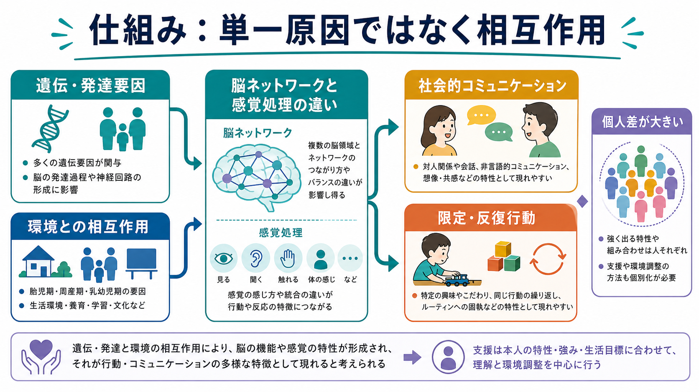
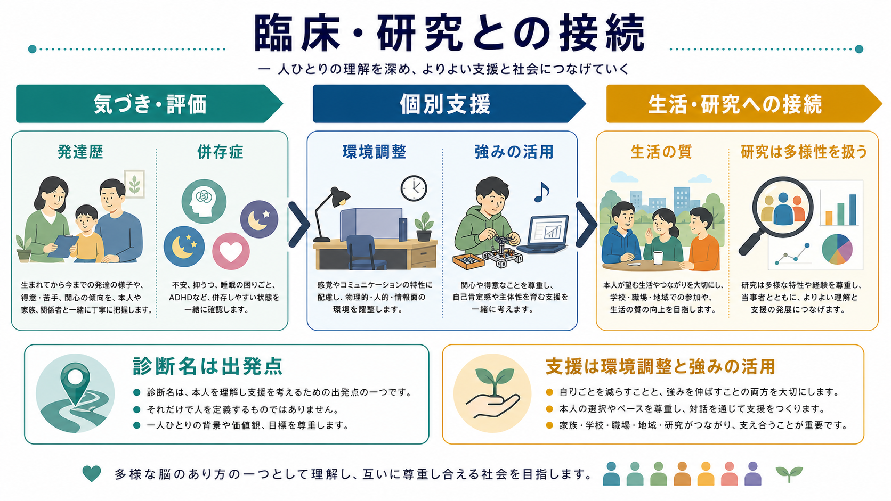

# 自閉スペクトラム症とは何か

## 要点

- 自閉スペクトラム症（autism spectrum disorder: ASD）は、発達早期からみられる社会的コミュニケーションの困難と、限定された反復的な行動・興味・活動、感覚特性を中核とする[[神経発達の異常は精神疾患にどう関わるのか|神経発達症]]である[1][2]。
- 「スペクトラム」という語は、重症度が一直線に並ぶという意味ではなく、言語、知的能力、感覚、運動、注意、生活環境、支援ニーズの組み合わせが人によって大きく異なることを示す[3][4]。
- ASD は単一原因で説明できる状態ではない。多くの遺伝要因、胎児期から乳幼児期の発達過程、脳ネットワークと感覚処理、学習環境が相互作用して、行動や困りごとの形として現れる[3][7]。
- 診断名は本人を一語で説明するラベルではなく、発達歴、現在の困りごと、強み、併存症、環境調整を考えるための出発点である[5][6]。
- 本記事は教育・研究目的の整理であり、個別の診断や治療指示ではない。生活上の困難が強い場合は、医療・心理・福祉・教育の専門職による評価が必要である。

## この記事で答える問い

1. ASD は、どのような特徴のまとまりとして定義されるのか。
2. 社会的コミュニケーションの困難と限定反復行動は、どのように理解できるのか。
3. 遺伝、発達、脳ネットワーク、感覚処理、環境はどのようにつながるのか。
4. 臨床評価や支援では、診断名のほかに何を見る必要があるのか。

## まず結論

ASD は、「人付き合いが苦手」という性格特徴だけでも、「こだわりが強い」という癖だけでもない。診断上は、社会的相互作用・非言語的コミュニケーション・関係形成の困難と、常同的な動きや話し方、同一性へのこだわり、限定された興味、感覚刺激への過敏または低反応などが、発達早期から存在し、生活上の機能に影響しているかを総合的に評価する[1][2]。

ただし、同じ ASD でも姿は大きく異なる。流暢に話すが暗黙の意図を読み取りにくい人もいれば、話し言葉以外の手段で意思表示する人もいる。音や光への過敏が強い人、予定変更が大きな負荷になる人、特定領域への深い関心が学習や仕事の強みになる人もいる。したがって、ASD を理解する中心は「平均像」ではなく、本人の特性と環境要求のミスマッチを見ることである[3][5]。

## 背景

ASD は小児期だけの診断ではなく、生涯にわたり特性の現れ方が変化しうる発達的な状態である[4][5]。幼児期には視線、共同注意、模倣、ことばの使い方、遊びの柔軟性、感覚反応などが気づきの入口になりやすい。学齢期以降は、友人関係、集団場面、学習課題、予定変更、感覚環境、二次的な不安や抑うつが問題として前景化することがある[2][5]。

近年の公衆衛生データでは、ASD と診断される人の割合は過去より高く報告されているが、これは実際の有病率変化だけでなく、診断概念の拡大、認知度の上昇、サービス利用、評価方法、性別や知的能力による見逃しの減少にも影響される[2][4]。特に、女性や知的障害を伴わない人では、表面上の適応や模倣により困難が見えにくい場合がある。

## 基本概念

### 社会的コミュニケーション

社会的コミュニケーションの困難には、会話の順番、相手の興味や感情への応答、比喩・皮肉・暗黙のルールの理解、表情・視線・身ぶりの読み取りや使い方、関係性に応じたふるまいの調整が含まれる[1][2]。これは単に「共感がない」という意味ではない。相手の意図を推論する手がかりが曖昧であったり、感覚負荷や不安が高かったり、言語化の仕方が多数派と異なったりすることで、相互理解がずれることがある。関連して、[[社会的認知とは何か]]の観点からは、顔、声、文脈、身体動作、予測を統合する過程の個人差として整理できる。

### 限定反復行動とこだわり

限定反復行動には、反復的な動き、同じ言い回し、物の並べ方、予定や手順への強いこだわり、限定された強い興味、感覚刺激への過敏または低反応が含まれる[1]。これらは外から見ると「やめればよい行動」に見えることがあるが、本人にとっては予測可能性を保つ、感覚負荷を下げる、注意を安定させる、関心領域を深く探索する機能を持つ場合がある。重要なのは、行動だけを切り取らず、その行動がどのような負荷や目的と結びついているかを見ることである。

### 感覚特性

DSM-5 以降、感覚刺激への過敏・低反応、感覚への強い関心は ASD の限定反復行動領域に含めて理解される[1]。音、光、匂い、触覚、味、痛み、内受容感覚の処理が日常生活の疲労、注意、対人場面の困難に影響することがある。[[感覚過敏は神経回路でどう説明できるのか]]で扱うように、感覚特性は「わがまま」ではなく、神経系が刺激をどの程度強く、どの文脈で、どのように統合するかの個人差として考える必要がある。

## 仕組み

ASD の仕組みは、単一の遺伝子、単一の脳部位、単一の養育要因では説明できない。家族研究・双生児研究・大規模コホート研究は、ASD に遺伝的寄与が大きいことを示す一方で、非共有環境や発達過程の偶然性も無視できないことを示している[7]。ここでいう環境は「親の育て方が原因」という意味ではなく、胎児期から出生後の生物学的・社会的条件を広く含む。

脳科学の観点では、社会的認知、感覚処理、注意、予測、運動、報酬学習にかかわる複数ネットワークの発達的な違いとして研究されている[3]。たとえば、社会的手がかりを読む難しさと感覚過敏は別々の症状に見えるが、実際の生活場面では、騒音や照明の負荷が高いほど会話の文脈理解や応答が難しくなる。[[ASDは脳ネットワークの違いとして理解できるのか]]という問いは、こうした複数領域の結びつきを考える入口になる。

もう一つの視点は、予測可能性と柔軟性である。予定変更、曖昧な指示、暗黙のルール、複数人会話は、次に何が起こるかを素早く推定し、行動を切り替える負荷を高める。ASD では、この負荷が限定反復行動、環境へのこだわり、疲労、不安として表に出ることがある。[[認知的柔軟性とは何か]]の観点からは、こだわりを単なる頑固さではなく、予測と切り替えのコストとして理解できる。

## 図解

上の図は、ASD を「遺伝・発達要因」と「環境との相互作用」が、脳ネットワークと感覚処理の違いを介して多様な行動特性として現れるモデルとして示している。これは研究上の整理であり、個人の診断を画像や単一指標で決められるという意味ではない。

2 枚目の図は、評価、個別支援、生活の質、研究への接続を示している。診断名は支援を始めるための地図であって、本人の価値や可能性を決めるものではない。

## 臨床・研究との接続

臨床評価では、現在の症状だけでなく、発達歴、家庭・学校・職場での困りごと、感覚環境、睡眠、言語、知的機能、適応行動、強み、本人の希望を合わせて見る[5][6]。幼児期には早期の気づきと発達支援が重要だが、成人期でも、過去に見逃されてきた特性を理解し直すことで、環境調整や二次的困難への支援につながることがある。

支援の中心は「ASD をなくす」ことではなく、本人の苦痛と機能障害を減らし、意思表示、学習、対人関係、生活リズム、感覚環境、将来設計を支えることである[5][6]。構造化された見通し、視覚的支援、感覚負荷の調整、本人の興味を活かした学習、家族・学校・職場との連携は、個別化された支援の基盤になる。

併存症にも注意が必要である。ASD では、ADHD、不安症、抑うつ、睡眠問題、てんかん、知的発達症、発達性協調運動症、摂食の困難などが併存しうる[4][5]。たとえば、落ち着きのなさが ASD 由来の感覚負荷なのか、[[ADHDは前頭線条体回路の障害として説明できるのか|ADHD]] の不注意・衝動性なのか、不安や睡眠不足なのかを見分けることは、支援方針を決めるうえで重要である。

研究では、ASD を一つの均質な群として扱うことの限界が強く意識されている[3][4]。同じ診断名の中に、言語水準、知的機能、性別、年齢、併存症、感覚特性、遺伝的背景が大きく異なる人々が含まれるためである。今後は、診断名だけでなく、発達軌道、機能プロフィール、環境要因、本人報告を組み合わせる研究が重要になる。

## よくある誤解

### 誤解1: ASD は親の育て方で起こる

現在の主要な研究は、ASD を遺伝的寄与の大きい神経発達症として扱っている[7]。養育者の関わりは、本人の安心、学習、生活の質に大きく影響するが、それは「原因」という意味ではなく、支援と環境調整の文脈で理解すべきである。

### 誤解2: ASD の人は共感しない

ASD で問題になりやすいのは、感情の有無ではなく、相手の意図や文脈を読み取る手がかり、表現方法、感覚負荷、会話の速度がかみ合わないことである。本人が他者の苦痛に強く反応しすぎる場合もある。したがって、「共感がない」と断定するより、相互理解の条件を整えることが重要である。

### 誤解3: こだわりはすべて悪い

限定された関心や反復は、生活を狭めたり対人摩擦を生んだりすることがある一方で、安心、集中、専門性、創造性の土台にもなりうる。臨床的には、本人の苦痛や生活上の支障が大きい部分を調整し、強みとして使える部分を支えるという両面の視点が必要である。

### 誤解4: 診断がつけば支援方針は自動的に決まる

診断名だけでは、必要な支援は決まらない。言語、認知、感覚、睡眠、併存症、家族や学校・職場の環境、本人の目標によって、必要な支援は変わる[5][6]。診断は終点ではなく、評価と支援を組み立てる入口である。

## 関連ノート

- [[神経発達の異常は精神疾患にどう関わるのか]]
- [[ASDは脳ネットワークの違いとして理解できるのか]]
- [[感覚過敏は神経回路でどう説明できるのか]]
- [[社会的認知とは何か]]
- [[認知的柔軟性とは何か]]
- [[ADHDは前頭線条体回路の障害として説明できるのか]]

MOC 更新候補: `content/00_MOC/` 配下の精神医学、神経発達症、発達・社会認知、神経科学と精神疾患に関する MOC へ、バッチ統合時に追加する。

## 理解チェック

1. ASD の診断上の中核領域は何か。
2. 「スペクトラム」とは、単に軽症から重症までの直線を意味しない。では何を示す言葉か。
3. 感覚特性は、社会的コミュニケーションの困難とどのように相互作用しうるか。
4. 診断名だけで支援方針を決めることに、どのような限界があるか。

## 参考文献

[1] National Institute of Mental Health. Autism Spectrum Disorder. https://www.nimh.nih.gov/health/topics/autism-spectrum-disorders-asd

[2] Centers for Disease Control and Prevention. Signs and Symptoms of Autism Spectrum Disorder. https://www.cdc.gov/autism/signs-symptoms/index.html

[3] Lord, C., Elsabbagh, M., Baird, G., & Veenstra-Vanderweele, J. (2018). Autism spectrum disorder. *The Lancet, 392*(10146), 508-520. https://doi.org/10.1016/S0140-6736(18)31129-2

[4] World Health Organization. Autism. https://www.who.int/news-room/fact-sheets/detail/autism-spectrum-disorders

[5] Hyman, S. L., Levy, S. E., Myers, S. M., & Council on Children with Disabilities, Section on Developmental and Behavioral Pediatrics. (2020). Identification, Evaluation, and Management of Children With Autism Spectrum Disorder. *Pediatrics, 145*(1), e20193447. https://doi.org/10.1542/peds.2019-3447

[6] National Institute for Health and Care Excellence. Autism spectrum disorder in under 19s: recognition, referral and diagnosis. NICE guideline CG128. https://www.nice.org.uk/guidance/cg128

[7] Bai, D., Yip, B. H. K., Windham, G. C., et al. (2019). Association of Genetic and Environmental Factors With Autism in a 5-Country Cohort. *JAMA Psychiatry, 76*(10), 1035-1043. https://doi.org/10.1001/jamapsychiatry.2019.1411

## 未解決問題

- ASD の多様なサブタイプを、診断名だけでなく発達軌道・感覚特性・併存症・環境要因からどう分類できるか。
- 女性、成人、知的障害を伴わない人、文化的少数者での見逃しをどう減らすか。
- 本人報告、家族報告、行動観察、脳画像、遺伝情報を、個別支援に過剰一般化せずどう接続するか。
