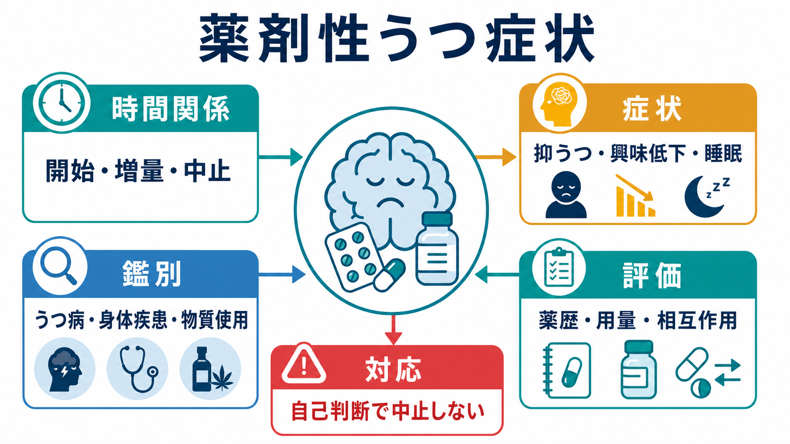
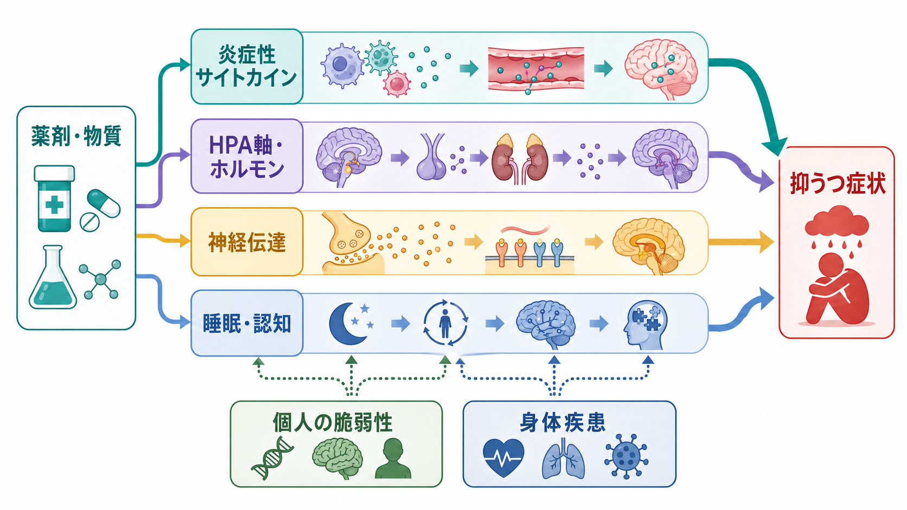
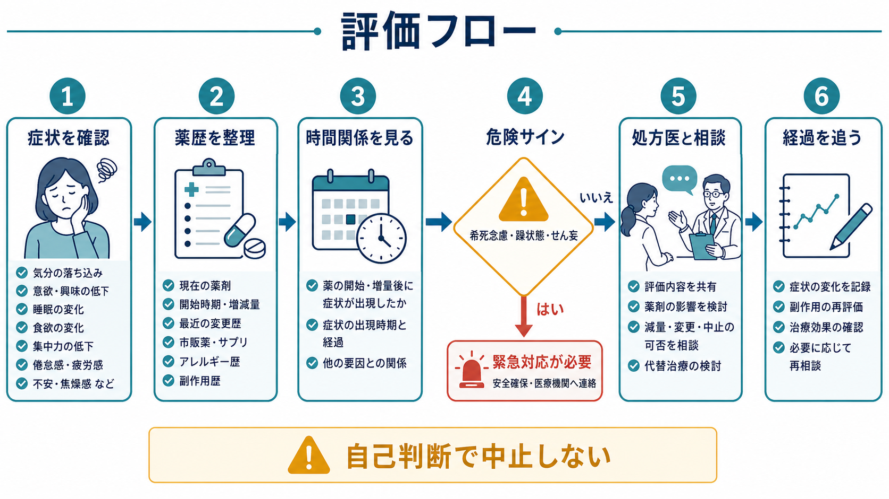

# 薬剤性うつ症状とは何か

## 要点

- 薬剤性うつ症状とは、薬剤、アルコール、乱用薬物、毒性物質、または中止・離脱に時間的に続いて、抑うつ気分、興味・喜びの低下、睡眠や食欲の変化、疲労、集中困難、罪責感、[[希死念慮とは何か|希死念慮]]などが前景化する状態を指す。診断名というより、まず「薬剤・物質がどの程度関与しているか」を評価する臨床仮説として扱うのが実用的である[1]。
- 評価の核は、薬剤名そのものではなく、開始・増量・減量・中止との時間関係、用量反応、併用薬、身体疾患、物質使用、既存の[[うつ病とは何か|うつ病]]エピソードとの鑑別である[1][2]。
- 因果関係は「確実」と断定しにくい。WHO-UMC の有害反応評価でも、多くの症例は時間関係と代替説明の有無から「possible」または「probable」として扱われ、再投与で確認することは倫理的にも臨床的にも通常は推奨されない[3]。
- 根拠が比較的強い例には、インターフェロン関連うつ、グルココルチコイド関連の気分症状、一部薬剤の神経精神有害事象がある。一方、ベータ遮断薬やイソトレチノインのように、長く疑われてきたが集団レベルの証拠は単純ではない薬剤もある[4][5][6][7][8]。
- 実務上の対応は「自己判断で中止する」ことではなく、処方目的とリスクを確認し、危険サインを評価し、処方医と相談しながら減量・代替・観察・精神科的支援を組み合わせることである。

## この記事で答える問い

1. 薬剤性うつ症状は、通常の抑うつ症状や[[うつ病とは何か|うつ病]]と何が違うのか。
2. 薬剤や物質が抑うつ症状に関与しているかを、どの順番で評価すればよいのか。
3. どの薬剤群で注意が必要で、どの薬剤群では「疑われているが証拠は複雑」と考えるべきか。
4. 臨床・研究では、薬剤性うつ症状をどのように扱えばよいのか。

## まず結論

薬剤性うつ症状は、「薬の副作用だから、薬をやめればすべて解決する」という単純な話ではない。多くの場合、薬剤の影響、薬剤が処方された身体疾患、痛みや炎症、睡眠障害、生活上のストレス、既存の気分障害への脆弱性が重なっている。したがって、最初に必要なのは原因を一つに決めることではなく、抑うつ症状の経過と薬歴を同じ時間軸に並べることである。

臨床的には、症状が重い、[[希死念慮とは何か|希死念慮]]がある、躁状態や[[せん妄とは何か|せん妄]]が疑われる、急激な行動変化がある場合には、薬剤性かどうかの鑑別と並行して安全確保を優先する。この記事は教育・研究目的の整理であり、個別の服薬中止や治療指示ではない。

## 背景

抑うつ症状は、精神疾患だけでなく、身体疾患、疼痛、内分泌異常、睡眠障害、アルコール・薬物使用、そして医薬品の有害反応としても現れる。MSD/Merck Manual は、抑うつ障害の原因分類のなかに substance-/medication-induced depressive disorder を置き、コルチコステロイド、ベータ遮断薬、インターフェロン、一部の違法薬物などが抑うつ症状に関与しうると整理している[1]。

薬剤性を考える重要性は二つある。第一に、見逃すと「治療しているはずの薬剤」が症状を悪化させ続ける可能性がある。第二に、過剰に疑うと、必要な薬剤を不用意に中止し、身体疾患を悪化させる可能性がある。つまり、薬剤性うつ症状の評価は、薬剤を敵視する作業ではなく、利益と害を同じ表に載せる作業である。

米国 NHANES を用いた JAMA の横断研究では、うつを潜在的有害作用として持つ処方薬を成人の 37.2% が使用しており、そのような薬剤を複数併用するほど PHQ-9 で評価した抑うつの割合が高いという関連が示された[2]。ただし、この研究は横断研究であり、薬剤が抑うつを直接引き起こしたとまでは言えない。薬剤が処方される背景疾患そのものが抑うつと関係している可能性があるからである。

## 基本概念

### 薬剤性うつ症状と「うつ病」の違い

薬剤性うつ症状では、症状の形だけを見ても[[うつ病とは何か|うつ病]]と区別しにくい。抑うつ気分、興味の低下、[[不眠とは何か|不眠]]、過眠、疲労、食欲変化、集中困難、精神運動制止、罪責感、[[希死念慮とは何か|希死念慮]]は、どちらにも現れうる[1]。

違いは、症状そのものよりも「文脈」にある。薬剤開始後に発症したか、増量後に悪化したか、減量・中止後に軽快したか、再投与で再燃したか、同じ時期に身体疾患や生活ストレスが悪化していないかを検討する。DSM 的な発想でも、物質・医薬品誘発性の抑うつ障害では、物質や医薬品が症状を引き起こしうること、症状がその物質の使用・中毒・離脱や医薬品曝露の時期と結びつくこと、他の抑うつ障害だけではよりよく説明されないことが重視される[1]。

### 因果性は段階的に考える

薬剤有害反応の評価では、「関係あり／なし」の二分法は粗い。WHO-UMC の因果性評価では、時間関係が妥当で、代替原因が考えにくく、中止後の改善が臨床的に合理的なら「probable/likely」、時間関係は妥当だが疾患や他薬でも説明できるなら「possible」と分類される[3]。

抑うつ症状は薬剤に特異的な検査所見を持たず、再投与で確認することも望ましくない。したがって、薬剤性うつ症状の多くは「確定診断」ではなく、確率を更新しながら扱う仮説である。これは弱点ではなく、安全に評価するための現実的な態度である。

## 仕組み

薬剤性うつ症状に単一のメカニズムはない。薬剤群によって、炎症、内分泌、神経伝達、睡眠、疼痛、認知機能、身体疾患の重症度が異なる形で関与する。

### 炎症・サイトカイン経路

インターフェロン関連うつは、薬剤性うつ症状のなかでも機序研究が比較的進んだ例である。インターフェロンは抗ウイルス・免疫調整作用を持つ一方、治療中に抑うつ症状が出現しやすいことが古くから知られている。レビューでは、インターフェロン治療に伴う治療出現性うつのリスクが高く、炎症性サイトカイン、HPA軸、モノアミン、睡眠・疲労など複数の経路が関与すると説明される[5]。

この例が重要なのは、「炎症性シグナルが気分を変えうる」というモデルを臨床的に示すからである。ただし、現在は C 型肝炎治療などでインターフェロン使用が減っており、歴史的に重要なモデルとして読むのがよい。

### HPA軸・ホルモン経路

グルココルチコイドは、気分、睡眠、活動性、認知、食欲に広く影響する。Mayo Clinic Proceedings のレビューでは、全身性コルチコステロイド治療中の精神症状はまれではなく、重い反応が約 6%、軽度から中等度の反応が約 28% とされ、短期高用量では多幸・軽躁が目立ち、長期治療では抑うつ症状が問題になりやすいと整理されている[4]。

ここでも、薬剤の作用と身体疾患の作用は分けにくい。膠原病、がん、神経疾患、疼痛など、ステロイドが必要になる疾患そのものが抑うつの背景になりうる。だからこそ、症状のタイミング、用量、治療期間、睡眠変化、身体疾患の活動性を同時に見る必要がある。

### 神経伝達・睡眠・疲労

ベータ遮断薬は、長く「うつを起こす薬」として疑われてきた。しかし、ランダム化試験を中心に検討した大規模メタ解析を解説したレビューでは、ベータ遮断薬はプラセボや実薬対照と比べて新規うつやうつによる中止を増やす明確な証拠は乏しく、むしろ疲労や異常夢がうつと誤認される可能性があると述べられている[8]。このような例は、「副作用リストにある」ことと「個人の症状の主因である」ことを分けて考える必要を示している。

イソトレチノインも同様に、抑うつや自殺リスクとの関連が議論されてきた。JAMA Dermatology の 2024 年メタ解析では、25研究・約162万人を対象に、集団レベルでは自殺や精神疾患の相対リスク上昇を示す疫学的証拠は認められないと報告された。ただし、既往の精神疾患を持つ人では注意深いモニタリングが必要であり、個別症例で症状が出ないことを意味しない[7]。

### 薬剤固有の警告と薬剤疫学

一部の薬剤では、規制当局が精神症状に関する強い警告を出している。たとえば FDA は 2020 年、モンテルカストについて、行動・気分変化、自殺念慮・行動を含む重大な精神神経有害事象に関する Boxed Warning を要求し、アレルギー性鼻炎では他薬が有効または忍容可能な場合に第一選択としないよう助言した[6]。

ただし、このような警告も「全員に起こる」という意味ではない。警告は、重篤だが頻度を正確に推定しにくい有害事象、患者・医療者が見逃しやすいリスク、代替薬の有無、疾患の重症度を合わせて判断される。薬剤性うつ症状を評価するときには、個別薬剤の添付文書、規制当局の安全性情報、薬剤疫学研究を併せて読む必要がある。

## 図解

3枚の図は、薬剤性うつ症状を読む順番に対応している。

| 図 | 位置づけ | 読み方 |
|---|---|---|
| 概念地図 | 薬剤性うつ症状の全体像 | 薬剤、時間関係、症状、鑑別、対応を同時に見る |
| メカニズム図 | 作用経路の整理 | 炎症、HPA軸、神経伝達、睡眠・認知、身体疾患が並列に関与する |
| 評価フロー | 臨床・研究での手順 | 症状、安全性、薬歴、時間関係、代替説明、経過観察を順に確認する |

## 臨床・研究との接続

### 評価の実務

薬剤性うつ症状を疑うときは、少なくとも次を確認する。

| 評価項目 | 見るポイント |
|---|---|
| 症状 | 抑うつ気分、興味低下、睡眠、食欲、疲労、集中、罪責感、精神運動変化、[[希死念慮とは何か|希死念慮]] |
| 時間関係 | 開始、増量、減量、中止、離脱、再開との関係 |
| 薬歴 | 処方薬、市販薬、サプリメント、注射薬、貼付薬、頓用薬、飲み忘れ |
| 用量反応 | 増量で悪化、減量で改善したか |
| 代替説明 | 身体疾患、疼痛、炎症、内分泌異常、睡眠障害、アルコール・物質使用、生活イベント |
| 危険サイン | 自殺リスク、躁状態、精神病症状、[[せん妄とは何か|せん妄]]、急激な行動変化 |

重要なのは、薬剤性を疑った時点で安全性評価を先送りしないことである。[[希死念慮とは何か|希死念慮]]、自傷の具体的計画、強い焦燥、混乱、幻覚・妄想、躁状態がある場合は、薬剤調整以前に緊急性の評価が必要になる。

### 対応の原則

対応は、原因薬剤を単純に「中止する」ことではない。ステロイド、抗てんかん薬、降圧薬、ホルモン療法、抗がん薬、免疫調整薬などは、急な中止が身体疾患や離脱を悪化させることがある。実務上は、処方医と相談しながら、以下を組み合わせる。

- 薬剤の必要性、代替薬、減量可能性を見直す。
- 併用薬と相互作用を整理する。
- 睡眠、疼痛、感染、内分泌、栄養、アルコール・物質使用を評価する。
- 抑うつ症状が重い場合は、心理社会的支援や抗うつ薬治療を検討する。
- 症状評価尺度を使う場合も、尺度だけで因果性を決めず、経過表と併用する。

### 研究での扱い

研究では、薬剤性うつ症状は交絡のかたまりとして現れる。薬剤を使う人は、そもそも身体疾患、疼痛、慢性炎症、医療アクセス、年齢、併用薬、生活困難などが異なる。横断研究で「薬剤使用とうつが関連する」と分かっても、それは因果ではなくシグナルである[2]。

より強い推論には、開始前後の縦断データ、用量反応、対象疾患の重症度調整、陰性対照、自己対照デザイン、自然実験、ランダム化試験、安全性報告の統合が必要になる。薬剤性うつ症状は、症例報告、薬剤疫学、臨床試験、添付文書、規制当局の警告を横断して評価するテーマである。

## よくある誤解

### 「副作用欄にうつとある薬は危険だから避けるべき」

副作用欄は重要な情報だが、頻度、重症度、因果性、代替薬の有無、治療対象疾患の危険性を同時に見る必要がある。副作用として記載されていても、集団研究では明確な相対リスク上昇が確認されないこともある[7][8]。

### 「薬剤性なら、薬をやめれば必ず治る」

そうとは限らない。中止後に改善する場合もあるが、背景の身体疾患、既存の[[うつ病とは何か|うつ病]]、睡眠障害、疼痛、社会的ストレスが残れば症状は続く。薬剤中止が危険な場合もある。

### 「薬剤性うつ症状は本人の弱さではない」

これは正しい。ただし、薬剤性かどうかにかかわらず、抑うつ症状は本人の性格や努力不足で説明されるものではない。薬剤性を考える目的は、責任を薬剤へ移すことではなく、修正可能な要因を見つけることである。

### 「うつ症状が出たら、まず薬剤を疑えばよい」

薬剤は重要な候補だが、唯一の候補ではない。身体疾患、アルコール、睡眠、疼痛、喪失、孤立、既存の気分障害も同時に評価する。薬剤性を疑うことと、他の要因を無視することは違う。

## 関連ノート

- [[うつ病とは何か]]
- [[薬剤性精神病とは何か]]
- [[物質誘発性精神病とは何か]]
- [[希死念慮とは何か]]
- [[せん妄とは何か]]
- [[不眠とは何か]]

MOC更新候補:

- `content/00_MOC/` 配下の精神医学・気分障害・薬剤性精神症状に関する MOC
- 疾患・症候群カテゴリ内の「薬剤性精神症状」または「物質・医薬品誘発性障害」索引

## 理解チェック

1. 薬剤性うつ症状を疑うとき、薬剤名だけでなく時間関係を確認するのはなぜか。
2. 「薬剤使用とうつの関連」が横断研究で示されたとき、なぜ因果と断定できないのか。
3. ベータ遮断薬やイソトレチノインの例は、薬剤性うつ症状を考えるうえで何を教えているか。
4. 危険サインがある場合、薬剤性の鑑別より先に何を優先すべきか。

## 未解決問題

- 個人レベルで「この人の抑うつ症状がこの薬剤に由来する」と高精度に判定するバイオマーカーは限られている。
- 添付文書上の有害事象、症例報告、薬剤疫学研究、RCTの安全性データをどのように統合するかは、薬剤ごとに異なる。
- 身体疾患、疼痛、炎症、睡眠障害、薬剤曝露が重なる症例で、最適な減量・代替・精神科的治療の順序を決めるための実践的研究は不足している。

## 参考文献

[1] Merck Manual Professional Edition. *Depressive Disorders*. Reviewed/Revised Jan 2026. https://www.merckmanuals.com/professional/psychiatric-disorders/mood-disorders/depressive-disorders

[2] Qato DM, Ozenberger K, Olfson M. Prevalence of Prescription Medications With Depression as a Potential Adverse Effect Among Adults in the United States. *JAMA*. 2018;319(22):2289-2298. https://doi.org/10.1001/jama.2018.6741

[3] World Health Organization. *The use of the WHO-UMC system for standardised case causality assessment*. 2013. https://www.who.int/publications/m/item/WHO-causality-assessment

[4] Warrington TP, Bostwick JM. Psychiatric adverse effects of corticosteroids. *Mayo Clinic Proceedings*. 2006;81(10):1361-1367. https://doi.org/10.4065/81.10.1361

[5] Pinto EF, Andrade C. Interferon-Related Depression: A Primer on Mechanisms, Treatment, and Prevention of a Common Clinical Problem. *Current Neuropharmacology*. 2016;14(7):743-748. https://doi.org/10.2174/1570159X14666160106155129

[6] U.S. Food and Drug Administration. FDA requires Boxed Warning about serious mental health side effects for asthma and allergy drug montelukast (Singulair); advises restricting use for allergic rhinitis. 2020-03-04. https://www.fda.gov/drugs/drug-safety-and-availability/fda-requires-boxed-warning-about-serious-mental-health-side-effects-asthma-and-allergy-drug

[7] Tan NKW, Tang A, MacAlevey NCYL, Tan BKJ, Oon HH. Risk of Suicide and Psychiatric Disorders Among Isotretinoin Users: A Meta-Analysis. *JAMA Dermatology*. 2024;160(1):54-62. https://doi.org/10.1001/jamadermatol.2023.4579

[8] Andrade C. β-Blockers and the Risk of New-Onset Depression: Meta-analysis Reassures, but the Jury Is Still Out. *Journal of Clinical Psychiatry*. 2021;82(3):21f14095. https://doi.org/10.4088/JCP.21f14095
