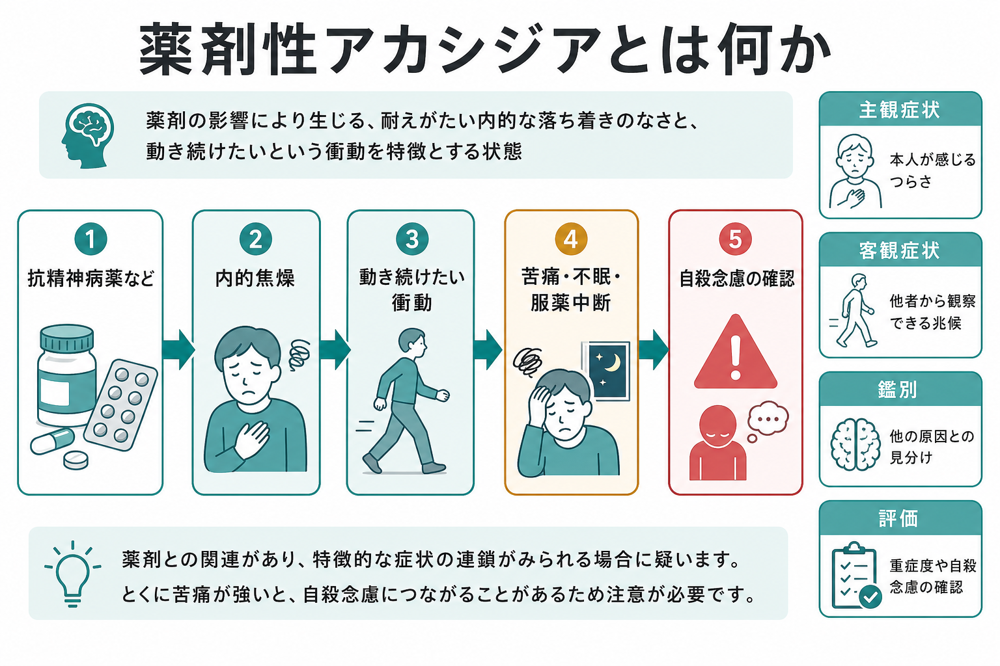
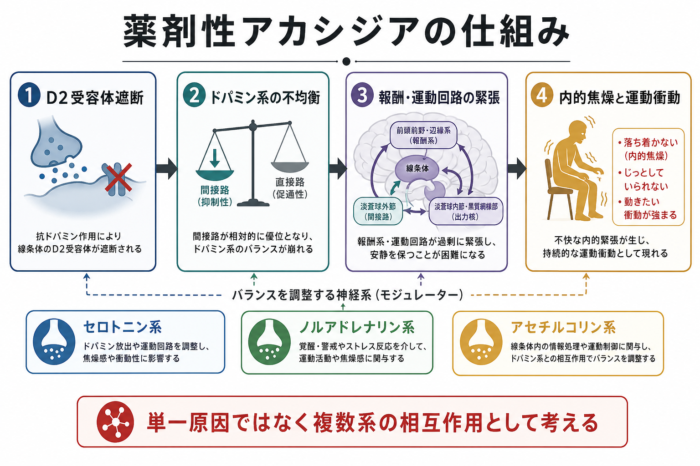
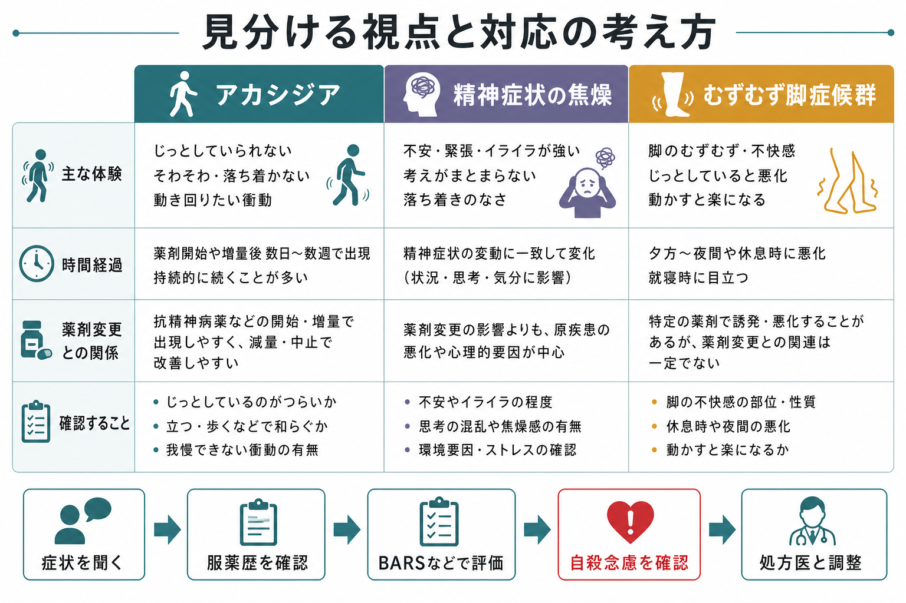

# 薬剤性アカシジアとは何か

## 要点

- 薬剤性アカシジアは、抗精神病薬などの薬剤使用後に生じる「じっとしていられない内的焦燥」と「動き続けたい衝動」を中核とする薬剤性運動症候群である[1]。
- 本人の苦痛が強い一方で、外からは不安、焦燥、精神病症状の悪化、[[むずむず脚症候群とは何か|むずむず脚症候群]]に見えることがあるため、服薬歴と時間経過を確認する必要がある[1][3]。
- 評価には Barnes Akathisia Rating Scale（BARS）が広く使われ、主観的な落ち着かなさ、苦痛、観察される運動、全体重症度を分けて見る[2]。
- 自殺リスクとの因果関係は強く確立していないが、強い苦痛を伴うため、新規発症・増量後・急な悪化では自殺念慮を積極的に確認することが推奨される[4][5]。
- 本稿は教育・研究目的の整理であり、個別の診断、処方変更、治療指示ではない。疑われる場合は処方医・医療者に相談する前提で読む。

## この記事で答える問い

1. 薬剤性アカシジアは、単なる「不安」や「落ち着きのなさ」と何が違うのか。
2. なぜ抗精神病薬などで、内的焦燥と動き続けたい衝動が生じるのか。
3. 自殺リスクとの関係は、どこまで確かで、臨床的には何を確認すべきか。

## まず結論

薬剤性アカシジアは、薬剤変更と時間的に関連して出現する、強い主観的苦痛を伴う運動性の落ち着かなさである。典型的には、座っていられない、足踏みする、歩き回る、姿勢を頻繁に変えるといった客観的兆候と、「胸の内側がそわそわする」「耐えがたい」「動かずにいられない」という主観的体験が組み合わさる[1][2]。

重要なのは、これを[[不安症群とは何か|不安症]]、[[うつ病とは何か|うつ病]]の焦燥、[[初回エピソード精神病とは何か|精神病症状]]の悪化だけで説明しないことである。とくに抗精神病薬の開始、増量、急な切り替え、制吐薬などドパミン受容体遮断作用をもつ薬剤の使用後に出た焦燥は、薬剤性アカシジアとして評価する価値がある[1][3]。

## 背景

アカシジアは、ギリシア語の「座っていられない」に由来する概念として説明されることが多い。現在の臨床では、抗精神病薬、制吐薬、抗うつ薬などに関連して起こる薬剤性運動症候群として扱われる。抗精神病薬関連の錐体外路症状を扱った系統的レビューでは、観察研究の統合推定としてアカシジアの有病割合はおよそ 11% と報告されているが、薬剤、用量、対象集団、評価法によって幅がある[7]。

薬剤性アカシジアが見逃されやすい理由は、本人の体験が「不安」「イライラ」「焦燥」と表現されやすく、外から見える運動も歩き回り、足を揺らす、座り直すといった非特異的な行動だからである。精神症状の悪化と誤解されると、原因薬剤が増量され、かえって苦痛が増すという悪循環も起こりうる[1][3]。

## 基本概念

### 中核症状

薬剤性アカシジアの中核は、主観症状と客観症状の組み合わせである[1][2]。

| 観点 | 典型例 | 注意点 |
|---|---|---|
| 主観症状 | そわそわする、内側から急かされる、座っていられない | 本人が「不安」「イライラ」とだけ語ることがある |
| 客観症状 | 足踏み、歩き回り、座位保持困難、姿勢変更の反復 | 観察場面が短いと見逃す |
| 苦痛 | 耐えがたい、眠れない、薬をやめたい | 自殺念慮・自傷衝動の確認が重要 |
| 時間経過 | 開始・増量・切替後、数日から数週で出現しやすい | 遅発性・慢性の形もある |

### 評価

BARS は、観察される落ち着かなさ、主観的な落ち着かなさ、主観的苦痛、全体重症度を分けて評定する尺度である。Barnes の原著では、評価者間信頼性が確認され、疑似アカシジア、軽症、中等症、重症を区別する枠組みが示された[2]。近年の治療推奨でも、抗精神病薬の開始前や増量中に、妥当性のある尺度で系統的に評価することが望ましいとされる[1]。

## 仕組み

もっともよく議論される仮説は、抗精神病薬による D2 受容体遮断が、線条体を含む運動・報酬回路のドパミン系バランスを変え、主観的な内的焦燥と運動衝動を生むというものである[1][3]。ただし、薬剤性アカシジアは「ドパミン不足だけ」で説明できる単純な現象ではない。

セロトニン系、ノルアドレナリン系、アセチルコリン系、GABA・グルタミン酸系なども関与すると考えられており、治療研究で β 遮断薬や 5-HT2A 拮抗作用をもつ薬剤が検討されてきたことも、この多系統性を示唆する[1][8]。そのため、仕組みは「単一の部位が壊れる」よりも、「運動回路、報酬予測、覚醒・ストレス反応が同時に過緊張になる」と理解すると臨床像に近い。

## 図解

薬剤性アカシジアを評価するときは、症状名から逆算するより、次の順に確認すると整理しやすい。

1. いま何がつらいかを本人の言葉で聞く。
2. 座位保持、足踏み、歩き回り、姿勢変更を観察する。
3. 抗精神病薬、制吐薬、抗うつ薬などの開始・増量・中止・切替の時期を確認する。
4. BARS などで、主観症状、客観症状、苦痛、重症度を分ける。
5. 苦痛が強い場合は、[[自殺関連行動障害とは何か|自殺念慮や自殺関連行動]]を明示的に確認する。

## 臨床・研究との接続

臨床的には、薬剤性アカシジアは「副作用チェック」の一項目ではなく、服薬継続、睡眠、信頼関係、安全性に直結する症候群である。NICE の若年者の精神病・統合失調症ガイドラインでも、抗精神病薬選択時には体重増加や糖尿病などの代謝性副作用だけでなく、アカシジア、ジスキネジア、ジストニアを含む錐体外路症状について情報提供し、共同で意思決定することが求められている[6]。

治療・対応の研究では、まず原因薬剤の用量、増量速度、切替、併用薬を見直すことが基本的な臨床判断になる。薬物療法としてはプロプラノロール、ベンゾジアゼピン系、ミルタザピン、抗コリン薬などが検討されてきたが、適応は患者背景、併存症、原因薬剤、重症度で変わるため、本稿では個別の処方指示として扱わない[1][8]。

自殺リスクについては慎重な読み方が必要である。2021 年の系統的レビューは、抗精神病薬誘発性アカシジアと自殺行動の関係を調べた研究が少なく、方法のばらつきと小規模性のため、信頼できる因果関係は確立できないと結論づけた。一方で、脆弱な患者群では新たな自殺行動を積極的にスクリーニングすることが望ましいとも述べている[4]。2022 年の臨床試験解析でも、サブグループで自殺傾向、焦燥、抑うつとの関連が示唆されたが、より大規模で前向きの検証が必要とされている[5]。

## よくある誤解

**誤解1: アカシジアは本人が我慢すればよい副作用である。**  
実際には、強い内的苦痛、不眠、服薬中断、自殺念慮の確認を要することがある。軽く見ず、症状の時間経過と薬剤変更の関係を評価する必要がある[1][4]。

**誤解2: 歩き回っていなければアカシジアではない。**  
主観的な落ち着かなさが強くても、診察室では運動が目立たない場合がある。逆に、主観的苦痛を伴わない疑似アカシジアもあり、BARS のように主観と客観を分けて見ることが重要である[2]。

**誤解3: 自殺リスクとの関係は完全に証明されている。**  
証拠は限定的で、因果関係を断定する段階ではない。ただし、苦痛が強い症候群であるため、確認しない理由にはならない。臨床的には「証明済みだから聞く」ではなく、「見逃すと危険な可能性があるから聞く」と考える[4][5]。

**誤解4: 精神症状が悪くなっただけなので、抗精神病薬を増やせばよい。**  
焦燥が薬剤性アカシジアであれば、単純な増量で悪化する可能性がある。精神症状の悪化、[[双極性障害とは何か|躁状態]]、不安、薬剤性副作用、むずむず脚症候群を並行して鑑別する必要がある[1][3]。

## 関連ノート

- [[初回エピソード精神病とは何か]]
- [[自殺関連行動障害とは何か]]
- [[むずむず脚症候群とは何か]]
- [[うつ病とは何か]]
- [[双極性障害とは何か]]
- [[不安症群とは何か]]

## MOC更新候補

- `content/00_MOC/` 配下の精神医学・臨床精神医学系 MOC に追加候補。
- 並列ジョブとの競合回避のため、本稿では MOC ファイルを直接更新していない。

## 理解チェック

1. 薬剤性アカシジアで、本人の主観症状と外から見える客観症状を分けて聞く理由は何か。
2. 抗精神病薬の開始・増量後に「不安が強くなった」と訴える人で、どのような質問を追加すべきか。
3. アカシジアと自殺リスクの関係について、「因果関係は未確立」と「自殺念慮を確認する」はなぜ両立するのか。

## 未解決問題

- 薬剤性アカシジアが、どの患者群で自殺念慮・自殺行動に結びつきやすいかは十分に確立していない[4][5]。
- D2 遮断以外の神経伝達系が、主観的苦痛と運動衝動のどの側面に関与するかは、まだ統合的なモデルが必要である[1][8]。
- 尺度評価、ウェアラブル計測、睡眠指標、患者報告アウトカムをどう組み合わせるかは、臨床研究上の課題である。

## 参考文献

[1] Pringsheim, T., Gardner, D., Addington, D., et al. (2018). The Assessment and Treatment of Antipsychotic-Induced Akathisia. *The Canadian Journal of Psychiatry*, 63(11), 719-729. https://doi.org/10.1177/0706743718760288

[2] Barnes, T. R. E. (1989). A rating scale for drug-induced akathisia. *The British Journal of Psychiatry*, 154, 672-676. https://doi.org/10.1192/bjp.154.5.672

[3] D'Souza, R. S., Aslam, S. P., & Hooten, W. M. (2025). Extrapyramidal Side Effects. *StatPearls*. NCBI Bookshelf. https://www.ncbi.nlm.nih.gov/books/NBK534115/

[4] Kalniunas, A., Chakrabarti, I., Mandalia, R., Munjiza, J., & Pappa, S. (2021). The Relationship Between Antipsychotic-Induced Akathisia and Suicidal Behaviour: A Systematic Review. *Neuropsychiatric Disease and Treatment*, 17, 3489-3497. https://doi.org/10.2147/NDT.S337785

[5] Bjarke, J., Gjerde, H. N., Jørgensen, H. A., Kroken, R. A., Løberg, E. M., & Johnsen, E. (2022). Akathisia and atypical antipsychotics: relation to suicidality, agitation and depression in a clinical trial. *Acta Neuropsychiatrica*, 34(5), 282-288. https://doi.org/10.1017/neu.2022.9

[6] National Institute for Health and Care Excellence. (2016). *Psychosis and schizophrenia in children and young people: recognition and management* (NICE Clinical Guideline 155). NCBI Bookshelf. https://www.ncbi.nlm.nih.gov/books/NBK554921/

[7] Ayehu, M., Shibre, T., & Milkias, B. (2021). Antipsychotic-induced extrapyramidal side effects: A systematic review and meta-analysis of observational studies. *PLoS ONE*, 16(9), e0257129. https://doi.org/10.1371/journal.pone.0257129

[8] Poyurovsky, M., & Weizman, A. (2020). Treatment of Antipsychotic-Induced Akathisia: Role of Serotonin 5-HT2A Receptor Antagonists. *Drugs*, 80(9), 871-882. https://doi.org/10.1007/s40265-020-01312-0
