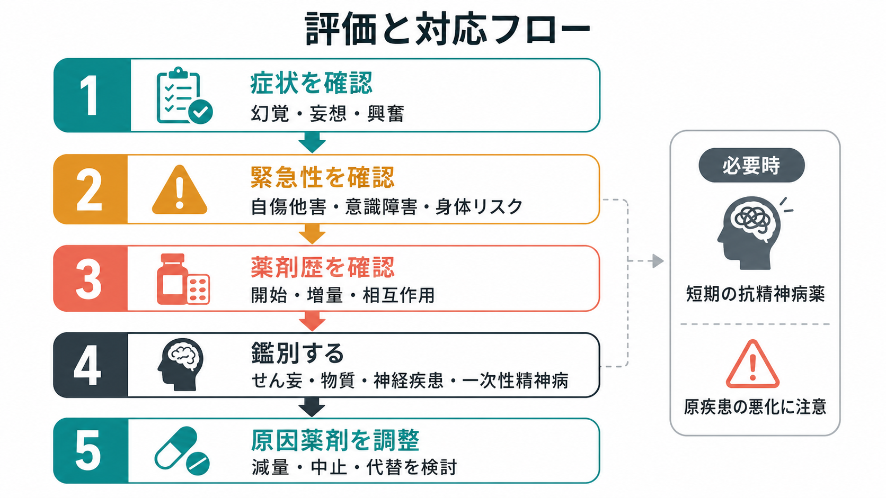
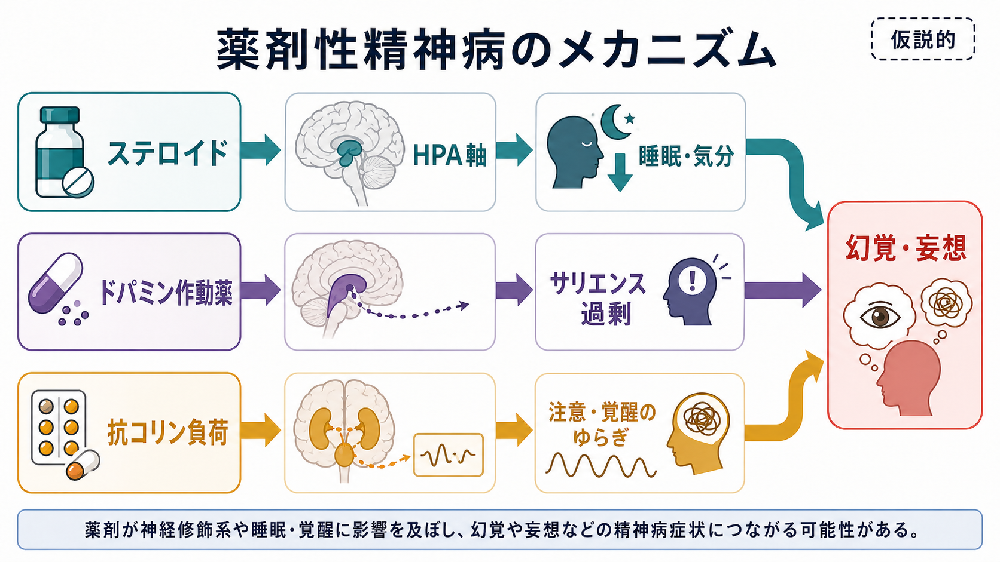

# 薬剤性精神病とは何か

## 要点

- 薬剤性精神病は、薬剤の開始、増量、相互作用、中止・離脱などの時間関係のなかで、[[幻覚は脳内でどのように生じるのか|幻覚]]や妄想が前景に出る状態である。診断名というより、まず「薬剤が原因としてどの程度もっともらしいか」を評価する臨床仮説である。
- DSM-5-TR でいう substance/medication-induced psychotic disorder は、幻覚または妄想があり、物質・薬剤曝露との時間関係と原因能力が示され、せん妄の経過だけでは説明されないことを重視する[1]。
- 代表的な原因薬剤には、グルココルチコイド、抗パーキンソン病薬・ドパミン作動薬、抗コリン作用の強い薬、抗菌薬、抗ウイルス薬、抗てんかん薬、睡眠薬・鎮静薬、免疫抑制薬などがある[1][2]。
- 対応の中心は、緊急性と安全の確認、[[鑑別診断とは何か|鑑別診断]]、薬剤歴の再構成、原因薬剤の減量・中止・代替の検討である。必要時には短期的な鎮静薬や抗精神病薬を使うことがあるが、原疾患の悪化や薬物相互作用を同時に考える[1][4]。

## この記事で答える問い

1. 薬剤性精神病は、一次性の精神病性障害やせん妄と何が違うのか。
2. ステロイドやドパミン作動薬では、どのような機序が想定されるのか。
3. 臨床では、薬剤歴、症状、重症度、安全性をどの順番で評価すればよいのか。
4. 「薬をやめればよい」という単純化がなぜ危険なのか。

## まず結論

薬剤性精神病を疑うときの最初の問いは、「この人は何の薬を、いつ、どの量で、何のために使い始め、いつから幻覚・妄想・興奮・不眠が出たのか」である。薬剤名だけで決めるのではなく、時間関係、用量、腎機能・肝機能、相互作用、睡眠、感染、疼痛、認知症、物質使用、既往の精神症状を合わせて見る。

特に重要なのは、せん妄との区別である。せん妄は注意障害、意識水準の変動、急性発症、日内変動を伴いやすく、薬剤、感染、脱水、低酸素、代謝異常などで起こる[2]。薬剤性精神病と見える症状のなかには、実際には薬剤性せん妄、認知症に伴う精神病症状、躁状態、一次性精神病、神経疾患、自己免疫性脳炎などが含まれる。

## 背景

精神病症状は、統合失調症スペクトラムだけで起こるものではない。身体疾患、神経疾患、物質使用、薬剤、せん妄、認知症、気分エピソードでも幻覚や妄想は生じうる。Keshavan と Kaneko は、このような二次性精神病を整理し、発症年齢、急性経過、意識・認知の変化、神経徴候、身体疾患、薬剤・物質曝露を丁寧に見る必要を強調している[3]。

薬剤性精神病で問題になるのは、原因薬剤が治療上必要なことが多い点である。ステロイドは自己免疫疾患、喘息、炎症性疾患、悪性腫瘍関連治療などで不可欠な場合がある。ドパミン作動薬やレボドパはパーキンソン病の運動症状を支える。したがって「精神症状が出たから中止」と短絡せず、原疾患のリスク、代替薬、減量速度、再燃リスクを処方医と相談する必要がある。

## 基本概念

### 薬剤性精神病の中核

薬剤性精神病の中核は、薬剤曝露と関連して幻覚または妄想が前景化し、苦痛や生活機能の障害、安全上の問題を生むことである[1]。幻覚は「外的刺激がないのに知覚される体験」、妄想は「反証に抵抗し、本人にとって強い現実感をもつ信念」として評価される。面接では、[[MSEで知覚異常をどう聞くか|知覚異常]]と[[MSEで思考内容をどう評価するか|思考内容]]を分けて聞くと、症状の輪郭が見えやすい。

ただし、薬剤性精神病という言葉は、薬剤が唯一の原因だと断定する言葉ではない。実際には、薬剤が睡眠不足、疼痛、感染、認知機能低下、孤立、ストレス、既存の脆弱性と重なり、症状を引き出すことが多い。

### せん妄との違い

せん妄は、注意と意識水準の急性・変動性の障害を中心とし、薬剤や身体疾患でよく起こる[2]。幻視、被害的解釈、興奮が目立つと精神病のように見えるが、注意を保てない、会話が途切れる、時間や場所が混乱する、夜間に悪化する、覚醒水準が揺れる場合はせん妄を優先して考える。

薬剤性精神病と薬剤性せん妄は重なりうる。たとえば抗コリン薬、ベンゾジアゼピン、オピオイド、抗菌薬、ステロイド、ドパミン作動薬はいずれも、精神病症状だけでなくせん妄の原因にもなりうる[2]。このため、評価では「幻覚があるか」だけでなく、注意、意識、見当識、睡眠覚醒リズム、身体バイタル、脱水、感染、低酸素、代謝異常を同時に見る。

## 仕組み

### ステロイド

グルココルチコイドによる精神症状は、不眠、焦燥、気分高揚、抑うつ、躁症状、幻覚、妄想まで幅がある。2025年のシステマティックレビューは、ステロイド関連の躁症状・精神病症状が治療開始後数日から数週間で出ることが多く、高用量でリスクが高まりやすい一方、低用量や中止後にも起こりうると整理している[5]。

機序は一つではない。HPA軸、睡眠、海馬・前頭前野機能、ドパミン・グルタミン酸・GABA系、炎症性疾患そのものの影響が重なると考えられる。実用上は、「ステロイド量が多いほど必ず精神病になる」という単純な予測はできない。過去の反応、既往、併用薬、身体状態、睡眠変化を継続的に観察する方が重要である[5]。

### ドパミン作動薬とパーキンソン病

ドパミン作動薬やレボドパは、運動症状を改善する一方、幻視、被害的確信、錯覚、夢と覚醒の境界のゆらぎなどと関係することがある。パーキンソン病では、疾患そのもの、認知症、視覚処理の変化、睡眠障害、薬剤が重なり、精神病症状が出やすくなる。未治療のパーキンソン病では精神病は比較的少ないが、ドパミン治療下では精神病エピソードが増えることが報告されている[6]。

臨床対応では、二次原因を除外したうえで、抗コリン薬、アマンタジン、ドパミン作動薬、MAO-B阻害薬、COMT阻害薬、レボドパなどの調整を検討する。ただし減量は運動症状、転倒、嚥下、生活機能を悪化させうる。抗精神病薬を使う場合も、D2遮断が強い薬はパーキンソン症状を悪化させる可能性があり、ピマバンセリン、クロザピン、クエチアピンなどが議論されるが、国・適応・副作用・モニタリング条件が異なる[7][8]。

### 抗コリン負荷、抗菌薬、その他の薬剤

抗コリン作用の強い薬は、注意・覚醒・記憶のゆらぎを通じて、せん妄や幻視様体験を起こしやすい。高齢者、認知症、脱水、腎機能低下、多剤併用ではリスクが上がる。抗ヒスタミン薬、三環系抗うつ薬、一部の尿失禁治療薬、パーキンソン病薬、市販の睡眠補助薬にも抗コリン作用がある。

抗菌薬では、フルオロキノロン、βラクタム系、マクロライド、イソニアジド、抗マラリア薬などが精神症状やせん妄の原因として挙げられる[1][2]。腎機能低下で血中濃度が上がる薬、CYP相互作用を受けやすい薬、中枢移行性が高い薬では、通常量でも注意が必要になる。

## 図解

上の2枚の図は、薬剤性精神病を「評価と対応の順序」と「機序の見取り図」に分けて示したものである。1枚目は、症状確認から安全評価、薬剤歴、鑑別、原因薬剤の調整へ進む流れを示す。2枚目は、ステロイド、ドパミン作動薬、抗コリン負荷が、それぞれ睡眠・気分、サリエンス、注意・覚醒のゆらぎを介して幻覚・妄想に接続しうることを示す。

ここでの図は教育用の整理であり、個別患者の診断や治療指示ではない。実際には、症状の重症度、原疾患、身体状態、併用薬、本人の意思、家族・支援者の状況により判断が変わる。

## 臨床・研究との接続

### 評価の順番

[[精神科面接とは何か|精神科面接]]では、まず安全性を確認する。自傷他害の切迫、強い興奮、食事・水分摂取不能、睡眠消失、重い身体疾患、意識障害、けいれん、発熱、低酸素、脱水があれば、精神科症状だけでなく身体救急として扱う。

次に薬剤歴を再構成する。確認したいのは、処方薬、市販薬、サプリメント、頓服、貼付薬、点眼薬、注射薬、最近の増量・減量・中止、飲み忘れ、腎機能・肝機能、飲酒や他物質、薬局の重複処方である。薬剤性精神病では、本人が混乱して薬剤歴を正確に語れないこともあるため、家族、薬手帳、処方記録、薬局情報が重要になる。

### 対応の考え方

原因薬剤が疑われる場合、原則は「原因になりうる薬剤を減らせるか、止められるか、代替できるか」を検討することである[1][4]。ステロイド誘発性精神病の症例レビューでは、ステロイドの減量または中止と、必要時の抗精神病薬を組み合わせて改善した症例が多い[4]。ただし、ステロイドを急に止めると原疾患悪化や副腎不全のリスクがあるため、処方目的と身体疾患のリスクを必ず確認する。

抗精神病薬は、苦痛や危険が強いときに短期的に検討されることがある。だが、パーキンソン病、レビー小体型認知症、高齢者、QT延長、糖尿病、嚥下障害、転倒リスク、抗コリン負荷、薬物相互作用がある場合は、副作用の方が問題になることがある。したがって、薬剤性精神病の対応は「精神症状を薬で抑える」だけでなく、原因薬剤、身体状態、環境調整、睡眠、支援体制を同時に扱う。

研究面では、薬剤性精神病は精神病症状の可逆性、ドパミン・サリエンス、HPA軸、睡眠、炎症、認知脆弱性を結ぶ自然実験として重要である。特にステロイドやドパミン作動薬は、身体治療と精神病理がどのように交差するかを理解する手がかりになる。

## よくある誤解

### 薬剤性なら、薬を止めれば必ずすぐ治る

必ずしもそうではない。多くは原因薬剤の調整で改善するが、症状が数日から数週間以上続くこともある[1][5]。また、薬剤が一次性精神病や気分障害、認知症、せん妄を「露出」させただけの場合もある。中止後の経過観察が重要である。

### ステロイド精神病は高用量でしか起こらない

高用量でリスクが高まりやすいが、低用量や中止後にも報告がある[5]。リスクは用量だけでなく、睡眠、身体疾患、既往、併用薬、年齢、認知機能、過去の薬剤反応に左右される。

### ドパミン作動薬による精神病は統合失調症と同じである

同じではない。どちらも幻覚や妄想を示しうるが、パーキンソン病関連精神病では視覚症状、認知機能、睡眠、ドパミン治療、疾患進行が重なる。D2遮断薬は運動症状を悪化させうるため、通常の精神病治療と同じ発想では危険な場合がある[7][8]。

### 薬剤性精神病は本人の性格や意思の問題である

違う。薬剤、身体状態、脳内神経修飾、睡眠・覚醒、ストレス、認知機能が相互作用して生じる状態である。[[心理教育とは何か|心理教育]]では、本人を責めず、再発予防のために早期サイン、薬剤変更時の注意、相談先、家族・支援者との共有を扱う。

## 関連ノート

- [[幻覚は脳内でどのように生じるのか]]
- [[関係妄想とは何か]]
- [[MSEで知覚異常をどう聞くか]]
- [[MSEで思考内容をどう評価するか]]
- [[鑑別診断とは何か]]
- [[精神科面接とは何か]]
- [[心理教育とは何か]]
- [[ドパミンは報酬だけの物質なのか]]

MOC更新候補: `content/00_MOC/` 配下の精神医学、症候学、臨床実践、薬物療法関連 MOC。並列ジョブとの競合を避けるため、本記事では MOC 本体は更新していない。

今後の作成候補: 「薬剤性せん妄とは何か」「ステロイド精神症状とは何か」「パーキンソン病精神病とは何か」「抗コリン負荷とは何か」「精神病症状の身体因性鑑別」。

## 理解チェック

1. 薬剤性精神病を疑うとき、薬剤名以外にどの時間情報を確認する必要があるか。
2. せん妄と薬剤性精神病を分けるうえで、注意・意識水準・日内変動はなぜ重要か。
3. ステロイド精神症状では、なぜ「高用量だけが危険」とは言えないのか。
4. パーキンソン病で精神病症状が出たとき、通常の抗精神病薬選択をそのまま当てはめにくい理由は何か。
5. 原因薬剤の中止や減量を検討するとき、原疾患の悪化リスクをなぜ同時に評価する必要があるか。

## 参考文献

[1] Merck Manual Professional Edition. (2025). *Substance- or Medication-Induced Psychotic Disorder*. https://www.merckmanuals.com/professional/psychiatric-disorders/schizophrenia-and-related-disorders/substance-or-medication-induced-psychotic-disorder

[2] MSD Manual Professional Edition. (2025). *Delirium*. https://www.msdmanuals.com/professional/neurologic-disorders/delirium-and-dementia/delirium

[3] Keshavan, M. S., & Kaneko, Y. (2013). Secondary psychoses: an update. *World Psychiatry, 12*(1), 4-15. https://doi.org/10.1002/wps.20001

[4] Huynh, G., & Reinert, J. P. (2021). Pharmacological Management of Steroid-Induced Psychosis: A Review of Patient Cases. *Journal of Pharmacy Technology, 37*(2), 120-126. https://pmc.ncbi.nlm.nih.gov/articles/PMC7953074/

[5] Gostoli, S., Carrozzino, D., Raimondi, G., Subach, R., Gigante, G., & Rafanelli, C. (2025). Corticosteroid-induced manic and/or psychotic symptoms: a systematic review. *Frontiers in Pharmacology, 16*, 1628765. https://doi.org/10.3389/fphar.2025.1628765

[6] Ecker, D., Unrath, A., Kassubek, J., & Sabolek, M. (2009). Dopamine agonists and their risk to induce psychotic episodes in Parkinson's disease: a case-control study. *BMC Neurology, 9*, 23. https://doi.org/10.1186/1471-2377-9-23

[7] Cummings, J., Isaacson, S., Mills, R., Williams, H., Chi-Burris, K., Corbett, A., Dhall, R., & Ballard, C. (2014). Pimavanserin for patients with Parkinson's disease psychosis: a randomised, placebo-controlled phase 3 trial. *The Lancet, 383*(9916), 533-540. https://doi.org/10.1016/S0140-6736(13)62106-6

[8] Rissardo, J. P., Durante, I., Sharon, I., & Caprara, A. L. F. (2022). Pimavanserin and Parkinson's Disease Psychosis: A Narrative Review. *Brain Sciences, 12*(10), 1286. https://doi.org/10.3390/brainsci12101286

