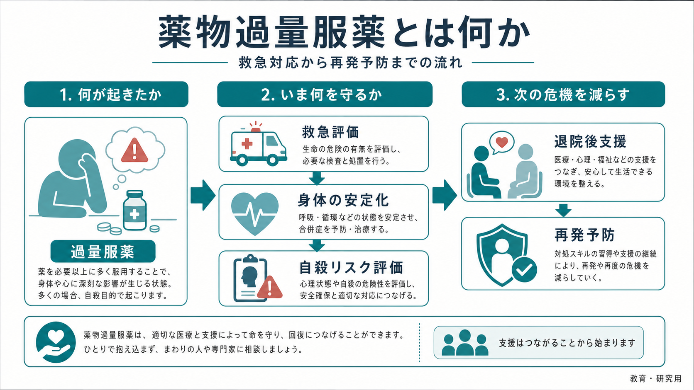
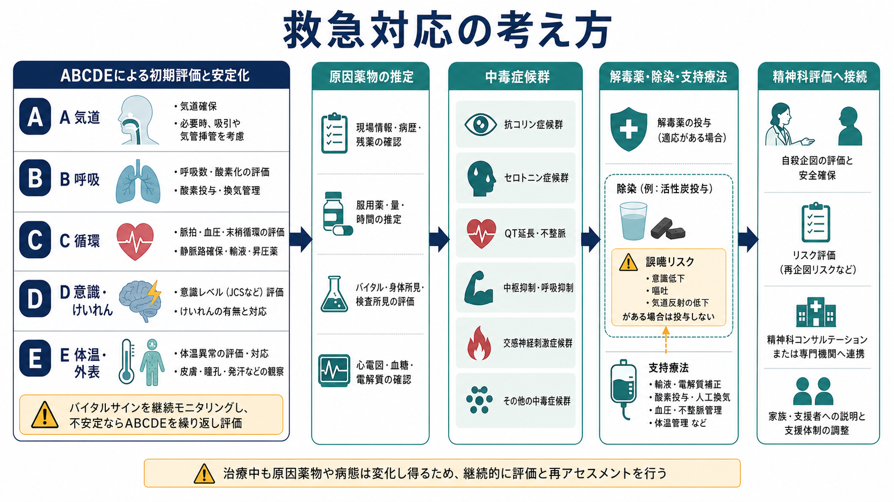
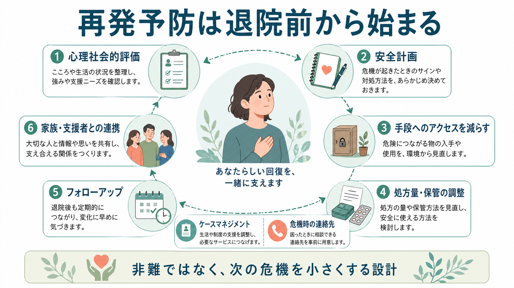

# 薬物過量服薬とは何か

> このノートは教育・研究目的の整理であり、個別の診断や治療指示ではない。過量服薬が疑われる場合は、地域の救急医療、毒物相談、精神科救急などの専門的支援につなぐ必要がある。

## 要点

- 薬物過量服薬とは、医薬品・市販薬・処方薬・時に違法薬物やアルコールを、治療上想定される量を超えて摂取することを指す。臨床では「中毒」と「自傷・自殺関連行動」の両面から扱う。
- NICE は自傷を「意図的な自己中毒または自己損傷」と定義し、明確な自殺意図の有無にかかわらず評価対象に含める[1]。したがって、本人が「死ぬつもりはなかった」と述べても、身体的危険と再発リスクの評価は省略できない。
- 救急では、原因薬物の特定より先に、気道・呼吸・循環・意識・体温などを安定化させる。活性炭などの除染は「 routine に行う処置」ではなく、薬物、量、経過時間、誤嚥リスクを踏まえて選択する[4]。
- 再発予防は、退院後の外来紹介だけでは不十分になりやすい。心理社会的評価、安全計画、薬剤へのアクセス調整、家族・支援者との連携、フォローアップを、退院前から具体化する必要がある[1][3][6]。

## この記事で答える問い

1. 過量服薬は「薬物中毒」なのか「自殺企図」なのか。
2. 救急現場では何を優先して評価するのか。
3. なぜ再発予防は、身体が回復した後ではなく退院前から始めるのか。
4. 処方薬・市販薬へのアクセスをどう考えるべきか。

## まず結論

薬物過量服薬は、単に「薬を飲みすぎた出来事」ではない。急性期には、薬理作用によって呼吸抑制、不整脈、意識障害、けいれん、低血圧、肝障害、セロトニン症候群、抗コリン性せん妄などが起こりうるため、救急医学的な評価が必要になる。一方で、過量服薬は[[自殺関連行動障害とは何か]]、[[自殺念慮と自殺企図は何が違うのか]]、[[非自殺性自傷とは何か]]の文脈にも置かれる。

重要なのは、「死ぬ意図があったか」という単一の質問だけで分類しないことである。衝動性、絶望感、対人葛藤、飲酒、睡眠不足、解離、精神疾患、手元にあった薬剤量などが重なり、本人の意図も時間とともに変化する。したがって臨床では、身体の安全確保と心理社会的な再発予防を同じ流れの中で扱う。

## 背景

自傷と自己中毒は、将来の自殺死亡や再企図の重要なリスク指標である。NICE の self-harm ガイドラインは、自己中毒を自傷の中核的な形態として扱い、救急、精神保健、地域支援が連続して関わる必要を強調している[1]。WHO の LIVE LIFE も、自殺予防を個人の危機対応だけではなく、手段へのアクセス制限、早期発見と支援、地域・制度レベルの対策を含む多層的な取り組みとして位置づけている[3]。

日本では、向精神薬等の過量服薬を背景とする自殺が問題化し、厚生労働省は、自殺念慮等を評価したうえで、必要に応じて投与日数や投与量に配慮するよう通知している[2]。これは「薬を出さなければよい」という単純な話ではない。治療に必要な薬物療法を保ちつつ、急性危機の時に致死的な量へ到達しにくい処方・保管・支援体制を設計する、という臨床上のバランスの問題である。

## 基本概念

### 過量服薬

過量服薬は、処方された用量、市販薬の表示用量、または医学的に安全とされる範囲を超えて薬物を摂取することを指す。精神科領域では、睡眠薬、抗不安薬、抗うつ薬、抗精神病薬、気分安定薬、鎮痛薬、市販感冒薬、抗ヒスタミン薬、アルコール併用などが問題になりやすい。

### 意図的自己中毒

意図的自己中毒は、自分で薬物・化学物質を摂取する自傷行為である。自殺意図が明確な場合もあるが、「眠りたかった」「苦痛を止めたかった」「助けてほしかった」「その瞬間は何も考えられなかった」という場合もある。NICE が自殺意図の有無にかかわらず self-harm に含めるのは、この曖昧さを臨床的に過小評価しないためである[1]。

### 薬物中毒

薬物中毒は、薬物の薬理作用や代謝産物によって身体機能が障害される状態である。たとえば、オピオイドでは呼吸抑制、三環系抗うつ薬では致死的不整脈やけいれん、SSRI や併用薬では[[セロトニン症候群とは何か]]、抗コリン作用薬では[[抗コリン性せん妄とは何か]]が問題になりうる。ここでは「精神的な理由で飲んだかどうか」と「身体に毒性があるかどうか」を分けて考える。

## 仕組み

薬物過量服薬が危険になる仕組みは、少なくとも三層に分けられる。

第一に、薬物そのものの毒性である。呼吸中枢を抑制する薬剤、心伝導系に影響する薬剤、意識障害を起こす薬剤、肝腎機能に負荷をかける薬剤では、量と時間が予後を左右する。複数薬剤やアルコールの併用では、単剤よりも予測が難しくなる。

第二に、意識障害に伴う二次障害である。嘔吐と誤嚥、低体温、脱水、外傷、長時間同じ姿勢による横紋筋融解などは、薬物名だけでは予測できない。救急評価でバイタルサイン、意識レベル、心電図、血糖、電解質、体温、服薬時刻、残薬、同伴者情報を確認するのはこのためである。

第三に、危機が再燃する心理社会的条件である。過量服薬は、[[うつ病とは何か]]、[[双極性障害とは何か]]、[[境界性パーソナリティ障害とは何か]]、[[アルコール使用障害とは何か]]、[[オピオイド使用障害とは何か]]などの病態と併存しうるが、診断名だけで説明できるわけではない。急性ストレス、孤立、睡眠障害、暴力被害、経済問題、処方薬の手元量、過去の自傷歴が重なって、短時間で危険が増幅することがある。

## 図解

| 観点 | 救急で見ること | 再発予防で見ること |
|---|---|---|
| 身体安全 | 気道、呼吸、循環、意識、体温、けいれん、心電図、低血糖 | 後遺症、睡眠、疼痛、離脱、薬剤副作用 |
| 薬物情報 | 薬剤名、量、時刻、併用、徐放製剤、残薬、処方元 | 処方日数、保管場所、家族管理、重複処方、市販薬 |
| 自殺リスク | 現在の希死念慮、意図、計画、致死性、救助可能性 | 過去の企図、支援者、危機サイン、安全計画、フォロー |
| 心理社会 | 直前の誘因、飲酒、解離、対人葛藤、虐待・暴力 | 生活課題、外来継続、福祉、職場・学校調整 |

この表で重要なのは、同じ出来事を「救急で終わる問題」と「精神科で始まる問題」に分けないことである。身体が安定した時点は、危機が解決した時点ではなく、心理社会的評価を安全に進められる時点である。

## 臨床・研究との接続

### 救急対応

初期対応は、原因薬物の推定よりも ABCDE の安定化を優先する。酸素投与、気道確保、輸液、昇圧薬、けいれん対応、体温管理、血糖補正、心電図モニタリングなどは、薬物名が確定する前に必要になることがある。解毒薬は、アセトアミノフェンに対する N-アセチルシステイン、オピオイドに対するナロキソンなど、適応が明確な場合に使われる。

活性炭は、摂取後早期で、対象薬物が吸着され、かつ気道保護が可能な場合に検討される。AACT/EAPCCT の position paper は、単回活性炭を中毒患者に routine 投与すべきではなく、通常は摂取後 1 時間以内の有毒量摂取で検討するとしている[4]。胃洗浄も routine ではなく、生命を脅かす摂取で早期に行えるなど、かなり限定的な状況でのみ検討される[5]。

### 精神科評価

精神科評価では、診断名の同定だけでなく、今回の服薬に至る連鎖を具体的に再構成する。いつ、どこで、何を、どの量で、何を期待して飲んだのか。飲む前に誰へ連絡したか、飲んだ後に助けを求めたか、救助される可能性をどう考えていたか。これらは、本人を責めるためではなく、次の危機の直前に介入できる場所を探すための情報である。

NICE は、自傷後の評価を、リスクスコアだけで退院可否を決める手続きにしないことを重視している[1]。スコアは見落とし防止の補助にはなるが、「低リスク」と分類された人にも再企図は起こりうる。面接では、現在の希死念慮、再服薬の手段、酩酊、衝動性、精神症状、支援者、退院先、フォローアップ可能性を組み合わせて考える。

### 再発予防

安全計画は、危機が再燃した時のサイン、ひとりでできる対処、気をそらせる場所や人、連絡できる支援者、専門機関、手段へのアクセスを減らす方法を、本人と一緒に具体化する介入である。Stanley らの救急患者研究では、安全計画とフォローアップ連絡を組み合わせた介入が、通常ケアと比べて 6 か月以内の自殺行動を減らし、外来治療への接続を高めた[6]。

日本の ACTION-J では、救急入院した自殺企図者に対する積極的ケースマネジメントが検討され、退院後の再企図予防において、通常ケアに上乗せする支援の重要性が示された[7]。一方、Cochrane レビューでは、心理社会的介入全体のエビデンスには不確実性も残るが、CBT ベースの心理療法など一部の介入は再自傷の減少に寄与しうるとされる[8]。したがって、再発予防は単一の技法ではなく、本人の問題構造に合わせた継続支援として設計する必要がある。

## よくある誤解

### 「本当に死ぬ気なら助けを呼ばない」

助けを呼んだことは、危険が低い証拠ではない。自殺関連行動では、生きたい気持ちと死にたい気持ちが同時に存在することが多い。救助要請は、支援につながる重要な行動であると同時に、危機が実際に起きたサインでもある。

### 「過量服薬はかまってほしいだけ」

この表現は臨床的に有害である。たとえ対人関係の危機や支援希求が関与していても、薬理学的毒性と再発リスクは現実に存在する。必要なのは動機の断罪ではなく、苦痛、衝動、手段、支援不足がどこで結びついたかを具体化することである。

### 「退院できるならもう安全」

身体的に退院可能であることと、心理社会的に安全であることは同じではない。退院直後は、再び同じ環境へ戻る時期であり、処方薬や市販薬へのアクセス、孤立、睡眠、飲酒、外来予約までの空白が問題になりやすい。

### 「薬を減らせば再発予防になる」

処方量や保管方法の調整は重要だが、治療そのものを中断すれば症状悪化を招くことがある。過量服薬リスクがある場合には、少量頻回処方、家族・支援者による管理、重複処方の確認、市販薬の扱い、服薬支援、フォローアップを組み合わせる。

## 関連ノート

- [[自殺関連行動障害とは何か]]
- [[自殺念慮と自殺企図は何が違うのか]]
- [[自傷と自殺企図はどう違うのか]]
- [[非自殺性自傷とは何か]]
- [[気分障害における自殺リスクとは何か]]
- [[うつ病とは何か]]
- [[双極性障害とは何か]]
- [[境界性パーソナリティ障害とは何か]]
- [[アルコール使用障害とは何か]]
- [[オピオイド使用障害とは何か]]
- [[セロトニン症候群とは何か]]
- [[抗コリン性せん妄とは何か]]

## MOC更新候補

- `content/00_MOC/` 配下の精神医学・臨床実践・自殺予防関連 MOC に追加候補。
- 並列生成ジョブとの競合を避けるため、本タスクでは MOC 本体は更新していない。

## 理解チェック

1. 過量服薬を「身体的中毒」と「自傷・自殺関連行動」の両面から見る理由は何か。
2. 活性炭や胃洗浄が routine に行われない理由は何か。
3. 「自殺意図がはっきりしない」場合でも、心理社会的評価が必要な理由は何か。
4. 退院前に安全計画と薬剤アクセス調整を行うと、どのような再発リスクを下げられるか。

## 参考文献

[1] National Institute for Health and Care Excellence. (2022). *Self-harm: assessment, management and preventing recurrence* (NICE guideline NG225). https://www.nice.org.uk/guidance/ng225

[2] 厚生労働省. (2010). 向精神薬等の過量服薬を背景とする自殺について. https://www.mhlw.go.jp/bunya/shougaihoken/jisatsu/jisatsu_medicine.html

[3] World Health Organization. (2021). *LIVE LIFE: an implementation guide for suicide prevention in countries*. https://www.who.int/publications/i/item/9789240026629

[4] Chyka, P. A., Seger, D., Krenzelok, E. P., Vale, J. A., American Academy of Clinical Toxicology, & European Association of Poisons Centres and Clinical Toxicologists. (2005). Position paper: Single-dose activated charcoal. *Clinical Toxicology*, 43(2), 61-87. https://doi.org/10.1081/CLT-200051867

[5] Benson, B. E., Hoppu, K., Troutman, W. G., et al. (2013). Position paper update: gastric lavage for gastrointestinal decontamination. *Clinical Toxicology*, 51(3), 140-146. https://doi.org/10.3109/15563650.2013.770154

[6] Stanley, B., Brown, G. K., Brenner, L. A., et al. (2018). Comparison of the Safety Planning Intervention with follow-up vs usual care of suicidal patients treated in the emergency department. *JAMA Psychiatry*, 75(9), 894-900. https://doi.org/10.1001/jamapsychiatry.2018.1776

[7] Kawanishi, C., Aruga, T., Ishizuka, N., et al. (2014). Assertive case management versus enhanced usual care for people with mental health problems who had attempted suicide and were admitted to hospital emergency departments in Japan (ACTION-J): a multicentre, randomised controlled trial. *The Lancet Psychiatry*, 1(3), 193-201. https://doi.org/10.1016/S2215-0366(14)70259-7

[8] Witt, K. G., Hetrick, S. E., Rajaram, G., Hazell, P., Taylor Salisbury, T. L., Townsend, E., & Hawton, K. (2021). Psychosocial interventions for adults who self-harm. *Cochrane Database of Systematic Reviews*, 4, CD013668. https://doi.org/10.1002/14651858.CD013668.pub2

## 未解決問題

- 市販薬、処方薬、アルコール併用を含む過量服薬の日本国内での最新疫学を、診療科・年齢層・薬剤分類別に整理する必要がある。
- 退院後フォローアップの最適な頻度、方法、期間は、医療資源や地域支援体制によって変わる。
- 薬剤アクセス制限は、治療継続と自律性を損なわない形で個別化する必要がある。
