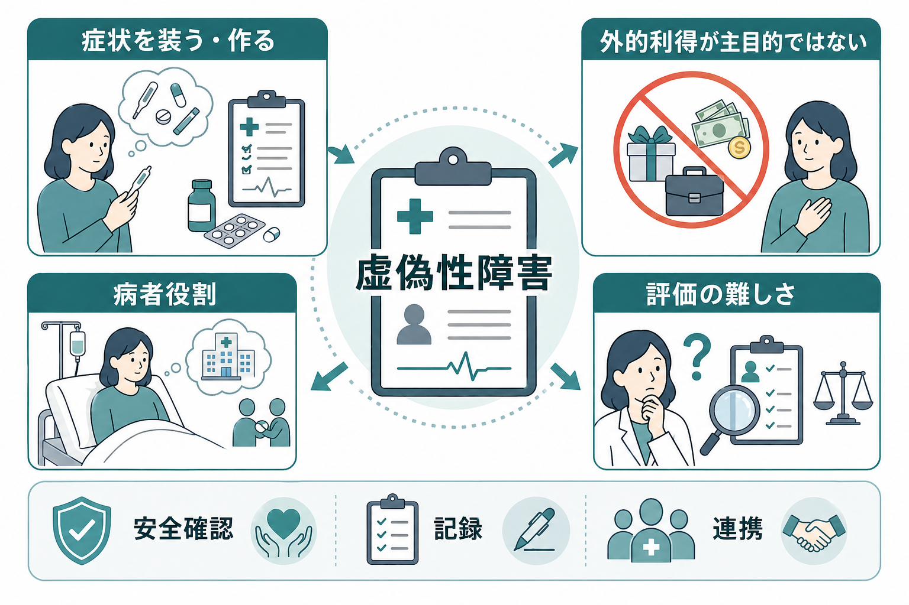
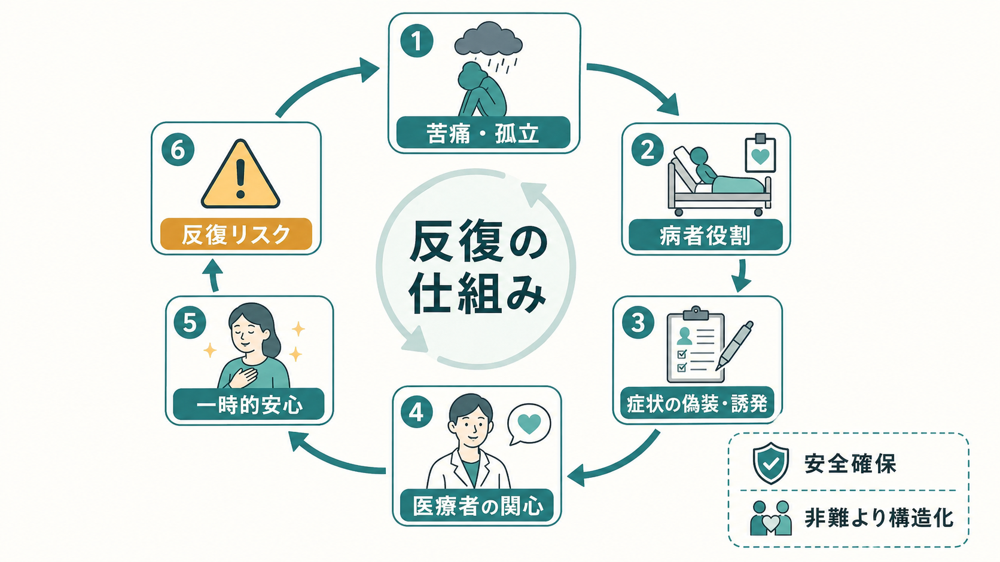
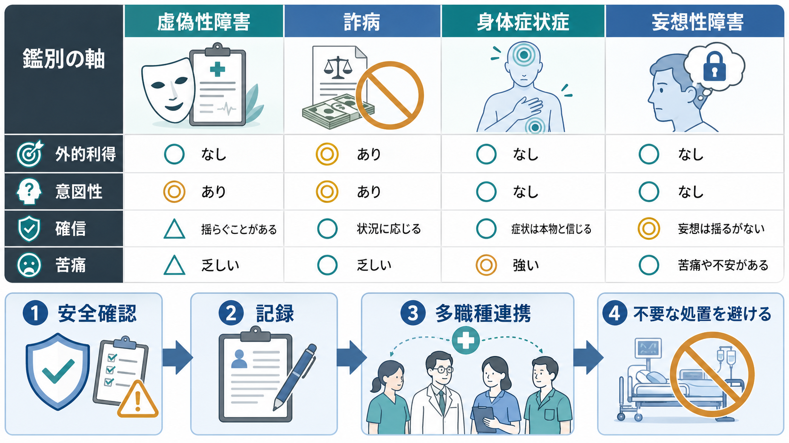

# 虚偽性障害とは何か

## 要点

- 虚偽性障害は、身体的または心理的な症状・徴候を意図的に偽ったり誘発したりし、自分を病気・障害・負傷した人として提示する状態である。[1][6]
- 重要な特徴は、金銭、休職、法的利益などの明白な外的利得が主目的ではない点であり、この点で詐病と区別される。[1][3]
- ただし「外的利得がない」と断定することも、「うそをついている」と単純化することも危険である。診断には経過、記録、身体医学的評価、多職種での情報統合が必要になる。[3][6]
- 評価では、身体疾患の見逃し、不必要な検査・処置、自己誘発による危険、医療者との対立を同時に避ける必要がある。[3][6]
- 本記事は教育・研究目的の整理であり、個別の診断や治療指示ではない。

## この記事で答える問い

このノートでは、「病気を装う」「検査結果や症状を作る」「病院を渡り歩く」といった行動を、すぐに道徳的非難や詐病として扱うのではなく、精神医学的な診断概念としてどう読むのかを整理する。特に、[[DSMとICDは何が違うのか]]で扱う診断分類、[[身体症状症は脳の予測処理で説明できるのか]]で扱う身体症状の評価、[[精神科面接で境界設定はなぜ必要なのか]]で扱う安全な面接構造との接続を重視する。

## まず結論

虚偽性障害とは、症状や徴候の虚偽化、誇張、誘発があり、その人が自分を病気・障害・負傷した人として他者に提示する状態である。DSM-5-TR では、虚偽化が明らかな外的報酬なしに生じ、妄想性障害など他の精神疾患でよりよく説明されないことが診断上重視される。[1] ICD-11 でも、身体的・心理的な症状や徴候を意図的に作る、偽る、悪化させる行動として整理され、本人に課される場合と他者に課される場合が区別される。[2]

一方で、この概念は評価が非常に難しい。虚偽性障害では「意図性」と「外的利得の不在」が中心に置かれるが、実際の臨床では本人の動機は曖昧で、苦痛、孤立、愛着、自己評価、医療者との関係、身体疾患の有無が絡み合う。[3][7] そのため、診断名を早く貼るよりも、まず身体的安全、記録の一貫性、不要な侵襲的処置の回避、治療関係の維持を優先する。

## 背景

虚偽性障害は、古くはミュンヒハウゼン症候群などの名称で語られてきた。現在は「自分に課される虚偽性障害」と「他者に課される虚偽性障害」に分けて理解される。後者では、介護者や養育者が子どもなどの症状を偽ったり誘発したりするため、児童虐待や保護の問題として扱う必要がある。[1][6]

本記事の中心は、自分に課される虚偽性障害である。典型的には、症状を語る、検査結果を改ざんする、薬剤や異物で身体所見を誘発する、既往歴を操作する、複数の医療機関を受診する、医療知識を用いて説得力のある病歴を作る、といった形をとる。[4][6] ただし、これらは「見抜けば終わり」の問題ではない。身体疾患が併存することもあり、本人が強い情緒的困難や自傷リスクを抱えていることもある。[4]

## 基本概念

### 虚偽性障害

虚偽性障害の核は、症状や徴候が意図的に作られる、偽られる、または悪化させられることと、本人が病者役割に入ることである。[1][2] 病者役割とは、病気である人として保護され、配慮され、医療的関心の中心になる社会的役割を指す。虚偽性障害では、この病者役割への接近が、金銭や法的利益よりも前景化すると考えられる。[3]

ここで注意すべきなのは、本人の症状体験がすべて「存在しない」と決めつけられるわけではない点である。実際の身体疾患、薬剤、物質使用、[[身体化とは何か|身体化]]、[[身体症状症は脳の予測処理で説明できるのか|身体症状症]]、[[統合失調症とは何か|精神病性障害]]、気分症、パーソナリティ機能の問題が重なることがある。診断は、単一の面接場面での印象ではなく、時間をかけた情報統合として行われる。

### 詐病との違い

詐病は医学的診断名というより、外的利益を得るために症状を装う行動として扱われる。たとえば、金銭補償、兵役や仕事の回避、薬物入手、法的責任の軽減などが主目的になる場合である。[3] 虚偽性障害では、明白な外的利得は主目的ではなく、むしろ医療的関心、保護、病者役割、自己像の維持が関わるとされる。[1][6]

しかし臨床では、両者をきれいに二分できないことがある。外的利得が少しでもあれば詐病、まったくなければ虚偽性障害、という単純な判定では不十分である。利得、苦痛、自己誘発、対人関係、法的文脈、医療資源の利用、本人の安全を総合して評価する必要がある。[3][7]

## 仕組み

虚偽性障害に単一の原因モデルは確立していない。レビューでは、幼少期の病気体験、虐待や喪失、医療者との早期接触、自己評価の脆弱さ、対人関係の不安定さ、うつ病やパーソナリティ病理などが関連要因として議論されるが、強い因果モデルとしては扱えない。[4][6]

臨床的には、次のような反復構造として理解すると見通しがよい。まず、苦痛、孤立、生活上の失敗感、身体感覚への注意がある。次に、病者役割に入ることで、医療者の関心、保護、説明可能性、一時的安心が得られる。そこで症状の偽装・誇張・誘発が反復されると、侵襲的検査、不要な薬物、感染、損傷、医療者不信、家族関係の悪化が起こりうる。[3][6]

この図は診断基準そのものではなく、臨床で何が維持因子になりうるかを整理するための補助線である。本人を非難して「やめさせる」だけでは、病者役割や医療者との関係がさらにこじれることがある。むしろ、安全確認、面接の枠組み、情報共有、不要な処置の制限を、同時に構造化する必要がある。[5][6]

## 図解

下の図は、虚偽性障害、詐病、身体症状症、妄想性障害を、外的利得、意図性、確信、苦痛という軸で比較するための概念図である。実際の鑑別では、ここに身体疾患、薬剤・物質、神経疾患、家族や職場の文脈、法的文脈を加える。

## 臨床・研究との接続

診断では、詳細な時系列、診療録、検査所見、他院情報、家族や支援者からの情報、症状が生じる場面の一貫性を確認する。Lancet のレビューは、虚偽性障害の同定が、詳細な経過と診療録の精査を含む系統的情報収集に大きく依存すると述べている。[3] 455 例の系統的レビューでも、診断に寄与した要因として、裏づけの乏しい訴え、過去の医療利用、非典型的経過、治療失敗、検査から示される虚偽化などが報告された。[4]

管理の基本は、対立的な追及ではなく、非懲罰的で構造化された対応である。Merck Manual は、罪悪感や非難を示す形で診断を伝えるのではなく、協同して問題を扱う姿勢を重視し、危険な侵襲的検査や不要な薬剤・手術を避けるために早期の精神科・心理相談を考えると説明している。[6] これは[[精神科面接で境界設定はなぜ必要なのか]]で扱う、冷たい拒絶ではなく安全な枠組みとしての境界設定に近い。

研究面では、治療エビデンスは限られている。管理法に関する系統的レビューは、特定の管理技法の有効性を評価するには根拠が不十分で、さらなる研究が必要だと結論している。[5] したがって現時点では、診断名だけで標準治療を決めるより、身体的リスク、自己誘発の危険、併存するうつ・不安・物質使用・パーソナリティ機能、家族関係、医療資源利用を個別に評価する必要がある。

## よくある誤解

### 虚偽性障害は単なるうそつきの問題である

そうではない。虚偽化や誘発は診断上重要だが、背景には強い情緒的困難、自己像の不安定さ、孤立、病者役割への依存が関わることがある。[6][7] 道徳的非難だけでは、本人の安全も医療側の対応も改善しにくい。

### 外的利得がなければ必ず虚偽性障害である

これも単純化である。外的利得が見えにくいだけの場合もあるし、身体症状症、妄想性障害、解離症、物質使用、身体疾患の説明がより適切な場合もある。[1][3] 「利得の有無」は重要な軸だが、唯一の判定基準ではない。

### 診断できたら、すぐ本人に突きつけるべきである

対立的な暴露は、怒り、離脱、他院受診、さらなる危険行動につながることがある。[6] 必要なのは、症状の真偽をめぐる勝負ではなく、安全確認、不要な処置の制限、支援関係の再構築、精神医学的評価への橋渡しである。

### 身体疾患がないと確認してから精神科が関わればよい

身体疾患の評価は必要だが、すべてを完全に除外してから精神科が関わるという順序では遅れることがある。自己誘発、過量服薬、感染、栄養障害、侵襲的処置への依存がある場合、身体科と精神科の並行した評価が必要になる。自傷リスクが疑われる場合には、[[自傷と自殺企図はどう違うのか]]で扱うように、意図、致死性、反復性、保護因子を分けて確認する。

## 関連ノート

### 既存ノート

- [[DSMとICDは何が違うのか]]
- [[身体症状症は脳の予測処理で説明できるのか]]
- [[身体化とは何か]]
- [[統合失調症とは何か]]
- [[精神科面接で境界設定はなぜ必要なのか]]
- [[自傷と自殺企図はどう違うのか]]

### 今後の作成候補

- 詐病とは何か
- 病気不安症とは何か
- 身体症状症とは何か
- 妄想性障害と虚偽性障害をどう鑑別するか
- 他者に課される虚偽性障害とは何か
- 医療者が症状の虚偽化を疑うときの記録と連携

### MOC更新候補

- `content/00_MOC/` 配下の精神医学、診断・面接、身体症状関連、医療倫理関連の MOC に `[[虚偽性障害とは何か]]` を追加する候補。
- 並列記事生成との衝突を避けるため、このジョブでは MOC ファイルの直接更新は行わない。

## 理解チェック

1. 虚偽性障害と詐病を分けるとき、外的利得以外にどのような情報を確認する必要があるか。
2. 虚偽性障害が疑われても、身体医学的評価を省略してはいけない理由は何か。
3. 本人に診断を伝えるとき、対立的な追及が危険になりうるのはなぜか。
4. 不要な検査や処置を避けながら、治療関係を保つためにどのような構造化が必要か。

## 未解決問題

- 虚偽性障害の有病率、自然経過、治療反応に関する質の高い研究は限られている。
- 「意図性」と「心理的強迫性」をどのように評価するかは、診断上も倫理上も難しい。
- 医療者が疑いをもったとき、患者の安全、医療資源、法的責任、治療同盟をどう両立させるかについて、実践的な標準化はまだ十分ではない。

## 参考文献

[1] American Psychiatric Association. (2022). *Diagnostic and Statistical Manual of Mental Disorders, Fifth Edition, Text Revision (DSM-5-TR).* American Psychiatric Association Publishing. https://doi.org/10.1176/appi.books.9780890425787

[2] World Health Organization. (2024). *Clinical descriptions and diagnostic requirements for ICD-11 mental, behavioural and neurodevelopmental disorders.* https://www.who.int/publications/i/item/9789240077263

[3] Bass, C., & Halligan, P. (2014). Factitious disorders and malingering: challenges for clinical assessment and management. *The Lancet, 383*(9926), 1422-1432. https://doi.org/10.1016/S0140-6736(13)62186-8

[4] Yates, G. P., & Feldman, M. D. (2016). Factitious disorder: a systematic review of 455 cases in the professional literature. *General Hospital Psychiatry, 41*, 20-28. https://doi.org/10.1016/j.genhosppsych.2016.05.002

[5] Eastwood, S., & Bisson, J. I. (2008). Management of factitious disorders: a systematic review. *Psychotherapy and Psychosomatics, 77*(4), 209-218. https://doi.org/10.1159/000126072

[6] Dimsdale, J. E. (2024). Factitious Disorder Imposed on Self. *Merck Manual Professional Edition.* https://www.merckmanuals.com/professional/psychiatric-disorders/somatic-symptom-and-related-disorders/factitious-disorder-imposed-on-self

[7] Bass, C., & Halligan, P. (2007). Illness related deception: social or psychiatric problem? *Journal of the Royal Society of Medicine, 100*(2), 81-84. https://doi.org/10.1177/014107680710000223
