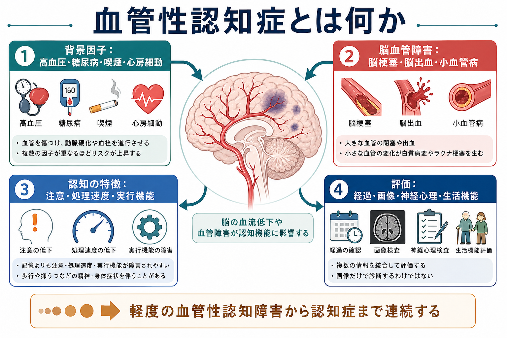
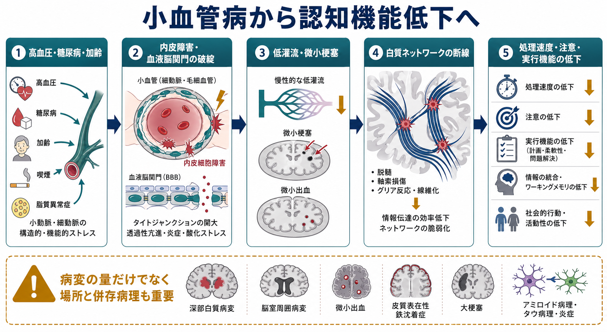

# 血管性認知症とは何か

## 要点

- 血管性認知症は、脳梗塞、脳出血、小血管病、低灌流などの脳血管障害に関連して、認知機能と生活機能が持続的に低下する状態である[1][2]。
- 現在は、軽度の血管性認知障害から認知症までを連続体として捉える「血管性認知障害」という概念がよく使われる[1][3]。
- 典型的には、記憶だけでなく、注意、処理速度、実行機能、計画、歩行、気分、意欲の変化が目立ちやすい[1][4]。
- 診断は画像所見だけでは決まらない。時間経過、血管イベント、神経心理検査、生活機能、身体疾患、薬剤、せん妄、うつ、神経変性疾患を統合して評価する[2][5]。
- 本記事は教育・研究目的の整理であり、個別の診断や治療方針を示すものではない。

## この記事で答える問い

1. 血管性認知症は、通常の「もの忘れ」やアルツハイマー型認知症と何が違うのか。
2. 脳血管障害は、どのようにして注意・処理速度・実行機能を低下させるのか。
3. 臨床や研究では、血管性認知症をどのように評価し、どこに注意すべきなのか。

## まず結論

血管性認知症は、「脳血管障害がある人の認知機能低下」を広く指す言葉ではなく、血管性病変と認知・生活機能低下の関係を慎重に判断する診断概念である。脳卒中後に急に段階的に悪くなる例もあれば、小血管病や白質病変が蓄積して、ゆっくり処理速度や遂行能力が落ちていく例もある[1][4]。

重要なのは、血管性認知症を「記憶障害だけの病気」と見ないことである。前頭葉-皮質下回路や白質ネットワークが傷つくと、会話は保たれていても、手順を組む、注意を切り替える、複数の用事を順序立てる、服薬や金銭管理を続ける、といった生活上の実行機能が崩れやすい。

## 背景

認知症の原因は一つではない。神経変性、脳血管障害、炎症、代謝、睡眠、薬剤、精神症状、社会的孤立などが重なり合う。高齢者では、アルツハイマー病理と血管性病変が併存することも多く、「純粋な血管性」「純粋な神経変性」と単純に分けにくい[1][3]。

血管性認知症が重要なのは、血圧、糖尿病、脂質異常症、喫煙、心房細動、運動不足など、介入可能な血管リスクと関係するためである[1][7]。ただし、これは「生活習慣だけで説明できる」という意味ではない。病変の部位、既存の脳脆弱性、教育歴、社会資源、併存疾患、神経変性病理が経過を左右する。

## 基本概念

### 血管性認知障害

血管性認知障害は、脳血管病変に関連する認知障害を軽度から重度まで含む広い概念である。日常生活の自立が大きく保たれている段階もあれば、生活機能の低下を伴い認知症と呼ばれる段階もある[1][3]。

この連続体の考え方は、[[認知機能低下はどのように評価するのか]]で扱うように、検査点数だけでなく、本人の困りごと、家族・支援者の観察、生活機能、経時変化を合わせて読む姿勢と相性がよい。

### 主な病変

血管性認知症に関わる病変には、大きな脳梗塞や脳出血、ラクナ梗塞、白質高信号、微小出血、脳室周囲病変、脳表ヘモジデリン沈着、低灌流、戦略的部位の梗塞などがある[4][5]。画像では、[[構造MRIは脳の何を測っているのか|構造MRI]]、[[FLAIR画像はどのような病変検出に役立つのか|FLAIR画像]]、[[拡散強調画像DWIは何を反映しているのか|DWI]]などが評価に関わる。

ただし、画像上の白質病変があるだけで血管性認知症とは言えない。病変の量、部位、時間経過、症状との対応、他の原因の有無を統合する必要がある[2][5]。

## 仕組み

### 1. 大血管病変と戦略的梗塞

大きな脳梗塞や脳出血は、病変部位に応じて言語、注意、視空間認知、記憶、遂行機能を障害する。特に視床、基底核、前頭葉、海馬周辺、角回など、認知ネットワークの要所に病変が生じると、小さな病変でも大きな認知症状につながることがある[1][4]。

### 2. 小血管病と白質ネットワーク

小血管病では、細動脈や毛細血管の障害、血液脳関門の変化、慢性的な低灌流、微小梗塞、白質線維の損傷が重なり、広いネットワークの情報伝達効率が落ちる[1][5]。このため、記憶の内容そのものよりも、処理速度、注意の維持、課題切り替え、計画、抑制といった実行機能が目立って低下しやすい。

### 3. 混合病理

高齢者では、血管性病変とアルツハイマー病理、レビー小体病理、タウ病理などが併存しうる[1][3]。したがって、「血管性か、アルツハイマー型か」の二択ではなく、どの病理がどの程度、どの症状に寄与しているかを考える方が臨床的である。

## 図解

1枚目は、背景因子、脳血管障害、認知の特徴、評価の4要素をまとめた概念地図である。2枚目は、小血管病が内皮障害、血液脳関門の破綻、低灌流、微小梗塞、白質ネットワーク障害を介して認知機能低下に結びつく流れを示している。

画像はいずれも教育用の模式図であり、個別の診断根拠ではない。実際の評価では、[[脳画像とは何を見ているのか]]で扱うように、画像所見を臨床経過や神経心理検査と照合する。

## 臨床・研究との接続

### 評価の入口

評価では、発症時期、脳卒中や一過性脳虚血発作の既往、段階的悪化、歩行変化、尿失禁、抑うつ、意欲低下、血管リスク、薬剤、睡眠、せん妄の有無を確認する。急性または日内変動が目立つ場合は、慢性の認知症として固定せず、[[せん妄とは何か]]や[[器質性精神障害を見逃さないためには何を見るべきか]]の観点で評価する。

神経心理学的には、[[認知機能検査は何を測っているのか]]、[[MoCAとは何か]]で扱うように、記憶だけでなく、注意、処理速度、実行機能、視空間認知、言語、生活機能を分けて見る。血管性認知障害では、MMSEよりも実行機能や注意を含む検査の方が臨床像を拾いやすい場合がある。

### 予防と介入

血管性認知症の治療は、単一の薬で認知機能を戻すというより、脳卒中再発予防、血管リスク管理、運動、睡眠、栄養、服薬整理、リハビリテーション、環境調整、家族支援を組み合わせる発想が重要である[2][6][7]。NICEは、純粋な血管性認知症に対するコリンエステラーゼ阻害薬やメマンチンは、アルツハイマー病、パーキンソン病認知症、レビー小体型認知症の併存が疑われる場合に限って考慮する立場を示している[6]。

研究では、病変分類、画像指標、認知ドメイン、脳卒中後の時間、混合病理、社会的要因をどう扱うかが結果を大きく左右する。STRIVEのような小血管病画像用語の標準化は、研究間比較の基盤になる[5]。

## よくある誤解

### 「血管性認知症は、脳卒中のあとに急に起こるものだけである」

脳卒中後に段階的に悪化する例は重要だが、小血管病や白質病変が蓄積してゆっくり進む例もある[1][4]。血管性認知障害は、急性発症だけでなく慢性蓄積型も含む。

### 「画像で白質病変があれば、血管性認知症である」

誤りである。白質病変は加齢や血管リスクとともに増えやすいが、症状との対応は一対一ではない。画像所見だけでなく、認知プロファイル、生活機能、経過、他疾患の可能性を統合する必要がある[2][5]。

### 「記憶が保たれていれば認知症ではない」

血管性認知障害では、初期から記憶よりも注意、処理速度、実行機能が目立つことがある[1][4]。料理、服薬、予定管理、金銭管理、移動、仕事の段取りなど、日常生活の複合課題に注目する。

### 「予防は高齢になってからでは意味がない」

血管リスク管理は中年期から重要だが、高齢期でも脳卒中再発予防、血圧・糖尿病管理、身体活動、禁煙、睡眠、孤立予防などは臨床的に意味を持つ[7][8]。ただし、目標は個別の身体状態と副作用リスクを踏まえて設定する。

## 関連ノート

- [[認知機能低下はどのように評価するのか]]
- [[認知機能検査は何を測っているのか]]
- [[MoCAとは何か]]
- [[せん妄とは何か]]
- [[器質性精神障害を見逃さないためには何を見るべきか]]
- [[鑑別診断とは何か]]
- [[脳画像とは何を見ているのか]]
- [[構造MRIは脳の何を測っているのか]]
- [[FLAIR画像はどのような病変検出に役立つのか]]
- [[拡散強調画像DWIは何を反映しているのか]]

## MOC更新候補

並列生成ジョブとの競合を避けるため、本記事ではMOC本体を更新しない。統合時の候補は以下である。

- `content/00_MOC/MOC｜精神医学.md`
- `content/00_MOC/MOC｜症候学.md`
- `content/00_MOC/MOC｜認知機能.md`
- `content/00_MOC/MOC｜脳画像・神経計測.md`
- `content/00_MOC/MOC｜神経科学と精神疾患.md`

## 理解チェック

1. 血管性認知症と血管性認知障害は、どのような関係にあるか。
2. 血管性認知症で、記憶よりも注意・処理速度・実行機能が目立ちやすい理由は何か。
3. 画像上の白質病変だけで診断できないのはなぜか。
4. せん妄、うつ、薬剤性認知機能低下、神経変性疾患との鑑別では何を見るべきか。

## 未解決問題

- 血管性病変とアルツハイマー病理などの混合病理を、個人レベルでどこまで定量的に分けられるか。
- 白質病変、微小出血、ラクナ梗塞などの画像指標のうち、どれが生活機能低下を最もよく予測するか。
- 血管リスク管理、運動、認知リハビリテーション、社会的支援を、どの時期にどう組み合わせると効果が最大になるか。
- 今後の作成候補: 「アルツハイマー病とは何か」「レビー小体型認知症とは何か」「前頭側頭型認知症とは何か」「脳小血管病とは何か」「脳卒中後認知障害とは何か」。

## 参考文献

[1] Iadecola, C., Duering, M., Hachinski, V., Joutel, A., Pendlebury, S. T., Schneider, J. A., & Dichgans, M. (2019). Vascular Cognitive Impairment and Dementia: JACC Scientific Expert Panel. *Journal of the American College of Cardiology*, 73(25), 3326-3344. https://doi.org/10.1016/j.jacc.2019.04.034

[2] Gorelick, P. B., Scuteri, A., Black, S. E., et al. (2011). Vascular contributions to cognitive impairment and dementia: a statement for healthcare professionals from the American Heart Association/American Stroke Association. *Stroke*, 42(9), 2672-2713. https://doi.org/10.1161/STR.0b013e3182299496

[3] Dichgans, M., & Leys, D. (2017). Vascular cognitive impairment. *The Lancet Neurology*, 16(6), 465-480. https://doi.org/10.1016/S1474-4422(17)30278-3

[4] Pendlebury, S. T., & Rothwell, P. M. (2009). Prevalence, incidence, and factors associated with pre-stroke and post-stroke dementia: a systematic review and meta-analysis. *The Lancet Neurology*, 8(11), 1006-1018. https://doi.org/10.1016/S1474-4422(09)70236-4

[5] Wardlaw, J. M., Smith, E. E., Biessels, G. J., et al. (2013). Neuroimaging standards for research into small vessel disease and its contribution to ageing and neurodegeneration. *The Lancet Neurology*, 12(8), 822-838. https://doi.org/10.1016/S1474-4422(13)70124-8

[6] National Institute for Health and Care Excellence. (2018, updated). *Dementia: assessment, management and support for people living with dementia and their carers* (NICE guideline NG97). https://www.nice.org.uk/guidance/ng97

[7] Livingston, G., Huntley, J., Sommerlad, A., et al. (2020). Dementia prevention, intervention, and care: 2020 report of the Lancet Commission. *The Lancet*, 396(10248), 413-446. https://doi.org/10.1016/S0140-6736(20)30367-6

[8] National Institute on Aging. (2023). *What causes vascular dementia?* https://www.nia.nih.gov/health/vascular-dementia/what-causes-vascular-dementia
