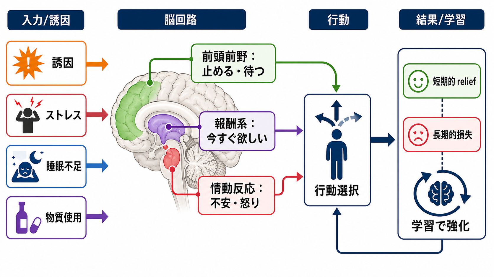
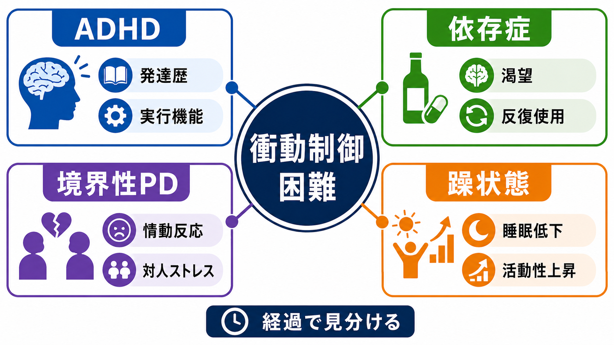
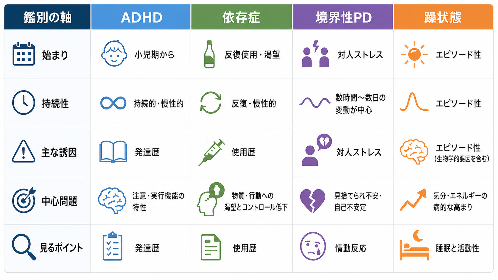

# 衝動制御困難を伴う疾患には何があるのか

## 要点

- 衝動制御困難は単一の診断名ではなく、「待てない」「止められない」「危険を見積もれない」「つらさをすぐ下げたい」といった行動上の現れをまとめた臨床的な入口である。
- [[ADHDとは何か]]では発達早期から続く不注意・多動性・衝動性、[[依存症における渇望とは何か]]では報酬学習と渇望、[[境界性パーソナリティ障害とは何か]]では情動調整と対人関係、[[躁病エピソードとは何か]]では気分・活動性・睡眠のエピソード性変化が中心になる。
- 鑑別では、診断名を急いで当てるより、発症時期、持続性、誘因、睡眠と活動性、物質使用歴、対人ストレス、機能障害、併存を縦断的に見る。
- 本稿は教育・研究目的の整理であり、個別の診断や治療指示ではない。自傷・他害・自殺念慮、著しい浪費や危険行動、睡眠低下を伴う急激な活動性上昇がある場合は、速やかな専門的評価が必要である。

## この記事で答える問い

1. 衝動制御困難は、どのような疾患や症候群で目立つのか。
2. ADHD、依存症、パーソナリティ障害、躁状態では、同じ「衝動的」に見える行動の背景がどう違うのか。
3. 臨床・研究で、どの軸を見れば誤った単純化を避けやすいのか。

## まず結論

衝動制御困難を伴う代表的な状態には、ADHD、物質使用障害・行動嗜癖を含む依存症、境界性パーソナリティ障害を中心とするパーソナリティ病理、躁病・軽躁病を含む双極性障害の気分エピソードがある。これらは行動の見た目だけでは似ているが、時間経過が異なる。

ADHDでは、症状は小児期から始まり、複数場面で持続する不注意・多動性・衝動性として現れやすい。NIMHはADHDを、持続する不注意、多動性、衝動性によって生活機能に影響する発達障害として説明している[1]。依存症では、薬物や行動が報酬系、ストレス系、前頭前野の自己制御に影響し、渇望と反復使用を通じて「やめたいのにやめにくい」状態が形成される[2]。境界性パーソナリティ障害では、情動調整の困難、自己像の不安定さ、対人関係の揺れ、衝動性が結びつきやすい[3]。躁状態では、気分・エネルギー・活動性・睡眠のまとまった変化として、普段と違う危険行動や判断の変化が出る[4]。

## 背景

「衝動的」という言葉は便利だが、臨床では曖昧である。たとえば、順番を待てずに割り込む、飲酒や薬物使用を止められない、対人ストレスのあとに危険な行動をとる、睡眠をほとんど取らずに大きな買い物や事業計画に走る、という行動はすべて衝動的に見える。しかし、背景にある仕組みは同じではない。

この違いを見ないと、「性格の問題」「意志の弱さ」「ADHDに違いない」「双極性障害に違いない」といった早すぎる説明になりやすい。衝動制御困難は、診断名ではなく評価の入口である。入口で見るべきなのは、行動の速さだけではなく、何に反応して起きるのか、どれくらい続くのか、本人の通常状態と比べてどう変化したのか、後からどのような損失や学習が起きるのかである。

## 基本概念

### 衝動性と衝動制御困難

[[衝動性とは何か]]で扱うように、衝動性は多面的である。代表的には、反応抑制の弱さ、遅延報酬を待ちにくいこと、報酬手がかりに強く引き寄せられること、感情が高まったときに行動が先に出ることなどが含まれる。したがって、衝動制御困難を見たときは、「どの衝動性か」を分ける必要がある。

研究的には、前頭前野による制御、線条体・報酬系による接近行動、扁桃体などの情動反応、ストレスや睡眠不足、物質使用による状態変化が相互作用する。NIDAは依存症の説明で、基底核の報酬回路、拡張扁桃体のストレス反応、前頭前野の自己制御が反復使用と衝動制御低下に関わると整理している[2]。この枠組みは、依存症に限らず、疾患横断的な理解にも役立つ。

### 「疾患名」より先に見る軸

衝動制御困難を整理するときは、少なくとも次の軸を見る。

| 軸 | 見ること | ADHD | 依存症 | 境界性パーソナリティ障害 | 躁状態 |
|---|---|---|---|---|---|
| 発症時期 | いつからあるか | 小児期から | 使用・行動の反復後に目立つことが多い | 思春期から成人早期に顕在化しやすい | エピソードとして出現 |
| 持続性 | 持続か波か | 持続的・場面横断的 | 使用周期・渇望・離脱と関連 | 対人ストレスで数時間から数日の変動 | 数日から週単位の気分・活動性変化 |
| 主な誘因 | 何で悪化するか | 退屈、待機、複雑な段取り | 手がかり、離脱、不快感 | 見捨てられ不安、対人摩擦 | 睡眠低下、気分上昇、活動性亢進 |
| 中心問題 | 何が中核か | 注意・実行機能 | 渇望と反復使用 | 情動調整と対人関係 | 気分・エネルギー・睡眠 |
| 評価の要点 | 何を確認するか | 発達歴と複数場面 | 使用歴とコントロール喪失 | 関係性と自己像の揺れ | 通常状態との差と機能障害 |

## 仕組み

### 1. ADHD：発達歴と実行機能の問題として見る

ADHDの衝動性は、単に「欲望に弱い」というより、反応を止める、待つ、順番を守る、発言を抑える、複数の手順を保持する、といった[[実行機能とは何か]]に関わる問題として現れやすい。NIMHは、ADHDの衝動性を「考える前に行動する」「自己制御が難しい」といった形で説明し、症状が小児期から始まり、学校・仕事・対人関係などに影響しうると述べている[1]。

鑑別で重要なのは、衝動的行動が一時的な気分エピソードだけで説明できるのか、それとも幼少期から複数場面で続いているのかである。たとえば、普段から締切管理、待機、段取り、忘れ物、会話の割り込みに困難があり、状況が変わっても似たパターンが残るなら、ADHDの評価が必要になる。一方、成人後に突然、睡眠低下と活動性上昇を伴って危険行動が出た場合は、躁状態や物質・薬剤の影響を先に疑う必要がある。

### 2. 依存症：報酬学習と渇望として見る

依存症では、衝動制御困難は「快楽を求める」だけでは説明できない。NIDAは、薬物が報酬回路を強く活性化し、反復使用によって手がかりと使用行動が結びつき、渇望が長く残りうると説明している[2]。さらに、使用後の不快感や離脱、ストレス反応が、再使用を「気分を上げるため」ではなく「つらさを下げるため」に押しやすくなる。

そのため、依存症の評価では、使用量だけでなく、コントロール喪失、渇望、失敗した中止・減量の試み、生活機能への影響、危険な状況での使用、耐性や離脱、使用手がかりを確認する。ADHDが併存すると、退屈耐性、計画、報酬遅延、生活リズムの困難が依存行動を維持しやすくなることもある。これは [[依存症とADHDはどう関係するのか]] と接続して考えられる。

### 3. 境界性パーソナリティ障害：情動調整と対人文脈として見る

境界性パーソナリティ障害では、衝動性は情動調整の困難と切り離しにくい。NIMHは、境界性パーソナリティ障害を、感情調整の困難が衝動性、自己像、対人関係に影響する疾患として説明している[3]。レビュー研究でも、BPDでは情動不安定性、対人関係、衝動性が相互に結びつくと整理されている[5]。

ここで重要なのは、行動の直前に何があったかである。見捨てられ不安、拒絶への敏感さ、関係の急な理想化・脱価値化、怒り、空虚感、自傷や過量服薬などが対人ストレスの文脈で反復するなら、単なる反応抑制の問題ではなく、情動調整と関係性のパターンとして評価する必要がある。なお、BPDと双極性障害は混同されやすいため、[[パーソナリティ障害と双極性障害はどう鑑別するのか]] のように、気分変動の持続時間、誘因、エピソード性、睡眠変化を分けて見る。

### 4. 躁状態：気分・睡眠・活動性のエピソードとして見る

躁状態での衝動的行動は、気分の高揚または易怒性、活動性・エネルギーの増加、睡眠欲求の低下、誇大性、多弁、観念奔逸、注意散漫、危険行動がまとまって出る文脈で理解する。NIMHは双極性障害を、気分、エネルギー、活動性、集中力の明確な変化を伴う疾患として説明している[4]。SAMHSAも、躁病エピソードでは睡眠欲求低下、思考の加速、注意散漫、衝動的・普段と異なる危険行動がみられうると説明している[6]。

ADHDとの違いは、通常状態との差である。ADHDの衝動性は発達的・持続的に見えやすい。一方、躁状態では「いつもの本人」と比べて、睡眠を取らなくても疲れない、活動量が急に増える、話が止まらない、壮大な計画に入る、金銭・性的行動・運転・仕事上の判断が急に変わる、といったエピソード性が重要になる。

## 図解

上の3枚は、衝動制御困難を「診断名の一覧」ではなく、経過と仕組みから整理するための図である。

1枚目は、ストレス、睡眠不足、物質使用などの誘因が、前頭前野による抑制、報酬系の接近、情動系の反応を通じて、すぐ反応する行動に結びつく流れを示している。2枚目は、ADHD、依存症、境界性PD、躁状態を、発達歴、渇望、情動反応、睡眠・活動性という異なる入口で整理している。3枚目は、鑑別で見るべき軸を比較表としてまとめている。

## 臨床・研究との接続

臨床評価では、衝動的行動を一回の出来事として切り取るだけでは不十分である。縦断的に、いつから、どこで、どの誘因で、どの程度の頻度で、本人の通常状態とどう違い、どのような損失が生じたかを確認する必要がある。特に、物質使用、睡眠不足、躁状態、自傷・自殺リスクは、評価の優先順位を上げる。

研究では、衝動性は疾患横断的な構成概念として扱われる。反応抑制課題、遅延割引課題、報酬学習課題、情動誘発下の意思決定課題などは、それぞれ異なる側面を測る。ADHD研究では実行機能や前頭線条体回路、依存症研究では報酬学習と渇望、BPD研究では情動調整と対人文脈、双極性障害研究では睡眠・概日リズム・活動量の変化が重要な観察対象になる[2][5][7][8]。

## よくある誤解

### 誤解1：「衝動的ならADHDである」

ADHDは重要な候補だが、衝動的行動だけでは診断できない。発達歴、複数場面での持続、機能障害、併存、物質使用、気分エピソードを確認する必要がある[1]。

### 誤解2：「依存症は意志が弱いだけである」

依存症では、報酬回路、ストレス反応、前頭前野の制御、環境手がかりが相互作用する。本人の責任だけに還元すると、評価も支援も単純化されすぎる[2]。

### 誤解3：「境界性パーソナリティ障害の衝動性は操作的である」

BPDの行動は、強い情動反応、見捨てられ不安、自己像の揺れ、対人ストレスと結びついて理解する必要がある。行動の意味を決めつけるより、直前の情動と関係性の文脈を評価する[3][5]。

### 誤解4：「躁状態は気分が良いだけである」

躁状態では、睡眠欲求低下、活動性上昇、誇大性、注意散漫、危険行動、機能障害がまとまって出ることがある。本人が快調と感じていても、周囲から見た変化や損失を評価する必要がある[4][6]。

## 関連ノート

- [[衝動性とは何か]]
- [[実行機能とは何か]]
- [[ADHDとは何か]]
- [[ADHDと双極性障害はどう鑑別するのか]]
- [[依存症における渇望とは何か]]
- [[依存症とADHDはどう関係するのか]]
- [[境界性パーソナリティ障害とは何か]]
- [[パーソナリティ障害と双極性障害はどう鑑別するのか]]
- [[躁状態とは何か]]
- [[躁病エピソードとは何か]]
- [[双極性障害とは何か]]
- [[報酬系とは何か]]
- [[ドパミンは報酬だけの物質なのか]]

## 理解チェック

1. 衝動制御困難を見たとき、行動の内容だけでなく、どのような時間経過を確認すべきか。
2. ADHDの衝動性と躁状態の危険行動を分けるとき、睡眠・活動性・通常状態との差はなぜ重要か。
3. 依存症で「渇望」と「短期的 relief」が行動を維持するとは、どのような意味か。
4. 境界性パーソナリティ障害の衝動性を、情動調整と対人文脈から見る利点は何か。

## 関連ノート候補

- 「衝動制御困難の臨床評価で何を聞くべきか」
- 「反応抑制と遅延割引はどう違うのか」
- 「睡眠不足は衝動性をどう高めるのか」
- 「物質使用と躁状態はどう鑑別するのか」

## MOC更新候補

- `content/00_MOC/MOC｜精神医学.md` の「疾患・症候群」または「症候学」周辺に追加候補。
- 並列ジョブとの競合を避けるため、本稿ではMOCファイル自体は更新しない。

## 未解決問題

- 衝動性は複数の認知・情動・報酬過程から成るため、単一尺度で十分に測れるとは限らない。
- ADHD、BPD、依存症、双極性障害は併存しうるため、鑑別と併存評価を二者択一にしない設計が必要である。
- 文化、生活環境、睡眠、貧困、トラウマ、家族・職場環境が衝動的行動に与える影響は、疾患名だけでは説明しきれない。

## 参考文献

[1] National Institute of Mental Health. *Attention-Deficit/Hyperactivity Disorder: What You Need to Know*. Revised 2025. https://www.nimh.nih.gov/health/publications/attention-deficit-hyperactivity-disorder-what-you-need-to-know

[2] National Institute on Drug Abuse. *Drugs, Brains, and Behavior: The Science of Addiction: Drugs and the Brain*. https://nida.nih.gov/publications/drugs-brains-behavior-science-addiction/drugs-brain

[3] National Institute of Mental Health. *Borderline Personality Disorder*. Revised 2025. https://www.nimh.nih.gov/health/publications/borderline-personality-disorder

[4] National Institute of Mental Health. *Bipolar Disorder*. https://www.nimh.nih.gov/health/topics/bipolar-disorder

[5] Carpenter, R. W., & Trull, T. J. (2013). Components of emotion dysregulation in borderline personality disorder: a review. *Current Psychiatry Reports, 15*(1), 335. https://doi.org/10.1007/s11920-012-0335-2

[6] Substance Abuse and Mental Health Services Administration. *What is Bipolar Disorder?* https://www.samhsa.gov/mental-health/bipolar

[7] Elliott, B. L., D'Ardenne, K., Mukherjee, P., Schweitzer, J. B., & McClure, S. M. (2022). Limbic and executive meso- and nigrostriatal tracts predict impulsivity differences in attention-deficit/hyperactivity disorder. *Biological Psychiatry: Cognitive Neuroscience and Neuroimaging, 7*(4), 415-423. https://doi.org/10.1016/j.bpsc.2021.05.002

[8] D’Aurizio, G., Di Stefano, R., Socci, V., Rossi, A., Barlattani, T., Pacitti, F., & Rossi, R. (2023). The role of emotional instability in borderline personality disorder: a systematic review. *Annals of General Psychiatry, 22*, 9. https://doi.org/10.1186/s12991-023-00439-0
