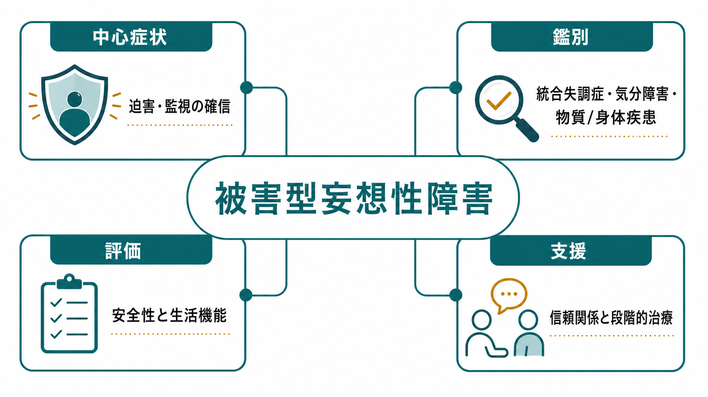
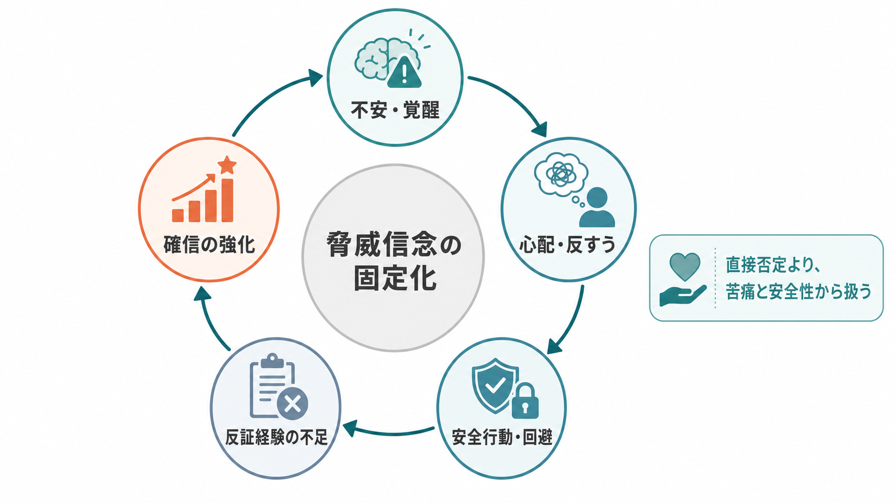
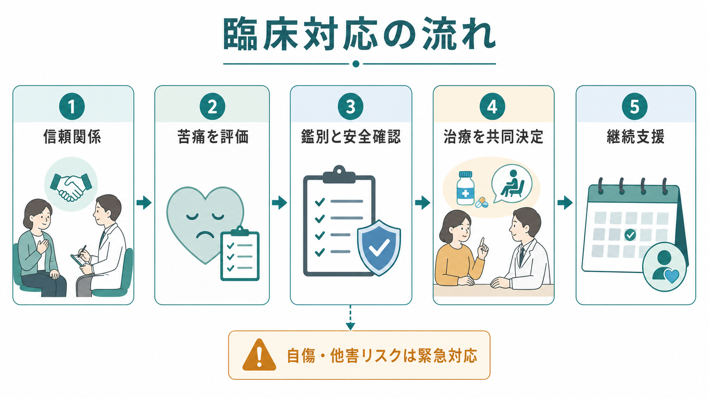

# 被害型妄想性障害とは何か

## 要点

- 被害型妄想性障害は、[[妄想性障害とは何か|妄想性障害]]のうち、迫害、監視、嫌がらせ、陰謀、毒を盛られるといった被害的主題が中心になる病態である。
- ICD-11では妄想性障害は、典型的には3か月以上持続する妄想または関連する妄想群を特徴とし、統合失調症に典型的な持続的幻覚、陰性症状、思考解体などが前景に立たない状態として整理される[1]。
- 被害妄想は「危険がある」という脅威信念として理解でき、不安、心配、睡眠不良、推論バイアス、安全行動、孤立などが相互に強め合うことがある[5][6]。
- 臨床対応では、内容の真偽を即座に論破するより、苦痛、生活機能、安全性、鑑別診断、治療同盟を優先して扱う。
- 本稿は教育・研究目的の概説であり、個別の診断や治療指示ではない。

## この記事で答える問い

1. 被害型妄想性障害は、通常の警戒心や[[被害妄想とは何か|被害妄想]]、[[統合失調症とは何か|統合失調症]]と何が違うのか。
2. なぜ「監視されている」「狙われている」という確信が固定化し、反証されにくくなるのか。
3. 臨床では、本人の確信を否定せずに、どのように安全性と支援につなげるのか。

## まず結論

被害型妄想性障害は、「被害的な確信がある人」という性格ラベルではない。妄想性障害という診断枠の中で、妄想の主題が被害・迫害に集中し、しかもその妄想が本人の生活上の判断、対人関係、警戒行動、相談行動を長期に支配している状態である[1][4]。

ただし、被害内容があるだけで直ちにこの診断になるわけではない。実際のハラスメント、ストーキング、差別、暴力被害、職場トラブル、法的紛争が存在することもある。評価では、事実関係を軽視せず、確信の強さ、反証への反応、生活機能への影響、幻覚・思考解体・気分エピソード・物質使用・身体疾患との関係を総合して判断する。

## 背景

DSM-5-TRでは妄想性障害は、1か月以上の妄想があり、統合失調症の診断基準を満たさず、妄想またはその波及以外では機能が著しく損なわれにくく、行動も奇異で目立つとは限らない状態として整理される[2]。ICD-11では、妄想または関連する妄想群が典型的には3か月以上続き、抑うつ・躁・混合エピソードでは説明されず、統合失調症に典型的な症状が前景にないことが重視される[1]。

被害型は、この妄想性障害の主題別の理解である。本人は、近隣住民、職場、組織、家族、警察、インターネット上の人々などから、監視・嫌がらせ・盗聴・毒害・追跡・名誉毀損を受けていると確信することがある。ここで重要なのは、内容が「ありえないほど奇妙か」だけではない。むしろ、日常的に起こりうる出来事が、本人にとっては一貫した迫害の証拠として組み立てられ、訂正しにくい確信として持続する点にある[3][4]。

## 基本概念

### 被害妄想と被害型妄想性障害

[[被害妄想とは何か|被害妄想]]は症状名であり、さまざまな疾患・状態でみられる。統合失調症、双極性障害やうつ病の精神病性特徴、せん妄、認知症、薬剤性精神症状、物質使用、身体疾患、トラウマ関連症状でも、被害的な確信や警戒が出現する。

一方、被害型妄想性障害は診断上のまとまりである。主題が被害的で、妄想以外の領域では会話、感情、身だしなみ、仕事の一部が比較的保たれることもある。そのため、周囲からは「理路整然としているが、その話題になると確信が非常に強い」と見えることがある[3]。

### 統合失調症との違い

統合失調症では、幻覚、思考過程の解体、陰性症状、認知機能障害、社会機能低下などがより広く問題になることが多い。妄想性障害では、妄想主題に関連した行動や対人摩擦は大きくても、それ以外の機能が比較的保たれる場合がある[1][2]。ただし、これは絶対的な線引きではない。経過中に幻覚や思考解体、陰性症状が明らかになる場合、診断の再検討が必要になる。

### 「事実ではない」と「臨床的に扱う」は別問題

被害型妄想性障害の評価で、内容の真偽だけを急いで判定すると失敗しやすい。実際の被害、誤解、過剰警戒、妄想的確信が混在していることがあるからである。臨床的には、まず「その確信によって本人がどれほど苦しみ、どのような行動を取り、どの程度安全が損なわれているか」を見る。

## 仕組み

被害妄想の認知モデルでは、中心に「自分は危険にさらされている」という脅威信念がある。そこに、不安や覚醒、心配・反すう、睡眠不良、異常な身体感覚、否定的自己信念、推論バイアス、安全行動が重なり、確信が維持される[5][6]。

たとえば、近隣の物音を「監視の合図」と解釈すると、不安が高まる。不安が高まると、物音や視線への注意がさらに鋭くなり、確認行動や録音、外出回避が増える。外出回避によって一時的には安心するが、実際には「外に出ても危険ではなかった」という反証経験を得る機会が減る。この循環によって、確信は弱まるどころか強まりやすい。

研究的には、被害妄想を単一の原因で説明するより、複数の維持因子を分解して扱う方向が進んでいる。Freemanらの研究では、心配を標的にした認知行動療法が、持続する被害妄想をもつ人の心配と妄想関連苦痛を軽減しうることが示された[7]。これは「妄想内容を直接説得する」より、「心配」「睡眠」「安全行動」「反証経験の不足」など、変えられる維持因子を扱う臨床的意義を示している。

## 図解

1枚目は、被害型妄想性障害を「中心症状」「鑑別」「評価」「支援」の4領域で整理した概念地図である。2枚目は、不安、心配、安全行動、反証経験の不足が脅威信念を固定化する循環を示す。3枚目は、臨床対応を「信頼関係」「苦痛評価」「鑑別と安全確認」「共同決定」「継続支援」の流れとして整理している。

## 臨床・研究との接続

### 評価の順序

臨床では、いきなり「それは妄想です」と言うより、次の順序で確認する。

| 評価領域 | 確認すること |
|---|---|
| 内容 | 誰に、何を、どのようにされていると考えているか |
| 確信度 | どれほど確信しているか、迷いはあるか |
| 根拠 | 何を証拠と見なしているか、反証をどう扱うか |
| 苦痛 | 不安、怒り、不眠、抑うつ、孤立がどの程度あるか |
| 行動 | 確認、録音、通報、抗議、回避、引きこもり、転居、武器の所持など |
| 安全性 | 自傷、他害、衝動性、被害を防ぐための危険行動があるか |
| 鑑別 | 統合失調症、気分障害、認知症、せん妄、物質、薬剤、身体疾患、実際の被害 |

この順序は、[[精神状態診察MSEとは何か|精神状態診察MSE]]、[[MSEで思考内容をどう評価するか]]、[[鑑別診断とは何か]]、[[精神科における文化的定式化とは何か]]と直結する。

### 治療と支援

NICEの精神病・統合失調症ガイドラインは、妄想性障害を含む精神病性障害群に対し、治療同盟、身体健康、家族・介護者支援、CBT、家族介入、抗精神病薬の共同意思決定を重視している[8]。妄想性障害に特化した大規模RCTは限られるため、個別の治療計画では、診断、重症度、リスク、本人の希望、服薬への姿勢、支援環境を組み合わせて考える必要がある。

薬物療法では抗精神病薬が検討されることが多いが、妄想性障害における反応評価の研究は方法論的にばらつきがあり、エビデンスは統合失調症ほど厚くない[4]。そのため、治療は「薬を出すか出さないか」だけではなく、睡眠、不安、抑うつ、孤立、家族関係、職場・法的問題、危機時の連絡先を含む包括的支援として設計する。

### 面接上の注意

被害型妄想では、本人にとって面接者も「疑わしい側」に入りやすい。したがって、正面から論破する、笑う、試す、隠し事をしているように見える説明をすることは、関係を損ないやすい。実践上は、次の姿勢が有用である。

- 妄想内容の真偽への同意は避けつつ、苦痛には明確に共感する。
- 「それはありえません」ではなく、「そのように感じると、かなり眠れなくなりそうです」と苦痛に焦点を移す。
- 安全確認は明確に行う。自傷・他害リスク、武器、相手への接近、通報や抗議の頻度を確認する。
- 本人が受け入れやすい目標から始める。睡眠、緊張、仕事への影響、家族との距離、生活リズムなどである。
- 家族や支援者とは、本人の同意と守秘義務を踏まえつつ、危機時の連絡経路を確認する。

## よくある誤解

### 誤解1: 被害型妄想性障害は「性格が疑い深いだけ」である

疑い深さや慎重さだけでは診断にならない。診断上問題になるのは、強い確信、反証されにくさ、生活機能への影響、苦痛、リスク、鑑別診断である。

### 誤解2: 妄想内容を説得できれば治る

強い確信をもつ妄想では、直接説得はしばしば逆効果になる。支援では、苦痛、睡眠、心配、回避、安全行動、社会的孤立など、維持因子に働きかけるほうが現実的である[5][7]。

### 誤解3: 幻覚が少なければ軽症である

妄想性障害では、妄想主題以外の機能が保たれて見えることがある。しかし、被害確信が強い場合、転居、退職、家族断絶、法的トラブル、自傷他害リスクに発展することがある。機能が保たれる面と、特定領域で深く障害される面を分けて評価する必要がある。

### 誤解4: 被害を訴える人の話はすべて妄想として扱ってよい

これは危険である。実際の被害や差別、ハラスメント、DV、ストーキング、職場トラブル、近隣トラブルは存在する。臨床では、本人の訴えを頭から否定せず、証拠、経過、第三者情報、安全性、法的・社会的支援の必要性を丁寧に確認する。

## 関連ノート

既存ノート:

- [[妄想性障害とは何か]]
- [[被害妄想とは何か]]
- [[妄想とは何か]]
- [[追跡妄想とは何か]]
- [[統合失調症とは何か]]
- [[統合失調症の陽性症状とは何か]]
- [[短期精神病性障害とは何か]]
- [[急性一過性精神病性障害とは何か]]
- [[精神状態診察MSEとは何か]]
- [[MSEで思考内容をどう評価するか]]
- [[鑑別診断とは何か]]
- [[精神科面接で避けるべき対応は何か]]
- [[治療関係とは何か]]
- [[ラポールはどのように形成されるのか]]
- [[他害リスク評価では何を見るべきか]]
- [[自殺リスク評価では何を聞くべきか]]
- [[クライシスプランとは何か]]
- [[DSMとICDは何が違うのか]]

今後の作成候補:

- 迫害型妄想とは何か
- 妄想性障害の治療同盟をどう作るか
- 被害妄想へのCBTでは何を標的にするのか
- 実際の被害と妄想的確信をどう区別するか

MOC更新候補:

- `content/00_MOC/MOC｜精神医学.md`
- `content/00_MOC/MOC｜総論・診断・面接.md`
- `content/00_MOC/MOC｜臨床実践・治療.md`

並列ジョブとの衝突を避けるため、本稿ではMOCファイルを直接更新していない。

## 理解チェック

1. 被害妄想という症状と、被害型妄想性障害という診断上のまとまりは何が違うか。
2. 妄想性障害と統合失調症を区別するとき、妄想内容以外に何を見る必要があるか。
3. 不安、心配、安全行動、反証経験の不足は、どのように被害確信を維持しうるか。
4. 面接で妄想内容を直接否定することには、どのようなリスクがあるか。
5. 被害を訴える人を評価するとき、実際の被害可能性を残しておく必要があるのはなぜか。

## 未解決問題

- 妄想性障害そのものに特化した大規模治療研究は、統合失調症スペクトラム全体の研究に比べて少ない。
- 被害型妄想性障害、統合失調症の被害妄想、気分障害に伴う被害妄想を、症状次元としてどこまで連続的に扱えるかは検討が必要である。
- 実際の被害、社会的孤立、デジタル監視不安、文化的背景、妄想的確信を、臨床評価でどう精密に分けるかは実践上の課題である。

## 参考文献

[1] World Health Organization. (2026). *ICD-11 for Mortality and Morbidity Statistics: 6A24 Delusional disorder.* https://icd.who.int/browse/2026-01/mms/en#1974996783

[2] American Psychiatric Association. (2022). *Diagnostic and Statistical Manual of Mental Disorders* (5th ed., text rev.; DSM-5-TR). American Psychiatric Association Publishing. https://doi.org/10.1176/appi.books.9780890425787

[3] Joseph, S. M., & Siddiqui, W. (2023). Delusional Disorder. In *StatPearls.* StatPearls Publishing. https://www.ncbi.nlm.nih.gov/books/NBK539855/

[4] González-Rodríguez, A., Estrada, F., Monreal, J. A., Palao, D., & Labad, J. (2018). A systematic review of the operational definitions for antipsychotic response in delusional disorder. *International Clinical Psychopharmacology, 33*(5), 261-267. https://doi.org/10.1097/YIC.0000000000000227

[5] Freeman, D., Garety, P. A., Kuipers, E., Fowler, D., & Bebbington, P. E. (2002). A cognitive model of persecutory delusions. *British Journal of Clinical Psychology, 41*(4), 331-347. https://doi.org/10.1348/014466502760387461

[6] Freeman, D. (2016). Persecutory delusions: a cognitive perspective on understanding and treatment. *The Lancet Psychiatry, 3*(7), 685-692. https://doi.org/10.1016/S2215-0366(16)00066-3

[7] Freeman, D., Dunn, G., Startup, H., Pugh, K., Cordwell, J., Mander, H., Cernis, E., Wingham, G., Shirvell, K., & Kingdon, D. (2015). Effects of cognitive behaviour therapy for worry on persecutory delusions in patients with psychosis (WIT): a parallel, single-blind, randomised controlled trial with a mediation analysis. *The Lancet Psychiatry, 2*(4), 305-313. https://pmc.ncbi.nlm.nih.gov/articles/PMC4698664/

[8] National Institute for Health and Care Excellence. (2014). *Psychosis and schizophrenia in adults: prevention and management* (NICE Clinical Guideline CG178). NCBI Bookshelf. https://www.ncbi.nlm.nih.gov/books/NBK555203/
