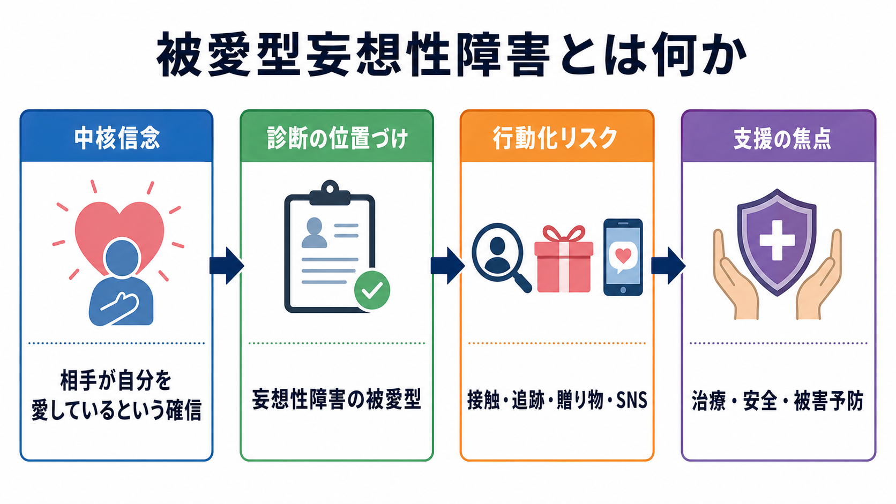
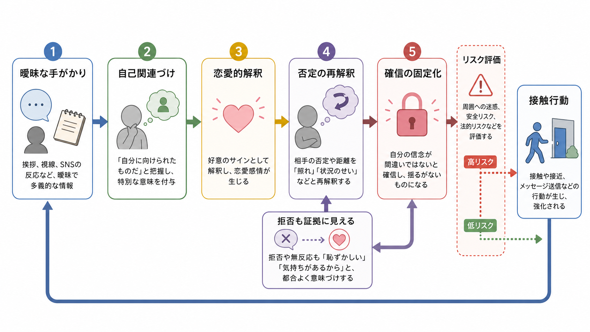
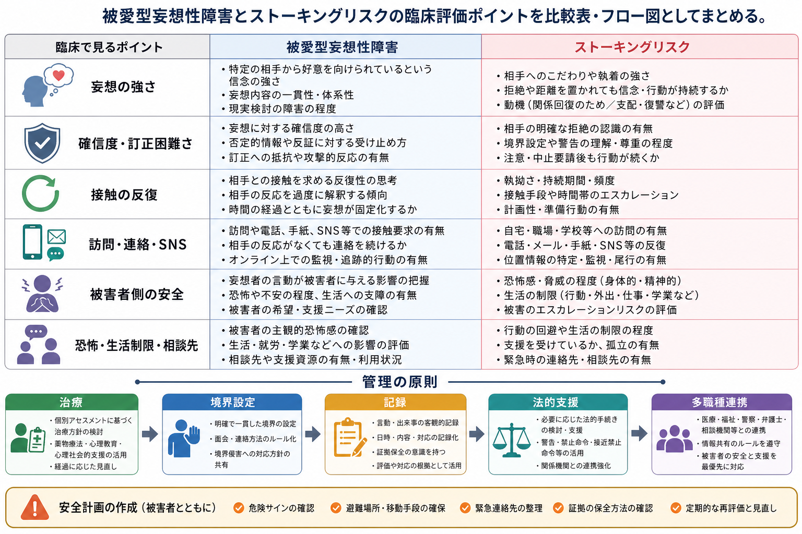

# 被愛型妄想性障害とは何か

## 要点

- 被愛型妄想性障害は、相手が自分を愛している、または特別な恋愛的関心を向けているという確信が中核になる [[妄想性障害とは何か|妄想性障害]] の一型である[1][2]。
- 重要なのは「恋愛感情があるか」ではなく、根拠の弱い解釈が訂正困難な確信となり、生活・対人関係・安全に影響するかである[1][3]。
- 拒否、無反応、距離を置く行動が、本人の中では「本当は愛しているが隠している」「周囲に妨害されている」と再解釈されることがある[1]。
- 接触、追跡、贈り物、SNSでの連絡、勤務先・自宅への訪問が反復すると、ストーキングやハラスメント、法的問題に接続しうる[1][4]。
- 臨床では、診断名を早く貼ることより、[[精神状態診察MSEとは何か|MSE]]、[[MSEで思考内容をどう評価するか|思考内容の評価]]、[[他害リスク評価では何を見るべきか|他害リスク評価]]、被害者側の安全確認を並行して行う必要がある[4][5]。

## この記事で答える問い

この記事では、[[被愛妄想とは何か|被愛妄想]] が単なる片思い、誤解、強い執着とどう違うのかを出発点に、被愛型妄想性障害の診断上の位置づけ、考えが固定化する仕組み、ストーキングリスクとの接点を整理する。医療・法・支援の境界にあるテーマなので、ここでの記述は教育・研究目的であり、個別事例の診断や治療指示ではない。

## まず結論

被愛型妄想性障害とは、「相手が自分を愛している」という信念が、本人の経験世界の中心に固定される病態である。相手は有名人、医療者、上司、教師、近隣住民、元交際相手などでありうる。DSM系の説明では、妄想性障害は少なくとも1か月以上の妄想を中核とし、統合失調症の基準を満たさず、妄想に直接関係しない機能は比較的保たれやすいとされる[1]。ICD-11では、妄想または関連する妄想群が典型的には3か月以上持続し、統合失調症に特徴的な明確で持続的な幻覚、著しい思考解体、陰性症状などが前景に立たないことが重視される[2]。

ただし、機能が保たれることは「軽い」という意味ではない。被愛型では、恋愛的確信に関連する場面だけで判断が大きく偏り、連絡、待ち伏せ、贈り物、SNS監視、勤務先や自宅への訪問が反復することがある。ICD-11の説明にも、妄想内容に直接関連する行動として、被愛対象へのストーキングが例示されている[2]。そのため、この病態は [[鑑別診断とは何か|鑑別診断]] と同時に、安全計画とリスク管理の問題として扱う必要がある。

## 背景

「エロトマニア」または「ド・クレランボー症候群」と呼ばれてきた状態は、現代の分類では主に被愛型の妄想性障害として扱われる。古典的には、相手は高い地位にある人物とされることが多かったが、現在の臨床では、SNS、メール、オンライン配信、職場・医療・支援関係など、接触可能性が広がった環境の中で多様な形をとる[3][6]。

このテーマが難しいのは、表面的には「恋愛」「片思い」「執着」「関係のもつれ」と見えやすい点である。通常の恋愛感情や失恋反応では、相手の明確な拒否、第三者からの説明、時間経過によって、信念は揺らぎうる。被愛型妄想性障害では、逆に拒否や無反応が妄想体系の中に取り込まれ、「照れている」「周囲に止められている」「本心を隠している」と解釈されることがある[1]。

## 基本概念

### 妄想性障害の一型として見る

被愛型妄想性障害は、[[妄想とは何か|妄想]] の内容が「自分は相手から愛されている」という方向に組織化された状態である。妄想性障害一般では、妄想以外の会話、身だしなみ、認知、日常生活が比較的まとまって見えることがある[1]。そのため、短時間の面接だけでは重症度が過小評価されやすい。

診断上は、[[統合失調症とは何か|統合失調症]]、気分障害の精神病症状、物質・薬剤性精神病、神経認知障害、せん妄、強迫症や身体醜形症などとの鑑別が必要である[1][2]。被愛内容だけで診断を決めず、発症時期、持続期間、幻覚・思考解体・陰性症状、気分エピソード、物質使用、身体疾患、認知機能、生活史を確認する。

### 被愛妄想とストーキングは同じではない

被愛妄想があれば必ずストーキングになるわけではない。また、ストーキングをする人が必ず精神病性障害をもつわけでもない。両者は重なることがあるが、同一視してはいけない。臨床的には、信念の確信度と訂正困難さ、対象者への接近行動、拒否への反応、生活上の損失、被害者側の恐怖や制限、過去の暴力・脅迫・違反行動を分けて評価する[4][5]。

## 仕組み

被愛型妄想性障害の仕組みは、単一の神経機構で説明できるほど単純ではない。実用的には、次のような心理・認知・社会的プロセスの重なりとして理解するとよい。

1つ目は、曖昧な手がかりの自己関連づけである。挨拶、視線、SNSの投稿、偶然の遭遇、事務的な親切が「自分に向けられた特別なサイン」として読まれる。[[関係妄想とは何か|関係妄想]] と同じく、偶然や一般的な振る舞いが自己に関係づけられる。

2つ目は、反証の再解釈である。相手の拒否、返信しないこと、距離を置くことが、通常なら信念を弱める情報になる。しかし被愛型では、それが「本心を隠している」「周囲の圧力がある」「試されている」と解釈され、むしろ確信を保つ材料になることがある[1]。

3つ目は、行動による強化である。連絡や訪問をすると、偶然の反応や小さな情報が得られる。それがさらに確信を強め、接触行動が反復される。SNSでは、相手の投稿、既読、反応、位置情報、共通の知人情報が断片的な「証拠」に見えやすく、妄想体系を補強する場合がある[6]。

## 図解

上の2枚の図は、被愛型妄想性障害を二つの水準で整理している。1枚目は診断概念、行動化リスク、支援焦点の全体地図である。2枚目は、曖昧な手がかりが自己関連づけを通じて恋愛的解釈になり、拒否の再解釈を経て確信が固定化し、接触行動につながる流れを示している。

次の図は、臨床で確認すべき点を、本人側の信念、接触行動、被害者側の安全、管理の原則に分けたものである。画像内の項目は診断基準ではなく、評価の見落としを減らすためのチェックポイントとして読む。

## 臨床・研究との接続

### リスク評価

ストーキング状況のリスク評価では、暴力の有無だけでなく、反復性、持続期間、接近手段、エスカレーション、違反行動、被害者の恐怖と生活制限を評価することが重要である[4][5]。被愛型妄想性障害では、本人が自分の行動を「愛情表現」「関係の回復」「誤解を解く努力」と意味づけることがあるため、周囲がリスクを見落としやすい。

評価では、以下を分けて確認する。

| 評価領域 | 確認すること | 臨床上の意味 |
|---|---|---|
| 妄想の強さ | 確信度、訂正困難さ、反証への反応 | 信念が行動をどれほど支配しているか |
| 接触行動 | 電話、メール、SNS、訪問、待ち伏せ、贈り物 | 反復性とエスカレーションの把握 |
| 境界設定への反応 | 拒否、警告、禁止命令への反応 | リスク管理と法的支援の必要性 |
| 被害者側の影響 | 恐怖、生活制限、職場・学校への影響 | 被害予防と支援資源の調整 |
| 併存問題 | うつ、物質使用、孤立、怒り、過去の暴力 | 自傷・他害・治療中断のリスク |

### 治療と支援

妄想性障害の治療は、病識の乏しさや治療同盟の難しさのため、単純ではない。StatPearlsは、信頼関係を基盤にした精神療法、抗精神病薬の試行、併存症への対応、多職種連携を挙げている[1]。NICEの成人精神病ガイドラインも、妄想性障害を含む精神病性障害に対して、薬物療法だけでなく心理社会的支援、身体健康、家族・介護者支援、長期的回復を重視する[7]。

被愛型では、治療者が妄想内容を直接肯定しないことが重要である。一方で、頭ごなしに否定すると、本人は「治療者も妨害者側だ」と受け取り、関係が切れやすい。[[ラポールはどのように形成されるのか|ラポール]] を保ちながら、睡眠、孤立、不安、生活上の困りごと、安全、接触行動の結果に焦点を移すことが実践的である。

### 研究上の論点

エロトマニアの発生率や有病率は十分に確立していない。レビューでは、一次性と二次性のエロトマニアが区別され、二次性では器質性疾患や他の精神疾患が背景にあることがあるとされる[3]。また、SNS利用が被愛型妄想を増悪させた症例報告もあり、デジタル環境が妄想の材料と接触手段を同時に増やす可能性が示唆されている[6]。ただし、症例報告から一般的な因果関係を断定することはできない。

## よくある誤解

### 「強い片思い」と同じなのか

同じではない。片思いや失恋反応では、相手の反応や時間経過によって解釈が変わりうる。被愛型妄想性障害では、反証が信念体系の中に取り込まれ、確信が保たれやすい。臨床上は、恋愛感情の有無ではなく、確信度、訂正困難さ、生活への影響、接触行動、安全リスクを評価する。

### 本人は常に混乱して見えるのか

そうとは限らない。妄想性障害では、妄想に直接関係しない場面では会話や身だしなみが比較的保たれ、仕事や日常生活も一定程度維持されることがある[1][2]。そのため、対象者への接近行動や被害者側の情報を聴取しないと、リスクが見えにくい。

### 被愛型なら暴力リスクが高いと決めてよいのか

決めてよいわけではない。被愛型妄想性障害があることと、暴力やストーキングが起きることは同義ではない。ただし、ストーキング研究では、リスク評価は加害者側の動機や精神状態だけでなく、行動の反復性、被害者への影響、状況の変化を含めて行う必要がある[4][5]。診断名だけで危険性を判断せず、行動と文脈で評価する。

### SNSだけの問題なのか

SNSだけの問題ではない。被愛型妄想はSNS以前から知られている。しかしSNSは、曖昧な手がかり、相手の近況、接触手段、監視の材料を増やしうる。症例報告では、ソーシャルメディア利用が被愛型妄想の増悪に関与した可能性が述べられている[6]。実践上は、オンラインとオフラインの接触行動を分けず、総量として見る。

## 関連ノート

- [[妄想性障害とは何か]]
- [[被愛妄想とは何か]]
- [[妄想とは何か]]
- [[関係妄想とは何か]]
- [[被害妄想とは何か]]
- [[MSEで思考内容をどう評価するか]]
- [[精神状態診察MSEとは何か]]
- [[他害リスク評価では何を見るべきか]]
- [[自殺リスク評価では何を聞くべきか]]
- [[鑑別診断とは何か]]
- [[ストーキングと精神医学はどう関係するのか]]
- [[ラポールはどのように形成されるのか]]

## MOC更新候補

- `content/00_MOC/` 配下の精神医学・精神病性障害・リスク評価関連MOCに、本記事 `[[被愛型妄想性障害とは何か]]` を追加候補とする。
- 並列作業での衝突を避けるため、本タスクではMOC本体は更新しない。

## 理解チェック

1. 被愛型妄想性障害では、相手の拒否や無反応がなぜ確信を弱めず、むしろ維持されることがあるのか。
2. 「被愛妄想があること」と「ストーキングをすること」を同一視してはいけない理由は何か。
3. 臨床評価で、本人の妄想内容だけでなく被害者側の安全と生活制限を確認する必要があるのはなぜか。
4. SNSは被愛型妄想性障害にどのような形で関与しうるか。

## 未解決問題

- 被愛型妄想性障害に特異的な認知・神経機構は十分に確立していない。
- エロトマニアの有病率、性差、経過、治療反応に関する大規模研究は限られている。
- SNSや配信文化が被愛妄想と接触行動に与える影響は、症例報告を超えた体系的研究が必要である。
- 被害者保護と本人の治療アクセスをどう両立するかは、医療・福祉・司法の連携課題である。

## 参考文献

[1] Joseph SM, Siddiqui W. Delusional Disorder. *StatPearls*. Updated 2023 Mar 27. NCBI Bookshelf. https://www.ncbi.nlm.nih.gov/sites/books/NBK539855/

[2] World Health Organization. ICD-11 MMS: 6A24 Delusional disorder. https://icd.who.int/browse/2025-01/mms/en#229201285

[3] Seeman MV. Erotomania: epidemiology and management. *CNS Drugs*. 2005;19(8):657-669. https://pubmed.ncbi.nlm.nih.gov/16097848/

[4] Mullen PE, Mackenzie R, Ogloff JRP, Pathé M, McEwan T, Purcell R. Assessing and managing the risks in the stalking situation. *Journal of the American Academy of Psychiatry and the Law*. 2006;34(4):439-450. https://pubmed.ncbi.nlm.nih.gov/17185471/

[5] Thomas SDM, Purcell R, Pathé M, Mullen PE. Harm associated with stalking victimization. *Australian & New Zealand Journal of Psychiatry*. 2008;42(9):800-806. https://doi.org/10.1080/00048670802277230

[6] Faden J, Levin J, Mistry R, Wang J. Delusional Disorder, Erotomanic Type, Exacerbated by Social Media Use. *Case Reports in Psychiatry*. 2017;2017:8652524. https://doi.org/10.1155/2017/8652524

[7] National Institute for Health and Care Excellence. Psychosis and schizophrenia in adults: prevention and management. Clinical guideline CG178. Published 2014; last reviewed 2025. https://www.nice.org.uk/Guidance/CG178

[8] Kelly BD. Love as delusion, delusions of love: erotomania, narcissism and shame. *Medical Humanities*. 2018;44(1):15-19. https://pubmed.ncbi.nlm.nih.gov/28689196/
