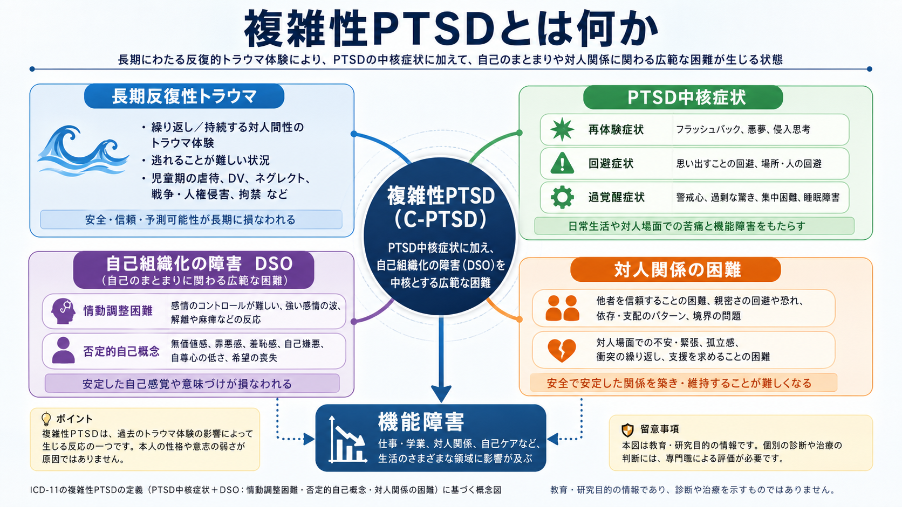
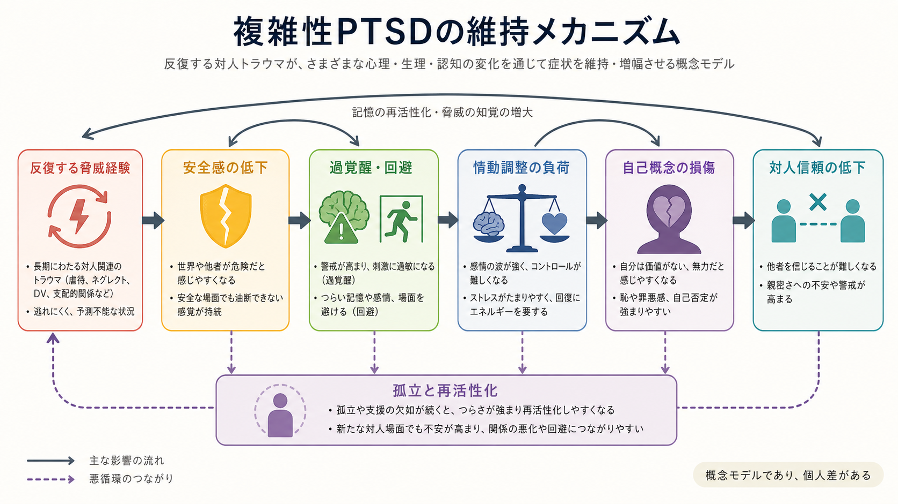
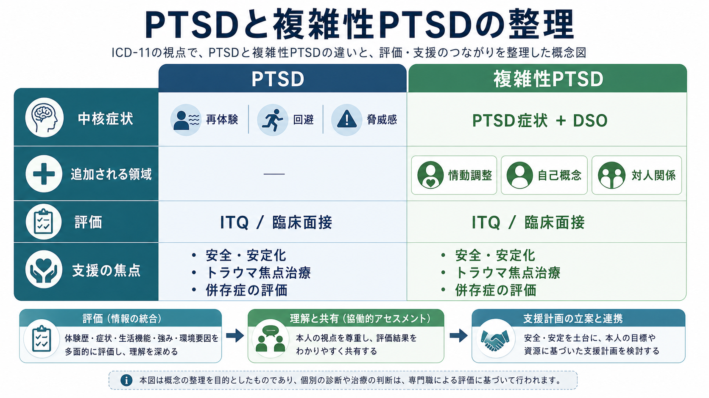

# 複雑性PTSDとは何か

## 要点

- 複雑性PTSDは、ICD-11で[[PTSDとは何か|PTSD]]とは区別して位置づけられた、トラウマ関連症状の診断概念である。PTSDの中核症状に加えて、自己組織化の障害、すなわち情動調整困難、否定的自己概念、対人関係の困難を伴う[1][2]。
- 典型的には、逃げにくい状況での長期・反復性の対人トラウマ、たとえば児童虐待、家庭内暴力、拷問、監禁、戦争・強制移動などと関連して論じられる。ただし、出来事の種類だけで機械的に決まるわけではない[2][7]。
- DSM-5-TRでは「複雑性PTSD」は独立診断として採用されていないため、臨床・研究では「ICD-11のCPTSDを指しているのか」「複雑トラウマ曝露を指しているのか」を分ける必要がある[2][6]。
- 治療では、まず安全、信頼、生活機能、併存症、解離、自傷・自殺リスクを評価し、そのうえでトラウマ焦点化治療、技能訓練、対人関係支援などを組み合わせる。これは個別診断や治療指示ではなく、教育・研究目的の整理である[5][7]。

## この記事で答える問い

1. 複雑性PTSDは、通常のPTSDと何が違うのか。
2. 「自己組織化の障害」とは、具体的にどのような症状群なのか。
3. 長期反復性トラウマは、情動調整や対人関係にどう影響しうるのか。
4. 臨床評価、研究、支援計画では何を区別して考えるべきか。

## まず結論

複雑性PTSDは、「PTSDが重い」というだけの概念ではない。ICD-11では、PTSDの3つの中核症状、すなわち現在に起きているような再体験、回避、持続する脅威感に加えて、自己組織化の障害が持続し、生活機能を損なう状態として定義される[1][3]。自己組織化の障害は、感情が急激に高まり戻りにくい、あるいは感情が麻痺するような情動調整困難、自分を無価値・敗北者・壊れた存在のように感じる否定的自己概念、他者と親密さや信頼を保ちにくい対人関係の困難からなる[1][3]。

したがって、複雑性PTSDを理解するには、過去の出来事だけでなく、現在の生活で何が起きているかを見る必要がある。外傷記憶、身体の警戒反応、回避、恥や罪悪感、対人不信、孤立、睡眠や抑うつ、不安、[[解離とは何か|解離]]などが絡み合い、本人の安全感と社会的機能を弱めることがある[2][6]。

## 背景

複雑性PTSDという考え方は、長期にわたる対人トラウマの影響が、恐怖記憶の再体験だけでは十分に説明できないという臨床的観察から発展してきた。単回の事故や災害のあとにもPTSDは起こりうるが、幼少期からの虐待、家庭内暴力、性的搾取、戦争、拷問、監禁のように、逃げにくい関係や制度のなかで脅威が続く場合、自己像、感情調整、対人関係そのものが傷つくことがある[2][8]。

ICD-11は、PTSDを比較的少数の中核症状で定義し、その隣接診断として複雑性PTSDを置いた。この整理により、PTSD中核症状と、より広い自己組織化の問題を分けて評価しやすくなった[1][2]。一方で、DSM-5-TRでは複雑性PTSDは独立診断ではなく、PTSD、解離症状、抑うつ、不安、パーソナリティ機能、物質使用、自傷リスクなどを組み合わせて評価することになる。この違いは、研究論文や臨床記録を読むときの重要な前提である[2][6]。

## 基本概念

### PTSD中核症状

ICD-11のPTSDは、トラウマを「いま起きている」ように再体験すること、関連する手がかりや記憶を回避すること、過覚醒や警戒のような現在の脅威感が続くことを中核にする[1][3]。ここで重要なのは、単に記憶が残っていることではなく、記憶、身体反応、注意、行動が現在の生活に侵入する点である。

### 自己組織化の障害

複雑性PTSDでは、PTSD中核症状に加えて、自己組織化の障害が前景に出る。自己組織化の障害は、英語では disturbances in self-organization、略して DSO と呼ばれる[3]。

| 領域 | 典型的な現れ | 臨床上の見方 |
|---|---|---|
| 情動調整困難 | 怒り・恐怖・悲しみが急激に高まる、感情が戻りにくい、感情麻痺が続く | 「過剰反応」ではなく、脅威への適応が現在にも残っている可能性を見る |
| 否定的自己概念 | 自分は壊れている、汚れている、価値がない、誰にも助けられないと感じる | 恥、罪悪感、自己非難が症状維持に関わる |
| 対人関係の困難 | 親密さを避ける、過度に警戒する、見捨てられ不安や孤立が強い | 関係内の安全感と境界設定を評価する |

### 複雑トラウマとの違い

「複雑トラウマ」は、長期・反復性・対人的なトラウマ曝露を指すことが多い。一方、「複雑性PTSD」はICD-11の診断概念であり、曝露歴だけでなく、PTSD症状、DSO症状、機能障害を満たすかが問題になる[1][7]。つまり、複雑トラウマを経験した人が必ず複雑性PTSDになるわけではなく、複雑性PTSDを疑う場合にも個別の臨床評価が必要である。

## 仕組み

複雑性PTSDの仕組みは、単一の脳部位や単一の心理機構では説明できない。むしろ、脅威検出、安全学習、身体反応、自己評価、対人予測、社会的支援のネットワークが相互に影響する状態として考えると理解しやすい。

長期反復性トラウマでは、危険を早く見つけること、相手の機嫌や暴力の兆候を読むこと、感情を抑え込むこと、助けを求めないことが、その場を生き延びるための適応になることがある。しかし、脅威が過ぎたあとも同じ反応様式が残ると、現在の安全な場面でも身体が警戒し、人間関係を危険として予測しやすくなる[2][8]。

この循環では、情動調整困難が中心的な役割を持つ。強い感情や身体反応が起こると、本人はそれを抑えるために回避、孤立、自己攻撃、解離、物質使用などに頼ることがある。短期的には苦痛を下げても、長期的には安全な関係や修正学習の機会が減り、否定的自己概念と対人不信が維持される[5][7]。

## 図解

上の1枚目は、複雑性PTSDを「長期・反復性トラウマ」「PTSD中核症状」「自己組織化の障害」「生活機能障害」のつながりとして整理した概念地図である。2枚目は、脅威検出の過敏化、情動調整の負荷、回避・孤立、関係の困難が循環しうることを示している。

3枚目は、PTSDと複雑性PTSDを並べて比較し、評価から支援計画へつなげる視点をまとめたものである。自己診断のためではなく、臨床面接や研究読解で「どの症状領域を見ているのか」を整理するための図である。

## 臨床・研究との接続

### 評価

臨床評価では、トラウマ歴の詳細を急いで語らせるよりも、現在の安全、生活機能、症状領域、併存症、支援資源を確認することが重要である。NICEは、PTSDと複雑性PTSDの人が、再体験、回避、過覚醒、感情麻痺、解離、情動調整困難、対人関係の問題、否定的自己知覚などを呈しうると整理している[5]。また、治療計画では、児童期虐待や複数のトラウマ経験など、発症・維持に関わる個人的・社会的要因を考慮する必要がある[5]。

研究では、International Trauma Questionnaire、略して ITQ がICD-11 PTSDおよび複雑性PTSDの自己記入式尺度として広く用いられている。ITQは、PTSDの中核症状、PTSD関連の機能障害、DSOの3領域、DSO関連の機能障害を評価するために開発された[3][4]。ただし、尺度は診断の補助であり、個別の診断は専門家による総合評価に基づく。

### 治療と支援

複雑性PTSDの治療では、「安定化を完全に終えてからでなければトラウマ記憶に触れられない」と単純化しすぎないことが重要である。一方で、すぐに詳細な外傷記憶処理へ進めばよいわけでもない。安全、関係性、感情調整、生活機能、併存症、本人の希望を見ながら、トラウマ焦点化治療と技能訓練を組み合わせる発想が実践的である[6][7]。

複雑トラウマ経験者を含む系統的レビューでは、心理療法はPTSD症状、抑うつ、不安、睡眠などの改善に有効性を示し、トラウマ焦点化治療や多要素介入が有望とされた[7]。ただし、研究対象は「ICD-11複雑性PTSD」と完全に一致するわけではなく、退役軍人、難民、児童期性的虐待、家庭内暴力など多様な集団が含まれる。このため、治療法の選択は、診断名だけでなく、解離、自傷リスク、生活環境、文化的背景、治療へのアクセスを含めて考える必要がある。

### 神経科学との接続

複雑性PTSDの神経科学的説明では、恐怖記憶や扁桃体反応だけでなく、内受容感覚、身体の警戒反応、前頭前野による調整、海馬を含む文脈記憶、自己関連処理、社会的予測を広く見る必要がある。たとえば、[[PTSDでは恐怖記憶ネットワークに何が起きているのか]]、[[扁桃体過活動は不安症やPTSDにどう関わるのか]]、[[解離症状は脳ネットワークでどう説明できるのか]]は、複雑性PTSDを神経科学の側から読むときの関連ノートになる。

## よくある誤解

### 誤解1: 複雑性PTSDは「PTSDの重症版」である

重症度が高いことはありうるが、ICD-11での区別は重症度だけではない。PTSD中核症状に加えて、情動調整、自己概念、対人関係にまたがるDSOがあるかが重要である[1][3]。

### 誤解2: 原因が児童虐待なら必ず複雑性PTSDである

児童虐待は重要なリスク要因だが、曝露歴だけで診断は決まらない。症状の組み合わせ、持続、機能障害、併存症、文化的文脈を含めて評価する必要がある[2][5]。

### 誤解3: 境界性パーソナリティ障害と同じである

症状が重なることはあるが、同じ概念ではない。複雑性PTSDではPTSD中核症状とDSOの組み合わせが中心になる。一方、境界性パーソナリティ障害では、対人関係、自己像、衝動性、見捨てられ不安などの広いパターンが診断上の焦点になる。鑑別は単純ではなく、併存もありうるため、臨床評価では経過、トラウマ関連手がかり、解離、自傷、怒り、関係パターンを丁寧に見る必要がある[2][6]。

### 誤解4: 治療では必ず外傷記憶を詳細に語らなければならない

トラウマ焦点化治療が有効な場合はあるが、いつ、どの程度、どの方法で扱うかは本人の安全と準備性に依存する。初期評価では、出来事の詳細よりも、現在の安全、症状、生活機能、支援資源を確認することが優先される[5][7]。

## 関連ノート

- [[PTSDとは何か]]
- [[急性ストレス障害とは何か]]
- [[解離症群とは何か]]
- [[解離とは何か]]
- [[解離症状は脳ネットワークでどう説明できるのか]]
- [[トラウマは発達にどう影響するのか]]
- [[トラウマ歴はどのように聞くべきか]]
- [[不安症群とは何か]]
- [[うつ病とは何か]]
- [[PTSDでは恐怖記憶ネットワークに何が起きているのか]]
- [[扁桃体過活動は不安症やPTSDにどう関わるのか]]

MOC更新候補: `content/00_MOC/` 配下の精神医学、疾患・症候群、トラウマ、臨床評価、神経科学と精神疾患に関連するMOC。並列生成ジョブとの競合を避けるため、本記事ではMOC本体は更新しない。

## 理解チェック

1. ICD-11の複雑性PTSDに含まれる、PTSD中核症状とDSOを分けて説明できるか。
2. 「複雑トラウマ」と「複雑性PTSD」の違いを説明できるか。
3. 情動調整困難、否定的自己概念、対人関係の困難が、どのように相互に維持されうるかを説明できるか。
4. DSM-5-TRとICD-11で、複雑性PTSDの扱いが異なることを説明できるか。
5. 本記事が教育・研究目的の整理であり、個別診断や治療指示ではない理由を説明できるか。

## 参考文献

[1] World Health Organization. (2024). *ICD-11 for Mortality and Morbidity Statistics: 6B41 Complex post traumatic stress disorder*. https://icd.who.int/browse/2024-01/mms/en#585833559

[2] Brewin, C. R., Cloitre, M., Hyland, P., Shevlin, M., Maercker, A., Bryant, R. A., Humayun, A., Jones, L. M., Kagee, A., Rousseau, C., Somasundaram, D., Suzuki, Y., Wessely, S., van Ommeren, M., & Reed, G. M. (2017). A review of current evidence regarding the ICD-11 proposals for diagnosing PTSD and complex PTSD. *Clinical Psychology Review, 58*, 1-15. https://doi.org/10.1016/j.cpr.2017.09.001

[3] Cloitre, M., Shevlin, M., Brewin, C. R., Bisson, J. I., Roberts, N. P., Maercker, A., Karatzias, T., & Hyland, P. (2018). The International Trauma Questionnaire: Development of a self-report measure of ICD-11 PTSD and Complex PTSD. *Acta Psychiatrica Scandinavica, 138*(6), 536-546. https://doi.org/10.1111/acps.12956

[4] National Center for PTSD. (2025). *International Trauma Questionnaire (ITQ)*. U.S. Department of Veterans Affairs. https://www.ptsd.va.gov/professional/assessment/adult-sr/itq.asp

[5] National Institute for Health and Care Excellence. (2018, reviewed 2025). *Post-traumatic stress disorder* (NICE guideline NG116). https://www.nice.org.uk/guidance/ng116

[6] International Society for Traumatic Stress Studies. (2019). *ISTSS Prevention and Treatment Guidelines*. https://istss.org/clinical-resources/trauma-treatment/istss-prevention-and-treatment-guidelines/

[7] Coventry, P. A., Meader, N., Melton, H., Temple, M., Dale, H., Wright, K., Cloitre, M., Karatzias, T., Bisson, J., Roberts, N. P., Brown, J. V. E., Barbui, C., Churchill, R., Lovell, K., McMillan, D., & Gilbody, S. (2020). Psychological and pharmacological interventions for posttraumatic stress disorder and comorbid mental health problems following complex traumatic events: Systematic review and component network meta-analysis. *PLOS Medicine, 17*(8), e1003262. https://doi.org/10.1371/journal.pmed.1003262

[8] Karatzias, T., & Cloitre, M. (2019). Treating adults with complex posttraumatic stress disorder using a modular approach to treatment: Rationale, evidence, and directions for future research. *Journal of Traumatic Stress, 32*(6), 870-876. https://doi.org/10.1002/jts.22457

## 未解決問題

- ICD-11複雑性PTSDに特化した治療試験は、通常のPTSD研究や複雑トラウマ曝露研究に比べるとまだ限られている。
- DSO症状、解離、境界性パーソナリティ特徴、抑うつ、不安、物質使用、身体症状が重なる場合、どの評価単位が治療選択に最も役立つかは今後も検討が必要である。
- 文化差、移民・難民経験、司法・福祉制度、家庭内暴力からの安全確保など、診断名だけでは扱えない社会的要因をどう臨床研究に組み込むかが課題である。
