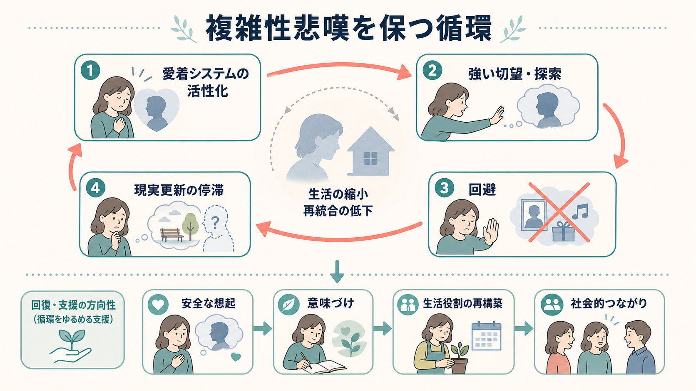

# 複雑性悲嘆とは何か

## 要点

- 複雑性悲嘆は、大切な人を失った後の悲嘆そのものではなく、故人への強い切望やとらわれ、回避、孤立、将来感の揺らぎが長く続き、仕事・学業・家庭・対人関係などの生活機能を妨げる状態を指す[1][2]。
- 現在の診断分類では、DSM-5-TR の prolonged grief disorder と ICD-11 の prolonged grief disorder が中心的な枠組みである。DSM-5-TR では成人で死別後12か月以上、小児・青年で6か月以上が目安となり、ICD-11 では死別後6か月以上を目安に、文化・宗教・社会的文脈から見て過度で持続的な悲嘆反応を評価する[1][2]。
- 仕組みとしては、愛着対象を失った後も「近づきたい」「探したい」という愛着システムが強く活性化し、喪失を思い出す刺激の回避、現実更新の停滞、生活役割の縮小が相互に強め合う、というモデルで理解できる[4][8]。
- 鑑別では、通常の悲嘆、[[うつ病とは何か]]、[[PTSDでは恐怖記憶ネットワークに何が起きているのか]]、不安症、身体疾患、薬剤・物質、文化的な喪の慣習を区別して考える必要がある[1][4]。
- 本記事は教育・研究目的の整理であり、個別の診断や治療指示ではない。死にたい気持ち、自傷・自殺の危険、生活維持の困難がある場合は、地域の救急・危機介入資源や医療機関につなぐことが優先される。

## この記事で答える問い

1. 複雑性悲嘆は、通常の悲嘆と何が違うのか。
2. DSM-5-TR と ICD-11 では、どのような条件で捉えられているのか。
3. なぜ悲嘆が長期化し、生活機能を妨げるのか。
4. うつ病や PTSD とどのように鑑別するのか。
5. 臨床・研究では、何を評価し、どのような支援につなげるのか。

## まず結論

複雑性悲嘆とは、喪失後の悲しみが「強いから」問題なのではなく、故人への切望やとらわれが生活の中心に固定され、喪失を思い出す状況を避けるほど現実への再適応が進みにくくなり、本人の生活世界が狭まっていく状態である。悲嘆は自然な反応であり、文化や宗教によって表し方も長さも大きく異なる。しかし、苦痛が長く続き、仕事・学業・家庭・対人関係・セルフケアが明らかに損なわれる場合には、通常の喪の過程だけで説明せず、複雑性悲嘆として評価する意義がある[1][2]。

## 背景

死別後の悲嘆は、精神疾患ではなく、人間にとって自然な喪失反応である。悲しみ、怒り、罪悪感、空虚感、故人を思い出す波、記念日や場所での増悪は、多くの場合、時間と支援の中で少しずつ形を変える。一方で、一部の人では、強い切望やとらわれが持続し、生活の再構築が止まり、苦痛と機能障害が長期化する[1][4]。

この状態は、歴史的には complicated grief、traumatic grief、persistent complex bereavement disorder など複数の名称で研究されてきた。近年は DSM-5-TR と ICD-11 に prolonged grief disorder が位置づけられ、研究・臨床で共通の言語を持ちやすくなった[1][2][3]。日本語では「遷延性悲嘆症」と訳されることが多いが、本ノートでは、臨床・研究で広く使われる「複雑性悲嘆」も併記する。

疫学的には、成人死別者の一部に持続的な悲嘆症状がみられる。メタ分析では、非暴力的な死別を中心にした成人サンプルで、おおよそ1割前後が prolonged grief disorder の水準に達すると推定されている。ただし、有病率は死別の種類、測定尺度、時期、文化、サンプルのリスク構成によって大きく変わる[5]。

## 基本概念

### 中心症状

中心にあるのは、故人への強い切望、または故人や死の事実への持続的なとらわれである。そこに、死を信じられない感じ、故人を思い出す刺激の回避、強い情動的痛み、社会生活への再参加の困難、感情の麻痺、故人なしの人生が無意味に感じられること、強い孤独感などが重なる[1][3]。

大切なのは、症状の「種類」だけでなく、期間、苦痛、機能障害、文化的背景を同時に見ることである。たとえば、命日や宗教的儀礼の時期に悲しみが強まること自体は病的とは限らない。逆に、表面的には泣いていなくても、仕事に行けない、他者と会えない、故人の話題や場所を徹底的に避ける、将来を考えられないといった形で機能障害が前景化することがある[1][2]。

### DSM-5-TR と ICD-11

DSM-5-TR では、成人では死別後12か月以上、小児・青年では6か月以上経過していることが前提となり、強い切望またはとらわれに加え、複数の関連症状、臨床的に意味のある苦痛または機能障害、文化的・社会的・宗教的規範を超える持続が求められる[1][3]。ICD-11 では、6か月以上を目安に、故人への持続的な切望またはとらわれ、強い情動的痛み、生活機能の障害、文化的文脈から見た過度な持続が重視される[2]。

この差は、[[DSMとICDは何が違うのか]]で扱うような分類体系の違いとも関係する。臨床的には、分類名の違いを暗記するよりも、「死別後の自然な悲嘆の範囲を尊重しつつ、苦痛と機能障害が長く続いているか」を丁寧に評価することが重要である。

## 仕組み

### 愛着システムと「探す心」

親しい人は、単なる記憶ではなく、安全基地、日課、役割、将来予測、自己理解を支える存在である。死別が起きると、脳と心は「その人がいない」という現実を一度で更新できず、危機時に愛着対象を探す反応が強く出る。複雑性悲嘆では、この探索や切望が長く持続し、故人に近づきたい気持ちと、死の現実を思い出したくない気持ちが衝突し続ける[4][8]。

### 回避と現実更新の停滞

喪失を思い出す場所、写真、会話、音楽、季節、手続き、人間関係を避けると、短期的には苦痛が下がる。しかし、避けるほど「その人が亡くなった世界でどう生きるか」を学習する機会が減り、生活役割の再構築が遅れる。結果として、思い出す刺激はますます脅威的になり、回避が強化される[4]。

### 生活機能の縮小

複雑性悲嘆では、悲しみだけでなく、睡眠、食欲、注意、身体症状、怒り、罪悪感、対人回避、仕事・学業の停滞が絡み合う。これは [[精神科で生活機能をどう評価するか]] や [[GAFやWHODASは何を評価するのか]] と接続して考えると理解しやすい。症状の重さだけではなく、「何ができなくなったか」「どの役割が止まったか」「どの支援が残っているか」を見る必要がある。

## 図解

1枚目は、死別後の自然な悲嘆から、長引く苦痛と生活機能低下へ至る見取り図である。2枚目は、愛着システム、切望、回避、現実更新の停滞、生活縮小が循環する維持メカニズムを示している。3枚目は、通常の悲嘆、複雑性悲嘆、うつ病、PTSD の鑑別ポイントを並べたものである。いずれも診断表ではなく、評価で見落としやすい軸を整理するための補助図である。

## 臨床・研究との接続

### 評価

評価では、死別の時期と状況、故人との関係、中心症状、回避、生活機能、併存症、身体疾患、薬剤・物質、文化的背景、支援資源、自殺リスクを確認する。特に、罪悪感、死にたい気持ち、故人の後を追いたい気持ち、自傷・自殺企図の既往がある場合は、[[自殺リスク評価では何を聞くべきか]] と接続して安全を優先する。

また、複雑性悲嘆は単独で存在するとは限らない。[[うつ病とは何か]]、PTSD、不安症、物質使用、身体疾患、睡眠障害が併存することがあり、[[鑑別診断とは何か]] や [[精神科診断における除外診断とは何か]] の視点が必要になる。文化的な喪の表現や宗教的実践を病理化しないためには、[[精神科における文化的定式化とは何か]] や [[文化的背景は診断にどう影響するのか]] の視点も重要である[1][2]。

### 支援・治療

複雑性悲嘆への心理療法では、故人とのつながりを消すことではなく、喪失の現実を少しずつ安全に想起し、故人との関係を新しい形で位置づけ、生活役割や将来の意味を再構築することが焦点になる。複雑性悲嘆に焦点化した心理療法や CBT 系介入は、複数の研究で有効性が示されている[4][7]。

一方で、薬物療法だけで悲嘆そのものを直接治すという位置づけは慎重に扱う必要がある。併存するうつ病、不安、不眠、PTSD 症状には薬物療法が検討されることがあるが、悲嘆の中心症状、回避、生活再構築には心理社会的支援が重要になる[4][8]。実際の支援方針は、本人の希望、リスク、併存症、支援環境、文化的背景を踏まえて、共同意思決定で考える。

### 研究

研究面では、尺度の違い、DSM と ICD の基準差、死別からの期間、死因、文化、サンプルのリスク構成が結果に影響する。神経科学的には、愛着・報酬系、ストレス反応、社会的痛み、記憶更新、回避学習などが検討されているが、現時点で単一のバイオマーカーで複雑性悲嘆を診断できる段階ではない[8]。したがって、研究知見は個別診断の代替ではなく、臨床現象をより精密に理解する地図として読むのがよい。

## よくある誤解

### 「長く悲しむのは異常である」

誤りである。悲嘆の長さと表現は、関係性、文化、宗教、死因、年齢、生活環境によって大きく異なる。複雑性悲嘆で問題になるのは、長く悲しむこと自体ではなく、強い切望・とらわれ・回避が生活機能を持続的に妨げることである[1][2]。

### 「故人を忘れれば回復する」

回復は忘却ではない。むしろ、故人との関係を心の中でどう持ち続けるか、同時に現在の生活へどう戻るかが重要になる。支援の目的は、故人との絆を消すことではなく、喪失の現実と故人とのつながりを両立できる形に再編することである[4]。

### 「うつ病と同じである」

重なる部分はあるが、同じではない。うつ病では広範な抑うつ気分、興味・喜びの低下、自己価値の低下、身体・睡眠・食欲の変化が中心になりやすい。複雑性悲嘆では、故人への切望やとらわれ、死の現実をめぐる回避、故人なしの人生への再適応困難が中心になる。ただし、両者は併存しうる[1][4]。

### 「時間がたてば必ず自然に解決する」

多くの悲嘆は時間と支援の中で変化するが、すべてが自然に軽くなるわけではない。突然死、暴力的死別、子どもや配偶者の死、強い依存関係、低い社会的支援、既往の精神疾患、不安定な生活環境などは、長期化リスクを高める可能性がある[6]。

## 関連ノート

- [[DSMとICDは何が違うのか]]
- [[うつ病とは何か]]
- [[PTSDでは恐怖記憶ネットワークに何が起きているのか]]
- [[鑑別診断とは何か]]
- [[精神科で生活機能をどう評価するか]]
- [[GAFやWHODASは何を評価するのか]]
- [[精神科における文化的定式化とは何か]]
- [[文化的背景は診断にどう影響するのか]]
- [[自殺リスク評価では何を聞くべきか]]
- [[ケースフォーミュレーションとは何か]]

MOC 更新候補: [[MOC｜精神医学]]、[[MOC｜総論・診断・面接]]、[[MOC｜臨床実践・治療]]

## 理解チェック

1. 通常の悲嘆と複雑性悲嘆を分けるとき、期間だけでなく何を見るべきか。
2. 複雑性悲嘆の中心症状は、うつ病の中心症状とどのように違うか。
3. 回避は短期的には苦痛を下げるのに、なぜ悲嘆を長期化させうるのか。
4. 文化的背景を確認しないと、どのような誤評価が起こりうるか。
5. 自殺リスク評価が必要になるサインには何があるか。

## 参考文献

[1] American Psychiatric Association. *Prolonged Grief Disorder*. Psychiatry.org. Physician review: August 2025. https://www.psychiatry.org/patients-families/prolonged-grief-disorder

[2] World Health Organization. *ICD-11 for Mortality and Morbidity Statistics: Prolonged grief disorder*. ICD-11 Browser. https://icd.who.int/browse/2024-01/mms/en#1183832314

[3] Prigerson, H. G., Boelen, P. A., Xu, J., Smith, K. V., & Maciejewski, P. K. (2021). Validation of the new DSM-5-TR criteria for prolonged grief disorder and the PG-13-Revised (PG-13-R) scale. *World Psychiatry, 20*(1), 96-106. https://doi.org/10.1002/wps.20823

[4] Szuhany, K. L., Malgaroli, M., Miron, C. D., & Simon, N. M. (2021). Prolonged Grief Disorder: Course, Diagnosis, Assessment, and Treatment. *Focus, 19*(2), 161-172. https://doi.org/10.1176/appi.focus.20200052

[5] Lundorff, M., Holmgren, H., Zachariae, R., Farver-Vestergaard, I., & O'Connor, M. (2017). Prevalence of prolonged grief disorder in adult bereavement: A systematic review and meta-analysis. *Journal of Affective Disorders, 212*, 138-149. https://doi.org/10.1016/j.jad.2017.01.030

[6] Buur, C., Boelen, P. A., & Lenferink, L. I. M. (2024). Risk factors for prolonged grief symptoms: A systematic review and meta-analysis. *Clinical Psychology Review, 107*, 102375. https://doi.org/10.1016/j.cpr.2023.102375

[7] Shear, M. K., Reynolds, C. F., Simon, N. M., Zisook, S., Wang, Y., Mauro, C., Duan, N., Lebowitz, B., & Skritskaya, N. (2016). Optimizing Treatment of Complicated Grief: A Randomized Clinical Trial. *JAMA Psychiatry, 73*(7), 685-694. https://doi.org/10.1001/jamapsychiatry.2016.0892

[8] Donaldson, Z. R., & Shear, M. K. (2024). Neurobiology and treatment advances for prolonged grief disorder. *Neuropsychopharmacology, 49*, 309-310. https://doi.org/10.1038/s41386-023-01663-8
