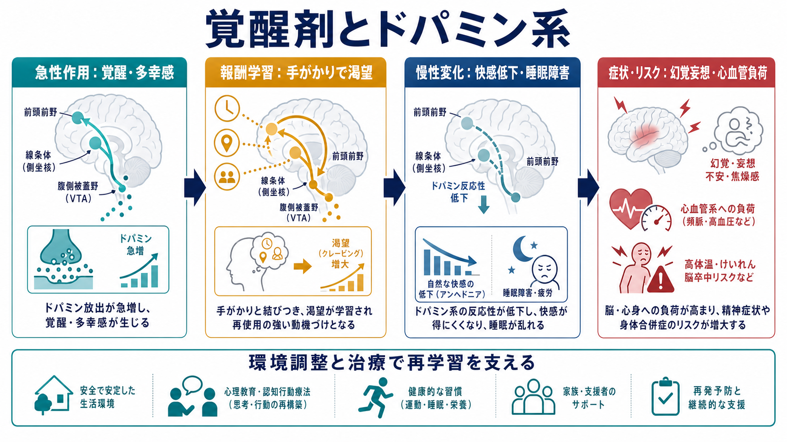
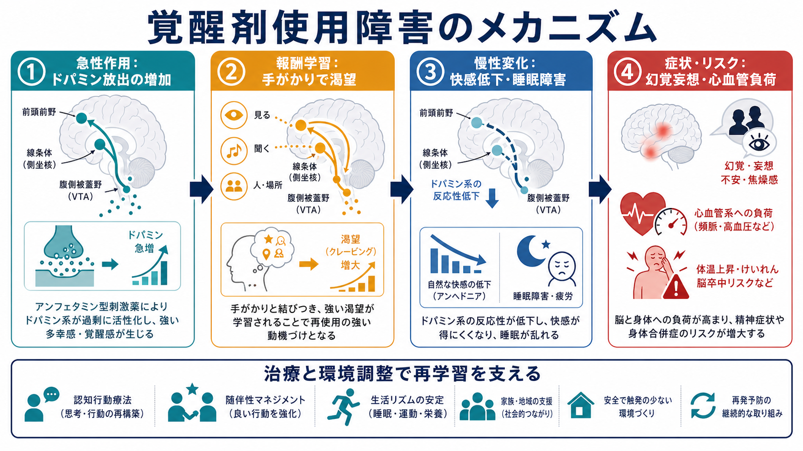

# 覚醒剤使用障害とは何か

## 要点

- 覚醒剤使用障害は、覚醒剤やアンフェタミン型刺激薬の使用が、健康、生活、対人関係、社会的役割に明らかな害をもたらしているにもかかわらず、使用の制御が難しくなる状態である。DSM-5-TR 系の整理では、12か月以内に制御困難、渇望、役割障害、危険な使用、耐性・離脱などの複数基準が重なるかを評価する[1]。
- 覚醒剤はドパミン系を強く刺激し、短期的には覚醒、多幸感、食欲低下、不眠を起こしうる一方、長期使用では渇望、快感低下、記憶・注意の問題、睡眠障害、精神病症状、心血管リスクが問題になる[2][3]。
- 覚醒剤関連精神病では、被害妄想、関係妄想、幻聴などが目立ちやすい。多くは使用中止と支援で軽快するが、再使用やストレスで再燃する場合があり、[[物質誘発性精神病とは何か]]や[[統合失調症とは何か]]との鑑別が重要になる[4]。
- 治療・支援の中心は、急性の安全確保、身体合併症の評価、心理社会的治療、再使用リスクを下げる環境調整、家族・地域支援である。日本の専門外来でも、集団認知行動療法を中心にした薬物依存症治療プログラムが用いられている[3][6]。
- 本稿は教育・研究目的の概説であり、個別の診断や治療方針は、本人の状態、身体リスク、併存症、使用歴、緊急性を踏まえた専門的評価で決まる。

## この記事で答える問い

1. 覚醒剤使用障害は、単なる「使用」や「乱用」とどう違うのか。
2. 依存、渇望、精神病症状、身体リスクはどのようにつながるのか。
3. 覚醒剤関連精神病は、一次性の精神病性障害とどう区別して考えるのか。
4. 臨床・研究では、治療、再使用予防、支援をどのように設計するのか。

## まず結論

覚醒剤使用障害は、意志の弱さや道徳的失敗として理解するより、報酬学習、ストレス反応、睡眠、身体合併症、社会環境が絡む慢性・再発性の健康問題として捉える方が実践的である[8]。覚醒剤は報酬系のドパミン伝達を強く変化させるため、使用直後の快感や覚醒だけでなく、手がかり刺激への渇望、再使用、快感低下、精神病症状につながりうる[2][3]。

ただし、脳の変化があるという説明は「治らない」という意味ではない。心理社会的治療、随伴性マネジメント、認知行動療法、生活リズムの回復、家族・地域の支援、身体合併症への対応によって、再使用リスクを下げ、生活機能を回復させる余地がある[3][6]。

## 背景

日本語で「覚醒剤」と呼ばれるものには、メタンフェタミンを中心とする強力な中枢神経刺激薬が含まれる。厚生労働省系の啓発資料では、覚醒剤は覚醒作用と陶酔感をもたらす一方、強い精神依存、覚醒剤精神病、幻覚・妄想、血圧上昇、急性心不全、強い疲労感などのリスクが示されている[5]。

精神医学的には、違法性だけで疾患を定義するのではなく、使用パターンが心身の健康、生活機能、対人関係、安全にどの程度の障害をもたらしているかを見る。したがって、臨床評価では「何を、どれだけ、どの経路で、どの頻度で、いつから使い、何が悪化し、どのような支援が利用可能か」を具体的に確認する。

## 基本概念

### 使用、乱用、使用障害

「使用」は物質を摂取した事実を指すだけで、直ちに使用障害を意味しない。一方、覚醒剤は日本では法的規制の対象であり、非医療的使用そのものが重大な法的・健康上の問題を伴う。臨床概念としての使用障害は、使用の制御困難、渇望、役割障害、危険な状況での使用、心身の問題があっても続く使用、耐性・離脱などが重なる状態を指す[1]。

### 依存と渇望

依存では、物質が生活の中心に入り込み、使用、入手、回復に多くの時間と注意が使われる。渇望は「使いたい」という単純な欲求ではなく、場所、人、感情、睡眠不足、ストレスなどの手がかりで急に強まる学習された反応である[3][8]。

### 覚醒剤関連精神病

覚醒剤関連精神病では、被害妄想、関係妄想、幻聴、強い不安、興奮、不眠が出ることがある[4]。急性中毒や睡眠不足に伴う一過性の症状から、断薬後も続く症状まで幅があるため、[[初回エピソード精神病とは何か]]、[[物質誘発性精神病とは何か]]、[[統合失調症とは何か]]との関係を、時間経過と使用歴から慎重に見る必要がある。

## 仕組み

### ドパミン系と報酬学習

覚醒剤は、腹側被蓋野、側坐核、前頭前野を含む報酬系に強く作用し、ドパミン伝達を増強する。これにより、使用直後には覚醒感や多幸感が生じやすくなる一方、「使用した場面」「一緒にいた人」「気分の状態」などが強い記憶手がかりとして結びつき、後の渇望を引き起こす[2][3]。

### 慢性使用と快感低下

慢性的な使用では、自然な報酬への反応が弱まり、楽しさを感じにくい、疲労が抜けない、睡眠が乱れる、集中できないといった状態が続くことがある[2][3]。この不快な状態を避けるために再使用が起こると、短期的には楽になったように感じても、長期的には生活機能と心身の負荷がさらに悪化しやすい。

### 精神病症状への接続

覚醒剤関連精神病は、ドパミン系の過活動だけで説明できる単純な現象ではない。睡眠不足、ストレス、使用量、使用期間、併用物質、気分症状、既存の脆弱性、社会的孤立が重なり、現実検討の低下や妄想的解釈が強まると考えられる[4][8]。

### 身体リスク

短期的には頻脈、高血圧、高体温、脱水、興奮、けいれん、事故、自傷他害リスクが問題になる。長期的には心血管系への負荷、睡眠障害、栄養状態の悪化、口腔衛生の問題、感染症リスク、認知機能の問題が臨床上の焦点になる[2][3][5]。

## 図解

上の 2 枚の図は、本文を読むための補助である。1 枚目は、依存、精神病症状、身体リスク、治療・支援を一枚の概念地図として配置している。2 枚目は、急性作用、報酬学習、慢性変化、症状・リスクへの流れを示している。

画像は理解の入口であり、診断や治療を置き換えるものではない。特に幻覚・妄想、強い興奮、胸痛、意識障害、けいれん、高体温、自傷他害の危険がある場合には、一般的な教育記事ではなく緊急対応の文脈で扱う必要がある。

## 臨床・研究との接続

### 評価

評価では、使用物質、量、頻度、経路、最終使用時刻、併用物質、既往歴、処方薬、市販薬、身体症状、睡眠、食事、精神症状、自殺リスク、暴力被害・加害リスク、家族や住居の安全を確認する。尿検査などの客観的情報は役立つが、罰するためではなく、本人と支援者が現状を共有し、リスクを下げるために使う必要がある[3]。

### 治療・支援

現時点で、覚醒剤使用障害に対して広く承認された単一の標準薬物療法が確立しているわけではない。心理社会的治療では、認知行動療法、動機づけ面接、随伴性マネジメント、ケースマネジメント、再使用予防、家族支援が重要になる[3][6]。ナルトレキソン徐放注射とブプロピオン徐放製剤の併用は、メタンフェタミン使用障害に対する RCT で有効性のシグナルを示したが、効果は限定的で、臨床実装では適応、併存症、副作用、地域制度を踏まえる必要がある[7]。

### 研究上の焦点

研究では、ドパミン系だけでなく、ストレス系、実行機能、情動調整、睡眠、社会的決定要因、スティグマ、司法制度との接点が重要になる[8]。覚醒剤関連精神病については、どの症例が短期に軽快し、どの症例が再燃・持続しやすいのかを予測することが大きな課題である[4]。

## よくある誤解

### 誤解1: 覚醒剤使用障害は本人の意志だけの問題である

意志や選択の問題を完全に無視する必要はないが、それだけでは再使用を説明できない。報酬学習、渇望、睡眠不足、ストレス、環境手がかり、社会的孤立が相互に作用するため、支援では「責める」より「再使用が起こる条件を具体化し、代替行動と安全な環境を作る」ことが重要になる[3][8]。

### 誤解2: 使用をやめれば精神病症状は必ずすぐ消える

多くの急性症状は断薬と休息で軽快しうるが、症状が長引く例、再使用なしに再燃する例、一次性の精神病性障害との鑑別が必要な例もある[4]。時間経過を追い、[[物質誘発性精神病とは何か]]との関係を慎重に評価する。

### 誤解3: 薬物療法だけで解決できる

薬物療法が必要な場面はあるが、覚醒剤使用障害の支援は薬だけでは完結しにくい。住居、生活リズム、家族関係、就労・就学、司法・福祉との接点、併存する[[うつ病とは何か]]や[[双極性障害とは何か]]などを含めた多面的支援が必要になる。

## 関連ノート

- [[物質誘発性精神病とは何か]]: 覚醒剤関連精神病を、物質使用・離脱に伴う精神病症状として理解するための入口。
- [[初回エピソード精神病とは何か]]: 初めて明確な精神病症状が出た場面で、評価と早期支援を考えるための関連ノート。
- [[統合失調症とは何か]]: 一次性の精神病性障害との鑑別、慢性経過、陰性症状・認知機能を理解するための関連ノート。
- [[うつ病とは何か]] / [[双極性障害とは何か]]: 気分症状、睡眠障害、衝動性、物質使用の相互作用を考えるための関連ノート。

### MOC更新候補

- `content/00_MOC/` 配下の精神医学、物質使用、依存症、精神病性障害に関する MOC へ追加候補。
- 並列ジョブとの競合を避けるため、このタスクでは MOC 本体は更新しない。

## 理解チェック

1. 覚醒剤使用障害を、単なる使用歴ではなく「使用の制御困難と生活機能への障害」として見る理由は何か。
2. 渇望は、なぜ「意志の弱さ」だけでは説明しにくいのか。
3. 覚醒剤関連精神病を評価するとき、使用時期、断薬後の経過、睡眠、併用物質を確認する理由は何か。
4. 治療・支援で、薬物療法以外に生活リズム、家族・地域支援、随伴性マネジメントが重要になる理由は何か。

## 未解決問題

- 覚醒剤関連精神病が短期軽快にとどまる例と、再燃・持続しやすい例をどう予測するか。
- 随伴性マネジメントや認知行動療法を、日本の医療・福祉・司法制度の中でどのように持続可能に実装するか。
- 薬物療法候補を、どの患者群、どの重症度、どの併存症に対して使うべきか。
- スティグマと刑罰化が、治療アクセス、再使用、身体合併症、家族支援に与える影響をどう減らすか。

## 参考文献

[1] Merck Manual Professional Edition. *Substance Use Disorders*. Reviewed/Revised Aug 2025; Modified Sept 2025. https://www.merckmanuals.com/professional/psychiatric-disorders/substance-related-disorders/substance-use-disorders

[2] National Institute on Drug Abuse. *Methamphetamine*. NIDA Research Report. https://nida.nih.gov/publications/research-reports/methamphetamine/what-are-long-term-effects-methamphetamine-misuse

[3] Substance Abuse and Mental Health Services Administration. *Treatment for Stimulant Use Disorders: Updated 2021*. Treatment Improvement Protocol (TIP) Series, No. 33. SAMHSA Publication No. PEP21-02-01-004. https://www.ncbi.nlm.nih.gov/books/NBK576541/

[4] Grant KM, LeVan TD, Wells SM, et al. Methamphetamine-Associated Psychosis. *Journal of Neuroimmune Pharmacology*. 2012;7:113-139. https://doi.org/10.1007/s11481-011-9288-1

[5] 厚生労働省. 覚醒剤. あやしいヤクブツ連絡ネット. https://www.yakubutsu.mhlw.go.jp/substance_abuse/stimulant_drug/

[6] 国立精神・神経医療研究センター病院. 薬物依存症外来. https://www.ncnp.go.jp/hospital/patient/special/drug-addiction.html

[7] Trivedi MH, Walker R, Ling W, et al. Bupropion and Naltrexone in Methamphetamine Use Disorder. *New England Journal of Medicine*. 2021;384(2):140-153. https://doi.org/10.1056/NEJMoa2020214

[8] Volkow ND, Blanco C. Substance use disorders: a comprehensive update of classification, epidemiology, neurobiology, clinical aspects, treatment and prevention. *World Psychiatry*. 2023;22(2):203-229. https://doi.org/10.1002/wps.21073
