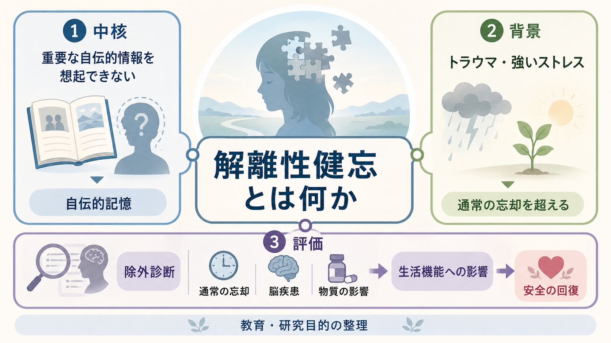
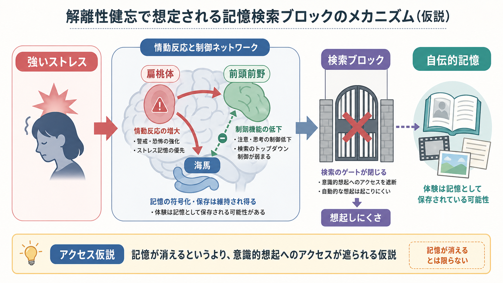
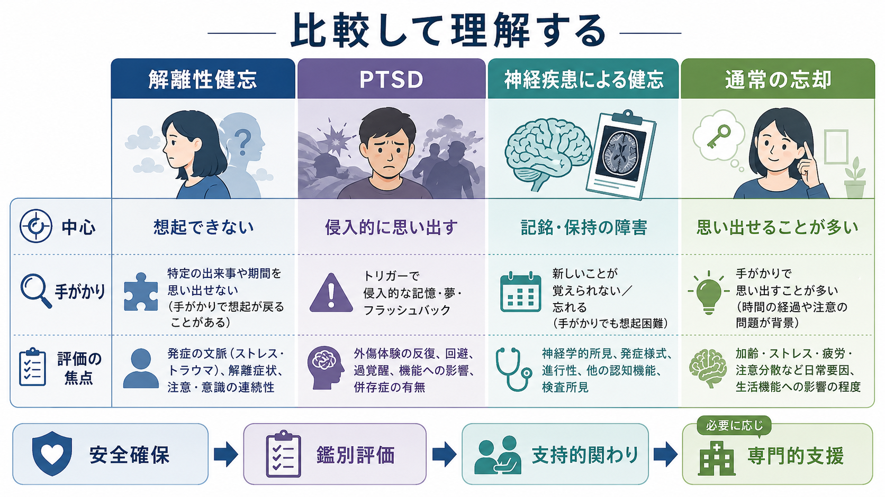

# 解離性健忘とは何か

## 要点

- 解離性健忘は、通常の物忘れでは説明しにくい形で、重要な自伝的情報を想起できない状態である。多くはトラウマや強いストレスと関連して記述されるが、脳疾患、薬物、てんかん、せん妄、認知症、PTSD などとの鑑別が重要である[1][2][4]。
- 問題の中心は、記憶が単純に「消える」ことではなく、自己に関わる記憶への意識的アクセスが遮られる、あるいは文脈化されにくくなる可能性として理解すると整理しやすい[3][5][7]。
- 臨床では、失われた記憶を無理に取り戻すことよりも、安全確保、現在の生活機能、併存症状、自傷・自殺リスク、医学的原因の除外を優先する[3][4]。
- このノートは教育・研究目的の整理であり、個別の診断や治療方針を示すものではない。

## この記事で答える問い

1. 解離性健忘は、通常の忘却や神経疾患による健忘と何が違うのか。
2. トラウマや強いストレスは、自伝的記憶の想起にどう関わるのか。
3. 「思い出せない」と「侵入的に思い出す」は、どのように併存しうるのか。
4. 臨床・研究では、どのような点に注意して評価する必要があるのか。

## まず結論

解離性健忘とは、本人にとって重要な出来事、生活史、個人情報などの[[エピソード記憶とは何か|自伝的記憶]]を想起できない状態であり、その程度が通常の忘却と不釣り合いなものを指す。DSM-5-TR では解離症群に、ICD-11 では解離症群に位置づけられ、物質、神経疾患、頭部外傷、他の精神疾患でよりよく説明されないことが求められる[1][2]。

重要なのは、解離性健忘を「トラウマがあると記憶が完全に消える」と単純化しないことである。自伝的記憶は、出来事の記録をそのまま再生する装置ではなく、手がかり、現在の目標、自己理解、感情状態によって再構成される[7]。そのため、強い恐怖、恥、無力感、回避、自己感の揺らぎが重なると、特定の記憶へのアクセスが極端に難しくなるという見方が成り立つ。

## 背景

健忘は、記憶の登録、符号化、保持、検索のどこかに問題が起きることで生じる。神経疾患では、海馬、内側側頭葉、間脳、前頭葉などの障害により、新しい記憶を作れない前向性健忘や、過去の出来事を思い出せない逆行性健忘が生じうる[8]。一方、解離性健忘では、標準的な画像検査で明確な器質的病変が見つからないことが多く、主に自伝的・エピソード的記憶の想起困難として現れる[3][5]。

この領域には長い論争がある。臨床報告や分類体系は解離性健忘を認めてきたが、症例研究の質、詐病や作話との区別、回復記憶の信頼性、暗示の影響をめぐる批判もある[6]。したがって、記事では「存在する診断名」として扱いつつ、機序や頻度については未確定な点を明確に分ける。

## 基本概念

### 解離

[[解離とは何か|解離]]は、意識、記憶、同一性、知覚、感情、身体感覚が通常の統合から外れる現象である。軽い没入やぼんやりした感じから、強い離人感、現実感喪失、健忘、同一性の連続性の障害まで幅がある。解離性健忘では、このうち記憶へのアクセスの断絶が中心になる。

### 自伝的記憶

自伝的記憶は、自分の人生に関する出来事、時期、場所、人間関係、意味づけを含む記憶である。Conway と Pleydell-Pearce の自己記憶システムでは、自伝的記憶は固定された録画ではなく、長期的な自己知識と現在の目標に照らして構成されるものとされる[7]。この視点に立つと、解離性健忘は「記憶倉庫の消失」だけではなく、「自己に関わる記憶を検索する過程の障害」として読める。

### 診断上の位置づけ

ICD-11 では、解離性健忘は、通常の忘却と不一致な形で重要な自伝的記憶を想起できず、しばしば最近のトラウマ的・ストレスフルな出来事に関係し、生活機能に有意な障害をもたらす状態として定義される[2]。DSM-5-TR でも、重要な自伝的情報を想起できないこと、通常の忘却では説明できないこと、苦痛または機能障害を伴うこと、物質や神経疾患などで説明されないことが中核になる[1]。

## 仕組み

### 記憶の保存障害ではなく検索障害として見る

解離性健忘の多くは逆行性であり、とくにエピソード的・自伝的記憶の想起に偏って問題が出ると報告されている[3]。これは、新しい情報をまったく覚えられない前向性健忘とは区別されることが多い。忘れられた情報が意識には上がらなくても、回避行動や身体反応に影響する場合があるという臨床的記述もある[4]。

このため、機序としては「記憶の保存そのものが壊れた」というより、「感情的に脅威の強い記憶へ意識的にアクセスする検索過程が遮られる」という仮説が使われる。機能性逆行性健忘のレビューでは、心理的ストレスやトラウマと関連した健忘を、脳損傷か心理的原因かの二分法だけでなく、情動、自己、記憶検索ネットワークの相互作用として捉える必要があると論じられている[5]。

### トラウマ記憶との関係

トラウマに関連する記憶は、必ず「思い出せない」方向だけに変化するわけではない。PTSD では、フラッシュバック、悪夢、侵入的想起のように、むしろ意図せず思い出される形が中心になることがある。解離性健忘では、特定の期間や出来事へのアクセスが抜け落ちるが、身体反応、情動、回避、断片的手がかりは残ることがある。この二つは対立概念ではなく、同じ人の中で併存しうる[3][4]。

[[PTSDでは恐怖記憶ネットワークに何が起きているのか]]と接続すると、恐怖記憶の過剰な活性化と、自己物語への統合の困難を分けて考えやすい。侵入的に思い出すことと、まとまった自伝的記憶として語れないことは、臨床的には同時に起こりうる。

### 脳ネットワークの見方

神経画像研究では、解離性健忘の一部で、自伝的記憶を支えるネットワークの機能変化が報告されている[3]。ただし、標準 MRI で明確な病変がないことも多く、現時点で個人の診断に使える単一のバイオマーカーは確立していない。扁桃体、海馬、前頭前野などを含む情動・文脈・制御ネットワークのモデルは理解の補助線であり、検査所見だけで診断を決めるものではない。

## 図解

上の図は、解離性健忘、PTSD、神経疾患による健忘、通常の忘却を比較するための概念図である。実際の臨床では、これらはきれいに分かれるとは限らない。頭部外傷後に強い心理的ストレスが重なる、PTSD 症状と健忘が併存する、物質使用や睡眠不足が評価を難しくする、といった混合的な状況がある。

## 臨床・研究との接続

### 評価

評価では、まず現在の安全、意識状態、急性の身体疾患、頭部外傷、てんかん、せん妄、薬物・アルコール、神経認知障害を確認する。MSD/Merck は、必要に応じて MRI/CT、脳波、毒物検査などで他の原因を除外することを挙げている[4]。これは、解離性健忘を疑う場合でも、医学的原因を見落とさないためである。

精神科的には、健忘の範囲、時間経過、手がかりで想起が戻るか、生活機能への影響、PTSD、うつ、不安、解離症状、自傷・自殺リスク、対人安全性を確認する。[[精神状態診察MSEとは何か]]や[[トラウマ歴はどのように聞くべきか]]の観点から、本人を追い詰めず、現在の安定を保ちながら情報を集めることが重要である。

### 支援

支援の初期目標は、記憶を急いで回復させることではなく、安全で支持的な環境を整えることである。MSD/Merck は、安全感の回復、支持的環境、心理療法を基本に置き、必要な場合に催眠や薬物補助面接などの記憶検索技法が検討されると説明している[4]。ただし、記憶検索技法は暗示や誤記憶の問題を伴いうるため、慎重な専門的判断が必要である。

研究レビューでも、解離性健忘に対する十分に確立したエビデンスベースの治療法は限られ、経過や回復は不均一であるとされる[3]。したがって、臨床実践では、記憶そのものだけでなく、睡眠、抑うつ、不安、PTSD 症状、生活機能、対人関係、身体症状を含めた支援計画が必要になる。

### 研究上の課題

研究では、症例報告に依存しやすいこと、診断基準や測定法が研究間で異なること、詐病・暗示・法的文脈の影響を除外しにくいことが課題である[3][6]。一方で、機能性健忘や自伝的記憶研究は、記憶を「保存された情報」ではなく、自己、情動、手がかり、制御過程の相互作用として理解する方向に進んでいる[5][7]。

## よくある誤解

### 誤解1: トラウマ記憶は必ず完全に消える

そうではない。トラウマ後には、思い出せない部分、断片的に浮かぶ部分、身体反応として残る部分、侵入的に思い出す部分が混在しうる。記憶の有無を単純な真偽判定に使うことはできない。

### 誤解2: 思い出せないなら出来事はなかった

この推論は成り立たない。想起できないことは出来事の不存在を証明しない。一方で、後から思い出された内容が常に正確であるとも限らない。臨床では、本人の苦痛と安全を扱いながら、事実認定や法的判断とは分けて考える必要がある[6]。

### 誤解3: 解離性健忘は脳とは無関係な「心だけ」の問題である

現在の見方では、心理的ストレス、情動、自己感、記憶検索、脳ネットワークを切り離さずに考える。標準的な検査で明確な病変が見つからないことと、脳が関与していないことは同じではない[3][5]。

### 誤解4: 記憶を取り戻せばすべて解決する

記憶の回復だけが回復ではない。生活の安全、睡眠、対人関係、感情調整、併存症状、本人の意味づけが整うことも同じくらい重要である。無理な想起は苦痛を強める可能性があるため、支援は段階的であるべきである。

## 関連ノート

- [[解離とは何か]]
- [[健忘とは何か]]
- [[記憶障害とは何か]]
- [[エピソード記憶とは何か]]
- [[PTSDでは恐怖記憶ネットワークに何が起きているのか]]
- [[解離症状は脳ネットワークでどう説明できるのか]]
- [[トラウマ歴はどのように聞くべきか]]

### MOC更新候補

- `content/00_MOC/` 配下の精神医学、症候学、トラウマ、記憶関連 MOC に `[[解離性健忘とは何か]]` を追加する候補。
- 並列ジョブとの衝突を避けるため、この作業では MOC 本体は更新しない。

## 理解チェック

1. 解離性健忘と通常の忘却を分けるとき、どのような点を見るか。
2. 解離性健忘と神経疾患による健忘を鑑別するために、どのような医学的評価が必要になりうるか。
3. 「記憶が消えた」と「記憶へのアクセスが遮られた」は、どのように違うか。
4. PTSD の侵入的想起と解離性健忘は、なぜ同じ人の中で併存しうるのか。
5. 回復記憶を扱うとき、暗示や誤記憶の問題に注意する必要があるのはなぜか。

## 未解決問題

- 解離性健忘の頻度は、文化、診療環境、評価法によってどの程度変わるのか。
- どの症例で記憶検索のブロックが中心で、どの症例で神経学的要因や物質使用が重なるのか。
- 自伝的記憶ネットワークの画像所見を、個別診断ではなく群レベルの理解としてどのように臨床へ接続するか。
- 記憶回復を目標にする介入と、安全・生活機能の回復を目標にする介入を、どのように使い分けるか。

## 参考文献

[1] American Psychiatric Association. (2022). *Diagnostic and Statistical Manual of Mental Disorders, Fifth Edition, Text Revision (DSM-5-TR).* American Psychiatric Association Publishing. https://doi.org/10.1176/appi.books.9780890425787

[2] World Health Organization. (2025). *ICD-11 for Mortality and Morbidity Statistics: 6B61 Dissociative amnesia.* https://icd.who.int/browse/2025-01/mms/en#626975732

[3] Staniloiu, A., & Markowitsch, H. J. (2014). Dissociative amnesia. *The Lancet Psychiatry, 1*(3), 226-241. https://doi.org/10.1016/S2215-0366(14)70279-2

[4] Spiegel, D. (2025). Dissociative Amnesia. *Merck Manual Professional Edition / MSD Manual Professional Edition.* https://www.merckmanuals.com/en-ca/professional/psychiatric-disorders/dissociative-disorders/dissociative-amnesia

[5] Markowitsch, H. J., & Staniloiu, A. (2016). Functional (dissociative) retrograde amnesia. *Handbook of Clinical Neurology, 139*, 419-445. https://doi.org/10.1016/B978-0-12-801772-2.00036-9

[6] Mangiulli, I., Otgaar, H., Jelicic, M., & Merckelbach, H. (2022). A critical review of case studies on dissociative amnesia. *Clinical Psychological Science, 10*(2), 191-211. https://doi.org/10.1177/21677026211018194

[7] Conway, M. A., & Pleydell-Pearce, C. W. (2000). The construction of autobiographical memories in the self-memory system. *Psychological Review, 107*(2), 261-288. https://doi.org/10.1037/0033-295X.107.2.261

[8] Huang, J. (2025). Amnesias. *Merck Manual Professional Edition / MSD Manual Professional Edition.* https://www.merckmanuals.com/professional/neurologic-disorders/function-and-dysfunction-of-the-cerebral-lobes/amnesias
