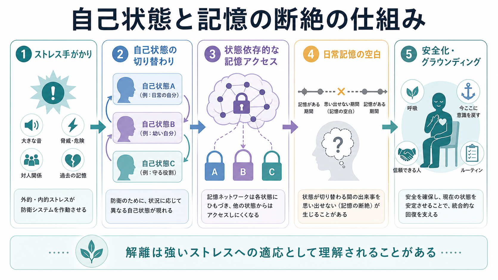
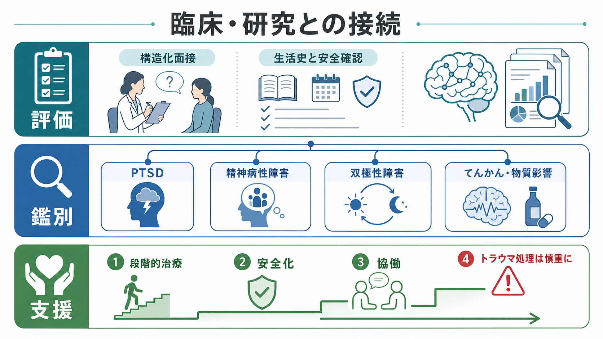

# 解離性同一性症とは何か

## 要点

- 解離性同一性症は、複数の自己状態と、日常の出来事・個人情報・外傷体験に関する記憶の断絶を特徴とする解離症である[1][2]。
- 「別人が宿る」という説明ではなく、自己感、行為主体感、記憶、感情、身体感覚の統合が状態依存的に切り替わる問題として理解すると臨床的に扱いやすい[2][4]。
- 多くの研究は、発達期の慢性的な対人トラウマ、愛着の不安定さ、文化的文脈、認知・神経生物学的要因が重なって症状形成に関与するとみている[4]。
- 診断では、[[PTSDとは何か]]、[[統合失調症とは何か]]、[[双極性障害とは何か]]、[[物質誘発性精神病とは何か]]、神経疾患、睡眠関連症状、詐病・作為症との鑑別が必要になる[2][3]。
- 治療は単一の「記憶を掘り起こす」作業ではなく、安全化、症状理解、自己状態間の協働、段階的なトラウマ処理を重視する長期的支援として設計される[5][6]。

## この記事で答える問い

- 解離性同一性症は、どのような症状のまとまりなのか。
- 複数の自己状態と記憶の断絶は、どのような仕組みとして理解できるのか。
- 臨床では何を鑑別し、どのような支援方針を考えるのか。
- よくある誤解、研究上の限界、今後の課題は何か。

## まず結論

解離性同一性症は、人格が「複数の人間」に分かれるというより、自己状態、記憶アクセス、感情調整、身体感覚、対人反応が十分に統合されず、状況に応じて異なる状態が前景化する疾患である。診断分類では、自己同一性の破綻、複数の自己状態、行為主体感の不連続、反復する健忘、生活機能の障害が中心に置かれる[1][2]。

重要なのは、症状をセンセーショナルに扱わないことである。本人の体験はしばしば苦痛を伴い、恥、混乱、対人不信、自傷リスク、併存する抑うつ・不安・PTSD症状と絡み合う。したがって臨床では、診断名を急いで貼るよりも、安全確認、生活史、トラウマ歴、解離症状、記憶障害、併存症、神経学的要因を丁寧に評価する必要がある[3][5]。

## 背景

解離とは、通常はまとまって働く意識、記憶、同一性、感情、知覚、身体感覚、運動制御が分断される現象を指す。軽い解離は強いストレス下で一過性に生じうるが、解離性同一性症ではそれが反復し、自己状態の切り替わりや記憶の空白として生活に影響する[2][3]。

DSM-5-TR では、2つ以上の人格状態または憑依体験を含む同一性の破綻、日常的出来事や重要な個人情報・外傷的出来事の想起困難、臨床的に意味のある苦痛・機能障害、文化的・宗教的慣習や物質・医学的状態では説明できないことが診断上の要点になる[1]。ICD-11 でも、2つ以上の異なる人格状態、自己感と主体感の著しい不連続、少なくとも2つの状態が反復して意識と機能の実行的統制を担うこと、健忘、機能障害が強調される[2]。

名称としては、以前の「多重人格障害」よりも「解離性同一性症」または dissociative identity disorder: DID が用いられる。これは、人格の数を数えることよりも、同一性と記憶の統合障害を評価するための名称である。

## 基本概念

### 複数の自己状態

自己状態とは、ある状況で前景化する感情、記憶、身体感覚、対人姿勢、行為のまとまりである。解離性同一性症では、この自己状態の違いが大きく、本人の名前、年齢感、身体感覚、好み、対人反応、危険への備え方まで異なることがある[2][4]。

ただし、これは「複数の独立した人間がいる」という意味ではない。臨床的には、ひとりの人の中で経験の統合が不十分な領域があり、状況依存的に異なる自己状態が意識と行動を担う、と考える方が誤解が少ない。

### 記憶の断絶

記憶の断絶は、外傷記憶だけでなく、日常生活の出来事、会話、移動、買い物、仕事、対人行動に及ぶことがある[1][2]。本人は「気づいたら時間が飛んでいた」「自分がしたはずの行動を覚えていない」「持ち物や記録から行動を推測する」と表現することがある。

ここで重要なのは、健忘が常に完全なブラックアウトとして現れるわけではない点である。曖昧な記憶、感情だけ残る記憶、身体感覚だけの想起、他人事のような記憶もありうる。[[エピソード記憶とは何か]]や[[記憶障害とは何か]]で扱う記憶システムの観点からは、記憶の保存そのものだけでなく、状態に応じたアクセスの問題として捉えられる。

### 苦痛と機能障害

診断で重要なのは、珍しい体験の有無だけではなく、それが本人の苦痛、生活機能、対人関係、学業・仕事、安全に影響しているかである[1][2]。文化的・宗教的に共有された憑依体験、遊び、空想、役割演技、通常範囲の没入は、それだけでは疾患とはみなされない。

## 仕組み

解離性同一性症の単一原因モデルは確立していない。現在の理解では、発達期の慢性的な対人トラウマ、養育環境、愛着、感情調整の困難、記憶と自己表象の発達、文化的意味づけが相互に関与する[4]。

1つの考え方は、強い脅威に対して、ある自己状態が日常生活を維持し、別の自己状態が恐怖、怒り、服従、麻痺、外傷記憶を担うように分化するというものである。この分化は短期的には耐えがたい体験を切り離す防衛として働きうるが、長期的には記憶の連続性、自己感、対人関係を損ないやすい[4][5]。

神経画像研究では、解離症群において前頭前野、前部帯状皮質、側頭・頭頂・島皮質、線条体などの機能変化が報告されている。ただし、研究数は少なく、サンプルも小さいため、「この脳部位が原因」と断定する段階ではない[8]。むしろ、[[PTSDでは恐怖記憶ネットワークに何が起きているのか]]や[[扁桃体過活動は不安症やPTSDにどう関わるのか]]と接続しながら、脅威処理、自己参照、記憶アクセス、身体感覚のネットワーク異常として慎重に理解するのがよい。

## 図解

下の図は、診断・鑑別・支援の流れを単純化したものである。実際の臨床では、本人の安全、同意、生活状況、併存症、身体疾患、トラウマ処理への準備性を個別に評価する。

## 臨床・研究との接続

### 評価

評価では、症状を「本物か偽物か」と二分するより、どの体験が、いつ、どの状況で、どの程度の苦痛や危険につながるかを調べる。生活史、トラウマ歴、健忘、離人感・現実感消失、自己状態の切り替わり、睡眠、物質使用、神経症状、抑うつ、自傷・希死念慮を含めて評価する[3][5]。トラウマ歴の聴取は、[[トラウマ歴はどのように聞くべきか]]で扱うように、詳細を急がず、安全と現在の安定性を優先する。

### 鑑別

鑑別では、[[PTSDとは何か]]、複雑性PTSD、解離性健忘、離人感・現実感消失症、[[統合失調症とは何か]]、[[双極性障害とは何か]]、境界性パーソナリティ症、てんかん、睡眠関連症状、[[物質使用歴はどのように聞くべきか]]で扱う物質影響を考える[2][3]。幻聴様体験があっても、それが自己状態間の内的対話なのか、精神病性幻聴なのか、外傷記憶の侵入なのかで評価の意味は変わる。

### 支援

ISSTD の治療ガイドラインは、成人の解離性同一性症に対して段階的治療を推奨している。典型的には、安全化と安定化、自己状態間の協働、感情調整、生活機能の回復を基盤にし、十分な準備がある場合に外傷記憶への治療的作業を慎重に進める[5]。治療レビューと長期追跡研究も、段階的で解離に焦点化した専門的治療が、症状や自傷、入院、機能に改善をもたらしうることを示している[6][7]。

これは、読者が自分でトラウマ記憶を処理すべきだという意味ではない。むしろ、安全化、睡眠、生活リズム、危機対応、支援者との協働、治療同盟が先に必要になることが多い。

## よくある誤解

### 「危険な人」という意味ではない

メディア表象では、解離性同一性症が暴力や犯罪と結びつけられることがある。しかし診断名そのものは危険性を意味しない。むしろ多くの場合、本人は強い苦痛、恥、混乱、対人不信、安全確保の難しさを抱える。

### 「演技」や「詐病」と同じではない

診断では作為症や詐病との鑑別は必要だが、解離性同一性症をそれらと同一視するのは誤りである。構造化面接、生活史、症状の一貫性、機能障害、併存症、治療経過を含めて評価する必要がある[3][4]。

### 「記憶を思い出せば治る」わけではない

解離性同一性症の治療は、失われた記憶を急いで掘り起こす作業ではない。早すぎる外傷記憶への集中は不安定化を招くことがあり、まず安全化、感情調整、自己状態間の協働、現在の生活機能の回復が重視される[5][6]。

### 「自己状態を消す」ことが目標とは限らない

治療目標は、必ずしもすべての自己状態を消すことではない。臨床的には、健忘の低減、内的協働、自己理解、安全の向上、生活機能の回復が重要である[5][6]。

## 限界と未解決問題

- 有病率や症状像は、調査方法、文化、臨床設定、構造化面接の有無で大きく変わる[4]。
- 神経画像研究は興味深いが、サンプルサイズが小さく、併存症や薬物療法の影響を完全に分離しにくい[8]。
- 治療研究は自然主義的な追跡研究や専門家合意に依存する部分があり、大規模ランダム化比較試験はまだ限られている[5][7]。
- トラウマモデル、社会認知モデル、医原性への懸念は議論されてきたが、二分法ではなく、発達、文化、臨床的相互作用、記憶・自己処理を統合して検討する必要がある[4][6]。

## 関連ノート

- [[PTSDとは何か]]
- [[トラウマは発達にどう影響するのか]]
- [[トラウマ歴はどのように聞くべきか]]
- [[エピソード記憶とは何か]]
- [[記憶障害とは何か]]
- [[統合失調症とは何か]]
- [[双極性障害とは何か]]
- [[物質使用歴はどのように聞くべきか]]
- [[DSMとICDは何が違うのか]]

## MOC更新候補

- `content/00_MOC/` 配下の精神医学系 MOC に、本記事 `[[解離性同一性症とは何か]]` を追加する候補。
- トラウマ・PTSD・解離を横断する MOC がある場合、[[PTSDとは何か]]、[[トラウマは発達にどう影響するのか]]、[[トラウマ歴はどのように聞くべきか]] と同じまとまりに置く候補。

## 理解チェック

1. 解離性同一性症でいう「複数の自己状態」は、「複数の独立した人間がいる」という意味ではなく、何の統合の問題として説明できるか。
2. 記憶の断絶は、外傷記憶だけでなく、どのような日常領域に現れうるか。
3. PTSD、精神病性障害、双極性障害、物質影響、神経疾患との鑑別が必要になる理由は何か。
4. 段階的治療で、外傷記憶への作業より先に重視されることは何か。

## 参考文献

[1] American Psychiatric Association. (2022). *Diagnostic and Statistical Manual of Mental Disorders, Fifth Edition, Text Revision (DSM-5-TR)*. https://doi.org/10.1176/appi.books.9780890425787

[2] World Health Organization. (2025). *ICD-11 for Mortality and Morbidity Statistics: 6B64 Dissociative identity disorder*. https://icd.who.int/browse/2025-01/mms/en#1829103493

[3] MSD Manual Professional Edition. (n.d.). *Dissociative Identity Disorder*. https://www.msdmanuals.com/professional/psychiatric-disorders/dissociative-disorders/dissociative-identity-disorder

[4] Dorahy, M. J., Brand, B. L., Şar, V., Krüger, C., Stavropoulos, P., Martínez-Taboas, A., Lewis-Fernández, R., & Middleton, W. (2014). Dissociative identity disorder: An empirical overview. *Australian & New Zealand Journal of Psychiatry, 48*(5), 402-417. https://doi.org/10.1177/0004867414527523

[5] International Society for the Study of Trauma and Dissociation. (2011). Guidelines for treating dissociative identity disorder in adults, third revision. *Journal of Trauma & Dissociation, 12*(2), 115-187. https://doi.org/10.1080/15299732.2011.537247

[6] Brand, B. L., Loewenstein, R. J., & Spiegel, D. (2014). Dispelling myths about dissociative identity disorder treatment: An empirically based approach. *Psychiatry, 77*(2), 169-189. https://doi.org/10.1521/psyc.2014.77.2.169

[7] Myrick, A. C., Webermann, A. R., Loewenstein, R. J., Lanius, R., Putnam, F. W., & Brand, B. L. (2017). Six-year follow-up of the treatment of patients with dissociative disorders study. *European Journal of Psychotraumatology, 8*(1), 1344080. https://doi.org/10.1080/20008198.2017.1344080

[8] Modesti, M. N., Rapisarda, L., Capriotti, G., & Del Casale, A. (2022). Functional neuroimaging in dissociative disorders: A systematic review. *Journal of Personalized Medicine, 12*(9), 1405. https://doi.org/10.3390/jpm12091405
