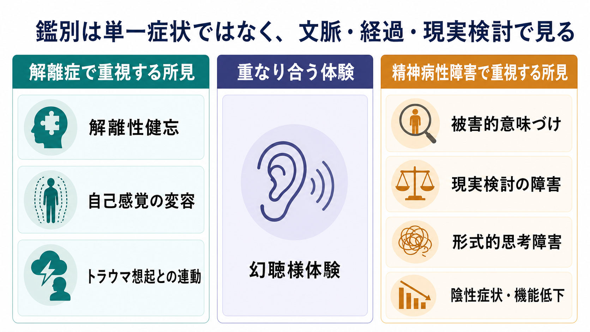
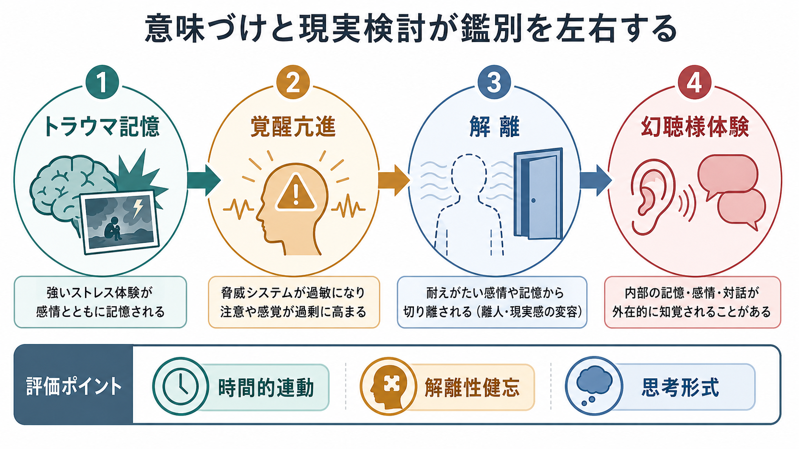
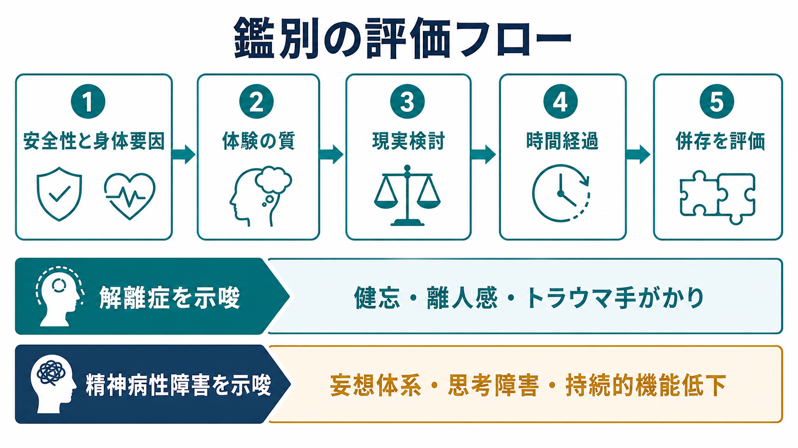

# 解離症と精神病性障害はどう鑑別するのか

## 要点

- 解離症と精神病性障害は、幻聴様体験、被影響体験、自己感覚の変容、現実感の変化で重なりうる。したがって「声が聞こえるから精神病」「トラウマ歴があるから解離」と単純化しない。
- 解離症では、意識・記憶・同一性・知覚・身体制御などの統合の途切れ、解離性健忘、離人感・現実感消失、トラウマ手がかりとの連動を丁寧にみる[1][2]。
- 精神病性障害では、持続的な妄想、持続的な幻覚、形式的思考障害、行動のまとまりにくさ、陰性症状、機能低下、現実検討の障害を評価する[3][4]。
- 解離と精神病症状には実証的な関連がある。メタ解析では、解離は幻覚、妄想、パラノイア、思考のまとまりにくさと関連し、陰性症状との関連は比較的小さい[5]。
- 実践上は、単一症状ではなく、体験の質、現実検討、時間経過、身体・物質・薬剤要因、気分症状、トラウマ歴、併存を組み合わせて仮説を更新する。

## この記事で答える問い

1. 幻聴様体験があるとき、どの点を聞けば解離症と精神病性障害の仮説を分けやすいか。
2. 離人感、現実感消失、自己感覚変容、被影響体験はどこで重なり、どこで異なるか。
3. トラウマ歴は鑑別にどう使えるか。また、どのように使うと過剰解釈になるか。
4. 初回面接や [[MSEで知覚異常をどう聞くか]]、[[MSEで思考過程をどう評価するか]]、[[MSEで思考内容をどう評価するか]] にどう接続できるか。

## まず結論

鑑別の中心は、「何を体験しているか」だけでなく、「その体験がどの状態で起こり、本人がどう意味づけ、どのくらい現実検討が保たれ、生活機能と時間経過にどう影響しているか」を見ることである。

解離症を示唆するのは、健忘や時間の抜け、状態依存的な自己感覚の変化、離人感・現実感消失、トラウマ手がかりとの時間的連動、内的な声や部分自己として体験される声、ストレス後に増悪し安全感の回復で軽減するパターンである[1][2][6]。ただし、これらは精神病性障害と併存しうる。

精神病性障害を示唆するのは、持続的で訂正困難な妄想体系、明らかな形式的思考障害、行動の著しいまとまりにくさ、陰性症状、発症前後の持続的な社会・職業機能低下、物質や身体疾患では説明しにくい持続的な幻覚・妄想である[3][4]。[[初回エピソード精神病とは何か]] の評価では、身体疾患、薬剤、物質使用、気分エピソード、発達歴、トラウマ歴を同時に確認する[7]。

## 背景

解離症と精神病性障害は、歴史的には別の診断群として扱われてきた。しかし臨床現場では、幻聴様体験、被害的意味づけ、思考が自分のものではない感じ、身体が自分から離れる感じ、記憶の抜け、自己が複数に感じられる体験が混在することがある。

体系的レビューは、統合失調症スペクトラム障害と解離症のあいだに症状の重なりがあり、精神病性障害の中にも解離症状が多く、解離症にも陽性症状様の体験がみられうることを示している[6]。そのため、鑑別は「どちらか一方を即断する作業」ではなく、複数の説明仮説を保ちながら、経過と追加情報で絞り込む作業である。

## 基本概念

### 解離症で見る軸

ICD-11では、解離症は同一性、感覚、知覚、感情、思考、記憶、身体運動の制御、行動などの通常の統合が不随意に途切れる状態として整理される[1]。この定義から、鑑別で重要になるのは次の所見である。

| 評価軸 | 解離症を示唆しやすい聞き方 |
|---|---|
| 記憶 | 「その間の出来事を後から思い出せますか」「気づいたら場所や時間が飛んでいたことはありますか」 |
| 自己感覚 | 「自分が自分でない感じ」「身体を外から見ている感じ」「世界が夢のように感じること」はあるか |
| 状態依存性 | 強い感情、対人場面、特定の匂い・声・場所、睡眠不足で増悪するか |
| 声の体験 | 声が外から聞こえるのか、内側の声・部分自己・記憶断片として感じられるのか |
| 現実検討 | 体験中または体験後に「これは症状かもしれない」と考えられる余地があるか |

離人感・現実感消失では、自己や周囲が奇妙・非現実的に感じられても、現実検討は保たれるとされる[2]。ここは精神病性障害との重要な違いになりやすいが、強い不安や睡眠不足、物質使用、うつ、パニックでも起こりうるため、単独では決め手にしない。

### 精神病性障害で見る軸

ICD-11の精神病性障害群は、現実検討の障害と行動変化を特徴とし、持続的な妄想、持続的な幻覚、まとまりにくい思考、著しくまとまりにくい行動、被影響・被支配体験、陰性症状などを含む[3]。統合失調症では、妄想、幻覚、思考障害、被影響・受動・支配体験が中核症状として扱われ、症状は少なくとも1か月持続することが求められる[4]。

精神病性障害を考えるときは、[[妄想性障害とは何か]]、[[急性一過性精神病性障害とは何か]]、[[器質性精神病とは何か]]、[[ステロイド精神病とは何か]]、[[せん妄とは何か]] も鑑別に入る。とくに発症が急性、意識変容がある、身体症状が目立つ、薬剤変更や物質使用と時間的に連動する場合は、一次性の精神病性障害だけで説明しない。

## 仕組み

トラウマ関連の解離では、脅威の手がかりによって覚醒が上がり、注意や記憶の統合が一時的に崩れ、現在の体験と過去の記憶断片が混ざることがある。このとき、内的な声、身体感覚、映像、感情が「自分のものではない」ものとして現れると、幻聴様体験や被影響体験に似て見える。

一方、精神病性障害では、持続的な意味づけの硬さ、訂正困難な妄想、形式的思考障害、陰性症状、機能低下が前景に出ることが多い。解離と精神病症状は相関するため、現象だけを切り取ると重なる。メタ解析では解離と幻覚の関連は比較的大きく、妄想やパラノイア、思考のまとまりにくさとも関連するが、これは鑑別不能という意味ではなく、共通する脆弱性やトラウマ関連過程を評価に入れる必要があるという意味である[5]。

## 図解

臨床的には、次の順で評価すると整理しやすい。

| ステップ | 見ること | 鑑別上の意味 |
|---|---|---|
| 1 | 安全性、自傷他害、意識、身体疾患、薬剤、物質使用 | まず緊急性と二次性の精神病・解離を除外する |
| 2 | 幻聴様体験の位置、声の性質、命令性、対話性、本人の意味づけ | 解離性の内的体験か、精神病性の知覚・妄想体系かを検討する |
| 3 | 現実検討、訂正可能性、確信度 | 離人感・現実感消失では現実検討が保たれやすい |
| 4 | 時間経過、持続性、機能低下、陰性症状 | 持続的な精神病性障害の可能性を評価する |
| 5 | トラウマ歴、健忘、状態依存性、併存 | 解離症、PTSD、精神病性障害の併存を検討する |

## 臨床・研究との接続

### 1. 幻聴様体験の聞き方

「声が聞こえるか」だけでは不十分である。少なくとも、声の由来感、位置、知覚の鮮明さ、命令性、対話性、本人との関係、体験前後の意識状態、トラウマ手がかりとの連動を聞く。解離症では、声が内的な部分自己、記憶断片、年齢の異なる自分、保護的または批判的な内的対話として語られることがある。精神病性障害では、外部からの声としての確信、妄想体系との結びつき、現実検討の低下、持続性がより重要になる。

### 2. 自己感覚変容の聞き方

離人感・現実感消失、被影響体験、思考挿入様体験は言葉だけでは似て聞こえる。鑑別では、「その体験を本人がどの程度現実の出来事として確信しているか」「体験中に自分を観察している感覚があるか」「後から振り返れるか」「記憶の抜けを伴うか」を分ける。離人感・現実感消失では現実検討が保たれる点が診断上重要である[2]。

### 3. トラウマ歴の扱い

トラウマ歴は重要だが、診断を自動的に決めない。[[PTSDとは何か]] や複雑性PTSD、境界性パーソナリティ特性、物質使用、気分障害、精神病性障害はいずれもトラウマ歴と併存しうる。NICEは、精神病症状をもつ成人の包括的評価に、精神症状、リスク、物質使用、身体疾患、心理社会的背景、トラウマ歴、発達歴、社会・職業機能を含めることを推奨している[7]。

### 4. 併存を前提にする

解離症か精神病性障害かの二択に急ぐと、併存や二次性要因を見落とす。たとえば、精神病性障害のある人に解離症状が強く出ることも、解離症の人に精神病症状様の体験が出ることもある[5][6]。診断名は支援の入口であり、本人の安全、苦痛、睡眠、生活機能、対人関係、回復資源を同時に評価する。

## よくある誤解

### 誤解1: 幻聴があれば統合失調症である

幻聴は精神病性障害で重要な症状だが、解離症、PTSD、うつ病、双極性障害、物質使用、てんかん、せん妄、睡眠関連現象でも生じうる。鑑別では、幻聴の有無よりも、現実検討、妄想体系、思考形式、時間経過、機能低下、身体・物質要因をみる。

### 誤解2: トラウマ歴があれば精神病性障害ではない

トラウマ歴は解離症の評価で重要だが、精神病性障害のリスクや経過にも関係しうる。トラウマがあるから精神病性障害を除外する、あるいはトラウマが語られないから解離を除外する、という扱いは避ける。

### 誤解3: 現実検討が保たれていれば問題は軽い

離人感・現実感消失では現実検討が保たれていても、苦痛や機能障害が強い場合がある[2]。現実検討だけで重症度を判断せず、苦痛、回避、対人機能、学業・職業機能、安全性を評価する。

### 誤解4: 解離症と精神病性障害は必ず明確に分かれる

研究上も臨床上も重なりは大きい。鑑別は分類ラベルを一度で確定することではなく、変化する情報に応じて仮説を更新し、本人にとって必要な支援を選ぶための作業である。

## 関連ノート

- [[PTSDとは何か]]
- [[初回エピソード精神病とは何か]]
- [[MSEで知覚異常をどう聞くか]]
- [[MSEで思考過程をどう評価するか]]
- [[MSEで思考内容をどう評価するか]]
- [[妄想性障害とは何か]]
- [[急性一過性精神病性障害とは何か]]
- [[器質性精神病とは何か]]
- [[ステロイド精神病とは何か]]
- [[せん妄とは何か]]

## MOC更新候補

- `content/00_MOC/` 配下の精神医学・トラウマ・鑑別診断系 MOC に追加候補。
- 並列ジョブとの競合を避けるため、本ジョブでは MOC ファイルを直接更新しない。

## 理解チェック

1. 幻聴様体験の鑑別で、声の有無以外に確認すべき点を3つ挙げる。
2. 離人感・現実感消失と精神病性の現実検討障害を分ける質問を1つ作る。
3. トラウマ歴を鑑別に使うとき、過剰解釈になりやすい点を説明する。
4. 精神病性障害を疑うとき、身体疾患・薬剤・物質使用を確認する理由を説明する。

## 未解決問題

- 解離症状と精神病症状の重なりが、共通するトラウマ関連機序を反映するのか、診断横断的な症状次元を反映するのかは、まだ議論が続いている。
- 幻聴様体験の質的特徴だけで解離性か精神病性かを十分に分けられるかは限界があり、縦断的評価が必要である。
- 解離が強い精神病性障害に対して、どのような心理社会的介入の組み合わせが最適かは、さらに検証が必要である。

## 参考文献

[1] World Health Organization. ICD-11 for Mortality and Morbidity Statistics: Dissociative disorders. https://icd.who.int/browse/2025-01/mms/en#108180424

[2] World Health Organization. ICD-11 for Mortality and Morbidity Statistics: Depersonalization-derealization disorder. https://icd.who.int/browse/2025-01/mms/en#253124068

[3] World Health Organization. ICD-11 for Mortality and Morbidity Statistics: Schizophrenia or other primary psychotic disorders. https://icd.who.int/browse/2025-01/mms/en#405565289

[4] World Health Organization. ICD-11 for Mortality and Morbidity Statistics: Schizophrenia. https://icd.who.int/browse/2025-01/mms/en#1683919430

[5] Longden, E., Branitsky, A., Moskowitz, A., Berry, K., Bucci, S., & Varese, F. (2020). The relationship between dissociation and symptoms of psychosis: A meta-analysis. *Schizophrenia Bulletin*, 46(5), 1104-1113. https://doi.org/10.1093/schbul/sbaa037

[6] Renard, S. B., Huntjens, R. J. C., Lysaker, P. H., Moskowitz, A., Aleman, A., & Pijnenborg, G. H. M. (2017). Unique and overlapping symptoms in schizophrenia spectrum and dissociative disorders in relation to models of psychopathology: A systematic review. *Schizophrenia Bulletin*, 43(1), 108-121. https://doi.org/10.1093/schbul/sbw063

[7] National Institute for Health and Care Excellence. (2014). *Psychosis and schizophrenia in adults: prevention and management* (NICE guideline CG178). https://www.nice.org.uk/guidance/cg178

[8] International Society for the Study of Trauma and Dissociation. (2011). Guidelines for treating dissociative identity disorder in adults, third revision. *Journal of Trauma & Dissociation*, 12(2), 115-187. https://doi.org/10.1080/15299732.2011.537247
