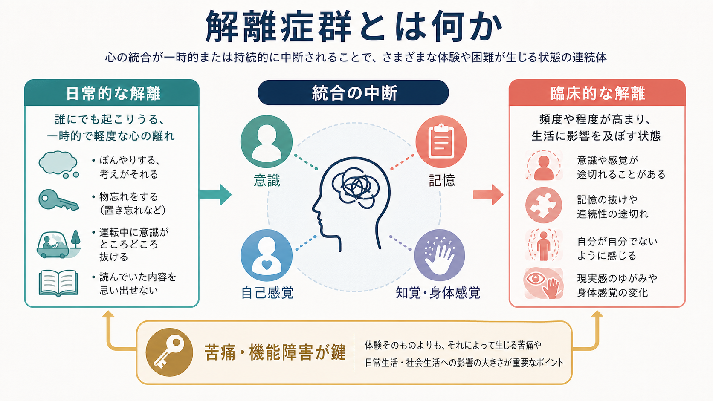
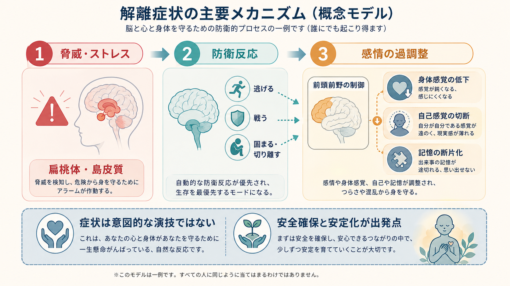
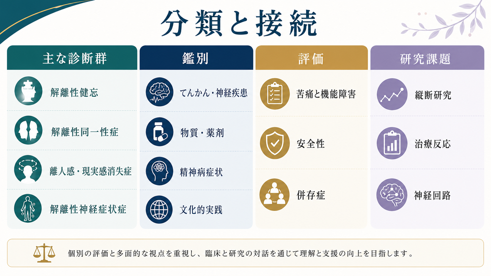

# 解離症群とは何か

## 要点

- 解離症群は、意識、記憶、同一性、自己感覚、知覚、身体感覚、運動制御などの通常は統合されている機能が、途切れたり分断されたりする疾患群である[1][3]。
- ぼんやりする、運転中の記憶が曖昧になる、強い疲労時に現実感が薄れるといった一過性の解離体験は珍しくない。臨床的な問題になるのは、頻度・持続・苦痛・機能障害が大きく、他の医学的要因や文化的実践だけでは説明しにくい場合である[2][3]。
- DSM-5-TRでは、解離性同一性症、解離性健忘、離人感・現実感消失症などが中心に置かれる[1]。ICD-11では、解離性神経症状症、トランス症、憑依トランス症なども解離症群の中で明示される[2]。
- トラウマや強いストレスと関連することが多いが、「トラウマがあれば必ず解離症になる」わけでも、「解離症なら必ず特定の出来事を思い出せる」わけでもない[3][6]。
- 臨床では、症状の真偽を単純に疑うより、てんかん、神経疾患、物質・薬剤、精神病症状、PTSD、文化的・宗教的実践との鑑別を丁寧に行うことが重要である[1][2][4]。

## この記事で答える問い

- 解離症群は、単なる「忘れっぽさ」や「現実逃避」と何が違うのか。
- どのような診断群が含まれるのか。
- 脳・身体・記憶・自己感覚の観点から、どのような仕組みで理解できるのか。
- 臨床や研究では、どこに注意して評価・支援するのか。

## まず結論

解離症群は、「心が弱い」「演技している」という話ではなく、経験をひとまとまりに保つ統合機能が、ストレス、脅威、防衛反応、記憶処理、身体感覚、自己感覚の複雑な相互作用の中で崩れる状態として理解できる。症状の中心は、意識が抜ける、記憶が途切れる、自分が自分でないように感じる、現実感が薄れる、身体が自分のものとして感じられない、運動・感覚症状が神経疾患と一致しない形で現れる、といった「統合の中断」である[1][2][3]。

## 背景

解離という言葉は、日常的な注意の逸れから重い同一性の分断まで、幅広い現象に使われる。そのため、解離症群を理解するには、まず「正常範囲の一過性体験」と「臨床的障害」を分ける必要がある。MSD Manualは、記憶、知覚、同一性、意識などの自動的統合が一時的に失敗すること自体は誰にでも起こりうるが、解離症ではその破綻が生活機能や自己の連続性を損なうと整理している[3]。

分類上も、DSM-5-TRとICD-11では範囲が完全には一致しない。DSM-5-TRは主に解離性同一性症、解離性健忘、離人感・現実感消失症を中心に構成する[1]。一方、ICD-11は、運動・感覚・認知症状として現れる解離性神経症状症や、トランス・憑依トランスに関連する病態も解離症群の中で扱う[2]。これは、同じ「解離」でも、自己感覚、記憶、身体、文化的文脈のどこに症状が現れるかによって臨床像が変わるためである。

## 基本概念

### 解離とは何か

解離とは、通常は一体として経験される心理・身体機能の連続性が途切れることである。対象となる機能には、意識、記憶、同一性、感情、身体表象、知覚、運動制御、行動が含まれる[3]。この意味で、解離は単なる記憶障害ではない。むしろ、[[意識とは何か]]、[[自己意識はどのように発達するのか]]、[[身体所有感とは何か]]、[[エピソード記憶とは何か]]が一つの経験として束ねられにくくなる現象として捉えられる。

### 主な診断群

| 診断群 | 中心となる特徴 | 注意点 |
|---|---|---|
| 解離性健忘 | 重要な個人的情報や出来事を、通常の物忘れでは説明できない形で想起できない | 記憶が「消える」というより、意識的アクセスが遮られると考える方が適切な場合がある[1][3] |
| 解離性同一性症 | 2つ以上の人格状態・自己状態と、日常出来事や重要情報の記憶の抜けがある | 文化的・宗教的実践、物質、てんかん、他の精神疾患との鑑別が必要[1][4] |
| 離人感・現実感消失症 | 自分の身体・思考・感情から離れている感じ、周囲が夢のよう・膜越しに感じられる体験 | 現実検討は保たれる点が精神病症状との重要な違いである[5] |
| 解離性神経症状症 | 運動、感覚、認知症状が、神経疾患や他の医学的状態と一致しない形で現れる | ICD-11では解離症群に含まれ、神経学的評価との連携が重要[2] |
| トランス症・憑依トランス症 | 自己感覚や行為主体感が変化し、文化的に許容される実践を超えて苦痛・機能障害を生む | 文化的文脈を無視して病理化しないことが重要[2] |

### 日常的解離と臨床的解離

日常的な解離は、疲労、単調作業、強い集中、睡眠不足、ストレスで起こりうる。臨床的な解離では、抜け落ちる時間が長い、本人が説明できない行動の痕跡がある、対人関係や仕事に影響する、強い苦痛や安全上の問題がある、といった点が目立つ[3][4]。この境界は、「体験があるかないか」ではなく、「どの程度、本人の生活と安全を損なっているか」で評価される。

## 仕組み

解離の仕組みは一枚岩ではない。現在の理解では、少なくとも次の3つの層を分けて考えると整理しやすい。

1つ目は、防衛反応としての解離である。強い脅威や逃げられない状況では、戦う・逃げるだけでなく、固まる、感情や身体感覚を切り離す、痛みや恐怖を遠ざけるといった反応が生じうる。これは短期的には耐えるための反応になりうるが、慢性化すると自己感覚、記憶、対人関係の連続性を損なう[6][7]。

2つ目は、感情制御と身体感覚の変化である。トラウマ関連解離では、脅威関連ネットワーク、自己参照、内受容感覚、注意制御に関わるネットワークの結合が変化するというモデルが提案されている[7]。これは、[[扁桃体過活動は不安症やPTSDにどう関わるのか]]、[[身体と感情はどのようにつながるのか]]、[[感情は身体感覚の予測なのか]]と接続できる。

3つ目は、状態依存的な神経ダイナミクスである。Vesunaらは、ケタミンなどで誘導される解離様状態において、マウスの後部帯状皮質・脳梁膨大後部皮質周辺に相当する深部後内側皮質のリズム活動を同定し、ヒトてんかん患者の発作前解離体験とも関連する局所リズムを報告した[8]。ただし、この知見は「解離症群の全てが同じ脳リズムで説明できる」という意味ではなく、解離状態を支える神経機構の一部が実験的に捉えられ始めたという位置づけで読むべきである。

## 図解

解離症群は、次のように「分類」と「機能の断絶」を分けて見ると理解しやすい。

| 観点 | 見るもの | 例 |
|---|---|---|
| 経験の断絶 | 意識、記憶、自己感覚、現実感、身体感覚の途切れ | 離人感、現実感消失、健忘 |
| 行為主体感の断絶 | 自分が行為しているという感覚の変化 | 自分の発話や行動が自分のものに感じられない |
| 身体機能の断絶 | 運動・感覚・認知機能が神経疾患と一致しない形で変動 | 解離性神経症状症 |
| 文脈とのずれ | 文化的・宗教的実践を超えた苦痛や機能障害 | トランス症、憑依トランス症 |

## 臨床・研究との接続

臨床評価では、まず安全性、苦痛、機能障害、併存症、医学的鑑別を確認する。解離症状は、[[PTSDでは恐怖記憶ネットワークに何が起きているのか]]、[[パニック症とは何か]]、[[不安症群とは何か]]、[[統合失調症とは何か]]、物質使用、てんかん、睡眠関連現象、神経疾患でも見られるため、症状だけで即断しない[1][2][3]。特に、幻聴様体験や自己感覚の変化がある場合でも、それだけで精神病性障害と決めることはできない。

治療については、この記事では個別の治療指示は扱わない。研究・教育目的の一般論としては、ISSTDガイドラインは、解離性同一性症などの複雑な解離症状に対して、段階的治療、安定化、安全確保、トラウマ処理、統合・生活機能の改善を重視する[6]。ここでいう「統合」は、人格状態を無理に消すという意味ではなく、記憶、感情、行為、生活史をより安全に扱えるようにする臨床的目標として理解される。

研究上は、次の課題が残る。

- 解離症状のサブタイプを、症状、発達歴、トラウマ歴、神経回路、身体感覚のパターンからどう分けるか。
- PTSDの解離サブタイプ、複雑性PTSD、解離性同一性症、解離性神経症状症の境界をどう扱うか。
- 実験室で測定できる解離状態と、臨床で問題になる長期的な解離症状をどう接続するか。
- 治療反応を、症状の減少だけでなく、生活機能、安全性、自己感覚の連続性としてどう評価するか。

## よくある誤解

### 「解離は演技である」

解離症状には詐病や作為症との鑑別が必要な場面はある。しかし、鑑別が必要であることと、解離症状そのものを演技とみなすことは別である。診断では、症状の一貫性、経過、併存症、文化的文脈、神経学的所見、生活機能への影響を総合的に評価する[1][2][4]。

### 「解離性同一性症は、はっきり別人格が見えれば診断できる」

解離性同一性症では、人格状態が外から明瞭に見える場合もあるが、本人の内的経験としての自己状態の切り替わり、記憶の非対称性、行為主体感の変化が中心になる場合もある[4]。劇的な「別人格」だけを探すと、実際の困難を見落としやすい。

### 「記憶がないなら、出来事は完全に消えている」

解離性健忘では、記憶の符号化・保存・想起のどこに問題があるかを単純化できない。臨床的には、「消えた」と決めつけるより、意識的にアクセスしにくい、断片化している、身体感覚や感情として残っている可能性を考える方が有用である[3][6]。

### 「離人感・現実感消失は精神病と同じである」

離人感・現実感消失症では、典型的には「これは変な感じだが、実際に世界が変わったわけではない」という現実検討が保たれる[5]。この点は、妄想的確信や幻覚妄想状態との鑑別で重要である。

## 関連ノート

- [[意識とは何か]]
- [[自己意識はどのように発達するのか]]
- [[身体所有感とは何か]]
- [[身体と感情はどのようにつながるのか]]
- [[エピソード記憶とは何か]]
- [[PTSDでは恐怖記憶ネットワークに何が起きているのか]]
- [[扁桃体過活動は不安症やPTSDにどう関わるのか]]
- [[不安症群とは何か]]
- [[パニック症とは何か]]
- [[統合失調症とは何か]]

### MOC更新候補

- `content/00_MOC/MOC｜意識・自己・身体性.md`
- 精神医学領域の疾患・症候群MOCがある場合は、解離症群の基礎ノートとして追加候補。

## 理解チェック

1. 解離症群で「統合が障害される」とは、どの機能がどのように途切れることを指すか。
2. 日常的な解離体験と臨床的な解離症状を分ける基準は何か。
3. 解離性同一性症、解離性健忘、離人感・現実感消失症、解離性神経症状症は、それぞれ何が中心症状か。
4. 解離症状を評価するとき、てんかん、物質・薬剤、精神病症状、文化的実践との鑑別が必要なのはなぜか。
5. 解離を防衛反応、感情制御、身体感覚、神経回路の観点から見ると、どのような研究課題が残るか。

## 未解決問題

- 解離症状の神経基盤は、診断カテゴリごとにどこまで共通し、どこから異なるのか。
- 解離性健忘における「想起しにくさ」は、記憶の保存、検索、注意、感情制御のどの水準で説明するのが最も妥当か。
- 文化的・宗教的トランス実践と病的トランスを、過剰に病理化せず、かつ苦痛や危険を見逃さずに区別する方法は何か。
- 安定化、トラウマ処理、生活機能の回復を、どの順序・強度で行うと安全か。

## 参考文献

[1] American Psychiatric Association. (2022). *Diagnostic and Statistical Manual of Mental Disorders, Fifth Edition, Text Revision (DSM-5-TR)*. American Psychiatric Association Publishing. https://doi.org/10.1176/appi.books.9780890425787

[2] World Health Organization. (2026). *ICD-11 for Mortality and Morbidity Statistics: Dissociative disorders*. https://icd.who.int/browse/2026-01/mms/en

[3] Spiegel, D. (2025). Overview of Dissociative Disorders. *MSD Manual Professional Edition*. https://www.msdmanuals.com/professional/psychiatric-disorders/dissociative-disorders/overview-of-dissociative-disorders

[4] Spiegel, D. (2025). Dissociative Identity Disorder. *MSD Manual Professional Edition*. https://www.msdmanuals.com/professional/psychiatric-disorders/dissociative-disorders/dissociative-identity-disorder

[5] Spiegel, D. (2026). Depersonalization/Derealization Disorder. *MSD Manual Professional Edition*. https://www.msdmanuals.com/professional/psychiatric-disorders/dissociative-disorders/depersonalization-derealization-disorder

[6] International Society for the Study of Trauma and Dissociation. (2011). Guidelines for treating dissociative identity disorder in adults, third revision. *Journal of Trauma & Dissociation, 12*(2), 115-187. https://doi.org/10.1080/15299732.2011.537247

[7] Lebois, L. A. M., Kumar, P., Palermo, C. A., Lambros, A. M., O'Connor, L., Wolff, J. D., Baker, J. T., Gruber, S. A., Lewis-Schroeder, N., Ressler, K. J., Robinson, M. A., Winternitz, S., Nickerson, L. D., & Kaufman, M. L. (2022). Deconstructing dissociation: A triple network model of trauma-related dissociation and its subtypes. *Neuropsychopharmacology, 47*, 2261-2270. https://doi.org/10.1038/s41386-022-01468-1

[8] Vesuna, S., Kauvar, I. V., Richman, E., Gore, F., Oskotsky, T., Sava-Segal, C., Luo, L., Malenka, R. C., Henderson, J. M., Nuyujukian, P., Parvizi, J., & Deisseroth, K. (2020). Deep posteromedial cortical rhythm in dissociation. *Nature, 586*, 87-94. https://doi.org/10.1038/s41586-020-2731-9
