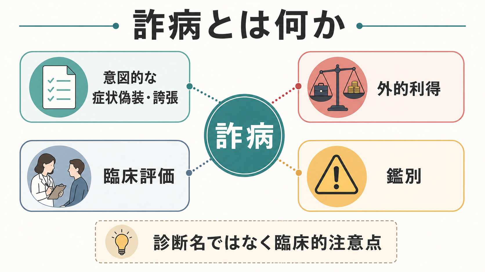
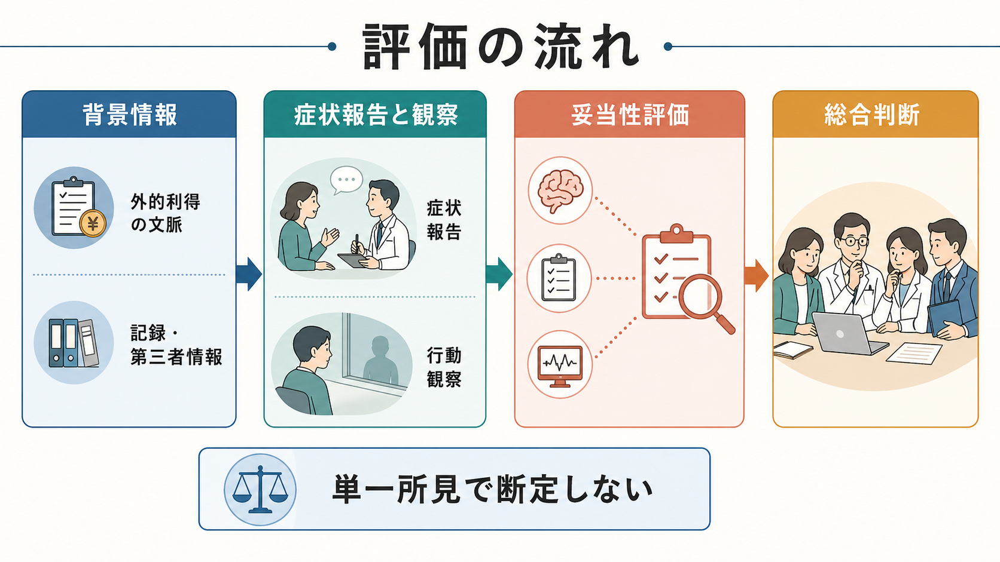
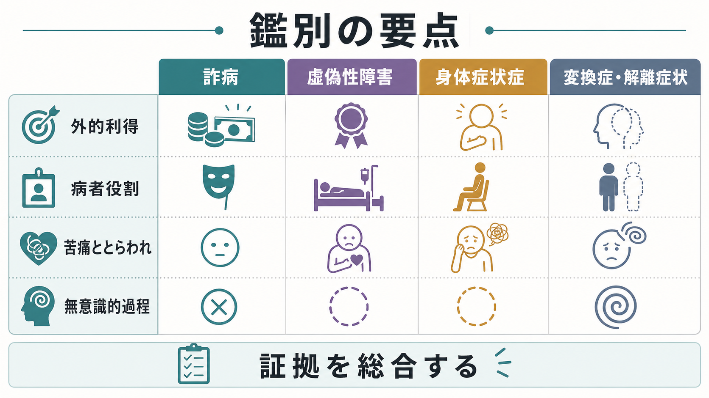

# 詐病とは何か

## 要点

- 詐病とは、身体症状・精神症状・認知症状を、外的利得を得るために意図的に偽装、誘発、誇張、または別の出来事へ誤って帰属させる状態である[1][2]。
- DSM 系の臨床では、詐病は通常の精神疾患名というより「臨床的注意を要する状態」として扱われ、ICD-11 では健康状態や保健サービス接触に影響する要因の一つとして `QC30 Malingering` に置かれる[1][2]。
- 評価では「うそを見抜く」より、外的利得、症状報告、観察、記録、第三者情報、妥当性検査を統合し、別の医学的・精神医学的説明で十分に説明できるかを慎重に検討する[4][5]。
- 虚偽性障害、[[身体症状症とは何か]]、変換症・機能性神経症状、[[解離症群とは何か]]、[[統合失調症とは何か]]、物質使用、身体疾患を混同しないことが重要である[1][3]。
- 本記事は教育・研究目的の整理であり、個別事例について「詐病である」と断定するための手順ではない。

## この記事で答える問い

1. 詐病は精神疾患なのか、それとも評価上の概念なのか。
2. 外的利得、意図性、症状偽装はどのように区別して考えるのか。
3. 臨床・司法・補償場面で、どのような情報を統合して評価するのか。
4. 虚偽性障害、身体症状症、変換症・解離症状とは何が違うのか。

## まず結論

詐病は、単に「症状が大げさに見える」ことではない。中心にあるのは、外的利得があり、症状の虚偽表示や誇張が意図的に行われていると評価されることである[1][2]。外的利得には、金銭補償、障害認定、刑事責任や処罰の回避、兵役・勤務・学業上の義務回避、薬物や処方薬の入手などが含まれる[1][8]。

ただし、臨床場面では意図や動機を直接観察できない。したがって、詐病評価は一つの発言、一つの検査値、一つの「不自然さ」では成立しない。[[症状と徴候は何が違うのか]]を区別しながら、本人の訴え、行動観察、経過、医学的所見、心理検査、神経心理検査、記録、第三者情報を照合し、別の疾患や状況要因で説明できる可能性を残して扱う必要がある[4][5][8]。

## 背景

詐病は、救急、身体診療、精神科、司法精神医学、労災・障害補償、学校・職場配慮、薬物探索行動などで問題になる。特に外的利得が強い場面では、症状の過大報告、記憶障害の偽装、疼痛やめまいの過大報告、幻覚・妄想様体験の訴え、PTSD や ADHD などの診断名の利用が評価課題になることがある[1][5][8]。

ここで注意すべきなのは、外的利得があることだけでは詐病を意味しない点である。障害年金、補償、休職、司法判断、学業配慮は、正当に必要な人にも関わる。外的利得は「疑う理由」ではなく、評価で明示的に検討すべき文脈である。逆に、外的利得が明確で、報告と観察や検査が大きく矛盾し、妥当性指標も不良で、他の疾患説明が乏しい場合には、詐病の可能性が高まる[5][8]。

## 基本概念

### 外的利得

外的利得とは、症状を示すことで得られる外部の利益である。金銭、休職、訴訟上の利益、刑罰回避、薬物入手、住居やサービス、学業・職場上の配慮などが含まれる[1][8]。外的利得は、本人にとって「望ましい結果を得る」方向にも、「望ましくない結果を避ける」方向にも働く。

### 意図性

詐病では、症状の虚偽表示や誇張が意図的とされる。しかし意図は内面状態であり、面接者が直接見ることはできない。臨床的には、報告内容と観察の不一致、症状の自然史との不一致、検査成績の極端な不整合、記録や第三者情報との矛盾、妥当性検査の不良などから推論する[4][5][8]。

### 症状の種類

詐病の対象は精神症状に限られない。認知症状、疼痛、感覚障害、運動障害、失神、けいれん様発作、睡眠、疲労、幻覚様体験、記憶障害など、多様な領域に現れうる。神経心理学では、パフォーマンス妥当性検査と症状妥当性検査を組み合わせ、認知、身体、精神症状の複数ドメインで評価する方向に発展している[5][8]。

## 仕組み

詐病を理解するには、「症状があるかないか」だけでなく、症状がどのような文脈で提示され、どの情報と矛盾し、どの利得と結びつくかを見る必要がある。

1. 外的利得の文脈がある。
2. 本人が症状、障害、機能低下を訴える。
3. 訴えと観察・記録・検査・自然経過の間に不一致がある。
4. 妥当性評価で、努力不足、過大報告、非典型的反応パターンが示唆される。
5. 身体疾患、神経疾患、精神疾患、発達特性、文化的背景、教育歴、言語、薬物影響などで説明できるかを検討する。
6. 複数の証拠が収束する場合に、詐病の可能性を段階的に評価する[4][5][8]。

### 単一所見で断定しない

例えば、診察室では強い痛みを訴えるが待合室では普通に歩く、記憶障害を訴えるが複雑な手続きを正確に行う、幻聴の訴えが典型的な精神病性幻覚と大きく異なる、といった所見は評価上の手がかりになる。しかし、それだけでは詐病とはいえない。疼痛の変動、緊張、薬物影響、[[解離とは何か]]、[[妄想とは何か]]、文化的表現、評価場面への不信、検査不安などでも、見かけ上の不一致は生じる。

神経心理学の妥当性評価でも、単一の低い PVT 成績だけで断定することは避けるべきとされる。複数の妥当性指標、非冗長な検査、低い偽陽性率、教育歴や知的水準、神経疾患の影響を考慮して解釈する必要がある[5][8]。

## 図解

下の図は、詐病と近接概念の鑑別を単純化して示したものである。実際の臨床では、複数の状態が併存しうる。例えば、実際のうつ病や PTSD がある人が一部の症状を過大報告することもあり、逆に詐病の疑いがある人にも身体疾患や精神疾患が併存することがある[8]。

## 臨床・研究との接続

### 精神科面接

精神科面接では、本人の語りを尊重しつつ、[[精神症状の横断的評価とは何か]]の視点で、症状の始まり、時間経過、場面依存性、機能障害、既往歴、服薬、物質使用、生活史、司法・補償・職場・学校の文脈を確認する。詐病が疑われるときも、直接的に「偽っている」と対立的に迫ることは、治療関係の破綻や安全上のリスクを高めることがある[1]。

### 身体症状・疼痛

疼痛や身体症状では、本人の苦痛が主観的であるため、評価が難しい。[[疼痛症状は精神科でどう評価するか]]、[[身体化とは何か]]、[[心気症状とは何か]]、[[身体症状症とは何か]]と接続して、身体医学的評価、機能評価、活動量、鎮痛薬使用、医療利用、補償文脈を総合する。身体症状症では苦痛やとらわれが中心であり、詐病のように外的利得を目的とする意図的偽装とは区別される[3]。

### 精神病症状

幻聴、妄想、混乱、記憶喪失などの訴えは、詐病評価で扱われることがある。しかし、[[統合失調症とは何か]]、[[妄想とは何か]]、[[病識欠如とは何か]]を理解せずに、非典型的な語りだけで偽装とみなすのは危険である。精神病症状には文化差、言語差、トラウマ、物質使用、神経疾患、知的能力、面接状況が影響する。

### 神経心理学的評価

認知機能障害の詐病評価では、PVT、SVT、症状報告、行動観察、記録、既知の脳損傷や神経疾患の自然史を統合する。Slick らの基準は、認知機能障害の詐病を臨床・研究で操作化する重要な出発点になり[4]、その後、認知症状だけでなく身体・精神症状を含めた多次元基準へ更新されている[8]。AACN の妥当性評価に関する合意声明も、努力、反応バイアス、症状妥当性を神経心理学的評価の中核的課題として位置づけている[5]。

### 研究

研究上の課題は、詐病の「真の状態」を独立に確定しにくいことである。模擬詐病研究、既知群デザイン、法医学的サンプル、臨床サンプルでは、それぞれバイアスが異なる。SIRS のような構造化面接は偽装精神症状の評価で広く使われてきたが、精度はサンプル、基準、カットオフ、知的障害や文化的背景によって変わる[6][7]。

## よくある誤解

### 「外的利得があれば詐病である」

外的利得は必要条件に近いが、十分条件ではない。補償や休職が関わる人にも genuine な疾患や障害はある。詐病評価では、外的利得と症状の意図的偽装を結びつける収束的証拠が必要である[5][8]。

### 「検査で一つ不自然なら詐病である」

一つの不自然な所見は、注意、疲労、理解不足、教育歴、薬物、疼痛、不安、神経疾患、精神疾患でも起こりうる。妥当性検査は有用だが、単独で人格や道徳性を判断する道具ではない[5][8]。

### 「詐病と虚偽性障害は同じである」

両者は意図的な偽装を含みうるが、動機が異なる。虚偽性障害では、病者役割を引き受けることが中心で、明白な外的報酬だけでは説明されない。ICD-11 でも虚偽性障害は詐病を除外し、外的報酬が中心となる場合を詐病と区別している[2][3]。

### 「詐病を疑うなら治療や支援は不要である」

詐病疑いがあっても、実際の身体疾患、物質使用、生活困窮、暴力被害、精神疾患、パーソナリティ特性、司法・福祉上の問題が併存することがある。評価は対立のためではなく、不要な侵襲的検査や不適切な処方を避け、必要な支援へつなぐために行う。

## 関連ノート

- [[精神症状の横断的評価とは何か]]
- [[症状と徴候は何が違うのか]]
- [[身体症状症とは何か]]
- [[身体化とは何か]]
- [[疼痛症状は精神科でどう評価するか]]
- [[心気症状とは何か]]
- [[解離症群とは何か]]
- [[解離とは何か]]
- [[統合失調症とは何か]]
- [[妄想とは何か]]
- [[病識欠如とは何か]]

## 理解チェック

1. 詐病の評価で「外的利得」が重要なのはなぜか。
2. 虚偽性障害と詐病を分ける中心的な違いは何か。
3. 単一の検査所見だけで詐病と断定できない理由を二つ挙げられるか。
4. 記録、第三者情報、行動観察、妥当性検査は、それぞれ何を補うために使われるか。

## 参考文献

[1] Alozai, U. U., & McPherson, P. K. (2023). *Malingering*. StatPearls. https://www.ncbi.nlm.nih.gov/books/NBK507837/

[2] World Health Organization. (2026). *ICD-11 for Mortality and Morbidity Statistics: QC30 Malingering*. https://icd.who.int/browse/2026-01/mms/en#1136473465

[3] World Health Organization. (2026). *ICD-11 for Mortality and Morbidity Statistics: 6D50 Factitious disorder imposed on self*. https://icd.who.int/browse/2026-01/mms/en#790764418

[4] Slick, D. J., Sherman, E. M. S., & Iverson, G. L. (1999). Diagnostic criteria for malingered neurocognitive dysfunction: Proposed standards for clinical practice and research. *The Clinical Neuropsychologist, 13*(4), 545-561. https://doi.org/10.1076/1385-4046(199911)13:04;1-Y;FT545

[5] Sweet, J. J., Heilbronner, R. L., Morgan, J. E., Larrabee, G. J., Rohling, M. L., Boone, K. B., Kirkwood, M. W., Schroeder, R. W., & Suhr, J. A. (2021). American Academy of Clinical Neuropsychology consensus statement on validity assessment: Update of the 2009 AACN consensus conference statement. *The Clinical Neuropsychologist, 35*(6), 1053-1106. https://doi.org/10.1080/13854046.2021.1896036

[6] Green, D., & Rosenfeld, B. (2011). Evaluating the gold standard: A review and meta-analysis of the Structured Interview of Reported Symptoms. *Psychological Assessment, 23*(1), 95-107. https://doi.org/10.1037/a0021149

[7] Rogers, R., Jackson, R. L., Sewell, K. W., Salekin, K. L., & Neumann, C. S. (2005). Detection strategies for malingering: A confirmatory factor analysis of the SIRS. *Criminal Justice and Behavior, 32*(5), 511-535. https://doi.org/10.1177/0093854805278412

[8] Sherman, E. M. S., Slick, D. J., & Iverson, G. L. (2020). Multidimensional malingering criteria for neuropsychological assessment: A 20-year update of the malingered neuropsychological dysfunction criteria. *Archives of Clinical Neuropsychology, 35*(6), 735-764. https://doi.org/10.1093/arclin/acaa019

## 未解決問題

- 詐病評価における文化差、言語差、教育歴、知的能力の影響を、どの程度まで定量的に補正できるか。
- PVT/SVT の偽陽性を抑えつつ、臨床的に見逃してはならない非妥当反応をどう検出するか。
- 詐病、実際の疾患、部分的な過大報告が混在するケースを、どのように段階的・倫理的に記述するか。
- AI 生成文書、オンライン診断情報、遠隔診療環境が、症状偽装や評価妥当性にどのような影響を与えるか。

## MOC更新候補

- `content/00_MOC/` 配下の精神医学、症候学、臨床評価、司法精神医学に関する MOC へ `[[詐病とは何か]]` を追加する候補。
- 並列生成ジョブとの競合を避けるため、本タスクでは MOC ファイル自体は更新しない。
