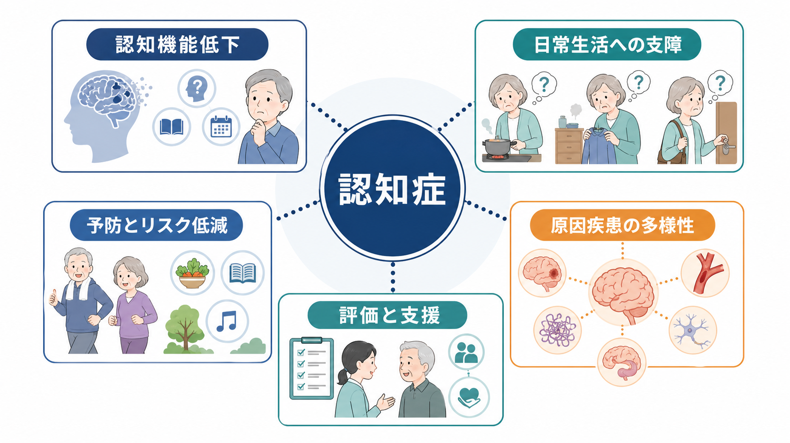
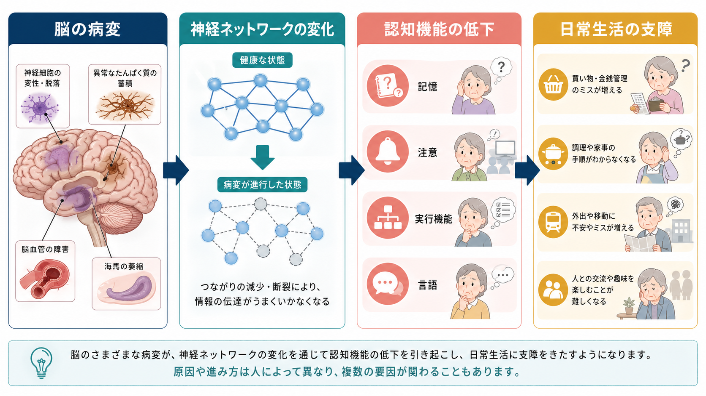
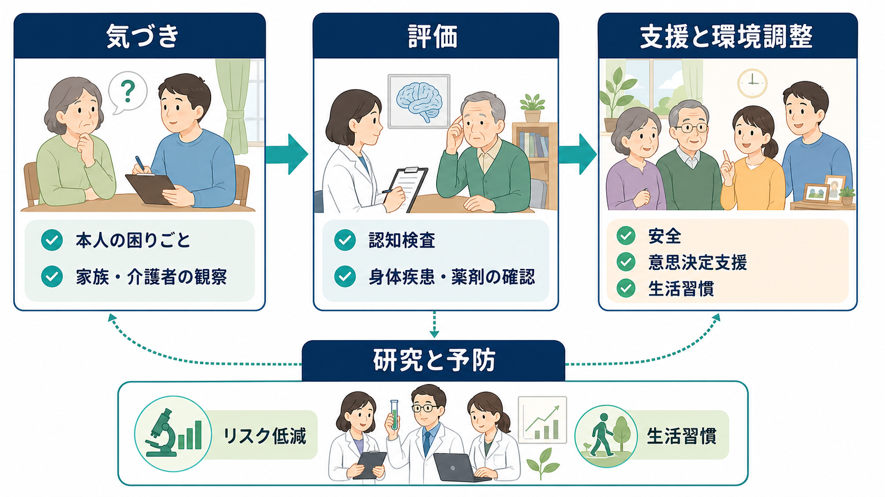

# 認知症とは何か

## 要点

- 認知症は単一の病名ではなく、記憶、注意、実行機能、言語、視空間認知、社会的認知などの低下によって、以前はできていた日常生活や社会生活に支障が出る症候群である[1][2]。
- 中核は「認知機能検査の点数が低いこと」ではなく、本人の生活機能、意思決定、対人関係、安全、介護負担まで含めて変化を評価する点にある[3]。
- 原因はアルツハイマー病、血管性認知症、レビー小体病、前頭側頭型認知症、外傷、感染、代謝・栄養障害、薬剤など多様で、複数の病理が重なることも多い[2][4]。
- 評価では、慢性に進む認知症だけでなく、急性に変動する[[せん妄とは何か]]、抑うつによる認知症様症状、薬剤性・身体疾患性の変化を区別する[3]。
- 予防は「完全に防げる」という意味ではないが、教育、聴力、血圧、喫煙、糖尿病、運動、社会的孤立、うつ、頭部外傷、大気汚染などの修正可能なリスクに介入することで、集団レベルの発症リスクを下げうる[5]。

## この記事で答える問い

1. 認知症は、老化による物忘れや一時的な混乱と何が違うのか。
2. なぜ「原因疾患」ではなく「症候群」として理解する必要があるのか。
3. 脳の病変は、どのように認知機能低下と生活上の支障につながるのか。
4. 臨床・研究では、何を評価し、どのように支援や予防へ接続するのか。

## まず結論

認知症とは、獲得された認知機能が持続的に低下し、その結果として日常生活の自立や社会的役割に支障をきたす状態である。ここで重要なのは、認知症を「物忘れ」だけに狭めないことである。買い物や服薬管理、調理、金銭管理、予定管理、道に迷うこと、言葉の理解、判断、対人関係、趣味の継続など、生活のなかで複数の困難として現れる[1][3]。

また、認知症は個別の診断や治療指示をこの文章だけで決めるものではない。教育・研究目的で整理すると、認知症は「脳の疾患や損傷を背景に、認知機能と生活機能の連結が崩れていく症候群」であり、臨床では原因、進行速度、可逆的要因、本人の希望、家族・介護者の状況をあわせて評価する。

## 背景

世界保健機関は、認知症を記憶、思考、見当識、理解、計算、学習能力、言語、判断などに影響する症候群として説明している[1]。日本でも高齢化に伴って認知症のある人は増えており、本人の生活だけでなく、家族、地域、医療、介護、社会制度にまたがる課題になっている[6]。

ただし、「年を取れば誰でも認知症になる」という理解は粗い。加齢で処理速度や想起の効率が落ちることはあるが、認知症では生活上の自立や社会的役割に明確な支障が出る。逆に、認知症のように見えても、[[せん妄とは何か]]、[[うつ病とは何か]]、睡眠障害、薬剤、甲状腺機能異常、ビタミン欠乏、感染症、脳血管障害など、別の要因が主である場合もある[3]。

## 基本概念

### 症候群としての認知症

認知症は「アルツハイマー病」と同義ではない。アルツハイマー病は認知症の主要な原因疾患の一つだが、血管性認知症、レビー小体型認知症、前頭側頭型認知症、パーキンソン病関連、外傷性脳損傷、アルコール関連、感染症関連など、背景は多様である[2][4]。たとえば、[[レム睡眠行動障害とは何か]]はレビー小体病の前駆・関連症状として重要になることがある。

診断体系の言葉でいえば、DSM や ICD では「神経認知障害」またはそれに対応するカテゴリーで、認知領域の低下と生活上の自立低下を重視する。分類体系の違いについては[[DSMとICDは何が違うのか]]も参照できる。

### 軽度認知障害との違い

軽度認知障害は、本人または周囲が認知機能低下に気づき、検査でも低下が示されるが、基本的な日常生活の自立はおおむね保たれている状態を指す。認知症では、服薬、金銭管理、交通機関の利用、仕事、家事、対人調整などの複雑な生活機能に支障が現れやすい[3]。

### BPSDという見方

認知症では、記憶や実行機能だけでなく、不安、抑うつ、幻視、妄想、焦燥、睡眠リズムの乱れ、徘徊、拒否、易怒性などの行動・心理症状が問題になることがある。これらは本人の「性格の問題」として片づけるのではなく、痛み、環境、睡眠、薬剤、コミュニケーション不全、孤立、過負荷などと結びつけて理解する必要がある[7]。

## 仕組み

認知症の機序は、原因疾患によって異なる。アルツハイマー病ではアミロイドβ、タウ、神経炎症、シナプス障害、神経細胞死などが研究されてきた。血管性認知症では脳梗塞、微小血管病変、白質病変、脳血流の障害が重要になる。レビー小体病ではαシヌクレイン病理と注意・覚醒・視覚認知の変動が問題になりやすい[2][4]。

それでも共通して言えるのは、局所病変だけでなく、脳内ネットワークの効率低下が生活上の困難へつながるという点である。記憶は海馬だけで完結せず、注意、実行機能、情動、感覚、言語、運動、環境手がかりと連動する。したがって、同じ「物忘れ」でも、本人の環境、支援、身体疾患、睡眠、感覚障害、教育歴、生活課題によって表れ方が変わる[3][5]。

## 図解

上の図は、認知症を「脳の病変から生活上の支障へ向かう一方向の線」として単純化しすぎないための地図である。病変は、神経ネットワーク、認知領域、行動、環境との相互作用を通じて生活に影響する。臨床では、画像や検査値だけでなく、本人が何に困っているか、何がまだ保たれているか、どの環境調整で生活が続けやすくなるかを同時に見る。

## 臨床・研究との接続

### 評価

評価では、本人と家族・介護者からの経過聴取、認知機能検査、ADL/IADL、神経学的診察、身体疾患、薬剤、睡眠、感覚障害、気分症状、せん妄の有無を確認する。急に悪くなった、日内変動が強い、発熱や脱水がある、薬剤変更後に悪化した、意識や注意が保てない、といった場合は[[せん妄とは何か]]を強く疑う[3]。

画像検査、血液検査、必要に応じた髄液・PET・遺伝学的検査は、原因疾患の推定や治療可能な要因の検出に使われる。たとえば[[FDG-PETは脳代謝をどう可視化するのか]]や[[FLAIR画像はどのような病変検出に役立つのか]]は、脳病変の見え方を理解する関連テーマである。

### 支援

支援の目標は、認知症を「治すか治さないか」だけで考えないことである。安全、本人の尊厳、意思決定支援、生活習慣、社会参加、家族・介護者の負担軽減、環境調整を組み合わせる。薬物療法が検討される場合でも、本人の症状、原因疾患、併存症、薬剤相互作用、副作用、生活目標を踏まえる必要がある[7]。

### 研究と予防

Lancet Commission は、認知症の修正可能なリスク要因をライフコース全体で整理している。教育、聴力低下、頭部外傷、高血圧、過度の飲酒、肥満、喫煙、うつ、社会的孤立、身体活動不足、糖尿病、大気汚染、視力低下、高 LDL コレステロールなどが議論されている[5]。これは個人に責任を押しつける話ではなく、教育、医療アクセス、補聴、生活環境、社会参加、慢性疾患管理を含む公衆衛生の課題である。

## よくある誤解

### 「認知症は物忘れの病気である」

不十分である。記憶障害は重要だが、注意、実行機能、言語、視空間認知、社会的認知、判断、感情調整、行動の変化も含まれる。とくに前頭側頭型認知症やレビー小体型認知症では、記憶よりも行動変化、注意変動、幻視、実行機能低下が目立つことがある[2][4]。

### 「認知症と診断されたら何もできない」

誤りである。原因疾患の評価、治療可能な要因の除外、服薬整理、睡眠・感覚障害・身体疾患への対応、環境調整、意思決定支援、介護者支援、社会資源の利用によって、本人の生活の質や安全を支えられる[7]。

### 「本人の努力不足や家族の対応だけの問題である」

誤りである。認知症は脳・身体・環境・社会制度が交差する状態であり、本人や家族だけに負担を集中させると問題は悪化しやすい。支援では、本人の残存能力、わかりやすい環境、見通し、感覚補助、過負荷の軽減、介護者の休息を含めて考える。

### 「ウェルニッケ脳症やコルサコフ症候群とは無関係である」

無関係ではない。[[ウェルニッケ脳症とは何か]]や[[コルサコフ症候群とは何か]]は、栄養障害やアルコール関連の神経認知症状を理解するうえで重要である。慢性の認知症と区別しつつ、治療可能・予防可能な神経認知障害として見逃さないことが大切である。

## 関連ノート

- [[DSMとICDは何が違うのか]]
- [[せん妄とは何か]]
- [[うつ病とは何か]]
- [[レム睡眠行動障害とは何か]]
- [[ウェルニッケ脳症とは何か]]
- [[コルサコフ症候群とは何か]]
- [[FDG-PETは脳代謝をどう可視化するのか]]
- [[FLAIR画像はどのような病変検出に役立つのか]]

## MOC更新候補

- `content/00_MOC/` 配下の精神医学、老年精神医学、神経認知障害、認知症関連 MOC に追加候補。
- 並列ジョブとの競合回避のため、本記事では MOC 本体の更新は行わない。

## 今後の作成候補

- アルツハイマー病とは何か
- 血管性認知症とは何か
- レビー小体型認知症とは何か
- 前頭側頭型認知症とは何か
- 軽度認知障害とは何か
- BPSDとは何か
- 認知症とうつ病はどう鑑別するのか
- 認知症とせん妄はどう鑑別するのか

## 理解チェック

1. 認知症を「物忘れ」ではなく「生活機能への支障を伴う症候群」として捉える利点は何か。
2. 認知症、軽度認知障害、せん妄、うつ病による認知症様症状は、時間経過と生活機能の点でどう違うか。
3. 認知症支援で、薬物療法以外に評価すべき環境・身体・社会的要因は何か。
4. 予防可能なリスク要因を語るとき、個人責任論にしないためには何を区別すべきか。

## 未解決問題

- 認知症の病理はしばしば混合しており、生前診断でどの病理が症状にどれだけ寄与しているかを厳密に分けることは難しい。
- バイオマーカーが進歩しても、検査結果と本人の生活困難が一対一に対応するとは限らない。
- 予防研究では、個人レベルの介入効果と、教育・環境・医療アクセスを含む社会レベルの効果をどう分けて測定するかが課題である。
- 認知症のある本人の意思決定支援を、リスク管理や家族・制度の都合とどう両立させるかは、臨床倫理上の継続的課題である。

## 参考文献

[1] World Health Organization. Dementia. Fact sheet. https://www.who.int/news-room/fact-sheets/detail/dementia

[2] National Institute on Aging. What Is Dementia? Symptoms, Types, and Diagnosis. https://www.nia.nih.gov/health/alzheimers-and-dementia/what-dementia-symptoms-types-and-diagnosis

[3] Arvanitakis Z, Shah RC, Bennett DA. Diagnosis and Management of Dementia: Review. *JAMA*. 2019;322(16):1589-1599. https://doi.org/10.1001/jama.2019.4782

[4] National Institute on Aging. What Causes Alzheimer’s Disease? https://www.nia.nih.gov/health/alzheimers-causes-and-risk-factors/what-causes-alzheimers-disease

[5] Livingston G, Huntley J, Liu KY, et al. Dementia prevention, intervention, and care: 2024 report of the Lancet standing Commission. *The Lancet*. 2024;404(10452):572-628. https://doi.org/10.1016/S0140-6736(24)01296-0

[6] 厚生労働省. 認知症施策. https://www.mhlw.go.jp/stf/seisakunitsuite/bunya/0000076236_00002.html

[7] National Institute for Health and Care Excellence. Dementia: assessment, management and support for people living with dementia and their carers. NICE guideline NG97. https://www.nice.org.uk/guidance/ng97

[8] 日本神経学会. 認知症疾患診療ガイドライン2017. https://www.neurology-jp.org/guidelinem/nintisyo_2017.html
