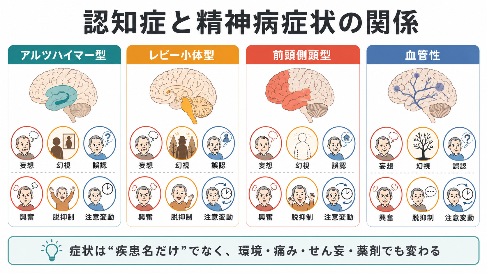
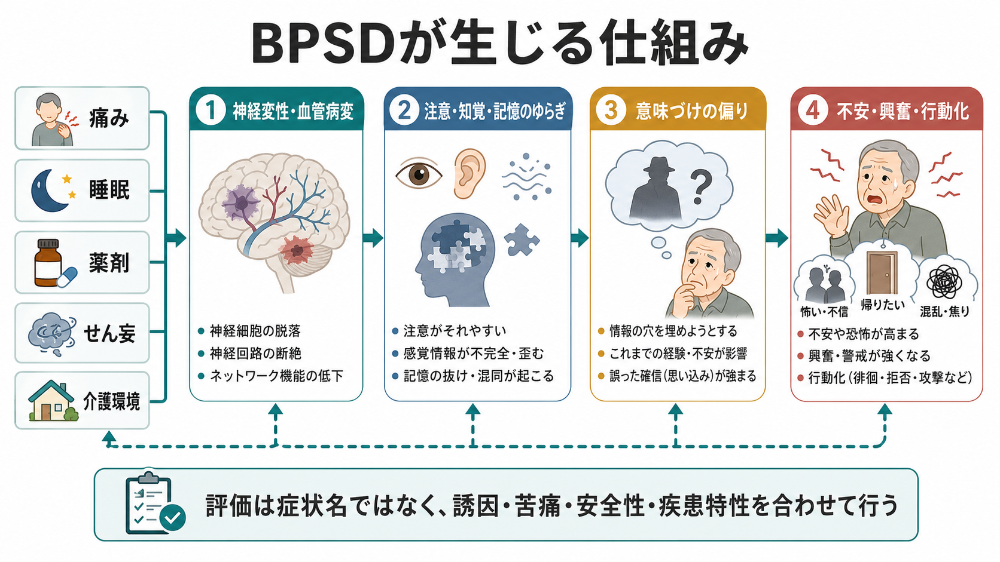

# 認知症と精神病症状はどう関係するのか

## 要点

- [[認知症とは何か|認知症]]では、記憶や実行機能の低下だけでなく、[[幻覚とは何か|幻覚]]、[[妄想とは何か|妄想]]、誤認、興奮、攻撃性、アパシー、脱抑制、睡眠障害などの行動・心理症状がしばしば問題になる。これらはBPSD、または神経精神症状として扱われる[1]。
- 精神病症状は「認知症が進んだから出る」という単純なものではない。[[アルツハイマー型認知症とは何か|アルツハイマー型認知症]]ではもの盗られ妄想や誤認、[[レビー小体型認知症とは何か|レビー小体型認知症]]では反復する具体的な幻視、[[前頭側頭型認知症とは何か|前頭側頭型認知症]]では脱抑制・常同行動・社会的認知の変化、[[血管性認知症とは何か|血管性認知症]]ではアパシーや遂行機能低下を背景にした情動・行動変化が目立ちやすい[2][4][5][6]。
- 興奮や攻撃性は、幻覚・妄想そのものよりも、痛み、感染、睡眠不足、感覚障害、薬剤、[[せん妄とは何か|せん妄]]、介護環境、本人の不安が重なって強まることが多い。NICEは、薬物療法の前に苦痛の理由と臨床的・環境的原因を構造化して評価することを推奨している[3]。
- この記事は教育・研究目的の整理であり、個別の診断や治療指示ではない。急な意識変容、発熱、脱水、転倒、強い興奮、自傷他害リスクがある場合は、認知症の症状と決めつけず、身体疾患やせん妄を含めた評価が必要である。

## この記事で答える問い

1. 認知症における「精神病症状」とBPSDはどう違い、どう重なるのか。
2. 幻覚・妄想・興奮は、疾患別にどのような特徴をもちやすいのか。
3. なぜ同じ認知症でも、ある人は幻視が目立ち、別の人は妄想や興奮が目立つのか。
4. 臨床・研究では、症状名だけでなく何を評価すべきか。

## まず結論

認知症と精神病症状の関係は、「認知機能が低下すると現実検討が弱まり、幻覚や妄想が出る」という一本線では説明しきれない。実際には、神経変性や血管病変が注意、知覚、記憶、実行機能、情動調整、社会的認知を変化させる。そのうえに、本人の不安、身体症状、薬剤、睡眠、感覚入力、介護環境が重なることで、幻覚、妄想、誤認、興奮、拒否、徘徊、脱抑制などとして現れる[1][3]。

したがって、認知症に伴う精神病症状を読むときの基本は、次の3層で考えることである。

| 層 | 見ること | 例 |
|---|---|---|
| 疾患特性 | どの神経変性・血管病変が背景にあるか | DLBの幻視、ADの被害的妄想、FTDの脱抑制 |
| 認知・知覚機構 | どの情報処理が不安定か | 注意変動、視空間認知、記憶の補完、実行機能低下 |
| 誘因・環境 | 症状を強める可変要因は何か | 痛み、感染、薬剤、睡眠、孤立、過刺激、説明不足 |

## 背景

BPSDは、認知症に伴う知覚、思考内容、気分、行動の変化を広く含む概念である。Kalesらのレビューでは、BPSDには精神病症状、興奮、攻撃性、抑うつ、不安、アパシー、睡眠問題、徘徊、不適切行動などが含まれ、認知症の経過中に多くの人が何らかの形で経験すると整理されている[1]。

この概念が重要なのは、BPSDが本人の苦痛だけでなく、家族・介護者の負担、施設入所、入院、医療費、生活の安全に強く関わるからである[1]。一方で、BPSDという言葉は広すぎるため、すべてを「困った行動」としてまとめると、背景にある疾患特性や身体要因を見落としやすい。

精神病症状に限定すると、中心は幻覚、妄想、誤認である。認知症における精神病症状の系統的レビューでは、認知症全体で精神病症状は珍しくなく、アルツハイマー型認知症では妄想や誤認、レビー小体型認知症では幻覚、血管性認知症では一定の妄想・幻覚、前頭側頭型認知症では比較的少ないが一部で陽性精神病症状が報告される、と整理されている[2]。

## 基本概念

### 精神病症状

精神病症状とは、現実検討、知覚体験、信念形成に関わる症状群である。認知症の文脈では、主に次のように現れる。

| 症状 | 説明 | 認知症での見え方 |
|---|---|---|
| 幻覚 | 外部刺激なしに知覚体験が生じる | 人や動物が見える、声や物音を聞く |
| 妄想 | 反証されにくい誤った確信 | 物を盗られた、配偶者が偽物、誰かが家に入った |
| 誤認 | 実在する人・物・場所の同定がずれる | 鏡の自分を他人と誤る、テレビ内の人を実在と感じる |
| 興奮 | 苦痛を伴う過剰な運動・言語・攻撃行動 | 怒鳴る、拒否する、落ち着かず歩き回る |

ただし、興奮は精神病症状そのものではなく、痛み、不安、混乱、幻覚・妄想への反応、環境への不適合が行動として出たものでもある。IPAの定義でも、認知障害を背景に、情動的苦痛、過剰な運動活動、言語的または身体的攻撃性が持続・反復し、他の医学的・精神医学的・環境的原因だけでは説明されない状態として整理されている[8]。

### BPSD

BPSDは「精神病症状」より広い。幻覚や妄想だけでなく、アパシー、抑うつ、不安、易怒性、脱抑制、睡眠覚醒リズムの乱れ、食行動変化、徘徊、拒否なども含む。したがって、BPSDを評価するときは、症状の名前だけでなく、誰が困っているのか、本人は苦痛を感じているのか、危険があるのか、どの場面で起こるのか、可変要因は何かを確認する必要がある[1][3]。

## 疾患別特徴

### アルツハイマー型認知症

アルツハイマー型認知症では、進行に伴って妄想、幻覚、誤認、興奮が出ることがある。特に典型的なのは、物の置き忘れを「盗られた」と解釈する被害的妄想、配偶者や家族を別人と感じる誤認、家の中に誰かがいるという確信である[2][7]。

ここで重要なのは、妄想を単なる「性格の頑固さ」と見ないことである。記憶の穴、見当識のゆらぎ、実行機能低下、不安、孤立が重なると、本人にとっては「説明できない変化」を何とか意味づける必要が生じる。なくした財布を見つけられない、予定がわからない、知らない人が家にいるように感じる、という体験は、本人の世界の安全感を崩す。その説明として「誰かが盗った」「だまされている」という信念が選ばれることがある。

アルツハイマー病の精神病症状に関するレビューでは、ADの精神病症状は入院・施設入所、認知・機能低下、介護者負担、死亡リスクなどと関連すると整理されている[7]。ただし、関連があることは、すべての人に同じ経過や同じ支援が当てはまることを意味しない。

### レビー小体型認知症

レビー小体型認知症では、反復する具体的な幻視が非常に重要である。DLB Consortiumの第4回コンセンサス報告では、認知変動、反復する詳細な幻視、レム睡眠行動障害、パーキンソニズムが中核的臨床特徴として整理されている[4]。

DLBの幻視は、人、子ども、動物、小さな影のように、比較的具体的で形のある内容になりやすい。本人が恐怖を感じる場合もあれば、「見えているが困っていない」と語る場合もある。したがって、幻視があるかどうかだけでなく、本人の苦痛、行動への影響、安全性、睡眠、照明、視力、薬剤、せん妄の有無を合わせて見る必要がある。

DLBでは抗精神病薬への過敏性が問題になることがあり、コンセンサス報告でも抗精神病薬は可能な限り避けるべきとされている[4]。これは「薬を使ってはいけない」という単純な規則ではなく、重い副作用リスクを踏まえ、まず誘因の評価、環境調整、本人の苦痛の程度、危険性、代替手段を丁寧に検討する必要があるという意味である。

### 前頭側頭型認知症

前頭側頭型認知症では、幻覚・妄想よりも、脱抑制、無関心、共感性低下、常同行動、食行動変化、社会的判断の変化、言語障害が前景に立つことが多い。FTDでは、統合失調症や気分障害、パーソナリティ障害、発達特性、依存症などと紛らわしい見え方をすることがある[5]。

ただし、FTDに精神病症状がないわけではない。Gossinkらの研究では、bvFTDの一部に妄想、幻覚様行動、猜疑性がみられた一方、多くは情動的引きこもり、感情鈍麻、抽象的思考困難、常同的思考など、陰性症状や思考形式の問題として見えやすいと報告された[5]。

つまりFTDでの「精神病らしさ」は、幻聴や被害妄想だけを探すと見落とす。本人の社会的認知、共感、抑制、柔軟性、意味理解、反復行動を、以前からの変化として確認する必要がある。

### 血管性認知症

血管性認知症や血管性認知障害では、脳梗塞、白質病変、微小血管障害、脳出血などの分布によって症状が変わる。神経精神症状としては、抑うつ、アパシー、不安、易怒性、興奮、実行機能低下に伴う生活上の混乱が問題になりやすい[6]。

血管性認知症でも妄想や幻覚は起こりうるが、疾患全体を「幻覚が多い/少ない」と単純に分類するより、病変部位、発症様式、階段状悪化、神経学的徴候、せん妄、身体疾患、薬剤を合わせて読むほうが実用的である。特に急な変化がある場合は、認知症の進行ではなく、新しい脳血管イベント、感染、脱水、代謝異常、薬剤性変化を考える必要がある。

### パーキンソン病認知症

[[パーキンソン病認知症とは何か|パーキンソン病認知症]]はDLBと連続性をもつが、臨床上は運動症状と認知症状の時間関係で区別される。幻視、錯視、妄想、認知変動、睡眠障害が問題になることがあり、ドパミン補充療法など薬剤との関係も評価対象になる[4]。

この領域では、精神病症状を抑えようとして抗精神病薬を使うと運動症状や意識状態が悪化する可能性がある一方、運動症状の治療薬が幻覚や混乱を強めることもある。したがって、精神症状と運動症状を別々の問題として切り離さず、神経内科・精神科・介護支援の接点として考える必要がある。

## 仕組み

認知症に伴う精神病症状は、少なくとも4つの経路から理解できる。

1つ目は、知覚入力の不確かさである。視力低下、暗い部屋、錯視、視空間認知の障害、注意変動があると、外界の情報が曖昧になる。脳は曖昧な入力を補完して意味づけるため、DLBの幻視や誤認につながりやすくなる[4]。

2つ目は、記憶と見当識の欠落である。物を置いた記憶、誰がいつ来たか、なぜここにいるかが不安定になると、本人は現在の状況を説明する仮説を作る。アルツハイマー型認知症のもの盗られ妄想は、この記憶の空白と不安の組み合わせとして理解しやすい[7]。

3つ目は、実行機能と情動調整の低下である。前頭葉・皮質下回路の障害では、抑制、切り替え、計画、衝動制御が弱くなる。これにより、怒りや不安が行動に直結しやすくなり、FTDや血管性認知障害では脱抑制、拒否、常同行動、アパシーとして見えることがある[5][6]。

4つ目は、身体・環境との相互作用である。痛み、便秘、尿閉、感染、睡眠不足、難聴、視力低下、薬剤、孤立、過刺激、説明不足、介護者の疲弊は、同じ脳病変のもとでも症状の表れ方を大きく変える。NICEが治療前の構造化評価と心理社会的・環境的介入を重視するのは、このためである[3]。

## 図解

上の2枚の図は、認知症に伴う精神病症状を「疾患別特徴」と「症状生成の仕組み」から見るための地図である。1枚目は、AD、DLB、FTD、血管性認知症で目立ちやすい症状の違いを整理している。2枚目は、神経変性・血管病変が、注意・知覚・記憶のゆらぎ、意味づけの偏り、不安・興奮・行動化へつながる流れを示している。

実際の臨床では、この図の矢印を逆向きにもたどる。たとえば「夕方に怒鳴る」という行動があれば、まず興奮という症状名を付けるだけでなく、痛み、疲労、照明、空腹、便秘、薬剤、介護場面の要求水準、本人の見当識、幻視や妄想の有無を順に確認する。

## 臨床・研究との接続

### 評価の入口

評価では、症状を「ある/ない」で終わらせない。少なくとも次を確認する。

| 評価項目 | 確認すること |
|---|---|
| 時間経過 | 急性か、亜急性か、徐々に進行したか |
| 意識・注意 | せん妄を示す変動、眠気、見当識障害があるか |
| 症状内容 | 幻視、幻聴、被害妄想、誤認、興奮、脱抑制のどれか |
| 苦痛と安全 | 本人が怖がっているか、自傷他害・転倒・徘徊リスクがあるか |
| 身体要因 | 痛み、感染、脱水、便秘、尿閉、睡眠、感覚障害 |
| 薬剤 | 抗コリン薬、ドパミン作動薬、睡眠薬、ステロイド、薬剤変更 |
| 環境 | 照明、騒音、過刺激、説明の仕方、介護者の疲弊 |

急に悪化した幻覚や興奮は、認知症の自然経過と決めつけない。特に注意変動、発熱、脱水、転倒後、薬剤変更後、睡眠覚醒リズムの急変がある場合は、[[せん妄とは何か|せん妄]]や身体疾患を優先して検討する。

### 支援の考え方

支援の基本は、症状を抑え込むことではなく、苦痛と危険を減らし、本人が理解しやすい環境を作ることである。NICEは、認知症の苦痛に対して、薬物療法の前に臨床的・環境的原因を確認し、初期・継続的管理として心理社会的・環境的介入を提供することを推奨している[3]。

抗精神病薬は、認知症の幻覚・妄想・興奮に対して検討されることがあるが、効果は限定的で、安全性の問題が大きい。NICEも、抗精神病薬は自傷他害リスクがある場合、または幻覚・妄想・興奮が重い苦痛を生んでいる場合に限って検討するという慎重な位置づけをしている[3]。またDLBでは重い過敏反応のリスクがあり、特に慎重な判断が必要である[4]。これは薬物療法を一律に否定する話ではなく、重い苦痛や危険がある場合でも、リスク、期間、用量、モニタリング、本人と家族の価値判断を含めて扱う必要があるという意味である。

### 研究上の論点

研究では、BPSDを単一のアウトカムとして扱うと、異なる病態が混ざりやすい。ADの被害妄想、DLBの幻視、FTDの脱抑制、血管性認知障害のアパシーと遂行機能低下は、同じ「行動症状」でも機構が同じとは限らない。

今後の研究では、症状評価、神経心理検査、睡眠、感覚障害、薬剤、介護環境、脳画像、バイオマーカーを組み合わせて、どの症状がどの病態・環境条件で出やすいのかを分けて測る必要がある。[[幻覚は脳内でどのように生じるのか]]、[[妄想は予測誤差処理の異常として説明できるのか]]、[[アセチルコリン系は認知症とどう関わるのか]]は、この神経機構を読むための関連ノートである。

## よくある誤解

### 「認知症の精神病症状は、本人の性格の問題である」

誤りである。もちろん病前性格や生活史は症状の内容に影響するが、認知症に伴う精神病症状は、記憶、注意、知覚、実行機能、情動調整、身体状態、環境が重なって現れる。本人の努力不足や家族の対応だけに原因を帰すと、評価と支援が遅れる。

### 「幻覚があれば統合失調症である」

誤りである。幻覚は[[統合失調症とは何か|統合失調症]]だけでなく、DLB、パーキンソン病認知症、せん妄、薬剤性変化、感覚障害、てんかん、睡眠関連現象などでも起こりうる。高齢期や認知機能低下を背景にした幻覚では、発症時期、意識変動、薬剤、身体疾患、神経学的徴候を確認する。

### 「BPSDは薬で落ち着かせるものだ」

不十分な理解である。薬物療法が検討される場面はあるが、まず苦痛の理由、身体疾患、薬剤、環境要因、本人の理解しやすさを評価する。環境調整、睡眠、痛みの対応、感覚補助、説明の仕方、活動量、介護者支援が中心になる場合も多い[1][3]。

### 「疾患名がわかれば症状の出方も決まる」

誤りである。疾患別の傾向は重要だが、個人差、併存病理、薬剤、感覚障害、生活環境、家族関係で症状は変わる。DLBらしい幻視があってもAD病理が混在することがあり、血管病変をもつADやFTDもありうる。診断名は地図であって、本人の現在の困りごとそのものではない。

## 関連ノート

- [[認知症とは何か]]
- [[アルツハイマー型認知症とは何か]]
- [[レビー小体型認知症とは何か]]
- [[前頭側頭型認知症とは何か]]
- [[血管性認知症とは何か]]
- [[パーキンソン病認知症とは何か]]
- [[幻覚とは何か]]
- [[妄想とは何か]]
- [[せん妄とは何か]]
- [[器質性精神病とは何か]]
- [[薬剤性精神病とは何か]]
- [[遅発性精神病とは何か]]
- [[幻覚は脳内でどのように生じるのか]]
- [[妄想は予測誤差処理の異常として説明できるのか]]
- [[アセチルコリン系は認知症とどう関わるのか]]

## MOC更新候補

- `content/00_MOC/MOC｜精神医学.md`
- `content/00_MOC/MOC｜症候学.md`
- `content/00_MOC/MOC｜神経科学と精神疾患.md`

並列ジョブとの競合を避けるため、本記事ではMOC本体を更新しない。

## 理解チェック

1. BPSDと精神病症状は、どのように重なり、どのように違うか。
2. アルツハイマー型認知症のもの盗られ妄想を、記憶と不安の観点から説明できるか。
3. レビー小体型認知症で反復する幻視が重要な理由を説明できるか。
4. 前頭側頭型認知症では、なぜ幻覚・妄想より脱抑制や社会的認知の変化が目立ちやすいのか。
5. 急に悪化した興奮や幻覚で、せん妄や身体疾患を確認すべき理由を説明できるか。

## 未解決問題

- 認知症に伴う幻覚・妄想・興奮を、病理、神経回路、環境要因に分けて予測する指標はまだ十分に確立していない。
- BPSDへの非薬物的介入は臨床的に重要だが、個人差が大きく、どの介入が誰に効くかを精密に予測する研究は発展途上である。
- 抗精神病薬のリスクを抑えつつ、重い苦痛や危険を減らすための代替治療・ケアモデルには、さらに質の高い比較研究が必要である。

## 参考文献

[1] Kales HC, Gitlin LN, Lyketsos CG. Assessment and management of behavioral and psychological symptoms of dementia. *BMJ*. 2015;350:h369. https://doi.org/10.1136/bmj.h369

[2] Pessoa RMP, Maximiano-Barreto MA, Lambert L, Leite EDM, Chagas MHN. The frequency of psychotic symptoms in types of dementia: a systematic review. *Dementia & Neuropsychologia*. 2023;17:e20220044. https://doi.org/10.1590/1980-5764-DN-2022-0044

[3] National Institute for Health and Care Excellence. *Dementia: assessment, management and support for people living with dementia and their carers* (NICE guideline NG97). 2018. https://www.nice.org.uk/guidance/NG97/chapter/recommendations

[4] McKeith IG, Boeve BF, Dickson DW, et al. Diagnosis and management of dementia with Lewy bodies: Fourth consensus report of the DLB Consortium. *Neurology*. 2017;89(1):88-100. https://doi.org/10.1212/WNL.0000000000004058

[5] Gossink FT, Dols A, Kerssens CJ, et al. Psychosis in behavioral variant frontotemporal dementia. *Neuropsychiatric Disease and Treatment*. 2017;13:1099-1106. https://doi.org/10.2147/NDT.S127863

[6] Tiel C, Sudo FK, Alves GS, et al. Neuropsychiatric symptoms in vascular cognitive impairment: a systematic review. *Dementia & Neuropsychologia*. 2015;9(3):230-236. https://doi.org/10.1590/1980-57642015DN93000004

[7] Ismail Z, Creese B, Aarsland D, et al. Psychosis in Alzheimer disease: mechanisms, genetics and therapeutic opportunities. *Nature Reviews Neurology*. 2022;18(3):131-144. https://doi.org/10.1038/s41582-021-00597-3

[8] Sano M, Cummings J, Auer S, et al. Agitation in cognitive disorders: Progress in the International Psychogeriatric Association consensus clinical and research definition. *International Psychogeriatrics*. 2024;36(4):238-250. https://doi.org/10.1017/S1041610222001041
