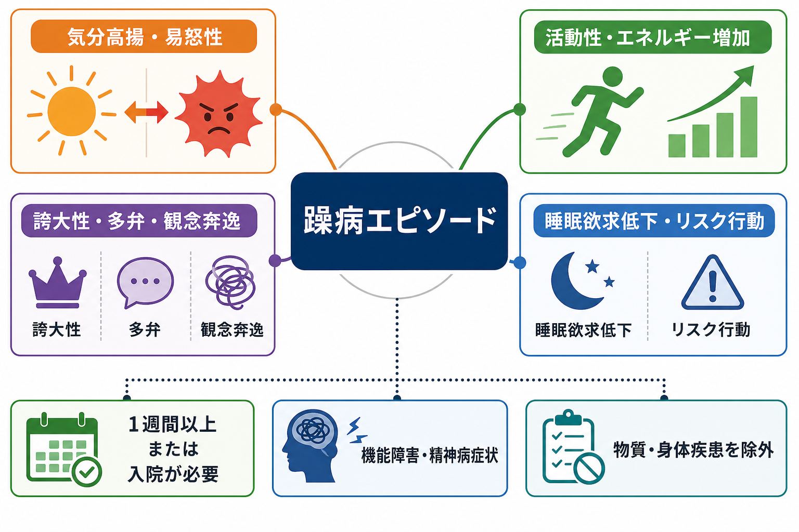
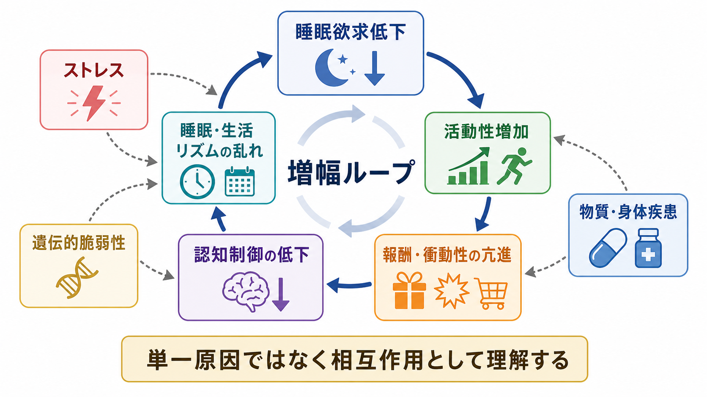
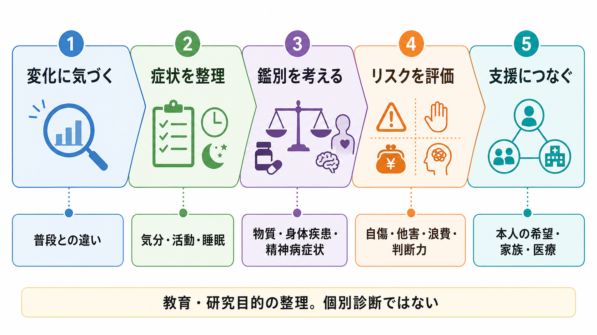

# 躁病エピソードとは何か

## 要点

- 躁病エピソードは、単なる「気分がよい時期」ではない。異常に高揚した、開放的な、または易怒的な気分に加えて、活動性・エネルギーが普段より明らかに増え、生活機能や安全性に重大な影響が出る状態である[1][2]。
- 典型的には、誇大性、睡眠欲求低下、多弁、観念奔逸、注意散漫、目標志向活動の増加、浪費・性的逸脱・危険運転などのリスク行動がまとまって現れる[1][8]。
- DSM-5-TR では、通常は少なくとも 1 週間、または入院が必要なほど重い場合は期間にかかわらず、躁病エピソードとして扱われる。精神病症状、著しい機能障害、入院の必要性があれば軽躁ではなく躁病として評価される[1][8]。
- ICD-11 でも、躁病・軽躁病エピソードの中核に「気分の変化」だけでなく「活動性または主観的エネルギーの増加」が置かれている[3]。
- 仕組みは単一の神経伝達物質では説明できない。睡眠・概日リズム、報酬系、前頭前野による認知制御、ストレス、遺伝的脆弱性、物質・身体疾患が相互に関わると考えるのが実用的である[4][5][6]。

## この記事で答える問い

1. 躁病エピソードは、[[躁状態とは何か]]や[[軽躁状態とは何か]]とどう関係するのか。
2. 気分高揚、活動性増加、誇大性、睡眠欲求低下は、どのようにまとまって躁病像を作るのか。
3. うつ病、ADHD、物質使用、身体疾患、精神病性障害とは何を見て区別するのか。
4. 臨床評価や研究では、どのような観察軸が重要になるのか。

## まず結論

躁病エピソードは、「本人が元気そうに見える」状態ではなく、気分、活動、睡眠、思考速度、自己評価、衝動性、判断力がまとめて変化するエピソードである。中心になるのは、異常に高揚または易怒的な気分と、活動性・エネルギーの明らかな増加である。そこに、寝なくても平気に感じる、話が止まらない、考えが次々に飛ぶ、自分の能力や重要性を過大に確信する、危険な選択に入り込むといった症状が重なる[1][2]。

ただし、このノートは教育・研究目的の整理であり、個別診断や治療指示ではない。実際の評価では、本人の普段の状態、家族や周囲から見た変化、身体疾患、薬剤・物質、精神病症状、自傷・他害・浪費などのリスクを含めて、臨床的に判断する必要がある[1][7]。

## 背景

躁病エピソードは、双極 I 型障害を定義する中核的なエピソードである。双極 I 型障害では、少なくとも 1 回の躁病エピソードがあれば診断枠組み上の要件を満たし、抑うつエピソードは多くの人に起こるが必須条件ではない[1]。一方、双極 II 型障害では、少なくとも 1 回の軽躁病エピソードと大うつ病エピソードが必要で、躁病エピソードがあれば双極 II 型ではなく双極 I 型の側に位置づけられる[1]。

この区別が重要なのは、躁病エピソードが本人の主観的苦痛だけでは把握しにくいからである。本人は「調子がよい」「頭が冴えている」「眠らなくても問題ない」と感じることがある。周囲からは、話が止まらない、怒りっぽい、仕事や計画を過剰に広げる、浪費が増える、性的・社会的距離が変わる、危険を軽く見るといった変化として見えることがある[1][2]。

したがって躁病エピソードを理解するには、[[気分とは何か]]だけでなく、[[MSEで気分と感情をどう区別するか]]、[[MSEで話し方から何がわかるのか]]、[[MSEで思考過程をどう評価するか]]、[[MSEで病識と判断力をどう評価するか]]のような精神状態診察の観点が役に立つ。

## 基本概念

### 中核は気分とエネルギーの同時変化

DSM-5-TR に基づく臨床的説明では、躁病エピソードは「異常かつ持続的な高揚・開放的・易怒的気分」と「異常かつ持続的な活動性またはエネルギーの増加」が、通常 1 週間以上、ほぼ毎日続く状態として整理される。入院が必要なほど重い場合は、1 週間未満でも躁病エピソードとして扱われる[1]。

追加症状としては、誇大性、睡眠欲求低下、多弁、観念奔逸、注意散漫、目標志向活動または精神運動焦燥の増加、苦痛な結果を招きやすい活動への過剰な関与が挙げられる。気分が高揚している場合は 3 つ以上、気分が易怒性だけの場合は 4 つ以上が目安になる[1][8]。

この「気分だけではなく活動性・エネルギーを見る」という発想は、ICD-11 の双極性障害の整理とも一致する。ICD-11 では、躁病・軽躁病の定義的特徴として、陶酔・易怒性・開放性などの気分状態に加え、活動性または主観的エネルギーの増加が重視される[3]。これは [[DSMとICDは何が違うのか]] と接続して読むと理解しやすい。

### 軽躁との違い

躁病と軽躁は、症状の種類だけで完全に分かれるわけではない。誇大性、睡眠欲求低下、多弁、観念奔逸、活動性増加、リスク行動は軽躁でも見られうる。違いは、重症度、機能障害、精神病症状、入院の必要性である[1]。

軽躁では、周囲から見て明らかな変化はあるが、著しい社会的・職業的機能障害、精神病症状、入院の必要性はない。精神病症状がある、機能障害が著しい、本人や周囲の安全を守るために入院が必要になる場合は、軽躁ではなく躁病として評価される[1]。

### 混合性特徴

躁病エピソードは、必ずしも「陽気で楽しい」状態だけではない。高揚や活動性増加のなかに、抑うつ気分、不安、焦燥、絶望感、自殺念慮が混在することがある。これが混合性特徴を伴う躁病であり、衝動性と苦痛が重なるためリスク評価が重要になる[1][7]。この点は [[うつ病とは何か]]、[[自殺リスク評価では何を聞くべきか]]、[[他害リスク評価では何を見るべきか]] と合わせて整理したい。

## 仕組み

### 睡眠欲求低下と概日リズム

躁病エピソードで特徴的なのは、不眠そのものというより「睡眠欲求の低下」である。つまり、眠れなくて苦しいというより、数時間しか眠っていなくても疲れを感じにくく、活動を続けられるように感じる[1][2]。双極性障害では睡眠・覚醒リズムの乱れが多く、躁病状態では睡眠時間短縮、睡眠の断片化、睡眠・概日リズムの乱れがエピソードの誘発や維持に関わる可能性がある[5]。

このため、[[睡眠障害とは何か]]や[[精神科診察で睡眠をどう評価するか]]で扱うように、総睡眠時間だけでなく、就寝・起床時刻、昼夜逆転、活動量、カフェイン・薬剤・物質使用、家族から見た変化を確認することが重要になる。

### 報酬系と接近行動

躁病では、報酬や目標に向かう接近行動が過剰に強まることがある。研究上は、双極スペクトラムにおける報酬過敏性モデルが提案されており、報酬関連手がかりに対する反応性の高さが、活動性増加、過剰な自信、睡眠欲求低下、リスクを軽く見た行動と結びつくと考えられている[6]。

ただし、これは「報酬系だけが原因」という意味ではない。[[報酬系とは何か]]、[[ドパミンは報酬だけの物質なのか]]、[[双極性障害は情動ネットワークの異常として説明できるのか]]で扱うように、前頭前野、線条体、扁桃体、睡眠・概日リズム、ストレス系、社会的リズムが相互に関わる多層的なモデルとして理解する方がよい[4][5][6]。

### 認知制御と病識

躁病エピソードでは、本人にとっては「今ならできる」「問題ない」「周囲が遅い」と感じられ、危険性を過小評価しやすい。これは単なる性格や意志の問題ではなく、気分、報酬感受性、衝動性、注意、将来予測、社会的判断が同時に変化する状態として理解できる[4][6]。

臨床的には、本人の語る内容だけでなく、行動の変化、金銭管理、対人距離、仕事・学業の変化、睡眠、家族からの情報を合わせて見る。[[MSEで病識と判断力をどう評価するか]]は、この評価軸を整理するうえで重要である。

## 図解

上の 2 枚の図は、躁病エピソードを「症状の束」と「相互作用する増幅ループ」として見るためのものである。1 枚目は、気分高揚・易怒性、活動性増加、誇大性・多弁・観念奔逸、睡眠欲求低下・リスク行動を同じ平面に置いている。2 枚目は、睡眠・生活リズムの乱れ、報酬・衝動性の亢進、認知制御の低下、活動性増加が互いに強め合う見方を示している。

3 枚目は、臨床・研究での観察軸を流れとしてまとめたものである。実際の診断や支援では、症状名を当てはめるだけでなく、普段との違い、症状のまとまり、鑑別、リスク、本人の希望や支援資源を順に確認する。

## 臨床・研究との接続

### 評価で見ること

評価では、まず普段の本人との違いを見る。もともと活動的な人か、急に活動量が増えたのか。普段から短時間睡眠なのか、最近になって睡眠欲求が下がったのか。もともと話好きなのか、止めにくいほど話し続けるようになったのか。躁病エピソードの判断では、この「ベースラインからの変化」が重要である[1][7]。

次に、症状の束を見る。気分高揚または易怒性だけでなく、活動性、睡眠、話し方、思考の速度、注意、誇大性、判断力、リスク行動が同時にどう変化しているかを確認する[1]。ここでは [[MSEで外観と行動から何を観察するか]]、[[MSEで話し方から何がわかるのか]]、[[MSEで思考内容をどう評価するか]] が役に立つ。

### 鑑別

躁病様の状態は、双極性障害だけで起こるわけではない。甲状腺機能亢進症などの身体疾患、ステロイドや抗うつ薬、覚醒剤・コカインなどの物質、睡眠不足、神経疾患、せん妄、統合失調症スペクトラム、統合失調感情障害などを考える必要がある[1][7]。物質や身体疾患が直接の原因として考えられる場合は、[[物質誘発性精神病とは何か]]や身体疾患による気分症状の枠組みとも接続する。

ADHD との違いも重要である。ADHD の多動・衝動性・注意散漫は発達早期から持続する傾向がある一方、躁病エピソードはエピソード性に、睡眠欲求低下、気分高揚・易怒性、誇大性、リスク行動を伴って変化する。ただし併存もありうるため、単純な二分法ではなく経過と症状のまとまりを見る。

精神病症状を伴う場合は、[[統合失調感情障害とは何か]]、[[統合失調症とは何か]]、[[妄想とは何か]]、[[誇大妄想とは何か]]との関係が問題になる。躁病の文脈で誇大妄想や幻覚が出ることもあるが、気分エピソードとの時間的関係、陰性症状、解体症状、病前機能、経過を含めて評価する。

### 支援と治療研究

NICE の双極性障害ガイドラインは、認識、評価、治療、再発予防、回復支援までを含む包括的な管理を扱っている[7]。CANMAT/ISBD ガイドラインは、急性躁病、双極性うつ病、維持療法について、薬物療法と心理社会的介入のエビデンスを階層化して整理している[8]。

ここで大切なのは、この記事が個別の治療選択を指示するものではないという点である。臨床では、重症度、精神病症状、混合性特徴、自殺・他害リスク、妊娠可能性、身体疾患、薬剤相互作用、本人の希望、家族・生活環境を踏まえて判断される[7][8]。

研究では、躁病エピソードを単一のカテゴリとして見るだけでなく、睡眠・概日リズム、報酬感受性、認知制御、情動ネットワーク、社会的リズム、炎症・代謝、遺伝的リスクなどの次元に分けて調べる方向が進んでいる[4][5][6]。これは、症状をより精密に理解し、再発予防や個別化支援につなげるための地図である。

## よくある誤解

### 「躁病は楽しいハイテンションである」

躁病は、楽しい気分だけを意味しない。易怒性、焦燥、攻撃性、混合性の抑うつ、自殺念慮が前景に出ることもある[1][7]。本人が楽しそうに見えるかどうかではなく、普段との違い、活動性、睡眠、判断力、機能障害、リスクを評価する必要がある。

### 「眠れないなら躁病、眠れるなら躁病ではない」

重要なのは、不眠の有無だけではなく睡眠欲求の低下である。短時間睡眠でも疲れを感じにくく活動が続く場合、躁病の評価で重要な手がかりになる[1][5]。一方で、睡眠問題はうつ病、不安、物質使用、身体疾患でも起こるため、それだけで判断しない。

### 「誇大性は単なる自信過剰である」

躁病の誇大性は、普段の自己評価からの明らかな変化として現れる。現実的な裏づけが乏しい大規模計画、過剰な投資、突然の起業・転職・創作活動、特別な能力や使命の確信として出ることがある[1][2]。精神病水準になると、誇大妄想として評価されることもある。

### 「躁病は本人が困っていなければ問題ではない」

本人の病識が低下している場合、本人は困っていないと感じても、金銭、対人関係、仕事、学業、身体的安全、法的問題に大きな影響が出ることがある[1][7]。本人の主観と周囲の観察を両方扱うことが重要である。

## 関連ノート

- [[躁状態とは何か]]
- [[軽躁状態とは何か]]
- [[双極性障害は情動ネットワークの異常として説明できるのか]]
- [[DSMとICDは何が違うのか]]
- [[気分とは何か]]
- [[睡眠障害とは何か]]
- [[精神科診察で睡眠をどう評価するか]]
- [[MSEで気分と感情をどう区別するか]]
- [[MSEで話し方から何がわかるのか]]
- [[MSEで思考過程をどう評価するか]]
- [[MSEで病識と判断力をどう評価するか]]
- [[物質誘発性精神病とは何か]]
- [[統合失調感情障害とは何か]]
- [[自殺リスク評価では何を聞くべきか]]
- [[他害リスク評価では何を見るべきか]]
- [[報酬系とは何か]]
- [[ドパミンは報酬だけの物質なのか]]
- [[概日リズムの乱れは精神疾患にどう関わるのか]]

## MOC更新候補

- `content/00_MOC/MOC｜精神医学.md`
- `content/00_MOC/MOC｜疾患・症候群.md`
- `content/00_MOC/MOC｜症候学.md`
- `content/00_MOC/MOC｜総論・診断・面接.md`

## 理解チェック

1. 躁病エピソードの中核に、気分の変化だけでなく活動性・エネルギーの増加が含まれるのはなぜか。
2. 睡眠欲求低下と不眠は、臨床的にどのように違うか。
3. 軽躁病エピソードと躁病エピソードを分ける評価軸は何か。
4. 物質・身体疾患・精神病性障害との鑑別で、どの情報を追加で確認する必要があるか。
5. 報酬系や概日リズムの説明を、単一原因論として読まないためには何に注意すべきか。

## 参考文献

[1] MSD Manual Professional Edition. (2026). *Bipolar Disorders*. https://www.msdmanuals.com/professional/psychiatric-disorders/mood-disorders/bipolar-disorders

[2] National Institute of Mental Health. *Bipolar Disorder*. https://www.nimh.nih.gov/health/publications/bipolar-disorder

[3] Reed, G. M., et al. (2019). Bipolar disorders in ICD-11: current status and strengths. *International Journal of Bipolar Disorders, 7*, 3. https://doi.org/10.1186/s40345-019-0165-9

[4] Vieta, E., Berk, M., Schulze, T. G., Carvalho, A. F., Suppes, T., Calabrese, J. R., Gao, K., Miskowiak, K. W., & Grande, I. (2018). Bipolar disorders. *Nature Reviews Disease Primers, 4*, 18008. https://doi.org/10.1038/nrdp.2018.8

[5] Geoffroy, P. A., et al. (2018). Sleep Disturbance in Bipolar Disorder: Neuroglia and Circadian Rhythms. *Frontiers in Psychiatry, 9*, 501. https://doi.org/10.3389/fpsyt.2018.00501

[6] Nusslock, R., & Alloy, L. B. (2017). Reward processing and mood-related symptoms: An RDoC and translational neuroscience perspective. *Journal of Affective Disorders, 216*, 3-16. https://doi.org/10.1016/j.jad.2017.02.001

[7] National Institute for Health and Care Excellence. (2025). *Bipolar disorder: assessment and management* (NICE Guideline CG185). https://www.nice.org.uk/guidance/cg185

[8] Yatham, L. N., Kennedy, S. H., Parikh, S. V., et al. (2018). Canadian Network for Mood and Anxiety Treatments and International Society for Bipolar Disorders 2018 guidelines for the management of patients with bipolar disorder. *Bipolar Disorders, 20*(2), 97-170. https://doi.org/10.1111/bdi.12609

## 未解決問題

- 躁病エピソードを、睡眠・報酬・認知制御・社会的リズムのどの組み合わせとしてサブタイプ化できるか。
- エピソード前駆期の睡眠・活動量変化を、個人内ベースラインからどの程度早く検出できるか。
- 混合性特徴を伴う躁病の自殺リスクを、どの評価指標で最も実用的に捉えられるか。
- 神経画像やデジタルフェノタイピングを、臨床診断の代替ではなく補助情報としてどう位置づけるか。
