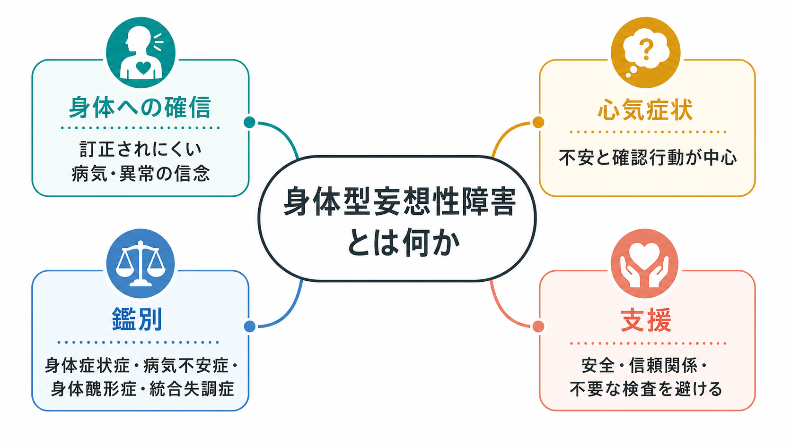
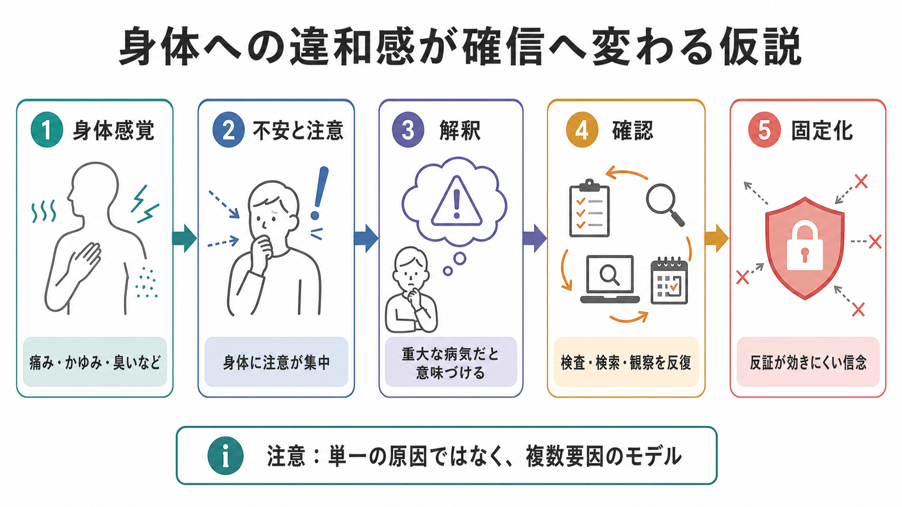
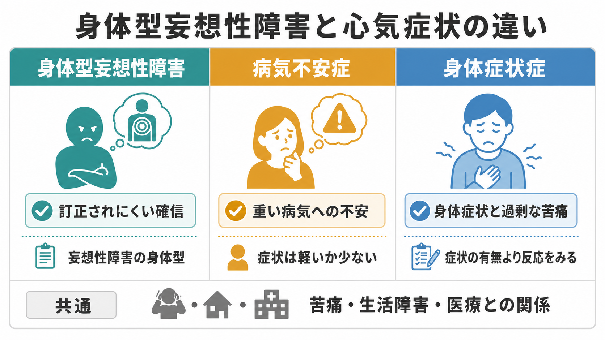

# 身体型妄想性障害とは何か

## 要点

- 身体型妄想性障害は、[[妄想性障害とは何か]]の下位型として、身体機能・身体感覚・病気・外見・体臭・寄生虫感染などに関する確信が中心になる状態である。[1][3]
- 心気症状との違いは、単に「心配が強い」ことではなく、反証への開かれ方、確信の固定性、他の精神病症状や生活機能との関係にある。[3][4]
- [[心気症状とは何か]]、病気不安症、身体症状症、身体醜形症、[[統合失調症とは何か]]、気分障害、物質・身体疾患による精神病症状を鑑別する必要がある。[1][2][4][5][6]
- 臨床では、本人の体験を頭ごなしに否定せず、医学的安全確認と不要な検査・処置の反復を避ける支援設計が重要になる。[4][5]
- 記事全体は教育・研究目的であり、個別の診断や治療指示ではない。

## この記事で答える問い

このノートでは、「自分の身体に重大な異常がある」「寄生虫がいる」「体臭が強く他人に迷惑をかけている」「身体の一部が異常に変形している」といった訴えが、どのような場合に身体型の妄想性障害として理解されるのかを整理する。特に、[[心気妄想とは何か]]や[[心気症状とは何か]]との境界を、診断名の暗記ではなく、確信の強さ、反証への反応、生活機能、鑑別診断、支援関係という観点から読む。

## まず結論

身体型妄想性障害とは、身体に関する異常や病気の信念が、本人にとって非常に確実な事実として体験され、通常の説明や検査結果では修正されにくい状態である。DSM-5-TR では妄想性障害に身体型が指定され、妄想が少なくとも1か月以上続き、統合失調症の基準を満たさず、妄想の影響以外では機能が著しく障害されないことなどが重視される。[1][3] ICD-11 では妄想性障害は、関連する妄想が典型的には3か月以上持続し、統合失調症に特徴的な持続的幻覚、陰性症状、思考解体、作為体験などが前景化しないものとして記述される。[2]

ただし、身体に関する強い不安があればすべて身体型妄想性障害というわけではない。病気不安症では、重い病気への不安と確認行動が中心で、身体症状はないか軽いことが多い。[4] 身体症状症では、身体症状そのものの有無よりも、その症状に対する過剰な思考・感情・行動と生活障害が問題になる。[5] 身体醜形症では、外見上の欠点へのとらわれと反復行動が中心で、洞察は良好な場合から妄想的確信まで幅がある。[6] したがって、鑑別では「内容が身体だから」ではなく、病識、反証可能性、他の症状、経過、身体疾患・薬物・文化的背景を総合して判断する。

## 背景

身体型妄想性障害の古典的な臨床像には、寄生虫妄想、体臭や口臭への確信、身体の内部が腐敗しているという確信、身体の形や機能の異常への確信などが含まれる。[3] これらは現実には完全に不可能とは限らない内容をとることが多いため、本人は皮膚科、内科、歯科、耳鼻科、美容医療、救急外来などを何度も受診することがある。精神科に初めてつながる時点では、すでに多数の検査、処置、医療者不信、家族との対立が積み重なっていることもある。

この領域で難しいのは、身体疾患を軽視してはいけない一方で、検査を繰り返すほど確信が弱まるとは限らない点である。身体症状症や病気不安症の臨床解説でも、支持的で一貫した医師患者関係を保ちながら、不必要な検査や治療を避けることが推奨される。[4][5] 身体型妄想性障害でも同じく、訴えの真偽をその場で力比べのように争うより、安全確認、苦痛、生活機能、リスク、治療同盟を分けて評価するほうが実践的である。

## 基本概念

### 妄想性障害の身体型

妄想性障害は、妄想が主症状でありながら、妄想に直接関係しない領域では人格や行動が比較的保たれやすい精神病性障害である。[1][2] 身体型では、妄想の主題が身体機能や身体感覚に向かう。StatPearls の整理では、身体型は bodily functions and sensations に関わる妄想であり、寄生虫感染、身体醜形的な妄想、体臭・口臭に関する妄想などが例として挙げられる。[3]

「比較的保たれやすい」という表現は、軽症という意味ではない。本人は仕事や会話では整って見えても、特定の身体主題では強い確信をもち、検査要求、自己処置、対人回避、医療者への怒り、法的トラブル、自傷リスクが生じることがある。[[MSEで思考内容をどう評価するか]]、[[MSEで病識と判断力をどう評価するか]]、[[MSEで知覚異常をどう聞くか]]は、このような「一部の主題に限局した確信」を見落とさないために重要である。

### 心気症状との違い

心気症状は、身体や健康に関する過度の心配、確認、安心希求、医療機関受診、病気への恐れとして現れる。病気不安症では、重い病気をもっている、または発症するという不安が中心で、身体症状はないか軽いことが多い。[4] ここでは「不安」が中心であり、検査結果や説明で一時的に安心するが、また別の感覚や情報で不安が戻ることがある。

身体型妄想性障害では、不安だけでなく「すでにそうである」という確信が前景化しやすい。反証が提示されても、「検査方法が間違っている」「医師が見逃した」「隠されている」と解釈され、信念体系の中に取り込まれることがある。もちろん現実の臨床では連続的で、心気症状が強いほど自動的に妄想になるわけではない。重要なのは、確信度、訂正可能性、洞察、反復行動の形式、他の精神病症状、生活機能の障害を丁寧に見ることである。

## 仕組み

身体型妄想性障害に単一の原因が確立しているわけではない。妄想全般の認知モデルでは、少ない証拠で結論に飛ぶ傾向、信念の柔軟性低下、代替説明を検討しにくいこと、外的帰属や脅威解釈、ストレスや孤立などが、妄想の形成・維持に関わる可能性が議論されてきた。[7][8] これは身体型にもそのまま当てはめられる単純な公式ではないが、「身体感覚が異常な確信へ固定化する」過程を考える足場にはなる。

ひとつの仮説的な流れは、次のように整理できる。まず痛み、かゆみ、臭い、違和感、皮膚感覚などの身体感覚が生じる。次に、注意が身体へ集中し、感覚がより目立つ。さらに「これは重大な病気だ」「寄生虫がいる」「身体が壊れている」という解釈が与えられる。確認のために検査、検索、観察、写真撮影、自己処置、安心希求が反復される。否定的な検査結果は安心ではなく、「まだ見つかっていない証拠」と解釈され、信念が固定化することがある。

ここで注意すべきなのは、この説明が本人の苦痛を「思い込み」と片づけるためのものではない点である。身体感覚そのものは現実に体験されている場合がある。身体疾患、薬剤、物質使用、神経疾患、皮膚疾患、内分泌疾患、睡眠不足、ストレス、トラウマ、文化的意味づけが重なりうる。診断的には、精神病性障害の枠組みだけでなく、身体医学的評価と心理社会的評価を併行する必要がある。

## 図解

上の図は、身体型妄想性障害を理解するための概念地図と機序仮説である。どちらも診断基準そのものではなく、臨床で見るべき論点を整理するための補助線である。下の比較図では、身体型妄想性障害、病気不安症、身体症状症の違いを、確信、不安、身体症状への反応という観点から並べている。

## 臨床・研究との接続

臨床で最初に必要なのは、身体疾患の見逃しを避けるための妥当な評価である。ただし、「安心させるために検査を増やす」だけでは、病気不安症や身体症状症と同じく、長期的には確認行動を強める場合がある。[4][5] 身体型妄想性障害が疑われる場合も、検査の目的、限界、次の評価計画を明確にし、複数医療機関での断片的な受診を減らす支援が重要になる。

治療や支援では、本人の信念を直接否定するよりも、「その体験のために生活で何が困っているか」「眠れているか」「自己処置で傷ついていないか」「仕事や家族関係に何が起きているか」「怒りや絶望が安全上の問題になっていないか」を扱う。妄想性障害の治療には抗精神病薬、心理社会的支援、家族支援、リスク管理が検討されることがあるが、個別の適応は診察と経過評価に基づく。[3] 身体醜形症が中心なら、SSRI や身体醜形症に焦点化した認知行動療法が重要になるため、診断の置き方は支援方針に直結する。[6]

研究上は、身体型妄想性障害に特化した大規模研究は限られる。妄想一般の研究では、jumping to conclusions や belief flexibility が検討されているが、身体型特有の身体感覚、医療受診行動、皮膚科・内科との連携、デジタル検索行動、文化的身体観の影響は、まだ十分に整理されていない。[7][8] そのため、この記事では「確立した原因」ではなく「臨床的に有用な作業仮説」として扱う。

## よくある誤解

### 身体型妄想性障害は身体疾患がないという意味か

そうではない。身体疾患が併存していても、その疾患の重症度や所見からは説明しにくい強固な確信、確認行動、生活障害が前景化することがある。身体疾患の評価と精神医学的評価は対立するものではなく、同時に必要になる。

### 心気症状が重くなったものが身体型妄想性障害なのか

連続性はあるが、単純な重症度の階段ではない。病気不安症では不安と確認行動が中心で、身体型妄想性障害では訂正されにくい確信が中心になりやすい。[3][4] ただし境界は硬くなく、診断は経過、洞察、反証への反応、他の症状、生活機能から判断する。

### 検査で異常なしなら、すぐ精神科に送ればよいのか

「異常なしだから精神科」という伝え方は、本人には見捨てられた、理解されなかったと受け取られやすい。身体症状症や病気不安症の支援と同様に、身体の安全確認を続ける枠組みと、苦痛・睡眠・不安・生活障害を扱う枠組みをつなぐほうがよい。[4][5]

### 身体醜形症と身体型妄想性障害は同じか

同じではない。身体醜形症は、外見上の欠点へのとらわれと反復行動を中心とする強迫症関連障害であり、洞察の程度は良好から妄想的確信まで幅がある。[6] 外見へのとらわれが中心であれば身体醜形症として評価し、身体機能・病気・寄生虫・体臭などの妄想主題が中心なら妄想性障害身体型を検討する。

## 関連ノート

- [[妄想性障害とは何か]]
- [[心気妄想とは何か]]
- [[心気症状とは何か]]
- [[身体症状症は脳の予測処理で説明できるのか]]
- [[統合失調症とは何か]]
- [[DSMとICDは何が違うのか]]
- [[MSEで思考内容をどう評価するか]]
- [[MSEで病識と判断力をどう評価するか]]
- [[MSEで知覚異常をどう聞くか]]
- [[強迫観念とは何か]]
- [[強迫行為とは何か]]
- [[強迫的疑念とは何か]]

## 今後の作成候補

- 身体醜形症とは何か
- 病気不安症とは何か
- 身体症状症とは何か
- 寄生虫妄想とは何か
- 体臭恐怖と嗅覚関連症候群とは何か
- 心気症状と妄想の連続性をどう評価するか

## MOC更新候補

- `content/00_MOC/` 配下の精神医学、精神病性障害、症候学、身体症状関連の MOC に `[[身体型妄想性障害とは何か]]` を追加する候補。
- 並列記事生成との衝突を避けるため、このジョブでは MOC ファイルの直接更新は行わない。

## 理解チェック

1. 身体型妄想性障害と病気不安症を分けるとき、確信の強さ以外に何を確認する必要があるか。
2. 身体症状症では、身体症状そのものの有無より何が診断上重要になるか。
3. 身体醜形症が疑われる場合、なぜ妄想性障害身体型と分けて考える必要があるか。
4. 「検査で異常なし」を本人に伝えるとき、治療同盟を壊さないためにどのような観点が必要か。

## 未解決問題

- 身体型妄想性障害に特化した疫学研究、縦断研究、治療研究は限られている。
- 身体感覚、健康不安、医療受診行動、デジタル検索行動、妄想的確信がどの順序で結びつくかは、個人差が大きい。
- 皮膚科、内科、歯科、美容医療、精神科がどのように連携すれば、身体疾患の見逃しと不要な処置の反復を同時に減らせるかは実践的課題である。

## 参考文献

[1] American Psychiatric Association. (2022). *Diagnostic and Statistical Manual of Mental Disorders, Fifth Edition, Text Revision (DSM-5-TR).* American Psychiatric Association Publishing. https://www.psychiatry.org/psychiatrists/practice/dsm

[2] World Health Organization. (2026). *ICD-11 for Mortality and Morbidity Statistics: 6A24 Delusional disorder.* https://icd.who.int/browse/2026-01/mms/en#1974996783

[3] Joseph, S. M., & Siddiqui, W. (2023). Delusional Disorder. In *StatPearls.* StatPearls Publishing. https://www.ncbi.nlm.nih.gov/books/NBK539855/

[4] French, J. H., & Hameed, S. (2023). Illness Anxiety Disorder. In *StatPearls.* StatPearls Publishing. https://www.ncbi.nlm.nih.gov/books/NBK554399/

[5] Dimsdale, J. E. (2026). Somatic Symptom Disorder. *Merck Manual Professional Edition.* https://www.merckmanuals.com/professional/psychiatric-disorders/somatic-symptom-and-related-disorders/somatic-symptom-disorder

[6] Phillips, K. A., & Stein, D. J. (2026). Body Dysmorphic Disorder (BDD). *Merck Manual Professional Edition.* https://www.merckmanuals.com/professional/psychiatric-disorders/obsessive-compulsive-and-related-disorders/body-dysmorphic-disorder-bdd

[7] Garety, P. A., & Freeman, D. (1999). Cognitive approaches to delusions: A critical review of theories and evidence. *British Journal of Clinical Psychology, 38*(2), 113-154. https://doi.org/10.1348/014466599162700

[8] So, S. H., Freeman, D., Dunn, G., Kapur, S., Kuipers, E., Bebbington, P., Fowler, D., & Garety, P. A. (2012). Jumping to conclusions, a lack of belief flexibility and delusional conviction in psychosis. *Journal of Abnormal Psychology, 121*(1), 129-139. https://doi.org/10.1037/a0025297
