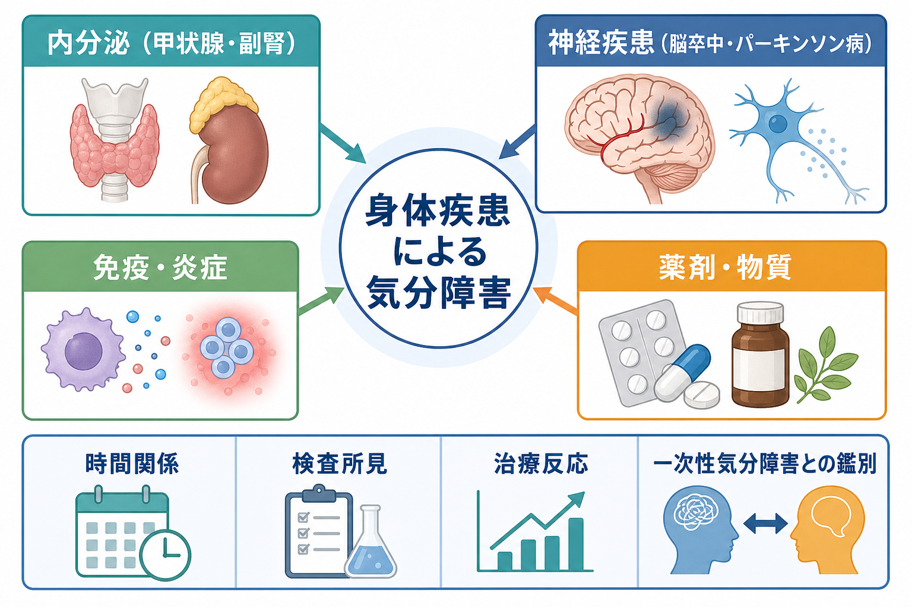
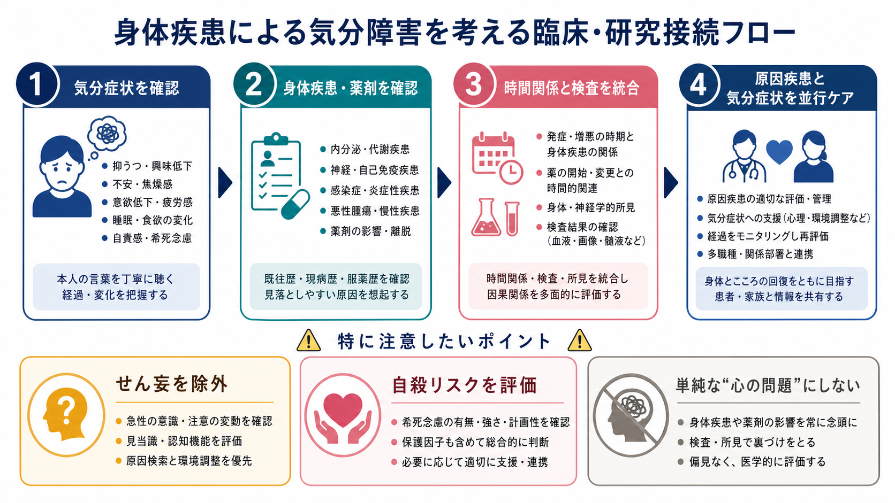

# 身体疾患による気分障害とは何か

## 要点

- 身体疾患による気分障害とは、抑うつ、興味・喜びの低下、躁的高揚、易怒性などの気分症状が、甲状腺疾患、副腎疾患、脳卒中、パーキンソン病、炎症性疾患、腫瘍、薬剤・物質などの身体的要因と病態生理学的に結びつく状態を指す。
- DSM-5-TR では、DSM-IV の「一般身体疾患による気分障害」が、主に「他の医学的疾患による抑うつ障害」と「他の医学的疾患による双極性および関連障害」に分けて扱われる[1]。
- 診断上の核心は「気分症状がある」ことだけではなく、発症時期、身体疾患の活動性、検査所見、神経学的所見、薬剤・物質、せん妄の有無、一次性気分障害との鑑別を統合して判断する点にある[1][2]。
- 甲状腺機能異常では抑うつ、不安、焦燥、認知変化がみられ、甲状腺機能の過不足はいずれも気分症状に関与しうる[3]。クッシング症候群では抑うつを中心に、不安、躁・軽躁、精神病症状も報告される[4]。
- 神経疾患では、脳卒中後うつやパーキンソン病に伴う抑うつが代表的であり、脳回路障害、モノアミン系、炎症、HPA 軸、機能障害、生活変化が重なって症状を形づくる[5][6][7]。

## この記事で答える問い

1. 身体疾患による気分障害は、[[うつ病とは何か]]や双極性障害と何が違うのか。
2. 甲状腺疾患、クッシング症候群、脳卒中、パーキンソン病では、どのように気分症状が起こりうるのか。
3. 「身体の病気が原因」と「病気への心理的反応」は、どのように区別して考えるのか。
4. 臨床・研究では、何を評価し、どこに注意する必要があるのか。

## まず結論

身体疾患による気分障害は、「身体疾患がある人に気分症状が出た」という広い記述ではない。より正確には、身体疾患、薬剤・物質、神経学的変化、内分泌・免疫・炎症、睡眠や代謝の変化が、抑うつ症状や躁症状の発症・増悪と時間的・病態生理学的に結びついていると考えられる状態である[1][2]。

ただし、この概念は単純な原因探しではない。身体疾患がある人にも、一次性の[[うつ病とは何か]]、双極性障害、適応反応、[[物質誘発性精神病とは何か]]や薬剤関連症状、[[せん妄とは何か]]が起こりうる。したがって、評価では「身体疾患か、心理反応か」の二分法ではなく、身体疾患の活動性、薬剤歴、発症の時間関係、症状の質、認知・意識の変化、検査所見、既往歴を並べて考える。

## 背景

精神医学では、気分症状を「こころ」だけの問題として扱うと重要な身体疾患を見落とす。一方で、身体疾患が見つかっただけで気分症状のすべてを身体疾患に帰すと、本人の苦痛、喪失体験、生活機能、社会的支援、一次性気分障害への評価が不十分になる。

DSM-5-TR の変更資料では、従来の「mood disorder due to a general medical condition」が、抑うつ障害と双極性関連障害の体系に分けて整理されたことが説明されている[1]。この変更は、気分症状を「抑うつ系」と「躁・混合系」に分けて評価し、物質・薬剤性の症状や一次性気分障害との区別を明確にする意図をもつ。

身体疾患をもつ成人のうつ病は臨床的にも重要である。NICE の慢性身体疾患とうつ病に関するガイドラインは、身体疾患とうつ病の併存が生活の質、機能、予後に影響し、評価と治療では身体疾患、心理社会的要因、薬剤相互作用、自殺リスクを含めて総合的に扱う必要があると整理している[8]。

## 基本概念

### 抑うつ型と躁・混合型

身体疾患による気分障害には、大きく抑うつ型と躁・混合型がある。抑うつ型では、抑うつ気分、興味・喜びの低下、疲労感、睡眠・食欲の変化、集中困難、精神運動制止または焦燥、罪責感、希死念慮などが問題になる。躁・混合型では、気分高揚、易怒性、活動性の増加、睡眠欲求の低下、多弁、観念奔逸、衝動性、誇大的思考などが前景に出る。

身体疾患との関連を考える場合、症状の形だけでは不十分である。たとえば甲状腺機能亢進症では、不安、焦燥、不眠、易怒性が躁状態のように見えることがある。甲状腺機能低下症では、疲労、寒がり、体重増加、認知の鈍さ、精神運動制止が抑うつ症状と重なりやすい[3]。クッシング症候群では抑うつが多いが、躁・軽躁や精神病症状も報告されるため、単純な「抑うつだけ」の疾患像では捉えられない[4]。

### 一次性気分障害との違い

一次性の気分障害では、身体疾患だけでは説明しきれない気分エピソードの反復、家族歴、発症年齢、気分エピソードの自律性、季節性や産後などのパターンが手がかりになる。身体疾患による気分障害では、身体疾患の発症・増悪・治療変更と気分症状の時間関係、検査所見、神経学的所見、身体症状の併走がより重要になる。

ただし、これは排他的な関係ではない。身体疾患は一次性気分障害の発症閾値を下げることがあり、もともとの気分障害が身体疾患のストレスで再燃することもある。したがって、臨床では「どちらか一方」ではなく、「身体疾患がどの程度、どの経路で、どの時期に寄与しているか」を見積もる。

### せん妄との鑑別

身体疾患が関与する精神症状では、[[せん妄とは何か]]の評価が必須である。意識水準の変動、注意障害、急性発症、日内変動、幻覚、睡眠覚醒リズムの崩れが強い場合、気分障害として固定する前にせん妄を考える。DSM-5-TR の抑うつ障害の基準でも、症状がせん妄の経過中だけに起こる場合は別に考える必要がある[1]。

## 仕組み

### 内分泌・代謝経路

甲状腺ホルモンは、脳内の代謝、発達、神経伝達、睡眠、体温調節、自律神経活動に関わる。甲状腺機能低下症では抑うつや認知機能低下が、甲状腺機能亢進症では不安、焦燥、不眠、易刺激性が目立つことがある[3]。甲状腺機能異常は、[[うつ病とは何か]]の背景因子として評価されることも多いが、検査値と症状は一対一に対応しないため、臨床像全体を合わせて読む必要がある。

副腎皮質ホルモンの過剰であるクッシング症候群では、抑うつ、不安、認知症状、躁・軽躁、精神病症状が報告されている[4]。慢性的な高コルチゾール状態は、HPA 軸、睡眠、代謝、海馬・前頭前野・扁桃体を含む情動回路、身体イメージ、生活機能に影響しうる。重要なのは、内分泌異常の治療後も一部の精神症状や認知症状が残る可能性がある点である[4]。

### 炎症・免疫経路

炎症性サイトカイン、自己免疫、慢性炎症は、疲労、快感消失、睡眠変化、食欲変化、認知の鈍さと関連しうる。炎症は HPA 軸、モノアミン代謝、グルタミン酸系、神経可塑性に影響するため、身体疾患による気分症状を理解するうえで重要な経路である[5]。

ただし、「炎症があるから抑うつが起こる」と直線的に言えるわけではない。炎症マーカーは診断名を確定する単独の検査ではなく、身体疾患の活動性、疼痛、睡眠、社会的孤立、既往歴などと相互作用する背景要因として扱うのが現実的である。

### 脳回路・神経伝達経路

脳卒中後うつは、身体疾患による気分症状を考える代表例である。2025 年のレビューでは、脳卒中後うつの機序として、炎症、HPA 軸の変調、酸化ストレス、神経栄養因子、グルタミン酸興奮毒性、脳ネットワーク障害、モノアミン低下、病変部位、心理社会的要因が挙げられている[5]。つまり、病変部位だけで説明するより、脳損傷と生活機能の変化を含めた多因子モデルが適している。

パーキンソン病でも抑うつは頻度の高い非運動症状であり、ドパミン、セロトニン、ノルアドレナリンを含むモノアミン系、報酬系、前頭辺縁系、睡眠、運動機能、認知症状が関わる[6][7]。パーキンソン病の抑うつは、障害への心理反応だけではなく、疾患そのものの神経変性過程の一部として現れることがある[6][7]。

### 薬剤・物質経路

身体疾患の治療薬や物質も気分症状に関わる。ステロイド、インターフェロン、ドパミン作動薬、一部の抗けいれん薬、ホルモン関連薬、アルコールや離脱状態などは、抑うつ、焦燥、躁症状、精神病症状を引き起こすことがある。ここでは [[薬剤性精神病とは何か]] や [[物質誘発性精神病とは何か]] と重なる評価が必要になる。

薬剤性・物質性の場合も、薬剤開始・増量・中止・相互作用と症状の時間関係が重要である。身体疾患そのもの、薬剤、睡眠不足、疼痛、不安、せん妄が同時に関与することも少なくない。

## 図解

この記事の 3 枚の図は、身体疾患による気分障害を「原因候補の一覧」「メカニズム」「評価から支援への流れ」として読むための補助図である。画像内の項目は診断基準そのものではなく、見落としやすい観点を整理するための概念地図である。

## 臨床・研究との接続

### 評価の焦点

評価では、まず抑うつ症状、躁症状、不安、焦燥、精神病症状、認知・意識の変化、自殺リスクを確認する。次に、身体疾患の診断名だけでなく、活動性、発症時期、治療経過、検査値、神経学的所見、画像所見、薬剤・物質、睡眠、疼痛、感染、栄養、社会的支援を確認する。

身体疾患による気分障害を疑う手がかりには、次のようなものがある。

- それまで気分障害の既往が乏しい人に、身体疾患の発症・増悪と近接して気分症状が出た。
- 典型的な気分症状に加えて、発熱、体重変化、頻脈、便通変化、振戦、筋力低下、神経脱落症状、意識変動などがある。
- 気分症状の変動が、検査値、疾患活動性、薬剤変更、睡眠・疼痛の変化と連動している。
- 躁症状や精神病症状が、ステロイド、ドパミン作動薬、内分泌異常、神経疾患の経過と近接している。

### 支援と治療の考え方

治療は「原因疾患だけを治せばよい」でも「精神症状だけを治せばよい」でもない。NICE は慢性身体疾患とうつ病の評価・管理において、重症度、自殺リスク、本人の希望、薬剤相互作用、心理社会的支援、段階的ケアを含めることを推奨している[8]。身体疾患による気分障害でも、原因疾患の評価・治療と、気分症状への心理的・環境的・薬物的支援を並行して考える。

教育・研究目的で強調すべき点は、個別の治療方針を記事から直接決めないことである。たとえば甲状腺疾患、クッシング症候群、脳卒中、パーキンソン病では、内科、神経内科、精神科、リハビリテーション、看護、心理、家族支援が関わることが多い。自殺念慮、重度の躁状態、精神病症状、せん妄、急激な身体状態の悪化がある場合は、緊急性の評価が優先される。

### 研究上の論点

研究では、身体疾患による気分症状を一つの均質な群として扱うと、機序が見えにくくなる。甲状腺疾患、脳卒中、パーキンソン病、自己免疫疾患、悪性腫瘍、慢性疼痛、薬剤性症状では、病態、時間経過、身体機能、認知機能、治療反応が異なる。

今後の課題は、症状尺度、神経画像、内分泌指標、炎症指標、睡眠、活動量、生活機能、薬剤歴を統合し、どの人にどの経路が強く関与しているかを層別化することである。これは、単に「身体疾患による」とラベルを貼るためではなく、見落としを減らし、本人にとって有効な支援を選ぶための研究課題である。

## よくある誤解

### 「身体疾患があるなら、気分症状は全部そのせいである」

身体疾患は気分症状の原因にも増悪因子にもなるが、一次性気分障害、適応反応、薬剤・物質性症状、せん妄、認知症、心理社会的ストレスが併存することがある。身体疾患が見つかっただけで、本人の語りや生活機能、既往歴を省略してよいわけではない。

### 「検査値が正常なら、身体疾患の関与はない」

検査値が正常であれば重要な手がかりにはなるが、神経疾患、疼痛、睡眠、薬剤、炎症、疾患活動性、身体機能の低下など、単一の検査で捉えきれない経路もある。逆に、検査値異常があっても、それだけで気分症状の原因と確定できるわけではない。

### 「抑うつに見えるなら、すべてうつ病として扱えばよい」

抑うつ症状は多くの病態で共通して現れる。身体疾患による気分障害では、[[精神病性うつ病とは何か]]、せん妄、認知症、薬剤性症状、双極性障害、喪失反応との鑑別が必要になる。特に意識変動、急性発症、神経脱落症状、内分泌症状、薬剤変更がある場合は、身体評価を先送りしない。

## 関連ノート

- [[うつ病とは何か]]
- [[精神病性うつ病とは何か]]
- [[物質誘発性精神病とは何か]]
- [[薬剤性精神病とは何か]]
- [[せん妄とは何か]]
- [[レビー小体型認知症は神経回路にどのような影響を与えるのか]]

### 関連ノート候補

- 甲状腺機能低下症と抑うつ症状
- 甲状腺機能亢進症と躁・不安症状
- 脳卒中後うつ
- パーキンソン病とうつ
- クッシング症候群の精神症状
- ステロイド誘発性気分障害

### MOC 更新候補

- `content/00_MOC/` 配下の精神医学・気分障害・神経精神医学関連 MOC に `[[身体疾患による気分障害とは何か]]` を追加する候補。
- 並列生成ジョブとの競合を避けるため、このタスクでは MOC 本体は更新しない。

## 理解チェック

1. 身体疾患による気分障害を考えるとき、症状の種類だけでなく時間関係が重要なのはなぜか。
2. 甲状腺機能低下症と甲状腺機能亢進症では、どのように異なる気分・身体症状が前景に出やすいか。
3. 脳卒中後うつやパーキンソン病の抑うつを、単なる心理反応だけで説明しにくい理由は何か。
4. せん妄、薬剤性症状、一次性気分障害を鑑別するために、どの情報を追加で確認するか。

## 参考文献

[1] American Psychiatric Association. (2022). *Depressive Disorder Due to Another Medical Condition: DSM-5-TR*. https://www.psychiatry.org/File%20Library/Psychiatrists/Practice/DSM/DSM-5-TR/APA-DSM5TR-DepressiveDisorderduetoAnotherMedicalCondition.pdf

[2] PsychDB. *Depressive Disorder Due to Another Medical Condition: DSM-5 Diagnostic Criteria*. https://www.psychdb.com/mood/z-depressive-medical

[3] Hage, M. P., & Azar, S. T. (2012). The link between thyroid function and depression. *Journal of Thyroid Research*, 2012, 590648. https://doi.org/10.1155/2012/590648

[4] Lin, T. Y., Hanna, J., & Ishak, W. W. (2020). Psychiatric symptoms in Cushing's syndrome: A systematic review. *Innovations in Clinical Neuroscience, 17*(1-3), 30-35. https://pmc.ncbi.nlm.nih.gov/articles/PMC7239565/

[5] Lin, M.-C., & Huang, S.-S. (2025). Diagnosis and etiology of poststroke depression: A review. *World Journal of Psychiatry, 15*(7), 107598. https://doi.org/10.5498/wjp.v15.i7.107598

[6] Aarsland, D., Påhlhagen, S., Ballard, C. G., Ehrt, U., & Svenningsson, P. (2012). Depression in Parkinson disease: Epidemiology, mechanisms and management. *Nature Reviews Neurology, 8*, 35-47. https://doi.org/10.1038/nrneurol.2011.189

[7] Siciliano, M., Trojano, L., Santangelo, G., De Micco, R., Tedeschi, G., & Tessitore, A. (2022). Depression in Parkinson's disease: A current understanding of its neurobiology and implications for treatment. *Cells, 11*(11), 1732. https://doi.org/10.3390/cells11111732

[8] National Institute for Health and Care Excellence. (2009, last reviewed 2024). *Depression in adults with a chronic physical health problem: recognition and management* (CG91). https://www.nice.org.uk/guidance/cg91

## 未解決問題

- 身体疾患、薬剤、心理社会的ストレスが同時にある場合、どの寄与をどの程度と見積もるかについて、臨床的な判断はまだ不確実性を含む。
- 炎症、内分泌、神経画像、睡眠、活動量を統合した層別化モデルは有望だが、日常診療で使える形にはまだ十分標準化されていない。
- 「身体疾患による」と説明することが、本人の苦痛を身体化しすぎたり、逆に心理的支援を軽視したりしないよう、説明の仕方そのものも検討課題である。
