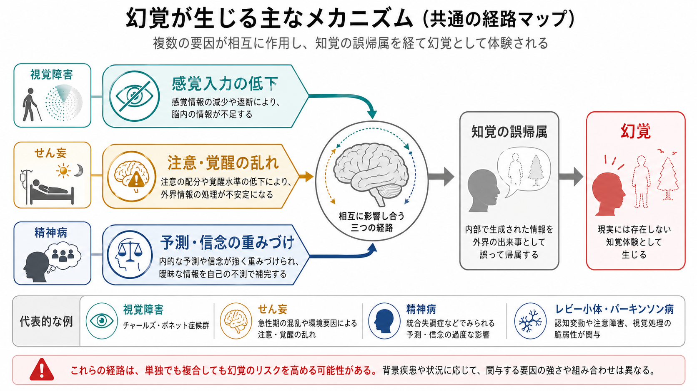

# 身体疾患に伴う不安症状とは何か

## 要点

- 身体疾患に伴う不安症状とは、心疾患、内分泌疾患、呼吸器疾患、低血糖、薬剤・物質、感染・炎症、神経疾患などが、不安・恐怖・焦燥・動悸・息苦しさ・発汗・震えを引き起こす、または増幅する状態である[1]。
- 重要なのは、「不安だから身体症状がある」と早く決めることではなく、身体疾患、薬剤・物質、一次性の[[不安症群とは何か]]、[[パニック発作とは何か]]、[[身体症状症とは何か]]を同時に鑑別することである[1][2]。
- 動悸、息切れ、胸部不快感、震え、発汗はパニック発作にも身体疾患にも共通するため、発症様式、既往歴、薬剤、バイタルサイン、検査所見、症状の時間経過を統合して評価する[2][3]。
- 本稿は教育・研究目的の整理であり、個別の診断や治療指示ではない。急な胸痛、失神、強い呼吸困難、意識変容、重い低血糖が疑われる症状などは、精神症状として扱う前に身体的緊急性を考える必要がある。

## この記事で答える問い

1. 身体疾患に伴う不安症状は、通常の不安や不安症と何が違うのか。
2. 心疾患・内分泌疾患・呼吸器疾患は、なぜ不安様症状を生むのか。
3. 臨床では、どのような情報から身体要因、薬剤・物質要因、心理社会的要因を分けて考えるのか。
4. 研究では、身体指標と不安尺度をどのように接続できるのか。

## まず結論

身体疾患に伴う不安症状は、「心理的な不安が身体に出たもの」とだけ考えると見落としが起こる。甲状腺機能亢進症、低血糖、心不整脈、COPD、喘息、副腎髄質腫瘍、薬剤・物質、離脱などは、動悸、息苦しさ、震え、発汗、焦燥、恐怖感を身体側から生じさせうる[1][3][4][5][6]。

一方で、身体疾患があるからといって、すべての不安が直接の生理作用で説明されるわけでもない。息苦しさや動悸を経験したあとに「また起きるのではないか」という予期不安、受診回避、活動制限、過覚醒が形成されることもある。したがって評価では、身体疾患による直接効果、身体症状への恐怖学習、一次性の不安症、併存する抑うつやトラウマ反応を分けつつ、互いに増幅しうるものとして扱う。

## 背景

[[不安とは何か]]は危険を予測し、注意と行動を準備する情動である。通常の不安でも心拍増加、発汗、筋緊張、呼吸の変化は起こる。しかし臨床では、同じ身体反応が「不安の結果」ではなく、「身体疾患の症状」または「薬剤・物質の作用」として生じることがある[1]。

DSM-5-TR に基づく臨床整理では、不安症群には、一次性の不安症だけでなく、物質・医薬品誘発性不安症や、他の医学的疾患による不安症が含まれる。Merck Manual は、著しい不安を呈する患者では、物質・薬剤誘発性と身体疾患による不安を常に考慮すべきだと整理している[1]。この点は[[鑑別診断とは何か]]と[[身体合併症は精神科診療でなぜ重要なのか]]の実践的な中心課題である。

## 基本概念

### 不安症状と不安様症状

「不安症状」は、主観的な不安、恐怖、心配、焦燥、過覚醒に加えて、動悸、発汗、息苦しさ、胸部不快感、震え、めまい、消化器症状などを含む。これらは[[パニック症とは何か]]や[[パニック発作とは何か]]でも中核的にみられる[2]。

「不安様症状」と呼ぶときは、主観的な不安体験が前景に出ていても、その発生源が必ずしも一次性の不安症とは限らない、という含みを持たせている。たとえば低血糖では、交感神経反応により発汗、震え、動悸、不安が生じる[5]。甲状腺機能亢進症では、動悸、震え、発汗、息切れ、落ち着かなさ、不眠などが現れ、不安症状と重なる[4]。

### 「身体疾患による」と「身体疾患に伴う」

「身体疾患による不安」は、身体疾患の直接的な生理作用が不安症状の主要因と考えられる場合を指す。例として、甲状腺ホルモン過剰、低血糖時のアドレナリン反応、褐色細胞腫のカテコールアミン過剰、心不整脈、低酸素や呼吸困難がある[3][4][5][6]。

「身体疾患に伴う不安」はより広い。身体疾患そのものの生理作用だけでなく、疾患体験、予後への心配、治療負担、生活制限、医療トラウマ、社会的孤立が不安を強める場合も含む。COPD では、息切れと不安が症状として重なり、臨床的な不安の識別が難しくなることが報告されている[7][8]。

## 仕組み

### 1. 自律神経覚醒

動悸、発汗、震え、息苦しさは、交感神経系と副交感神経系のバランス変化に関係する。[[自律神経ネットワークは内臓状態をどう制御するのか]]で扱うように、心拍、血圧、呼吸、発汗、消化管反応は、脳と身体の双方向調節によって変化する。

不安症でも自律神経覚醒は起こるが、身体疾患では同じ反応が身体側から駆動されることがある。低血糖時には、血糖低下に対する防御反応としてエピネフリンなどが関与し、発汗、不安、震え、動悸、頻脈が生じる[5]。褐色細胞腫ではカテコールアミン過剰により、高血圧、頭痛、発汗、動悸、震え、パニック様の恐怖が発作的に出ることがある[6]。

### 2. 呼吸困難と窒息アラーム

呼吸器疾患では、息切れ、胸部圧迫感、窒息感が不安と強く結びつく。COPD や喘息では、実際の気流制限、低酸素、努力呼吸が「このまま息ができなくなる」という脅威評価を誘発しやすい。COPD 患者では臨床的不安が高頻度にみられ、患者経験の研究では、呼吸困難、不確実性、活動制限、回避行動が不安を維持する構造が示されている[7][8]。

呼吸困難は一次性のパニック発作でも起こるため、呼吸器症状があるから身体疾患、身体所見が乏しいから心理要因、と単純に分けられない。症状の発症状況、SpO2、喘鳴、咳、喀痰、発熱、運動負荷との関係、既往歴、吸入薬やステロイド使用を含めてみる必要がある。

### 3. 心疾患と動悸の解釈

動悸は不安症状の代表であると同時に、心不整脈や構造的心疾患の症状でもある。AAFP の総説では、動悸の評価では心疾患が最も懸念される原因であり、病歴、身体診察、標的を絞った検査、12誘導心電図が重要とされる[3]。また、精神症状がある患者でも非精神医学的な原因が存在しうるため、既知の不安症だけで説明しない姿勢が求められる[3]。

臨床的には、急な開始と終了、失神・前失神、胸痛、労作時症状、家族歴、既往心疾患、脈の不整、薬剤・カフェイン・アルコール・ stimulant 使用などが評価の焦点になる。これは[[鑑別診断とは何か]]でいう「似た症状をもつ複数の候補を、追加情報で切り分ける」作業である。

### 4. 内分泌・代謝の変化

内分泌・代謝疾患は、不安様症状を非常に作りやすい。甲状腺機能亢進症では、体重減少、暑がり、発汗、動悸、震え、息切れ、不安、落ち着かなさ、不眠などがみられる[4]。低血糖では、交感神経症状として発汗、不安、震え、動悸、頻脈が出るほか、重くなると混乱、視覚・言語の変化、けいれん、意識消失が問題になる[5]。

この領域では「不安らしく見える」ことと「精神疾患である」ことを分ける必要がある。血糖、甲状腺機能、電解質、貧血、感染、妊娠、薬剤変更などは、症状の文脈によって確認対象になる。

## 図解

図1は、身体疾患に伴う不安症状を、心疾患、内分泌・代謝、呼吸器、薬剤・物質、感染・炎症、神経疾患の概念地図として整理した。中心にあるのは「不安・恐怖」だけではなく、動悸、息苦しさ、震え、発汗などの身体信号である。

図2は、身体疾患が身体信号を変え、それが[[身体と感情はどのようにつながるのか]]で扱う内受容感覚を通じて脳の脅威評価に入る流れを示す。身体信号が強いほど不安が強まり、不安がさらに呼吸・心拍・注意を変える悪循環が起こりうる。

図3は、臨床・研究での評価の流れを示す。急な発症、身体症状が前景、既往歴・薬剤、バイタルサイン、検査、心理社会的評価を分けずに、同じ評価の中で扱うことが重要である。

## 臨床・研究との接続

### 臨床評価の入口

身体疾患に伴う不安症状を考える入口は、症状の時間経過である。突然始まったのか、慢性的に続くのか、発作性か、労作・食事・睡眠・薬剤変更・感染・月経周期・飲酒や離脱と関係するのかを確認する。[[鑑別診断とは何か]]や[[薬剤性精神症状とは何か]]と同じく、症状だけでなく、開始時期と文脈が重要になる。

身体評価では、脈拍、血圧、呼吸数、体温、酸素飽和度、意識状態、胸痛、失神、神経症状、体重変化、発汗、震え、甲状腺腫、喘鳴、浮腫などを見る。検査は症状から決めるものであり、すべての人に同じ検査をするという意味ではない。臨床判断では、心電図、血糖、甲状腺機能、血算、電解質、腎機能、炎症所見、薬物・物質使用歴などが文脈に応じて候補になる[1][3][5]。

### 研究での扱い

研究では、身体疾患に伴う不安症状を単なる質問紙得点として扱うと、身体症状と心理症状が混ざりやすい。たとえば COPD では、息切れ、活動制限、予期不安、回避行動が重なり、不安尺度の身体項目が呼吸器症状を反映している可能性がある[7][8]。

そのため、研究デザインでは、疾患活動性、呼吸機能、心拍・心電図、血糖、甲状腺機能、薬剤、炎症指標、睡眠、痛み、生活機能をあわせて測ると解釈しやすい。[[GAFやWHODASは何を評価するのか]]のような機能尺度と、不安尺度、身体疾患の客観指標を組み合わせると、「不安そのもの」と「身体疾患に由来する苦痛・制限」を分けて考えやすくなる。

## よくある誤解

### 誤解1: 不安があるなら精神科だけの問題である

不安は精神医学の重要な症状だが、身体疾患や薬剤・物質によっても生じる[1]。特に初発、高齢発症、急な変化、意識変容、神経症状、胸痛、失神、呼吸困難、体重減少、発熱、薬剤変更がある場合には、身体要因を先に考える必要がある。

### 誤解2: 身体疾患が見つかれば、不安の説明はそれで終わる

身体疾患が不安のきっかけでも、予期不安、回避、過覚醒、健康不安、抑うつ、睡眠障害が二次的に残ることがある。身体疾患の管理と心理社会的支援は対立するものではない。

### 誤解3: パニック発作なら心疾患ではない

パニック発作と心疾患は、動悸、胸部不快感、息苦しさ、めまいを共有する[2][3]。パニック発作らしく見える症状でも、発症様式、心疾患既往、失神、労作時症状、心電図所見などから、心疾患の可能性を評価する必要がある[3]。

### 誤解4: 検査が正常なら苦痛は本物ではない

検査が正常でも、苦痛や恐怖は現実の体験である。身体信号への注意、内受容感覚の増幅、過去の発作経験、疾患への心配、生活制限によって、不安は持続しうる。これは[[身体化とは何か]]や[[身体症状症は脳の予測処理で説明できるのか]]の問題ともつながる。

## 関連ノート

- [[不安とは何か]]
- [[不安症群とは何か]]
- [[パニック発作とは何か]]
- [[パニック症とは何か]]
- [[鑑別診断とは何か]]
- [[身体合併症は精神科診療でなぜ重要なのか]]
- [[薬剤性精神症状とは何か]]
- [[身体疾患による気分障害とは何か]]
- [[身体と感情はどのようにつながるのか]]
- [[自律神経ネットワークは内臓状態をどう制御するのか]]

MOC更新候補: `content/00_MOC/` 配下の精神医学、症候学、臨床診断、身体合併症関連のMOCに追加候補。並列ジョブとの競合を避けるため、本稿ではMOC本体は更新しない。

## 理解チェック

1. 動悸と息苦しさを訴える人を評価するとき、一次性の不安症だけでなく、どのような身体疾患・薬剤・物質を候補に入れるべきか。
2. 「身体疾患による不安」と「身体疾患に伴う不安」はどう違うか。
3. COPD で不安が見落とされやすい理由は何か。
4. 低血糖や甲状腺機能亢進症が、なぜパニック様症状に見えることがあるのか。
5. 身体疾患が確認されたあとにも、心理社会的評価が必要になるのはなぜか。

## 参考文献

[1] Barnhill JW. Overview of Anxiety Disorders. *Merck Manual Professional Version*. Reviewed/Revised Modified Apr 2026. https://www.merckmanuals.com/professional/psychiatric-disorders/anxiety-and-trauma-and-stressor-related-disorders/overview-of-anxiety-disorders

[2] Cackovic C, Nazir S, Marwaha R. Panic Disorder. *StatPearls*. Updated 2023. https://www.ncbi.nlm.nih.gov/books/NBK430973/

[3] Wexler RK, Pleister A, Raman SV. Palpitations: Evaluation in the Primary Care Setting. *American Family Physician*. 2017;96(12):784-789. https://www.aafp.org/pubs/afp/issues/2017/1215/p784.html

[4] Pearce SHS, Cheetham TD, Wood CL, et al. Diagnosis and Treatment of Graves' Disease. In: Feingold KR, Adler RA, Ahmed SF, et al., editors. *Endotext*. Updated 2026 Jan 10. https://www.ncbi.nlm.nih.gov/books/NBK285548/

[5] Feingold KR. Hypoglycemia. In: Feingold KR, Adler RA, Ahmed SF, et al., editors. *Endotext*. Updated 2025 Nov 20. https://www.ncbi.nlm.nih.gov/books/NBK279137/

[6] Bravo EL. Pheochromocytoma. *Journal of Clinical Hypertension*. 2002;4(1):62-72. PMCID: PMC8099329. https://pmc.ncbi.nlm.nih.gov/articles/PMC8099329/

[7] Willgoss TG, Yohannes AM. Anxiety disorders in patients with COPD: a systematic review. *Respiratory Care*. 2013;58(5):858-866. doi:10.4187/respcare.01862. https://pubmed.ncbi.nlm.nih.gov/22906542/

[8] Christiansen CF, Lokke A, Bregnballe V, Prior TS, Farver-Vestergaard I. COPD-Related Anxiety: A Systematic Review of Patient Perspectives. *International Journal of Chronic Obstructive Pulmonary Disease*. 2023;18:1031-1046. doi:10.2147/COPD.S404701. https://pubmed.ncbi.nlm.nih.gov/37304765/

## 未解決問題

- 不安尺度の身体項目が、身体疾患の重症度と不安そのものをどの程度分離できるか。
- COPD、心不全、内分泌疾患など、疾患別に最適な不安評価尺度やカットオフがどこまで確立しているか。
- 身体疾患の治療、心理教育、呼吸リハビリテーション、認知行動療法、薬物療法をどの順序・組み合わせで使うと、不安と身体機能の双方に最も有効か。
