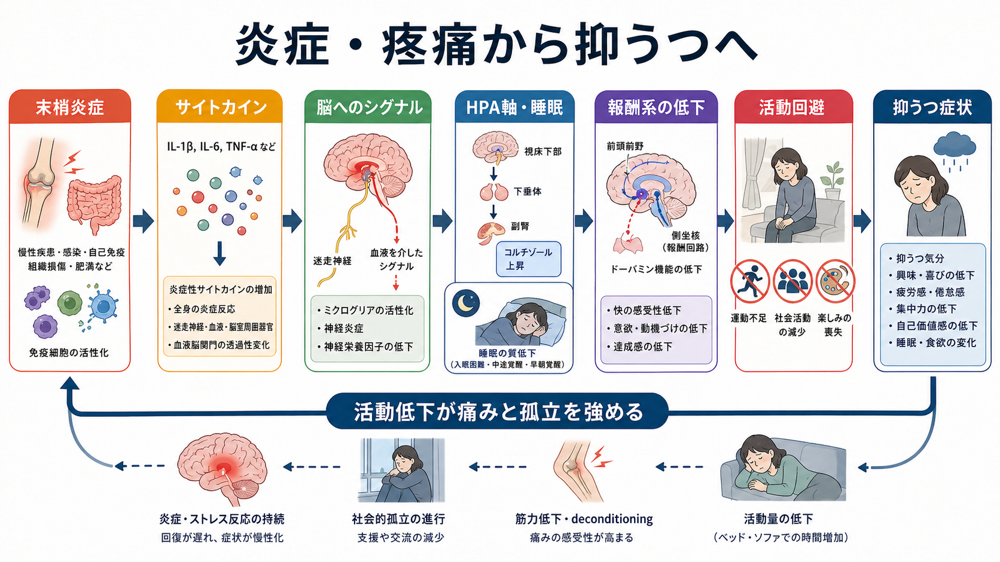
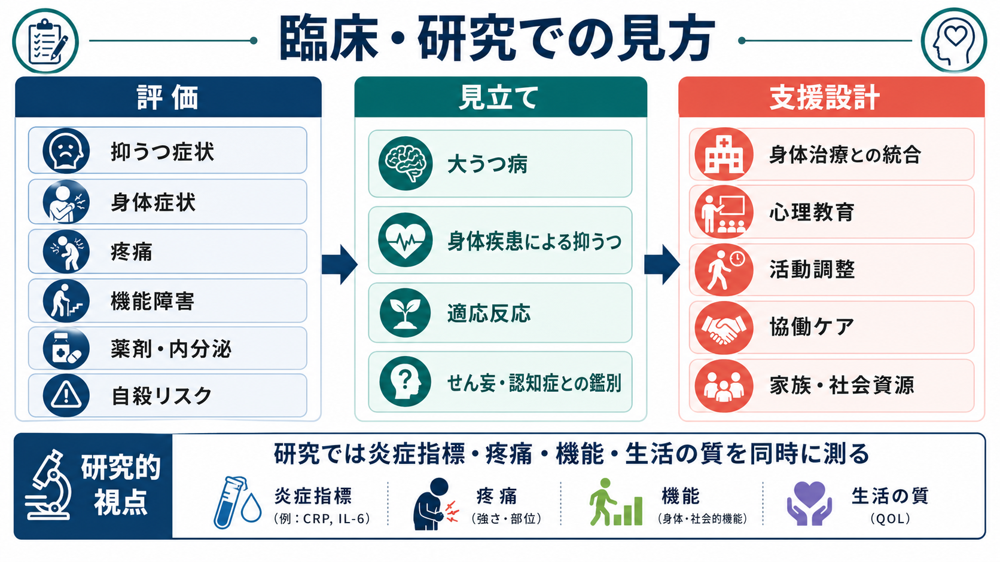

# 身体疾患に伴う抑うつ症状とは何か

## 要点

- 身体疾患に伴う抑うつ症状は、「病気を悲観しているだけ」ではなく、炎症、疼痛、睡眠障害、活動低下、機能喪失、薬剤、社会的孤立が重なって生じることがある。
- 診断では、[[うつ病とは何か|うつ病]]、身体疾患による抑うつ、薬剤性、適応反応、[[せん妄と認知症はどう違うのか|せん妄・認知症]]、双極性障害の鑑別を同時に考える。
- 身体疾患と抑うつは双方向に悪循環を作る。抑うつが強いと、服薬、受診、リハビリ、セルフケア、社会参加が難しくなり、身体疾患の経過にも影響する。

## この記事で答える問い

この記事では、慢性疾患・炎症・疼痛・機能喪失がどのように抑うつ症状につながるのかを整理する。個別の診断や治療指示ではなく、研究・教育目的の概念整理として読む。

## まず結論

身体疾患に伴う抑うつ症状は、身体疾患というストレスへの心理的反応だけでは説明しきれない。慢性炎症や疼痛は脳への免疫・神経・内分泌シグナルを変え、疲労、睡眠障害、食欲変化、集中困難、快感の低下を生じさせることがある[1][2]。さらに、痛みによる活動回避、仕事・役割の喪失、予後への不確実性、孤立が重なると、抑うつ気分や興味低下が持続しやすくなる[3][4]。

重要なのは、「身体疾患があるから抑うつは当然」と片づけないことである。NICE は、慢性身体疾患をもつ成人の抑うつ評価では症状数だけでなく、機能障害、障害の程度、身体疾患の経過、ケアの調整を含めて評価することを強調している[5]。

## 背景

慢性疾患とうつは頻繁に併存する。世界健康調査を用いた Lancet の解析では、うつ病は狭心症、関節炎、喘息、糖尿病などの慢性身体疾患と併存しやすく、うつ病と慢性疾患が重なると健康状態の低下がより大きいことが示された[4]。

この併存は、精神医学だけでなく一般医療にも関わる。たとえば、がん、糖尿病、心血管疾患、脳卒中、自己免疫疾患、慢性疼痛、腎疾患、神経疾患、HIV、内分泌疾患では、抑うつ症状が生活の質、治療アドヒアランス、リハビリ参加、家族負担に影響する。関連する既存ノートとしては、[[がん患者の精神疾患には何があるのか]]、[[HIV関連精神症状とは何か]]、[[内分泌疾患に伴う精神症状とは何か]]、[[器質性精神病とは何か]]がある。

## 基本概念

身体疾患に伴う抑うつ症状には、少なくとも三つの層がある。

第一に、通常の大うつ病エピソードが身体疾患と併存している場合である。この場合、抑うつ気分、興味・喜びの低下、睡眠・食欲変化、疲労、罪責感、希死念慮などを、身体疾患だけに還元せず評価する。

第二に、身体疾患や薬剤の生理学的影響として抑うつ症状が前景化する場合である。DSM 系の分類では「他の医学的疾患による抑うつ障害」という考え方があり、抑うつ気分または興味・喜びの低下が目立ち、病歴・身体診察・検査から医学的疾患の直接的な生理学的結果と考えられる場合に検討される[6]。甲状腺疾患、副腎疾患、脳腫瘍、脳卒中、進行 HIV、パーキンソン病、多発性硬化症、薬剤ではステロイド、インターフェロン、一部の降圧薬などが代表例として挙げられる[6]。

第三に、疾患体験への適応反応、喪失反応、士気低下である。診断名としてのうつ病に達しなくても、慢性疼痛、就労困難、身体像の変化、将来不安、家族役割の変化により、意欲低下や絶望感が強まることがある。この層は「気の持ちよう」ではなく、生活機能と意味づけの問題として扱う必要がある。

## 仕組み

### 炎症と sickness behavior

感染、自己免疫、がん、肥満、組織損傷などでは、末梢の炎症反応がサイトカインを介して脳に伝わる。Dantzer らは、炎症によって発熱、疲労、食欲低下、睡眠変化、社会的引きこもり、痛み、認知低下を含む sickness behavior が生じ、炎症が持続すると抑うつ症状に移行しうると整理した[1]。

炎症とうつの関係は全員に当てはまる単一原因ではない。Miller と Raison は、うつ病の一部サブグループで炎症性サイトカインや免疫シグナルが高まり、神経伝達、神経内分泌、神経回路、行動に影響しうると述べている[2]。つまり、炎症は「うつのすべて」ではないが、身体疾患に伴う抑うつを理解する重要な経路である。

### 疼痛と活動回避

疼痛とうつは双方向に増幅する。疼痛が続くと睡眠が浅くなり、活動量が下がり、楽しみや達成感の機会が減る。抑うつが強いと痛みへの注意が固定され、運動・外出・リハビリを避けやすくなり、筋力低下や孤立が進む。Bair らのレビューは、うつ患者に痛みが、痛み患者にうつが高頻度にみられ、併存すると診断、治療、臨床転帰が悪化しやすいことを示している[3]。

### 機能喪失と役割の変化

慢性疾患は、仕事、家事、育児、移動、睡眠、食事、性生活、趣味、対人関係を変える。機能喪失は単なる「できないことの増加」ではなく、自己効力感、将来見通し、社会的役割、他者からの評価に影響する。とくに、症状が外から見えにくい疾患、波が大きい疾患、予後が不確実な疾患では、周囲に理解されにくいこと自体が抑うつを強める。

## 図解

| 観点 | 見ること | 注意点 |
|---|---|---|
| 抑うつ症状 | 気分、興味、疲労、睡眠、食欲、集中、希死念慮 | 身体疾患の症状と重なる項目が多い |
| 身体疾患 | 疾患活動性、疼痛、炎症、内分泌、神経症状 | 医学的悪化を精神症状だけで説明しない |
| 薬剤・物質 | ステロイド、インターフェロン、鎮静薬、アルコールなど | 開始・増量・中止との時間関係を見る |
| 機能 | ADL、就労、家事、対人、リハビリ参加 | 症状数より生活上の障害が重要なことがある |
| 鑑別 | せん妄、認知症、双極性障害、適応反応 | 意識変動、認知変化、躁症状を確認する |

## 臨床・研究との接続

臨床では、身体治療と精神科的支援を分けすぎないことが重要である。慢性身体疾患をもつ人の抑うつでは、身体疾患の主治医、精神科、心理職、看護、リハビリ、ソーシャルワーク、家族支援が連携するほど、症状と生活機能を同時に扱いやすい。協働ケアの Cochrane レビューでは、うつ・不安に対する協働ケアが通常ケアより抑うつアウトカムを改善することが示されている[7]。

研究では、抑うつ尺度だけでなく、炎症指標、疼痛強度、睡眠、活動量、身体疾患の重症度、機能障害、生活の質を同時に測る必要がある。身体疾患に伴う抑うつ症状は単一の原因で説明できないため、心理社会的要因と生物学的要因を同じモデルに入れる設計が向いている。

## よくある誤解

### 「身体疾患があるなら落ち込んで当然なので評価しなくてよい」

落ち込みが理解可能であっても、評価不要ではない。機能障害、睡眠、食欲、希死念慮、セルフケアの低下があれば、身体疾患の経過にも影響しうる。

### 「検査値が悪いから抑うつはすべて身体由来である」

身体由来の要素があっても、大うつ病、適応反応、薬剤性、疼痛関連、睡眠障害、社会的孤立が重なることが多い。原因を一つに絞るより、寄与因子を分解するほうが実用的である。

### 「抗うつ薬だけを考えればよい」

この記事は治療指示を目的としないが、概念的には、身体疾患の治療、疼痛管理、睡眠、活動調整、心理教育、家族・職場・福祉資源、精神科的評価を組み合わせて考える必要がある。薬物療法の要否は個別の診療で判断される。

## 関連ノート

- [[うつ病とは何か]]
- [[がん患者の精神疾患には何があるのか]]
- [[内分泌疾患に伴う精神症状とは何か]]
- [[HIV関連精神症状とは何か]]
- [[不眠障害とは何か]]
- [[せん妄と認知症はどう違うのか]]
- [[器質性精神病とは何か]]

MOC 更新候補: `content/00_MOC/` 配下の精神医学・うつ病・リエゾン精神医学関連 MOC に追加する。

## 理解チェック

1. 身体疾患に伴う抑うつ症状を「心理的反応」だけで説明すると、どの経路を見落としやすいか。
2. 疼痛とうつが悪循環を作るとき、睡眠・活動・社会参加はどのように関与するか。
3. 身体疾患による抑うつ、大うつ病、適応反応、せん妄を区別するために、どの情報を確認する必要があるか。

## 参考文献

[1] Dantzer, R., O'Connor, J. C., Freund, G. G., Johnson, R. W., & Kelley, K. W. (2008). From inflammation to sickness and depression: when the immune system subjugates the brain. *Nature Reviews Neuroscience, 9*, 46-56. https://doi.org/10.1038/nrn2297

[2] Miller, A. H., & Raison, C. L. (2016). The role of inflammation in depression: from evolutionary imperative to modern treatment target. *Nature Reviews Immunology, 16*, 22-34. https://doi.org/10.1038/nri.2015.5

[3] Bair, M. J., Robinson, R. L., Katon, W., & Kroenke, K. (2003). Depression and pain comorbidity: a literature review. *Archives of Internal Medicine, 163*(20), 2433-2445. https://doi.org/10.1001/archinte.163.20.2433

[4] Moussavi, S., Chatterji, S., Verdes, E., Tandon, A., Patel, V., & Ustun, B. (2007). Depression, chronic diseases, and decrements in health: results from the World Health Surveys. *The Lancet, 370*(9590), 851-858. https://doi.org/10.1016/S0140-6736(07)61415-9

[5] National Institute for Health and Care Excellence. (2009). *Depression in adults with a chronic physical health problem: recognition and management* (CG91). https://www.nice.org.uk/guidance/cg91

[6] Merck Manual Professional Edition. (2026). *Depressive Disorders*. https://www.merckmanuals.com/professional/psychiatric-disorders/mood-disorders/depressive-disorders

[7] Archer, J., Bower, P., Gilbody, S., Lovell, K., Richards, D., Gask, L., Dickens, C., & Coventry, P. (2012). Collaborative care for depression and anxiety problems. *Cochrane Database of Systematic Reviews*, CD006525. https://doi.org/10.1002/14651858.CD006525.pub2

## 未解決問題

- 炎症指標が高い抑うつサブグループを、臨床でどこまで実用的に同定できるか。
- 身体症状と抑うつ症状が重なる疾患で、評価尺度の得点をどのように解釈するか。
- 疼痛、活動量、社会的孤立、炎症を同時に改善する介入をどの順序で組み合わせるのがよいか。
