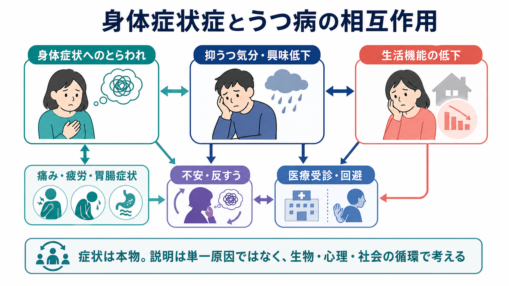
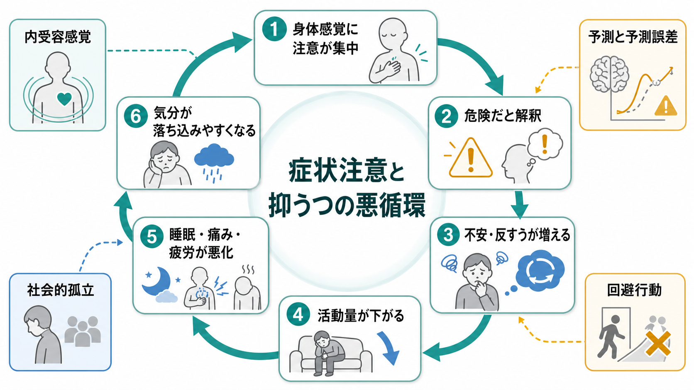
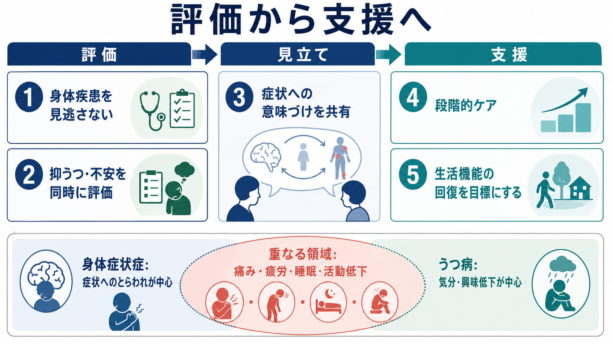

# 身体症状症とうつ病はどう関係するのか

## 要点

- [[身体症状症とは何か]]は、痛み、疲労、胃腸症状などの身体症状そのものだけでなく、その症状に向けられる過剰な不安、注意、時間、行動が生活機能を損なう状態として理解される。症状は「作りもの」ではなく、身体疾患が併存する場合にも診断されうる[1]。
- [[うつ病とは何か]]では、抑うつ気分や興味・喜びの低下に加えて、睡眠、食欲、疲労、集中困難、身体の痛みや消化器症状が前景化することがある[4][5]。
- 両者は「身体症状へのとらわれがうつを生む」「うつが身体症状を強める」という一方向の関係ではなく、注意、脅威解釈、反すう、活動低下、睡眠悪化、痛み・疲労、社会的孤立が循環することで相互に維持されやすい[2][6]。
- 臨床では、身体疾患の見落としを避けながら、抑うつ・不安・自殺リスク・生活機能を同時に評価する。支援は「症状を消す」だけでなく、生活機能の回復、症状との付き合い方、ケアの一貫性を目標にする[1][2][3]。

## この記事で答える問い

1. 身体症状症とうつ病は、どこが重なり、どこが異なるのか。
2. 身体症状へのとらわれと抑うつ気分は、どのような悪循環を作るのか。
3. 臨床・研究では、身体疾患、身体症状症、うつ病の関係をどう評価すればよいのか。
4. よくある誤解を避けるには、どのような説明が役立つのか。

## まず結論

身体症状症とうつ病の関係は、「身体の問題か、心の問題か」という二分法では捉えにくい。身体症状症では症状へのとらわれ、不安、確認・回避、医療受診の反復などが中心になりやすい。一方、うつ病では抑うつ気分、興味・喜びの低下、無価値感、罪悪感、希死念慮などが中核になる。しかし実際の診療では、痛み、疲労、睡眠障害、食欲変化、集中困難、活動低下が両者にまたがって現れる[1][4][5]。

したがって重要なのは、どちらか一方に「還元」することではない。身体疾患を確認し、身体症状症としての症状へのとらわれを見立て、同時に抑うつ・不安・生活機能・安全性を評価する。これにより、不要な検査や「気のせい」という説明を避けながら、本人の苦痛と機能回復に焦点を当てた支援がしやすくなる[1][2][3]。

## 背景

身体症状を訴える人のなかには、明確な器質的疾患が見つからない場合だけでなく、実際の身体疾患があるにもかかわらず、症状への不安や生活上の制約が大きくなっている場合がある。DSM-5 以降の身体症状症では、症状が医学的に説明できるかどうかだけでなく、症状に関連する思考・感情・行動が持続的で過剰か、生活をどれほど妨げているかが重視される[1]。

一方、うつ病は気分の落ち込みだけでなく、身体面の変化として表れることが多い。WHO は、抑うつエピソードでは睡眠や食欲の変化、疲労、集中困難がみられると説明している[4]。NIMH も、持続する身体の痛み、頭痛、けいれん、消化器症状がうつ病の症状に含まれうると整理している[5]。そのため、身体症状を主訴に受診した人の背景に抑うつがあり、逆にうつ病の経過中に身体症状へのとらわれが強まることがある。

慢性身体疾患とうつ病の関係について、NICE は慢性身体疾患がうつ病を引き起こしたり悪化させたりし、うつ病も痛みや苦痛、身体疾患の転帰を悪化させうると述べている[3]。この視点は、身体症状症とうつ病の関係にも応用できる。身体症状、気分、行動、社会的文脈は互いに影響し合う。

## 基本概念

### 身体症状症

身体症状症は、1つ以上の身体症状による苦痛や生活上の支障に加えて、その症状に関する過剰な思考、感情、行動が持続する状態である。診断上は、症状が6か月以上続くこと、症状への不安や時間・エネルギーの投入が大きいことが重視される[1]。

ここで注意すべき点は、身体症状症が「医学的に説明不能な症状だけ」を意味しないことである。たとえば慢性疼痛、胃腸症状、神経症状、身体疾患後の違和感が実在していても、その症状へのとらわれが生活機能を大きく損なっていれば、身体症状症の枠組みが役立つことがある[1][2]。これは [[身体化とは何か]] や [[身体合併症は精神科診療でなぜ重要なのか]] とも接続する。

### うつ病

うつ病は、抑うつ気分または興味・喜びの低下を中心に、睡眠、食欲、疲労、集中、罪悪感、希死念慮、精神運動の変化などがまとまって現れる状態である[4][5]。[[大うつ病性障害とは何か]]では、症状数だけでなく持続期間、機能障害、躁病・軽躁病との鑑別、身体疾患や薬剤の影響を評価する必要がある。

身体症状が目立つうつ病では、本人も周囲も「気分の問題」と気づきにくい。疲労、痛み、胃腸症状、睡眠障害が前景化すると、内科的検査や身体治療だけが繰り返され、抑うつや不安への評価が遅れることがある[5]。

### 重なりと違い

身体症状症とうつ病の重なりは、痛み、疲労、睡眠障害、活動低下、集中困難、医療利用の増加、生活機能低下にある。違いは、身体症状症では「身体症状へのとらわれと反応」が中心であり、うつ病では「気分・興味・自己評価・希死念慮」が中心になる点である[1][4]。

ただし、この違いは臨床上の便宜的な整理であり、実際には両者が同時に存在することがある。一次医療データを用いた研究では、不安、抑うつ、身体症状は共通の内在化・苦痛因子を共有しつつ、抑うつと身体症状にはそれぞれ固有の成分もあることが示されている[6]。つまり「同じもの」でも「完全に別物」でもない。

## 仕組み

### 1. 身体感覚への注意が狭くなる

痛み、動悸、胃部不快、疲労などの身体感覚があると、人は自然に注意を向ける。問題は、注意が身体感覚に固定され、他の情報が入りにくくなることである。[[内受容感覚とは何か]]の観点からは、身体内部の信号をどう検出し、どう意味づけるかが症状体験に影響する。

抑うつ状態では、活動量が下がり、気分転換や報酬経験が減り、身体の違和感を観察する時間が増えやすい。その結果、「また悪化しているのではないか」「この痛みは危険ではないか」という考えが強まり、身体感覚への注意がさらに狭くなる。

### 2. 危険解釈と反すうが症状を増幅する

身体感覚を危険信号として解釈すると、不安、反すう、確認行動が増える。これは [[病気不安症とは何か]] とも重なるが、身体症状症では症状そのものによる苦痛と生活支障がより中心になる。

[[予測処理とは何か]]の言葉で言えば、身体感覚は単なる入力ではなく、「何が起きているはずか」という予測と照合される。危険予測が強いと、曖昧な身体感覚が脅威として知覚されやすくなり、予測誤差を下げるために確認、回避、受診、検索が繰り返される。短期的には安心しても、長期的には「身体は危険だ」という予測が保たれやすい。

### 3. 活動低下が身体症状とうつを同時に悪化させる

抑うつ気分が強いと、外出、運動、対人交流、仕事、家事などが減る。身体症状への不安が強い場合も、「悪化するかもしれない」と考えて活動を避けやすくなる。活動低下は筋力低下、睡眠リズムの乱れ、痛みへの過敏化、社会的孤立を通じて、身体症状とうつの両方を悪化させる。

この悪循環は [[ストレス脆弱性モデルとは何か]] や [[疼痛と精神疾患は脳内でどうつながるのか]] とも関係する。ストレス、炎症、睡眠、疼痛、報酬系、社会的支援は、単独ではなくネットワークとして変化する。

### 4. 医療利用の増加と不信の循環

身体症状が続くと、医療機関を受診し検査を受けることは自然であり、必要な身体疾患を見逃さないためにも重要である。しかし、説明が一貫せず、検査だけが増え、本人の苦痛や不安が共有されないと、「まだ原因が見つかっていない」「理解されていない」という不信が強まることがある[2]。

Henningsen は、身体症状症の管理では、生物・心理・社会モデルに基づき、一次医療、身体科、メンタルヘルス専門職が協力する段階的ケアが適していると述べている[2]。ここでの目標は、身体疾患を軽視することではなく、身体と心理社会的要因を同じ臨床地図に置くことである。

## 図解

上の2枚の図は、身体症状症とうつ病を「重なり」と「循環」から整理している。1枚目は、身体症状へのとらわれ、抑うつ気分・興味低下、生活機能低下が互いに影響する概念地図である。2枚目は、身体感覚への注意、危険解釈、不安・反すう、活動低下、睡眠・痛み・疲労の悪化、気分の落ち込みという循環を示している。

3枚目は、臨床での見立てを「評価から支援へ」として整理したものである。身体疾患の評価、抑うつ・不安の評価、症状への意味づけの共有、段階的ケア、生活機能の回復を同じ流れで扱う。

## 臨床・研究との接続

### 評価では何を見るか

評価では、まず身体疾患、薬剤、物質使用、内分泌疾患、神経疾患、疼痛疾患などを適切に確認する。身体症状症という見立ては、身体疾患を除外しきった後の「残り物」ではない。身体疾患があっても、症状へのとらわれ、回避、反すう、生活機能低下がどれほどあるかを見る[1]。

同時に、抑うつ気分、興味低下、睡眠、食欲、疲労、集中困難、罪悪感、希死念慮を評価する。[[身体疾患による気分障害とは何か]]、[[薬剤性うつ症状とは何か]]、[[内分泌疾患に伴う精神症状とは何か]] との鑑別も重要である。希死念慮や自傷リスクがある場合は、教育的説明より安全確保と専門的評価が優先される。

### 支援では何を目標にするか

身体症状症とうつ病が重なる場合、支援目標は「身体症状を完全に消すこと」だけでは狭すぎる。むしろ、症状があっても生活の範囲を少しずつ広げること、睡眠と活動リズムを整えること、症状への注意の固定をゆるめること、医療者間で説明を一貫させることが重要になる[1][2][3]。

認知行動療法は、身体症状への破局的解釈、確認・回避、活動低下、反すうを扱う介入として検討されている。身体表現性障害や医学的に説明困難な身体症状に対するCBTのメタ解析では、症状や機能に対する有効性が示唆されているが、対象診断や介入内容には幅がある[7]。また、身体疾患をもつ抑うつ患者への心理療法のメタ解析では、抑うつ重症度と生活の質に対する効果が示される一方、身体疾患そのものの指標への効果は限定的で、研究の異質性にも注意が必要である[8]。

薬物療法については、抑うつや不安の併存がある場合に抗うつ薬が検討されることがあるが、身体症状症そのものへの薬物療法を単純に一般化することはできない。副作用への敏感さがある場合もあるため、本人の希望、併存症、過去の反応、身体疾患との相互作用を踏まえた慎重な判断が必要である[1][3]。

### 研究では何が課題か

研究上の課題は、身体症状症、機能性身体症候群、慢性疼痛、慢性身体疾患、うつ病、不安症が異なる分類体系で扱われやすいことである。Simms らの一次医療研究は、抑うつ・不安・身体症状に共通する苦痛因子と、抑うつ・身体症状それぞれの固有因子を分けて考える必要を示した[6]。今後は、診断名だけでなく、内受容、予測、回避行動、睡眠、疼痛、社会的孤立、医療利用などの横断的メカニズムを測る研究が重要になる。

## よくある誤解

### 「身体症状症なら身体の病気ではない」

誤りである。身体症状症は、身体疾患の有無だけで決まる診断ではない。実際の身体疾患があっても、症状に対する思考・感情・行動が過剰で生活機能を大きく損なっていれば、身体症状症の視点が役立つことがある[1]。

### 「うつ病なら身体症状は気分のせい」

これも単純化である。うつ病では疲労、睡眠、食欲、痛み、消化器症状などが現れうるが、身体疾患や薬剤の影響を評価しなくてよいという意味ではない[4][5]。むしろ、身体と気分を同時に評価することが大切である。

### 「検査で異常がなければ安心できるはず」

一時的には安心しても、症状への注意と不安が強い場合、検査の安心効果は長く続かないことがある。過剰な検査は偽陽性や追加処置のリスクも増やすため、必要な身体評価と、症状への意味づけ・対処の支援を組み合わせる必要がある[1][2]。

### 「心理療法か薬物療法のどちらかを選べばよい」

実際には、身体疾患の管理、心理療法、薬物療法、生活リズム、活動調整、家族・職場・学校との調整が組み合わさることが多い。NICE の慢性身体疾患とうつ病のガイドラインも、身体疾患とうつ病の相互作用を踏まえた評価とケアを重視している[3]。

## 関連ノート

- [[身体症状症とは何か]]
- [[うつ病とは何か]]
- [[大うつ病性障害とは何か]]
- [[身体化とは何か]]
- [[病気不安症とは何か]]
- [[身体疾患による気分障害とは何か]]
- [[疼痛と精神疾患は脳内でどうつながるのか]]
- [[疼痛症状は精神科でどう評価するか]]
- [[内受容感覚とは何か]]
- [[予測処理とは何か]]
- [[身体症状症は脳の予測処理で説明できるのか]]
- [[ストレス脆弱性モデルとは何か]]

## 理解チェック

1. 身体症状症が「医学的に説明できない症状だけ」を意味しない理由を説明できるか。
2. うつ病で身体症状が前景化すると、診断や支援がなぜ難しくなるか。
3. 身体症状への注意、危険解釈、反すう、活動低下、睡眠悪化は、どのように循環するか。
4. 身体疾患を見逃さない評価と、過剰な検査を避ける支援は、どのように両立できるか。

## 参考文献

[1] D'Souza, R. S., & Hooten, W. M. (2023). *Somatic Symptom Disorder*. StatPearls. https://www.ncbi.nlm.nih.gov/books/NBK532253/

[2] Henningsen, P. (2018). Management of somatic symptom disorder. *Dialogues in Clinical Neuroscience, 20*(1), 23-31. https://doi.org/10.31887/DCNS.2018.20.1/phenningsen

[3] National Institute for Health and Care Excellence. (2009, reviewed 2024). *Depression in adults with a chronic physical health problem: recognition and management* (CG91). https://www.nice.org.uk/guidance/cg91

[4] World Health Organization. (2025). *Depressive disorder (depression)*. https://www.who.int/news-room/fact-sheets/detail/depression

[5] National Institute of Mental Health. *Depression*. https://www.nimh.nih.gov/health/publications/depression

[6] Simms, L. J., Prisciandaro, J. J., Krueger, R. F., & Goldberg, D. P. (2012). The structure of depression, anxiety and somatic symptoms in primary care. *Psychological Medicine, 42*(1), 15-28. https://doi.org/10.1017/S0033291711000985

[7] Liu, J., Gill, N. S., Teodorczuk, A., Li, Z. J., & Sun, J. (2019). The efficacy of cognitive behavioural therapy in somatoform disorders and medically unexplained physical symptoms: A meta-analysis of randomized controlled trials. *Journal of Affective Disorders, 245*, 98-112. https://doi.org/10.1016/j.jad.2018.10.114

[8] Miguel, C., Karyotaki, E., Ciharova, M., et al. (2023). Psychotherapy for comorbid depression and somatic disorders: A systematic review and meta-analysis. *Psychological Medicine, 53*(6), 2503-2513. https://doi.org/10.1017/S0033291721004414

## 未解決問題

- 身体症状症とうつ病の併存を、症状数ではなく機能障害、医療利用、生活史、内受容、予測処理からどう層別化できるか。
- 慢性疼痛、機能性身体症候群、身体疾患後の症状、身体症状症、うつ病を横断する介入研究をどのように設計するか。
- 「症状は本物である」と伝えながら、過剰な検査や回避を増やさない説明を、診療現場でどう標準化できるか。

## MOC更新候補

- `content/00_MOC/` 配下の精神医学、気分障害、身体症状症、身体性関連のMOCに `[[身体症状症とうつ病はどう関係するのか]]` を追加する候補。
- 並列生成ジョブとの競合を避けるため、このタスクでは MOC ファイル本体は更新しない。
