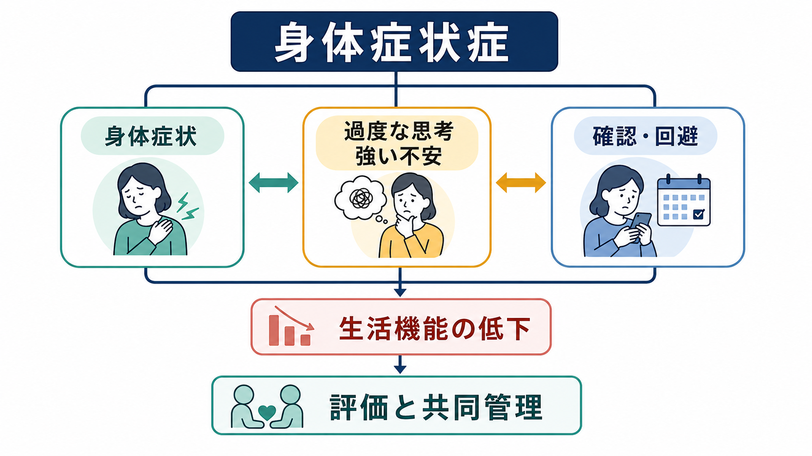
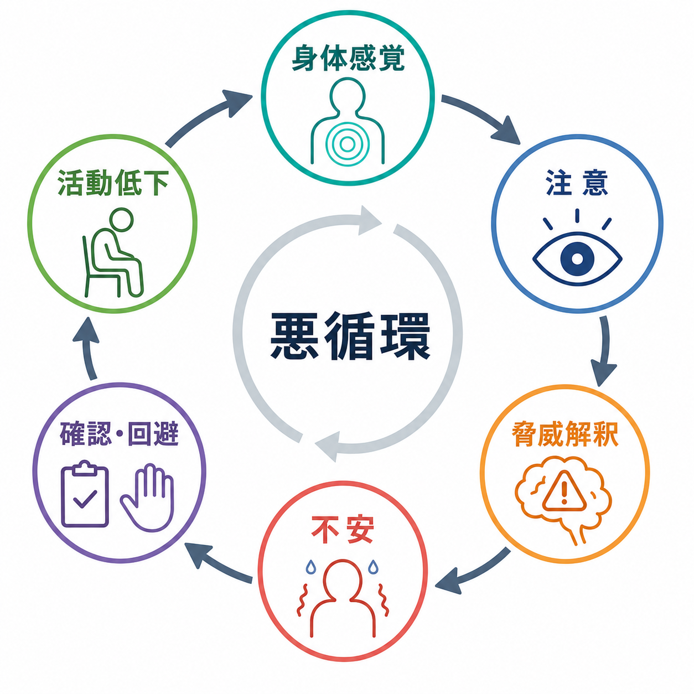
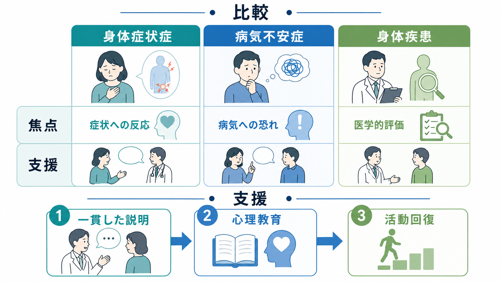

# 身体症状症とは何か

## 要点

- 身体症状症は、痛み、疲労、胃腸症状、動悸、めまいなどの身体症状に加えて、その症状への過度な思考・感情・行動が持続し、苦痛や生活機能低下を生む状態である[1]。
- DSM-5 以降の重要な変更は、「医学的に説明できない症状であること」を必須条件にしない点である。身体疾患があっても、症状への反応が過度で持続的なら評価対象になる[1][3]。
- ICD-11 では近縁概念として bodily distress disorder が置かれ、苦痛を伴う身体症状、症状への過度な注意、持続性、機能障害が重視される[2][4]。
- 症状は「気のせい」でも「作りごと」でもない。問題は、身体感覚、注意、脅威解釈、不安、確認・回避行動が悪循環を作り、苦痛を増幅しうる点にある[5][6]。
- 支援では、必要な医学的評価を行いながら、過剰検査の反復を避け、説明の一貫性、共同管理、心理教育、活動回復、必要に応じた心理療法を組み合わせる[3][8]。

## この記事で答える問い

1. 身体症状症は、身体疾患や「原因不明の症状」とどう違うのか。
2. なぜ身体症状への思考・感情・行動が苦痛を強めるのか。
3. 臨床では、見逃しを避けながら過剰な検査や安心確認の反復をどう扱うのか。
4. 研究では、身体症状症をどのような認知・行動・医療利用の問題として扱うのか。

## まず結論

身体症状症は、「身体症状があるかないか」だけで決まる診断ではない。中心にあるのは、身体症状に対して、重大な病気ではないかと考え続ける、健康や症状への不安が高い、確認・受診・検索・回避に多くの時間とエネルギーを使う、といった反応が生活を狭めていくことである[1]。

したがって、身体症状症を理解するには、身体医学か心理学かという二分法をいったん置く必要がある。身体症状は実際に苦痛として経験される。そのうえで、注意、予測、情動、行動、医療者との関係、生活文脈が症状経験をどう増幅し、またどう緩めうるかを見る。これは [[精神科診断は何のためにあるのか]] や [[精神科診断における除外診断とは何か]] と接続するテーマである。

## 背景

かつての「身体表現性障害」や「医学的に説明困難な身体症状」は、しばしば「身体的原因が見つからないこと」によって定義されていた。しかしこの定義には問題がある。医学的説明の有無は検査技術、専門領域、時間経過によって変わりうるし、「説明できない」という否定形の定義は患者の経験を軽視しやすい[3][4]。

DSM-5 以降の身体症状症は、症状の医学的説明不能性よりも、症状への過度な思考・感情・行動を重視する方向へ移った[1][3]。ICD-11 の bodily distress disorder も、身体症状への過度な注意、持続性、機能障害を中心に置く[2][4]。この変化は、身体疾患がある人にも心理行動面の苦痛が重なりうること、また原因が未確定でも症状への反応を支援できることを示している。

プライマリケアでは、身体症状は受診理由として非常に多く、うつや不安が身体症状として提示されることもある[5]。このため身体症状症は、精神科だけの問題ではなく、内科、救急、疼痛診療、リハビリテーション、心理支援が交差する領域である。

## 基本概念

### 身体症状症

DSM-5-TR の身体症状症では、苦痛を伴う、または生活を大きく妨げる一つ以上の身体症状があり、それに関連して過度な思考・感情・行動がみられ、症状状態が持続することが重視される[1]。過度な反応には、症状の重大性についての持続的で不釣り合いな考え、健康や症状への高い不安、症状や健康懸念に費やす過剰な時間とエネルギーが含まれる[1][3]。

重要なのは、身体疾患の有無だけで診断しないことである。たとえば慢性疼痛、消化器疾患、自己免疫疾患、心疾患の既往がある人でも、症状への注意と確認が生活のほぼ中心になり、活動が強く制限されることがある。逆に、検査で明確な異常が見つからない身体症状があっても、本人が必要な範囲で対処し生活機能を保っているなら、身体症状症と呼ぶ必要はない。

### ICD-11 の bodily distress disorder

ICD-11 の bodily distress disorder は、苦痛を伴う身体症状と、それに向けられた過度な注意を中心に定義される。身体症状は多発することも、痛みや疲労のような単一症状に集中することもある。症状は数か月以上持続し、本人の生活、対人関係、学業・職業機能に影響する[2][4]。

DSM と ICD は完全に同じではないが、どちらも「医学的に説明できないから精神疾患」という古い発想から離れ、症状への反応、苦痛、機能障害を評価する方向へ移っている。分類体系の違いは [[DSMとICDは何が違うのか]] と合わせて読むと整理しやすい。

### 病気不安症・機能性身体症状との違い

病気不安症では、実際の身体症状よりも「重大な病気にかかっているのではないか」という恐れが前景に出る。身体症状症では、身体症状そのものと、それに対する苦痛・注意・行動が前景になりやすい。機能性身体症状は、機能の変化として理解される症状群を指す広い臨床用語として使われることがある。身体症状症は、その人の症状経験と反応がどの程度持続し、生活を制限しているかに焦点を当てる。

## 仕組み

### 注意と脅威解釈のループ

身体症状症の維持には、身体感覚への注意、脅威としての解釈、不安・覚醒、確認や回避が関わる。たとえば軽い胸部不快感が「重大な病気のサインかもしれない」と解釈されると、注意は胸部感覚に集中し、交感神経活動や筋緊張が高まり、さらに不快感が強く感じられる。そこで検索、脈拍確認、救急受診、活動回避を行うと、短期的には安心しても、長期的には「確認しなければ危険」という学習が強まる[6]。

### 身体感覚の増幅

身体感覚の増幅とは、通常なら背景に退く内的感覚が、注意や不安によって目立ち、強く、危険なものとして経験されやすくなる現象である。古典的研究では、身体感覚への増幅傾向や健康不安が、身体症状の訴えや医療利用と関連することが示されてきた[6]。これは「感じていないのに訴えている」という意味ではない。むしろ、感じている身体感覚が、注意・予測・情動によってどのような意味を帯びるかが問題になる。

### 医療との相互作用

身体症状症では、医療者との関係も維持要因にも保護要因にもなる。説明が毎回変わる、検査だけが反復される、心理的要因を「原因は心」と単純化して伝える、といった対応は、不信感や確認行動を強めることがある。一方で、身体症状を否定せず、危険な疾患を必要な範囲で評価し、症状のしくみを一貫して説明し、生活機能の回復を共同目標にすることは、悪循環を緩める[3][8]。

## 図解

3枚目の図は、身体症状症、病気不安症、機能性身体症状、身体疾患を比較しながら、臨床での共同管理の流れを示している。鑑別では「身体疾患がないか」だけでなく、「焦点は症状そのものか、病気への恐れか」「機能障害はどの程度か」「確認・回避・医療利用が生活をどう変えているか」を見る。

## 臨床・研究との接続

### 評価で見ること

評価では、症状の種類、発症時期、経過、誘因、悪化・軽快要因、身体疾患や薬剤・物質の影響を確認する。同時に、症状について何を恐れているか、どれくらい確認しているか、何を避けているか、睡眠・仕事・学業・家事・対人関係にどの程度影響しているかを尋ねる。これは [[5Pモデルとは何か]] の、素因、誘因、維持因子、保護因子、問題の枠組みでも整理できる。

医療安全上は、身体疾患の見逃しを避ける必要がある。ただし、検査を増やし続ければ安心が増えるとは限らない。必要な検査の範囲、再評価の条件、緊急受診すべきサインを共有し、同じ説明方針で継続的に診ることが重要になる[3][5]。

### 支援の方向

支援の入口は、症状を否定しない説明である。「異常なしだから大丈夫」だけではなく、「症状は本物であり、身体感覚、注意、不安、行動、生活リズムが相互に影響している」と説明する。これは [[心理教育とは何か]] と深く関係する。治療関係では、患者を説得するよりも、症状と生活機能を一緒に観察し、回復可能な活動を少しずつ増やすことが重要である。これは [[治療関係とは何か]] の実践課題でもある。

非薬物的介入のレビューでは、心理療法、とくに認知行動療法系の介入が身体症状の重症度に小から中等度の改善を示す可能性があるが、効果量や研究の質にはばらつきがある[7][8]。したがって、身体症状症への支援は「精神療法をすればよい」という単純な話ではなく、医学的管理、説明、活動調整、併存する [[うつ病とは何か|うつ病]] や [[全般不安症とは何か|不安症]] への対応を含む段階的なケアとして設計する必要がある。

### 研究での焦点

研究では、身体症状症を単一の原因で説明するよりも、身体感覚への注意、破局的解釈、健康不安、回避行動、医療利用、医療者とのコミュニケーション、併存する気分・不安症状の組み合わせとして扱う方向にある[3][6]。今後は、診断カテゴリだけでなく、症状ネットワーク、日常生活データ、内受容、疼痛、疲労、活動量、睡眠を組み合わせた研究が重要になる。

## よくある誤解

### 誤解1: 身体症状症は「仮病」である

身体症状症は、症状を意図的に作る状態ではない。身体症状は本人にとって実際の苦痛であり、生活を妨げる。問題は、症状の存在を疑うことではなく、症状をめぐる注意、不安、確認、回避が苦痛を増やしていないかを見ることである[1][3]。

### 誤解2: 検査で異常がなければ精神科だけの問題である

検査で重大な異常が見つからない場合でも、症状の経験は現実である。また、後から身体疾患が明らかになることもある。身体症状症の評価では、身体医学的な安全確認と、過度な安心確認を増やさない継続的説明を両立させる必要がある[3][5]。

### 誤解3: 身体疾患がある人には身体症状症を考えない

身体疾患がある人にも、症状への過度な注意や不安、確認・回避の悪循環が重なることがある。診断上の焦点は、身体疾患の有無ではなく、その症状への反応が本人の苦痛と生活機能低下をどの程度増やしているかである[1][2]。

### 誤解4: 安心させれば解決する

安心は短期的には役立つが、安心確認が反復されると、かえって不安を維持することがある。支援では、危険なサインを共有したうえで、身体感覚への注意を広げ、避けてきた活動へ段階的に戻り、生活機能を回復する方向に進む[3][8]。

## 関連ノート

- [[不安とは何か]]
- [[全般不安症とは何か]]
- [[パニック症とは何か]]
- [[うつ病とは何か]]
- [[精神科診断における除外診断とは何か]]
- [[DSMとICDは何が違うのか]]
- [[5Pモデルとは何か]]
- [[心理教育とは何か]]
- [[治療関係とは何か]]
- [[プラセボ効果とは何か]]

今後の作成候補:

- 病気不安症とは何か
- 機能性身体症状とは何か
- 身体症状症の認知行動療法とは何か
- 内受容と身体症状症はどう関係するのか
- 慢性疼痛とうつ・不安はどう関係するのか

MOC更新候補:

- 精神医学・疾患/症候群関連 MOC に `[[身体症状症とは何か]]` を追加する。
- 心身医学、身体症状、精神科診断、認知行動療法関連の MOC にも候補として置く。
- 並列記事生成ジョブとの競合を避けるため、このタスクでは MOC 本体は更新しない。

## 理解チェック

1. 身体症状症が「医学的に説明できない症状」だけで定義されない理由を説明できるか。
2. 身体症状、注意、脅威解釈、不安、確認・回避がどのように悪循環を作るか説明できるか。
3. 病気不安症と身体症状症の焦点の違いを説明できるか。
4. 臨床で、見逃しを避ける評価と過剰な安心確認を増やさない説明をどう両立するか説明できるか。
5. 認知行動療法や心理教育が、症状を「気のせい」と扱うものではない理由を説明できるか。

## 未解決問題

- 身体症状症の中の異質性を、疼痛、疲労、消化器症状、健康不安、医療利用パターンごとにどこまで層別化できるか。
- 身体疾患を併存する人で、どの程度の注意・不安・行動変化を「過度」と判断するか。
- デジタルヘルス、ウェアラブル、日記法を用いて、身体感覚への注意や活動回避の変化をどこまで測定できるか。
- 医療者の説明様式や診療体制が、身体症状症の経過にどのように影響するか。

## 参考文献

[1] American Psychiatric Association. (2022). *Diagnostic and Statistical Manual of Mental Disorders, Fifth Edition, Text Revision (DSM-5-TR)*. American Psychiatric Association Publishing. https://doi.org/10.1176/appi.books.9780890425787

[2] World Health Organization. (2024). *Clinical descriptions and diagnostic requirements for ICD-11 mental, behavioural and neurodevelopmental disorders (CDDR)*. World Health Organization. https://www.who.int/publications/i/item/9789240077263

[3] Henningsen, P. (2018). Management of somatic symptom disorder. *Dialogues in Clinical Neuroscience, 20*(1), 23-31. https://doi.org/10.31887/DCNS.2018.20.1/phenningsen

[4] Gureje, O., & Reed, G. M. (2016). Bodily distress disorder in ICD-11: Problems and prospects. *World Psychiatry, 15*(3), 291-292. https://doi.org/10.1002/wps.20353

[5] Kroenke, K. (2003). Patients presenting with somatic complaints: Epidemiology, psychiatric co-morbidity and management. *International Journal of Methods in Psychiatric Research, 12*(1), 34-43. https://doi.org/10.1002/mpr.140

[6] Rief, W., Hiller, W., & Margraf, J. (1998). Cognitive aspects of hypochondriasis and the somatization syndrome. *Journal of Abnormal Psychology, 107*(4), 587-595. https://doi.org/10.1037/0021-843X.107.4.587

[7] Liu, J., Gill, N. S., Teodorczuk, A., Li, Z.-J., & Sun, J. (2019). The efficacy of cognitive behavioural therapy in somatoform disorders and medically unexplained physical symptoms: A meta-analysis of randomized controlled trials. *Journal of Affective Disorders, 245*, 98-112. https://doi.org/10.1016/j.jad.2018.10.114

[8] van Dessel, N., den Boeft, M., van der Wouden, J. C., Kleinstäuber, M., Leone, S. S., Terluin, B., Numans, M. E., van der Horst, H. E., & van Marwijk, H. (2014). Non-pharmacological interventions for somatoform disorders and medically unexplained physical symptoms (MUPS) in adults. *Cochrane Database of Systematic Reviews*, CD011142. https://doi.org/10.1002/14651858.CD011142.pub2
