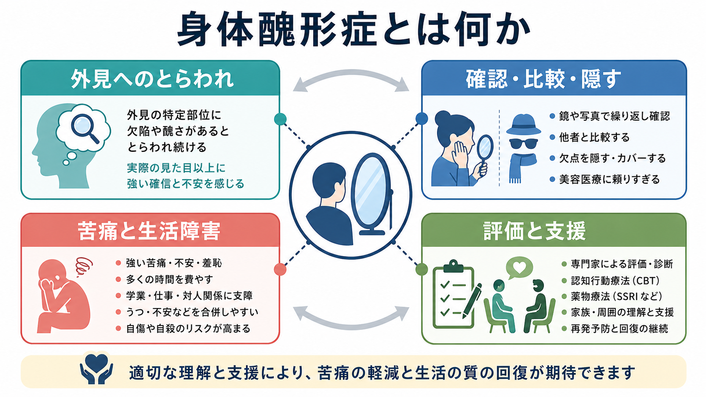
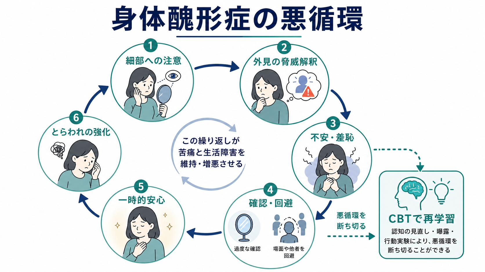
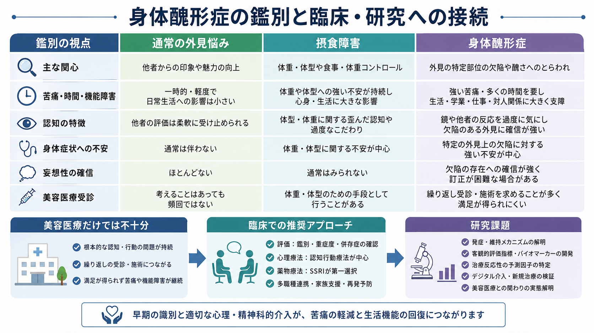

# 身体醜形症とは何か

## 要点

- 身体醜形症は、他者には見えない、またはごく軽微に見える外見上の欠点への強いとらわれが、著しい苦痛や生活機能の障害を生む精神疾患である[1][2]。
- とらわれだけでなく、鏡での確認、他者との比較、カモフラージュ、安心確認、回避、美容医療への反復受診などの反復行動・精神的行為が重要である[2][3]。
- DSM-5-TR でも ICD-11 でも、身体醜形症は強迫症関連の障害として整理される。したがって、[[強迫観念とは何か|強迫観念]]や[[強迫行為とは何か|強迫行為]]との連続性を意識すると理解しやすい[2][3]。
- 認知行動療法と SSRI は主要なエビデンスに基づく治療選択肢である。ただし、この記事は教育・研究目的の整理であり、個別診断や治療指示ではない[1][4][5]。
- 研究上は、外見刺激への注意、細部優位の視覚処理、脅威解釈、羞恥、回避・確認行動、併存症、自殺リスクなどが焦点になる。ただし、神経機構はまだ確定的に語れる段階ではない[1][6]。

## この記事で答える問い

1. 身体醜形症は、普通の外見の悩みと何が違うのか。
2. なぜ確認、比較、隠す行動、美容医療への受診が問題を維持しうるのか。
3. 摂食障害、強迫症、社交不安、妄想性障害、美容医療上の悩みとはどう区別して考えるのか。
4. 臨床・研究では、どのような評価・介入・未解決問題があるのか。

## まず結論

身体醜形症は「外見を気にしすぎる性格」ではない。中心にあるのは、外見上の欠点が重大であるという強い確信や不安が、長時間のとらわれ、反復行動、回避、対人・学業・仕事の支障を生むことである[1][2]。たとえば、肌、髪、鼻、体型、左右差、筋肉量などへの悩みが、鏡の前で何時間も確認する、写真を消し続ける、人に会えない、美容処置を繰り返しても満足できない、といった生活上の問題につながる。

この疾患を理解するときは、本人の見た目を外から評価して「気にしすぎかどうか」を決めるのではなく、本人の苦痛、時間消費、反復行動、回避、機能障害、安全リスクを評価する。とくに自傷や自殺念慮のリスクが高いことが報告されているため、[[希死念慮とは何か]]と同じく安全評価を切り離してはいけない[1]。

## 背景

外見への悩みは多くの人にある。思春期、対人評価、SNS、写真加工、美容医療の普及は、外見に注意が向きやすい環境を作る。しかし、身体醜形症では、悩みの強度と生活への侵入性が通常の外見不満を超える。Nature Reviews Disease Primers の2024年レビューは、身体醜形症を成人の約2%にみられるが過小診断・過小治療されやすい疾患として整理している[1]。

診断分類上も、この状態は単なる身体症状への不安や美容上の希望とは異なる。DSM-5-TR では強迫症および関連症群に含まれ、ICD-11 でも身体醜形症は 6B21 として、洞察の程度を含めて分類される[2][3]。診断分類そのものについては [[DSMとICDは何が違うのか]] も参照するとよい。

## 基本概念

### 外見へのとらわれ

身体醜形症のとらわれは、実際には目立たない、または他者にはごく軽微に見える外見上の欠点を、重大な欠陥として受け取る点にある[2]。問題となる部位は一つとは限らず、顔、皮膚、髪、鼻、目、体型、筋肉量、左右差、においなど、本人にとって意味をもつ部位に広がりうる。

ここで重要なのは、診断は「本当に欠点があるか」を第三者が審判する作業ではないことである。臨床的に見るべきなのは、そのとらわれがどれほど長く続き、どれほど制御しにくく、生活をどれほど狭めているかである。

### 反復行動と精神的行為

身体醜形症では、外見へのとらわれに応じて、確認、比較、隠す、安心確認、過度な手入れ、写真の撮り直し、回避、美容医療への反復相談などが起こりやすい[2]。これらは短期的には不安を下げるため、[[回避行動とは何か|回避行動]]や安全確保行動として強化されやすい。

ただし、安心は長続きしにくい。確認すればするほど細部が気になり、比較すればするほど欠点の探索が鋭くなり、隠せば隠すほど「隠さないと危険だ」という信念が残りやすい。この構造は、強迫症状や不安症でよく問題になる「短期的安心と長期的維持」の関係に近い。

### 洞察の幅

身体醜形症では、本人が「気にしすぎかもしれない」と理解している場合もあれば、「欠点は明らかに存在する」と強く確信している場合もある。DSM-5-TR や ICD-11 では、洞察の程度を区別して記述する[2][3]。洞察が乏しい場合でも、身体醜形症の枠組みで評価されうる点が重要である。

## 仕組み

身体醜形症の仕組みは、単一の脳部位や性格特性で説明できない。現在の理解では、外見刺激への注意、細部優位の処理、脅威解釈、羞恥、回避・確認行動、社会的経験、遺伝的・発達的要因が組み合わさる多層的なモデルが妥当である[1][6]。

### 1. 細部への注意

視覚処理研究では、身体醜形症で顔や身体の全体的なまとまりよりも、局所的な細部へ注意が偏りやすい可能性が議論されている[6]。たとえば、顔全体の印象よりも、肌の一点、鼻の角度、髪の乱れなどに注意が固定されると、本人の主観的な欠陥感は強まりやすい。

ただし、これは「身体醜形症の人は視覚が壊れている」という意味ではない。2024年のレビューも、視覚・情動処理に関わる脳領域の機能・構造差を示唆する研究はあるが、病態生理を確定するには不十分だと慎重に述べている[1]。研究上の仮説と個別診断を混同しないことが大切である。

### 2. 脅威解釈と羞恥

細部に注意が向くと、「この欠点のせいで人に嫌われる」「笑われる」「価値がないと思われる」といった脅威解釈が生じやすい。ここには[[不安とは何か|不安]]だけでなく、羞恥、自己嫌悪、抑うつ、対人恐怖が絡む。身体醜形症は[[うつ病とは何か|うつ病]]、社交不安、強迫症、摂食障害などと併存することがあり、苦痛は外見だけに閉じない[1][2]。

### 3. 確認・回避による維持

確認や回避は、短期的には不安を下げる。しかし、長期的には「確認しないと危険」「隠さないと人前に出られない」という学習を残す。これは行動分析でいう負の強化に近く、不快感が一時的に下がることで確認・回避が繰り返されやすくなる。

この悪循環を断つには、外見の正しさを説得するだけでは不十分である。治療研究では、認知の見直し、曝露、反応妨害、行動実験、注意の柔軟化、価値に沿った活動再開などを含む CBT が検討されてきた[4][5]。

## 図解

図1は、身体醜形症の全体像を「外見へのとらわれ」「確認・比較・隠す」「苦痛と生活障害」「評価と支援」に分けて示した。図2は、細部への注意から確認・回避を経て、とらわれが強まる維持循環を示している。図3は、通常の外見悩み、摂食障害、身体醜形症を鑑別し、美容医療だけでは十分でない場合があることを整理する。

## 臨床・研究との接続

### 評価

評価では、外見上の悩みの内容だけでなく、時間、苦痛、生活障害、反復行動、回避、洞察、併存症、安全リスクを確認する[2][4]。本人が皮膚科、美容外科、歯科、形成外科、耳鼻科などを先に受診することもあるため、精神科以外の医療現場での気づきも重要になる。

評価の要点は、本人の訴えを否定せずに、次の問いを丁寧に確認することである。

| 観点 | 確認すること |
|---|---|
| とらわれ | 何を欠点だと感じ、1日にどのくらい考えるか |
| 行動 | 鏡、写真、比較、隠す、安心確認、受診、回避がどの程度あるか |
| 機能 | 学校、仕事、対人関係、外出、睡眠、集中にどの程度影響するか |
| 安全 | 自傷、[[希死念慮とは何か|希死念慮]]、衝動的な美容処置のリスクがあるか |
| 鑑別 | 摂食障害、強迫症、社交不安、妄想性障害、身体疾患でよりよく説明されるか |

### 治療研究

NICE ガイドラインは、強迫症と身体醜形症の認識、評価、治療を扱い、段階的ケア、心理療法、薬物療法、家族支援を含む推奨を示している[4]。CBT については、身体醜形症を対象にした RCT のシステマティックレビューとメタ分析で、対照条件に比べた有効性が示されている[5]。また、インターネットを用いた治療者ガイド付き CBT の RCT も報告され、専門治療へのアクセス改善という研究課題につながっている[7]。

薬物療法では SSRI が主要な選択肢として扱われるが[1][4]、これは「セロトニン不足だけが原因」という意味ではない。SSRI の理解には [[セロトニンは気分だけに関わるのか]] のように、薬理作用、回路、学習、環境要因を分けて考える視点が役立つ。

### 美容医療との関係

身体醜形症では、美容医療や皮膚科治療を受けても満足が持続せず、別の部位へのとらわれや追加処置につながることがある[1][2]。もちろん、外見上の問題や身体疾患が実際に存在する場合もある。したがって「美容医療は常に悪い」と単純化するのではなく、苦痛の中心が身体的形態そのものなのか、外見に関する強迫的な確信と反復行動なのかを分けて評価する必要がある。

## よくある誤解

### 誤解1: ナルシシズムやわがままである

身体醜形症は、外見への過剰な自己愛ではなく、強い苦痛、羞恥、回避、機能障害を伴う疾患である[1][2]。本人は「もっと目立ちたい」というより、「欠点を見られたくない」「普通に見られたい」と苦しむことが多い。

### 誤解2: 見た目に問題がなければ説明して終わりでよい

「気にしなくてよい」と説得しても、短期的な安心にしかならないことがある。身体醜形症では、確信、注意、確認、回避が循環しているため、安心確認そのものが問題を維持する場合がある。

### 誤解3: 摂食障害と同じである

摂食障害では、体重、体型、食事制限、体重コントロールが中心になりやすい。一方、身体醜形症では、体重以外の特定部位への欠陥感や醜さへのとらわれが中心になることが多い[2]。ただし両者は重なりうるため、[[摂食障害は脳の報酬系や身体感覚とどう関わるのか]] のような身体像・報酬・感情調整の視点も参考になる。

### 誤解4: 美容処置を受ければ解決する

身体醜形症の苦痛は、外見上の形態だけでなく、注意、解釈、確認行動、対人不安、自己評価と結びついている。そのため、美容処置だけでは満足が持続しない場合がある[1][2]。必要に応じて、精神医学的評価、心理療法、薬物療法、家族・学校・職場支援を組み合わせる。

## 関連ノート

既存ノート:

- [[DSMとICDは何が違うのか]]
- [[強迫観念とは何か]]
- [[強迫行為とは何か]]
- [[回避行動とは何か]]
- [[不安とは何か]]
- [[うつ病とは何か]]
- [[希死念慮とは何か]]
- [[セロトニンは気分だけに関わるのか]]
- [[摂食障害は脳の報酬系や身体感覚とどう関わるのか]]

今後の作成候補:

- 認知行動療法とは何か
- 強迫症とは何か
- 社交不安症とは何か
- 摂食障害と身体像
- 美容医療とメンタルヘルス
- 身体醜形症の評価尺度

MOC更新候補:

- `content/00_MOC/MOC｜精神医学.md`
- `content/00_MOC/MOC｜症候学.md`
- `content/00_MOC/MOC｜臨床実践・治療.md`
- `content/00_MOC/MOC｜神経科学と精神疾患.md`

## 理解チェック

1. 身体醜形症と通常の外見悩みを分けるとき、どのような観点を見るべきか。
2. 鏡での確認や他者との比較が、短期的には安心を生んでも長期的には問題を維持しうる理由は何か。
3. 身体醜形症を摂食障害や社交不安症と鑑別するとき、中心的な関心の違いは何か。
4. 視覚処理研究の知見を、個別診断として短絡的に使ってはいけない理由は何か。
5. 美容医療だけでなく心理・精神医学的評価が必要になるのはどのような場合か。

## 参考文献

[1] Rück, C., Mataix-Cols, D., Feusner, J. D., Shavitt, R. G., Veale, D., Krebs, G., & Fernández de la Cruz, L. (2024). Body dysmorphic disorder. *Nature Reviews Disease Primers, 10*, 92. https://doi.org/10.1038/s41572-024-00577-z

[2] Nicewicz, H. R., Torrico, T. J., & Boutrouille, J. F. (2024). Body Dysmorphic Disorder. *StatPearls*. https://www.ncbi.nlm.nih.gov/books/NBK555901/

[3] World Health Organization. (2025). ICD-11 for Mortality and Morbidity Statistics: Body dysmorphic disorder, 6B21. https://icd.who.int/browse/2025-01/mms/en

[4] National Institute for Health and Care Excellence. (2005, last reviewed 2024). *Obsessive-compulsive disorder and body dysmorphic disorder: treatment* (CG31). https://www.nice.org.uk/guidance/cg31

[5] Harrison, A., Fernández de la Cruz, L., Enander, J., Radua, J., & Mataix-Cols, D. (2016). Cognitive-behavioral therapy for body dysmorphic disorder: A systematic review and meta-analysis of randomized controlled trials. *Clinical Psychology Review, 48*, 43-51. https://doi.org/10.1016/j.cpr.2016.05.007

[6] Diaz-Fong, J. P., & Feusner, J. D. (2025). Visual Perceptual Processing Abnormalities in Body Dysmorphic Disorder. *Current Topics in Behavioral Neurosciences, 74*, 105-127. https://doi.org/10.1007/7854_2024_472

[7] Enander, J., Andersson, E., Mataix-Cols, D., Lichtenstein, L., Alström, K., Andersson, G., Ljótsson, B., & Rück, C. (2016). Therapist guided internet based cognitive behavioural therapy for body dysmorphic disorder: Single blind randomised controlled trial. *BMJ, 352*, i241. https://doi.org/10.1136/bmj.i241

## 未解決問題

- 身体醜形症における細部優位の視覚処理、情動処理、自己評価、反復行動の因果関係は、まだ十分に確定していない。
- 早期発見、学校・家庭での支援、美容医療との連携を、本人の羞恥や受診抵抗を高めずに実装する方法が課題である。
- CBT や SSRI への反応を予測する指標、再発予防、デジタル介入、若年層への適応について、さらに研究が必要である。
