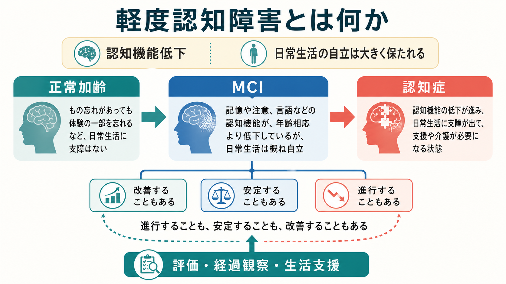
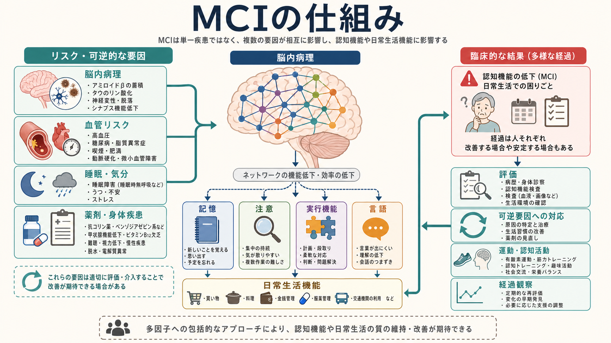

# 軽度認知障害とは何か

## 要点

- 軽度認知障害（mild cognitive impairment: MCI）は、本人・家族・検査で確認される認知機能低下がある一方、日常生活の自立は大きく保たれる状態を指す。
- MCIは「認知症の一歩手前」とだけ理解すると狭すぎる。進行する例、長く安定する例、正常域に戻る例がある。
- 原因はアルツハイマー病理、血管性変化、レビー小体病理、うつ・睡眠・薬剤・身体疾患など多様で、評価では可逆的・介入可能な要因も確認する。
- 介入の中心は、原因評価、経過観察、生活機能と安全の確認、運動・認知活動・血管リスク管理である。薬だけで解決する状態とは考えない。

## この記事で答える問い

- MCIは正常加齢や認知症と何が違うのか。
- なぜ「認知機能低下はあるが、日常生活は概ね自立」と表現されるのか。
- どのような仕組みや原因が関わるのか。
- 臨床・研究では何を評価し、何を誤解しやすいのか。

## まず結論

軽度認知障害とは、記憶、注意、実行機能、言語、視空間認知などのどこかに、年齢や教育歴から予想される範囲を超えた低下がみられるが、買い物、服薬、金銭管理、交通機関の利用、家事などの日常生活が全面的には崩れていない状態である。Petersenらが提案した古典的概念では、特に記憶障害を中心とする「認知症ではないが正常でもない」群として整理された[1]。

現在は、MCIを単一疾患ではなく、複数の原因が集まる臨床状態として扱う。アルツハイマー病によるMCIもあれば、血管リスク、睡眠障害、うつ、不安、薬剤、甲状腺機能低下、ビタミンB12欠乏、せん妄後の回復過程などが関わることもある[2][3][4]。したがって、MCIという言葉は「原因名」ではなく、「現在の認知機能と生活機能の段階」を示すラベルである。

## 背景

MCIという概念が重要になった理由は、認知症が明らかになる前の段階で、認知機能低下を捉え、経過を見て、介入可能な要因を探す必要があるからである。Petersenらの1999年の研究は、MCI群が健常高齢者と軽度アルツハイマー病の中間的な認知プロフィールを示し、縦断的に認知症へ移行するリスクが高いことを示した[1]。

ただし、MCIは必ず認知症へ進むわけではない。AANのガイドラインは、MCIの有病率・予後・治療エビデンスを整理し、妥当性のある評価、機能障害の確認、修正可能なリスク要因の評価、定期的な経過観察を推奨している[3]。また、メタ解析ではMCIから正常認知へ戻る例も一定割合でみられ、MCIを「不可逆な進行の宣告」とみなすべきではない[7]。

## 基本概念

MCIを理解する軸は、認知機能と生活機能の2つである。

| 観点 | 正常加齢 | 軽度認知障害（MCI） | 認知症 |
|---|---|---|---|
| 認知機能 | 年齢相応の物忘れや処理速度低下 | 年齢・教育歴からみて明らかな低下 | 複数領域の低下が目立つことが多い |
| 日常生活 | 自立 | 概ね自立。ただし複雑な活動で効率低下や支援が出ることがある | 自立が損なわれ、継続的な支援が必要になる |
| 評価の焦点 | 生活上の困りごとの有無 | 本人・家族の訴え、客観的検査、生活機能 | 認知症の原因診断、生活支援、安全確保 |

ICD-11の「軽度神経認知障害」は、1つ以上の認知領域で以前より低下があり、標準化された評価や臨床評価で客観的に示されるが、日常生活機能を有意に妨げるほどではない状態として記述される[5]。これはMCIとかなり重なるが、分類体系上の用語であり、研究・臨床で使われるMCIと完全に同義ではない。

臨床では、[[認知機能低下はどのように評価するのか]]、[[認知機能検査は何を測っているのか]]、[[MoCAとは何か]]、[[ミニ精神状態検査MMSEとは何か]]のような評価法を、生活歴・教育歴・身体疾患・薬剤・家族情報と組み合わせて読む必要がある。検査点数だけでMCIと断定するのではなく、「本人の以前の状態からどのように変わったか」を見る。

## 仕組み

MCIの仕組みは、脳の単一部位が壊れるというより、複数の要因が神経ネットワークの効率を下げる過程として理解しやすい。

アルツハイマー病によるMCIでは、アミロイドβ、タウ、神経変性などの病理が、記憶や実行機能を支えるネットワークに影響する。NIA-AAの2011年基準は、MCIの中でもアルツハイマー病に起因する可能性を、臨床症状とバイオマーカーで段階的に考える枠組みを示した[2]。2018年のNIA-AA研究フレームワークでは、アルツハイマー病をA/T/(N)というバイオマーカー軸で研究上定義する方向が示されたが、これは通常診療でそのまま診断名を決めるための枠組みではない[6]。

一方で、MCIには非アルツハイマー型の要因も多い。血管リスクは白質病変や小血管障害を通じて注意・処理速度・実行機能に影響しうる。睡眠障害、抑うつ、不安、アルコール、抗コリン薬、ベンゾジアゼピン系薬、身体疾患、感覚障害は、認知機能検査の成績や日常生活の見え方を変える。[[せん妄とは何か]]の回復過程や身体疾患の急性変化も、MCIに似た見え方を作ることがある。

## 図解

図1は、MCIを正常加齢と認知症のあいだに置きつつ、進行・安定・改善の3つの経路を示している。重要なのは、MCIを一本道の予告編として読まないことである。

図2は、MCIを多因子モデルとして示している。脳内病理、血管リスク、睡眠・気分、薬剤・身体疾患などが、記憶・注意・実行機能・言語に影響し、最終的に日常生活機能の質や安全に反映される。

## 臨床・研究との接続

臨床では、まず本人の困りごとと家族・介護者の観察を照合する。本人は「少し物忘れが増えた」と表現していても、家族からは服薬管理、約束、金銭管理、運転、料理、仕事上の段取りの変化が報告されることがある。逆に、本人の不安が強く、客観的な低下がはっきりしない場合もある。

評価では、次の順序が実用的である。

1. いつから、どの認知領域が、どの程度変化したかを確認する。
2. [[認知機能検査は何を測っているのか|認知機能検査]]で客観的な低下を確認する。
3. 日常生活の自立がどこまで保たれているかを具体的活動で見る。
4. うつ、不安、睡眠、せん妄、薬剤、アルコール、身体疾患、感覚障害を確認する。
5. 必要に応じて血液検査、脳画像、詳細な神経心理検査、専門医評価につなげる。
6. 一回の評価で固定せず、経過観察で変化率を見る。

AANガイドラインは、MCIに対して定期的な運動を推奨し、認知トレーニングを考慮しうると述べている。一方、MCIに対して明確に有効といえる薬物療法は限られ、診断、予後、長期的な計画、薬剤の限界について話し合うことが重要とされる[3]。認知症予防の文脈では、血圧、糖尿病、脂質、喫煙、運動不足、難聴、うつ、社会的孤立、過度の飲酒など、ライフコース上の修正可能なリスク要因にも注意する[8]。

研究では、MCIは予防研究、疾患修飾治療の対象選定、バイオマーカー研究、神経心理検査の妥当性研究で重要な入口になる。ただし、MCI群は原因も経過も不均一であるため、研究では記憶型・非記憶型、単一領域・複数領域、バイオマーカー陽性・陰性、血管リスクの有無などを分けて読む必要がある。

## よくある誤解

**誤解1：MCIは必ず認知症になる。**  
MCIは認知症リスクが高い状態だが、必ず進行するわけではない。メタ解析では、MCIから正常認知へ戻る例も確認されており、臨床群と地域集団で割合も異なる[7]。

**誤解2：日常生活が保たれているなら問題ではない。**  
MCIでは基本的な自立は保たれていても、複雑な生活活動の効率、安全、余裕が落ちることがある。服薬、金銭、運転、仕事、介護役割などは早めに確認する。

**誤解3：検査点数だけでMCIと診断できる。**  
検査は重要だが、教育歴、言語、感覚障害、睡眠、気分、薬剤、身体疾患の影響を受ける。点数は、生活機能と経過の中で解釈する。

**誤解4：MCIなら薬を始めればよい。**  
MCIへの対応は薬物療法だけではない。可逆要因の修正、運動、血管リスク管理、睡眠・気分の調整、生活環境の工夫、家族との共有が中心になる[3][8]。

## 関連ノート

- [[認知機能低下はどのように評価するのか]]
- [[認知機能検査は何を測っているのか]]
- [[MoCAとは何か]]
- [[ミニ精神状態検査MMSEとは何か]]
- [[せん妄とは何か]]

今後の作成候補:

- 認知症とは何か
- アルツハイマー病によるMCIとは何か
- 血管性認知障害とは何か
- 主観的認知機能低下とは何か
- 神経心理検査バッテリーとは何か

MOC更新候補:

- `content/00_MOC/` 配下の精神医学、認知機能、神経認知障害関連MOCに、本記事へのリンクを追加する候補。
- 並列ジョブとの競合を避けるため、本記事作成時点ではMOCファイル自体は更新しない。

## 理解チェック

1. MCIと認知症を分けるとき、認知機能だけでなく何を確認する必要があるか。
2. MCIが「原因名」ではなく「現在の段階」を示すラベルだと言える理由は何か。
3. MCIで確認すべき可逆的・介入可能な要因には何があるか。
4. MCIが必ず認知症へ進むとは言えない根拠は何か。
5. バイオマーカー研究の枠組みを、通常診療の診断名と混同してはいけない理由は何か。

## 未解決問題

- MCIの中で、どの人が進行し、どの人が安定または改善するかを高精度に予測する方法はまだ発展途上である。
- アルツハイマー病バイオマーカー陽性のMCIと、臨床症状としてのMCIをどう接続するかは、研究と実臨床で扱い方が異なる。
- 運動、認知活動、睡眠、社会参加、血管リスク管理のどの組み合わせが、どのサブタイプに最も有効かはさらに検証が必要である。

## 参考文献

[1] Petersen, R. C., Smith, G. E., Waring, S. C., Ivnik, R. J., Tangalos, E. G., & Kokmen, E. (1999). Mild cognitive impairment: Clinical characterization and outcome. *Archives of Neurology*, 56(3), 303-308. https://doi.org/10.1001/archneur.56.3.303

[2] Albert, M. S., DeKosky, S. T., Dickson, D., Dubois, B., Feldman, H. H., Fox, N. C., et al. (2011). The diagnosis of mild cognitive impairment due to Alzheimer's disease: Recommendations from the National Institute on Aging-Alzheimer's Association workgroups. *Alzheimer's & Dementia*, 7(3), 270-279. https://doi.org/10.1016/j.jalz.2011.03.008

[3] Petersen, R. C., Lopez, O., Armstrong, M. J., Getchius, T. S. D., Ganguli, M., Gloss, D., et al. (2018). Practice guideline update summary: Mild cognitive impairment. *Neurology*, 90(3), 126-135. https://doi.org/10.1212/WNL.0000000000004826

[4] Petersen, R. C. (2016). Mild cognitive impairment. *Continuum*, 22(2 Dementia), 404-418. https://doi.org/10.1212/CON.0000000000000313

[5] World Health Organization. (2024). *Clinical descriptions and diagnostic requirements for ICD-11 mental, behavioural and neurodevelopmental disorders*. https://www.who.int/publications/i/item/9789240077263

[6] Jack, C. R. Jr., Bennett, D. A., Blennow, K., Carrillo, M. C., Dunn, B., Haeberlein, S. B., et al. (2018). NIA-AA Research Framework: Toward a biological definition of Alzheimer's disease. *Alzheimer's & Dementia*, 14(4), 535-562. https://doi.org/10.1016/j.jalz.2018.02.018

[7] Canevelli, M., Grande, G., Lacorte, E., Quarchioni, E., Cesari, M., Mariani, C., Bruno, G., & Vanacore, N. (2016). Spontaneous reversion of mild cognitive impairment to normal cognition: A systematic review of literature and meta-analysis. *Journal of the American Medical Directors Association*, 17(10), 943-948. https://doi.org/10.1016/j.jamda.2016.06.020

[8] Livingston, G., Huntley, J., Liu, K. Y., Costafreda, S. G., Selbaek, G., Alladi, S., et al. (2024). Dementia prevention, intervention, and care: 2024 report of the Lancet standing Commission. *The Lancet*, 404(10452), 572-628. https://doi.org/10.1016/S0140-6736(24)01296-0
