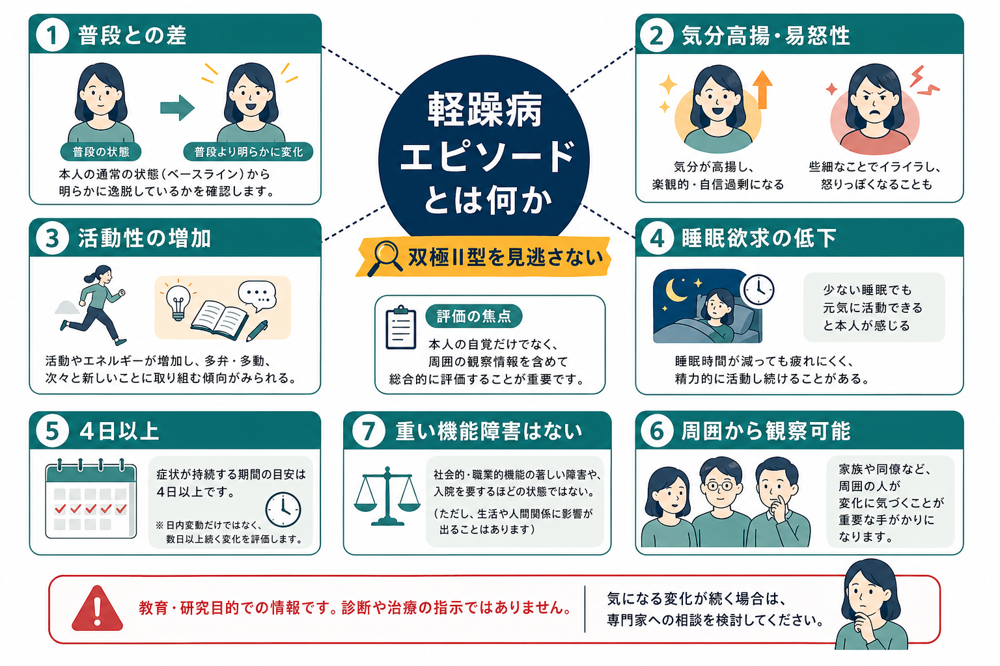
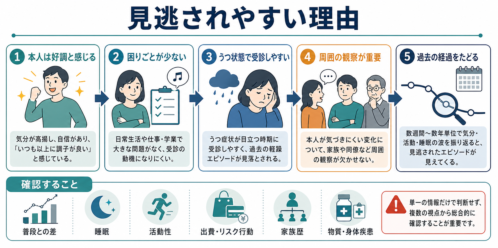
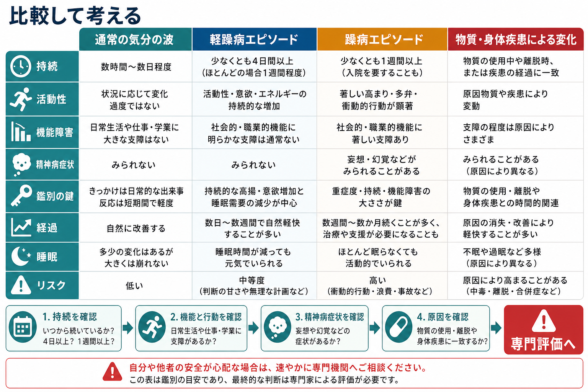

# 軽躁病エピソードとは何か

## 要点

- 軽躁病エピソードは、普段とは明らかに異なる気分高揚または易怒性と、活動性・エネルギーの増加がまとまって続く状態である。DSM-5-TR では少なくとも 4 日、ICD-11 では「数日以上」の持続が重視される[1][2][3]。
- 躁病エピソードとの境界は、症状の種類よりも重症度で決まる。著しい社会的・職業的機能障害、入院を要する重症度、または精神病症状があれば躁病として扱う[1][3][4]。
- 本人は「調子がよい」「疲れない」と感じやすく、困りごととして語られにくい。そのため、[[うつ病とは何か|うつ状態]]で受診した人に、過去の軽躁を時系列で確認することが重要になる[5][7]。
- 見逃しを減らす鍵は、普段との差、睡眠欲求の低下、活動性・発話・出費・性的行動・リスク行動、周囲から観察された変化、物質・薬剤・身体疾患との時間関係を確認することである[5][6][7]。
- この記事は教育・研究目的の整理であり、個別の診断や治療指示ではない。安全面の心配がある場合は、地域の医療機関・救急・相談窓口につなぐ評価が優先される。

## この記事で答える問い

1. 軽躁病エピソードは、通常の気分の波や躁病エピソードと何が違うのか。
2. なぜ軽躁は見逃されやすいのか。
3. 評価では何を、どの順番で確認すればよいのか。
4. [[双極II型障害とは何か]]、[[双極I型障害とは何か]]、[[双極性障害とは何か]]の理解にどうつながるのか。

## まず結論

軽躁病エピソードを見逃さないための中心は、「いま元気そうか」ではなく、「普段の本人から見て、数日以上続く気分・睡眠・活動性・判断の変化があったか」を確認することである。軽躁は、本人にとっては快適で生産的に感じられることがあり、受診時にはすでに過ぎ去っていることも多い。したがって、本人の回想だけでなく、家族・同僚・診療記録・生活リズムの変化を組み合わせる必要がある[5][7]。

## 背景

軽躁病エピソードは、[[双極II型障害とは何か]]を特徴づける中核的なエピソードである。双極II型障害では、少なくとも 1 回の軽躁病エピソードと少なくとも 1 回の大うつ病エピソードがあり、躁病エピソードの既往はない、という構成で理解される[1][3]。

問題は、軽躁そのものが受診理由になりにくい点である。NIMH は、軽躁では本人が非常に好調・生産的に感じ、問題だと感じない場合がある一方、家族や友人には気分・活動性の変化として見えることがあると説明している[4]。双極II型障害の総説でも、患者はうつ状態で治療につながることが多く、軽躁の時期は回想されにくい、または病的変化として認識されにくいと整理されている[7]。

そのため、軽躁の評価は「気分が上がることがあるか」と尋ねるだけでは不十分である。むしろ、睡眠時間が短くても疲れない時期、話す量や活動量が増える時期、浪費や無謀な計画が増える時期、周囲から「いつもと違う」と言われる時期を、時間軸に沿って確認する。

## 基本概念

### 軽躁病エピソードの核

軽躁病エピソードの核は、次の 3 層で考えると理解しやすい。

| 層 | 評価する内容 | 見るべき点 |
|---|---|---|
| 気分 | 高揚、開放感、易怒性 | 普段の本人と違うか |
| 活動性・エネルギー | 仕事、学業、社交、計画、性的活動、発話の増加 | 数日以上まとまって続くか |
| 重症度 | 機能障害、入院、精神病症状 | 躁病に相当する重症度ではないか |

DSM-5-TR に基づく整理では、軽躁病エピソードは少なくとも 4 日間続く、普段とは異なる気分と活動性・エネルギーの増加を伴う状態であり、誇大性、睡眠欲求の低下、多弁、観念奔逸、注意散漫、目標志向活動の増加、危険な活動への過度な関与などを評価する[1][3]。ICD-11 でも、気分の高揚または易怒性、活動性・エネルギーの増加、睡眠欲求低下、注意散漫、衝動的行動などが重視される[2][8]。

### 躁病との違い

軽躁病エピソードと躁病エピソードは、症状リストだけを見るとかなり重なる。違いは、症状がどれほど生活機能を壊しているか、入院を要するほどか、精神病症状を伴うかである[1][3][6]。

たとえば、数日間だけ睡眠が短くなり、仕事量が増え、話し方が速くなっても、社会的・職業的機能の著しい障害や入院、妄想・幻覚がなければ軽躁の範囲で評価されうる。一方、浪費・攻撃性・危険運転・性的リスク・対人トラブルが大きくなり、本人や周囲の安全が脅かされる場合は、軽躁という言葉で軽く扱わない。

## 仕組み

軽躁病エピソードを、単一の脳部位や単一の神経伝達物質だけで説明することはできない。現在の理解では、気分、報酬処理、睡眠・概日リズム、活動性、衝動性、ストレス反応、対人環境が相互に影響するエピソードとして扱うのが実用的である[5][6]。

評価上とくに重要なのは、睡眠欲求の低下と活動性の増加が相互に強め合う点である。睡眠が短くなっても疲れを感じにくい時期には、計画や社交が増え、発話が速くなり、判断のブレーキが弱くなることがある。本人は「効率が上がった」と感じる一方で、周囲には過活動、怒りっぽさ、無謀な支出、対人距離の変化として見える。

このズレが、軽躁の見逃しを生む。本人の主観では「調子がよい時期」でも、周囲から見れば「いつもと違う時期」である。したがって、[[精神科診察で睡眠をどう評価するか|睡眠評価]]、生活リズム、周囲の観察、過去の診療経過を重ねて読む必要がある。

## 図解

軽躁病エピソードの評価では、通常の気分の波、軽躁、躁病、物質・身体疾患による変化を比較して考える。とくに、持続、活動性、機能障害、精神病症状、原因との時間関係が鑑別の軸になる。

## 臨床・研究との接続

### 臨床評価

臨床では、うつ状態で受診した人に対して、過去の軽躁病エピソードを系統的に確認することが重要である。CANMAT/ISBD ガイドラインは、双極性障害がうつ病として誤診されやすい背景として、うつで受診しやすいこと、軽躁・躁病の時期を本人が病的と解釈しにくいこと、症状が時間的に不安定で併存症も多いことを挙げている[6]。

実際の面接では、次のように確認すると情報が集まりやすい。

| 評価項目 | 具体的な問いの例 |
|---|---|
| 普段との差 | 「周囲から、いつもより話す・動く・怒ると言われた時期はありますか」 |
| 睡眠欲求 | 「睡眠が短くても元気でいられた時期はありますか」 |
| 活動性 | 「仕事、学業、計画、社交、創作、運動が急に増えた時期はありますか」 |
| リスク行動 | 「出費、投資、性的行動、運転、喧嘩、急な転職や契約で後から困ったことはありますか」 |
| 周囲の観察 | 「家族や同僚は、その時期をどう見ていましたか」 |
| 鑑別 | 「薬、物質、睡眠不足、甲状腺など身体疾患、発達特性、パーソナリティ特性との関係はありますか」 |

### 研究上の課題

軽躁の研究では、持続日数の閾値、うつ症状と軽躁症状が混ざる混合特徴、双極II型障害と単極性うつ病の境界、[[DSMとICDは何が違うのか|DSM と ICD]] の差異が重要な論点になる。2025 年の双極II型障害レビューは、DSM-5 では軽躁の 4 日以上が必要とされる一方、ICD-11 では「数日以上」とより幅をもたせていること、また軽躁と通常の気分高揚、軽躁と躁病の境界にはなお議論があることを整理している[7]。

研究デザイン上は、回想バイアスが大きい。軽躁は本人が困っていない時期として記憶されやすく、周囲の証言や縦断的な気分・睡眠記録を組み込まないと、うつ病相だけが観察される。デジタル日誌、睡眠・活動量の測定、家族報告を組み合わせた縦断研究は、この問題を補う可能性がある。

## よくある誤解

### 「軽躁は軽いので問題にならない」

軽躁は躁病より重症度が低いという意味であり、無害という意味ではない。浪費、対人トラブル、危険行動、睡眠不足、うつ病相への移行、再発リスクと結びつくことがある[4][7]。

### 「本人が困っていなければ病的ではない」

本人が困っていないこと自体が、見逃しの原因になる。軽躁は主観的には好調に感じられることがあり、周囲からの観察情報が重要になる[4][7]。

### 「気分が明るい人は軽躁である」

明るい性格や一時的な高揚だけでは軽躁病エピソードとはいえない。普段との差、持続、活動性・睡眠・判断のまとまった変化、周囲から観察できる変化、鑑別が必要である[1][3]。

### 「うつ病と診断されたら双極性障害は考えなくてよい」

双極II型障害では、うつ状態で受診することが多い。反復するうつ、若年発症、家族歴、抗うつ薬での気分高揚、非定型的なうつ症状などがある場合は、過去の軽躁病エピソードを確認する価値がある[6][7]。

## 関連ノート

- [[双極性障害とは何か]]
- [[双極II型障害とは何か]]
- [[双極I型障害とは何か]]
- [[うつ病とは何か]]
- [[DSMとICDは何が違うのか]]
- [[精神科診察で睡眠をどう評価するか]]

### MOC更新候補

- `content/00_MOC/MOC・精神医学.md`
- `content/00_MOC/MOC・気分障害.md`

## 理解チェック

1. 軽躁病エピソードを通常の気分の波と区別するために、最低限どの 3 点を確認すべきか。
2. 軽躁病エピソードと躁病エピソードの境界は、症状の種類だけで決められるか。
3. うつ状態で受診した人に、過去の軽躁を確認する必要があるのはなぜか。
4. 本人の自覚だけでなく、周囲の観察情報が重要になる理由は何か。
5. 物質・薬剤・身体疾患による気分高揚を鑑別するには、どのような時間関係を確認するか。

## 未解決問題

- 4 日未満の軽躁様エピソードを、研究・臨床でどのように扱うのが妥当か。
- 軽躁、混合特徴、発達特性、パーソナリティ特性、物質使用による変化を、どの評価指標で最も安定して区別できるか。
- 睡眠・活動量のデジタル測定を、本人の主観的苦痛や周囲の観察とどう統合するか。
- 双極II型障害に特化した治療研究を、双極I型障害からの外挿に頼らずどのように蓄積するか。

## 参考文献

[1] American Psychiatric Association. (2022). *Diagnostic and Statistical Manual of Mental Disorders, Fifth Edition, Text Revision (DSM-5-TR)*. American Psychiatric Association Publishing. https://doi.org/10.1176/appi.books.9780890425787

[2] World Health Organization. (2024/2025). *ICD-11 for Mortality and Morbidity Statistics*. https://icd.who.int/browse11/l-m/en

[3] Jain, A., & Mitra, P. (2023). Bipolar Disorder. *StatPearls*. NCBI Bookshelf. https://www.ncbi.nlm.nih.gov/books/NBK558998/

[4] National Institute of Mental Health. (2026). Bipolar Disorder. https://www.nimh.nih.gov/health/publications/bipolar-disorder

[5] National Institute for Health and Care Excellence. (2025). *Bipolar disorder: assessment and management* (NICE guideline CG185). https://www.nice.org.uk/guidance/cg185

[6] Yatham, L. N., Kennedy, S. H., Parikh, S. V., et al. (2018). Canadian Network for Mood and Anxiety Treatments (CANMAT) and International Society for Bipolar Disorders (ISBD) 2018 guidelines for the management of patients with bipolar disorder. *Bipolar Disorders*, 20(2), 97-170. https://doi.org/10.1111/bdi.12609

[7] Berk, M., Corrales, A., Trisno, R., Dodd, S., Yatham, L. N., Vieta, E., McIntyre, R. S., Suppes, T., & Agustini, B. (2025). Bipolar II disorder: a state-of-the-art review. *World Psychiatry*, 24(2), 175-189. https://pmc.ncbi.nlm.nih.gov/articles/PMC12079553/

[8] Carvalho, A. F., Firth, J., & Vieta, E. (2020). Bipolar Disorder. *The New England Journal of Medicine*, 383, 58-66. https://doi.org/10.1056/NEJMra1906193
