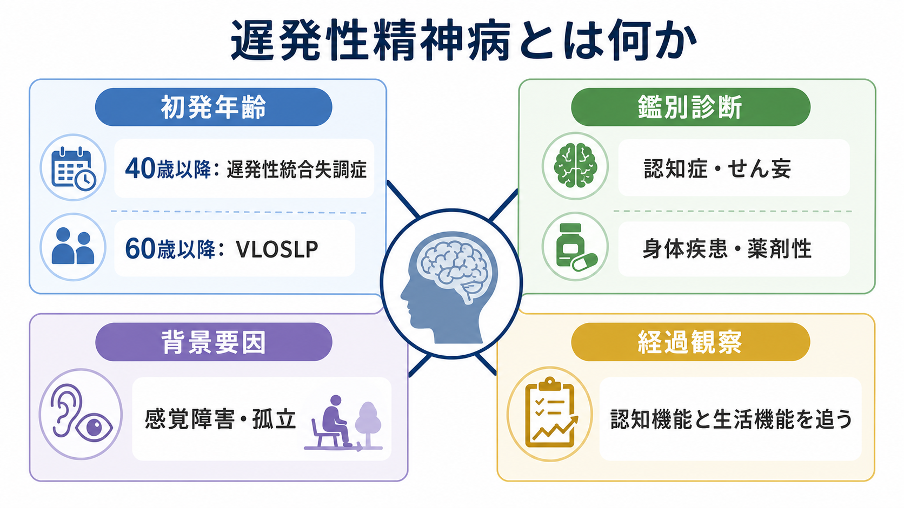
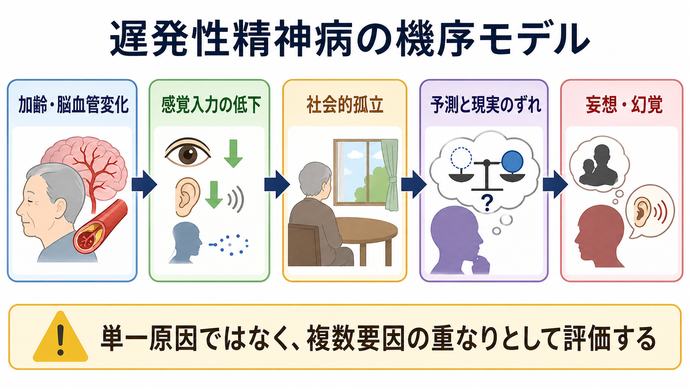
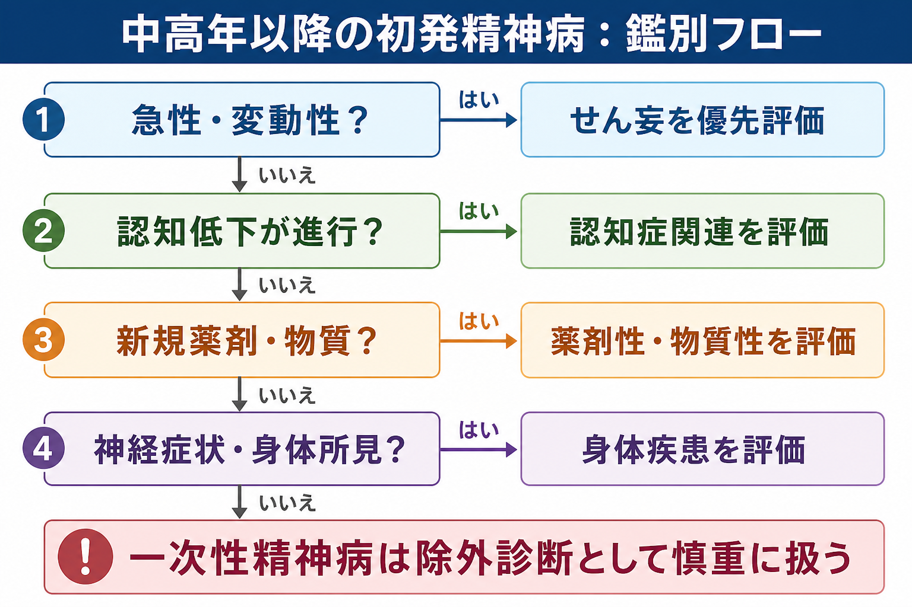

# 遅発性精神病とは何か

## 要点

- 遅発性精神病は、単一の診断名というより、中高年以降に初めて目立つ[[幻覚とは何か|幻覚]]・[[妄想とは何か|妄想]]・まとまりにくい思考などを評価するための臨床的な入口である。
- 国際的な議論では、40歳以降に発症する統合失調症を遅発性統合失調症、60歳以降に初発する統合失調症様の精神病を very-late-onset schizophrenia-like psychosis（VLOSLP）と呼び分ける提案がある[1]。
- 中高年以降の初発精神病では、[[せん妄とは何か|せん妄]]、認知症、脳血管障害、内分泌・代謝疾患、感染、薬剤性・物質性、気分障害を先に検討する必要がある[2][3][4]。
- VLOSLP は「純粋な一次性精神病」とだけ考えると危うい。複数の大規模コホートで、その後の認知症診断リスクが高いことが示されており、初回評価だけでなく縦断的な認知機能・生活機能の観察が重要である[7][8]。
- 本記事は教育・研究目的の整理であり、個別の診断や治療指示ではない。実際の評価・治療は、身体診察、検査、薬剤確認、家族・支援者からの情報を含む専門的判断に基づく。

## この記事で答える問い

1. 遅発性精神病、遅発性統合失調症、VLOSLP はどう違うのか。
2. 中高年以降の初発精神病で、なぜ認知症・せん妄・身体疾患・薬剤性を重く見るのか。
3. 遅発性精神病はどのような仕組みで生じると考えられているのか。
4. 臨床・研究では、どの情報を追跡すれば見落としを減らせるのか。

## まず結論

遅発性精神病とは、「中高年以降に初めて精神病症状が出た」という現象を、年齢、経過、認知機能、身体疾患、薬剤、物質使用、感覚障害、生活環境から読み直すための概念である。若年発症の[[統合失調症とは何か|統合失調症]]と同じ枠組みだけで扱うのではなく、後年発症に特有の鑑別を先に置くのが実務上の要点になる。

特に、急性発症で日内変動があり注意障害を伴う場合は[[せん妄とは何か|せん妄]]を優先して考える。数か月から数年の認知低下、視空間障害、パーキンソニズム、レム睡眠行動異常、幻視が目立つ場合は認知症関連の精神病症状を検討する。新規薬剤、抗コリン作用薬、ステロイド、ドパミン作動薬、睡眠薬、アルコール、離脱、違法薬物、サプリメントの影響も確認する。これらを十分に評価したうえで、一次性の精神病性障害としての遅発性統合失調症や VLOSLP を考える。

## 背景

精神病症状は、幻覚や妄想の有無だけで決まるものではない。現実検討、思考のまとまり、行動、感情、認知機能、生活機能、周囲との相互作用が変化する状態として評価される。[[統合失調症の陽性症状とは何か]]で扱うような幻覚・妄想は重要な入口だが、中高年以降では「なぜ今、初めて出たのか」という問いがより大きな重みを持つ。

Howard らの国際コンセンサスは、40歳以降の発症を遅発性統合失調症、60歳以降の発症を VLOSLP として区別する枠組みを示した[1]。この区別は、年齢だけで病因が決まるという意味ではない。むしろ、若年発症とは異なる疫学、症状プロファイル、性差、感覚障害、脳血管変化、神経変性との関係を検討しやすくするための作業仮説である。

2019年の系統的レビューは、2000年以降の研究を整理し、遅発性精神病では迫害妄想、幻聴、社会的孤立、感覚障害、認知機能変化、脳構造・白質変化などが論点になることを示した[2]。ただし研究の多くはサンプルが小さく、診断基準や除外基準もばらつく。そのため、現時点では「遅発性精神病」という言葉を使うときほど、何を除外し、何を縦断的に確認したのかを明示する必要がある。

## 基本概念

### 遅発性精神病

遅発性精神病は、40歳または60歳以降に初発する精神病症状を広く指す実用的な表現である。ここには、一次性精神病、認知症関連精神病、せん妄、身体疾患による精神病症状、薬剤性・物質性精神病、気分障害に伴う精神病症状が含まれうる。したがって、遅発性精神病という語だけでは診断は完結しない。

### 遅発性統合失調症

遅発性統合失調症は、40歳以降に統合失調症様の病像が初発する場合に用いられる。若年発症の統合失調症と連続する部分もあるが、女性に多いこと、陰性症状や思考形式の著しい解体が相対的に目立ちにくいこと、被害的・注察的な妄想や幻聴が前景に立ちやすいことがしばしば議論される[1][2]。

### VLOSLP

VLOSLP は60歳以降に初発する統合失調症様精神病を指す。名称に「schizophrenia-like」とあるのは、統合失調症に似た症状を示すが、認知症、脳血管障害、レビー小体病理などとの境界がとくに問題になるためである[1][3]。近年の研究では、VLOSLP 後に認知症診断へ至るリスクが高いことが繰り返し示されており、初診時に認知症基準を満たさなくても、経過観察が不可欠である[7][8]。

## 鑑別診断

### せん妄

せん妄は、急性発症、変動する経過、注意障害、意識水準や睡眠覚醒リズムの変化を特徴とする。NICE のせん妄ガイドラインは、せん妄を急性かつ変動性の意識・認知・知覚の障害として扱い、入院・施設ケアの場面で早期に疑うことを推奨している[4]。中高年以降の初発幻覚や妄想では、「精神症状があるか」より先に「急性で変動する脳機能障害ではないか」を見る。

### 認知症関連精神病

認知症では、幻視、被害妄想、誤認、嫉妬妄想、物盗られ妄想などが出ることがある。レビー小体型認知症やパーキンソン病認知症では抗精神病薬への過敏性が問題になるため、NICE は抗精神病薬が運動症状を悪化させ、重い過敏反応を生じうることに注意を促している[5]。[[レビー小体型認知症は神経回路にどのような影響を与えるのか]]や[[アセチルコリン系は認知症とどう関わるのか]]と接続して考えると、幻視・注意変動・睡眠異常・自律神経症状の評価が重要になる。

### 身体疾患・神経疾患

脳血管障害、てんかん、腫瘍、感染、自己免疫性脳炎、甲状腺疾患、副腎疾患、ビタミン欠乏、肝腎機能障害、低酸素、疼痛、睡眠障害などは、精神病症状の背景になりうる。遅発性精神病では、精神科診断だけでなく身体診察、神経学的診察、血液検査、画像検査、必要に応じた脳波や髄液検査の適応を考える。

### 薬剤性・物質性

薬剤性精神症状は高齢者で見落とされやすい。抗コリン作用薬、ステロイド、ドパミン作動薬、抗パーキンソン病薬、一部の抗てんかん薬、睡眠薬、鎮痛薬、感染症治療薬、ポリファーマシー、アルコール使用や離脱が関係することがある。NICE の物質使用併存精神病ガイドラインは、精神病が疑われる場合に物質使用を系統的に評価し、本人だけでなく家族・支援者からの情報も活用することを推奨している[6]。この点は[[薬剤性精神症状とは何か]]と強く接続する。

### 気分障害と妄想性障害

うつ病や双極性障害では、気分に一致する罪業妄想、貧困妄想、誇大妄想、被害妄想が出ることがある。妄想が比較的限局し、生活機能が保たれ、幻覚や著しい思考解体が目立たない場合は[[妄想性障害とは何か]]も鑑別に入る。中高年以降の発症では、抑うつ、悲嘆、孤立、感覚障害、身体疾患が妄想形成を補強することもある。

## 仕組み

遅発性精神病の仕組みは、単一原因では説明しにくい。現時点では、加齢に伴う脳の脆弱性、脳血管変化、神経変性、感覚入力の低下、社会的孤立、ストレス、既存のパーソナリティ傾向、薬剤・身体疾患が重なり、現実検討や意味づけのバランスが崩れるモデルとして考えるのが実用的である[2][3]。

感覚障害はとくに重要である。聴力や視力が低下すると、外界からの情報が曖昧になり、脳は不足した情報を過去経験や予測で補おうとする。[[幻覚は脳内でどのように生じるのか]]や[[妄想は予測誤差処理の異常として説明できるのか]]で扱うように、曖昧な入力に対して過剰な確信が結びつくと、幻覚や妄想が維持されやすくなる。

脳血管変化や白質病変も候補因子である。VLOSLP の症例レビューでは、基底核ラクナ梗塞や白質小血管病変などが記述され、遅発性精神病を神経変性・血管性変化と切り離して考えすぎないことが強調されている[3]。ただし、画像所見があるから精神病症状の原因が直ちに確定するわけではない。臨床的には、症状の時系列、認知機能、生活機能、神経所見、薬剤、検査所見を統合して判断する。

## 図解

このフローは、診断名を機械的に決めるためのものではない。急性・変動性があればせん妄、進行性の認知低下があれば認知症関連、新規薬剤や物質使用があれば薬剤性・物質性、神経症状や身体所見があれば身体疾患を優先して評価する、という順序を示している。一次性精神病は「他を十分に考えたあとに残る診断」として慎重に扱う。

## 臨床・研究との接続

臨床では、初回評価で以下を確認する。

| 評価領域 | 確認したいこと |
|---|---|
| 発症時期 | いつから、急性か亜急性か、日内変動があるか |
| 症状内容 | 幻聴、幻視、被害妄想、誤認、思考解体、陰性症状 |
| 認知機能 | 記憶、注意、遂行機能、視空間機能、生活機能の変化 |
| 身体・神経 | 発熱、疼痛、感染、神経脱落症状、パーキンソニズム、睡眠異常 |
| 薬剤・物質 | 新規薬剤、増減量、抗コリン負荷、アルコール、離脱、サプリメント |
| 環境 | 独居、死別、孤立、聴力・視力低下、介護負担 |
| リスク | 自傷、他害、セルフネグレクト、詐欺被害、服薬・栄養・睡眠 |

研究では、VLOSLP が認知症の前駆状態なのか、認知症とは別の高リスク状態なのか、あるいは複数の病態の混合なのかが大きな論点である。スウェーデンの人口ベース研究では、VLOSLP 群で後の認知症診断率が高く、関連は診断後1年で最も強いが、その後も長期に残ることが示された[7]。イスラエルの全国コホートでも、VLOSLP は認知症および死亡リスクの上昇と関連していた[8]。これらは因果関係をただちに確定するものではないが、VLOSLP を「一度診断したら終わり」にしない根拠になる。

治療面では、抗精神病薬の効果と害を若年者より慎重に秤にかける必要がある。認知症が疑われる場合、NICE は抗精神病薬を用いるときに最低有効量、可能な限り短期間、少なくとも6週ごとの再評価を推奨している[5]。心理教育、環境調整、睡眠、感覚補助、家族支援、身体疾患治療、薬剤整理を組み合わせることが、薬物療法以上に重要になる場面も多い。

## よくある誤解

### 「高齢で幻覚や妄想が出たら認知症である」

認知症関連精神病は重要だが、すべてではない。せん妄、身体疾患、薬剤性・物質性、気分障害、妄想性障害、遅発性統合失調症もありうる。重要なのは、認知症かどうかを一度だけ判定することではなく、経過の中で認知機能と生活機能を追うことである。

### 「若年発症の統合失調症と同じ治療でよい」

症状が似ていても、身体合併症、薬剤感受性、転倒、錐体外路症状、認知機能、介護環境は大きく異なる。薬物療法を使う場合も、身体リスクと社会的支援を同時に見る必要がある。

### 「妄想が強いので本人からの情報だけで十分である」

遅発性精神病では、本人の語りに加えて、家族、支援者、かかりつけ医、薬局、介護サービスからの時系列情報が診断の質を左右する。いつから変わったのか、睡眠・食事・服薬・金銭管理・火の始末・外出がどう変わったかは、症状名よりも実務的な意味を持つ。

## 関連ノート

- [[統合失調症とは何か]]
- [[統合失調症の陽性症状とは何か]]
- [[初回エピソード精神病とは何か]]
- [[妄想性障害とは何か]]
- [[せん妄とは何か]]
- [[薬剤性精神症状とは何か]]
- [[幻覚とは何か]]
- [[妄想とは何か]]
- [[レビー小体型認知症は神経回路にどのような影響を与えるのか]]
- [[アセチルコリン系は認知症とどう関わるのか]]

MOC 更新候補: `content/00_MOC/` 配下の精神医学、症候学、老年精神医学、認知症関連 MOC がある場合、本記事を「疾患・症候群」および「鑑別診断」枠に追加する。

## 理解チェック

1. 40歳以降と60歳以降の初発精神病は、それぞれどのように呼び分けられることがあるか。
2. 中高年以降の初発精神病で、せん妄を疑う時系列上の特徴は何か。
3. VLOSLP で認知機能と生活機能を縦断的に追う理由は何か。
4. 抗精神病薬を使う前に確認すべき身体疾患・薬剤・認知症関連の注意点は何か。

## 未解決問題

- VLOSLP は、独立した一次性精神病なのか、認知症の前駆状態なのか、あるいは複数病態の臨床的集合なのか。
- 感覚障害、孤立、脳血管変化、神経変性、予測誤差処理の異常は、どの順序で症状形成に関与するのか。
- 高齢発症例で、薬物療法、心理社会的介入、感覚補助、環境調整をどのように組み合わせると生活機能の維持に最も寄与するのか。
- 日本の地域医療・介護連携の中で、遅発性精神病を早期に拾い上げ、認知症や身体疾患の評価につなぐ実装方法は何か。

## 参考文献

[1] Howard, R., Rabins, P. V., Seeman, M. V., & Jeste, D. V. (2000). Late-onset schizophrenia and very-late-onset schizophrenia-like psychosis: an international consensus. *American Journal of Psychiatry, 157*(2), 172-178. https://doi.org/10.1176/appi.ajp.157.2.172

[2] Suen, Y. N., Wong, S. M. Y., Hui, C. L. M., Chan, S. K. W., Lee, E. H. M., Chang, W. C., & Chen, E. Y. H. (2019). Late-onset psychosis and very-late-onset-schizophrenia-like-psychosis: an updated systematic review. *International Review of Psychiatry, 31*(5-6), 523-542. https://doi.org/10.1080/09540261.2019.1670624

[3] Regala, J., & Moniz-Pereira, F. (2023). Very Late-Onset Schizophrenia-Like Psychosis: A Case Report and Critical Literature Review. *Annals of Geriatric Medicine and Research, 27*(2), 175-178. https://doi.org/10.4235/agmr.23.0026

[4] National Institute for Health and Care Excellence. (2023). *Delirium: prevention, diagnosis and management in hospital and long-term care* (Clinical guideline CG103). https://www.ncbi.nlm.nih.gov/books/NBK553009/

[5] National Institute for Health and Care Excellence. (2018, updated). *Dementia: assessment, management and support for people living with dementia and their carers* (NG97). https://www.nice.org.uk/guidance/ng97/chapter/recommendations

[6] National Institute for Health and Care Excellence. (2011). *Coexisting severe mental illness (psychosis) and substance misuse: assessment and management in healthcare settings* (CG120). https://www.nice.org.uk/guidance/cg120/chapter/1-guidance

[7] Stafford, J., Dykxhoorn, J., Sommerlad, A., Dalman, C., Kirkbride, J. B., & Howard, R. (2023). Association between risk of dementia and very late-onset schizophrenia-like psychosis: a Swedish population-based cohort study. *Psychological Medicine, 53*(3), 750-758. https://doi.org/10.1017/S0033291721002099

[8] Kodesh, A., Goldberg, Y., Rotstein, A., Weinstein, G., Reichenberg, A., Sandin, S., & Levine, S. Z. (2020). Risk of dementia and death in very-late-onset schizophrenia-like psychosis: A national cohort study. *Schizophrenia Research, 223*, 220-226. https://doi.org/10.1016/j.schres.2020.07.020
