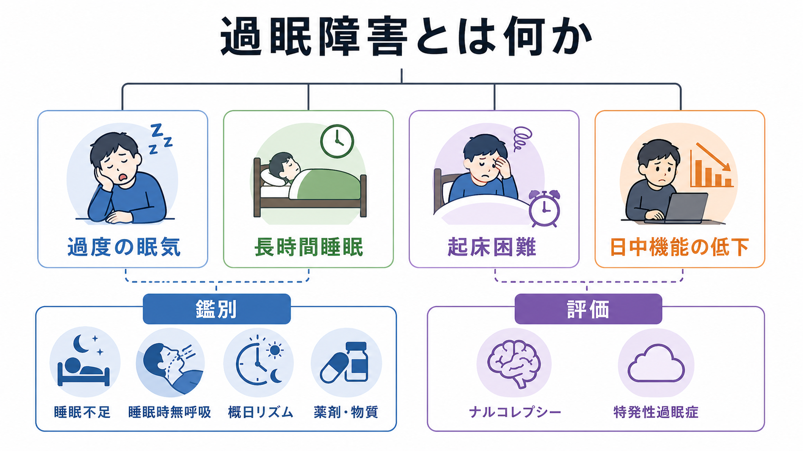
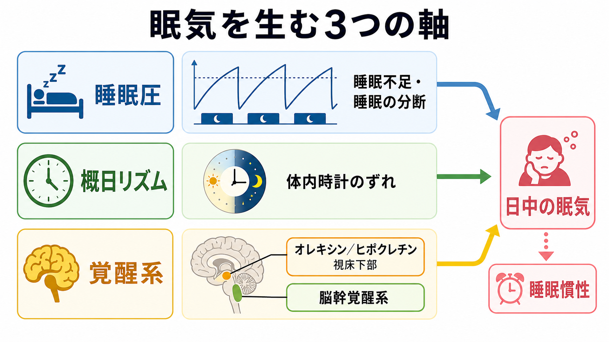
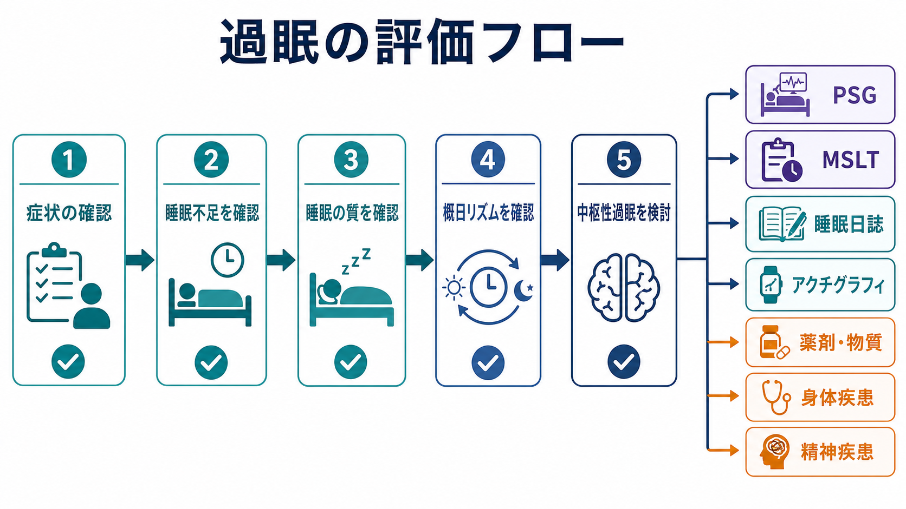

# 過眠障害とは何か

## 要点

- 過眠障害は、単に「長く眠る人」を指す言葉ではなく、日中の強い眠気、長時間睡眠、起床困難、睡眠慣性が生活機能を妨げる状態を扱う臨床概念である。
- 睡眠医学では、睡眠障害は不眠障害、睡眠関連呼吸障害、中枢性過眠症群、概日リズム睡眠・覚醒障害群などに分類され、過眠を訴える人でも原因は一つではない[1]。
- 中枢性過眠症群には、ナルコレプシー1型・2型、特発性過眠症、Kleine-Levin症候群などが含まれる[2]。
- 最初に除外すべきなのは、睡眠不足、睡眠時無呼吸、概日リズムのずれ、薬剤・物質、身体疾患、精神疾患による眠気である[3]。
- 診断や治療方針は教育・研究目的の知識だけで決められない。睡眠日誌、アクチグラフィ、終夜睡眠ポリグラフ検査、MSLTなどを、症状の文脈に合わせて解釈する必要がある[5]。

## この記事で答える問い

1. 過眠障害は、[[過眠とは何か|過眠]]や[[睡眠障害とは何か|睡眠障害]]とどう違うのか。
2. 過度の眠気は、睡眠不足、睡眠の質、概日リズム、覚醒系のどこから生じるのか。
3. ナルコレプシーや特発性過眠症は、どのような意味で「中枢性」の過眠障害なのか。
4. 臨床評価では、どの順序で鑑別を進めるべきか。

## まず結論

過眠障害は、「眠気が強い」という主観的訴えだけで決まる診断名ではない。重要なのは、眠気がいつ、どのくらい、どの状況で、どの機能を妨げているかである。夜間睡眠が短ければ睡眠不足が第一候補になる。夜間にいびきや無呼吸があれば睡眠関連呼吸障害を考える。就寝・起床時刻が社会的スケジュールとずれていれば[[概日リズムの乱れは精神疾患にどう関わるのか|概日リズム]]の問題が前景化する。これらで説明しにくい持続的な眠気では、ナルコレプシーや特発性過眠症などの中枢性過眠症群を検討する[1][2][3]。

したがって、過眠障害を理解する入口は「眠りすぎ」ではなく、「覚醒を保つシステム、睡眠圧、体内時計、睡眠の質、生活機能のどこに破綻があるか」を分けて見ることである。

## 背景

眠気は日常的な体験である。徹夜、睡眠不足、夜勤、時差、退屈な環境では、多くの人が眠くなる。しかし過眠障害で問題になるのは、眠る機会を確保しても日中の眠気が持続する、起きても頭が働かない、長時間眠っても回復感が乏しい、通学・勤務・運転・対人関係に支障が出る、といった機能障害である[2][3]。

ICSD-3-TRでは、睡眠障害は大きく六つのカテゴリーに整理され、その一つとして「中枢性過眠症群」が置かれている[1][8]。これは、眠気の原因が単なる睡眠機会の不足や睡眠時無呼吸だけでなく、脳内の覚醒維持機構そのものに関わる可能性を示す分類である。ただし、臨床現場では過眠の訴えがあっても、原因は中枢性過眠症群とは限らない。[[精神科診察で睡眠をどう評価するか|精神科診察で睡眠を評価する]]ときも、睡眠時間、睡眠の質、生活リズム、薬剤、精神症状、身体疾患、安全性を横断的に見る必要がある。

## 基本概念

### 過眠と過眠障害

過眠は、長時間睡眠や日中の強い眠気を指す症候である。一方、過眠障害は、その症候が持続し、生活機能や安全性に意味のある影響を与え、他の原因との鑑別を要する病態を指す。つまり、過眠は「見えている現象」、過眠障害は「評価すべき臨床問題」である。

### 過度の日中の眠気

過度の日中の眠気は、起きているべき場面で眠り込みやすい状態である。集中困難、反応時間の遅れ、居眠り運転、授業や会議での入眠として現れることがある。疲労感や意欲低下と重なるが、眠気は「眠りに入る圧力」が前景化する点で、単なる疲れとは区別して聞く必要がある[3]。

### 長時間睡眠と睡眠慣性

長時間睡眠は、夜間睡眠や昼寝を含む総睡眠時間が長い状態である。ただし長く眠るだけで病的とは限らない。問題になるのは、十分に眠ってもすっきりせず、起床後の混乱、ぼんやり、行動開始の困難が長く続く場合である。特発性過眠症では、長い非回復性の昼寝や強い睡眠慣性がみられることがある[7]。

### 中枢性過眠症群

中枢性過眠症群は、睡眠不足や夜間睡眠の分断だけでは説明しにくい持続的な眠気を中心とする障害群である。代表はナルコレプシー1型、ナルコレプシー2型、特発性過眠症、Kleine-Levin症候群である[2][4]。ナルコレプシー1型では情動脱力発作とオレキシン／ヒポクレチン系の低下が重要であり、特発性過眠症では病態機序がまだ十分に解明されていない[2][7]。

## 仕組み

過眠障害を一つの原因で説明するのは難しい。理解しやすい整理は、次の三つの軸である。

1. 睡眠圧  
起きている時間が長くなるほど、睡眠への圧力は高まる。睡眠不足、睡眠の分断、睡眠時無呼吸、周期性四肢運動などは、本人が十分眠ったつもりでも睡眠圧を残す。

2. 概日リズム  
体内時計は、眠りやすい時間帯と覚醒しやすい時間帯を作る。夜型化、交代勤務、時差、光環境、社会的スケジュールのずれは、眠るべき時間と起きるべき時間を分離させる。

3. 覚醒系  
視床下部、脳幹、モノアミン系、ヒスタミン系、オレキシン／ヒポクレチン系などは、覚醒を保つ神経基盤である。[[脳幹網様体は覚醒ネットワークで何をしているのか|脳幹網様体]]や[[ノルアドレナリンは覚醒とストレスにどう関わるのか|ノルアドレナリン系]]は覚醒維持に関与し、ナルコレプシー1型ではオレキシン／ヒポクレチン神経の喪失が中心的病態として扱われる[2][4]。

この三つの軸は独立していない。たとえば睡眠不足は睡眠圧を高めるだけでなく、翌日の注意・情動調整・報酬処理を乱し、[[睡眠障害は脳機能にどのような影響を与えるのか|脳機能]]の低下として現れる。概日リズムのずれは、夜に眠れないことと朝に起きられないことを同時に作る。覚醒系の脆弱性がある人では、同じ睡眠不足でも日中機能への影響が大きくなる。

## 図解

1枚目は、過眠障害を「症状」「鑑別」「評価」に分けて眺める概念地図である。過度の眠気、長時間睡眠、起床困難、日中機能低下は入り口であり、そこから睡眠不足、睡眠時無呼吸、概日リズム、薬剤・物質、中枢性過眠症群へ鑑別を広げる。

2枚目は、眠気を生む三つの軸を示す。睡眠圧、概日リズム、覚醒系のどれか一つだけで説明できるとは限らず、複数の軸が重なって日中の眠気や睡眠慣性が出る。

3枚目は、臨床評価の流れである。主訴を確認した後、睡眠不足、睡眠の質、概日リズムを順に確認し、必要に応じてPSG、MSLT、睡眠日誌、アクチグラフィを組み合わせる。

## 臨床・研究との接続

### 評価の順序

過眠を訴える人では、まず安全性を確認する。居眠り運転、機械操作中の眠気、転倒、学業・勤務への重大な影響、自傷リスクがあれば、評価の優先度は上がる。次に、睡眠不足、睡眠時無呼吸、概日リズムのずれ、薬剤・物質、身体疾患、精神疾患を確認する[3]。

MSLTは、日中の入眠しやすさと入眠時レム睡眠の有無を評価する検査である。ただし、検査前の睡眠不足、薬剤、カフェイン、併存睡眠障害、検査前夜のPSG条件に影響されるため、単独で診断を決める検査ではない。AASMの成人MSLT/MWTプロトコルでは、検査前の睡眠記録やアクチグラフィ、十分な睡眠確保、薬剤や物質の影響確認が重視されている[5]。

### 治療研究

中枢性過眠症群の治療では、AASMの臨床実践ガイドラインが、ナルコレプシーや特発性過眠症などに対する薬物療法・非薬物療法のエビデンスをGRADEに基づいて整理している[6]。ただし、治療選択は診断名だけで決められない。眠気の重症度、情動脱力発作の有無、併存症、年齢、妊娠可能性、薬剤相互作用、依存・乱用リスク、安全性、本人の価値観を含めて検討する必要がある。

### 精神医学との接続

精神科では、過眠は[[うつ病とは何か|うつ病]]、[[双極性障害とは何か|双極性障害]]、非定型うつ病、薬剤性の眠気、物質使用、身体疾患による気分変化と重なりやすい。抑うつ気分、意欲低下、疲労、認知機能低下があると、眠気そのものが見えにくくなる。したがって、[[薬剤性うつ症状とは何か|薬剤性うつ症状]]や[[身体疾患による気分障害とは何か|身体疾患による気分障害]]と同じく、症状の時間経過、睡眠パターン、薬剤歴、身体状態を同じ時間軸に並べることが重要である。

## よくある誤解

### 誤解1: 長く眠る人は全員、過眠障害である

長時間睡眠だけでは過眠障害とはいえない。体質、年齢、睡眠負債、生活スケジュールによって睡眠時間は変わる。臨床的に重要なのは、長く眠っても回復しない、日中機能が落ちる、起床困難が強い、安全性に影響する、といった機能障害である。

### 誤解2: 過眠は怠けや意志の弱さである

過眠は、睡眠圧、概日リズム、覚醒系、薬剤、身体疾患、精神疾患が重なって生じる。本人の努力だけで説明すると、必要な評価や支援が遅れる。

### 誤解3: MSLTで異常がなければ過眠はない

MSLTは有用だが万能ではない。特発性過眠症ではMSLTの感度に限界があり、長時間睡眠や睡眠慣性を十分に捉えられないことがある[7]。症状、睡眠日誌、アクチグラフィ、PSG、薬剤歴を統合して判断する。

### 誤解4: 眠気を薬で抑えれば十分である

覚醒促進薬が有効な病態はあるが、睡眠不足、睡眠時無呼吸、概日リズムのずれ、薬剤性鎮静を放置したまま眠気だけを抑えるのは危険である。治療は、原因評価、生活調整、安全確保、併存症対応を含めて考える。

## 関連ノート

- [[過眠とは何か]]
- [[睡眠障害とは何か]]
- [[精神科診察で睡眠をどう評価するか]]
- [[睡眠障害は脳機能にどのような影響を与えるのか]]
- [[概日リズムの乱れは精神疾患にどう関わるのか]]
- [[脳幹網様体は覚醒ネットワークで何をしているのか]]
- [[ノルアドレナリンは覚醒とストレスにどう関わるのか]]
- [[うつ病とは何か]]
- [[双極性障害とは何か]]
- [[薬剤性うつ症状とは何か]]

MOC更新候補: `content/00_MOC/` 配下の精神医学、症候学、睡眠関連、神経科学と精神疾患のMOC。並列ジョブとの競合を避けるため、このタスクではMOC本体は更新しない。

今後の作成候補: `ナルコレプシーとは何か`, `特発性過眠症とは何か`, `MSLTとは何か`, `睡眠時無呼吸とは何か`, `睡眠慣性とは何か`, `Kleine-Levin症候群とは何か`。

## 理解チェック

1. 過眠障害を「長時間睡眠」だけで定義すると、どのような見落としが起こるか。
2. 睡眠不足、睡眠時無呼吸、概日リズムのずれ、中枢性過眠症群は、どの情報で鑑別しやすいか。
3. ナルコレプシー1型でオレキシン／ヒポクレチン系が重要になる理由は何か。
4. MSLTを解釈するとき、検査前の睡眠量や薬剤確認が必要なのはなぜか。
5. 精神科診療で、過眠を抑うつ症状や薬剤性鎮静と区別して聞くには、どのような質問が有用か。

## 未解決問題

- 特発性過眠症の病態は、ナルコレプシー1型ほど明確な単一機序としては説明されていない。
- 主観的眠気、客観的睡眠潜時、長時間睡眠、睡眠慣性、生活機能障害は、必ずしも一対一に対応しない。
- ウェアラブルデータ、睡眠日誌、PSG、MSLTを日常診療でどのように統合するかは、今後も実装上の課題である。

## 参考文献

[1] American Academy of Sleep Medicine. (2023). *International Classification of Sleep Disorders, Third Edition, Text Revision (ICSD-3-TR)*. https://aasm.org/clinical-resources/international-classification-sleep-disorders/

[2] Trotti, L. M. (2020). Central disorders of hypersomnolence. *Continuum, 26*(4), 890-907. https://doi.org/10.1212/CON.0000000000000883

[3] Murray, B. J. (2016). A practical approach to excessive daytime sleepiness: a focused review. *Canadian Respiratory Journal, 2016*, 4215938. https://doi.org/10.1155/2016/4215938

[4] Khan, Z., & Trotti, L. M. (2015). Central disorders of hypersomnolence: focus on the narcolepsies and idiopathic hypersomnia. *Chest, 148*(1), 262-273. https://doi.org/10.1378/chest.14-1304

[5] Krahn, L. E., Arand, D. L., Avidan, A. Y., et al. (2021). Recommended protocols for the Multiple Sleep Latency Test and Maintenance of Wakefulness Test in adults: guidance from the American Academy of Sleep Medicine. *Journal of Clinical Sleep Medicine, 17*(12), 2489-2498. https://doi.org/10.5664/jcsm.9620

[6] Maski, K., Trotti, L. M., Kotagal, S., et al. (2021). Treatment of central disorders of hypersomnolence: an American Academy of Sleep Medicine clinical practice guideline. *Journal of Clinical Sleep Medicine, 17*(9), 1881-1893. https://doi.org/10.5664/jcsm.9328

[7] Dhillon, K., & Sankari, A. (2023). Idiopathic Hypersomnia. *StatPearls*. NCBI Bookshelf. https://www.ncbi.nlm.nih.gov/books/NBK585065/

[8] Sateia, M. J. (2014). International classification of sleep disorders-third edition: highlights and modifications. *Chest, 146*(5), 1387-1394. https://doi.org/10.1378/chest.14-0970
