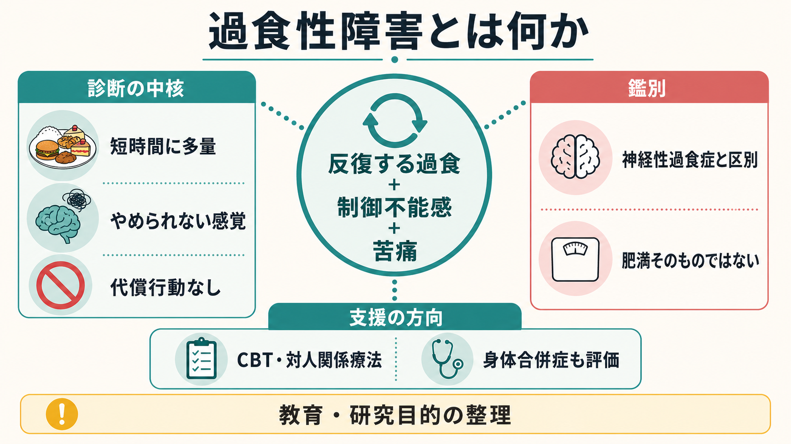
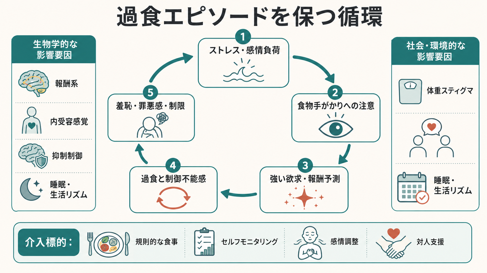

# 過食性障害とは何か

## 要点

- 過食性障害は、短時間に通常より明らかに多い量を食べ、その間に「やめられない」「量を制御できない」という感覚を伴う過食エピソードが反復する摂食障害である[1]。
- 神経性過食症と違い、嘔吐、下剤乱用、絶食、過剰運動などの不適切な代償行動が規則的にはみられない[1][2]。
- 肥満そのものとは同義ではない。過食性障害はどの体重域にも起こりうるが、肥満、代謝疾患、睡眠障害、抑うつ・不安などと併存しやすい[3][4]。
- 仕組みは意志の弱さではなく、報酬処理、[[抑制制御とは何か|抑制制御]]、[[内受容感覚とは何か|内受容感覚]]、感情調整、体重スティグマ、生活リズムが絡む循環として理解する方がよい[3]。
- 治療では、過食の軽減を主目標に、ガイド付きセルフヘルプ、摂食障害焦点化 CBT、対人関係療法、必要に応じた薬物療法や身体合併症の評価を組み合わせる[5][6]。

## この記事で答える問い

1. 過食性障害は、単なる食べ過ぎや肥満と何が違うのか。
2. 神経性過食症、夜間摂食、気分障害に伴う過食とはどう鑑別するのか。
3. 過食エピソードは、どのような心理・神経・社会的循環で維持されるのか。
4. 臨床と研究では、何を評価し、どのような支援につなげるのか。

## まず結論

過食性障害は、「たくさん食べる人」という性格づけではなく、反復する過食エピソード、制御不能感、強い苦痛、代償行動の不在を中心に定義される摂食障害である。診断では、量だけでなく、時間的に区切られたエピソードか、本人が制御不能感を経験しているか、食後に羞恥・罪悪感・抑うつ感があるか、嘔吐や過剰運動などで体重を相殺しようとしていないかを確認する[1][2]。

同時に、過食性障害を肥満の別名として扱うのも誤りである。体重は評価すべき身体情報だが、中心にあるのは食行動と苦痛、生活機能、併存症である。体重減少だけを急いで強い食事制限をかけると、空腹、反動、自己批判を通じて過食を悪化させることがあるため、NICE は過食性障害の心理療法中に減量を主目標にしないよう注意している[5]。

## 背景

過食性障害は DSM-5 で正式な診断カテゴリーとして位置づけられ、DSM-5-TR でも摂食障害の一つとして扱われる[1][2]。世界精神保健調査では、生涯有病率の国別中央値が神経性過食症より高く、役割機能障害や治療につながりにくさが示された[4]。近年のレビューでも、成人女性で 0.6-1.8%、成人男性で 0.3-0.7% 程度の世界有病率が推定され、過小発見・未治療が重要な課題とされている[3]。

臨床的に重要なのは、過食性障害が身体疾患と精神疾患の両方にまたがることである。肥満やメタボリック症候群、糖尿病、睡眠時無呼吸などのリスク評価が必要になる一方で、[[うつ病とは何か|うつ病]]、[[不安症群とは何か|不安症]]、物質使用、ADHD、トラウマ関連症状などの併存も見逃せない[1][3]。ただし、本記事は教育・研究目的の整理であり、個別の診断や治療指示ではない。

## 基本概念

### 過食エピソード

診断上の過食エピソードは、単に「多く食べた」という主観ではない。典型的には 2 時間以内のような区切られた時間に、多くの人が同じ状況で食べる量より明らかに多く食べ、さらに食べることを止められない、何をどれだけ食べるか制御できないという感覚を伴う[1][2]。

関連特徴として、通常より速く食べる、不快なほど満腹になるまで食べる、空腹でないのに多量に食べる、量を恥じて一人で食べる、食後に自己嫌悪・抑うつ・強い罪悪感を抱く、という項目が重視される[1]。これらは道徳的評価ではなく、臨床面接で苦痛と機能障害を把握するための手がかりである。

### 代償行動がないこと

神経性過食症では、過食後に体重増加を防ぐ目的で嘔吐、下剤、利尿薬、絶食、過剰運動などの不適切な代償行動が反復される。過食性障害では、こうした代償行動が規則的にはみられない[1][2]。この違いは、重症度の上下ではなく、症状のまとまりと支援方針を分けるために重要である。

### 「肥満」との違い

過食性障害は肥満と重なることがあるが、同じではない。肥満が体格・代謝リスクの分類であるのに対し、過食性障害は食行動、制御不能感、苦痛、生活機能の障害を中心にした精神医学的診断である[3][5]。肥満の人すべてに過食性障害があるわけではなく、過食性障害の人すべてが肥満であるわけでもない。

## 仕組み

過食エピソードは、単一の原因から直線的に起こるよりも、複数の要因が循環して維持されると考えると理解しやすい。ストレスや否定的感情が高まると、即時的に気分を変える手段として食物手がかりへの注意が増え、[[報酬系とは何か|報酬系]]や[[ドパミンは報酬だけの物質なのか|ドパミン]]系を含む価値づけが「食べれば楽になる」という予測を強める[3]。

一方で、空腹、疲労、睡眠不足、厳しい食事制限、飲酒、孤立、体重スティグマは、衝動を止めるための認知的余裕を減らしやすい。過食後には一時的な安心や麻痺感が得られることもあるが、その後の羞恥、罪悪感、自己批判、再制限が次のストレス源になり、循環を強める。ここでは「意志が弱いから食べる」のではなく、報酬予測、感情調整、抑制制御、内受容信号、社会的文脈が同時に動いている。

## 図解

1 枚目の図は、過食性障害を「反復する過食、制御不能感、苦痛」を中心に、診断の中核、鑑別、支援の方向へ分けて整理している。特に「代償行動なし」と「肥満そのものではない」は、神経性過食症や体重問題との混同を避けるための要点である。

2 枚目の図は、過食エピソードを保つ循環を示している。ストレス、食物手がかり、報酬予測、過食、羞恥と制限がループを作り、そこに報酬系、内受容感覚、抑制制御、睡眠、体重スティグマなどが影響する。介入では、どこか一箇所を責めるのではなく、食事リズム、セルフモニタリング、感情調整、対人支援を組み合わせて循環を弱める。

## 臨床・研究との接続

### 評価

評価では、過食の頻度、持続期間、量、時間帯、きっかけ、制御不能感、食前後の感情、代償行動の有無、体重・食事制限歴、身体合併症、精神疾患の併存を確認する[1]。身体面では、BMI だけでなく血圧、脂質、糖代謝、睡眠、消化器症状、薬剤影響を含めて見る。精神面では、[[精神状態診察MSEとは何か]]や[[精神科で重症度をどう判断するか]]の観点から、抑うつ、不安、自傷・希死念慮、物質使用、トラウマ、対人ストレスを確認する。

### 支援

NICE は成人の過食性障害に対して、まず過食性障害焦点化のガイド付きセルフヘルプを提案し、それが不適切または不十分な場合にグループまたは個人の摂食障害焦点化 CBT を検討する[5]。CBT では、規則的な食事、過食のセルフモニタリング、食事制限と感情トリガーの把握、身体イメージへの介入、再発予防が扱われる[5]。

APA の治療ガイドラインでは、過食性障害に対して摂食障害焦点化 CBT または対人関係療法を個人またはグループで行うことが推奨され、成人では希望や反応に応じて抗うつ薬またはリスデキサンフェタミンを検討する選択肢も示されている[6]。ただし薬物療法は、併存症、心血管リスク、依存リスク、副作用、妊娠可能性、本人の希望を含めて慎重に判断する必要がある。リスデキサンフェタミンは成人の中等度から重度の過食性障害に承認されているが、減量薬として使うものではない[7]。

### 研究

研究では、過食性障害を報酬感受性、抑制制御、情動調整、内受容感覚、ストレス反応、体重スティグマ、生活リズムの相互作用として捉える方向が強まっている[3]。[[摂食障害は脳の報酬系や身体感覚とどう関わるのか]]と接続すると、食物刺激への注意、満腹感の読み取り、身体イメージ、行動制御がどのように絡むかをより広く理解できる。

## よくある誤解

### 誤解1: 過食性障害は食欲が強いだけである

中心にあるのは食欲の強さだけではなく、制御不能感、苦痛、反復性、生活への影響である[1]。本人が苦しんでいるにもかかわらず、自己責任論で説明すると、受診や支援へのアクセスを妨げる。

### 誤解2: 体重が高くなければ過食性障害ではない

体重だけでは診断できない。体重が高くても過食性障害がない人は多く、体重が高くなくても過食エピソードと苦痛が臨床的に重要なことがある[3][5]。

### 誤解3: とにかく減量すればよい

過食性障害の心理療法は、通常、過食の軽減と食行動の安定を第一目標にする。強い食事制限は過食の引き金になりうるため、治療中の減量目標は慎重に扱う必要がある[5]。

### 誤解4: 薬だけ、または心理療法だけで十分である

有効性のある心理療法と薬物療法はあるが、どれか一つが全員の正解ではない[6]。重症度、併存症、身体リスク、生活環境、本人の希望に応じて、段階的に組み合わせる必要がある。

## 関連ノート

- [[摂食障害は脳の報酬系や身体感覚とどう関わるのか]]
- [[報酬系とは何か]]
- [[ドパミンは報酬だけの物質なのか]]
- [[抑制制御とは何か]]
- [[内受容感覚とは何か]]
- [[うつ病とは何か]]
- [[不安症群とは何か]]
- [[精神状態診察MSEとは何か]]
- [[精神科で重症度をどう判断するか]]

MOC 更新候補: `content/00_MOC/` 配下の精神医学・摂食障害関連 MOC がある場合、バッチ統合時に本記事へのリンク追加を検討する。

## 理解チェック

1. 過食性障害の診断で、食べた量以外に必ず確認すべき体験は何か。
2. 過食性障害と神経性過食症を分ける重要な特徴は何か。
3. 「肥満そのものではない」と説明する理由を、臨床評価の観点から述べられるか。
4. 過食エピソードを維持する循環に、報酬系、感情調整、抑制制御、体重スティグマがどう関わるか説明できるか。
5. 治療で強い減量目標を急がない方がよい場合があるのはなぜか。

## 未解決問題

- 過食性障害のサブタイプを、症状頻度だけでなく、報酬処理、情動調整、内受容感覚、体重スティグマへの曝露からどこまで分けられるか。
- 心理療法、薬物療法、生活リズム調整、身体疾患管理を、どの順序と強度で組み合わせると長期再発を最も減らせるか。
- 一次医療、肥満診療、精神科外来で、過食性障害を過小発見せず、かつ体重中心のスティグマを増やさないスクリーニングをどう実装するか。

## 参考文献

[1] Mars, J. A., Iqbal, A., & Rehman, A. (2024). *Binge Eating Disorder*. StatPearls, NCBI Bookshelf. https://www.ncbi.nlm.nih.gov/sites/books/NBK551700/

[2] Berkman, N. D., Brownley, K. A., Peat, C. M., et al. (2015). *Management and Outcomes of Binge-Eating Disorder*. AHRQ Comparative Effectiveness Review, NCBI Bookshelf. Table A: DSM-IV and DSM-5 diagnostic criteria. https://www.ncbi.nlm.nih.gov/books/NBK338305/table/fm.t1/

[3] Giel, K. E., Bulik, C. M., Fernandez-Aranda, F., Hay, P., Keski-Rahkonen, A., Schag, K., Schmidt, U., & Zipfel, S. (2022). Binge eating disorder. *Nature Reviews Disease Primers, 8*, 16. https://doi.org/10.1038/s41572-022-00344-y

[4] Kessler, R. C., Berglund, P. A., Chiu, W. T., et al. (2013). The prevalence and correlates of binge eating disorder in the World Health Organization World Mental Health Surveys. *Biological Psychiatry, 73*(9), 904-914. https://doi.org/10.1016/j.biopsych.2012.11.020

[5] National Institute for Health and Care Excellence. (2020). *Eating disorders: recognition and treatment* (NICE Guideline NG69). Recommendations, section 1.4. https://www.nice.org.uk/guidance/ng69/chapter/recommendations

[6] Crone, C., Fochtmann, L. J., Attia, E., et al. (2023). *The American Psychiatric Association Practice Guideline for the Treatment of Patients With Eating Disorders* (4th ed.). American Psychiatric Association. https://psychiatryonline.org/doi/book/10.1176/appi.books.9780890424865

[7] Hudson, J. I., McElroy, S. L., Ferreira-Cornwell, M. C., Radewonuk, J., & Gasior, M. (2017). Efficacy of lisdexamfetamine in adults with moderate to severe binge-eating disorder: A randomized clinical trial. *JAMA Psychiatry, 74*(9), 903-910. https://doi.org/10.1001/jamapsychiatry.2017.1889

## 更新ログ

- 2026-04-28: 初稿作成。診断概念、鑑別、維持メカニズム、支援の方向を整理し、画像2枚と主要参考文献を追加。
