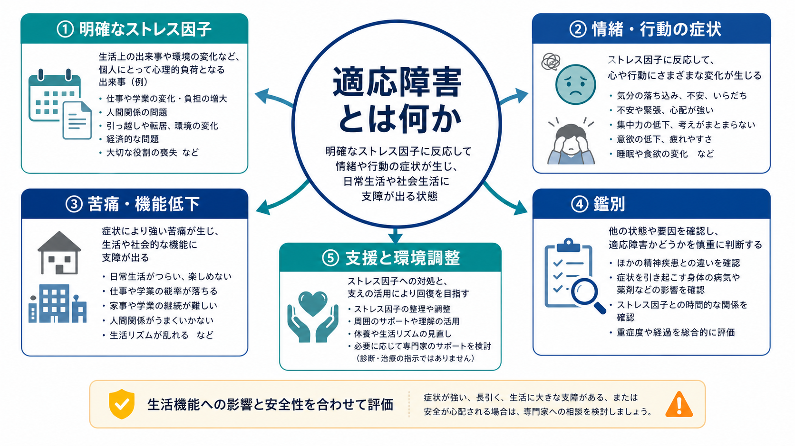
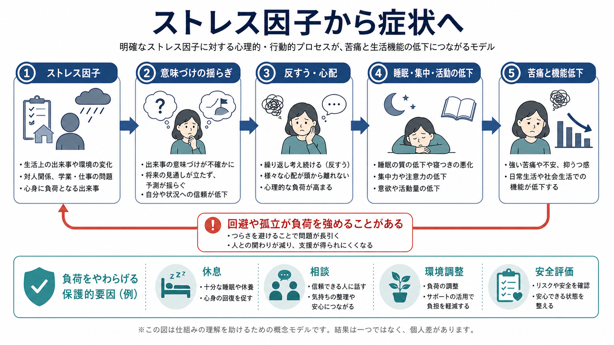
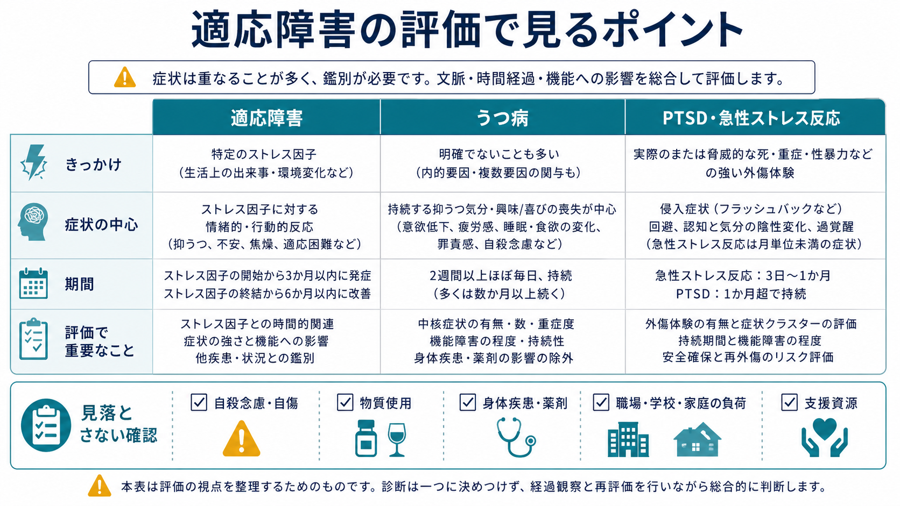

# 適応障害とは何か

## 要点

- 適応障害とは、明確に同定できる心理社会的ストレス因子への反応として、情緒面または行動面の症状が生じ、本人の苦痛や生活機能低下が臨床的に問題となる状態である[1][2]。
- DSM-5-TR 系の整理では、ストレス因子の出現から3か月以内に症状が始まり、ストレス因子やその結果が終わった後は6か月を超えて持続しないことが目安になる[1][3]。
- ICD-11 では、ストレス因子やその結果へのとらわれと、生活上の適応困難が中核に置かれる。通常はストレス因子から1か月以内に出現し、ストレス因子が長く続かない限り6か月以内に軽快する[2]。
- 「うつ病ほど重くない」というだけの診断ではない。[[うつ病とは何か]]、[[不安症群とは何か]]、PTSD、複雑な悲嘆、物質使用、身体疾患などとの[[鑑別診断とは何か|鑑別診断]]が必要である[1][2]。
- 教育・研究目的の整理であり、個別の診断や治療指示ではない。自殺念慮、自傷、強い衝動性、著しい不眠、物質使用、身体症状がある場合は、安全評価と専門的支援が優先される。

## この記事で答える問い

1. 適応障害は、通常のストレス反応や一時的な落ち込みと何が違うのか。
2. DSM-5-TR と ICD-11 では、どのような点が重視されるのか。
3. うつ病、PTSD、不安症、悲嘆、燃え尽きとどう見分け始めるのか。
4. 臨床や研究では、どこまで分かっていて、どこに注意が必要なのか。

## まず結論

適応障害は、「ストレスがあるからつらい」という日常語だけでは捉えきれない。診断概念としては、**同定できるストレス因子**、**症状の出現時期**、**苦痛または機能低下**、**他の精神疾患でよりよく説明されないこと**を合わせて見る枠組みである[1][2]。

重要なのは、原因探しを単純化しすぎないことである。失職、離婚、職場葛藤、介護、病気、経済的困難、学校や家庭の変化などは、発症の文脈を理解する手がかりになる。しかし、同じ出来事でも反応は人によって異なり、症状の強さ、持続、生活への影響、安全性、支援資源を見なければ臨床的な意味は判断できない。

## 背景

適応障害は、外来、リエゾン精神医学、産業保健、学校臨床、災害・事故後支援などで頻繁に使われる診断名である。Merck Manual Professional Edition は、外来精神医療を受診する患者の5から20%にみられると説明しているが、人口ベースの有病率推定は基準や調査法によって幅が大きい[3]。

この診断名がよく使われる一方で、研究上は扱いにくい面もある。Baumeister らは、従来の DSM-IV や ICD-10 における「抑うつ気分を伴う適応障害」の概念が、うつ病との境界や重症度の扱いで曖昧さを残していたと批判した[7]。ICD-11 が「とらわれ」と「適応困難」を中核に置いたことは、この曖昧さを減らす試みとして理解できる[2][5]。

## 基本概念

### ストレス因子が同定できる

適応障害では、症状の背景に、本人にとって意味のあるストレス因子がある。単一の出来事だけでなく、複数の出来事、慢性的な問題、発達上の節目、集団全体に影響する出来事も含まれる[3]。

ただし、「ストレス因子がある」ことだけでは適応障害とはいえない。うつ病、不安症、PTSD、短期精神病性障害、身体疾患、薬剤、物質使用でも、ストレスを契機に症状が出ることがある。したがって、[[短期精神病性障害とは何か]]や[[PTSDでは恐怖記憶ネットワークに何が起きているのか]]のような近接概念との区別が重要になる。

### 症状は情緒・行動・生活機能に現れる

症状は、抑うつ気分、不安、焦り、怒り、涙もろさ、不眠、集中困難、回避、欠勤・欠席、対人摩擦、衝動的行動などとして現れうる。DSM-5-TR 系の整理では、苦痛がストレス因子の強度や文脈に比して顕著であること、または社会・職業・学業などの機能低下があることが重視される[1][3]。

この点で、適応障害は「気分の問題」だけではない。生活のリズム、役割、対人関係、職場・学校・家庭での負荷、支援の有無が症状を維持することがある。[[生物心理社会モデルとは何か]]は、この多層的な見方と相性がよい。

### 期間と経過を見る

DSM-5-TR 系では、ストレス因子の始まりから3か月以内の発症が目安であり、ストレス因子やその結果が終わった後、症状は6か月を超えて持続しないとされる[1][3]。ICD-11 では、通常はストレス因子から1か月以内に出現し、ストレス因子が持続しない限り6か月以内に軽快することが典型とされる[2]。

この期間基準は、機械的に日数を数えるためだけのものではない。急性の危機反応、慢性化するうつ病、不安症、PTSD、複雑な悲嘆、環境負荷が持続している状態を分けて考えるための臨床的な目安である。

## 仕組み

適応障害の仕組みは、単純な「ストレス量が多いから症状が出る」という直線モデルでは説明しにくい。むしろ、ストレス因子が本人の予測、役割、自己評価、将来見通しを揺らし、その意味づけに注意が固定され、睡眠、活動、対人接触、問題解決が乱れるという循環で考えると理解しやすい。

ICD-11 の中核である「とらわれ」は、ストレス因子やその結果についての過度な心配、反復する苦痛な考え、反すうとして現れる[2][5]。このとらわれは、問題解決を助ける場合もあるが、睡眠や集中を妨げ、活動を減らし、人との接触を避ける方向に進むと、症状と生活機能低下を互いに強める。

防御的な回避も同じである。つらい場所、人、書類、連絡、会議、学校、職場から距離を置くことは短期的には苦痛を下げる。しかし、重要な課題が先送りされ、孤立が進み、周囲との調整機会が減ると、ストレス因子の影響はむしろ大きくなることがある。

## 図解

この記事の図は、診断を確定するためのフローチャートではなく、評価で見落としやすい軸を整理するための概念図である。適応障害を考えるときは、次の3つを同時に見る。

| 見る軸 | 確認すること | 関連する鑑別 |
|---|---|---|
| きっかけ | 何が、いつ、どの程度続いているか | 急性ストレス反応、PTSD、悲嘆 |
| 症状 | 抑うつ、不安、不眠、怒り、回避、衝動性 | [[うつ病とは何か]]、[[不安症群とは何か]] |
| 生活機能と安全性 | 仕事、学業、家庭、対人関係、自傷・自殺リスク | [[自殺リスク評価では何を聞くべきか]] |

## 臨床・研究との接続

### 鑑別診断

適応障害は、他の精神疾患でよりよく説明される場合には診断の中心に置かれない[1][2]。たとえば、2週間以上にわたって抑うつ気分または興味・喜びの低下がほぼ毎日続き、睡眠、食欲、疲労、罪責感、集中困難、自殺念慮などを伴う場合は、[[うつ病とは何か]]や大うつ病エピソードの評価が必要になる。

外傷体験後に、侵入症状、回避、現在の脅威感、過覚醒などが中核になる場合は PTSD の評価が必要である。強い不安が多くの領域に広がり、制御困難な心配として持続する場合は[[不安症群とは何か]]との鑑別が問題になる。睡眠問題が中心であれば[[不眠とは何か]]、強い悲嘆が中心なら長引く悲嘆反応との区別も必要になる。

### 安全評価

適応障害は軽症ラベルとして扱われることがあるが、安全評価を省略してよい診断名ではない。Casey らは、適応障害と抑うつエピソードにおける自殺関連行動を比較し、適応障害でも自殺関連行動が臨床上重要になりうることを示した[6]。希死念慮、自殺念慮、自傷、衝動性、飲酒・薬物、孤立、急な喪失、手段へのアクセスは、診断名とは別に確認する。

### 支援と治療研究

支援では、ストレス因子を明確にし、変えられる負荷と変えにくい負荷を分け、睡眠、活動、相談先、職場・学校・家庭での調整、安全計画を整えることが基本になる。薬物療法は、併存するうつ病、不安症、不眠などがある場合には検討対象になりうるが、適応障害そのものに対する薬物療法のエビデンスは限定的である[3][8]。

治療研究では、2025年のランダム化比較試験のシステマティックレビュー・メタ解析が、インターネット型および対面型の認知行動療法が症状改善に有効である可能性を示した。ただし、研究数や介入の異質性があり、他の治療戦略についてはさらに検証が必要である[8]。

### 予後

適応障害はしばしば短期的で可逆的な反応として説明される。しかし、成人の予後に関するシステマティックレビューでは、数か月から数年後にも適応障害診断が持続したり、別の精神疾患診断へ移行したりする例が少なくないことが報告されている[4]。そのため、「ストレスがなくなれば必ずすぐ治る」と決めつけず、経過観察と再評価を行う必要がある。

## よくある誤解

### 誤解1: 適応障害は本人の弱さである

適応障害は性格の弱さを意味する言葉ではない。診断概念としては、ストレス因子、症状、機能低下、時間経過、鑑別を組み合わせて記述する枠組みである[1][2]。

### 誤解2: うつ病ではないなら安全である

うつ病の基準を満たさないことは、安全を意味しない。適応障害でも、自殺念慮、自傷、衝動性、物質使用、著しい不眠、孤立が重なる場合は、[[自殺リスク評価では何を聞くべきか|自殺リスク評価]]と支援計画が必要である[6]。

### 誤解3: ストレス因子があるなら、すべて適応障害である

ストレス因子は多くの精神症状の誘因になりうる。適応障害と考えるには、他の精神疾患や身体疾患、薬剤、物質使用でよりよく説明されないかを確認する必要がある[1][2]。これは[[鑑別診断とは何か]]の基本である。

### 誤解4: 治療は休職か薬のどちらかである

支援は二択ではない。休息、業務・学業負荷の調整、睡眠と活動の回復、問題解決、家族・職場・学校との調整、心理療法、安全計画、併存症への治療を組み合わせる。薬物療法は必要な場合があるが、適応障害そのものへの標準的薬物療法として単純化するのは避ける[3][8]。

## 関連ノート

- [[抑うつを伴う適応障害とは何か]]
- [[うつ病とは何か]]
- [[不安症群とは何か]]
- [[不安とは何か]]
- [[不眠とは何か]]
- [[鑑別診断とは何か]]
- [[DSMとICDは何が違うのか]]
- [[生物心理社会モデルとは何か]]
- [[自殺リスク評価では何を聞くべきか]]

### MOC更新候補

- `content/00_MOC/` 配下の精神医学、疾患・症候群、ストレス関連障害、診断概念に関する MOC があれば、バッチ統合時に `[[適応障害とは何か]]` を追加する候補。
- 並列ジョブとの競合を避けるため、このタスクでは MOC 本体を更新しない。

### 今後の作成候補

- 「急性ストレス反応とは何か」
- 「燃え尽きと適応障害はどう違うのか」
- 「職場ストレスと精神症状をどう評価するか」
- 「長引く悲嘆症とは何か」

## 理解チェック

1. 適応障害を考えるとき、ストレス因子の有無だけでなく、どの4つの軸を見る必要があるか。
2. DSM-5-TR 系と ICD-11 では、発症時期と経過の目安にどのような違いがあるか。
3. 適応障害とうつ病を区別するとき、抑うつ気分以外に何を確認する必要があるか。
4. 「適応障害だから軽い」と判断してしまうと、どのような安全上の見落としが起こりうるか。

## 未解決問題

- 適応障害からうつ病、不安症、PTSD などへ移行する予測因子は、まだ十分に確立していない[4]。
- ICD-11 に基づく評価尺度は整備されつつあるが、文化差、臨床面接との一致、一般集団と臨床集団でのカットオフには検証課題が残る[5]。
- 心理療法、環境調整、職場・学校介入、薬物療法をどの順序・強度で組み合わせるべきかについて、質の高い比較研究はまだ限られている[8]。

## 参考文献

[1] American Psychiatric Association. (2022). *Diagnostic and Statistical Manual of Mental Disorders, Fifth Edition, Text Revision (DSM-5-TR).* American Psychiatric Association Publishing. https://doi.org/10.1176/appi.books.9780890425787

[2] World Health Organization. (2026). *ICD-11 for Mortality and Morbidity Statistics: 6B43 Adjustment disorder.* https://icd.who.int/browse/2026-01/mms/en#264310751

[3] Barnhill, J. W. (2026). *Adjustment Disorders.* Merck Manual Professional Edition. https://www.merckmanuals.com/professional/psychiatric-disorders/anxiety-and-trauma-and-stressor-related-disorders/adjustment-disorders

[4] Morgan, M. A., Kelber, M. S., Bellanti, D. M., Beech, E. H., Boyd, C., Galloway, L., Ojha, S., Garvey Wilson, A. L., Otto, J., & Belsher, B. E. (2022). Outcomes and prognosis of adjustment disorder in adults: A systematic review. *Journal of Psychiatric Research, 156*, 498-510. https://doi.org/10.1016/j.jpsychires.2022.10.052

[5] Shevlin, M., Hyland, P., Ben-Ezra, M., Karatzias, T., Cloitre, M., Vallières, F., Bachem, R., & Maercker, A. (2020). Measuring ICD-11 adjustment disorder: The development and initial validation of the International Adjustment Disorder Questionnaire. *Acta Psychiatrica Scandinavica, 141*(3), 265-274. https://doi.org/10.1111/acps.13126

[6] Casey, P., Jabbar, F., O'Leary, E., & Doherty, A. M. (2015). Suicidal behaviours in adjustment disorder and depressive episode. *Journal of Affective Disorders, 174*, 441-446. https://doi.org/10.1016/j.jad.2014.12.003

[7] Baumeister, H., Maercker, A., & Casey, P. (2009). Adjustment disorder with depressed mood: A critique of its DSM-IV and ICD-10 conceptualisations and recommendations for the future. *Psychopathology, 42*(3), 139-147. https://doi.org/10.1159/000207455

[8] Cowansage, K. P., Milligan, T., Morgan, M. A., Boyd, C., Bellanti, D. M., Nair, R., Shank, L. M., Smolenski, D., Evatt, D. P., & Kelber, M. S. (2025). Treatments for adjustment disorder: A systematic review and meta-analysis of randomized controlled trials. *Psychiatry Research, 353*, 116739. https://doi.org/10.1016/j.psychres.2025.116739
