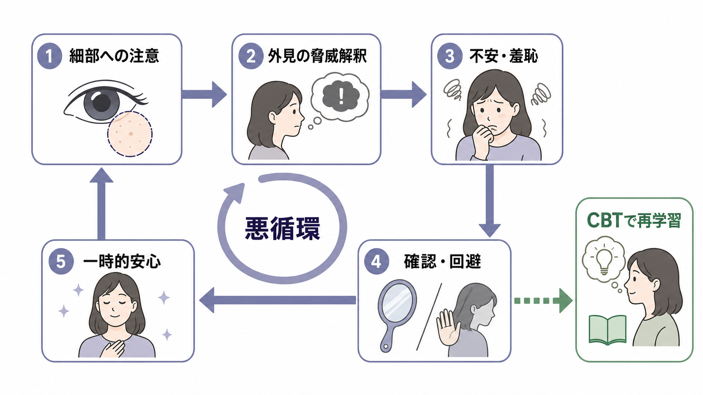

# 選択性緘黙とは何か

## 要点

- 選択性緘黙は、話す能力があるにもかかわらず、学校など「話すことが期待される特定の社会的状況」で一貫して話せなくなる状態である[1]。
- DSM-5-TR では不安症群に位置づけられ、本人が「わざと話さない」状態ではなく、不安、回避、凍りつき、場面依存性を中心に理解する[1][2]。
- 家庭では話せる、学校では話せない、特定の教師や同級生の前だけ声が出ないなど、場面・相手・課題による差が重要な手がかりになる[1]。
- 評価では、[[緘黙とは何か]]、[[鑑別診断とは何か]]、言語・聴覚・発達特性、多言語環境、学校での要求水準を合わせて見る。
- 支援は「話させる圧力」ではなく、不安が低い条件から発話・非言語的応答・参加を段階的に広げる発想が中心になる[1][6][7]。

## この記事で答える問い

1. 選択性緘黙は、単なる内気や反抗と何が違うのか。
2. なぜ「話せる場面」と「話せない場面」が分かれるのか。
3. 不安症、社交不安、発達・言語特性、学校環境はどのように関係するのか。
4. 臨床・研究では、どのような点を評価すべきか。

## まず結論

選択性緘黙は、発話能力そのものの全面的な欠如ではなく、「特定の社会的場面で発話が出力されにくくなる」不安関連の病態である。典型的には、家庭や安心できる相手の前では話せる一方、学校、園、面接場面、見知らぬ相手、発表や音読のような評価場面では声が出なくなる[1][2]。

このため、最初に問うべきことは「なぜ話さないのか」ではなく、「どの条件では話せて、どの条件では発話が止まるのか」である。発話は、言語知識だけでなく、相手との親密度、注目される感覚、失敗予測、身体の覚醒、声量、順番、教師や支援者の問い方によって大きく変わる。選択性緘黙では、これらの条件が不安反応と結びつき、発話開始を止める。

## 背景

選択性緘黙は、かつて "elective mutism" と呼ばれ、本人が選んで話さないかのように理解されやすかった。しかし現在は、本人の意志的拒否ではなく、不安に基づく条件依存的な発話困難として整理される[2]。ASHA は、"selective" という語を「本人が自由に話す場面を選んでいる」という意味ではなく、話せる状況が限られるという意味で説明している[1]。

DSM-5-TR の整理では、選択性緘黙は不安症群に含まれる。診断的には、特定の社会的状況で一貫して話せないこと、教育・職業・社会的コミュニケーションに支障があること、少なくとも1か月以上続くこと、言語知識の不足やコミュニケーション症、自閉スペクトラム症、精神病性障害だけでは説明できないことが重視される[1]。

有病率の推定は研究方法によって幅があるが、レビューではおおむねまれな児童期発症の状態として扱われる。ASHA は研究により 0.2-1.6% 程度の幅があると整理しており、DSM-5 に基づく記述では 0.03-1% 程度とされることもある[1][8]。発症はしばしば5歳未満だが、就園・就学後に「場面差」が目立って気づかれることが多い[1][5]。

## 基本概念

### 中核は場面依存性である

選択性緘黙で重要なのは、発話の有無が全場面で一様ではない点である。家庭では普通に話すが、学校ではうなずき、指差し、表情、筆談だけになる。ある教師の前では話せないが、親しい同級生とは小声で話せる。発表や音読では固まるが、遊びの中では短い語が出る。こうした差は「矛盾」ではなく、病態理解の中心的な情報である。

### 不安症との関係

選択性緘黙は、社交不安、分離不安、全般不安、特定恐怖などと併存しうる[1][2]。特に社交不安との重なりは大きく、発話が「評価される行為」として経験されると、声を出すこと自体が脅威刺激になる。[[パニック発作とは何か]]で扱うような急激な身体反応とは形が異なっても、凍りつき、視線回避、身体の硬さ、表情の乏しさ、返答までの長い沈黙として不安が現れることがある[1]。

ただし、選択性緘黙を「社交不安の一部」とだけ見てしまうと不十分である。言語発達、発音、語用論、聴覚、多言語環境、発達特性、学校での要求、家族と教師の応答パターンが絡むことがある[1][3]。ここでは、[[ケースフォーミュレーションとは何か]]や[[ストレス脆弱性モデルとは何か]]のように、個人要因と環境要因の相互作用として見る方が実用的である。

### 内気・反抗・言語障害との違い

内気な子どもも、初対面や注目される場面で話しにくくなることがある。しかし選択性緘黙では、発話困難が持続し、教育・社会参加・評価場面に支障をきたしうる[1]。また、反抗や礼儀の問題として理解すると、本人の不安と凍りつきを見落とし、叱責や圧力によってさらに話しにくくする危険がある。

言語障害や構音障害では、場面を超えて言語理解、呼称、復唱、発音、流暢性などに問題が出ることが多い。選択性緘黙では、安心できる場面での発話能力が保たれることが重要な手がかりになる。ただし、選択性緘黙と言語・発音・語用論上の弱さは併存しうるため、どちらか一方に決めつけない[1][3]。

## 仕組み

選択性緘黙を理解するうえで役立つのは、不安、回避、短期的安心、長期的維持のサイクルである。

発話が期待される場面では、本人にとって「声を出すこと」が注目、失敗、評価、予測不能な反応と結びつく。すると身体は fight-flight-freeze のうち、とくに freeze に近い状態へ入り、視線が合わない、表情が固まる、声が出ない、動作が小さくなる、返答まで非常に時間がかかるといった形で現れる[1]。

周囲が急いで代弁したり、質問を取り下げたりすると、その瞬間の不安は下がる。これは本人を責めるべきことではなく、自然な保護反応である。しかし学習理論的には、「話さないことで危険を避けられた」という経験が強まり、次の類似場面でも発話開始が難しくなる。したがって支援では、急に大きな発話を求めるのではなく、成功しやすい小さな応答から段階的に広げる必要がある[1][6][7]。

また、選択性緘黙の背景には単一原因を想定しにくい。レビューでは、行動学習、社交不安、抑制的気質、遺伝的脆弱性、家族・学校環境、発達・言語要因を統合的に見る必要が示されてきた[2][3]。この点は、[[カテゴリ診断と次元診断は何が違うのか]]で扱う「診断名」と「困難の次元」を分ける考え方とも接続する。

## 図解

選択性緘黙を見立てるときは、次のように比較すると誤解が減る。

| 観点 | 選択性緘黙 | 内気・恥ずかしがり | 反抗・わざと話さない |
|---|---|---|---|
| 場面依存性 | 家庭などでは話せるが、学校・評価場面などで止まる | 新奇場面で話しにくいが、慣れると広がりやすい | 状況や関係性により拒否的態度として出ることがある |
| 本人の困り感 | 話したくても声が出ない、固まる、避ける | 緊張はあるが機能障害は軽いことも多い | 意図、怒り、交渉、関係葛藤の評価が必要 |
| 不安との関係 | 中核的に関わることが多い | 性格傾向や発達段階として理解できる場合もある | 不安だけでは説明しない |
| 評価の方向 | 場面差、言語・発達、学校環境、併存不安を見る | 持続性と生活支障を見る | 叱責前に不安・発達・家庭学校文脈を確認する |

## 臨床・研究との接続

### 評価

評価では、本人だけでなく、家族、学校、支援者から複数場面の情報を集める。家庭での発話、学校での非言語応答、特定の相手との違い、音読・発表・挨拶・自由遊びなど活動ごとの差を分ける。ASHA は、親・教師の報告、観察、聴覚スクリーニング、言語・コミュニケーション評価を含めた包括的評価を重視している[1]。

多言語環境では、第二言語への不慣れだけで話さない場合と選択性緘黙を区別する必要がある[1][4]。また、急性発症、意識障害、神経症状、カタトニア、重度の抑うつ、トラウマ反応、失語、聴覚障害が疑われる場合は、選択性緘黙という発達・不安症の枠だけで見ない。[[鑑別診断とは何か]]の発想で、時間経過、場面差、身体・神経学的所見を確認する。

### 支援

本稿は治療指示ではないが、研究・臨床上は、認知行動療法的な段階的曝露、シェイピング、強化、学校と家庭の連携が中心的に検討されてきた[5][6][7]。Oerbeck らの5年追跡研究では、学校ベースのCBT後に多くの子どもで診断基準を満たさなくなる一方、社交不安が残る例や話すことへの困難感が続く例も示された[5]。

2023年の長期予後レビューは、選択性緘黙の症状は追跡中に改善する例が多い一方、研究数、サンプルサイズ、評価法には限界があるとまとめている[6]。2025年の行動療法メタ分析でも、SMQ や SSQ の得点改善が報告されるが、対面介入、オンライン介入、研究デザイン、年齢、重症度によって解釈には注意が必要である[8]。

### 研究上の測定

研究では、単に「発話したか」だけでなく、誰の前で、どの場所で、どの課題で、どの程度自発的に、どの声量で、非言語的応答がどう変わったかを測る必要がある。選択性緘黙は、診断名としてはカテゴリだが、実際の困難は「発話場面の広がり」「不安」「回避」「社会参加」「学校機能」という複数次元に分かれる。

## よくある誤解

### 「本人が頑固だから話さない」

これは最も避けたい誤解である。選択性緘黙では、本人が安心できる場面では話せる一方、特定の社会的状況では強い不安や凍りつきにより発話が止まる[1]。叱責や強制は、発話場面をさらに脅威化する可能性がある。

### 「家では話せるなら問題ではない」

家で話せることは、むしろ選択性緘黙を考える重要な手がかりである。問題の有無は、家庭での発話だけでなく、学校参加、友人関係、評価場面、助けを求める力、安全確認、本人の苦痛から判断する。

### 「時間がたてば必ず自然に治る」

改善する例はあるが、全例で自然に解決すると考えるのは危険である。長期予後研究では、症状が軽くなる一方で、社交不安や発話困難感が残る例も報告されている[5][6]。

### 「質問を増やせば話す練習になる」

質問を増やすだけでは、注目される感覚と失敗予測を強めることがある。評価では、選択肢、指差し、筆談、親しい相手との小声、録音、短い音声など、本人が成功しやすい応答様式から段階づける発想が重要である[1][7]。

## 関連ノート

- [[緘黙とは何か]]
- [[鑑別診断とは何か]]
- [[ケースフォーミュレーションとは何か]]
- [[ストレス脆弱性モデルとは何か]]
- [[カテゴリ診断と次元診断は何が違うのか]]
- [[パニック発作とは何か]]

### 関連ノート候補

- 社会不安症とは何か
- 小児期の不安症とは何か
- 言語発達と不安はどう関係するのか
- 学校場面での合理的配慮とは何か
- 選択性緘黙の評価尺度とは何か

### MOC更新候補

- `content/00_MOC/MOC｜精神医学.md`
- `content/00_MOC/MOC｜症候学.md`
- `content/00_MOC/MOC｜発達・愛着・社会心理.md`

並列ジョブとの競合を避けるため、本記事作成では MOC 本体は更新しない。

## 理解チェック

1. 選択性緘黙で「選択性」と呼ばれるのは、本人が意図的に話す場面を選ぶという意味ではない。では何を指すか。
2. 家庭で話せることは、なぜ「問題がない証拠」ではなく、評価上の重要な情報になるのか。
3. 選択性緘黙と内気を区別するとき、どのような生活上の支障を見るべきか。
4. 周囲が代弁し続けることは、短期的には助けになる一方で、どのように発話困難を維持しうるか。
5. 評価で言語・聴覚・多言語環境・発達特性を確認する理由は何か。

## 参考文献

[1] American Speech-Language-Hearing Association. *Selective Mutism*. ASHA Practice Portal. https://www.asha.org/practice-portal/clinical-topics/selective-mutism/

[2] Wong, P. (2010). Selective mutism: A review of etiology, comorbidities, and treatment. *Psychiatry (Edgmont), 7*(3), 23-31. https://pmc.ncbi.nlm.nih.gov/articles/PMC2861522/

[3] Viana, A. G., Beidel, D. C., & Rabian, B. (2009). Selective mutism: A review and integration of the last 15 years. *Clinical Psychology Review, 29*(1), 57-67. https://doi.org/10.1016/j.cpr.2008.09.009

[4] Slobodin, O. (2023). Beyond the language barrier: A systematic review of selective mutism in culturally and linguistically diverse children. *Transcultural Psychiatry, 60*(2), 313-331. https://doi.org/10.1177/13634615221146435

[5] Oerbeck, B., Overgaard, K. R., Stein, M. B., Pripp, A. H., & Kristensen, H. (2018). Treatment of selective mutism: A 5-year follow-up study. *European Child & Adolescent Psychiatry, 27*, 997-1009. https://pmc.ncbi.nlm.nih.gov/articles/PMC6060963/

[6] Koskela, M., Ståhlberg, T., Yunus, W. M. A. W. M., & Sourander, A. (2023). Long-term outcomes of selective mutism: A systematic literature review. *BMC Psychiatry, 23*, 779. https://doi.org/10.1186/s12888-023-05279-6

[7] Rodrigues Pereira, C., Ensink, J. B. M., Güldner, M. G., et al. (2023). A systematic review and meta-analysis of nonpharmacological interventions for children and adolescents with selective mutism. *European Child & Adolescent Psychiatry*. https://pmc.ncbi.nlm.nih.gov/articles/PMC10501694/

[8] Iimura, D., Tsujita, N., Aoki, M., & Hagihara, H. (2025). Meta-analysis of behavioral treatments for selective mutism: findings from selective mutism questionnaire (SMQ) and school speech questionnaire (SSQ). *Child and Adolescent Psychiatry and Mental Health, 19*, 40. https://doi.org/10.1186/s13034-025-00891-8

## 未解決問題

- 選択性緘黙、社交不安、発達特性、言語環境を分けて長期予後を予測するモデルはまだ十分ではない。
- 学校ベース支援で、どの構成要素が最も効果に寄与するかは、研究デザインによって切り分けが難しい。
- 多言語環境や文化的規範の違いを、診断・評価・支援計画にどう組み込むかは今後も重要な課題である。
