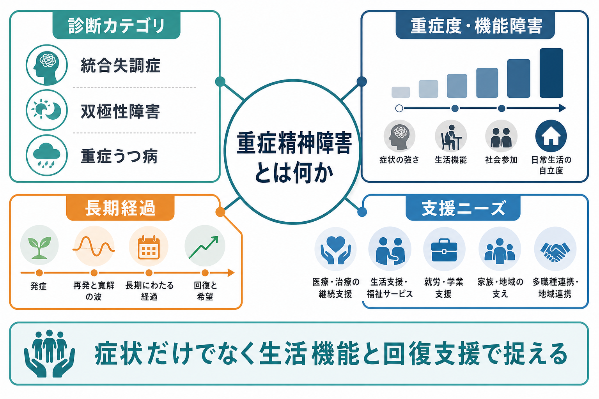
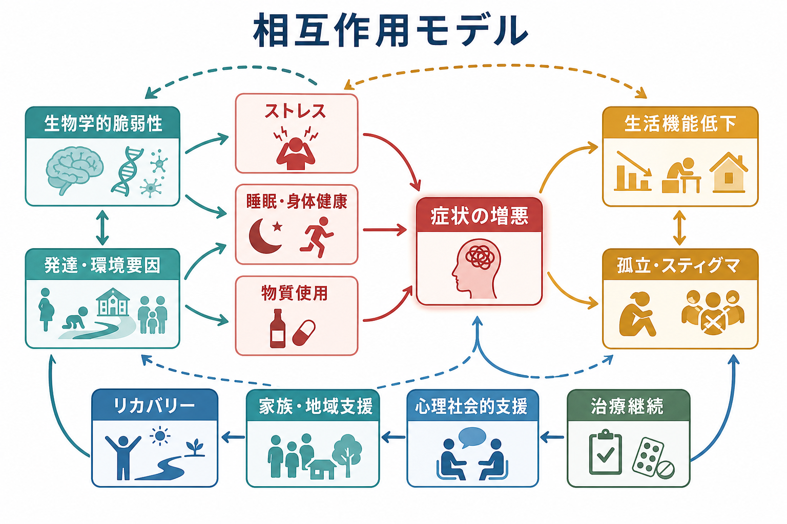
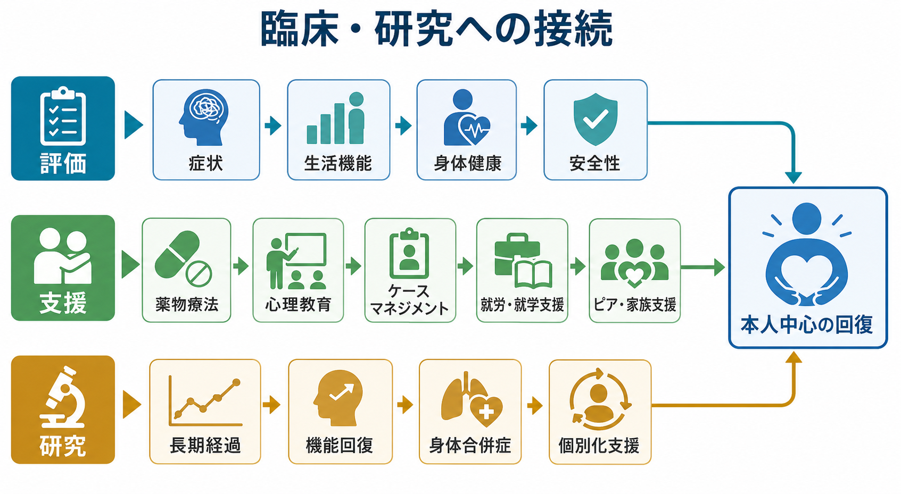

# 重症精神障害とは何か

## 要点

- 重症精神障害、または serious mental illness: SMI は、特定の病名だけを指す語ではなく、診断可能な精神疾患が生活・学業・就労・対人関係などの主要な生活領域を大きく妨げる状態を指す操作的概念である[1][2]。
- 代表例として [[統合失調症とは何か|統合失調症]]、[[双極性障害とは何か|双極性障害]]、[[大うつ病性障害とは何か|大うつ病性障害]]の重症例が挙げられるが、診断名だけで重症度は決まらない[2][3]。
- 評価では、陽性症状・躁うつ症状・不安・自殺リスクだけでなく、認知機能、身体健康、服薬継続、住まい、家族負担、就労・就学、孤立、スティグマを同時に見る必要がある[4][5][6]。
- 支援の目標は「症状を消すこと」だけではなく、本人中心の回復、権利擁護、地域生活、身体健康、社会参加を支えることである[4][5]。

## この記事で答える問い

1. 重症精神障害は、どのような基準で「重症」と呼ばれるのか。
2. 統合失調症、双極性障害、重症うつ病は、なぜ同じ枠組みで扱われることがあるのか。
3. 症状、生活機能、長期経過、支援ニーズをどう分けて考えるべきか。
4. 臨床・研究・地域支援では、この概念をどのように使うのか。

## まず結論

重症精神障害とは、「この診断名なら重症」という固定ラベルではない。むしろ、精神疾患によって、本人の生活機能、自己管理、対人関係、就労・就学、身体健康、安全性、社会参加が長期にわたり大きく制約され、継続的な医療・福祉・心理社会的支援を必要とする状態を指す。SAMHSA と NIMH は、SMI を、成人における診断可能な精神・行動・情緒の障害で、主要な生活活動を実質的に妨げる機能障害を伴うものとして説明している[1][2]。

この定義では、診断名、症状の強さ、入院歴だけでは不十分である。たとえば同じ [[統合失調症とは何か|統合失調症]] でも、症状が安定し地域生活を送る人もいれば、再発、認知機能障害、身体合併症、住居不安、孤立が重なり、集中的支援を必要とする人もいる。逆に、[[大うつ病性障害とは何か|大うつ病性障害]] でも、精神病症状、反復再発、自殺リスク、長期休職、身体疾患が重なる場合には、重症精神障害の支援枠組みで考える意義がある[2][3][6]。

## 背景

精神医学の診断分類は、症状のまとまりを同定し、研究や治療選択を共有するために役立つ。ICD-11 CDDR は、精神・行動・神経発達症を臨床的に識別するための標準的な記述と診断要件を提供している[3]。しかし、分類診断だけでは、「どれくらい生活が難しくなっているか」「どの支援が必要か」「どの回復目標を本人が重視しているか」は十分に表せない。

重症精神障害という語は、この不足を補うために使われる。特に地域精神医療、福祉制度、疫学研究、身体健康支援、就労支援では、診断名を横断して、長期的な支援ニーズと生活機能を把握する必要がある。WHO の地域精神保健サービスのガイダンスも、精神健康上の困難をもつ人に対して、施設中心ではなく、本人中心・権利基盤・地域生活を支えるサービスへ転換する重要性を強調している[4]。

## 基本概念

### 重症度は三層で考える

重症精神障害の「重症」は、少なくとも三つの層に分けて考えると整理しやすい。

| 層 | 見るもの | 例 |
|---|---|---|
| 症状の重症度 | 幻覚・妄想、躁状態、抑うつ、自殺念慮、不安、興奮、陰性症状 | [[統合失調症の陽性症状とは何か]]、[[躁病エピソードとは何か]]、[[精神病性うつ病とは何か]] |
| 生活機能の障害 | 家事、金銭管理、通院、服薬、睡眠、対人関係、就労・就学、セルフケア | [[精神科で生活機能をどう評価するか]]、[[GAFやWHODASは何を評価するのか]] |
| 支援ニーズ | 継続医療、ケースマネジメント、訪問支援、家族支援、住居、就労支援、身体健康管理 | [[地域連携は精神科診療で何を意味するのか]]、[[精神科で多職種連携はなぜ重要なのか]]、[[心理教育とは何か]] |

この三層を分けると、「症状は軽くなったが生活機能が戻らない」「症状は残るが本人の生活目標は達成されつつある」「再発予防より住まいの安定が先に必要である」といった臨床的判断が見えやすくなる。

### 代表的な対象

SMI という枠組みでよく扱われるのは、統合失調症スペクトラム、双極性障害、重症または反復性の大うつ病である[2][3]。ただし、境界性パーソナリティ障害、複雑な物質使用、重い PTSD、発達特性と二次障害、神経認知障害、身体疾患を背景にした精神症状などでも、長期の機能障害と多職種支援を要する場合がある。したがって、重症精神障害は「疾患リスト」ではなく、「病態と支援ニーズの組み合わせ」として扱う方が正確である。

## 仕組み

重症精神障害が長期化する背景には、単一の原因ではなく、複数のリスクと保護因子の相互作用がある。生物学的脆弱性、神経発達、遺伝的リスク、トラウマ、貧困、孤立、睡眠障害、物質使用、身体疾患、服薬中断、スティグマ、サービスへのアクセス困難が重なると、症状と生活機能の悪循環が生じやすい[4][5][6]。

### 症状と機能障害は同じではない

症状の軽減は重要だが、それだけで回復を測ると不十分である。統合失調症では、幻覚・妄想が落ち着いても、[[統合失調症の認知機能障害とは何か|認知機能障害]]、[[統合失調症の陰性症状とは何か|陰性症状]]、対人不安、身体合併症が残り、社会参加を妨げることがある。双極性障害では、躁うつエピソードの間欠期にも睡眠・概日リズム、認知機能、再発不安、服薬継続の問題が残ることがある。大うつ病では、抑うつ気分が改善しても、疲労、集中困難、復職不安、自殺リスク、身体疾患が支援課題として残ることがある[3][5]。

### 身体健康と死亡率

重症精神障害を考えるうえで、身体健康は中心課題である。精神疾患をもつ人では、自然死と非自然死の両方を含む死亡リスクの上昇が報告されており、Walker らの系統的レビュー・メタ解析は、精神疾患全体で死亡率の上昇と寿命短縮が大きな公衆衛生課題であることを示した[6]。背景には、自殺、事故、物質使用だけでなく、心血管疾患、糖尿病、喫煙、肥満、医療アクセス、薬剤副作用、身体疾患の見逃しが関わる。したがって、[[身体合併症は精神科診療でなぜ重要なのか]]、睡眠、運動、栄養、一般医療との連携は、重症精神障害支援の周辺事項ではない。

## 図解

1枚目は、重症精神障害を「診断カテゴリ」「重症度・機能障害」「長期経過」「支援ニーズ」の交差として示した。2枚目は、症状の増悪と生活機能低下を、脆弱性、ストレス、身体健康、物質使用、孤立、治療継続、心理社会的支援の相互作用として示した。3枚目は、評価・支援・研究がどのように本人中心の回復へ接続するかを整理している。

## 臨床・研究との接続

### 評価

評価では、現在の診断名だけでなく、発症年齢、再発回数、入院歴、治療中断、服薬アドヒアランス、認知機能、睡眠、物質使用、身体疾患、自殺・自傷リスク、暴力被害、住居、家族負担、金銭管理、就労・就学、法的・福祉制度の利用状況を確認する。これは診断を曖昧にするためではなく、診断と支援計画を接続するためである。

### 支援

NICE の複雑精神病リハビリテーションガイドラインは、長期回復を前向きに支えるために、リハビリテーションサービス、包括的アセスメント、ケア計画、心理社会的介入、身体健康支援を組み合わせることを扱っている[5]。WHO の地域精神保健ガイダンスも、危機対応、地域センター、アウトリーチ、ピアサポート、住まい、包括的サービスネットワークを、権利基盤で整備する方向を示している[4]。

就労支援では、IPS: Individual Placement and Support が代表的である。IPS のランダム化比較試験を対象にしたメタ解析では、通常支援と比べて競争的雇用の獲得などの職業アウトカムが改善することが示されている一方、生活の質や精神症状など非職業アウトカムは効果推定に不確実性も残る[7]。このため、就労支援は「働けばすべて回復する」という単純な処方ではなく、本人の希望、症状、体調、職場調整、福祉制度、治療継続を合わせて設計する必要がある。

### 研究

研究では、重症精神障害という枠組みは、診断横断的な機能障害、身体健康格差、サービス利用、長期予後、社会的決定要因、介入効果を調べるために役立つ。一方で、SMI は操作的概念であり、研究ごとに定義が異なる。統合失調症だけを対象にする研究、双極性障害や大うつ病を含める研究、機能障害やサービス利用で定義する研究では、結果の一般化可能性が変わる。研究を読むときは、SMI の定義、対象診断、重症度、追跡期間、アウトカムを確認する必要がある。

## よくある誤解

### 誤解1: 重症精神障害とは統合失調症のことである

統合失調症は代表的な対象だが、SMI は統合失調症だけを指す語ではない。双極性障害、重症うつ病、その他の長期機能障害を伴う精神疾患も含まれうる[2][3]。

### 誤解2: 入院歴がなければ重症ではない

入院歴は重要な情報だが、重症度の唯一の基準ではない。長期のひきこもり、就労困難、家族負担、身体疾患、治療中断、自殺リスク、住居不安があっても、入院していない場合はある。

### 誤解3: 症状が落ち着けば支援は終わる

症状の寛解と生活機能の回復は同じではない。再発予防、身体健康、服薬継続、社会参加、就労・就学、家族関係、セルフスティグマへの支援は、症状安定後にも重要である[4][5][7]。

### 誤解4: 重症精神障害は一生回復しない

重症精神障害は、長期支援を要しうるが、回復不能を意味しない。早期からの継続的支援、本人中心の目標設定、ピアサポート、家族支援、身体健康管理、住まいと仕事への支援によって、意味ある生活を取り戻す人は多い[1][4][5]。

## 関連ノート

- [[統合失調症とは何か]]
- [[双極性障害とは何か]]
- [[大うつ病性障害とは何か]]
- [[精神医学における回復とは何か]]
- [[地域連携は精神科診療で何を意味するのか]]
- [[精神科で多職種連携はなぜ重要なのか]]
- ケースマネジメントとは何か
- 精神科訪問看護とは何か
- IPS援助付き雇用とは何か
- [[身体合併症は精神科診療でなぜ重要なのか]]
- [[精神科で生活機能をどう評価するか]]

MOC更新候補: [[MOC｜精神医学]]、地域精神医療・精神科リハビリテーション関連の MOC。並列ジョブとの競合を避けるため、本記事では MOC 本体は更新していない。

## 理解チェック

1. SMI を診断名だけで定義すると、どのような支援ニーズを見落としやすいか。
2. 症状の重症度、生活機能の障害、支援ニーズはどのように違うか。
3. 重症精神障害で身体健康を評価する必要があるのはなぜか。
4. IPS のような就労支援は、薬物療法や心理教育とどのように補完し合うか。
5. 研究論文で SMI という語を見たとき、最初に確認すべき定義上のポイントは何か。

## 参考文献

[1] Substance Abuse and Mental Health Services Administration. Serious Mental Illness and Serious Emotional Disturbances. https://www.samhsa.gov/mental-health/serious-mental-illness/about

[2] National Institute of Mental Health. Mental Illness. https://www.nimh.nih.gov/health/statistics/mental-illness

[3] World Health Organization. (2024). *Clinical descriptions and diagnostic requirements for ICD-11 mental, behavioural and neurodevelopmental disorders*. https://www.who.int/publications/i/item/9789240077263

[4] World Health Organization. (2021). *Guidance on community mental health services: Promoting person-centred and rights-based approaches*. https://www.who.int/publications/i/item/9789240025707

[5] National Institute for Health and Care Excellence. (2020). *Rehabilitation for adults with complex psychosis: NICE guideline NG181*. https://www.ncbi.nlm.nih.gov/books/NBK562555/

[6] Walker, E. R., McGee, R. E., & Druss, B. G. (2015). Mortality in mental disorders and global disease burden implications: A systematic review and meta-analysis. *JAMA Psychiatry, 72*(4), 334-341. https://doi.org/10.1001/jamapsychiatry.2014.2502

[7] Frederick, D. E., & VanderWeele, T. J. (2019). Supported employment: Meta-analysis and review of randomized controlled trials of individual placement and support. *PLOS ONE, 14*(2), e0212208. https://doi.org/10.1371/journal.pone.0212208
