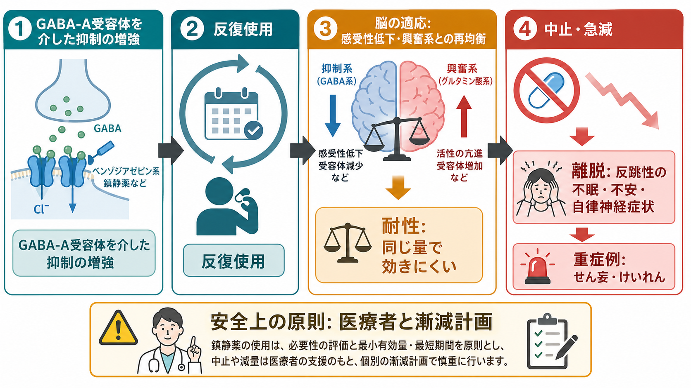
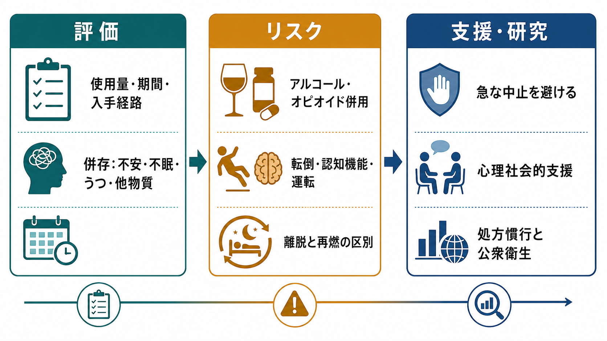

# 鎮静薬使用障害とは何か

## 要点

- 鎮静薬使用障害とは、ベンゾジアゼピン、Z薬、バルビツール酸系などの鎮静・催眠・抗不安作用をもつ薬物の使用が、制御困難、渇望、役割障害、危険な使用、耐性、離脱などを伴って生活機能や健康を損なう状態である。[1][2]
- 「長く飲んでいて離脱がある」ことは、ただちに「依存症」や「乱用」を意味しない。医療管理下で生じる身体依存・耐性と、害があっても使用を制御しにくい使用障害は区別して評価する必要がある。[1][4]
- ベンゾジアゼピンは GABA_A 受容体を介して抑制性神経伝達を強める。反復使用では脳がこの抑制入力に適応し、中止・急減時に不眠、不安、振戦、自律神経症状、重症例ではせん妄やけいれんが出ることがある。[3][6][7]
- アルコール、オピオイド、他の中枢神経抑制薬との併用は、鎮静、呼吸抑制、事故、過量摂取死亡のリスクを高めるため、評価では併用薬・物質を必ず見る。[3][8]
- 支援では、薬を使うに至った不安・不眠・痛み・トラウマ・生活背景を同時に扱う。急な中止を一律に促すのではなく、教育・研究目的の知識としては「リスク評価、共同意思決定、個別化された漸減、心理社会的支援」が中核になる。[4][7]

## この記事で答える問い

1. 鎮静薬使用障害は、通常の処方薬使用や身体依存と何が違うのか。
2. ベンゾジアゼピンなどは、どのような神経機序で耐性と離脱につながるのか。
3. 乱用、依存、離脱、再燃はどのように区別して考えるべきか。
4. 臨床・研究では、どのようなリスクと支援課題が重要になるのか。

## まず結論

鎮静薬使用障害は、「睡眠薬や抗不安薬を飲んでいる人」を指す言葉ではない。問題になるのは、薬物使用が本人の意図や生活目標から外れ、やめたいのに減らせない、入手や使用に多くの時間が取られる、健康・対人・職業上の害があっても続く、危険な場面で使用する、離脱を避けるために使用が固定化する、といったパターンである。[1][2]

この領域を理解するときの落とし穴は、身体依存と使用障害を混同することである。ベンゾジアゼピンなどは、処方どおりでも反復使用により身体が薬理作用へ適応し、急な中止や急速な減量で離脱反応が出ることがある。[3][4] しかし、医療管理下で生じた身体依存だけでは、使用障害とは限らない。使用障害では、制御困難、渇望、生活機能障害、危険な使用、害があっても継続することなどが中心になる。[1]

したがって、支援の第一歩は「薬を悪者にする」ことでも「本人の意思の弱さにする」ことでもない。使用量、使用期間、入手経路、併用物質、背景の[[不眠障害とは何か|不眠]]・[[不安症群とは何か|不安症]]・うつ・痛み、過去の[[離脱症状とは何か|離脱症状]]、転倒や過量摂取リスクを丁寧に見て、本人にとって安全な変化の速度を考えることである。[4][7]

## 背景

鎮静薬、睡眠薬、抗不安薬は、急性の不安、不眠、けいれん、処置時の鎮静、アルコール離脱などで有用な場面がある。一方で、長期使用、予定外の増量、他者からの入手、アルコールやオピオイドとの併用は、依存、事故、認知機能低下、転倒、過量摂取のリスクと結びつく。[3][4][7][8]

米国の全国調査を用いた研究では、2015-2016年の成人で過去1年のベンゾジアゼピン使用は約12.5%、少なくとも1回の誤用は約2.1%、ベンゾジアゼピン使用障害は約0.2%と推定された。[5] ここから分かるのは、使用は比較的多いが、使用者全員が使用障害になるわけではないという点である。同時に、使用障害が少数であっても、併存する物質使用、精神疾患、自殺念慮、救急受診などと関連しうるため、公衆衛生上は無視できない。[5]

分類上は、DSM-5-TR では「鎮静薬・睡眠薬・抗不安薬使用障害」という枠組みで、物質使用障害の一般基準に沿って重症度を評価する。[1] ICD-11 では「鎮静薬、睡眠薬または抗不安薬の使用による障害」として、有害な使用、依存、中毒、離脱、誘発性精神病性障害などを分けて扱う。[2] この分類の違いは、[[DSMとICDは何が違うのか]]と関連する。

## 基本概念

### 対象になる薬物

代表的には、次のような薬物が含まれる。[1][2]

| 種類 | 例 | 主な問題 |
|---|---|---|
| ベンゾジアゼピン系 | ジアゼパム、ロラゼパム、アルプラゾラムなど | 耐性、身体依存、離脱、過鎮静、併用リスク |
| Z薬 | ゾルピデム、ゾピクロンなど | 睡眠目的の反復使用、健忘、異常行動、依存 |
| バルビツール酸系 | フェノバルビタールなど | 過量時の危険性、離脱、呼吸抑制 |
| その他の鎮静・抗不安薬 | 一部の古典的鎮静薬など | 薬物ごとに毒性と離脱パターンが異なる |

なお、すべての抗不安薬がこの範囲に入るわけではない。たとえば、乱用・依存の性質が異なる薬剤は、診断分類上は別に扱われることがある。[1]

### 使用、誤用、身体依存、使用障害

この領域では、似た言葉を分けることが重要である。

| 概念 | 意味 | 注意点 |
|---|---|---|
| 医療的使用 | 適応、用量、期間、モニタリングのもとで使う | それでも副作用や身体依存は起こりうる |
| 誤用・乱用 | 指示と異なる量・方法・目的で使う、他者の薬を使うなど | 反復すれば使用障害リスクが上がる |
| 身体依存 | 反復使用に身体が適応し、中止・急減で離脱が出る状態 | それ自体は道徳的失敗でも使用障害でもない |
| 耐性 | 同じ量で効きにくくなる、同じ効果に多い量が必要になる | 医療管理下の使用では診断上の扱いに注意する |
| 使用障害 | 制御困難、渇望、害があっても継続、生活機能障害などを伴う | 生活・安全・併存症の評価が必要 |

DSM-5-TR では、耐性や離脱は使用障害の基準に含まれるが、医療管理下で処方どおりに使用している場合には、その基準を機械的に数えないという注意が置かれている。[1] これは、患者を不必要に「依存症」とラベル化しないために重要である。

## 仕組み

### GABA_A受容体と鎮静

ベンゾジアゼピンは、[[GABAは脳で何をしているのか|GABA]]そのものではなく、GABA_A 受容体の働きを調節する薬物である。GABA_A 受容体は塩化物イオンチャネルを含む受容体で、GABA が結合すると神経細胞が発火しにくい方向へ動きやすくなる。ベンゾジアゼピンはこの受容体の特定部位に結合し、GABA によるチャネル開口を促進して抑制性伝達を強める。[6]

この作用により、不安の軽減、筋弛緩、抗けいれん、催眠、健忘などが起こる。これらは臨床的に有用な場合があるが、過剰になると眠気、注意力低下、ふらつき、記憶障害、事故、呼吸抑制リスクにつながる。[3][6]

### 反復使用と適応

神経系は、強い抑制入力が続くと、それを前提にバランスを取り直す。単純化すれば、薬で抑制が強まった状態を「新しい通常状態」として扱うようになる。この適応が進むと、同じ量では効きにくい耐性や、薬が減ったときの反跳性の興奮が起こりやすくなる。[6][7]

離脱は、この反跳の臨床的な表れとして理解できる。急な中止・急速な減量のあとに、不眠、不安、焦燥、振戦、発汗、動悸、知覚過敏、筋痛、吐き気、混乱、せん妄、けいれんなどが出ることがある。[3][7] これは[[シナプス後電位とは何か|シナプス後電位]]や[[イオンチャネルとは何か|イオンチャネル]]のレベルの話だけではなく、睡眠、ストレス反応、報酬系、学習、生活リズムを含む広い調整の問題である。

### 離脱と再燃の区別

離脱症状と、もともとの不眠・不安・パニック・痛みの再燃は、しばしば似ている。たとえば、薬を減らした直後に眠れない場合、それは離脱かもしれないし、治療前からあった[[不眠障害とは何か|不眠]]の再燃かもしれない。両者は時間経過、症状の広がり、身体症状、減量速度、併用物質、心理社会的ストレスを合わせて判断する必要がある。[4][7]

この区別を急ぎすぎると、二つの失敗が起こる。一つは、離脱を「元の病気が悪くなった」と見なして薬を増やし続けること。もう一つは、再燃や併存症をすべて「離脱」と見なして必要な支援を遅らせることである。どちらも、本人の安全と生活機能の回復を妨げる。

## 図解

3枚の図は、この記事の読み方を補助するためのものである。1枚目は鎮静薬使用障害の概念地図、2枚目は GABA_A 受容体を介した耐性・離脱の機序、3枚目は評価から支援・研究課題へつなぐ流れを示す。

画像は診断や治療手順を示すものではなく、教育・研究目的で概念を整理するための補助資料である。実際の減薬や中止は、薬剤、用量、使用期間、併存疾患、過去の離脱歴、生活環境によって大きく異なる。[4]

## 臨床・研究との接続

### 評価で見ること

鎮静薬使用障害を疑うときは、薬剤名だけで判断しない。少なくとも、次の情報を分けて確認する。

- 使用している薬剤、量、頻度、服用時刻、使用期間
- 処方薬か、他者からの入手か、インターネット・非医療経路か
- 指示外使用、増量、早期再処方、複数医療機関受診の有無
- アルコール、オピオイド、睡眠薬、市販薬、違法薬物との併用
- 不眠、不安、うつ、痛み、トラウマ、発達特性、認知機能、身体疾患
- 転倒、事故、運転、仕事・学業、家族関係、育児、金銭問題への影響
- 過去の離脱症状、けいれん、せん妄、入院歴

この評価は、[[精神科診断面接で尺度をどう使うか|尺度]]や尿検査だけで完結しない。本人の語り、処方歴、家族や支援者からの情報、身体状態、生活環境を統合して見る必要がある。[4][7]

### 支援の原則

FDA は、ベンゾジアゼピンについて乱用、誤用、依存、離脱、特にオピオイドやアルコールなどとの併用時の過量リスクに関する警告を強化した。[3] ASAM などの共同臨床実践ガイドラインも、急な中止を避け、患者ごとのリスクと利益を評価し、必要に応じて個別化された漸減計画を用いることを重視している。[4]

ただし、ここでいう「漸減」は、単に用量を下げる作業ではない。不眠や不安への非薬物的支援、心理教育、[[共同意思決定とは何か|共同意思決定]]、[[再発予防計画とは何か|再発予防計画]]、家族・地域資源との連携、他の物質使用への対応が含まれる。鎮静薬が、本人にとって苦痛をしのぐ唯一の手段になっている場合、代替手段を作らないまま減らすことは失敗しやすい。[4][7]

### 研究上の難しさ

研究では、処方どおりの長期使用、身体依存、誤用、使用障害、離脱、再燃が混ざりやすい。さらに、薬剤の半減期、用量、併用薬、診断基準、追跡期間、自己申告の正確性が結果に影響する。したがって、「ベンゾジアゼピンは危険」「短期なら安全」といった単純な二分法ではなく、どの集団で、どの薬剤を、どの期間、どの目的で使ったのかを見る必要がある。[4][5][7]

公衆衛生上は、処方慣行、睡眠・不安への非薬物的支援のアクセス、他物質との併用、過量摂取死亡、若年層の非医療的使用、長期処方のモニタリングが研究課題になる。[5][8]

## よくある誤解

### 誤解1: 睡眠薬を飲んでいれば使用障害である

これは誤りである。医療的に必要な場面で処方どおりに使っている人もいる。使用障害かどうかは、制御困難、害があっても継続、生活機能障害、危険な使用、渇望などを含めて判断する。[1]

### 誤解2: 離脱があるなら乱用していた証拠である

離脱は、処方どおりの反復使用でも起こりうる身体適応の結果である。[3][4] 離脱があることは重要な臨床情報だが、それだけで本人を非難したり、使用障害と断定したりしてはいけない。

### 誤解3: 急にやめれば早く回復する

ベンゾジアゼピンなどでは、急な中止や急速な減量が重い離脱、せん妄、けいれんにつながることがある。[3][4][7] 教育的には、急な中止ではなく、リスクを評価したうえで個別化された計画を立てることが基本である。

### 誤解4: 問題は本人の意思の弱さである

鎮静薬使用障害には、薬理作用、離脱回避、報酬系、ストレス、不眠、不安、併存症、社会的孤立、処方アクセス、医療制度が関わる。本人の責任だけにすると、評価も支援も粗くなる。[[併存症とは何か|併存症]]と生活背景を含めて理解する必要がある。

## 関連ノート

- [[物質使用障害とは何か]]: 使用障害の一般構造を理解する入口になる。
- [[離脱症状とは何か]]: 身体依存、耐性、離脱、再燃の区別を深める。
- [[GABAは脳で何をしているのか]]: ベンゾジアゼピンの主要な神経薬理を理解する基礎になる。
- [[不眠障害とは何か]]: 鎮静薬使用の背景になりやすい睡眠問題を整理する。
- [[不安症群とは何か]]: 抗不安薬使用の背景にある診断群との接続を考える。
- [[DSMとICDは何が違うのか]]: 診断分類としての DSM と ICD の位置づけを確認する。
- [[共同意思決定とは何か]]: 減薬や支援方針を本人と共有する視点につながる。

### 関連ノート候補

- ベンゾジアゼピンとは何か
- Z薬とは何か
- 睡眠薬の長期使用リスクとは何か
- ベンゾジアゼピン離脱とは何か
- 鎮静薬中毒とは何か

### MOC更新候補

- `content/00_MOC/` 配下の精神医学、物質使用、精神薬理、疾患・症候群に関する MOC に追加候補。
- 並列ジョブとの競合を避けるため、本記事では MOC 本体の更新は行わない。

## 理解チェック

1. 鎮静薬使用障害と、医療管理下で生じる身体依存は何が違うか。
2. ベンゾジアゼピンが GABA_A 受容体に作用すると、神経細胞の興奮性はどの方向へ変わりやすいか。
3. 離脱症状と不眠・不安の再燃を区別するとき、時間経過以外に何を見るべきか。
4. アルコールやオピオイドとの併用がなぜ重要なリスクになるのか。
5. 減薬支援で、薬剤量だけでなく生活背景や心理社会的支援を見る必要があるのはなぜか。

## 参考文献

[1] American Psychiatric Association. *Diagnostic and Statistical Manual of Mental Disorders, Fifth Edition, Text Revision (DSM-5-TR)*. 2022. https://doi.org/10.1176/appi.books.9780890425787

[2] World Health Organization. *ICD-11 for Mortality and Morbidity Statistics, 2026-01 release*. Disorders due to use of sedatives, hypnotics or anxiolytics. https://icd.who.int/browse/2026-01/mms/en#390325614

[3] U.S. Food and Drug Administration. FDA requiring Boxed Warning updated to improve safe use of benzodiazepine drug class. 2020-09-23. https://www.fda.gov/drugs/drug-safety-and-availability/fda-requiring-boxed-warning-updated-improve-safe-use-benzodiazepine-drug-class

[4] American Society of Addiction Medicine and partner societies. *Joint Clinical Practice Guideline on Benzodiazepine Tapering*. 2025. https://www.asam.org/quality-care/clinical-guidelines/benzodiazepine-tapering

[5] Maust DT, Lin LA, Blow FC. Benzodiazepine Use and Misuse Among Adults in the United States. *Psychiatric Services*. 2019;70(2):97-106. https://doi.org/10.1176/appi.ps.201800321

[6] Goldschen-Ohm MP. Benzodiazepine Modulation of GABA_A Receptors: A Mechanistic Perspective. *Biomolecules*. 2022;12(12):1784. https://doi.org/10.3390/biom12121784

[7] Brett J, Murnion B. Management of benzodiazepine misuse and dependence. *Australian Prescriber*. 2015;38(5):152-155. https://doi.org/10.18773/austprescr.2015.055

[8] National Institute on Drug Abuse. Benzodiazepines and Opioids. Updated 2022. https://nida.nih.gov/drugs-abuse/opioids/benzodiazepines-opioids

## 未解決問題

- 身体依存と使用障害を、臨床現場で過不足なく区別する評価尺度をどう運用するか。
- 長期処方のリスクを下げながら、不眠・不安・トラウマ関連症状へのアクセス可能な支援をどう増やすか。
- 減薬中の離脱、再燃、ノセボ反応、生活ストレスをどのように測定し、支援計画に反映するか。
- オピオイド、アルコール、他の鎮静薬との併用リスクを、個別診療と公衆衛生の両方でどう減らすか。
