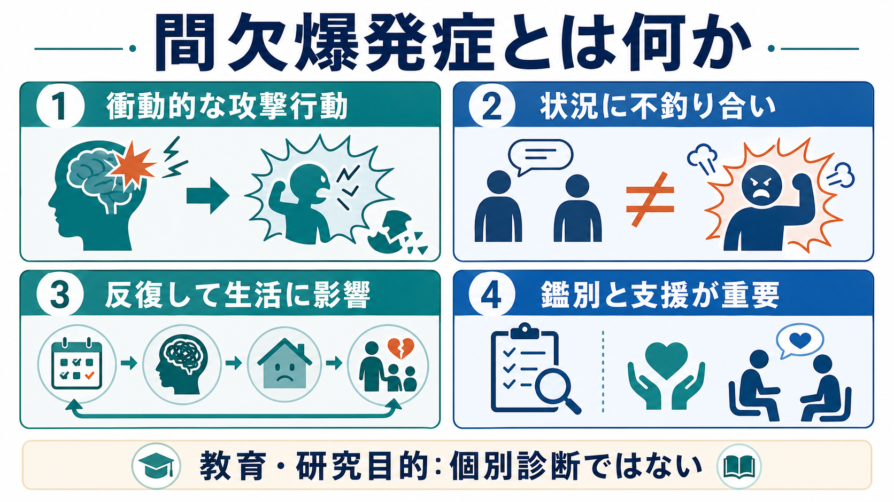
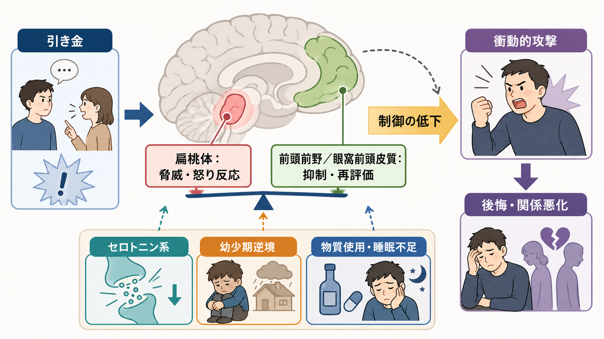
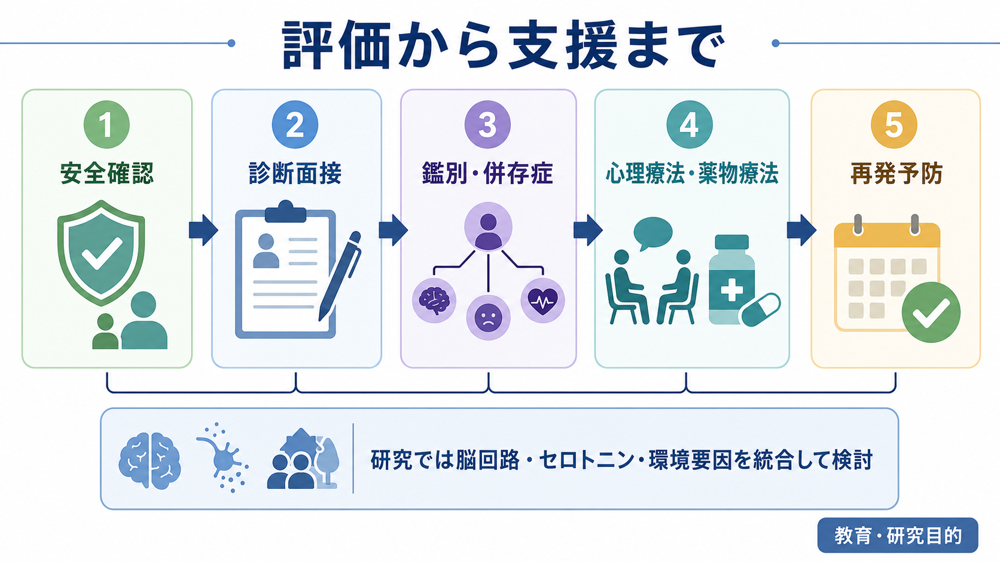

# 間欠爆発症とは何か

## 要点

- 間欠爆発症は、怒りや攻撃衝動を十分に抑えられず、言語的攻撃、物への攻撃、対人・対動物への身体的攻撃が反復する状態を指す。中心にあるのは「攻撃性が強い人」という性格評価ではなく、衝動的で、状況に不釣り合いで、生活・対人関係・法的問題に結びつく反復性である[1]。
- DSM-5では、比較的軽いが高頻度の言語的・非破壊的攻撃と、低頻度だが破壊・傷害を伴う攻撃の2つの型が診断基準に含まれた。いずれも、計画的な利益獲得や脅迫のための攻撃ではなく、怒りに基づく衝動的な爆発として扱われる[1]。
- 疫学研究では、DSM-IV基準で成人の生涯有病率が比較的高く推定され、青年期にも相当数がみられる。ただしDSM-5基準では制限的な条件が増えたため、単純に同じ数値を現在の診断に当てはめることはできない[2][3]。
- 仕組みは単一の「怒りっぽい脳」ではない。扁桃体を含む脅威・情動反応、前頭前野・眼窩前頭皮質による抑制と再評価、セロトニン系、幼少期逆境、家庭環境、併存症が重なって理解される[4][5]。
- 治療・支援では、まず安全確認と鑑別が重要である。認知行動療法と一部の薬物療法には研究知見があるが、個別の診断や治療選択は専門家による評価が必要で、このノートは教育・研究目的の整理である[6][7][8]。

## この記事で答える問い

1. 間欠爆発症は、普通の怒りや攻撃性とどこが違うのか。
2. DSM-5では、どのような攻撃行動が診断上問題になるのか。
3. 脳回路、神経伝達、発達環境はどのように関わるのか。
4. 臨床では何を評価し、何と鑑別し、どのような支援につなげるのか。

## まず結論

間欠爆発症は、怒りの強さそのものではなく、「衝動的な攻撃爆発が反復し、状況に不釣り合いで、本人や周囲に明確な不利益をもたらす」ことを中心に理解する疾患である。怒った理由があるかどうかだけでは判断できない。小さな挑発に対して過大な反応が起こる、あとから後悔する、関係・学校・職場・金銭・法的問題が生じる、にもかかわらず同じパターンが繰り返される、という連鎖が臨床的に重要になる[1][5]。

## 背景

攻撃行動は、[[攻撃性とは何か]]で扱うように、生物学的防衛、社会的学習、情動制御、規範、文脈が重なって生じる。したがって、攻撃行動があるだけで間欠爆発症とはいえない。たとえば躁状態、精神病症状、物質使用、頭部外傷、認知症、発達上の行動問題、反社会性・境界性パーソナリティ特性などでも攻撃的行動は起こりうる[1]。

間欠爆発症が独立した臨床概念として重要なのは、攻撃行動が「衝動的で、反復し、過剰で、機能障害を伴う」まとまりとして出現する場合があるからである。成人の全米疫学研究では、DSM-IV基準による生涯有病率は7.3%、12か月有病率は3.9%と推定された[2]。青年を対象にしたNCS-A研究でも、生涯有病率は7.8%と推定され、発症が若年から始まりうることが示された[3]。ただし、これらは主にDSM-IV時代の推定であり、DSM-5基準では診断の範囲や除外条件が変わるため、現在の臨床でそのまま頻度として読むのは避けるべきである[1]。

## 基本概念

DSM-5の整理では、間欠爆発症は「破壊的・衝動制御・素行症群」に位置づけられる。中核は、攻撃衝動の制御失敗としての反復的な行動爆発である[1]。

診断上は、大きく2つのパターンがある。第一は、週2回程度、3か月以上続く言語的攻撃、口論、かんしゃく、または傷害・破壊に至らない身体的攻撃である。第二は、12か月以内に3回、物の破壊や身体的傷害を伴う攻撃爆発が起こるパターンである[1]。ここで重要なのは、攻撃の強さが挑発や心理社会的ストレスに比べて著しく不釣り合いであり、計画的ではなく、金銭・権力・威嚇などの具体的利益を得るための行為ではない点である[1]。

もう1つの要件は、本人の著しい苦痛、職業・対人機能の障害、または金銭的・法的結果を伴うことである[1]。つまり、診断は「怒ったことがある」「暴言を吐いたことがある」という出来事の有無だけではなく、反復性、過剰性、衝動性、機能障害、鑑別診断を合わせて評価する。

## 仕組み

### 脅威反応と抑制のバランス

間欠爆発症の神経生物学は、扁桃体と前頭前野・眼窩前頭皮質の相互作用として説明されることが多い。扁桃体は脅威や怒りに関わる情動的な手がかりを素早く処理し、前頭前野や眼窩前頭皮質は反応の抑制、再評価、社会的文脈の読み替えに関わる[4][5]。このバランスが崩れると、相手の表情や言葉を過度に敵意的に読み、行動を止める前に攻撃反応が出やすくなる。

ただし、これは「扁桃体が悪い」「前頭前野が弱い」という単純な図式ではない。2025年の系統的レビューでは、扁桃体、海馬、前頭前野、眼窩前頭皮質、視床下部、白質結合、セロトニン系、幼少期逆境、家庭環境が、IEDの多因子的な理解に関わると整理されている[5]。研究はまだ限定的であり、臨床で使える単一の脳画像マーカーが確立しているわけではない。

### セロトニン系と衝動的攻撃

衝動的攻撃には、セロトニン系の調節が関わると考えられてきた。フルオキセチンを用いた二重盲検ランダム化プラセボ対照試験では、IEDの研究診断基準を満たす参加者において、攻撃性と易怒性の尺度がプラセボより低下し、反応は早期からみられた[6]。ただし、完全または部分寛解に至ったのは半数未満であり、薬物療法だけで説明・解決できる状態ではない[6]。

この点は、[[セロトニンは気分だけに関わるのか]]や[[セロトニン仮説はうつ病をどこまで説明できるのか]]と同じく、単純な「不足仮説」への警戒が必要である。セロトニン系は重要な調節因子だが、攻撃行動の文脈、学習、トラウマ、睡眠、物質使用、併存症を切り離して理解することはできない[5][8]。

### 認知・情動処理

間欠爆発症では、怒りが急に上がるだけでなく、相手の意図を敵意的に解釈する、将来の結果を見積もりにくい、身体的興奮を「行動しなければならないサイン」と誤って読む、といった認知・情動処理が関わることがある。これは[[易怒性とは何か]]、[[前頭前野は情動制御にどう関わるのか]]、[[扁桃体過活動は不安症やPTSDにどう関わるのか]]と接続して理解しやすい。

認知行動療法の研究では、怒りの手がかりを早く見つける、敵意的解釈を再検討する、身体的興奮を下げる、問題解決を練習する、攻撃以外の行動レパートリーを増やす、といった多要素の介入が検討されている[7][8]。

## 図解

3枚の図は、間欠爆発症を「診断ラベル」ではなく、評価すべき臨床現象として見るための補助である。1枚目は全体像、2枚目は脳回路と環境要因の相互作用、3枚目は評価から支援までの流れを示す。

## 臨床・研究との接続

### 評価

臨床評価では、まず安全を確認する。現在の暴力リスク、家庭内暴力、虐待、武器へのアクセス、物質使用、希死念慮・他害念慮、被害者になりうる人の安全を評価する必要がある。急性の危険がある場合は、教育的理解よりも安全確保と危機介入が優先される。

次に、攻撃爆発の頻度、強度、引き金、持続時間、身体的興奮、前後の記憶、後悔、機能障害、法的・金銭的結果を整理する。怒りの体験だけでなく、行動の形、反復性、被害の範囲、本人の苦痛を具体的に聞くことが重要である[1][5]。

### 鑑別と併存症

鑑別では、[[双極性障害とは何か]]、[[物質使用障害とは何か]]、[[PTSDとは何か]]、[[複雑性PTSDとは何か]]、[[ADHDは前頭線条体回路の障害として説明できるのか]]、[[前頭側頭型認知症はなぜ人格や行動を変えるのか]]などが関連する。躁状態、精神病症状、物質誘発性、頭部外傷、神経認知障害、発達症、適応障害、パーソナリティ病理、家庭内・社会的暴力の文脈を無視してIEDと決めることはできない[1]。

また、IEDは気分症、不安症、物質使用、ADHD、トラウマ関連症状と併存しうる。併存症がある場合、攻撃爆発だけを切り出して扱うのではなく、睡眠、生活リズム、物質使用、対人環境、ストレス、心理教育、家族・学校・職場との調整を含めて考える必要がある[5][8]。

### 支援

心理療法では、認知行動療法に比較的まとまった研究がある。2008年のパイロットランダム化試験では、個人・集団のCBTが待機群に比べ、攻撃性、怒り、敵意的思考を低下させ、怒りの制御を改善した[7]。2022年のランダム化試験では、CBTと支持的精神療法の双方で怒り・攻撃が減少したが、攻撃性の低下ではCBTがより大きい可能性が示された[8]。

薬物療法では、SSRIの一部、気分安定薬、抗てんかん薬などが研究されてきたが、効果は一様ではない。2025年の治療レビュー・メタ分析は、心理療法と薬物療法の双方に一定の知見を認めつつ、研究数、サンプルサイズ、診断基準、アウトカムの違いに注意を促している[8]。したがって、支援の基本は「怒りを消す薬」を探すことではなく、安全、診断、併存症、本人の目標、環境調整、再発予防を統合することである。

## よくある誤解

### 「怒りっぽい性格」と同じである

同じではない。性格傾向として怒りやすい人はいるが、間欠爆発症では、衝動的な攻撃爆発が反復し、状況に不釣り合いで、本人や周囲の生活に明確な影響を与えることが問題になる[1]。

### 「暴力を正当化する診断」である

診断は責任を消すための言葉ではない。むしろ、危険を過小評価せず、反復パターンを評価し、再発予防と支援につなげるための枠組みである。被害者の安全や法的対応が必要な状況では、それらを先送りしてよい理由にはならない。

### 「セロトニンを増やせば治る」

SSRIの研究はあるが、全員に効くわけではなく、寛解率も限定的である[6]。IEDは、神経伝達、情動制御、認知、発達環境、併存症、社会的文脈が関わる多因子的な状態として扱う方が実際的である[5][8]。

### 「怒っている最中に説得すればよい」

爆発の最中は、再評価や長い対話が働きにくいことがある。支援では、事前のサインを見つける、距離を取る、環境刺激を下げる、回復後に振り返る、危険時の安全計画を作る、といった時間軸の設計が重要になる。

## 関連ノート

- [[攻撃性とは何か]]
- [[易怒性とは何か]]
- [[前頭前野は情動制御にどう関わるのか]]
- [[扁桃体回路は情動をどう処理するのか]]
- [[扁桃体過活動は不安症やPTSDにどう関わるのか]]
- [[セロトニンは気分だけに関わるのか]]
- [[物質使用障害とは何か]]
- [[双極性障害とは何か]]
- [[PTSDとは何か]]
- [[精神科面接で境界設定はなぜ必要なのか]]

## 理解チェック

1. 間欠爆発症の診断で、「怒りが強い」だけでは不十分なのはなぜか。
2. DSM-5で重視される2つの攻撃爆発パターンは何か。
3. 衝動的攻撃と計画的攻撃を区別する臨床的意味は何か。
4. 扁桃体、前頭前野・眼窩前頭皮質、セロトニン系はどのように関係づけられるか。
5. 評価時に、双極性障害、物質使用、PTSD、頭部外傷、神経認知障害を確認する必要があるのはなぜか。

## 参考文献

[1] Substance Abuse and Mental Health Services Administration. (2016). *Impact of the DSM-IV to DSM-5 Changes on the National Survey on Drug Use and Health*, Table 3.18: DSM-IV to DSM-5 Intermittent Explosive Disorder Comparison. https://www.ncbi.nlm.nih.gov/books/NBK519704/table/ch3.t18/

[2] Kessler, R. C., Coccaro, E. F., Fava, M., Jaeger, S., Jin, R., & Walters, E. (2006). The prevalence and correlates of DSM-IV intermittent explosive disorder in the National Comorbidity Survey Replication. *Archives of General Psychiatry, 63*(6), 669-678. https://doi.org/10.1001/archpsyc.63.6.669

[3] McLaughlin, K. A., Green, J. G., Hwang, I., Sampson, N. A., Zaslavsky, A. M., & Kessler, R. C. (2012). Intermittent explosive disorder in the National Comorbidity Survey Replication Adolescent Supplement. *Archives of General Psychiatry, 69*(11), 1131-1139. https://doi.org/10.1001/archgenpsychiatry.2012.592

[4] Coccaro, E. F. (2012). Intermittent explosive disorder as a disorder of impulsive aggression for DSM-5. *American Journal of Psychiatry, 169*(6), 577-588. https://doi.org/10.1176/appi.ajp.2012.11081259

[5] Paliakkara, J., Ellenberg, S., Ursino, A., Smith, A. A., Evans, J., Strayhorn, J., Faraone, S. V., & Zhang-James, Y. (2025). A systematic review of the etiology and neurobiology of intermittent explosive disorder. *Psychiatry Research, 347*, 116410. https://doi.org/10.1016/j.psychres.2025.116410

[6] Coccaro, E. F., Lee, R. J., & Kavoussi, R. J. (2009). A double-blind, randomized, placebo-controlled trial of fluoxetine in patients with intermittent explosive disorder. *Journal of Clinical Psychiatry, 70*(5), 653-662. https://doi.org/10.4088/JCP.08m04150

[7] McCloskey, M. S., Noblett, K. L., Deffenbacher, J. L., Gollan, J. K., & Coccaro, E. F. (2008). Cognitive-behavioral therapy for intermittent explosive disorder: A pilot randomized clinical trial. *Journal of Consulting and Clinical Psychology, 76*(5), 876-886. https://doi.org/10.1037/0022-006X.76.5.876

[8] Liu, F., Yin, X., & Jiang, W. (2025). Comprehensive review and meta-analysis of psychological and pharmacological treatment for intermittent explosive disorder: Insights from both case studies and randomized controlled trials. *Clinical Psychology & Psychotherapy, 32*(1), e70016. https://doi.org/10.1002/cpp.70016

## 未解決問題

- DSM-5基準に基づく一般人口での有病率、文化差、年齢差をどの程度精密に推定できるか。
- IEDに特異的な脳回路・神経伝達・炎症・遺伝要因を、一般的な衝動的攻撃や併存症からどう分離して検討できるか。
- CBT、支持的精神療法、薬物療法、家族・学校・職場介入を、どのような臨床像に合わせて組み合わせるのが最も有効か。
- 安全確保とスティグマ低減を両立する心理教育を、本人・家族・支援者にどう提供するか。

## MOC更新候補

- `content/00_MOC/` 配下の精神医学、症候学、衝動制御、攻撃性関連MOCに `[[間欠爆発症とは何か]]` を追加する候補。
- 並列ジョブとの競合を避けるため、このタスクではMOC本体は更新しない。
