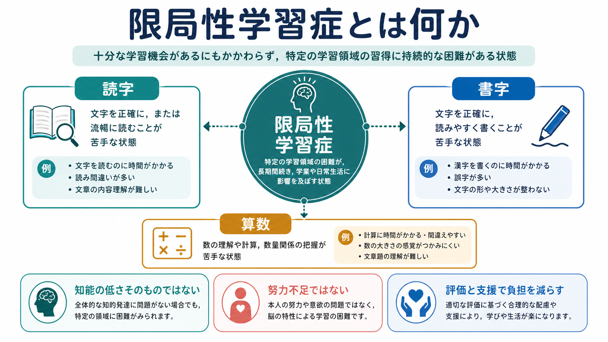
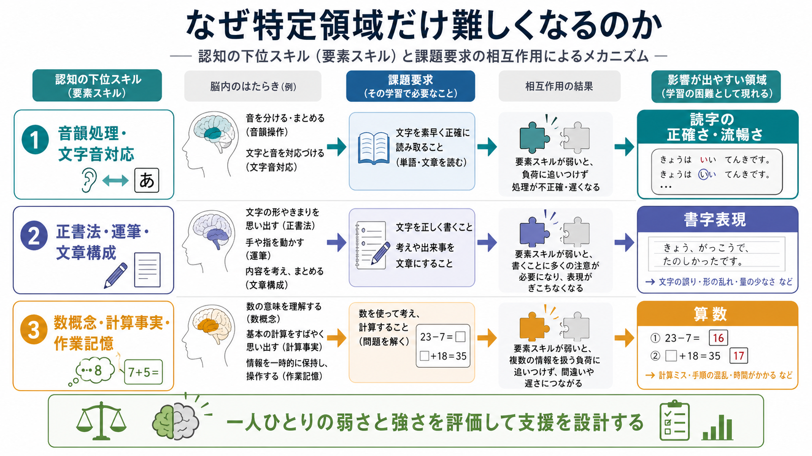
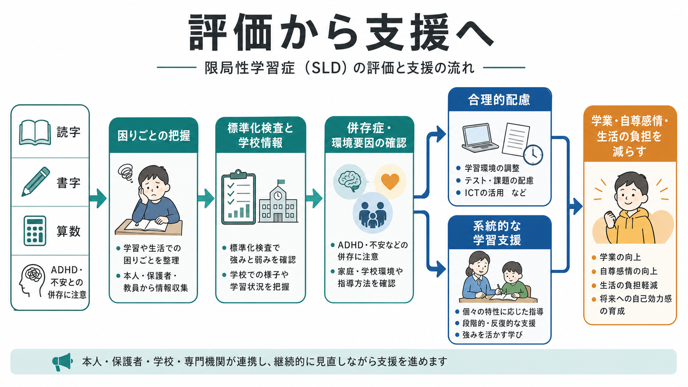

# 限局性学習症とは何か

## 要点

- 限局性学習症は、読字、書字、算数などの学業技能の習得と使用に、持続的で機能的な困難がみられる精神医学上の神経発達症である。
- 「知能が低い」「努力していない」「家庭や学校だけが原因」という意味ではない。十分な学習機会があっても、特定領域の学習が年齢や教育歴から期待される水準より著しく困難になる点が中心である[1][2]。
- 診断や支援では、標準化検査だけでなく、発達歴、教育歴、学校での観察、本人の負担、併存症、合理的配慮の必要性を合わせてみる[1][2]。
- 読字では音韻処理や文字と音の対応、書字では正書法・運筆・文章構成、算数では数概念・計算事実・作業記憶など、複数の認知過程が関わる[4][5]。
- 支援は「一律の訓練」ではなく、困難の領域、強み、学習環境に合わせて、明示的・系統的な指導、補助技術、評価方法の調整を組み合わせる[3][6][7]。

## この記事で答える問い

- 限局性学習症は、一般的な「勉強の苦手さ」と何が違うのか。
- 読字、書字、算数の困難はどのように整理できるのか。
- どのような仕組みが想定され、どのような評価と支援につながるのか。
- 臨床・教育・研究では何に注意すべきか。

## まず結論

限局性学習症は、学力の単なる低さではなく、特定の学業技能を獲得・使用するプロセスに持続的なつまずきがある状態である。DSM-5 以降の枠組みでは、読字障害、書字表出の障害、算数障害をばらばらの病名として扱うよりも、限局性学習症という総称のもとで、どの領域がどの程度障害されているかを指定する考え方が採られている[1]。

ICD-11 でも、発達性学習症は読字、書字表出、数学の障害を指定できる分類として整理され、知的発達症、感覚障害、神経疾患、教育機会の不足、教授言語への不慣れ、心理社会的逆境だけでは説明されないことが重視される[2]。日本の教育領域では「学習障害」という語が使われることが多く、文部科学省は、全般的な知的発達に遅れはないが、聞く・話す・読む・書く・計算する・推論する能力のうち特定のものの習得と使用に著しい困難を示す状態として説明している[3]。

## 背景

学習は、教科書を読む、板書を写す、文章で考えを表す、計算手順を保つ、テスト時間内に解く、といった複数の技能を同時に使う営みである。したがって、限局性学習症の困難は「国語が苦手」「算数が苦手」という表面だけでは捉えにくい。読めないために文章題が解けない、書く負担が大きいために理解していても答案に表せない、計算事実の自動化が弱いために応用問題に作業記憶を使えない、というように、二次的な学習困難が重なりやすい。

NICHD は、学習障害を、読む・書く・話す・数学などに影響する脳の働き方の違いとして説明し、知能の問題そのものではないと述べている[4]。この点は臨床的にも重要である。本人が理解している内容と、読み書きや計算として表出できる内容がずれるため、周囲から「やればできるのにやらない」と誤解されやすい。

限局性学習症は、[[不安症群とは何か]]や[[うつ病とは何か]]のような内在化症状、注意の自己調整困難、学校回避、自尊感情の低下と結びつくことがある。これは限局性学習症が気分症や不安症を直接引き起こすという単純な話ではなく、失敗経験、評価場面での負荷、支援不足、併存する神経発達特性が重なって生活上の負担を増やすという理解が妥当である[5][8]。

## 基本概念

### 診断概念としての限局性学習症

DSM-5 の説明では、限局性学習症は、発達歴、医学歴、教育歴、家族歴、検査結果、教師の観察、学習介入への反応を含む臨床的レビューによって判断される[1]。中心となるのは、読字、書字、算数・数学的推論の困難が、学校教育の時期に持続し、学業・職業・日常生活の機能を妨げることである。

重要なのは、単一のテスト点だけで機械的に決めるものではない点である。ICD-11 も、標準化検査は望ましいが、検査条件や発達段階による変動があるため、学校外を含む複数の情報源から学習能力を評価する必要があるとしている[2]。

### 読字・書字・算数の領域

| 領域 | 主な困難 | 見えやすい場面 | 支援の方向 |
|---|---|---|---|
| 読字 | 文字と音の対応、正確さ、流暢さ、読解 | 音読が遅い、読み飛ばし、文章理解に時間がかかる | 音韻意識、デコーディング、読み上げ、時間調整 |
| 書字 | 綴り、文字形成、文法、文章構成 | 板書が遅い、誤字脱字、考えを文章化しにくい | キーボード入力、音声入力、構成メモ、書字負荷の調整 |
| 算数 | 数概念、計算事実、手続き、数学的推論 | 繰り上がり、九九、文章題、単位換算が難しい | 具体物・視覚化、手順の明示、計算補助、文章題の読み支援 |

この表は診断基準そのものではなく、評価や支援の入口である。読字と算数、書字と読字の困難はしばしば重なる。代表サンプルを用いた研究でも、読字・書字・数学の困難は単独にも併存にも現れ、併存の評価には測定課題の内容が大きく影響することが示されている[8]。

## 仕組み

限局性学習症の仕組みは、単一の脳部位や単一の能力の欠損では説明しにくい。むしろ、学業技能を支える下位過程と、授業・試験・家庭学習で求められる課題要求とのミスマッチとして理解すると実用的である。

読字では、音韻処理、文字と音の対応、語の自動認識、読解が階層的に関わる。文字を一つずつ音に変換する負荷が高いと、文章の意味理解に使える認知資源が減る。書字では、文字の形、綴り、文法、句読点、文章構成、運筆やタイピングが同時に求められる。算数では、数感覚、計算事実の記憶、手続き、視空間処理、作業記憶、言語理解が組み合わさる[4][5]。

このため、限局性学習症の評価では「読めるか」「書けるか」「計算できるか」だけでなく、どの下位過程で負荷が高まっているかを調べる。これは[[統合失調症の認知機能障害とは何か]]で扱う認知機能評価と同じく、診断名だけでなく、生活上の機能と支援設計を結びつけるための評価である。

## 図解

上の図の要点は、限局性学習症を「本人の努力不足」ではなく、認知下位過程、学習課題、環境調整の相互作用として捉えることである。

1. 読字の困難では、音韻処理や文字音対応の負荷が高くなり、正確さ・流暢さ・読解に影響する。
2. 書字の困難では、綴りや文字形成だけでなく、考えを文として構成する過程が問題になる。
3. 算数の困難では、数概念、計算事実、作業記憶、文章題の言語理解が絡み合う。
4. 支援は、弱い過程を練習するだけでなく、強みを使い、課題の提示方法や評価方法を調整する。

## 臨床・研究との接続

### 評価

評価では、標準化された学力検査、知能検査、読み書き・計算の詳細検査、学校での成果物、教師・保護者・本人からの情報を組み合わせる。DSM-5 の APA ファクトシートも、検査得点だけでなく、発達歴、医学歴、教育歴、家族歴、教師観察、介入への反応を含む臨床的判断を強調している[1]。

鑑別では、知的発達症、視覚・聴覚障害、神経疾患、運動障害、教育機会の不足、教授言語への不慣れ、心理社会的逆境を検討する[2]。ただし、これらの要因がある人に限局性学習症が併存しないという意味ではない。例えば注意困難や不安がある場合、それだけで読字・書字・算数の困難を説明できるのか、それとも独立した学習技能の困難があるのかを丁寧にみる。

### 支援

読字への介入については、ランダム化比較試験を対象にしたメタ分析で、フォニックス指導が読字・綴りの改善に関して最も一貫した効果を示した一方、色付きレンズや聴覚訓練などの効果は限定的だった[6]。日本語では英語と文字体系が異なるため、そのまま輸入するのではなく、かな、漢字、音韻、語彙、読みの流暢さに合わせて設計する必要がある。

算数困難への介入では、数学学習困難のある生徒を対象としたメタ分析で、構造化された数学介入が中等度の効果を示している[7]。具体物や視覚表現、手順の明示、問題解決方略の指導、フィードバック、反復練習を、本人の困難に合わせて組み合わせることが重要である。

### 研究上の論点

研究では、読字、書字、算数が本当に「限局的」に分かれるのかという問題がある。学業技能は相互に関連しており、読字の弱さが文章題や理科・社会の学習にも影響する。逆に、作業記憶や処理速度の弱さが複数領域に広がることもある。したがって、カテゴリー診断は実務上有用だが、研究では連続的な能力分布、課題依存性、併存、環境との相互作用を扱う必要がある[8]。

## よくある誤解

### 「知能が低いから起こる」

限局性学習症は、全般的な知的発達の低さだけでは説明されない学習技能の困難を扱う概念である[1][2]。知能検査の総合得点だけでなく、下位能力のばらつき、学力検査、学校での実際の困りごとを合わせて理解する。

### 「努力不足や怠けである」

本人はしばしば、同じ成果を出すために周囲より多くの時間と労力を使っている。ICD-11 も、機能が保たれているように見える場合でも、過剰な努力や支援によって維持されていることがあると説明している[2]。

### 「読字だけ、算数だけなら生活上は大きな問題にならない」

読字、書字、算数は学校だけでなく、契約書を読む、予定を管理する、金銭を扱う、メールを書く、資格試験を受けるといった成人期の活動にも関わる。早期の理解と支援は、学業成績だけでなく、自己効力感や進路選択にも関係する。

### 「診断がつけば支援内容は決まる」

同じ限局性学習症でも、読字の正確さが弱い人、流暢さだけが弱い人、書字表出が弱い人、計算事実の記憶が弱い人では支援が異なる。診断名は入口であり、支援は個別の機能評価から設計する。

## 関連ノート

### 既存ノート

- [[不安症群とは何か]]
- [[うつ病とは何か]]
- [[統合失調症の認知機能障害とは何か]]

### 関連ノート候補

- 神経発達症とは何か
- ADHDと学習困難
- ディスレクシアとは何か
- ディスグラフィアとは何か
- ディスカリキュリアとは何か
- 合理的配慮と学習支援
- 読字の認知神経科学

## 理解チェック

1. 限局性学習症を「単なる学力不振」と区別する要点は何か。
2. 読字、書字、算数の困難は、それぞれどのような下位過程と関係するか。
3. 標準化検査だけでなく、学校情報や発達歴を合わせて評価する理由は何か。
4. 「努力不足」と見なすことが、本人の支援設計にどのような悪影響をもたらすか。
5. 診断名から直ちに支援内容を決めず、個別評価を行う必要があるのはなぜか。

## 未解決問題

- 日本語の文字体系に特化した読字・書字支援の効果を、どの程度の質で検証できているか。
- 読字、書字、算数の併存を、単なる検査課題の重なりではなく、どのようにモデル化できるか。
- 成人期の限局性学習症を、職業機能、メンタルヘルス、デジタル補助技術と結びつけてどう評価するか。
- 合理的配慮と技能訓練を、学校現場で持続可能な形にする条件は何か。

## 参考文献

[1] American Psychiatric Association. (2013). *Specific Learning Disorder: DSM-5 Fact Sheet*. https://www.psychiatry.org/File%20Library/Psychiatrists/Practice/DSM/APA_DSM-5-Specific-Learning-Disorder.pdf

[2] World Health Organization. (2026). *ICD-11 6A03 Developmental learning disorder*. https://icd.who.int/browse/2025-01/mms/en#2099676649

[3] 文部科学省. 「（8）学習障害」. https://www.mext.go.jp/a_menu/shotou/tokubetu/mext_00808.html

[4] Eunice Kennedy Shriver National Institute of Child Health and Human Development. *Learning Disabilities*. https://www.nichd.nih.gov/health/topics/learningdisabilities

[5] Aslam, S. P., & Carugno, P. (2025). *Learning Disorder*. StatPearls, NCBI Bookshelf. https://www.ncbi.nlm.nih.gov/books/NBK554371/

[6] Galuschka, K., Ise, E., Krick, K., & Schulte-Körne, G. (2014). Effectiveness of treatment approaches for children and adolescents with reading disabilities: A meta-analysis of randomized controlled trials. *PLOS ONE, 9*(2), e89900. https://doi.org/10.1371/journal.pone.0089900

[7] Jitendra, A. K., Lein, A. E., Im, S., Alghamdi, A. A., Hefte, S. B., & Mouanoutoua, J. (2018). Mathematical interventions for secondary students with learning disabilities and mathematics difficulties: A meta-analysis. *Exceptional Children, 84*(2), 177-196. https://doi.org/10.1177/0014402917737467

[8] Moll, K., Kunze, S., Neuhoff, N., Bruder, J., & Schulte-Körne, G. (2014). Specific learning disorder: Prevalence and gender differences. *PLOS ONE, 9*(7), e103537. https://doi.org/10.1371/journal.pone.0103537
