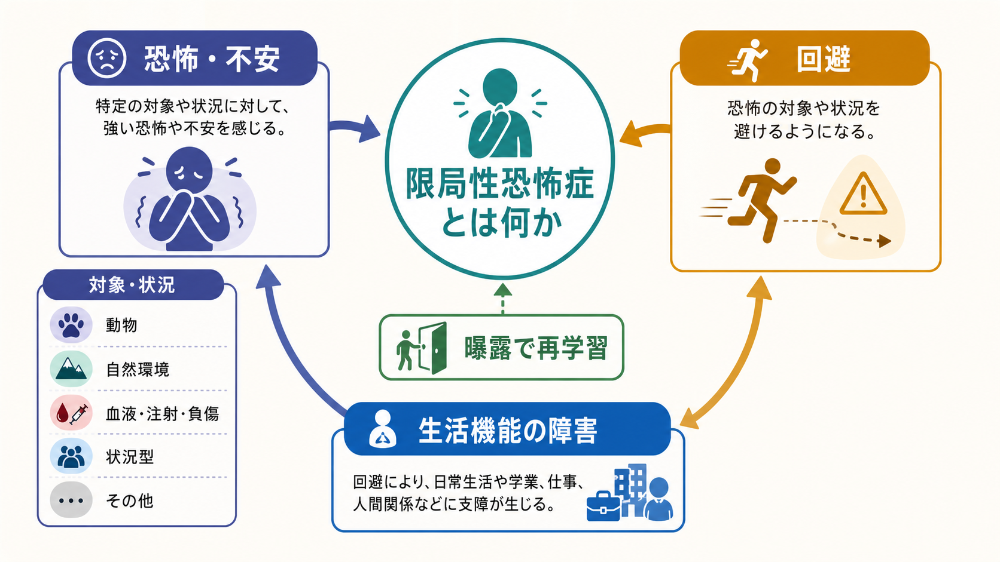
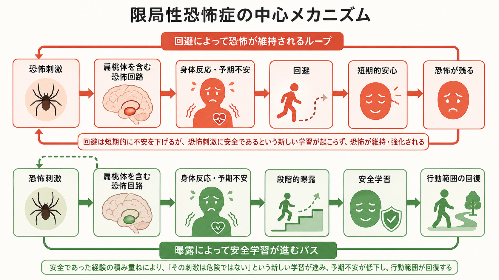
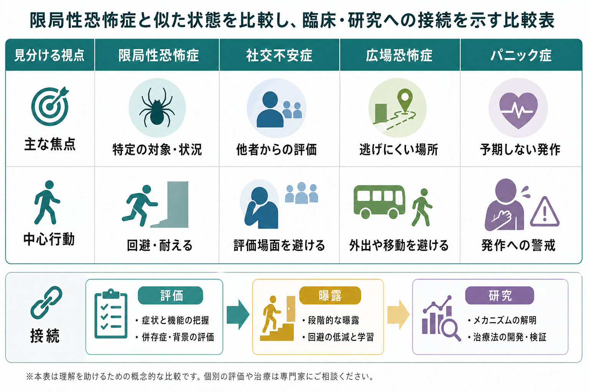

# 限局性恐怖症とは何か

## 要点

- 限局性恐怖症は、特定の対象や状況に対して、実際の危険に比べて過度な恐怖・不安がほぼ一貫して生じ、回避や強い苦痛、生活機能の障害につながる[[不安症群とは何か|不安症群]]である[1][2]。
- 恐怖の対象は、動物、自然環境、血液・注射・負傷、飛行機・エレベーター・閉所などの状況、その他の対象に分けて考えられる[1][2]。
- 問題の中心は「怖いと感じること」そのものではなく、[[予期不安とは何か|予期不安]]と回避によって生活範囲が狭まり、新しい安全学習が起こりにくくなることである[4][5]。
- 治療研究では、曝露を中心とする心理療法が主要なエビデンスを持つ。ただし、個別の診断や治療方針は専門家による評価に基づいて決める必要がある[6][7]。

## この記事で答える問い

- 限局性恐怖症は、普通の怖がりや苦手意識とどこが違うのか。
- 恐怖と回避は、どのような学習メカニズムで維持されるのか。
- [[社交不安症とは何か|社交不安症]]、[[パニック症とは何か|パニック症]]、広場恐怖症、強迫症、PTSD とはどのように見分けるのか。
- 研究知見は、臨床評価や曝露療法の考え方にどう接続するのか。

## まず結論

限局性恐怖症は、「特定のものが怖い」という単純な性格特徴ではない。恐怖刺激に近づく、想像する、遭遇しそうだと予測するだけで強い[[不安とは何か|不安]]や身体反応が生じ、その対象を避けるために予定、移動、仕事、学業、医療受診、人間関係が変わってしまう状態である[1][2]。

重要なのは、恐怖の強さだけでなく、回避がどれほど生活を制限しているかである。回避は短期的には不安を下げるため「効いた」ように感じられる。しかし、その経験だけが繰り返されると、「近づいても実際には破局が起きない」「不安は上がっても下がりうる」という学習の機会が失われる[5][7]。

## 背景

限局性恐怖症は、不安症群のなかでも頻度の高い状態として扱われる。NIMH が掲載する米国 National Comorbidity Survey Replication に基づく統計では、成人の 12 か月有病率は 9.1%、生涯有病率は 12.5% とされ、青年期でも比較的高い頻度が報告されている[3]。ただし、この数値は米国調査、DSM-IV 由来の診断枠組み、調査時期の影響を受けるため、日本の現在の臨床集団にそのまま当てはめるものではない。

発症は小児期から青年期に多く、動物や自然環境への恐怖では早期発症が目立つ一方、飛行機や高所などの恐怖は後から問題化することもある[2][4]。また、ひとつの恐怖対象だけでなく、複数の対象や状況を恐れることも少なくない[2]。

## 基本概念

### 普通の恐怖との違い

恐怖は、危険から距離を取るための自然な反応である。限局性恐怖症として問題になるのは、恐怖が実際の危険や文化的文脈に比べて過度であり、持続し、本人に強い苦痛や生活機能の障害をもたらす場合である[1][2]。

DSM-5-TR では、特定の対象・状況への著しい恐怖または不安、その刺激がほぼ常に即時の恐怖を引き起こすこと、積極的回避または強い苦痛を伴う忍耐、実際の危険との不釣り合い、通常 6 か月以上の持続、臨床的に有意な苦痛または機能障害、他の精神疾患ではよりよく説明されないことが重視される[1]。ICD-11 でも、曝露または曝露予期に伴う著明で過度な恐怖・不安、回避、数か月以上の持続、苦痛または機能障害が中核に置かれる[2]。

### 主な下位型

臨床では、恐怖対象を大まかに分けると評価しやすい。

| 下位型 | 例 | 評価で見る点 |
|---|---|---|
| 動物型 | 犬、虫、蛇、クモ | 接近距離、遭遇予測、屋外活動の制限 |
| 自然環境型 | 高所、嵐、水、暗所 | 移動、旅行、住環境、災害経験との関係 |
| 血液・注射・負傷型 | 採血、注射、外傷、手術場面 | 失神、迷走神経反射、医療回避 |
| 状況型 | 飛行機、エレベーター、閉所、運転 | 逃げにくさ、移動制限、パニック症との鑑別 |
| その他 | 嘔吐、窒息、特定音、着ぐるみなど | 恐怖の焦点、強迫観念やトラウマ記憶との関係 |

血液・注射・負傷型では、恐怖や嫌悪だけでなく、血管迷走神経反応に伴う失神が問題になることがある[2]。この点は、他の恐怖対象で典型的に見られる交感神経系の高覚醒とは少し異なる。

## 仕組み

### 恐怖条件づけと予期不安

限局性恐怖症の理解では、恐怖条件づけ、観察学習、情報伝達、進化的に準備された恐怖反応が組み合わさると考えると整理しやすい。たとえば犬にかまれた経験がある人では、犬が危険を予測する刺激として学習されることがある。一方で、直接の外傷体験がなくても、家族の強い恐怖反応を見たり、危険情報を繰り返し聞いたりすることで恐怖が形成されることもある[2][4]。

神経生物学的には、[[扁桃体回路は情動をどう処理するのか|扁桃体]]を含む恐怖回路が、危険の検出、身体反応、注意の偏り、回避行動の準備に関わる。恐怖反応には、生得的な経路と学習された経路があり、限局性恐怖症ではその両方が関与しうる[5]。[[扁桃体過活動は不安症やPTSDにどう関わるのか|扁桃体過活動]]だけで全体を説明するのではなく、前頭前野、海馬、内受容感覚、文脈学習、予測誤差を含むネットワークとして捉える必要がある。

### 回避が恐怖を維持する

回避は短期的には合理的に見える。怖い場所に行かない、注射を延期する、飛行機を使わない、犬のいる道を避けると、その瞬間の不安は下がる。しかし、その結果として「近づいても危険ではなかった」という反証経験が得られない。回避の成功体験だけが残ると、恐怖刺激の危険性が過大評価されたまま維持される[5][7]。

現代の曝露療法研究では、単に不安を下げることよりも、「恐れていた結果が起こらない」「不安があっても行動できる」「安全信号に頼らずに耐えられる」という抑制学習を形成することが重視される[7]。これは、曝露を根性論や無理な我慢として捉えるのではなく、予測を検証する学習手続きとして設計する考え方である。

## 図解

1 枚目は、限局性恐怖症を「恐怖・不安」「回避」「生活機能の障害」「曝露で再学習」という全体像で整理している。2 枚目は、回避ループと曝露による安全学習を対比している。3 枚目は、似た状態との鑑別と臨床・研究への接続をまとめている。

## 臨床・研究との接続

### 評価

臨床評価では、恐怖対象の種類だけでなく、次の点を確認する。

- その対象に遭遇したとき、または遭遇を予期したときに何が起きるか。
- 回避のために、生活上の選択肢がどれほど狭まっているか。
- 恐怖がいつから続いているか、発達段階や文化的文脈から見て過度か。
- [[パニック発作とは何か|パニック発作]]、強迫観念、外傷記憶、他者評価への恐怖、健康不安などでよりよく説明できないか[1][2]。

診断名は、本人の苦痛をラベル化して終わるためではなく、恐怖と回避の機能を見立て、支援の優先順位を決めるために使う。たとえば、採血恐怖で医療受診が遅れる場合、恐怖そのものだけでなく身体疾患の見逃しリスクも評価対象になる。

### 介入

心理療法研究では、曝露を中心とした介入が限局性恐怖症に有効であることがメタ分析で示されている[6]。曝露は、恐怖対象に段階的・計画的に近づき、予測していた破局的結果が起きるか、身体反応がどのように変化するか、回避や安全行動を減らすと何が学習されるかを検証する方法である[7][8]。

薬物療法は、併存する不安、抑うつ、パニック発作、治療参加の困難さなどを含めて検討されることがあるが、限局性恐怖症そのものに対しては心理的介入、特に曝露ベースの方法が中心に置かれることが多い[8]。これは、個別の薬物使用を否定する意味ではなく、恐怖対象への学習と回避の解除が中核課題であるためである。

### 研究

限局性恐怖症は、恐怖条件づけ、消去学習、予測誤差、安全学習、身体反応、回避行動を結びつけて研究しやすい領域である[5][7]。一方で、恐怖対象ごとに生物学的準備性、文化差、発達過程、身体反応が異なるため、単一のメカニズムだけで説明するのは難しい。

## よくある誤解

### 「怖がりな性格」の問題だけではない

限局性恐怖症は、性格の弱さや意志の問題ではない。恐怖刺激に対する学習、身体反応、予期不安、回避の強化が組み合わさった状態として理解するほうが実用的である[4][5]。

### 「避けていれば問題ない」とは限らない

生活にほとんど影響しない恐怖であれば、診断や治療の対象にならないこともある。しかし、移動、医療、学業、仕事、家族関係が制限されるなら、回避による短期的安心と長期的コストを分けて見る必要がある[1][2]。

### 曝露は「いきなり怖いものに突き落とす」ことではない

曝露は、恐怖を無理に消すための罰ではない。目標、手順、安全行動、予測、結果を整理しながら、恐怖刺激に関する新しい学習を作る方法である[7]。特に血液・注射・負傷型で失神しやすい場合などは、身体反応に応じた工夫が必要になる[2]。

### パニック症や社交不安症と同じではない

限局性恐怖症でもパニック発作のような反応が出ることはある。しかし恐怖の焦点が「特定の対象・状況」なのか、「予期しない発作」なのか、「他者からの評価」なのかで見立ては変わる[1][2]。

## 関連ノート

- [[不安症群とは何か]]
- [[不安とは何か]]
- [[予期不安とは何か]]
- [[パニック症とは何か]]
- [[パニック発作とは何か]]
- [[社交不安症とは何か]]
- [[扁桃体回路は情動をどう処理するのか]]
- [[扁桃体過活動は不安症やPTSDにどう関わるのか]]
- [[サリエンスネットワークとは何か]]

## MOC更新候補

- `content/00_MOC/MOC｜精神医学.md` がある場合は、不安症群または疾患・症候群の項目に本記事を追加する候補。
- `content/00_MOC/MOC｜臨床実践・治療.md` がある場合は、曝露療法・認知行動療法関連の記事群と接続する候補。
- `content/00_MOC/MOC｜神経科学と精神疾患.md` がある場合は、恐怖学習、扁桃体、消去学習の関連ノートとして追加する候補。

## 理解チェック

1. 限局性恐怖症では、恐怖の強さだけでなく、どのような生活機能の障害を確認する必要があるか。
2. 回避はなぜ短期的には安心をもたらすのに、長期的には恐怖を維持しうるのか。
3. 限局性恐怖症、社交不安症、パニック症を見分けるとき、恐怖の「焦点」はどのように異なるか。
4. 曝露療法を「慣れ」だけでなく「安全学習」として考えると、何が変わるか。

## 未解決問題

- 恐怖対象ごとの生物学的準備性、学習経験、文化差をどの程度分けてモデル化できるか。
- 曝露療法の効果を高めるために、予測誤差、文脈変化、安全行動の除去、内受容感覚への注意をどのように個別化するか。
- バーチャルリアリティ曝露、デジタル介入、遠隔心理療法を、どの恐怖対象にどの程度一般化できるか。
- 小児期の発達的に自然な恐怖と、介入を要する限局性恐怖症を早期にどう区別するか。

## 参考文献

[1] American Psychiatric Association. (2022). *Diagnostic and Statistical Manual of Mental Disorders, Fifth Edition, Text Revision (DSM-5-TR).* American Psychiatric Association Publishing. https://doi.org/10.1176/appi.books.9780890425787

[2] World Health Organization. (2026). *ICD-11 for Mortality and Morbidity Statistics: 6B03 Specific phobia.* https://icd.who.int/browse/2026-01/mms/en#239513569

[3] National Institute of Mental Health. (n.d.). *Specific Phobia.* https://www.nimh.nih.gov/health/statistics/specific-phobia

[4] LeBeau, R. T., Glenn, D., Liao, B., Wittchen, H.-U., Beesdo-Baum, K., Ollendick, T., & Craske, M. G. (2010). Specific phobia: A review of DSM-IV specific phobia and preliminary recommendations for DSM-V. *Depression and Anxiety, 27*(2), 148-167. https://doi.org/10.1002/da.20655

[5] Garcia, R. (2017). Neurobiology of fear and specific phobias. *Learning & Memory, 24*(9), 462-471. https://doi.org/10.1101/lm.044115.116

[6] Wolitzky-Taylor, K. B., Horowitz, J. D., Powers, M. B., & Telch, M. J. (2008). Psychological approaches in the treatment of specific phobias: A meta-analysis. *Clinical Psychology Review, 28*(6), 1021-1037. https://doi.org/10.1016/j.cpr.2008.02.007

[7] Craske, M. G., Treanor, M., Conway, C. C., Zbozinek, T., & Vervliet, B. (2014). Maximizing exposure therapy: An inhibitory learning approach. *Behaviour Research and Therapy, 58*, 10-23. https://doi.org/10.1016/j.brat.2014.04.006

[8] Bandelow, B., Michaelis, S., & Wedekind, D. (2017). Treatment of anxiety disorders. *Dialogues in Clinical Neuroscience, 19*(2), 93-107. https://doi.org/10.31887/DCNS.2017.19.2/bbandelow

## 更新ログ

- 2026-04-28: 初版作成。診断分類、恐怖学習、曝露療法、鑑別、図解、関連ノート候補を整理。
