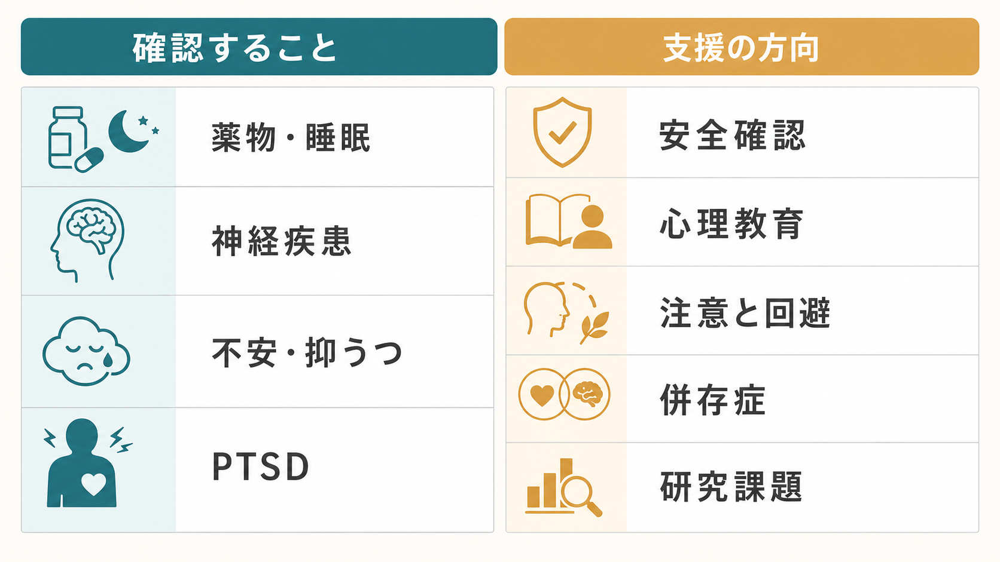
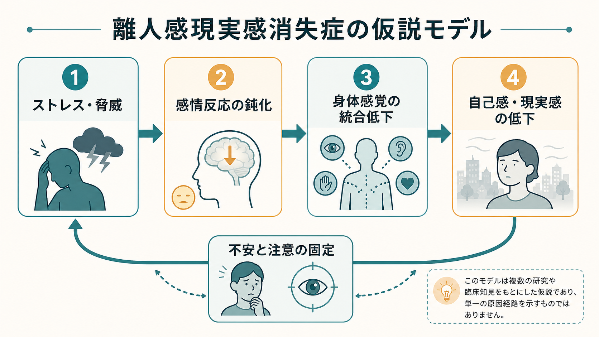

# 離人感現実感消失症とは何か

## 要点

- 離人感現実感消失症は、自己・身体・感情・外界が「自分のものではない」「現実味が薄い」と感じられる体験が持続または反復し、苦痛や生活上の障害を伴う状態である[1][2]。
- 中核は「現実感の変化」であり、通常は現実検討が保たれる。つまり、本人は「本当に世界が消えた」「自分が別人になった」と確信しているのではなく、「そう感じられてしまう」と自覚している[1][2]。
- 一過性の離人感・現実感消失は疲労、強いストレス、睡眠不足、薬物、パニック、トラウマ反応などでも起こりうる。診断では、物質、てんかんなどの神経疾患、うつ、不安、PTSD、精神病症状との鑑別が重要になる[1][2]。
- 仕組みは単一原因では説明しにくい。感情反応の鈍化、身体感覚の統合、注意の固定、不安による症状監視、ストレスやトラウマ経験などが重なる仮説的モデルとして考えると理解しやすい[4][6]。
- 治療研究はまだ限られる。心理療法、とくに症状の破局的解釈、回避、安全行動、症状モニタリングを扱う認知行動療法は有望だが、薬物療法に特異的な有効性が確立しているとは言いにくい[7][8]。

## この記事で答える問い

1. 離人感と現実感消失は、どのような体験なのか。
2. 一過性の不思議な感覚と、臨床的な障害はどこで分かれるのか。
3. なぜ「現実だと分かっているのに、現実味がない」という状態が起こるのか。
4. 不安、PTSD、うつ、薬物、神経疾患とはどう鑑別するのか。
5. 研究と臨床では、どのような支援・未解決問題があるのか。

## まず結論

離人感現実感消失症は、「現実を誤って信じ込む病気」ではなく、自己や外界の**主観的な現実感**が変化する病態である。離人感では、自分の身体、思考、感情、行為を遠くから見ているように感じたり、感情が自分のものとして響かなくなったりする。現実感消失では、周囲の人、物、空間、時間が夢のよう、霧がかかったよう、生命感がないように感じられる[1][2]。

重要なのは、この体験が「あるかないか」ではなく、**どれくらい持続し、どれくらい苦痛や機能障害を生むか**である。軽い離人感は、極度の疲労、寝不足、強い緊張、危険体験のあとにも起こる。臨床的な障害として扱うのは、症状が持続・反復し、本人の生活、学業、仕事、対人関係を妨げ、他の疾患や物質・身体疾患だけでは説明しにくい場合である[1][2]。

## 背景

離人感と現実感消失は、[[意識とは何か|意識]]、[[自己とは何か|自己]]、[[身体所有感とは何か|身体所有感]]、[[感情は身体感覚の予測なのか|感情と身体感覚]]の境界にある現象である。本人の訴えはしばしば「言葉にしづらい」。たとえば、「自分が自動操縦のように動いている」「家族が家族だと分かるのに、実感がない」「鏡の中の自分が自分に見えない」「世界に薄い膜がある」と表現される。

疫学的には、離人感・現実感消失の一過性体験は一般人口でも珍しくない。一方、障害としての離人感現実感消失症はより少なく、概ね 1-2% 程度とされる[1][3]。発症は思春期から若年成人期に多く、平均発症年齢は 16 歳前後とされ、40 歳以降の初発はまれである[1]。

この病態が見逃されやすい理由は二つある。第一に、本人が「変に思われる」「精神病だと思われる」と恐れて話しにくい。第二に、症状が[[不安とは何か|不安]]、[[抑うつ気分とは何か|抑うつ気分]]、[[PTSDでは恐怖記憶ネットワークに何が起きているのか|PTSD]]、睡眠障害、薬物使用、神経疾患の中に埋もれやすい。したがって、診察では「現実感のなさ」を単独の奇妙な訴えとしてではなく、生活史、ストレス、睡眠、物質使用、身体疾患、併存症状と一緒に整理する必要がある。

## 基本概念

### 離人感

離人感は、自己の体験が自分から離れて感じられる状態である。典型的には、自分の思考や感情が遠く感じられる、身体が自分のものとして実感しにくい、自分の行為を外から観察しているように感じる、感情が鈍くなったように感じる、といった形をとる[1][2]。

ただし、「自分ではない誰かに完全に支配されている」という確信とは異なる。離人感現実感消失症では、本人は多くの場合、「これは変な感覚であって、実際に世界が変わったわけではない」と理解している。この現実検討の保たれ方が、精神病症状や妄想的確信との重要な違いである[1][2]。

### 現実感消失

現実感消失は、外界の実在感が薄れる状態である。周囲が夢のよう、遠い、ぼやけている、色あせている、人工的である、時間の流れが変わったように感じられる。人や場所を認識できないわけではないが、そこに「生きた現実感」が伴わない。

この点は、[[幻視とは何か|幻視]]のように実際にはないものを知覚する現象とも違う。現実感消失では、目の前の物や人は見えているが、その感じられ方が変わる。

### 障害として扱う条件

DSM-5-TR に基づく臨床的整理では、離人感、現実感消失、またはその両方が持続・反復し、現実検討が保たれ、症状が苦痛や機能障害をもたらし、物質、神経疾患、他の精神疾患でよりよく説明されないことが重視される[1]。ICD-11 でも同様に、持続・反復、現実検討の保持、他疾患・物質・神経疾患・頭部外傷による説明の除外、苦痛または機能障害が中心に置かれる[2]。

## 仕組み

離人感現実感消失症の仕組みは、まだ確定した単一モデルにまとまっていない。臨床的には、以下の複数の過程が重なって「自分や世界が現実として響かない」状態を作ると考える方が、過度な単純化を避けられる。

### 1. 感情反応の鈍化

古典的な神経生物学モデルでは、強いストレスや脅威反応の中で、情動反応を抑える方向の制御が過度に働き、恐怖や苦痛が「感じられすぎる」のではなく、むしろ情動が鈍く遠くなる可能性が議論されてきた[4]。当事者の訴えでも、「怖いはずなのに怖さが実感できない」「喜びや悲しみが平板に感じられる」という形がある。

fMRI 研究でも、離人感現実感消失症では情動刺激に対する通常の情動処理や情動記憶の増強が弱い可能性が示されている。ただし、サンプルサイズは小さく、脳画像所見を個別診断に使える段階ではない[6]。

### 2. 身体感覚と自己感の統合

「自分がここにいる」という最小限の自己感は、視覚、体性感覚、内受容感覚、運動予測、情動の統合に支えられる。[[最小自己とは何か|最小自己]]や[[身体図式とは何か|身体図式]]の観点から見ると、離人感はこの統合の質が変化した状態として理解できる。

これは「身体が壊れている」という意味ではない。むしろ、身体感覚、情動、注意、意味づけがうまく噛み合わず、通常なら自動的に生じる「自分の体験である」という感触が弱まると考えるとよい。

### 3. 不安と注意の固定

離人感・現実感消失は、それ自体が強い不安を呼びやすい。「このまま戻らないのではないか」「自分はおかしくなったのではないか」という破局的解釈が起こると、症状への注意が固定される。すると、身体感覚や現実感の変化を常に監視するようになり、監視そのものが違和感を強める悪循環が生じる。

認知行動療法の研究では、症状を危険なものとして解釈し続けること、回避、安全行動、症状モニタリングを減らすことが介入の標的にされている[7]。これは、離人感を「気のせい」と扱うのではなく、症状を維持する注意・解釈・行動の循環として扱う考え方である。

### 4. ストレス、トラウマ、睡眠、物質

発症や悪化には、強いストレス、対人ストレス、幼少期の情緒的虐待・ネグレクト、身体的虐待、家庭内暴力、喪失体験、不安・抑うつ、睡眠不足、カンナビス・ケタミン・幻覚薬などが関わることがある[1][2]。ただし、すべてのケースで明確なトラウマが見つかるわけではない。[[トラウマ歴はどのように聞くべきか|トラウマ歴]]を扱う場合も、「原因探し」を急がず、安全な文脈で現在の症状理解につなげる必要がある。

## 図解

図1は、薬物・睡眠、神経疾患、不安・抑うつ、PTSDなど、評価時に確認する領域と支援の方向をまとめた。図2は、ストレス・脅威、感情反応の鈍化、身体感覚の統合、自己感・現実感、不安と注意の固定を、確定した因果経路ではなく仮説モデルとして整理した。

実際の診療では、離人感現実感消失症だけを単独で見るのではなく、薬物、睡眠、神経疾患、不安、抑うつ、PTSD、生活ストレスを含めて確認する。

## 臨床・研究との接続

### 鑑別の考え方

臨床でまず重要なのは、離人感・現実感消失が「どの文脈で起こるか」である。

| 確認する領域 | 見るポイント | 注意点 |
|---|---|---|
| 物質・薬剤 | カンナビス、幻覚薬、ケタミン、アルコール、処方薬、離脱 | 物質影響が残る期間だけで説明できるかを確認する |
| 神経疾患 | てんかん、頭部外傷、意識変容、発作性の経過 | 非典型例や高年齢初発では身体評価が重要 |
| 不安・パニック | 発作中だけか、発作後も持続するか | パニックの一症状としての離人感と区別する |
| 抑うつ | 抑うつエピソード中に限られるか | 感情鈍麻、興味低下、現実感低下が重なる |
| PTSD | 再体験・フラッシュバックに限局するか | 持続的な離人感が別にある場合は追加評価が必要 |
| 精神病症状 | 現実検討が保たれているか | 妄想的確信や被影響体験が主でないかを見る |

### 支援の方向

支援では、まず本人が「この体験を言葉にしてよい」と感じられる説明が重要である。離人感現実感消失は奇異に見えるが、本人にとっては強い苦痛を伴う。心理教育では、現実検討が保たれること、一過性体験と障害の違い、睡眠・ストレス・物質・不安との関係を整理する。

心理療法では、症状を危険視する解釈、回避、安全行動、過剰な自己観察を扱う認知行動療法が報告されている。21 名を対象としたオープン試験では、症状の再解釈、回避・安全行動・症状モニタリングの低減を含む CBT 後に、離人感・現実感消失、解離、不安、抑うつ、機能の改善が報告されたが、対照群のない小規模研究であり、より厳密な試験が必要である[7]。

薬物療法については、併存する不安・抑うつへの治療として使われることはあるが、離人感現実感消失そのものに対する特異的な薬物効果は確立していない。たとえばフルオキセチンのランダム化比較試験では、明確な有効性は示されなかった[8]。したがって、薬物について述べるときは「この症状に特効薬がある」と単純化せず、併存症状、リスク、個別評価の中で位置づける必要がある。

### 研究上の課題

研究では、症状の多次元性をどう測るかが課題である。Cambridge Depersonalization Scale を用いた因子分析では、異常な身体体験、感情鈍麻、主観的想起の異常、周囲からの疎隔感といった複数次元が抽出されている[5]。このことは、離人感現実感消失症を単一の「現実感のなさ」としてではなく、自己、身体、感情、記憶、外界の複数の変化として測る必要を示している。

脳画像研究も、情動処理、内受容感覚、自己意識のネットワークに関心を向けている。ただし、現時点では研究知見を個人の診断や治療選択に直結させる段階ではない。[[精神疾患の神経画像バイオマーカーは実用化できるのか|神経画像バイオマーカー]]と同様に、群平均の差と個別臨床判断を混同しないことが重要である。

## よくある誤解

**誤解1: 離人感現実感消失症は、現実が分からなくなる精神病である。**  
多くの場合、現実検討は保たれる。本人は「そう感じる」ことに苦しんでおり、現実そのものが変わったと確信しているわけではない[1][2]。

**誤解2: 変な感覚なので、気にしなければよい。**  
一過性なら自然に消えることもあるが、持続・反復して生活を妨げる場合は苦痛の大きい症状である。本人の困りごとを軽視しない。

**誤解3: 必ずトラウマが原因である。**  
トラウマや慢性ストレスは重要なリスク要因だが、すべての人に明確なトラウマがあるわけではない。睡眠、薬物、不安、抑うつ、身体疾患、生活ストレスも評価する[1][2]。

**誤解4: 薬で現実感を直接戻せる。**  
薬物療法が併存症状に役立つことはあるが、離人感現実感消失症そのものへの特異的薬物治療は確立していない[8]。心理療法、心理教育、生活・ストレス要因の整理を含めた多面的支援が必要になる。

## 関連ノート

- [[不安とは何か]]
- [[抑うつ気分とは何か]]
- [[精神疾患とは何か]]
- [[精神状態診察MSEとは何か]]
- [[トラウマ歴はどのように聞くべきか]]
- [[最小自己とは何か]]
- [[身体所有感とは何か]]
- [[感情は身体感覚の予測なのか]]
- [[PTSDでは恐怖記憶ネットワークに何が起きているのか]]
- [[精神疾患の神経画像バイオマーカーは実用化できるのか]]

## MOC更新候補

- [[MOC｜精神医学]]
- [[MOC｜症候学]]
- [[MOC｜意識・自己・身体性]]
- [[MOC｜神経科学と精神疾患]]

## 理解チェック

1. 離人感と現実感消失は、それぞれ何に対する「現実感」の変化か。
2. 離人感現実感消失症で現実検討が保たれるとは、どのような意味か。
3. 一過性の離人感と、臨床的な障害を分ける基準は何か。
4. パニック、PTSD、抑うつ、薬物、てんかんとの鑑別で確認すべき点は何か。
5. 認知行動療法では、症状そのもの以外にどのような維持要因を扱うか。

## 参考文献

[1] Merck Manual Professional Edition. Depersonalization/Derealization Disorder. Reviewed/Revised Jun 2025, Modified Jan 2026. https://www.merckmanuals.com/en-pr/professional/psychiatric-disorders/dissociative-disorders/depersonalization-derealization-disorder

[2] World Health Organization. ICD-11 for Mortality and Morbidity Statistics, 6B66 Depersonalization-derealization disorder. https://icd.who.int/browse/2025-01/mms/en#253124068

[3] Hunter, E. C. M., Sierra, M., & David, A. S. (2004). The epidemiology of depersonalisation and derealisation. A systematic review. *Social Psychiatry and Psychiatric Epidemiology*, 39(1), 9-18. https://doi.org/10.1007/s00127-004-0701-4

[4] Sierra, M., & Berrios, G. E. (1998). Depersonalization: neurobiological perspectives. *Biological Psychiatry*, 44(9), 898-908. https://doi.org/10.1016/S0006-3223(98)00015-8

[5] Sierra, M., Baker, D., Medford, N., & David, A. S. (2005). Unpacking the depersonalization syndrome: an exploratory factor analysis on the Cambridge Depersonalization Scale. *Psychological Medicine*, 35(10), 1523-1532. https://doi.org/10.1017/S0033291705005325

[6] Medford, N., Sierra, M., Stringaris, A., Giampietro, V., Brammer, M. J., & David, A. S. (2016). Emotional Experience and Awareness of Self: Functional MRI Studies of Depersonalization Disorder. *Frontiers in Psychology*, 7, 432. https://doi.org/10.3389/fpsyg.2016.00432

[7] Hunter, E. C. M., Baker, D., Phillips, M. L., Sierra, M., & David, A. S. (2005). Cognitive-behaviour therapy for depersonalisation disorder: an open study. *Behaviour Research and Therapy*, 43(9), 1121-1130. https://doi.org/10.1016/j.brat.2004.08.003

[8] Simeon, D., Guralnik, O., Schmeidler, J., & Knutelska, M. (2004). Fluoxetine therapy in depersonalisation disorder: randomised controlled trial. *British Journal of Psychiatry*, 185(1), 31-36. https://doi.org/10.1192/bjp.185.1.31

## 未解決問題

- 離人感現実感消失症の中核は、感情鈍麻、身体感覚統合、注意固定、自己意識のどの層に最も強く表れるのか。
- 離人感、現実感消失、PTSDの解離症状、パニック中の離人感を、測定上どこまで安定して区別できるのか。
- CBT、トラウマ焦点化治療、身体感覚への介入、併存症治療を、どの順序で組み合わせるのがよいのか。
- 脳画像や生理指標は、群平均の説明を超えて、個別の治療選択に使える水準へ到達できるのか。
