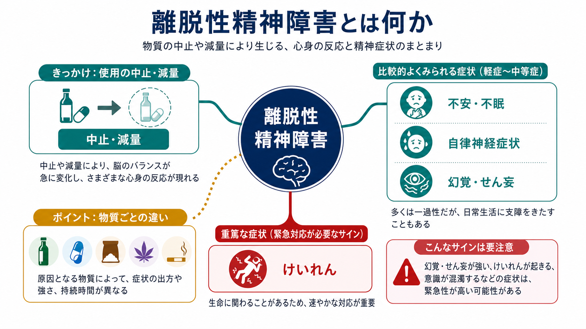
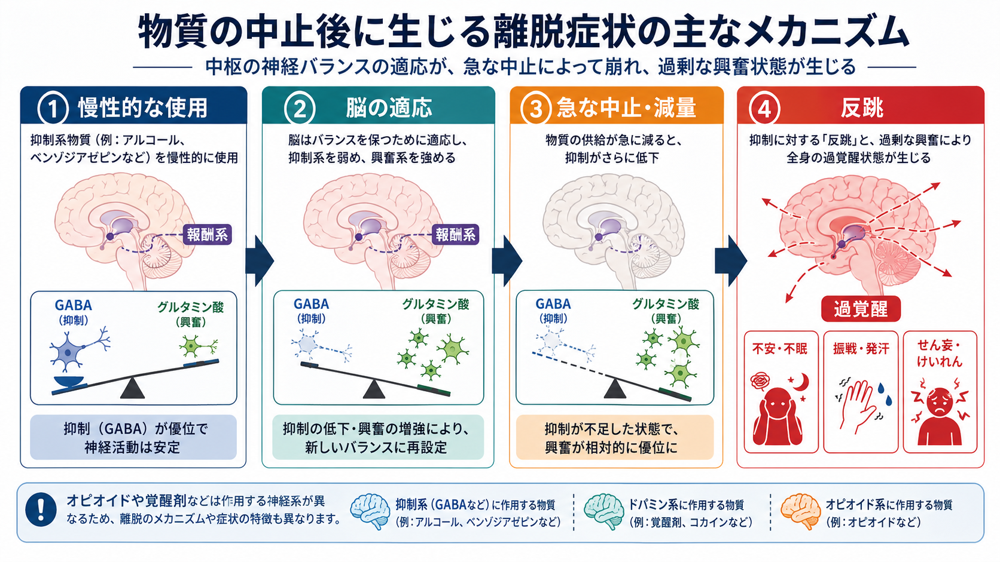
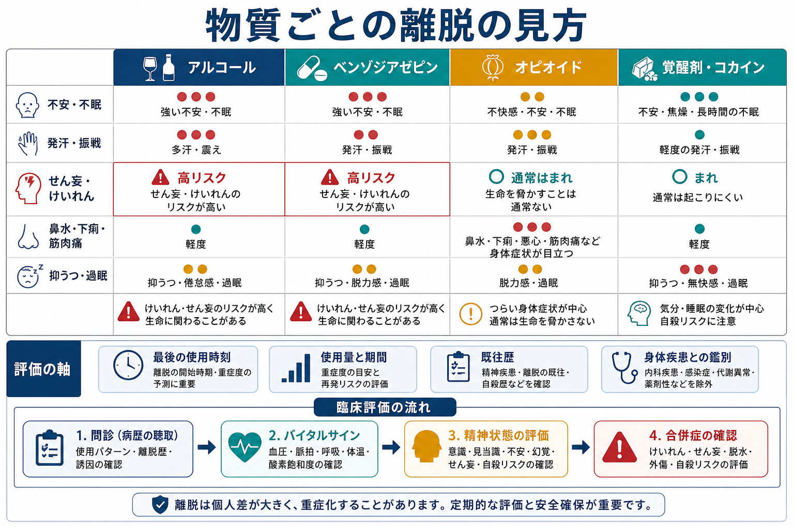

# 離脱性精神障害とは何か

## 要点

- 離脱性精神障害とは、アルコール、鎮静薬、オピオイド、覚醒剤、カフェインなどを反復使用したあと、急に中止・減量したときに生じる精神・身体症状のまとまりである。中核には、不安、不眠、焦燥、抑うつ、発汗、振戦、消化器症状、知覚変化、幻覚、せん妄、けいれんなどがある[1][2]。
- 「離脱」は単なる意志の弱さではなく、身体依存と脳の神経適応が崩れることで起きる生理学的な反応である。とくにアルコールやベンゾジアゼピンなどの中枢神経抑制系物質では、GABA 系とグルタミン酸系の再調整が急に露出し、過覚醒やけいれんリスクにつながる[6][8]。
- 物質ごとに危険度は大きく異なる。アルコールとベンゾジアゼピン離脱では、せん妄や全般性けいれんが生命に関わることがある。一方、オピオイド離脱は非常に苦痛が強いが、典型例では生命を直接脅かすことは比較的少ない[2][3][4]。
- 臨床では、最後の使用時刻、使用量、使用期間、過去の離脱歴、併用物質、身体疾患、意識状態、バイタルサイン、自殺リスクを同時にみる。この記事は教育・研究目的の整理であり、個別の中止方法や治療指示を示すものではない。

## この記事で答える問い

1. 離脱性精神障害は、[[物質使用障害とは何か]]や単なる「禁断症状」とどう違うのか。
2. なぜ中止・減量後に、不安、不眠、発汗、振戦、幻覚、せん妄、けいれんが起こりうるのか。
3. アルコール、ベンゾジアゼピン、オピオイド、覚醒剤・コカインでは、離脱の見方がどう違うのか。
4. どのようなサインが、研究・臨床上の高リスクとして扱われるのか。

## まず結論

離脱性精神障害は、「物質をやめたあとに気合いで耐える問題」ではなく、慢性的な物質曝露に適応していた脳と身体が、急な供給低下に追いつけなくなる状態である。とくに[[アルコール離脱とは何か]]や[[鎮静薬使用障害とは何か]]に関連する離脱では、抑制系の支えが急に弱まり、相対的な興奮優位、交感神経亢進、睡眠障害、幻覚、せん妄、けいれんが現れうる[3][6][8]。

ただし、離脱の症状は物質ごとに同じではない。オピオイドでは鼻水、流涙、下痢、筋肉痛、悪寒、強い不快感が中心になりやすいが、典型的な離脱そのものはアルコール離脱ほど生命危険性が高いとは限らない[2]。覚醒剤・コカインでは、抑うつ、過眠、疲労、強い渇望、不安、精神病症状や自殺リスクの評価が重要になる[2]。したがって、「離脱」という一語でまとめず、物質、時間経過、重症度、身体疾患、精神症状を分けて見る必要がある。

## 背景

ICD-11 では、アルコールなどの物質使用に関連する障害のなかに、離脱、知覚変化を伴う離脱、けいれんを伴う離脱、物質誘発性せん妄などが分類されている。アルコール離脱では、使用中止または減量後に、自律神経亢進、振戦、吐き気、不眠、不安、焦燥、抑うつ気分、錯覚・幻覚、注意散漫、けいれん、せん妄へ進展することがある[1]。

この分類が重要なのは、離脱症状が「元の不安症状の再燃」「中毒症状」「身体疾患による意識障害」「[[物質誘発性精神病とは何か]]」と似て見えるからである。たとえば、不眠や不安は離脱でも[[不眠障害とは何か]]や[[不安症群とは何か]]でも起こる。幻覚は離脱性せん妄でも物質誘発性精神病でも起こる。けいれんは離脱だけでなく、頭部外傷、低血糖、感染、てんかん、薬剤性の問題でも起こりうる。時間経過と身体評価を抜きにして、症状名だけで判断することはできない[5][7]。

## 基本概念

### 離脱、身体依存、物質使用障害

離脱は、物質の反復使用によって身体がその物質の存在に適応したあと、供給が急に減ることで生じる反応である。身体依存や耐性があると離脱は起こりやすいが、離脱があるだけで必ず[[物質使用障害とは何か]]があるとは限らない。医療上の適切な使用でも身体依存が生じることはあり、使用障害の評価では、制御困難、有害な結果、役割障害、危険な使用、渇望などを含めて総合的にみる。

逆に、物質使用障害がある人でも、すべての物質で重い離脱が起きるわけではない。離脱は診断名というより、使用パターン、薬理作用、身体状態、時間経過が交差する臨床現象として理解したほうがよい。

### 典型的な症状のまとまり

離脱症状は大きく四つに整理できる。

| 領域 | 例 | 注意点 |
|---|---|---|
| 精神症状 | 不安、焦燥、不眠、抑うつ、易刺激性、渇望 | 元の不安・うつの再燃と区別が難しい |
| 自律神経症状 | 発汗、頻脈、血圧上昇、振戦、発熱感 | アルコール・鎮静薬離脱で重症度評価に重要 |
| 知覚・意識の変化 | 錯覚、幻覚、見当識障害、注意障害、せん妄 | [[振戦せん妄とは何か]]や身体疾患との鑑別が必要 |
| 神経・身体症状 | けいれん、筋肉痛、下痢、嘔気、鼻水、過眠 | 物質ごとに中心症状が異なる |

## 仕組み

### 脳が「物質あり」の状態に合わせてしまう

慢性的な物質使用では、脳はその物質がある状態を前提にバランスを取り直す。アルコールやベンゾジアゼピンのような中枢神経抑制系物質では、抑制性の GABA 系と興奮性のグルタミン酸系の釣り合いが変わる。急に中止・減量すると、抑制の支えが外れたような状態になり、相対的な興奮、交感神経亢進、不眠、不安、振戦、発汗、けいれん、せん妄が起こりやすくなる[6][8]。

### 物質ごとの神経系が違う

この説明は、すべての物質に同じ形で当てはまるわけではない。オピオイドでは、オピオイド受容体、痛み、ストレス反応、ノルアドレナリン系、自律神経症状が中心になりやすい。覚醒剤やコカインでは、ドーパミン系・報酬系・睡眠覚醒リズム・気分調節が重要になる。カフェインでは頭痛、眠気、集中困難、易刺激性が問題になることがある。したがって、離脱を理解するには、報酬系の一般論だけでなく、物質ごとの薬理作用を見分ける必要がある。

### kindling と重症化リスク

アルコール離脱では、離脱を反復するほど次の離脱が重くなりやすいという kindling 仮説がよく知られている。過去の離脱けいれんやせん妄は、次回の重症化リスクを高く見積もる根拠になる[6][8]。この点は、離脱を「今回だけの不快症状」と見ず、過去の経過を含めて評価する理由になる。

## 図解

図の要点は、離脱を「ある・なし」で見るのではなく、物質ごとの危険パターンと評価軸を重ねて見ることである。アルコールとベンゾジアゼピンでは、せん妄・けいれんリスクがとくに重要である。オピオイドでは苦痛と脱水、再使用、過量摂取リスクへの接続が重要である。覚醒剤・コカインでは、抑うつ、過眠、精神病症状、自殺リスク、暴力・事故リスクの評価が重要になる[2][3][4]。

## 臨床・研究との接続

### 評価では時間経過が鍵になる

離脱の評価では、最後に使用した時刻、使用量、使用期間、使用経路、急な中止か漸減か、過去の離脱歴、併用物質、身体疾患を確認する。症状の時間経過が物質の薬理学と合っているかどうかは、鑑別の中心になる[2][5]。

たとえば、アルコール離脱では最終飲酒後 6-24 時間ごろから症状が出始め、36-72 時間ごろに強くなり、2-10 日程度続くことがあるとされる[2]。短時間作用型ベンゾジアゼピンでは離脱が比較的早く始まり、長時間作用型では遅れて出ることがある[2]。この時間差を見ないと、離脱、再燃、急性中毒、感染、代謝異常、頭部外傷を混同しやすい。

### 高リスクサイン

以下は、教育・研究上「重症化を疑うサイン」として整理できる。実際の対応は地域の医療体制と専門職の判断に依存する。

- 意識混濁、見当識障害、注意障害、強い幻覚、激しい焦燥
- 全般性けいれん、過去の離脱けいれん、過去の[[振戦せん妄とは何か]]
- 高熱、著しい頻脈・高血圧、脱水、電解質異常が疑われる状態
- 頭部外傷、感染、低血糖、肝障害、腎障害などの身体疾患
- ベンゾジアゼピン、アルコール、オピオイド、睡眠薬などの併用
- 自殺念慮、重い抑うつ、精神病症状、暴力・事故リスク

NICE は、急性アルコール離脱で離脱けいれんや振戦せん妄を発症している、または高リスクと評価される人には、入院での医学的離脱管理を提示している[4]。ASAM も、アルコール離脱管理はアルコール使用障害の治療そのものではなく、治療への導入過程の一部として位置づけるべきだと整理している[3]。

## よくある誤解

### 誤解1: 離脱は本人の意志が弱いから起こる

離脱は、神経適応と身体依存が急に崩れることで起きる。意志や性格だけで説明できる現象ではない。本人の責任を強調しすぎると、重症化サインの見落としや受診の遅れにつながる。

### 誤解2: どの物質の離脱も同じである

同じではない。アルコール・ベンゾジアゼピン離脱ではせん妄とけいれん、オピオイド離脱では強い身体的不快と再使用リスク、覚醒剤・コカイン離脱では気分・睡眠・精神病症状が中心になりやすい[2]。物質ごとの違いを無視すると、危険度の見積もりを誤る。

### 誤解3: 離脱を乗り切れば問題は終わる

離脱管理は重要だが、それだけで[[物質使用障害とは何か]]の長期的な回復が完了するわけではない。WHO と ASAM は、離脱管理を心理社会的支援や依存症治療につなげる最初の段階として位置づけている[2][3]。

### 誤解4: 幻覚があれば必ず一次性精神病である

幻覚は[[統合失調症とは何か]]だけでなく、離脱、急性中毒、身体疾患、睡眠不足、せん妄でも起こる。離脱性の幻覚やせん妄では、時間経過、意識・注意、身体所見、物質使用歴が重要になる[1][7]。

## 関連ノート

- [[物質使用障害とは何か]]
- [[アルコール離脱とは何か]]
- [[アルコール使用障害とは何か]]
- [[鎮静薬使用障害とは何か]]
- [[オピオイド使用障害とは何か]]
- [[覚醒剤使用障害とは何か]]
- [[カフェイン関連障害とは何か]]
- [[大麻使用障害とは何か]]
- [[物質誘発性精神病とは何か]]
- [[振戦せん妄とは何か]]
- [[不眠障害とは何か]]
- [[不安症群とは何か]]

### MOC更新候補

- `content/00_MOC/` 配下の精神医学、物質使用、依存症、臨床評価に関する MOC へ追加候補。
- 並列ジョブとの競合を避けるため、このタスクでは MOC 本体は更新しない。

### 今後の作成候補

- 離脱症候群とは何か
- ベンゾジアゼピン離脱とは何か
- オピオイド離脱とは何か
- 覚醒剤離脱とは何か
- 離脱せん妄とは何か

## 理解チェック

1. 離脱性精神障害と身体依存、物質使用障害は、それぞれどのように区別できるか。
2. アルコールやベンゾジアゼピン離脱で、GABA 系とグルタミン酸系のバランスはどのように変わりうるか。
3. オピオイド離脱が非常に苦痛である一方、典型例ではアルコール離脱ほど生命危険性が高いとは限らない理由は何か。
4. 離脱、物質誘発性精神病、せん妄、身体疾患による意識障害を区別するために、どの情報を確認する必要があるか。
5. 離脱管理だけで物質使用障害の長期支援が完了しない理由は何か。

## 参考文献

[1] World Health Organization. *ICD-11 for Mortality and Morbidity Statistics*. Alcohol withdrawal; alcohol-induced delirium. https://icd.who.int/browse11/l-m/en

[2] World Health Organization. *Clinical Guidelines for Withdrawal Management and Treatment of Drug Dependence in Closed Settings*. Geneva: WHO; 2009. NCBI Bookshelf. https://www.ncbi.nlm.nih.gov/books/NBK310652/

[3] American Society of Addiction Medicine. *The ASAM Clinical Practice Guideline on Alcohol Withdrawal Management*. 2020. https://www.asam.org/quality-care/clinical-guidelines/alcohol-withdrawal-management-guideline

[4] National Institute for Health and Care Excellence. *Alcohol-use disorders: diagnosis and management of physical complications (CG100)*. Published 2010; updated 2017. https://www.nice.org.uk/guidance/cg100/chapter/recommendations

[5] MSD Manual Professional Edition. Alcohol Toxicity and Withdrawal. Reviewed/Revised Dec 2022; modified Dec 2025. https://www.msdmanuals.com/en-gb/professional/special-subjects/recreational-drugs-and-intoxicants/alcohol-toxicity-and-withdrawal

[6] Becker, H. C. Neurochemical mechanisms of alcohol withdrawal. *Handbook of Clinical Neurology*. 2014;125:477-497. https://pmc.ncbi.nlm.nih.gov/articles/PMC6943828/

[7] Schuckit, M. A. Recognition and management of withdrawal delirium (delirium tremens). *New England Journal of Medicine*. 2014;371(22):2109-2113. https://doi.org/10.1056/NEJMra1407298

[8] Kattimani, S., & Bharadwaj, B. Clinical management of alcohol withdrawal: A systematic review. *Industrial Psychiatry Journal*. 2013;22(2):100-108. https://doi.org/10.4103/0972-6748.132914

## 未解決問題

- 離脱の重症化を、電子カルテ、ウェアラブル、睡眠、バイタルサイン、使用歴からどこまで早期予測できるか。
- アルコール・ベンゾジアゼピン・オピオイド・覚醒剤の離脱を横断して説明できる計算論的モデルはどこまで有用か。
- 離脱管理から長期支援への接続を、救急、一般診療、精神科、依存症専門治療、地域支援のあいだでどう設計するか。
