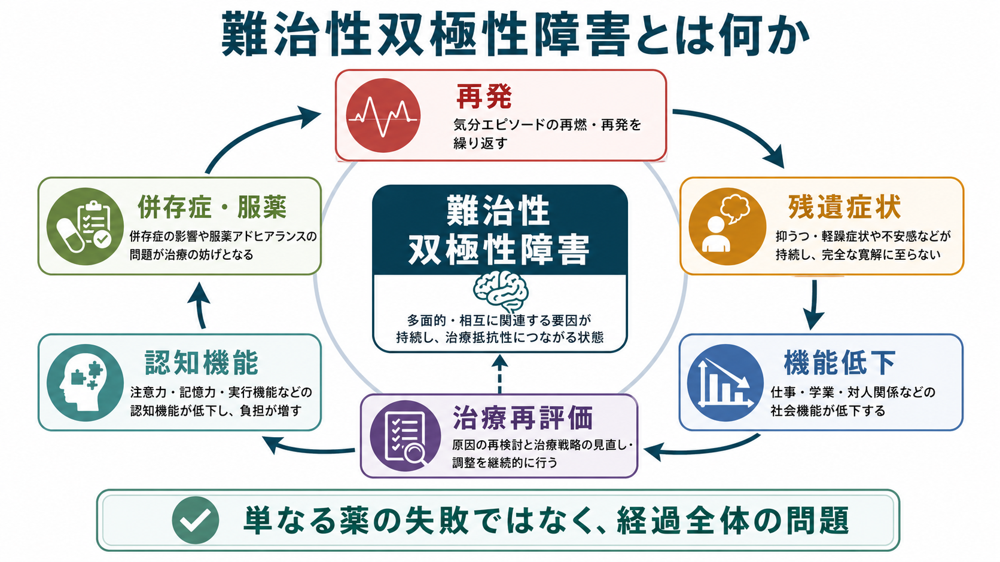
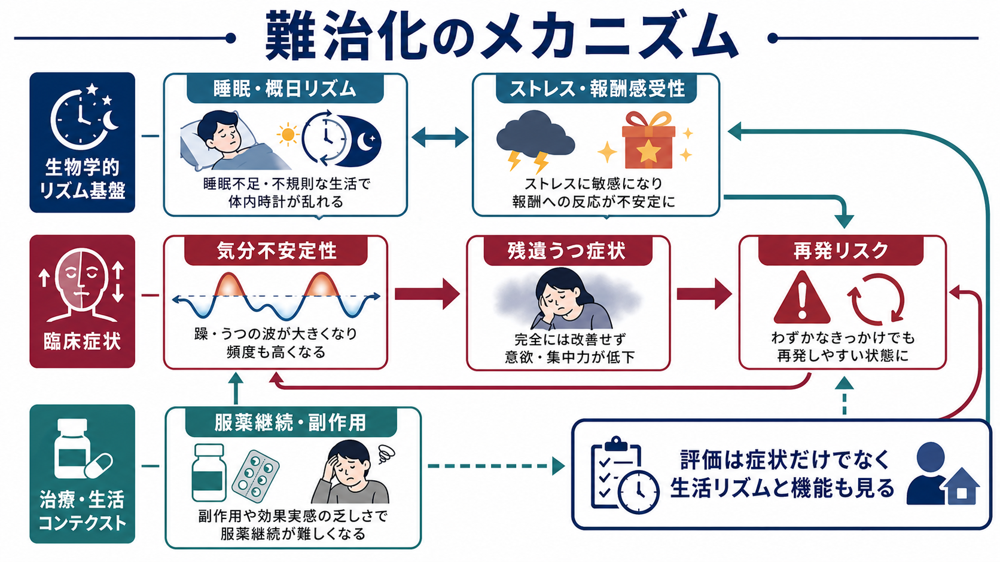
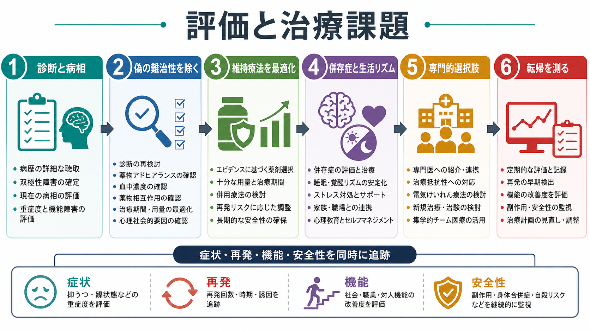

# 難治性双極性障害とは何か

## 要点

- 難治性双極性障害は、単に「薬が効かない双極性障害」ではなく、躁・軽躁・うつ・混合状態の再発、残遺症状、服薬継続の困難、併存症、生活リズムの乱れ、認知機能と社会機能の低下が絡み合う臨床構成概念である。
- 2025年の ISBD Task Force は、治療抵抗性双極性うつ病を「十分量・十分期間・十分なアドヒアランスで行われた少なくとも2つの承認薬治療で、有意で持続的な反応が得られない状態」と定義することを提案している[1]。
- ただし臨床で問題になる難治性は、双極性うつ病だけでなく、急性躁病、急速交代、維持期の再発、機能回復の不十分さにも及ぶ[2]。
- 評価では、診断の妥当性、病相、薬剤の用量・期間・血中濃度、服薬中断、副作用、物質使用、睡眠、身体疾患、心理社会的ストレスを確認し、「偽の難治性」を除く必要がある[2][3]。
- 本記事は教育・研究目的の整理であり、個別の診断や治療変更を指示するものではない。

## この記事で答える問い

1. 難治性双極性障害は、どのような状態を指すのか。
2. 「治療抵抗性双極性うつ病」と「再発を繰り返す双極性障害」は同じなのか。
3. 難治性と判断する前に、何を確認すべきか。
4. 再発予防、機能回復、自殺リスク、生活リズムをどのように同時に扱うのか。
5. 研究上、まだ何が標準化されていないのか。

## まず結論

難治性双極性障害とは、標準的な治療を試しても、気分エピソードの再発、残遺症状、生活・学業・職業・対人関係の機能低下、安全性の問題が臨床的に意味のある程度に残る状態を指す。狭義には「治療抵抗性双極性うつ病」として定義されることが多いが、実臨床ではうつ病相だけでなく、躁病相、混合状態、急速交代、維持療法中の再発、服薬継続困難、身体合併症、心理社会的支援不足まで含めて考える必要がある[1][2]。

そのため、難治性の評価は「次の薬を選ぶ」作業だけではない。まず診断と病相を再確認し、過去の治療が本当に十分量・十分期間だったか、血中濃度や相互作用は適切だったか、副作用や認知機能低下が生活機能を妨げていないか、物質使用・睡眠障害・身体疾患・家族や職場環境が再発を維持していないかを整理する[2][3]。

## 背景

[[うつ病とは何か|うつ病]]の治療抵抗性では「抗うつ薬をいくつ試したか」が中心になりやすい。一方、双極性障害では、うつ、躁、軽躁、混合状態、寛解期、維持期で治療目標が変わる。さらに抗うつ薬単剤は躁転や気分不安定化のリスクを伴うため、単純に単極性うつ病の枠組みを移植できない[1][4]。

CANMAT/ISBD 2018 ガイドラインは、双極性障害の治療を急性躁病、急性双極性うつ病、維持療法、併存症、安全性モニタリングに分け、薬物療法と心理教育・心理社会的介入を組み合わせて考える枠組みを示している[4]。NICE も、評価時には気分エピソード、再発パターン、社会機能、併存症、身体健康、薬物治療歴、家族や支援者からの情報を含めることを推奨している[3]。

したがって、難治性双極性障害は一回の診察で貼るラベルではなく、縦断的な病歴と治療歴から組み立てる作業仮説である。

## 基本概念

### 治療抵抗性双極性うつ病

もっとも標準化が進んでいるのは、治療抵抗性双極性うつ病である。ISBD Task Force は、双極I型うつ病ではクエチアピン、ルラシドン、オランザピン・フルオキセチン併用、カリプラジン、ルマテペロンなど、承認された治療を十分量・十分期間・十分なアドヒアランスで少なくとも2つ行っても、有意で持続的な臨床反応がない状態を治療抵抗性双極性うつ病と定義することを提案している[1]。

この定義の重要点は、失敗数だけではない。「十分な用量」「十分な期間」「服薬継続」「現在の病相」「承認薬またはエビデンスのある治療」という条件がそろって初めて、治療抵抗性と呼べる。短期間の少量投与、早期中断、副作用による不十分投与、診断のずれ、物質使用による症状増悪を同じ箱に入れてしまうと、治療抵抗性を過大評価する。

### 維持期の難治性

臨床上は、急性うつ病相が改善しても、数か月から数年の単位で再発を繰り返すことが問題になる。CINP の治療抵抗性双極性障害ガイドラインは、急性躁病、双極性うつ病、維持期のそれぞれで治療抵抗性を考える必要を示している[2]。維持期では、リチウム、抗てんかん薬、非定型抗精神病薬、組み合わせ療法、心理社会的介入を、再発予防と安全性の両面から評価する。

### 機能低下を伴う難治性

症状が軽くなっても、仕事、学業、家事、対人関係、自己管理が戻らないことがある。双極性障害の機能評価に関する系統的レビューでは、機能障害は症状寛解後も残りうる重要なアウトカムであり、職業・教育、社会、家族、認知機能などの領域を分けて測る必要があるとされる[5]。この観点では、[[実行機能障害とは何か|実行機能障害]]、注意、記憶、処理速度の問題も、再発予防と同じくらい臨床的に重要になる。

## 仕組み

難治化は単一の原因で起こるわけではない。典型的には、以下の要因が循環を作る。

- 睡眠不足や不規則な生活が、概日リズムと気分安定性を乱す。
- ストレス、報酬感受性、対人葛藤が、躁・軽躁・うつの揺れを増やす。
- 残遺うつ症状が、活動低下、回避、服薬継続困難、自己効力感の低下を招く。
- 薬剤の副作用、体重増加、鎮静、認知鈍麻が、治療継続と生活機能を妨げる。
- 再発と入院が重なるほど、学業・職業・家族役割の再建が難しくなる。

World Psychiatry の臨床特性化レビューは、双極性障害を一つの均質な疾患として扱うのではなく、病相、発症年齢、急速交代、混合特徴、認知、併存症、トラウマ、社会的決定要因、治療反応性を含む多面的な表現型として把握する必要を強調している[6]。難治性を考えるときも、「薬理学的反応性」だけでなく、患者ごとの臨床表現型を組み立てることが重要である。

## 図解

難治性双極性障害の評価は、次の順序で考えると整理しやすい。

| 評価軸 | 確認すること | 見落とすと起こる問題 |
|---|---|---|
| 診断 | 双極I型、双極II型、混合特徴、急速交代、物質誘発性、身体疾患 | そもそも治療標的がずれる |
| 病相 | 急性躁病、急性うつ病、混合状態、維持期、残遺症状 | うつだけを治療して躁転や再発を招く |
| 治療十分性 | 用量、期間、血中濃度、併用、相互作用、服薬状況 | 偽の難治性を難治性と誤認する |
| 機能 | 職業・学業、家族、対人関係、認知機能、生活リズム | 症状改善だけで回復と誤認する |
| 安全性 | 自殺リスク、衝動性、物質使用、身体合併症、副作用 | 有効でも続けられない治療になる |
| 支援 | 心理教育、家族支援、睡眠介入、再発サイン、地域資源 | 再発予防が本人の努力だけに還元される |

## 臨床・研究との接続

### 薬物療法の最適化

リチウム、バルプロ酸、ラモトリギン、非定型抗精神病薬などは、病相と目的に応じて位置づけが異なる。CANMAT/ISBD では、急性躁病、双極性うつ病、維持療法ごとに第一選択・第二選択が整理されており、過去の反応、副作用、併存症、妊娠可能性、代謝リスク、治療中断歴を踏まえて選択する[4]。リチウムは再発予防薬として重要であり、気分障害における自殺予防効果を支持するメタ解析もあるが、腎機能、甲状腺、副甲状腺、血中濃度などのモニタリングが不可欠である[7]。

### 心理社会的介入

難治性では、薬物療法だけで全体像を説明しにくい。心理教育、家族焦点化療法、認知行動療法、対人関係・社会リズム療法、睡眠・生活リズムの安定化、再発サインの共有、服薬支援は、薬物療法と並行して検討される。NICE は、再発の早期警告サイン、個人の対処方略、危機時の連絡先を含むリスク管理計画を本人と共同で作ることを推奨している[3]。

### 専門的選択肢

標準治療で十分な改善が得られない場合、専門医療機関で、電気けいれん療法、反復経頭蓋磁気刺激、光療法、薬物増強、新規治療、臨床試験などが検討されることがある。ただし、CINP は治療抵抗性双極性障害に対する多くの介入について、エビデンスが限られている領域が多いことも示している[2]。したがって、専門的選択肢は「最後に何でも試す」ではなく、病相、重症度、安全性、本人の価値観、利用可能性を踏まえた意思決定として扱う。

### 研究上の課題

難治性双極性障害の研究では、定義の不統一が大きな問題である。急性うつ病相の治療抵抗性は標準化が進みつつあるが、維持期の再発、機能回復、認知機能、生活リズム、治療継続性を含む包括的な難治性の定義はまだ十分に統一されていない[1][2][5]。今後は、症状尺度だけでなく、再発までの時間、入院、職業・学業機能、生活の質、自殺関連アウトカム、身体健康、安全性を同時に測る研究デザインが必要になる。

## よくある誤解

### 誤解1: 難治性とは「本人が治る気がない」という意味である

これは誤りである。難治性は、病相、薬理学的反応、身体合併症、副作用、認知機能、生活リズム、家族・職場環境、医療アクセスが重なって生じる状態を記述する言葉である。本人の責任に還元すると、評価すべき要因を見落とす。

### 誤解2: 2種類の薬を試せば、すぐ治療抵抗性と判断してよい

薬剤名が2つ並ぶだけでは不十分である。十分量、十分期間、アドヒアランス、血中濃度、病相、併存症、相互作用、早期中断の理由を確認しなければならない[1][2]。

### 誤解3: 症状が軽くなれば、難治性の問題は終わる

症状寛解と機能回復は同じではない。双極性障害では、認知機能や社会機能の問題が残り、再発リスクと生活上の負担を高めることがある[5]。

### 誤解4: 薬物療法か心理社会的支援か、どちらかを選ぶ問題である

難治性では、薬物療法、心理教育、睡眠・社会リズム、家族支援、職場・学校調整、身体健康管理を組み合わせる必要がある。どれか一つだけで、再発、機能、安全性をすべて解決できるとは限らない[3][4]。

## 関連ノート

- [[うつ病とは何か]]
- [[不眠とは何か]]
- [[希死念慮とは何か]]
- [[実行機能障害とは何か]]
- [[治療抵抗性統合失調症とは何か]]

### 関連ノート候補

- 双極性障害とは何か
- 双極性うつ病とは何か
- 躁病とは何か
- 軽躁病とは何か
- 急速交代型双極性障害とは何か
- リチウム療法とは何か
- 対人関係・社会リズム療法とは何か

### MOC更新候補

- `content/00_MOC/MOC・精神医学.md`
- `content/00_MOC/MOC・臨床実践・治療.md`

同時編集を避けるため、このジョブでは MOC 本体は更新しない。

## 理解チェック

1. 治療抵抗性双極性うつ病を定義するとき、「2剤失敗」以外に何を確認する必要があるか。
2. 難治性双極性障害で、症状評価だけでなく機能評価が必要な理由は何か。
3. 「偽の難治性」にはどのような例があるか。
4. リチウムを考えるとき、有効性と同時にどのような安全性モニタリングが必要か。
5. 心理教育や生活リズム介入が、再発予防に関係するのはなぜか。

## 未解決問題

- 治療抵抗性双極性うつ病以外の、維持期・急速交代・混合状態を含む難治性定義はまだ十分に標準化されていない。
- 症状改善、再発予防、職業・学業機能、認知機能、自殺関連アウトカムを同時に改善する介入の比較研究が不足している。
- 実臨床で使いやすい、治療反応性と副作用脆弱性を予測するバイオマーカーやデジタル指標は確立していない。
- 薬物療法、心理社会的介入、家族支援、職場・学校支援を、どの順序と強度で組み合わせるのが最適かは個別性が大きい。

## 参考文献

[1] Vieta, E., McIntyre, R. S., Suppes, T., et al. (2025). Defining Treatment-Resistant Bipolar Depression: Recommendations From the ISBD Task Force. *Bipolar Disorders*, 27(6), 411-423. https://doi.org/10.1111/bdi.70048

[2] Fountoulakis, K. N., Yatham, L. N., Grunze, H., et al. (2020). The CINP Guidelines on the Definition and Evidence-Based Interventions for Treatment-Resistant Bipolar Disorder. *International Journal of Neuropsychopharmacology*, 23(4), 230-256. https://doi.org/10.1093/ijnp/pyz064

[3] National Institute for Health and Care Excellence. (2025). *Bipolar disorder: assessment and management* (NICE Clinical Guideline CG185, last updated 2 September 2025). https://www.nice.org.uk/guidance/cg185

[4] Yatham, L. N., Kennedy, S. H., Parikh, S. V., et al. (2018). Canadian Network for Mood and Anxiety Treatments (CANMAT) and International Society for Bipolar Disorders (ISBD) 2018 guidelines for the management of patients with bipolar disorder. *Bipolar Disorders*, 20(2), 97-170. https://doi.org/10.1111/bdi.12609

[5] Chen, M., Fitzgerald, H. M., Madera, J. J., & Tohen, M. (2019). Functional outcome assessment in bipolar disorder: A systematic literature review. *Bipolar Disorders*, 21(3), 194-214. https://doi.org/10.1111/bdi.12775

[6] McIntyre, R. S., Alda, M., Baldessarini, R. J., et al. (2022). The clinical characterization of the adult patient with bipolar disorder aimed at personalization of management. *World Psychiatry*, 21(3), 364-387. https://doi.org/10.1002/wps.20997

[7] Cipriani, A., Hawton, K., Stockton, S., & Geddes, J. R. (2013). Lithium in the prevention of suicide in mood disorders: updated systematic review and meta-analysis. *BMJ*, 346, f3646. https://doi.org/10.1136/bmj.f3646
