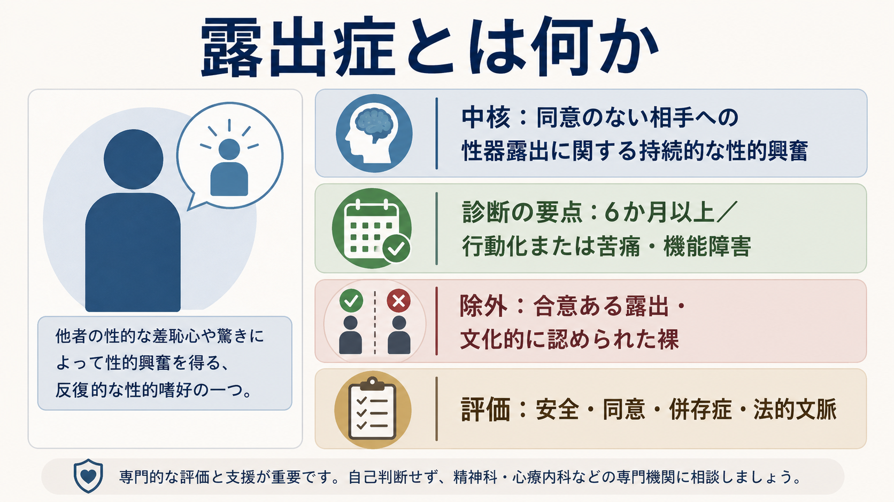
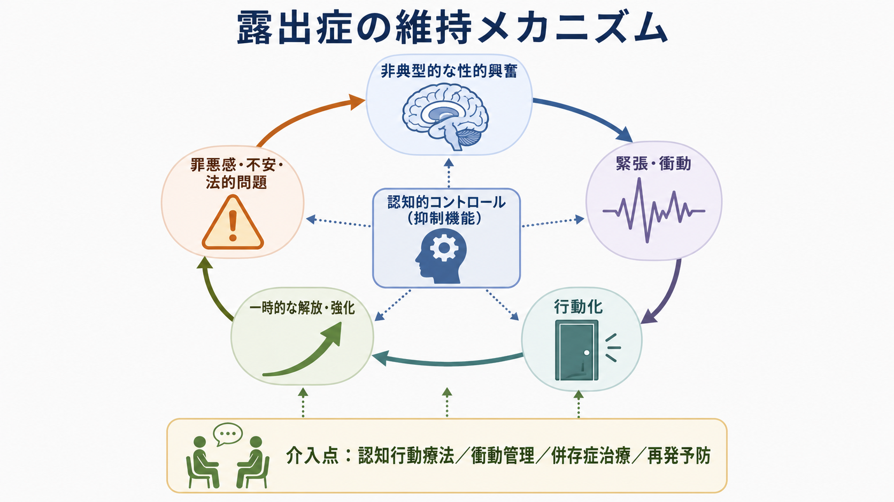

# 露出症とは何か

## 要点

- 露出症は、同意のない相手、または予期していない相手へ性器を露出することに関連した、持続的で強い性的興奮パターンを中核とする[[精神疾患とは何か|精神医学的概念]]である[1][2]。
- 診断では、単に「露出行為があった」だけでは足りない。DSM-5-TR では少なくとも6か月続く反復的・強い性的興奮があり、非同意の相手に行動化した、または本人に臨床的に意味のある苦痛・機能障害があることが重視される[1][3]。
- ICD-11 では、同意のある露出や文化的に認められた裸、躁状態・認知症・物質使用などによる一過性の逸脱行動とは区別される[2]。
- 臨床では、本人支援と被害防止を切り離さず、同意、安全、併存症、法的文脈、再発予防を評価する[4][5]。
- 本記事は教育・研究目的の整理であり、個別の診断、治療指示、法的判断を行うものではない。

## この記事で答える問い

1. 露出症は、なぜ単なる「不適切行為」ではなく診断概念として整理されるのか。
2. 「露出行為」「露出嗜好」「露出症」はどこで区別されるのか。
3. どのような心理・行動メカニズムが維持に関わるのか。
4. 臨床評価では何を確認し、どのような支援につなげるのか。

## まず結論

露出症を理解するうえで最も重要なのは、「性器を露出した」という行為そのものだけで診断しないことである。診断概念としての露出症は、同意のない相手に対する露出をめぐる持続的・焦点化された性的興奮パターン、行動化、または本人の苦痛・機能障害を組み合わせて判断する[1][2]。

この区別は、倫理的にも臨床的にも重要である。合意のある成人間の性的表現、文化的に認められた裸、芸術・医療・介護・スポーツなど文脈上説明できる露出は、露出症と同一視されない。一方で、同意のない相手を驚かせる、羞恥や恐怖を与える、またはその反応に性的興奮が結びつく場合には、本人の苦痛が乏しくても他者への害が診断上の重要な要素になる[2][4]。

臨床的には、非難だけで理解が進むわけではない。必要なのは、被害防止を最優先しながら、衝動、性的興奮パターン、認知の偏り、羞恥、孤立、物質使用、躁状態、認知症、パーソナリティ特性、法的制約を評価し、現実的な再発予防計画につなげることである[5][6]。

## 背景

露出行為は、司法・地域安全・被害者支援の文脈で語られることが多い。しかし精神医学では、すべての逸脱行動を疾患化するのではなく、どのような心理的パターン、持続性、苦痛、機能障害、他者への害があるかを見分ける。この姿勢は[[DSMとICDは何が違うのか|DSMとICD]]の診断体系にも共通している。

DSM-5 以降の重要な変更点は、「パラフィリア」と「パラフィリア障害」を分けたことである。非典型的な性的関心があるだけでは、ただちに精神障害とはみなされない。診断上問題になるのは、本人の苦痛・機能障害、または同意できない相手・同意していない相手への害やリスクが関わる場合である[3][4]。

ICD-11 でも同様に、パラフィリア障害は単なる性的少数性や非典型的な嗜好のラベルではない。むしろ、同意できない相手を巻き込む、または本人・相手に重大な危険をもたらす性的興奮パターンを、精神保健上の支援とリスク管理の対象として扱う枠組みである[2][7]。

## 基本概念

### 露出行為・露出嗜好・露出症

「露出行為」は観察できる行動を指す。「露出嗜好」は、露出されること、見られること、または露出することへの性的関心を指す広い言葉である。これらは文脈によっては合意ある成人間の性的表現に含まれることがあり、それだけで疾患ではない[3]。

「露出症」は、非同意の相手に対する露出に関連した持続的で強い性的興奮パターンがあり、それが行動化される、または本人に臨床的に意味のある苦痛・機能障害を生む場合に問題となる。ICD-11 の提案・解説では、合意ある露出や文化的に認められた裸は除外され、さらに一過性・機会的・衝動的な行為だけでは診断に不十分とされる[2]。

### 同意が中核にある

露出症の理解では、同意が中心概念である。露出する側の意図だけでなく、相手が予期していたか、拒否できたか、心理的安全が保たれていたかが重要になる。これは[[同意能力の評価はどのように行うのか|同意能力]]や権力関係、年齢、状況によって変わるため、臨床評価では単純な「合意した／していない」だけでなく、文脈を丁寧に確認する。

### 鑑別が必要な状態

露出行為があっても、背景が露出症とは限らない。たとえば[[躁病エピソードとは何か|躁状態]]では脱抑制や性的逸脱行動が起こりうる。[[認知症とは何か|認知症]]では前頭葉機能低下に伴う社会的判断の障害が関わることがある。[[物質使用障害とは何か|物質使用]]や中毒では衝動制御の低下が目立つこともある[2][5]。この場合、持続的な露出性の性的興奮パターンが中核なのか、別の病態による脱抑制なのかを分けて考える。

## 仕組み

露出症の維持メカニズムは、単一の原因で説明しにくい。研究・臨床では、性的興奮パターン、衝動性、認知の歪み、情動調整、強化学習、対人関係の困難、併存症、環境要因が組み合わさると考えるのが実用的である[5][6]。

### 興奮パターンと強化

ある人では、相手の驚き、羞恥、恐怖、拒否反応などが性的興奮と結びつく。この結びつきが反復されると、緊張や孤立感が高まったときに露出衝動が生じ、行動化後に一時的な解放感が得られる。すると短期的な解放感が負の強化として働き、長期的には罪悪感、不安、法的問題、対人関係の悪化を招くにもかかわらず、行動が維持されやすくなる。

この構造は、[[強迫症とは何か|強迫症]]における不安低減のループや、[[物質使用障害とは何か|物質使用障害]]における一時的軽減と再発のループと似た面がある。ただし露出症では、非同意の他者を巻き込む点が決定的に重要であり、本人の内的苦痛だけを見て評価してはならない。

### 認知的コントロールと衝動

衝動は「突然湧くもの」として経験されることがあるが、実際には先行する状況があることが多い。孤立、飲酒、怒り、性的欲求不満、ストレス、睡眠不足、過去の成功体験、匿名性の高い環境などが、行動化の閾値を下げる。[[ケースフォーミュレーションとは何か|ケースフォーミュレーション]]では、引き金、思考、身体感覚、行動、結果を時系列で整理する。

また、本人が「実害はない」「相手も気にしていない」「止められないから仕方ない」と考えている場合、被害や責任の過小評価が起こる。こうした認知は、衝動管理や再発予防の対象になる[5][6]。

### 併存症と発達・対人要因

露出症は単独で現れることもあるが、[[併存症とは何か|併存症]]の評価が重要である。反社会性パーソナリティ特性、[[反社会性パーソナリティ障害とは何か|反社会性パーソナリティ障害]]、[[素行症とは何か|素行症]]、物質使用、気分症、認知症、性的機能の問題、孤立、対人関係の困難が関わることがある[1][5]。司法サンプルの追跡研究では、再犯リスクは一様ではなく、アルコール問題、反社会性、過去の犯罪歴、他の性的関心など複数の要因と関連していた[8]。

## 図解

| 図 | 読み方 |
|---|---|
| 図1 | 露出症の概念地図。診断では「同意のない相手」「6か月以上の持続性」「行動化または苦痛・機能障害」「除外・鑑別」をまとめて見る。 |
| 図2 | 維持メカニズム。非典型的な性的興奮、緊張・衝動、行動化、一時的解放、罪悪感・不安・法的問題が循環しうる。 |
| 図3 | 臨床・研究との接続。評価、鑑別、支援、リスクマネジメントを同時に扱う必要がある。 |

## 臨床・研究との接続

### 評価で確認すること

臨床評価では、まず安全を確認する。現在進行中の被害リスク、接近可能な対象、法的制約、被害者との接触、職場・学校・地域での状況を把握する。これは[[他害リスク評価では何を見るべきか|他害リスク評価]]の一部であり、本人の治療同盟を作ることと矛盾しない。

次に、露出行為の頻度、期間、状況、相手の同意の有無、性的興奮との結びつき、行動前後の感情、隠蔽、反省、再発パターンを確認する。DSM-5-TR の6か月基準や、ICD-11 の「持続的・焦点化された性的興奮パターン」という観点は、単発の行為と病態を区別するための道具になる[1][2]。

### 支援の方向性

支援では、心理教育、衝動管理、認知の再構成、再発予防、ストレス対処、物質使用への介入、併存症治療、社会的支援を組み合わせる。[[心理教育とは何か|心理教育]]では、本人の羞恥を増幅するだけではなく、同意、被害、責任、法的リスク、早期相談の意味を明確にする。

薬物療法については、SSRI が衝動性や性的強迫性の軽減を目的に用いられることがあり、重症例や高リスク例では性欲を低下させる薬剤が検討されることがある。ただし、抗アンドロゲン薬や GnRH アゴニストなどは副作用、同意、モニタリング、倫理性が大きな問題になるため、専門的評価と慎重な適応判断が必要である[6]。この記事は個別の治療選択を勧めるものではない。

### 研究上の注意

露出症の研究は、司法サンプル、臨床サンプル、自己報告、被害経験調査で推定値が大きく変わる。逮捕・受診に至った人だけを対象にすると、一般化に限界がある。一方で自己報告では過小申告や社会的望ましさバイアスが生じる。したがって、有病率、再犯率、治療効果を読むときは、サンプルの性質、追跡期間、アウトカム定義を確認する必要がある[4][8]。

## よくある誤解

### 誤解1: 露出行為があれば必ず露出症である

違う。露出症の診断には、持続的で焦点化された性的興奮パターン、行動化または苦痛・機能障害、同意の欠如、鑑別診断が必要である[1][2]。

### 誤解2: 合意ある性的表現も露出症に含まれる

違う。合意ある成人間の性的表現や、文化的に認められた裸は露出症とは区別される[2][7]。ただし、同意の有無は文脈、年齢、権力差、判断能力によって変わるため、単純化しない。

### 誤解3: 本人が苦痛を感じていなければ疾患ではない

必ずしもそうではない。非同意の相手に行動化している場合、本人の苦痛が乏しくても他者への害が診断・介入上の中心問題になる[1][4]。

### 誤解4: 露出症の人は必ず身体的接触を求める

多くの場合、露出行為は接触を目的としないと記述されることが多いが、これは安全性を意味しない。被害者の恐怖や羞恥、生活上の影響、再発リスクを軽視してはならない[1][8]。

## 関連ノート

- [[精神疾患とは何か]]
- [[DSMとICDは何が違うのか]]
- [[性機能障害群とは何か]]
- [[同意能力の評価はどのように行うのか]]
- [[他害リスク評価では何を見るべきか]]
- [[ケースフォーミュレーションとは何か]]
- [[心理教育とは何か]]
- [[物質使用障害とは何か]]
- [[躁病エピソードとは何か]]
- [[認知症とは何か]]

MOC更新候補: `content/00_MOC/MOC｜精神医学.md`、司法精神医学または性・同意に関するMOCが今後整備される場合はそこにも配置候補。

## 理解チェック

1. 露出行為が一度あっただけで、なぜ露出症と診断してはいけないのか。
2. 露出症の評価で「同意」が中心になる理由は何か。
3. 躁状態、認知症、物質使用による脱抑制と、露出症はどの点で鑑別されるか。
4. 支援において、本人の治療同盟と被害防止を同時に扱うには何を確認する必要があるか。

## 参考文献

[1] Merck Manual Professional Edition. *Exhibitionistic Disorder*. Reviewed/Revised Oct 2025. https://www.merckmanuals.com/professional/psychiatric-disorders/paraphilias-and-paraphilic-disorders/exhibitionistic-disorder

[2] Krueger, R. B., Reed, G. M., First, M. B., Marais, A., Kismodi, E., & Briken, P. (2017). Proposals for Paraphilic Disorders in the International Classification of Diseases and Related Health Problems, Eleventh Revision (ICD-11). *Archives of Sexual Behavior, 46*, 1529-1545. https://doi.org/10.1007/s10508-017-0944-2

[3] American Psychiatric Association. *Paraphilic Disorders* (DSM-5 fact sheet). https://www.psychiatry.org/File%20Library/Psychiatrists/Practice/DSM/APA_DSM-5-Paraphilic-Disorders.pdf

[4] First, M. B. (2014). DSM-5 and Paraphilic Disorders. *Journal of the American Academy of Psychiatry and the Law, 42*(2), 191-201. https://jaapl.org/content/42/2/191

[5] Fisher, K. A., & Marwaha, R. (2023). *Paraphilia*. StatPearls. NCBI Bookshelf. https://www.ncbi.nlm.nih.gov/books/NBK554425/

[6] Thibaut, F., Cosyns, P., Fedoroff, J. P., Briken, P., Goethals, K., & Bradford, J. M. W. (2020). The World Federation of Societies of Biological Psychiatry (WFSBP) 2020 guidelines for the pharmacological treatment of paraphilic disorders. *The World Journal of Biological Psychiatry, 21*(6), 412-490. https://doi.org/10.1080/15622975.2020.1744723

[7] World Health Organization. *ICD-11 for Mortality and Morbidity Statistics, 2026-01 release: Paraphilic disorders*. https://icd.who.int/browse/releases/mms/en

[8] Firestone, P., Kingston, D. A., Wexler, A., & Bradford, J. M. (2006). Long-term follow-up of exhibitionists: psychological, phallometric, and offense characteristics. *Journal of the American Academy of Psychiatry and the Law, 34*(3), 349-359. https://jaapl.org/content/34/3/349

## 未解決問題

- 一般人口における露出症の有病率は、自己報告・司法統計・臨床サンプルで推定が異なり、精密な比較が難しい。
- 心理療法、薬物療法、司法的介入、地域支援をどのように組み合わせると再発予防と本人支援の両方に有効かは、研究デザイン上の制約が大きい。
- 同意、文化、法制度、オンライン環境の変化が、露出症の評価や支援にどう影響するかは継続的に検討する必要がある。
