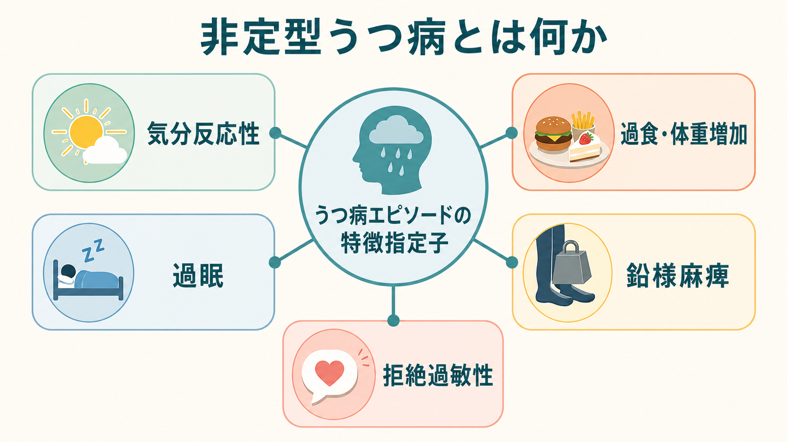
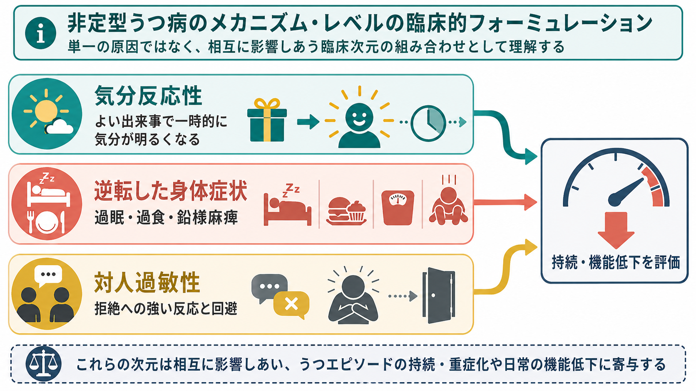

# 非定型うつ病とは何か

## 要点

- 非定型うつ病は、独立した単一疾患名というより、[[うつ病とは何か]]や双極性障害の抑うつエピソードに付けられる「非定型特徴」の指定子として理解するとよい[1]。
- 中核は、よい出来事や環境変化に対して一時的に気分が明るくなりうる「気分反応性」であり、そこに過食・体重増加、過眠、鉛様麻痺、対人拒絶過敏性のうち複数が組み合わさる[1][2]。
- 「非定型」という語は、まれ・奇妙・軽症という意味ではない。メランコリー型の不眠・食欲低下・気分反応性低下とは対照的な特徴をもつ、歴史的に名づけられた臨床パターンである[3][5]。
- 妥当性については支持と限界がある。非定型特徴は臨床的に有用だが、気分反応性と他の非定型症状の結びつきは必ずしも強くなく、症状次元として慎重に扱う必要がある[6][7]。
- 医療上は、双極性、季節性、過眠・摂食、物質使用、身体疾患、対人不安、機能低下、自殺リスクを含めて評価する。この記事は教育・研究目的の整理であり、個別の診断や治療指示ではない。

## この記事で答える問い

1. 非定型うつ病は通常のうつ病と何が違うのか。
2. 気分反応性、過眠、過食、鉛様麻痺、拒絶過敏性をどう理解すればよいのか。
3. なぜ「非定型」という名称なのに、臨床的には重要なのか。
4. 研究・臨床評価では、どこに注意すべきなのか。

## まず結論

非定型うつ病は、「気分が明るくなる瞬間があるから軽い」という状態ではない。むしろ、気分反応性が残っていても、過眠、過食、身体の重さ、拒絶への強い反応、回避、慢性化、機能低下が組み合わさり、生活・対人関係・学業や仕事を大きく損なうことがある[2][7]。

診断実務では、非定型特徴は[[DSMとICDは何が違うのか]]でいう操作的診断の「補助的な特徴指定子」に近い。つまり、「うつ病かどうか」を置き換えるラベルではなく、抑うつエピソードの表れ方、鑑別、経過予測、治療選択の検討材料として使う。

## 背景

非定型うつ病という概念は、メランコリー型のような「内因性・典型的」と考えられていたうつ状態と異なる患者群を説明するために発展した。歴史的には、過眠・過食・疲労感・対人過敏性を示す抑うつ患者が、三環系抗うつ薬よりモノアミン酸化酵素阻害薬に反応しやすい可能性が注目され、非定型特徴の概念が臨床研究に取り込まれた[2][3]。

ただし、現在の理解では、薬への反応だけで非定型うつ病を定義するのは不十分である。DSM 系の分類では、非定型特徴は大うつ病エピソードなどに付与される指定子であり、症状の組み合わせとして記述される[1]。CANMAT のうつ病ガイドラインも、非定型特徴を「反応性気分、過眠、過食、鉛様麻痺、対人拒絶過敏性」を含む臨床次元として整理している[8]。

## 基本概念

### 気分反応性

気分反応性とは、実際または予期されるよい出来事に反応して、気分が一時的に明るくなることを指す[1][2]。ここで重要なのは、「楽しい予定なら少し笑える」「人と会うと一時的に動ける」ことが、うつ病を否定しない点である。むしろ、その後に強い疲労、過眠、回避、自己批判が戻る場合、抑うつエピソードの一部として理解する必要がある。

気分反応性は非定型特徴の中心項目だが、研究上は他の非定型症状との相関が弱いという報告もある[7]。したがって、気分反応性だけで状態を決めつけず、過眠・過食・身体の重さ・拒絶過敏性・機能低下を合わせて評価する。

### 過眠

過眠は、夜間睡眠の延長、日中の強い眠気、起床困難として現れる。[[睡眠障害とは何か]]と重なるが、非定型うつ病では「眠れない」よりも「眠りすぎる」「寝ても回復しない」が前景に立ちやすい[2]。睡眠時無呼吸、概日リズム障害、薬剤、身体疾患との鑑別も必要である。

### 過食・体重増加

過食や体重増加は、食欲低下が目立つメランコリー型と対照的な「逆転した身体症状」として扱われる[2][5]。[[食欲と体重変化から何がわかるのか]]で扱うように、食欲変化は気分、睡眠、活動量、ストレス、薬剤、内分泌、摂食行動の影響を受ける。非定型うつ病では、炭水化物欲求や慰めとしての食行動が問題になることもあるが、単純な意志の弱さとして扱うべきではない。

### 鉛様麻痺

鉛様麻痺は、腕や脚が鉛のように重く感じられる状態を指す[1][2]。疲労、倦怠感、精神運動制止と重なるが、「身体が重くて動作を始めにくい」という主観的体験が特徴的である。慢性疲労、貧血、甲状腺機能異常、薬剤性鎮静、睡眠障害などの身体的要因も評価対象になる。

### 拒絶過敏性

拒絶過敏性は、批判・無視・否定・関係の変化を強く予期し、それに対して大きく傷つく、怒る、回避する、対人関係や仕事に支障が出る状態である[1][2]。これは「傷つきやすい性格」と同義ではない。抑うつ、不安、対人経験、発達歴、パーソナリティ傾向、社会的文脈が絡み合う臨床現象として評価する。

## 仕組み

非定型うつ病の仕組みは、単一の脳内物質不足では説明できない。現在は、気分反応性、睡眠・食欲・活動量の調整、報酬処理、ストレス反応、対人予測、回避行動が相互に影響する臨床次元として理解する方が実用的である[3][7]。

### 報酬と活動性

気分反応性が残ることは、[[報酬系とは何か]]や[[報酬系の異常はうつ病をどう説明するのか]]と関係する。よい出来事に反応できる一方で、日常的な行動開始、努力、持続、将来予測が低下している場合、短期的な反応性と長期的な機能回復は分けて考える必要がある。[[行動活性化とは何か]]が重視するように、活動と報酬経験の循環が崩れると、回避と抑うつが互いに強化される。

### ストレス反応と身体症状

過眠、過食、鉛様麻痺は、睡眠覚醒、代謝、疲労感、ストレス反応の変化として現れる。[[HPA軸は精神疾患にどう関わるのか]]で扱うように、ストレス応答系はうつ病の一部症状と関連するが、非定型特徴に固有の単純なバイオマーカーが確立しているわけではない[3]。

### 対人予測と回避

拒絶過敏性では、「拒絶されるかもしれない」という予測が注意、解釈、身体反応、行動を変える。拒絶を避けるための回避は短期的には苦痛を下げるが、長期的には孤立、機会損失、自己評価低下を強めることがある。ここには[[不安とは何か]]、[[予期不安とは何か]]、[[気分不安定性とは何か]]と重なる臨床次元がある。

## 図解

### 図1：特徴の概念地図

1枚目の図は、非定型うつ病を「気分反応性を中心に、過眠・過食・鉛様麻痺・拒絶過敏性が組み合わさる指定子」として示している。ポイントは、非定型特徴が「うつ病ではない証拠」ではなく、うつ病エピソードの表れ方を補足する情報である点である。

### 図2：メカニズム・レベルの臨床的フォーミュレーション

2枚目の図は、よい出来事への一時的反応、逆転した身体症状、対人過敏性が互いに影響し、持続・重症化・機能低下の評価につながることを示している。これは原因を一つに決める図ではなく、臨床面接で情報を整理するための作業仮説である。

### 図解案：非定型特徴とメランコリー特徴の比較

3枚目は生成画像の配置が誤解を招く可能性があったため、本文には挿入しない。必要なら、次のプロンプトで再生成する。

> 非定型特徴とメランコリー特徴を左右2列で比較する日本語インフォグラフィック。左列は「非定型特徴：気分反応性あり、過眠・過食、鉛様麻痺、拒絶過敏性」。右列は「メランコリー特徴：快感消失が目立つ、早朝覚醒・食欲低下、精神運動変化、朝に悪いことが多い」。中央に「併存・双極性・季節性も確認」「厳密な境界ではなく評価の手がかり」と置く。医学教育向け、簡潔、正確、非スティグマ的。

## 臨床・研究との接続

### 評価で見ること

非定型特徴を評価するときは、症状の有無だけでなく、期間、重症度、生活機能、誘因、日内変動、季節性、双極性、薬剤、身体疾患、自殺リスクを確認する。過眠や過食があっても、それだけで非定型うつ病とはいえない。抑うつエピソード全体の文脈の中で、気分反応性と複数の特徴がどの程度前景化しているかを見る[1][8]。

### 双極性・季節性との関係

非定型特徴は、双極性障害の抑うつ、季節性パターン、若年発症、女性、慢性化、不安症との併存などと関連して報告されてきた[3][4]。ただし、研究結果は一貫しない部分もあるため、「非定型特徴があるから双極性」とは言えない。気分高揚、活動性増加、睡眠欲求低下、衝動性、家族歴、抗うつ薬使用時の気分変化などを丁寧に確認する。

### 治療選択との関係

古典的研究では、非定型特徴をもつ患者で MAOI が TCA より有効である可能性が注目された[2][3]。しかし、現代のガイドラインでは、非定型特徴だけで特定の抗うつ薬を一律に選ぶ根拠は強くない。CANMAT 2016 は、非定型特徴に対して特定の抗うつ薬が明確に優越するとはいえず、古い研究では MAOI が TCA より優れていたと整理している[8]。治療は、重症度、既往、併存症、忍容性、安全性、患者の希望を踏まえて専門家が判断する。

## よくある誤解

### 「気分がよくなる瞬間があるなら、うつ病ではない」

誤りである。非定型特徴では、よい出来事に一時的に反応できることが中核に含まれる[1]。重要なのは、その反応が持続的な回復につながっているか、日常機能が戻っているか、過眠・過食・身体の重さ・拒絶過敏性がどの程度残っているかである。

### 「非定型は軽いうつ病である」

誤りである。非定型特徴をもつ抑うつは慢性化、若年発症、対人機能低下、不安症との併存と関連することがある[2][7]。軽症か重症かは、症状名ではなく、苦痛、機能低下、持続、自殺リスク、併存症で評価する。

### 「過眠や過食があれば非定型うつ病である」

不十分である。過眠や過食は重要な手がかりだが、非定型特徴は気分反応性と複数の関連特徴からなる指定子である[1]。また、睡眠障害、摂食障害、内分泌疾患、薬剤、生活リズム、物質使用なども鑑別に入る。

### 「拒絶過敏性は本人の性格の問題である」

単純化しすぎである。拒絶過敏性は対人経験、予測、情動反応、回避、抑うつの相互作用として理解できる。本人の責任に還元すると、評価や支援の焦点を見失う。

## 関連ノート

- [[うつ病とは何か]]
- [[抑うつ気分とは何か]]
- [[DSMとICDは何が違うのか]]
- [[睡眠障害とは何か]]
- [[食欲と体重変化から何がわかるのか]]
- [[報酬系とは何か]]
- [[報酬系の異常はうつ病をどう説明するのか]]
- [[行動活性化とは何か]]
- [[HPA軸は精神疾患にどう関わるのか]]
- [[不安とは何か]]
- [[予期不安とは何か]]
- [[気分不安定性とは何か]]

MOC更新候補：`MOC精神医学`、`MOC臨床精神医学`、`MOCうつ病・気分障害`。並列ジョブとの衝突を避けるため、この記事では MOC 本体は更新しない。

今後の作成候補：メランコリー型うつ病とは何か、双極性障害とうつ病はどう鑑別するのか、季節性うつ病とは何か、拒絶過敏性とは何か、鉛様麻痺とは何か。

## 理解チェック

1. 非定型うつ病で「気分反応性」があることは、なぜうつ病を否定しないのか。
2. 過眠・過食・鉛様麻痺は、メランコリー特徴とどのように対照的か。
3. 拒絶過敏性を「性格」だけで説明すると、どの評価が抜け落ちるか。
4. 非定型特徴があるとき、双極性、季節性、身体疾患、睡眠障害を確認する理由は何か。

## 参考文献

[1] American Psychiatric Association. (2022). *Diagnostic and Statistical Manual of Mental Disorders, Fifth Edition, Text Revision (DSM-5-TR)*. American Psychiatric Association Publishing. https://doi.org/10.1176/appi.books.9780890425787

[2] Thase, M. E. (2002). Depression with atypical features: Diagnostic validity, prevalence, and treatment. *Primary Care Companion to The Journal of Clinical Psychiatry*, 4(2), 63-69. https://pmc.ncbi.nlm.nih.gov/articles/PMC181236/

[3] Stewart, J. W., McGrath, P. J., Quitkin, F. M., & Klein, D. F. (2009). DSM-IV depression with atypical features: Is it valid? *Neuropsychopharmacology*, 34, 2625-2632. https://doi.org/10.1038/npp.2009.99

[4] Lam, R. W., & Stewart, J. N. (1996). The validity of atypical depression in DSM-IV. *Comprehensive Psychiatry*, 37(6), 375-383. https://doi.org/10.1016/S0010-440X(96)90020-6

[5] Parker, G., Roy, K., Mitchell, P., Wilhelm, K., Malhi, G., & Hadzi-Pavlovic, D. (2002). Atypical depression: A reappraisal. *American Journal of Psychiatry*, 159(9), 1470-1479. https://doi.org/10.1176/appi.ajp.159.9.1470

[6] Posternak, M. A., & Zimmerman, M. (2001). Symptoms of atypical depression. *Psychiatry Research*, 104(2), 175-181. https://doi.org/10.1016/S0165-1781(01)00301-8

[7] Posternak, M. A., & Zimmerman, M. (2002). Partial validation of the atypical features subtype of major depressive disorder. *Archives of General Psychiatry*, 59(1), 70-76. https://doi.org/10.1001/archpsyc.59.1.70

[8] Lam, R. W., McIntosh, D., Wang, J., Enns, M. W., Kolivakis, T., Michalak, E. E., et al. (2016). Canadian Network for Mood and Anxiety Treatments (CANMAT) 2016 clinical guidelines for the management of adults with major depressive disorder. *Canadian Journal of Psychiatry*, 61(9), 510-523. https://doi.org/10.1177/0706743716659416

## 未解決問題

- 非定型特徴はカテゴリとして扱うべきか、過眠・過食・拒絶過敏性などの症状次元として扱うべきか。
- 気分反応性は診断上どの程度中心的な指標なのか。
- 非定型特徴をもつ患者群で、どの生物学的・心理社会的マーカーが再現性をもつのか。
- 現代の抗うつ薬、心理療法、睡眠・生活リズム介入において、非定型特徴が治療反応をどの程度予測するのか。
