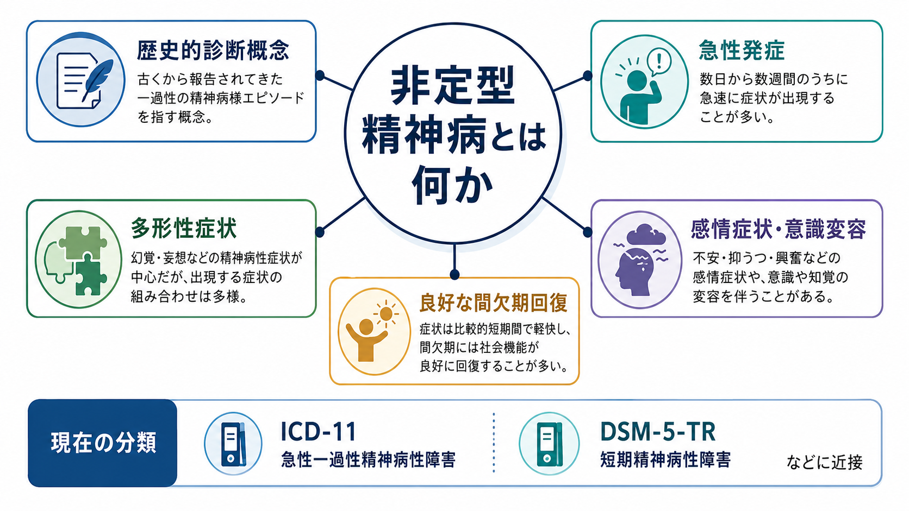
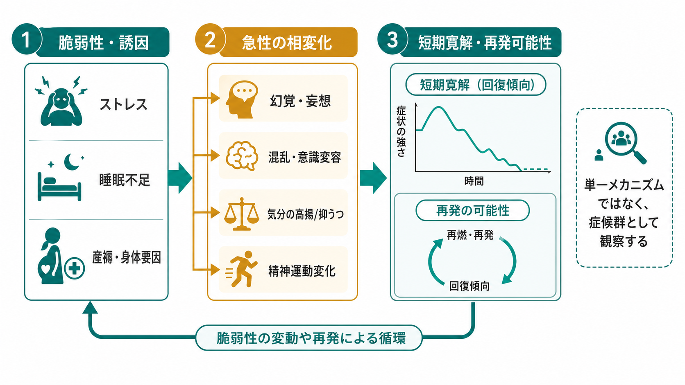
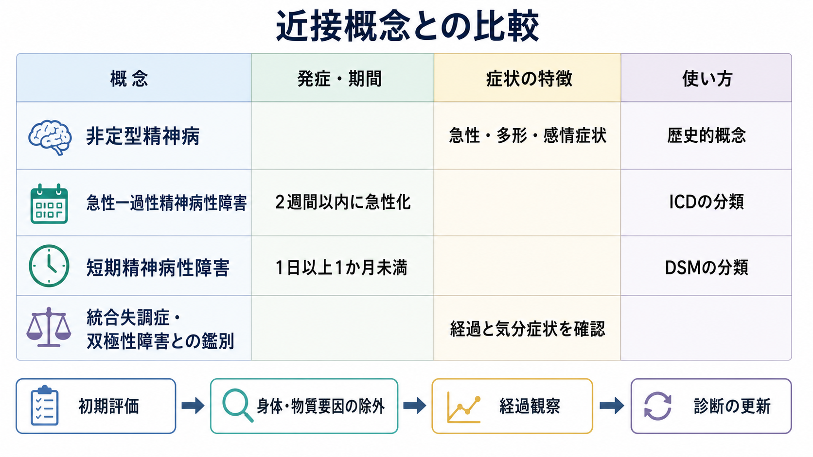

# 非定型精神病とは何か

## 要点

- 非定型精神病は、現代の標準診断名というより、[[統合失調症とは何か|統合失調症]]と[[双極性障害とは何か|躁うつ病・双極性障害]]の二分法に収まりにくい、急性・多形・回復性の精神病像を指してきた歴史的概念である[1][2]。
- 典型的には、急性ないし亜急性の発症、幻覚・妄想、混乱や意識変容、気分症状、精神運動症状、寛解後の比較的良好な機能回復が重視される[3][4]。
- 現在の分類では、近い領域が [[急性一過性精神病性障害とは何か|急性一過性精神病性障害]]、[[短期精神病性障害とは何か|短期精神病性障害]]、[[統合失調感情障害とは何か|統合失調感情障害]]、気分障害に伴う精神病、身体・物質要因による精神病に分散して扱われる[4][5]。
- したがって、非定型精神病は「診断を確定するラベル」ではなく、急性精神病を経過・気分症状・意識変容・身体要因・再発性から見直すための臨床的な視点として読むのが安全である。

## この記事で答える問い

1. 非定型精神病は、どのような歴史的背景から生まれた概念なのか。
2. どのような症状・経過が「非定型」と呼ばれてきたのか。
3. 現代の DSM / ICD 診断とどう対応し、どこで対応しきれないのか。
4. 臨床・研究では、この概念をどのように使うと誤解が少ないのか。

## まず結論

非定型精神病とは、クレペリン以来の「早発性痴呆・統合失調症」と「躁うつ病」という二大分類だけでは説明しにくい、急性で変動性が高く、感情症状や意識変容を伴いやすく、寛解期には比較的よく回復する精神病像を指す概念である。日本では満田久敏の臨床遺伝学的研究の影響を受け、典型的な統合失調症や躁うつ病の単なる変異型ではなく、異質性をもつ境界領域の疾患群として議論されてきた[1][2]。

ただし、現在の DSM-5-TR や ICD-11 では「非定型精神病」という単一の正式診断名が中心に置かれているわけではない。ICD-11 の急性一過性精神病性障害は、前駆期なしに急性発症し、2週間以内に重症度が最大化し、妄想・幻覚・思考解体・困惑・混乱・気分変動などが急速に変化する状態として定義される[4]。DSM 系の短期精神病性障害は、1日以上1か月未満の精神病症状と病前機能への回復を軸にする[5]。非定型精神病は、これらに近接するが、完全に同一ではない。

## 背景

精神病の分類史では、長期的に人格・認知・社会機能が崩れていく統合失調症型の経過と、気分エピソードとして反復しやすい躁うつ病型の経過が大きな軸になってきた。しかし臨床では、急に発症し、幻覚・妄想・興奮・混迷・気分症状が入り混じり、数日から数か月で大きく回復する症例が観察される。こうした症例は、フランスの bouffee delirante、ドイツ語圏の cycloid psychosis、北欧の reactive psychosis、Kasanin の acute schizoaffective psychosis など、地域ごとに異なる名前で議論されてきた[1][6]。

日本の「非定型精神病」概念は、満田の研究とその後の日本精神医学の議論のなかで発展した。Hatotani のレビューによれば、日本の概念では急性発症、多形性、良好な予後に加えて、意識変容やてんかんとの疾病学的位置づけにも注意が払われ、統合失調症・躁うつ病・てんかんの境界領域に置かれることが多かった[1]。

## 基本概念

### 非定型とは何に対して非定型なのか

ここでの「非定型」は、単に症状が珍しいという意味ではない。むしろ、典型的な統合失調症のような慢性的陰性症状・認知機能低下・持続的機能低下とも、典型的な気分障害エピソードだけでも説明しにくい、経過と症候の組み合わせを指す。

重要な観察軸は次の通りである。

| 観察軸 | 非定型精神病で重視される点 |
|---|---|
| 発症 | 急性または亜急性に立ち上がる |
| 症状 | 幻覚・妄想・混乱・気分症状・精神運動症状が変動する |
| 意識 | 困惑、混迷、意識水準の揺れが注目されることがある |
| 経過 | 寛解後に病前に近い機能へ戻ることがある |
| 再発 | 周期性・反復性を示す場合がある |
| 分類 | 現代分類では複数診断にまたがる |

### 現代分類との対応

ICD-11 の急性一過性精神病性障害は、急性発症、短い持続、症状の急速な変化、身体疾患・物質・薬剤の直接効果では説明されないことを重視する[4]。一方、DSM 系の短期精神病性障害は、1日以上1か月未満という期間と、病前機能への完全な回復を重視する[5]。

この対応は便利だが、非定型精神病のすべてを置き換えるわけではない。日本の文脈で議論されてきた非定型精神病には、意識変容、周期性、てんかんや身体因子との関連、遺伝学的な独自性の仮説など、分類診断だけでは拾いにくい論点が含まれる[1][2][3]。

## 仕組み

非定型精神病に単一の確立したメカニズムがあるわけではない。むしろ、複数の経路が「急性で多形的な精神病像」という似た表現型に収束する症候群的な概念として理解するのが妥当である。

1つ目は、気分調節と精神病症状の重なりである。急性期に躁的高揚、抑うつ、不安、恐怖、恍惚感、焦燥が精神病症状と絡む場合、[[双極性障害とは何か|双極性障害]]、精神病症状を伴う気分障害、[[統合失調感情障害とは何か|統合失調感情障害]]との境界が問題になる。

2つ目は、意識・注意・覚醒の変動である。困惑、混乱、混迷、精神運動の過活動または低活動が目立つ場合、[[せん妄と認知症はどう違うのか|せん妄]]、てんかん、自己免疫性脳炎、内分泌疾患、薬剤・物質による精神病との鑑別が重要になる。20世紀半ばの非定型精神病記載が、現代の抗 NMDA 受容体脳炎の一部と現象学的に似ている可能性も議論されているが、過去症例を後方視的に確定診断することはできない[3]。

3つ目は、短期寛解と再発性である。短い精神病エピソードは初回寛解が良好に見える一方で、再発や診断変更のリスクが残る。短期精神病エピソードのメタ解析では、急性一過性精神病性障害、短期精神病性障害、短い精神病リスク状態の間で再発予後に大きな差は見られず、寛解した初回統合失調症よりは長期予後が良い傾向が示された[7]。これは「良くなるから心配ない」という意味ではなく、初期診断を固定せず経過で見直す必要があるという意味である。

## 図解

非定型精神病は、次の3層で整理すると理解しやすい。

| 層 | 見ること | 臨床的な意味 |
|---|---|---|
| 症状層 | 幻覚・妄想・混乱・気分症状・精神運動症状 | 何が起きているかを記述する |
| 経過層 | 急性発症、短期寛解、周期性、再発 | 診断の更新と予後評価に使う |
| 原因層 | 気分障害、身体疾患、物質、自己免疫、てんかん、一次性精神病 | 鑑別と研究仮説を立てる |

## 臨床・研究との接続

### 臨床での使い方

臨床では、非定型精神病という言葉を「正式診断名」として安易に使うより、急性精神病の評価視点として使う方が有用である。とくに次の点を確認する。

- 発症が数時間、数日、数週、数か月のどの時間幅で進んだか。
- 幻覚・妄想だけでなく、気分症状、混乱、意識変容、精神運動症状がどの程度あるか。
- 症状が日内・日間で急速に変わるか。
- 身体疾患、感染、内分泌、自己免疫、てんかん、睡眠不足、産褥、薬剤、物質使用が関与していないか。
- 寛解後にどの程度、病前機能へ戻るか。
- 再発時に同じ型を繰り返すか、別の診断像へ移行するか。

この確認は、[[初回エピソード精神病とは何か|初回エピソード精神病]]の評価とも重なる。診断名を急いで固定するより、急性期の安全確保、身体・物質要因の除外、経過観察、家族や支援者からの情報、再評価の計画が重要になる。

### 研究での使い方

研究では、非定型精神病は均質な疾患単位というより、表現型を絞り込むための入口になる。日本の研究では、非定型精神病が短期精神病性障害や急性一過性精神病性障害に対応しうること、急性発症、幻覚、気分障害、周期的悪化、寛解期の正常生活、認知機能低下の少なさなどが記述されている[2][8]。また、自己免疫性脳炎のような身体医学的基盤が、一部の急性多形性精神病像を説明する可能性も研究課題になっている[3]。

## よくある誤解

### 誤解1: 非定型精神病は DSM や ICD の正式診断名である

現在の標準分類では、非定型精神病は中心的な正式診断名ではない。近い診断はあるが、急性一過性精神病性障害、短期精神病性障害、気分障害に伴う精神病、統合失調感情障害、身体・物質要因による精神病などに分かれる。

### 誤解2: 非定型精神病なら予後は必ず良い

急性発症で寛解が良い症例は多く議論されてきたが、再発や診断変更はありうる。短期精神病エピソードの予後研究も、初回エピソード後の追跡が重要であることを示している[7]。

### 誤解3: 統合失調症でも双極性障害でもない「第三の病気」と断定できる

そのように断定すると危険である。非定型精神病は、境界領域を考えるための概念であり、経過のなかで [[統合失調症とは何か|統合失調症]]、[[双極性障害とは何か|双極性障害]]、[[統合失調感情障害とは何か|統合失調感情障害]]、身体疾患、物質関連障害などの診断へ再整理されることがある。

### 誤解4: 身体疾患の評価は不要である

むしろ逆である。急性、混乱、意識変容、精神運動異常、自律神経症状、けいれん、産褥、薬剤変更、感染徴候がある場合は、身体・神経学的評価を軽視しない。非定型性は「精神科的に珍しい」だけでなく、「身体要因を見逃さない」ための手がかりにもなる。

## 関連ノート

- [[急性一過性精神病性障害とは何か]]
- [[短期精神病性障害とは何か]]
- [[初回エピソード精神病とは何か]]
- [[統合失調症とは何か]]
- [[双極性障害とは何か]]
- [[統合失調感情障害とは何か]]
- [[せん妄と認知症はどう違うのか]]
- [[器質性精神病とは何か]]
- [[ステロイド精神病とは何か]]

MOC 更新候補:
- `content/00_MOC/` 配下の精神医学、疾患・症候群、診断・鑑別、精神病性障害関連 MOC
- 並列作業との競合を避けるため、このジョブでは MOC 本体は更新しない。

## 理解チェック

1. 非定型精神病の「非定型」は、どのような典型像に対する非定型なのか。
2. 非定型精神病と、ICD-11 の急性一過性精神病性障害はどの点で近く、どの点で同一ではないのか。
3. 急性精神病で意識変容や精神運動症状が目立つとき、なぜ身体・物質要因の評価が重要になるのか。
4. 「寛解がよい」ことと「再発や診断変更がない」ことは、なぜ同じではないのか。

## 参考文献

[1] Hatotani, N. (1996). The concept of 'atypical psychoses': special reference to its development in Japan. *Psychiatry and Clinical Neurosciences, 50*(1), 1-10. https://doi.org/10.1111/j.1440-1819.1996.tb01656.x

[2] Mitsuda, H. (1965). The concept of "atypical psychoses" from the aspect of clinical genetics. *Acta Psychiatrica Scandinavica, 41*(3), 372-377. https://doi.org/10.1111/j.1600-0447.1965.tb04996.x

[3] Komagamine, T., Kanbayashi, T., Suzuki, K., Hirata, K., & Nishino, S. (2022). "Atypical psychoses" and anti-NMDA receptor encephalitis: A review of literature in the mid-twentieth century. *Psychiatry and Clinical Neurosciences, 76*(4), 171-172. https://pmc.ncbi.nlm.nih.gov/articles/PMC9303716/

[4] World Health Organization. *ICD-11 for Mortality and Morbidity Statistics: 6A23 Acute and transient psychotic disorder*. https://icd.who.int/browse/2025-01/mms/en#284410555

[5] Stephen, A., & Lui, F. (2023). Brief Psychotic Disorder. In *StatPearls*. StatPearls Publishing. https://www.ncbi.nlm.nih.gov/books/NBK539912/

[6] Perme, B., & Chandrasekaran, R. (2011). Cycloid psychosis: Perris criteria revisited. *Indian Journal of Psychological Medicine, 33*(1), 54-58. https://pmc.ncbi.nlm.nih.gov/articles/PMC3137814/

[7] Fusar-Poli, P., Cappucciati, M., Bonoldi, I., et al. (2016). Prognosis of brief psychotic episodes: A meta-analysis. *JAMA Psychiatry, 73*(3), 211-220. https://doi.org/10.1001/jamapsychiatry.2015.2313

[8] Kushima, I., Aleksic, B., Nakatochi, M., et al. (2018). Next-generation sequencing analysis of multiplex families with atypical psychosis. *Translational Psychiatry, 8*, 221. https://pmc.ncbi.nlm.nih.gov/articles/PMC6189064/

## 未解決問題

- 非定型精神病に含まれてきた症例群のうち、どの割合が一次性精神病、気分障害、自己免疫性脳炎、てんかん、内分泌・代謝疾患、物質関連障害に再分類できるのか。
- 急性多形性、意識変容、周期性、寛解後回復を組み合わせた表現型は、遺伝学・免疫学・脳波・画像・認知機能のどの指標と結びつくのか。
- 現代の早期精神病サービスで、非定型精神病という歴史的概念を、診断固定ではなく再評価と層別化の道具としてどう活かせるのか。
