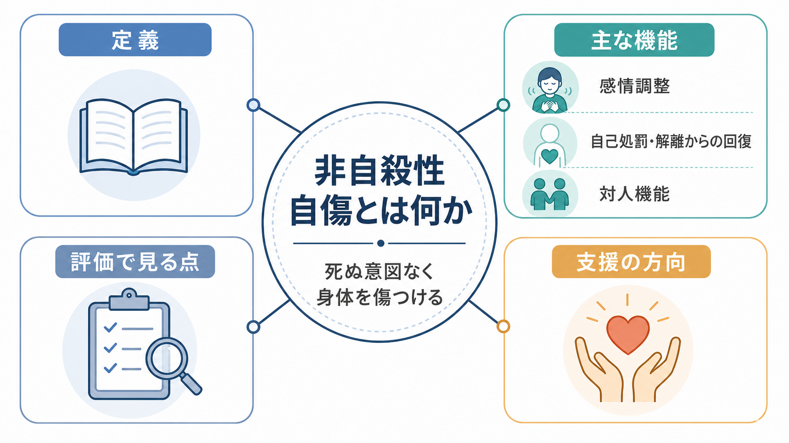
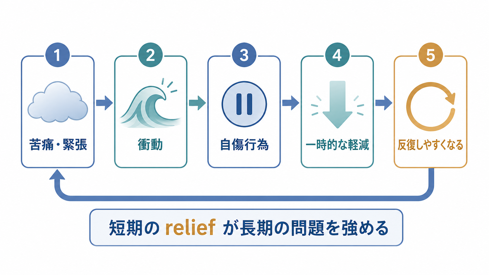
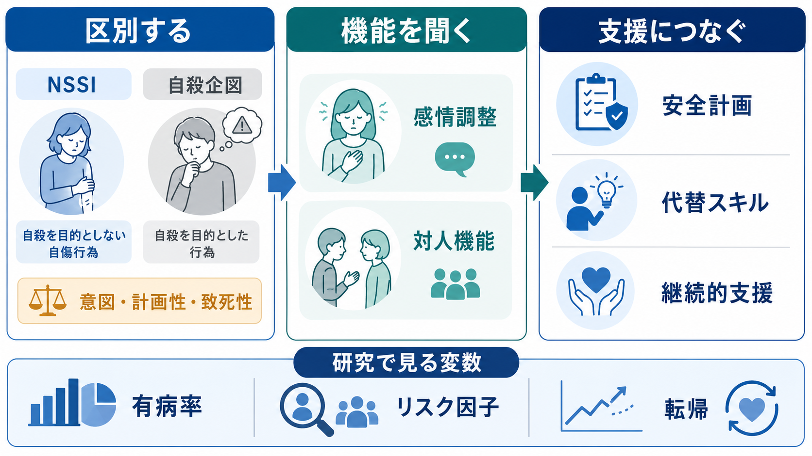

# 非自殺性自傷とは何か

## 要点

- 非自殺性自傷（non-suicidal self-injury; NSSI）は、死ぬ意図なしに、自分の身体組織を意図的に傷つける行動を指す。文化的・社会的に承認された身体加工や軽微な習慣とは区別して扱う[1][2]。
- NSSIは「注目を集めたいだけ」でも「必ず自殺したい」でもない。多くの場合、強い苦痛、緊張、怒り、空虚感、解離感を短期的に下げる感情調整として機能する[3][4]。
- ただし、NSSIと自殺企図は同じではない一方で、反復するNSSIは将来の自殺念慮・自殺企図リスクと関連するため、安全評価を省略してよいという意味ではない[6][7]。
- 臨床では、行為の方法だけでなく、意図、計画性、致死性、頻度、直前の感情、行為後の変化、対人状況、併存症、支援資源を合わせて評価する[8]。

## この記事で答える問い

1. 非自殺性自傷は、どのように定義されるのか。
2. なぜ、死ぬ意図がなくても身体を傷つける行動が起こるのか。
3. 感情調整機能と対人機能は、どのように区別して理解できるのか。
4. NSSIと自殺企図は、何が同じで何が違うのか。
5. 研究・臨床では、どの点を見落とさずに扱うべきか。

## まず結論

非自殺性自傷は、本人にとって「苦痛を一時的に下げるための行動」として理解すると見通しがよくなる。自傷の外見だけを見ると不可解に見えるが、直前には強い不安、怒り、恥、自己嫌悪、空虚感、解離感があり、行為後には一時的な relief、感覚の回復、自己処罰感、対人メッセージの伝達が生じることがある[3][4]。

しかし、その短期的な軽減は、長期的には「苦痛が上がると自傷で下げる」という学習を強めやすい。さらに、秘密、罪悪感、身体的危険、対人関係の悪化、医療回避が重なると、次の危機が深くなる。したがって、NSSIを理解する目的は、本人を責めることではなく、同じ機能をより安全な手段で担えるように、評価と支援を組み直すことである[8]。

## 背景

NSSIは青年期から若年成人期に多く報告されるが、特定の年齢層や診断名だけに閉じた現象ではない。非臨床サンプルを対象にしたメタ分析では、推定有病率は研究方法によって大きく変わるものの、青年では約17%、若年成人では約13%、成人では約6%と報告されている[5]。このばらつきは、質問紙の文言、対象集団、期間、NSSIの定義が研究ごとに異なるためである。

診断分類上は、DSM-5で「さらなる研究を要する状態」として非自殺性自傷症が提示された。これはNSSIを[[境界性パーソナリティ障害とは何か]]の一症状だけに還元せず、独自の臨床的まとまりとして研究するための枠組みである[2]。ただし、現時点でも診断名を急いで貼るより、頻度、機能、苦痛、生活機能、併存症、自殺リスクを具体的に見ることが重要である。

## 基本概念

### NSSIの定義

NSSIは、典型的には「死ぬ意図なしに、身体組織を直接・意図的に損傷する行動」と定義される[1]。ここで重要なのは、身体損傷の有無だけでなく、「自殺意図が主目的ではないこと」「文化的に承認された儀礼や装飾ではないこと」「偶発的な怪我ではないこと」である。

この定義は、自殺リスクを軽く見るためのものではない。NSSIのエピソードでは本人が「死ぬつもりはなかった」と述べることがあるが、同じ人が別の時点で自殺念慮や自殺企図を経験することもある。したがって、NSSIと自殺企図は概念上は区別し、評価上は連続的に確認する必要がある[6][7]。

### NSSIと自殺企図の違い

NSSIと自殺企図の違いは、主に意図、期待される結果、致死性、計画性にある。NSSIでは「死ぬこと」ではなく、苦痛の軽減、感覚を取り戻すこと、自己処罰、対人状況の変化が期待されやすい[3][4]。自殺企図では、死や消滅を目的とする意図が前景化する。

ただし実際のエピソードでは、意図が混在することがある。たとえば「死にたいわけではないが、消えたい」「結果的に死んでもよいと思った」「途中から制御できなくなった」という状態は、単純な二分法では捉えにくい。このため、臨床面接ではNSSIか自殺企図かを一語で分類するだけでなく、意図の強さ、持続時間、方法へのアクセス、止める要因、救助を求めたかどうかを分けて確認する[8]。

### 診断名ではなく行動機能を見る

NSSIは、[[うつ病とは何か]]、[[PTSDとは何か]]、[[摂食障害群とは何か]]、[[物質使用障害とは何か]]、[[境界性パーソナリティ障害とは何か]]など、複数の臨床背景で見られる。ある診断名があるからNSSIが起こる、あるいはNSSIがあるから特定の診断である、とは言えない。

研究・臨床で有用なのは、「この行動がこの人の生活の中で何をしているのか」を見ることである。機能を問うと、同じ自傷行動でも、感情調整、自己処罰、解離からの回復、対人コミュニケーション、回避、助けを求めるサインなど、異なる意味が見えてくる。

## 仕組み

### 1. 感情調整としてのNSSI

もっとも一貫して支持されている機能は、急性の負の感情を下げる感情調整である。Klonskyのレビューは、NSSIの前に強い負の感情が生じ、行為後に負の感情や覚醒が下がるという複数の研究結果を整理している[3]。これはNSSIを「よい対処」と言う意味ではなく、短期的な効果があるために反復されやすい、という学習過程を示している。

この過程は、[[自傷を伴う境界性パーソナリティ障害とは何か]]で扱うような強い情動不安定性とも重なりうる。ただし、NSSIはBPDに限定されない。感情を言語化しにくい、苦痛が急激に高まる、身体感覚でしか「変化」を感じにくい、他の対処手段が使えない、といった条件が重なると、NSSIが選ばれやすくなる。

### 2. 四機能モデル

NockとPrinsteinの機能モデルでは、自傷行動を「自動的か社会的か」「正の強化か負の強化か」の2軸で整理する[4]。

| 機能 | 何が起こるか | 例 |
|---|---|---|
| 自動的・負の強化 | 内的苦痛が下がる | 不安、怒り、緊張、解離感が弱まる |
| 自動的・正の強化 | 何かを感じられる | 空虚感や麻痺感の中で感覚が戻る |
| 社会的・負の強化 | つらい対人状況から離れられる | 衝突、要求、学校・家庭の圧力から逃れる |
| 社会的・正の強化 | 支援や反応が得られる | 苦痛が周囲に伝わる、保護される |

この表は、本人の動機を決めつけるためのものではない。同じ人でも、ある日は「苦痛を下げる」ため、別の日は「何かを感じる」ため、別の場面では「助けを言葉にできない」ために起こることがある。評価では、各エピソードの直前・直後を具体的に聞く必要がある。

### 3. 自己処罰と恥

NSSIには、自己処罰の機能が含まれることがある。強い恥、罪悪感、自己嫌悪があり、「罰を受けるべきだ」という感覚が行為を押し出す場合である[3]。この場合、単に危険物を遠ざけるだけでは不十分で、自己評価、トラウマ記憶、対人関係、失敗体験、抑うつ症状を含めて理解する必要がある。

自己処罰型のNSSIでは、行為後に一時的な納得感や「これでよい」という感覚が生じることがある。しかし、その後に恥や秘密が増えると、さらに孤立し、次の自己処罰につながる。支援では、行動だけを止めようとする前に、本人が何を罰しようとしているのか、どの感情が言葉になっていないのかを見立てる。

### 4. 解離からの回復

強いストレスやトラウマ関連症状では、現実感の低下、身体感覚の鈍さ、空白感が生じることがある。NSSIが「痛みで現実に戻る」「自分がいることを確認する」機能を持つ場合、これは感情調整というより、感覚調整・自己存在感の回復として理解できる。

この理解は、NSSIを正当化するものではない。むしろ、同じ機能をより危険の少ない方法で担う必要があることを示す。たとえば臨床的には、グラウンディング、身体感覚の安全な確認、感情ラベリング、対人支援への接続などが検討されるが、具体的な方法は本人の状態と専門的評価に基づいて調整される。

## 図解

上の2枚の図は、NSSIの全体像と反復の仕組みを示している。3枚目は、評価・研究・支援の接続をまとめたものである。

NSSIを図式化するときは、次の3層を分けると混乱しにくい。

| 層 | 見るもの | 説明 |
|---|---|---|
| 行動の層 | 方法、頻度、重症度、医療処置の必要性 | 安全評価と身体的ケアに直結する |
| 機能の層 | 感情調整、自己処罰、解離、対人機能 | 行動が何を担っているかを理解する |
| 文脈の層 | 家族、学校、職場、孤立、併存症、支援資源 | 反復しやすい条件と変えられる条件を見る |

## 臨床・研究との接続

臨床では、NSSIを聞くこと自体が危険を高めるというより、聞かれないことによって孤立や秘密が深まるリスクがある。NICEのself-harmガイドラインは、自己中毒や自己損傷を目的にかかわらず広くself-harmとして扱い、心理社会的評価、本人のニーズ、安全計画、家族・支援者の関与、再発予防を重視している[8]。

評価で重要なのは、リスク尺度の点数だけで処遇を決めないことである。NSSIがある人に対しては、次の点を分けて確認する。

- 直近のエピソードの意図、計画性、方法、致死性
- 死にたい気持ち、自殺念慮、自殺計画、過去の自殺企図
- NSSIの頻度、反復性、方法の多様性、医療処置の必要性
- 直前の感情、身体感覚、対人状況、物質使用
- 行為後の変化、救助要請、秘密、恥、孤立
- 家族・友人・学校・職場・医療との接続

研究では、NSSIを単一の行動としてではなく、機能、頻度、発症年齢、反復性、方法の多様性、併存症、生活機能、自殺関連アウトカムに分けて測定する必要がある。NSSIの経験は将来の自殺関連アウトカムと関連するが、その予測力は完全ではない[7]。したがって、研究上も臨床上も、「NSSIがあるから必ず危険」でも「自殺意図がないから安全」でもなく、時間と文脈に沿った評価が必要である。

## よくある誤解

### 誤解1: NSSIは注目を集めるためだけの行動である

対人機能を持つNSSIはあるが、それは「演技」や「操作」と同じではない。本人が言葉で苦痛を伝えられない、周囲が苦痛を認識しない、助けを求める手段が限られている場合、行動がメッセージの役割を持つことがある[4]。

### 誤解2: 死ぬ意図がないなら安全である

NSSIは自殺企図とは区別されるが、反復するNSSIは自殺念慮・自殺企図のリスクと関連する[6][7]。したがって、NSSIを確認した場合には、死にたい気持ちの有無だけでなく、意図の変動、衝動性、手段へのアクセス、孤立、保護因子を評価する。

### 誤解3: NSSIは特定の診断名の証拠である

NSSIはBPDで注目されやすいが、BPDだけの症状ではない。抑うつ、不安、トラウマ関連症状、摂食障害、物質使用、発達特性、家庭・学校・職場のストレスなど、複数の背景で起こりうる。診断名よりも、行動の機能と安全性を先に見る。

### 誤解4: 自傷をやめると約束させればよい

約束だけでは、苦痛が上がった瞬間に使える代替手段が増えない。支援では、本人が実際に使える対処、危機時の連絡先、物理的安全、対人支援、医療・心理支援への接続を具体化する必要がある[8]。

## 関連ノート

- [[自傷を伴う境界性パーソナリティ障害とは何か]]
- [[境界性パーソナリティ障害とは何か]]
- [[気分障害における自殺リスクとは何か]]
- [[うつ病とは何か]]
- [[PTSDとは何か]]
- [[摂食障害群とは何か]]
- [[物質使用障害とは何か]]

MOC更新候補: `content/00_MOC/` 配下の精神医学、臨床評価、自殺予防、感情調整に関するMOCへ追加。

## 理解チェック

1. NSSIと自殺企図を区別するとき、どの評価軸を確認する必要があるか。
2. NSSIが感情調整として反復される場合、短期的効果と長期的問題はどのように違うか。
3. 四機能モデルの「自動的」と「社会的」は何を分けているか。
4. 「死ぬ意図がない」という説明を聞いたとき、なぜ安全評価を省略してはいけないのか。
5. NSSIを診断名だけに還元すると、どの情報が見落とされやすいか。

## 未解決問題

- NSSIと自殺企図の移行を、個人内の時間変化としてどこまで予測できるか。
- 感情調整、自己処罰、解離、対人機能を、臨床的に短時間で信頼性高く評価する方法は何か。
- 文化、性別、発達段階、SNS環境がNSSIの意味づけと拡散にどのように関わるか。
- どの介入要素が、どの機能を持つNSSIに最も適合するか。

## 参考文献

[1] Klonsky, E. D., & Muehlenkamp, J. J. (2007). Self-injury: A research review for the practitioner. *Journal of Clinical Psychology*, 63(11), 1045-1056. https://doi.org/10.1002/jclp.20412

[2] Zetterqvist, M. (2015). The DSM-5 diagnosis of nonsuicidal self-injury disorder: A review of the empirical literature. *Child and Adolescent Psychiatry and Mental Health*, 9, 31. https://doi.org/10.1186/s13034-015-0062-7

[3] Klonsky, E. D. (2007). The functions of deliberate self-injury: A review of the evidence. *Clinical Psychology Review*, 27(2), 226-239. https://doi.org/10.1016/j.cpr.2006.08.002

[4] Nock, M. K., & Prinstein, M. J. (2004). A functional approach to the assessment of self-mutilative behavior. *Journal of Consulting and Clinical Psychology*, 72(5), 885-890. https://doi.org/10.1037/0022-006X.72.5.885

[5] Swannell, S. V., Martin, G. E., Page, A., Hasking, P., & St John, N. J. (2014). Prevalence of nonsuicidal self-injury in nonclinical samples: Systematic review, meta-analysis and meta-regression. *Suicide and Life-Threatening Behavior*, 44(3), 273-303. https://doi.org/10.1111/sltb.12070

[6] Nock, M. K., Joiner, T. E., Gordon, K. H., Lloyd-Richardson, E., & Prinstein, M. J. (2006). Non-suicidal self-injury among adolescents: Diagnostic correlates and relation to suicide attempts. *Psychiatry Research*, 144(1), 65-72. https://doi.org/10.1016/j.psychres.2006.05.010

[7] Ribeiro, J. D., Franklin, J. C., Fox, K. R., Bentley, K. H., Kleiman, E. M., Chang, B. P., & Nock, M. K. (2016). Self-injurious thoughts and behaviors as risk factors for future suicide ideation, attempts, and death: A meta-analysis of longitudinal studies. *Psychological Medicine*, 46(2), 225-236. https://doi.org/10.1017/S0033291715001804

[8] National Institute for Health and Care Excellence. (2022). *Self-harm: assessment, management and preventing recurrence* (NICE guideline NG225). https://www.nice.org.uk/guidance/ng225
